# Unified Query API: Datalog Power, TypeScript Ergonomics

> Designing a query API that feels like writing TypeScript but has the semantic power of Datalog — with joins, graph traversal, full-text search, aggregations, history queries, and real-time subscriptions unified into a single composable primitive.

## Context

[Exploration 0040](./0040_FIRST_CLASS_RELATIONS.md) established that first-class relations turn xNet's data into a navigable graph. But having a graph is useless without a way to **query** it. Today, `useQuery` supports flat `where` equality checks and client-side sorting — roughly equivalent to `SELECT * FROM table WHERE col = val ORDER BY col`. This is adequate for simple cases but falls apart for:

- Joins across relations ("tasks with their comments and assignees")
- Reverse lookups ("everything pointing at this node")
- Aggregations ("count of comments per task")
- Graph traversal ("all descendants of this project")
- Full-text search ("tasks containing 'authentication'")
- History queries ("what did this node look like last Tuesday?")
- Computed fields ("tasks where `dueDate < now()`")

This exploration designs a **single, composable query API** that handles all of these — with full TypeScript type inference, real-time reactivity, and no custom query language to learn.

## Design Principles

1. **JSON-native**: Queries are plain TypeScript objects. No string-based query language, no template literals, no DSL parser.
2. **Schema-driven types**: Every query is fully typed from the schema. Invalid property names, wrong value types, and impossible joins are caught at compile time.
3. **Composable**: Small primitives combine into complex queries. Each primitive is independently useful.
4. **Reactive by default**: Every query is a live subscription in React. The same query shape works for one-shot reads in non-React contexts.
5. **Local-first aware**: Queries run against the local store. Missing data returns stubs, not errors. The query result improves as sync fills in gaps.
6. **Familiar**: If you know SQL, Prisma, Drizzle, or Convex, you can read xNet queries without documentation.

## Part 1: The Query Landscape

### What Exists Today

```typescript
// List all tasks
const { data: tasks } = useQuery(TaskSchema)

// Get one by ID
const { data: task } = useQuery(TaskSchema, taskId)

// Filter + sort
const { data: urgent } = useQuery(TaskSchema, {
  where: { status: 'urgent' },
  orderBy: { createdAt: 'desc' },
  limit: 10
})
```

### What's Missing

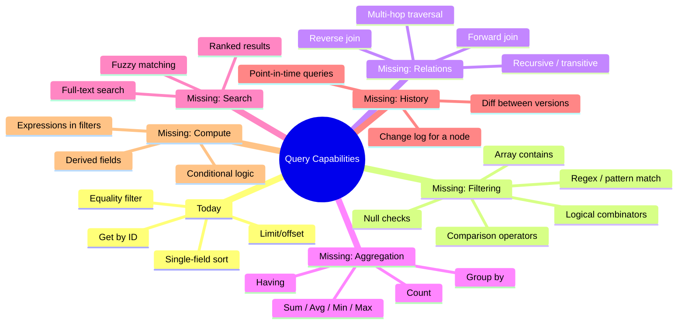

## Part 2: API Design Explorations

### Option A: Fluent Builder (Convex-Style)

A chainable API where each method narrows the query:

```typescript
// Simple
const tasks = useQuery(Task).collect()

// Filtered
const urgent = useQuery(Task)
  .where('status', '=', 'urgent')
  .where('dueDate', '<', new Date())
  .orderBy('dueDate', 'asc')
  .take(10)

// With join
const tasksWithComments = useQuery(Task)
  .where('status', '!=', 'done')
  .include({ comments: query(Comment).where('target', '=', ref('id')) })
  .collect()

// Reverse lookup
const commentsOnTask = useQuery(Comment)
  .where('target', '=', taskId)
  .include({ author: query(Person).where('did', '=', ref('createdBy')) })
  .collect()
```

**Pros**: Familiar to Convex/Prisma/Drizzle users. Each step is discoverable via autocomplete. Easy to conditionally add clauses.

**Cons**: Chainable APIs are hard to type correctly in TypeScript (each `.where()` should narrow the return type). Serialization for sync/cache is awkward (methods aren't JSON). Conditional composition requires breaking the chain.

### Option B: Declarative Object (Prisma-Style)

Queries are plain objects describing what you want:

```typescript
// Simple
const tasks = useQuery(Task, {})

// Filtered
const urgent = useQuery(Task, {
  where: {
    status: 'urgent',
    dueDate: { $lt: new Date() }
  },
  orderBy: { dueDate: 'asc' },
  limit: 10
})

// With join
const tasksWithComments = useQuery(Task, {
  where: { status: { $ne: 'done' } },
  include: {
    comments: { schema: Comment, on: 'target', reverse: true },
    parent: { on: 'parent' }
  }
})

// Aggregation
const stats = useQuery(Task, {
  where: { project: projectId },
  groupBy: 'status',
  aggregate: { count: { $count: true } }
})
```

**Pros**: JSON-serializable. Easy to store, compare, and cache. Familiar to MongoDB/Prisma users. Works well with TypeScript generics.

**Cons**: Deeply nested objects become hard to read. The `$` operator prefix feels foreign to some. Less discoverable than fluent chains.

### Option C: Hybrid — Object Query with Composable Helpers (Recommended)

Combine the readability of object queries with composable helper functions that provide autocomplete and type safety:

```typescript
// The core primitive: a query descriptor object
// Helper functions construct type-safe descriptors

// Simple list
const tasks = useQuery(Task)

// Get by ID
const task = useQuery(Task, taskId)

// Filtered
const urgent = useQuery(Task, {
  where: {
    status: eq('urgent'),
    dueDate: lt(new Date()),
    title: contains('auth')
  },
  orderBy: { dueDate: 'asc' },
  limit: 10
})

// With relations
const tasksWithComments = useQuery(Task, {
  where: { status: not(eq('done')) },
  include: {
    comments: from(Comment, 'target'), // reverse: Comments where target = this
    parent: follow('parent'), // forward: follow the parent relation
    assignees: follow('assignee') // forward: follow person relation
  }
})

// Deep inclusion
const project = useQuery(Project, projectId, {
  include: {
    tasks: from(Task, 'parent', {
      include: {
        comments: from(Comment, 'target'),
        subtasks: from(Task, 'parent')
      }
    })
  }
})
```

The key insight: **helper functions** (`eq`, `lt`, `contains`, `from`, `follow`) are where TypeScript type inference lives. The **object shape** is where composability and serializability live. Best of both worlds.

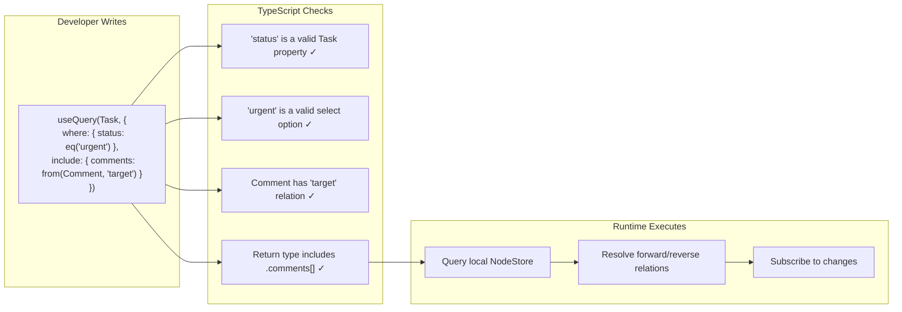

### Option D: Datalog-Style Logical Matching with Implicit Joins

The options above all inherit the SQL mental model: you pick a table, filter it, then explicitly declare joins. Datalog inverts this. You declare **patterns** with **logical variables**, and the engine figures out how to join them. There is no "join" keyword — shared variables across clauses _are_ the joins.

#### How Datomic Datalog Works (and Why It's Powerful)

In Datomic, every fact is a triple: `[entity attribute value]`. A query is a set of **clauses** that must all be true simultaneously. Variables (prefixed with `?`) unify across clauses — if `?task` appears in two clauses, it must be the same entity in both.

```clojure
;; "Find names of people who are friends with Alice"
[:find ?name
 :where
 [?alice :person/name "Alice"]     ;; bind ?alice to the entity named Alice
 [?alice :person/friend ?friend]   ;; ?alice's friends → bind ?friend
 [?friend :person/name ?name]]     ;; ?friend's name → bind ?name
```

There is no `JOIN` keyword. The shared variable `?alice` in clauses 1 and 2, and `?friend` in clauses 2 and 3, _is_ the join. The engine determines join order, index usage, and optimization automatically. This is profoundly different from SQL, where the developer must specify join mechanics.

#### Translating to TypeScript: `q()` — The Pattern Query

What if xNet had a Datalog-inspired API where **logical variables** replace explicit joins?

```typescript
import { q, $, find, where, rule } from '@xnet/query'

// ─── Simple: find all task titles ──────────────────────────
const tasks = useFind(
  find($task, 'title'),
  where([$task, 'schemaId', 'xnet://xnet.fyi/Task'], [$task, 'title', $title])
)
// → [{ $task: 'abc', title: 'Build auth' }, ...]

// ─── Implicit join: tasks with their comments ──────────────
const tasksWithComments = useFind(
  find($task, $comment),
  where(
    [$task, 'schemaId', 'xnet://xnet.fyi/Task'],
    [$task, 'status', 'todo'],
    [$comment, 'schemaId', 'xnet://xnet.fyi/Comment'],
    [$comment, 'target', $task] // ← THIS IS THE JOIN
  )
)
// No "include", no "from", no "follow". The shared $task IS the join.

// ─── Multi-hop: people who commented on tasks in a project ─
const collaborators = useFind(
  find($person),
  where(
    [$task, 'schemaId', 'xnet://xnet.fyi/Task'],
    [$task, 'parent', projectId], // task belongs to project
    [$comment, 'target', $task], // comment targets the task
    [$comment, 'createdBy', $person] // comment was created by person
  ),
  { distinct: true }
)
// Three "joins" — zero join syntax. Just shared variables.
```

The `$` prefix creates a logical variable (similar to Datomic's `?` prefix). Each clause is a triple pattern `[entity, property, value]` where any position can be a variable or a concrete value. The engine unifies all clauses and returns the bindings that satisfy all of them.

#### Schema-Aware Triple Patterns

Unlike raw Datomic where attributes are global keywords, xNet's triples are schema-aware. The engine knows that `'target'` on a Comment schema is a `relation()` property, and can use the relation index for reverse lookups:

```typescript
// The engine sees [$comment, 'target', $task] and knows:
// 1. 'target' is a relation property on Comment
// 2. $task is already bound from an earlier clause
// 3. → Use the relation index: byTarget($task) → comment IDs
// 4. This is O(k) not O(n) — no full scan needed
```

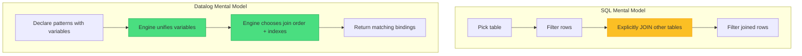

#### Recursive Queries with Rules

Datalog's killer feature for graph traversal: **rules** — named patterns that can reference themselves.

```typescript
// Define a recursive rule: "ancestor" means parent, or parent's parent, etc.
const ancestor = rule(
  'ancestor',
  // Base case: direct parent
  [$child, 'parent', $ancestor],
  // Recursive case: parent's ancestor
  [
    [$child, 'parent', $mid],
    ['ancestor', $mid, $ancestor] // self-reference!
  ]
)

// Use it: "find all ancestors of this task"
const allAncestors = useFind(
  find($ancestor),
  where(
    ancestor(taskId, $ancestor), // use the rule as a clause
    [$ancestor, 'title', $title] // also get their titles
  )
)

// "Find all descendants of a project (any depth)"
const allDescendants = useFind(
  find($descendant, $title, $status),
  where(
    ancestor($descendant, projectId), // reversed: descendant's ancestor is project
    [$descendant, 'schemaId', 'xnet://xnet.fyi/Task'],
    [$descendant, 'title', $title],
    [$descendant, 'status', $status]
  )
)
```

No `maxDepth`, no `reachable` configuration, no `traverse` arrays. Recursion is natural — it's just a rule that references itself. The engine handles cycle detection and fixpoint termination.

#### Aggregation in Datalog

```typescript
// "Count comments per task"
const commentCounts = useFind(
  find($task, $title, count($comment)),
  where(
    [$task, 'schemaId', 'xnet://xnet.fyi/Task'],
    [$task, 'parent', projectId],
    [$task, 'title', $title],
    [$comment, 'target', $task]
  )
)
// → [{ $task: 'abc', title: 'Build auth', count: 5 }, ...]

// "Tasks with more than 3 comments"
const activeTasks = useFind(
  find($task, $title, count($comment)),
  where(
    [$task, 'schemaId', 'xnet://xnet.fyi/Task'],
    [$task, 'title', $title],
    [$comment, 'target', $task]
  ),
  { having: { count: gt(3) } }
)
```

#### Negation and Disjunction

```typescript
// "Tasks with NO comments"
const uncommented = useFind(
  find($task),
  where(
    [$task, 'schemaId', 'xnet://xnet.fyi/Task'],
    not([$comment, 'target', $task]) // negation
  )
)

// "Tasks assigned to Alice OR Bob"
const teamTasks = useFind(
  find($task),
  where(
    [$task, 'schemaId', 'xnet://xnet.fyi/Task'],
    or([$task, 'assignee', aliceDID], [$task, 'assignee', bobDID])
  )
)
```

#### Filter Expressions in Datalog

```typescript
// "Overdue tasks"
const overdue = useFind(
  find($task, $title, $due),
  where(
    [$task, 'schemaId', 'xnet://xnet.fyi/Task'],
    [$task, 'title', $title],
    [$task, 'dueDate', $due],
    [$task, 'status', $status],
    pred($due, '<', new Date()), // predicate: $due < now
    pred($status, '!=', 'done')
  )
)
```

#### TypeScript Type Safety for Datalog

This is the hard part. Datomic's Datalog is dynamically typed — variables are untyped symbols. Can we make logical variables type-safe in TypeScript?

```typescript
// Approach: typed variable constructors
const $task = v<NodeId>('task')
const $title = v<string>('title')
const $status = v<'todo' | 'doing' | 'done'>('status')
const $comment = v<NodeId>('comment')
const $due = v<Date>('due')

// Now the find() return type is inferred:
const results = useFind(find($task, $title, $status), where(/* ... */))
// results.data: Array<{ task: NodeId, title: string, status: 'todo' | 'doing' | 'done' }>

// And predicates are type-checked:
pred($due, '<', new Date()) // OK: Date < Date
pred($due, '<', 'yesterday') // TS Error: string not assignable to Date
pred($status, '=', 'invalid') // TS Error: 'invalid' not in 'todo' | 'doing' | 'done'
```

The limitation: type inference can only flow from variable declarations, not from schema definitions. The engine can't know that `[$task, 'title', $title]` means `$title` must be a string without additional plumbing. Possible solutions:

1. **Typed triple helpers**: `clause(TaskSchema, 'title', $title)` where the schema constrains the value type
2. **Schema-registered variables**: `const $title = TaskSchema.var('title')` that carries the type
3. **Validate at runtime, trust at compile time**: accept `v<string>` as a developer annotation

```typescript
// Schema-aware clause builder (best type safety):
const results = useFind(
  find($task, $title, $status),
  where(
    match(Task, $task, { title: $title, status: $status }), // type-safe binding
    match(Comment, $comment, { target: $task }), // $task constrained to NodeId
    pred($status, '!=', 'done')
  )
)
```

The `match()` helper combines schema awareness with triple patterns. It expands to the same logical clauses but gives the type system enough information to infer variable types from the schema.

#### Evaluation: Datalog vs. The Other Options

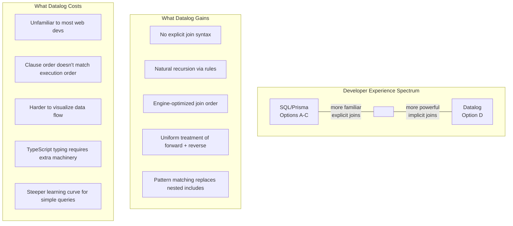

| Aspect             | Options A-C (SQL-family)                                      | Option D (Datalog)                                                       |
| ------------------ | ------------------------------------------------------------- | ------------------------------------------------------------------------ |
| **Simple CRUD**    | Natural: `useQuery(Task, { where: { status: eq('todo') } })`  | Verbose: `find($t), where([$t, 'schema', Task], [$t, 'status', 'todo'])` |
| **Forward join**   | `include: { parent: follow('parent') }`                       | `[$task, 'parent', $project]`                                            |
| **Reverse join**   | `include: { comments: from(Comment, 'target') }`              | `[$comment, 'target', $task]` — identical to forward                     |
| **Multi-hop**      | `traverse: [start(), reverse(), forward()]` — imperative path | Additional clauses with shared variables — declarative                   |
| **Recursion**      | `reachable: { through: 'parent', maxDepth: 10 }`              | `rule('ancestor', ...)` — native, no depth config                        |
| **Aggregation**    | `groupBy + aggregate` — separate concepts                     | `find($x, count($y))` — inline in find clause                            |
| **Negation**       | `where: { status: not(eq('done')) }`                          | `not([$task, 'status', 'done'])`                                         |
| **Learning curve** | Low — reads like Prisma/SQL                                   | High — requires understanding unification                                |
| **TypeScript fit** | Excellent — object shapes map to generics naturally           | Challenging — logical variables need extra type machinery                |

#### The Case For Offering Both

The ideal might be to **expose both APIs**, where the Prisma-style API (Option C) compiles down to Datalog evaluation internally:

```typescript
// Developer-facing: familiar API
useQuery(Task, {
  where: { status: not(eq('done')), parent: relatedTo(projectId) },
  include: { comments: from(Comment, 'target') }
})

// Power-user facing: Datalog API for complex queries
useFind(
  find($task, $title, count($comment)),
  where(
    match(Task, $task, { title: $title, status: $status }),
    pred($status, '!=', 'done'),
    match(Task, $task, { parent: projectId }),
    match(Comment, $comment, { target: $task })
  )
)

// Both compile to the same internal query plan
```

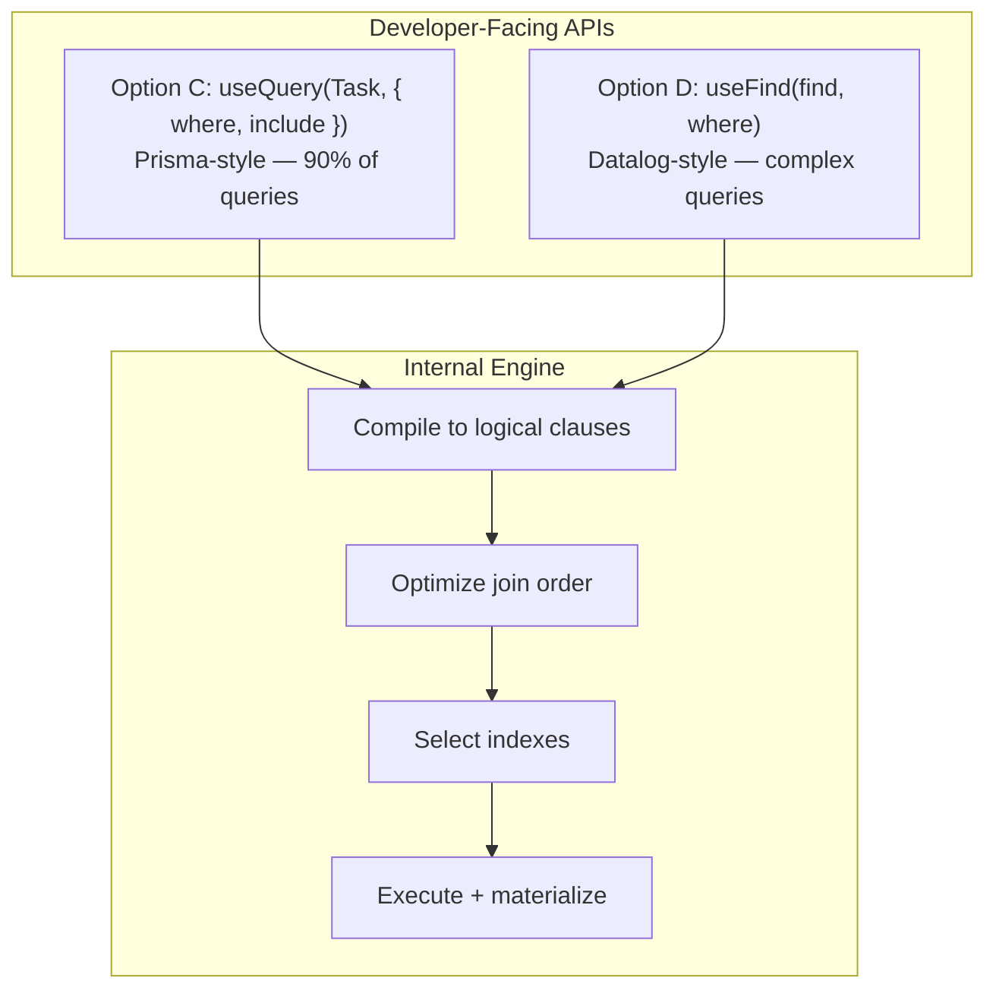

This is the approach DataScript takes: it offers both a pull API (tree-shaped, like Option C's `include`) and a Datalog query API. 90% of application code uses pull. The 10% that needs multi-hop joins, recursion, or complex aggregation uses Datalog.

#### When to Reach for Datalog

| Query Type                                            | Use Option C                    | Use Option D           |
| ----------------------------------------------------- | ------------------------------- | ---------------------- |
| List tasks with filters                               | Yes                             | Overkill               |
| Single node with related data                         | Yes (`include`)                 | Overkill               |
| "All users who commented on tasks in project X"       | Awkward (`traverse`)            | Natural (3 clauses)    |
| Recursive tree queries (all descendants)              | Limited (`reachable`)           | Native (`rule`)        |
| "Tasks where assignee's team is 'Engineering'"        | Complex (`relatedWhere` chains) | Natural (extra clause) |
| Graph analytics (shortest path, connected components) | Not possible                    | Possible with rules    |
| Ad-hoc exploration ("what connects A to B?")          | Not possible                    | Pattern matching       |

#### xNet-Specific Considerations for Datalog

**Local-first implications**: Datalog queries run against the local store, so they only see locally-synced data. A multi-hop query may produce incomplete results if intermediate nodes haven't been synced. The query result should include the same `completeness` / `stubs` metadata as Option C queries.

**Reactive Datalog**: Maintaining a live Datalog query subscription is more complex than a flat `where` subscription. When a change arrives, the engine must re-evaluate which variable bindings are affected. This is exactly the "incremental view maintenance" problem that Datalog research has solved (semi-naive evaluation, differential dataflow). Libraries like [Differential Datalog](https://github.com/vmware/differential-datalog) and [Materialize](https://materialize.com) demonstrate this at scale — xNet would need a much simpler version for client-side use.

**Schema as implicit clauses**: In Datomic, you write `[?task :task/status ?s]` and the `:task/` namespace implicitly scopes to the right entity type. In xNet, the `match()` helper serves this role — `match(Task, $task, { status: $status })` ensures that `$task` is bound to a Task node and `$status` to a valid status value.

**History in Datalog**: Datomic supports `(d/history db)` to query across all time. xNet could add a `history` modifier to triple patterns:

```typescript
// "When was this task's status changed to 'done', and by whom?"
const statusChanges = useFind(
  find($time, $author),
  where(history([$task, 'status', 'done', $time, $author])),
  { bind: { $task: taskId } }
)
```

## Part 3: The Complete Query API

### 3.1 Filter Operators

Every property type gets operators that make sense for its type:

```typescript
// ─── Equality ─────────────────────────────────────────────
where: { status: eq('urgent') }         // status === 'urgent'
where: { status: not(eq('done')) }       // status !== 'done'
where: { status: oneOf('todo', 'doing') } // status in ['todo', 'doing']

// ─── Comparison (number, date) ────────────────────────────
where: { priority: gt(3) }              // priority > 3
where: { priority: gte(3) }             // priority >= 3
where: { dueDate: lt(new Date()) }      // dueDate < now
where: { dueDate: between(start, end) } // start <= dueDate <= end

// ─── Text ─────────────────────────────────────────────────
where: { title: contains('auth') }      // title includes 'auth'
where: { title: startsWith('Sprint') }  // title starts with 'Sprint'
where: { title: matches(/^v\d+/) }      // regex match
where: { title: search('authentication flow') }  // full-text search

// ─── Null / Existence ─────────────────────────────────────
where: { parent: exists() }             // parent is not null/undefined
where: { deletedAt: isNull() }          // deletedAt is null

// ─── Array (multiSelect, multiple relations) ──────────────
where: { tags: includes('bug') }        // tags array contains 'bug'
where: { tags: includesAll('bug', 'critical') } // all present
where: { tags: includesAny('bug', 'feature') }  // any present

// ─── Logical Combinators ──────────────────────────────────
where: and(
  { status: eq('urgent') },
  or(
    { assignee: eq(aliceDID) },
    { assignee: eq(bobDID) },
  ),
)

// ─── Relation Filters (queries against the target) ────────
where: {
  parent: relatedTo(projectId),          // parent relation = projectId
  parent: relatedWhere({ status: eq('active') }), // parent's status = active
}
```

#### Type Safety for Operators

Each operator is generic and constrained to the property type:

```typescript
// Only text properties accept contains()
function contains(substring: string): TextFilter

// Only number/date properties accept gt()
function gt<T extends number | Date>(value: T): ComparisonFilter<T>

// Only select properties accept oneOf() with valid options
function oneOf<T extends string>(...values: T[]): SelectFilter<T>

// The where clause is typed per-schema
interface TaskWhere {
  title?: TextFilter | EqualityFilter<string>
  status?: SelectFilter<'todo' | 'doing' | 'done'> | EqualityFilter<string>
  priority?: ComparisonFilter<number> | EqualityFilter<number>
  dueDate?: ComparisonFilter<Date> | NullFilter
  parent?: RelationFilter | NullFilter
  assignee?: PersonFilter | NullFilter
}
```

This means `where: { priority: contains('x') }` is a **compile-time error** — `contains` returns `TextFilter`, but `priority` expects `ComparisonFilter<number>`.

### 3.2 Relation Queries (Joins)

Relations are the heart of the query system. Two primitives handle all join patterns:

```typescript
// follow(property) — forward: resolve a relation property to its target node
// from(Schema, property) — reverse: find nodes whose relation property points here

// ─── Forward: resolve a relation ──────────────────────────
const task = useQuery(Task, taskId, {
  include: {
    parent: follow('parent'), // Task.parent → Project node
    assignees: follow('assignee') // Task.assignee → Person DIDs
  }
})
// task.parent → FlatNode<ProjectProperties> | null
// task.assignees → DID[]

// ─── Reverse: find referencing nodes ──────────────────────
const task = useQuery(Task, taskId, {
  include: {
    comments: from(Comment, 'target'), // Comment.target → this task
    subtasks: from(Task, 'parent') // Task.parent → this task
  }
})
// task.comments → FlatNode<CommentProperties>[]
// task.subtasks → FlatNode<TaskProperties>[]

// ─── Nested: follow relations on included nodes ───────────
const project = useQuery(Project, projectId, {
  include: {
    tasks: from(Task, 'parent', {
      where: { status: not(eq('done')) },
      orderBy: { priority: 'desc' },
      limit: 20,
      include: {
        comments: from(Comment, 'target', {
          orderBy: { createdAt: 'desc' },
          limit: 5
        }),
        assignee: follow('assignee')
      }
    })
  }
})
// Fully typed: project.tasks[0].comments[0].content
```

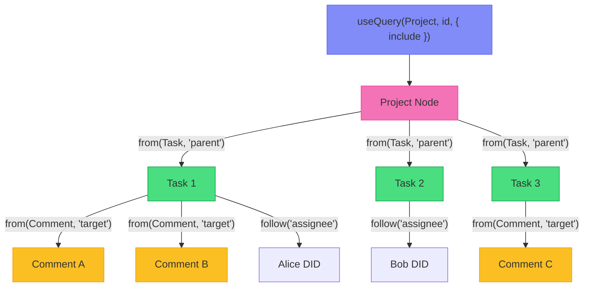

### 3.3 Graph Traversal

For queries that need to walk multiple hops or follow recursive structures:

```typescript
// ─── Multi-hop traversal ──────────────────────────────────
// "Find all users who have commented on tasks in this project"
const collaborators = useQuery(Person, {
  traverse: [
    start(Project, projectId),
    reverse(Task, 'parent'), // project ← tasks
    reverse(Comment, 'target'), // tasks ← comments
    forward('createdBy') // comments → person DID
  ],
  distinct: true
})

// ─── Recursive / transitive closure ───────────────────────
// "Find all descendant tasks (children, grandchildren, ...)"
const allDescendants = useQuery(Task, {
  reachable: {
    from: projectId,
    through: 'parent', // follow Task.parent edges
    direction: 'reverse', // find nodes whose parent = X, then recurse
    maxDepth: 10 // safety limit
  },
  where: { status: not(eq('done')) }
})

// ─── Shortest path ────────────────────────────────────────
// "How is this task connected to that project?"
const path = await store.query(Task, {
  path: {
    from: taskId,
    to: projectId,
    through: ['parent', 'subtasks'], // which relations to traverse
    maxDepth: 5
  }
})
// path → [taskId, intermediateId, ..., projectId]
```

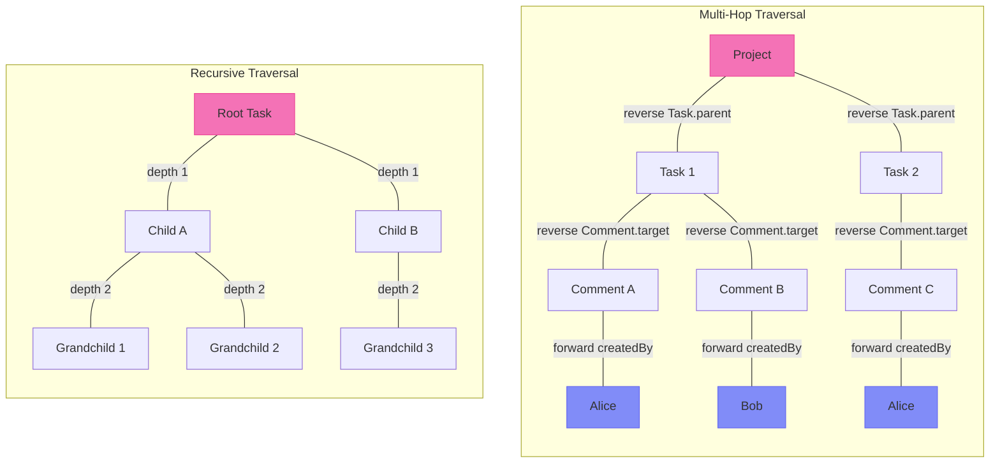

### 3.4 Aggregation

Aggregations compute summary values over query results:

```typescript
// ─── Simple count ─────────────────────────────────────────
const commentCount = useQuery(Comment, {
  where: { target: relatedTo(taskId) },
  aggregate: count()
})
// commentCount.data → 42

// ─── Multiple aggregates ─────────────────────────────────
const stats = useQuery(Task, {
  where: { project: relatedTo(projectId) },
  aggregate: {
    total: count(),
    avgPriority: avg('priority'),
    maxPriority: max('priority'),
    earliestDue: min('dueDate')
  }
})
// stats.data → { total: 25, avgPriority: 2.4, maxPriority: 5, earliestDue: Date }

// ─── Group by ─────────────────────────────────────────────
const byStatus = useQuery(Task, {
  where: { project: relatedTo(projectId) },
  groupBy: 'status',
  aggregate: {
    count: count(),
    avgPriority: avg('priority')
  }
})
// byStatus.data → [
//   { status: 'todo', count: 10, avgPriority: 2.1 },
//   { status: 'doing', count: 8, avgPriority: 3.0 },
//   { status: 'done', count: 7, avgPriority: 1.8 },
// ]

// ─── Group by with having ─────────────────────────────────
const busyAssignees = useQuery(Task, {
  where: { project: relatedTo(projectId) },
  groupBy: 'assignee',
  aggregate: { taskCount: count() },
  having: { taskCount: gt(5) }
})
```

### 3.5 Full-Text Search

Search is a first-class query operation, not a separate API:

```typescript
// ─── Basic search ─────────────────────────────────────────
const results = useQuery(Task, {
  search: 'authentication flow', // searches all text properties
  limit: 20
})
// results.data → ranked by relevance, with .score on each

// ─── Scoped search ────────────────────────────────────────
const results = useQuery(Task, {
  where: { project: relatedTo(projectId) },
  search: { query: 'auth', fields: ['title', 'description'] },
  limit: 20
})

// ─── Search + filters ─────────────────────────────────────
const results = useQuery(Task, {
  where: {
    status: not(eq('done')),
    title: search('authentication') // search on a specific field
  },
  orderBy: { _score: 'desc' } // explicit relevance sort
})

// ─── Cross-schema search ──────────────────────────────────
const everything = useSearch('authentication flow', {
  schemas: [Task, Comment, Page], // search across types
  limit: 20
})
// everything.data → mixed array with .schema discriminator
```

### 3.6 History Queries

Every node has a complete change history. The query API exposes this:

```typescript
// ─── Point-in-time snapshot ───────────────────────────────
const taskLastWeek = useQuery(Task, taskId, {
  at: new Date('2026-01-27') // node state at this moment
})

// ─── Change history for a node ────────────────────────────
const history = useQuery(Task, taskId, {
  history: {
    limit: 50,
    since: new Date('2026-01-01')
  }
})
// history.data → [
//   { timestamp, author, changes: { status: { from: 'todo', to: 'doing' } } },
//   { timestamp, author, changes: { title: { from: 'Old', to: 'New' } } },
// ]

// ─── Diff between two points ─────────────────────────────
const diff = useQuery(Task, taskId, {
  diff: { from: timestampA, to: timestampB }
})
// diff.data → { title: { before: 'v1', after: 'v2' }, status: { before: 'todo', after: 'done' } }

// ─── "What changed since I last looked?" ─────────────────
const recent = useQuery(Task, {
  where: { project: relatedTo(projectId) },
  changedSince: lastVisitTimestamp,
  orderBy: { updatedAt: 'desc' }
})
```

### 3.7 Computed / Virtual Fields

Fields that are computed at query time without being stored:

```typescript
const tasks = useQuery(Task, {
  where: { project: relatedTo(projectId) },
  compute: {
    isOverdue: expr((t) => t.dueDate < new Date() && t.status !== 'done'),
    daysSinceCreated: expr((t) => Math.floor((Date.now() - t.createdAt) / 86400000)),
    commentCount: count(from(Comment, 'target')),
    assigneeName: lookup(follow('assignee'), 'displayName')
  },
  where: { isOverdue: eq(true) }, // filter on computed field
  orderBy: { commentCount: 'desc' } // sort on computed field
})
// tasks.data[0].isOverdue → true
// tasks.data[0].commentCount → 7
```

## Part 4: The React Integration

### 4.1 `useQuery` — The Universal Hook

All query capabilities are accessible through a single hook with overloaded signatures:

```typescript
// ─── Overloads ────────────────────────────────────────────

// List all nodes of a schema
function useQuery<S>(schema: S): QueryResult<S[]>

// Get single node by ID
function useQuery<S>(schema: S, id: string): QueryResult<S | null>

// Get single node by ID with includes
function useQuery<S, I>(
  schema: S,
  id: string,
  options: QueryOptions<S, I>
): QueryResult<Expanded<S, I> | null>

// Query with filters, includes, aggregation, etc.
function useQuery<S, I>(schema: S, options: QueryOptions<S, I>): QueryResult<Expanded<S, I>[]>

// Aggregate query (returns summary, not nodes)
function useQuery<S, A>(schema: S, options: AggregateOptions<S, A>): QueryResult<A>
```

### 4.2 Reactive Subscriptions

Every `useQuery` call creates a live subscription. The query re-evaluates when:

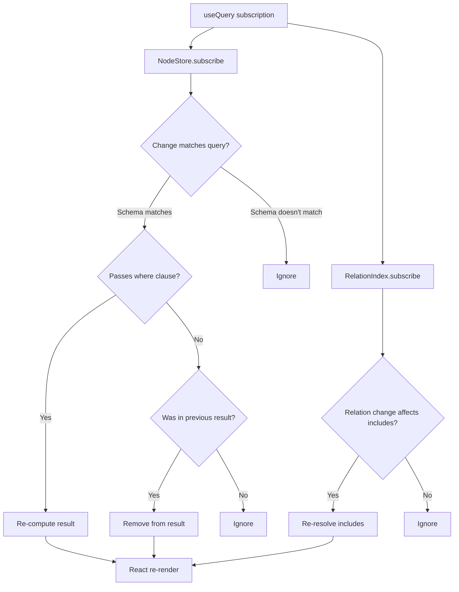

Incremental updates are critical. The subscription should NOT re-run the full query on every change — it should incrementally add/remove/update items in the result set.

### 4.3 Query Composition in Components

```typescript
function ProjectDashboard({ projectId }: { projectId: string }) {
  // Level 1: Project with its tasks
  const { data: project } = useQuery(Project, projectId, {
    include: {
      tasks: from(Task, 'parent', {
        where: { status: not(eq('done')) },
        orderBy: { priority: 'desc' },
        include: {
          assignee: follow('assignee'),
        },
      }),
    },
  })

  // Level 2: Aggregate stats (separate subscription, independent updates)
  const { data: stats } = useQuery(Task, {
    where: { parent: relatedTo(projectId) },
    groupBy: 'status',
    aggregate: { count: count() },
  })

  // Level 3: Recent activity
  const { data: recentComments } = useQuery(Comment, {
    where: { target: relatedTo(projectId) },
    orderBy: { createdAt: 'desc' },
    limit: 10,
    include: {
      author: follow('createdBy'),
      task: follow('target'),
    },
  })

  return (
    <div>
      <h1>{project?.title}</h1>
      <StatusChart data={stats} />
      <TaskList tasks={project?.tasks ?? []} />
      <ActivityFeed comments={recentComments ?? []} />
    </div>
  )
}
```

### 4.4 Conditional and Dynamic Queries

```typescript
// Query only runs when enabled
const { data } = useQuery(Task, {
  where: { assignee: eq(userId) },
  enabled: !!userId // skip if no userId
})

// Dynamic filter composition
function useFilteredTasks(filters: TaskFilters) {
  const where: TaskWhere = {}

  if (filters.status) where.status = eq(filters.status)
  if (filters.assignee) where.assignee = eq(filters.assignee)
  if (filters.search) where.title = search(filters.search)
  if (filters.overdue) where.dueDate = lt(new Date())

  return useQuery(Task, {
    where,
    orderBy: filters.orderBy ?? { createdAt: 'desc' },
    limit: filters.limit ?? 50
  })
}
```

## Part 5: The Store-Level Query Engine

### 5.1 Query Execution Pipeline

Under the React hook, the store processes queries through a pipeline:

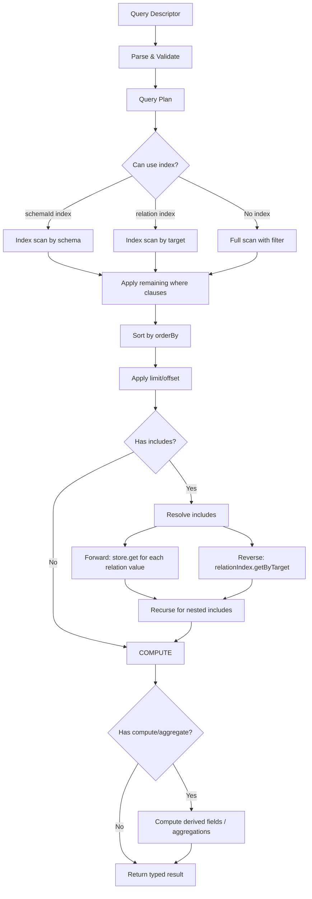

### 5.2 Store API

The store exposes a lower-level query method that the React hook wraps:

```typescript
interface NodeStore {
  // Existing
  get(id: NodeId): Promise<NodeState | null>
  list(options?: ListNodesOptions): Promise<NodeState[]>

  // New: unified query
  query<S extends DefinedSchema, I extends IncludeSpec>(
    schema: S,
    options?: StoreQueryOptions<S, I>
  ): Promise<QueryResultSet<S, I>>

  // New: reactive query (returns unsubscribe function)
  observe<S extends DefinedSchema, I extends IncludeSpec>(
    schema: S,
    options: StoreQueryOptions<S, I>,
    callback: (result: QueryResultSet<S, I>) => void
  ): () => void

  // New: aggregate query
  aggregate<S extends DefinedSchema, A extends AggregateSpec>(
    schema: S,
    options: StoreAggregateOptions<S, A>
  ): Promise<AggregateResult<A>>
}
```

### 5.3 Indexing Strategy

Performance depends on which operations can use indexes vs. full scans:

| Operation                 | Index Used                     | Complexity                    |
| ------------------------- | ------------------------------ | ----------------------------- |
| Filter by `schemaId`      | `bySchema` on nodes store      | O(k) where k = matching nodes |
| Get by ID                 | Primary key on nodes store     | O(1)                          |
| Filter by relation target | `byTarget` on relation_index   | O(k)                          |
| Filter by person          | `byDid` on person_index        | O(k)                          |
| Filter by property value  | None (full scan within schema) | O(n)                          |
| Full-text search          | Search index (future)          | O(k log n)                    |
| Sort by property          | None (in-memory sort)          | O(n log n)                    |
| Sort by `createdAt`       | `byCreatedAt` on nodes store   | O(k)                          |

For v1, property-value filters scan all nodes of a schema. This is acceptable for hundreds to low thousands of nodes (typical local-first scale). For larger datasets, property indexes can be added later:

```typescript
// Future: declare property indexes in schema
const TaskSchema = defineSchema({
  name: 'Task',
  namespace: 'xnet://xnet.fyi/',
  properties: { ... },
  indexes: [
    { name: 'byStatus', fields: ['status'] },
    { name: 'byAssigneeStatus', fields: ['assignee', 'status'] },
  ],
})
```

## Part 6: Type System Deep Dive

### 6.1 Inferring Query Results

The type system should know the exact shape of what the query returns:

```typescript
// Given schema
const TaskSchema = defineSchema({
  name: 'Task',
  namespace: 'xnet://xnet.fyi/',
  properties: {
    title: text({ required: true }),
    status: select({ options: ['todo', 'doing', 'done'] }),
    priority: number({}),
    parent: relation({ target: 'xnet://xnet.fyi/Project' }),
    assignee: person({})
  }
})

// Plain query returns FlatNode<TaskProperties>
const { data } = useQuery(TaskSchema)
// data: Array<{
//   id: string, schemaId: string, createdAt: number, ...
//   title: string, status?: string, priority?: number,
//   parent?: string, assignee?: string
// }>

// Query with includes returns expanded type
const { data } = useQuery(TaskSchema, taskId, {
  include: {
    parent: follow('parent'),
    comments: from(CommentSchema, 'target')
  }
})
// data: {
//   ...FlatNode<TaskProperties>,
//   parent: FlatNode<ProjectProperties> | null,
//   comments: FlatNode<CommentProperties>[],
// } | null

// Aggregate query returns aggregate type
const { data } = useQuery(TaskSchema, {
  aggregate: { total: count(), avgPriority: avg('priority') }
})
// data: { total: number, avgPriority: number }
```

### 6.2 Type-Safe Operators

Operators are constrained by the property type they apply to:

```typescript
// Type definitions (simplified)
type WhereClause<P extends Record<string, PropertyBuilder>> = {
  [K in keyof P]?: P[K] extends PropertyBuilder<string>
    ? StringFilter
    : P[K] extends PropertyBuilder<number>
      ? NumberFilter
      : P[K] extends PropertyBuilder<boolean>
        ? BooleanFilter
        : P[K] extends PropertyBuilder<Date>
          ? DateFilter
          : // ... etc
            Filter
}

type StringFilter =
  | ReturnType<typeof eq<string>>
  | ReturnType<typeof not<StringFilter>>
  | ReturnType<typeof contains>
  | ReturnType<typeof startsWith>
  | ReturnType<typeof matches>
  | ReturnType<typeof search>
  | ReturnType<typeof oneOf<string>>

type NumberFilter =
  | ReturnType<typeof eq<number>>
  | ReturnType<typeof gt<number>>
  | ReturnType<typeof gte<number>>
  | ReturnType<typeof lt<number>>
  | ReturnType<typeof lte<number>>
  | ReturnType<typeof between<number>>
  | ReturnType<typeof not<NumberFilter>>
```

### 6.3 Compile-Time Validation Examples

```typescript
// ERROR: 'color' is not a property of Task
useQuery(TaskSchema, { where: { color: eq('red') } })
//                               ~~~~~ TS Error

// ERROR: contains() not valid for number properties
useQuery(TaskSchema, { where: { priority: contains('high') } })
//                                         ~~~~~~~~ TS Error

// ERROR: 'author' is not a relation property on Task
useQuery(TaskSchema, taskId, { include: { author: follow('author') } })
//                                                        ~~~~~~~~ TS Error

// ERROR: CommentSchema doesn't have a 'parent' relation
useQuery(TaskSchema, taskId, { include: { comments: from(CommentSchema, 'parent') } })
//                                                                       ~~~~~~~~ TS Error

// OK: all types check out
useQuery(TaskSchema, {
  where: { status: eq('todo'), priority: gt(3) },
  include: { comments: from(CommentSchema, 'target') },
  orderBy: { priority: 'desc' }
})
```

## Part 7: Full-Text Search Architecture

### 7.1 Search Index

For local-first, the search index runs in the browser. Options:

| Library        | Size | Features                                      | Fit                            |
| -------------- | ---- | --------------------------------------------- | ------------------------------ |
| **MiniSearch** | 7KB  | Fuzzy, prefix, boost, auto-suggest            | Good for small-medium datasets |
| **FlexSearch** | 6KB  | Fastest JS search, preset profiles            | Good for speed-critical        |
| **Lunr**       | 8KB  | TF-IDF scoring, stemming, pipeline            | Good for relevance quality     |
| **Orama**      | 15KB | Full-featured, facets, typo tolerance, vector | Best feature set, larger       |

Recommendation: **MiniSearch** for v1 (tiny, well-maintained, good enough). Swap to Orama later if faceted search or vector similarity is needed.

### 7.2 Index Maintenance

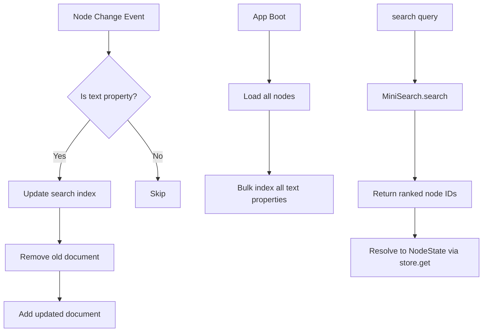

The search index is an in-memory structure rebuilt on app boot from the local NodeStore. It does NOT persist to IndexedDB (rebuilding from ~1000 nodes takes <50ms). Changes are applied incrementally as they arrive.

### 7.3 Search + Relation Queries

Search can combine with relation queries seamlessly:

```typescript
// "Find tasks in this project matching 'auth', with their comments"
const results = useQuery(Task, {
  where: {
    parent: relatedTo(projectId),
    title: search('authentication')
  },
  include: {
    comments: from(Comment, 'target', {
      where: { content: search('authentication') } // search in comments too
    })
  },
  orderBy: { _score: 'desc' }
})
```

## Part 8: History and Time-Travel Queries

### 8.1 How History Works

xNet already stores the full change log. Every property mutation is a `Change<NodePayload>` with a Lamport timestamp and wall clock time. To reconstruct state at any point:

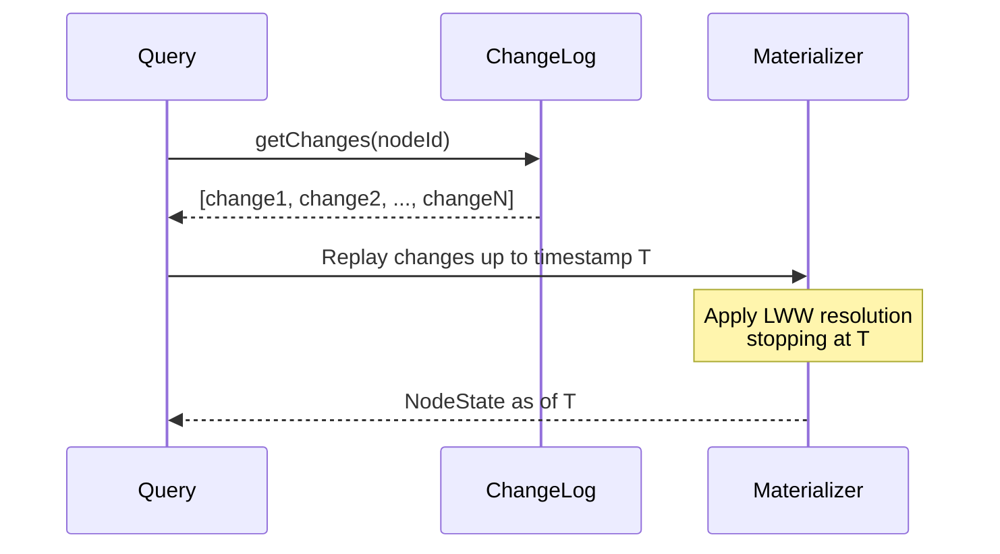

### 8.2 API Design

```typescript
// Point-in-time: what was this task's state last Tuesday?
const { data } = useQuery(Task, taskId, {
  at: new Date('2026-01-27T00:00:00Z')
})

// Change log: what changed and who changed it?
const { data: changes } = useHistory(Task, taskId, {
  since: new Date('2026-01-01'),
  until: new Date('2026-02-01'),
  limit: 100
})
// changes → [{
//   timestamp: Date,
//   author: DID,
//   properties: {
//     status: { from: 'todo', to: 'doing' },
//     assignee: { from: null, to: 'did:key:alice...' },
//   },
// }]

// Diff: what's different between two points?
const { data: diff } = useDiff(Task, taskId, {
  from: new Date('2026-01-20'),
  to: new Date('2026-01-27')
})
// diff → {
//   title: { before: 'Draft', after: 'Final Version' },
//   status: { before: 'todo', after: 'done' },
// }
```

### 8.3 History-Aware Includes

```typescript
// "What did this project look like last week, with its tasks at that point?"
const { data } = useQuery(Project, projectId, {
  at: lastWeek,
  include: {
    tasks: from(Task, 'parent', {
      at: lastWeek // tasks' state at the same point in time
    })
  }
})
```

This requires the relation index to also be time-aware — or to reconstruct the index state by replaying changes. For v1, time-travel on includes can be a separate feature.

## Part 9: Datalog Semantics Under the Hood

### 9.1 Why Datalog Matters

The query API looks like TypeScript, but the **evaluation model** can follow Datalog semantics. This matters for:

- **Recursive queries** (transitive closure) — Datalog handles these natively with fixpoint evaluation
- **Join ordering** — Datalog engines optimize join order automatically
- **Incremental maintenance** — Datalog's semi-naive evaluation enables efficient incremental updates

### 9.2 Translation to Datalog-Like Evaluation

```typescript
// This TypeScript query:
useQuery(Task, {
  where: { status: eq('todo'), parent: relatedTo(projectId) },
  include: { comments: from(Comment, 'target') }
})

// Translates internally to Datalog-like rules:
//
// result(TaskId, Title, Status) :-
//   node(TaskId, 'Task', Properties),
//   Properties.status = 'todo',
//   Properties.parent = ProjectId.
//
// result_comments(TaskId, CommentId, Content) :-
//   result(TaskId, _, _),
//   node(CommentId, 'Comment', CProps),
//   CProps.target = TaskId.
```

The query engine doesn't need to literally implement Datalog, but thinking in Datalog helps reason about:

- What can be answered with existing indexes
- What requires multi-pass evaluation
- Where incremental maintenance is possible

### 9.3 Incremental View Maintenance

Rather than re-running the full query on every change, the engine maintains materialized views:

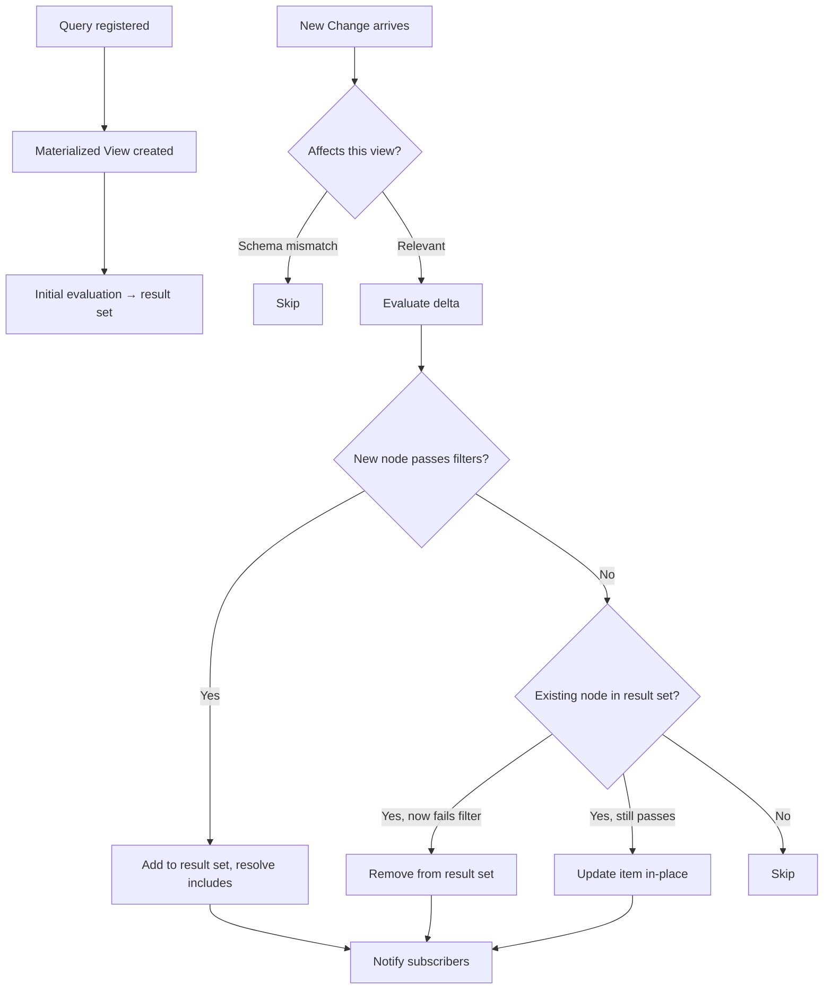

This is **dramatically more efficient** than re-running the full query. For a result set of 100 items and a single change, the incremental path touches 1 item instead of scanning 1000+.

## Part 10: Local-First Considerations

### 10.1 Partial Data and Stubs

In a decentralized system, a query may reference nodes that haven't been synced yet:

```typescript
const { data: task } = useQuery(Task, taskId, {
  include: {
    parent: follow('parent'), // parent node might not be synced
    comments: from(Comment, 'target') // some comments might be on other peers
  }
})

// task.parent might be:
// - Full FlatNode (synced and available)
// - Stub: { id: 'abc', _stub: true, _reason: 'not_synced' }
// - null (no parent relation set)
```

The query result includes a **completeness indicator**:

```typescript
interface QueryResult<T> {
  data: T
  loading: boolean
  error: Error | null

  // NEW: data completeness
  completeness: 'full' | 'partial' // are there stubs in the result?
  stubs: StubInfo[] // which nodes are missing?
  syncing: boolean // are we actively syncing missing data?
}

interface StubInfo {
  nodeId: string
  reason: 'not_synced' | 'no_access' | 'deleted'
  path: string // e.g., 'parent' or 'comments[2].author'
}
```

### 10.2 Optimistic Updates

Mutations immediately update the local query results before sync:

```typescript
const { mutate } = useMutate()
const { data: tasks } = useQuery(Task, { where: { status: eq('todo') } })

// This updates tasks immediately (optimistic), then syncs
await mutate.update(Task, taskId, { status: 'doing' })

// The task disappears from the 'todo' query result instantly
// No waiting for sync round-trip
```

This works because the query engine subscribes to the local NodeStore, which applies the change synchronously before broadcasting to peers.

### 10.3 Conflict-Aware Queries

```typescript
// Query nodes that have unresolved conflicts
const conflicted = useQuery(Task, {
  where: { _hasConflicts: eq(true) }
})

// Query with conflict details
const { data } = useQuery(Task, taskId, {
  includeConflicts: true
})
// data._conflicts → [
//   { property: 'status', localValue: 'doing', remoteValue: 'done',
//     localTimestamp, remoteTimestamp, resolvedTo: 'remote' }
// ]
```

## Part 11: Cross-Schema and Universal Queries

### 11.1 Multi-Schema Queries

Sometimes you need to query across types:

```typescript
// Search everything
const results = useSearch('authentication', {
  schemas: [Task, Comment, Page],
  limit: 20
})
// results.data → Array<
//   | { _schema: 'Task', ...FlatNode<TaskProperties> }
//   | { _schema: 'Comment', ...FlatNode<CommentProperties> }
//   | { _schema: 'Page', ...FlatNode<PageProperties> }
// >

// Recent activity across all schemas
const recent = useQuery(null, {
  // null schema = all schemas
  changedSince: lastVisitTimestamp,
  orderBy: { updatedAt: 'desc' },
  limit: 50
})
```

### 11.2 Schema-Aware Type Narrowing

```typescript
const results = useSearch('auth', { schemas: [Task, Comment] })

results.data.forEach((item) => {
  if (TaskSchema.is(item)) {
    // TypeScript narrows: item is FlatNode<TaskProperties>
    console.log(item.priority) // OK
  } else if (CommentSchema.is(item)) {
    // TypeScript narrows: item is FlatNode<CommentProperties>
    console.log(item.content) // OK
  }
})
```

## Part 12: Query DSL Comparison

How the xNet query API compares to prior art:

### SQL

```sql
SELECT t.*, COUNT(c.id) as comment_count
FROM tasks t
LEFT JOIN comments c ON c.target = t.id
WHERE t.status != 'done'
  AND t.project_id = :projectId
GROUP BY t.id
ORDER BY t.priority DESC
LIMIT 20
```

### xNet

```typescript
useQuery(Task, {
  where: { status: not(eq('done')), parent: relatedTo(projectId) },
  compute: { commentCount: count(from(Comment, 'target')) },
  orderBy: { priority: 'desc' },
  limit: 20
})
```

### Datomic Datalog

```clojure
[:find ?task ?title (count ?comment)
 :in $ ?project
 :where
 [?task :task/status ?s]
 [(not= ?s "done")]
 [?task :task/parent ?project]
 [?task :task/title ?title]
 [?comment :comment/target ?task]]
```

### xNet (equivalent)

```typescript
useQuery(Task, {
  where: { status: not(eq('done')), parent: relatedTo(projectId) },
  compute: { commentCount: count(from(Comment, 'target')) }
})
```

### Prisma

```typescript
prisma.task.findMany({
  where: { status: { not: 'done' }, projectId },
  include: { comments: true },
  orderBy: { priority: 'desc' },
  take: 20
})
```

### xNet Option C (Prisma-style, equivalent)

```typescript
useQuery(Task, {
  where: { status: not(eq('done')), parent: relatedTo(projectId) },
  include: { comments: from(Comment, 'target') },
  orderBy: { priority: 'desc' },
  limit: 20
})
```

### xNet Option D (Datalog-style, equivalent)

```typescript
useFind(
  find($task, $title, count($comment)),
  where(
    match(Task, $task, { title: $title, status: $status, parent: projectId }),
    pred($status, '!=', 'done'),
    match(Comment, $comment, { target: $task })
  ),
  { orderBy: { $title: 'asc' }, limit: 20 }
)
```

### Comparison Summary

| Dimension      | SQL            | Datomic             | Prisma          | xNet Option C         | xNet Option D         |
| -------------- | -------------- | ------------------- | --------------- | --------------------- | --------------------- |
| Join syntax    | `JOIN ... ON`  | Shared `?variables` | `include: {}`   | `from()` / `follow()` | Shared `$variables`   |
| Recursion      | CTEs (verbose) | Rules (native)      | None            | `reachable` (config)  | Rules (native)        |
| Type safety    | None           | None                | Generated types | Schema-inferred       | Typed variables       |
| Learning curve | Medium         | High                | Low             | Low                   | Medium-High           |
| Reactivity     | None           | None                | None            | Built-in              | Built-in              |
| Best for       | Reporting      | Graph queries       | CRUD apps       | 90% of app queries    | Complex graph queries |

The xNet Option C API is closest to Prisma in syntax and covers the vast majority of application queries. Option D provides an escape hatch for the 10% of queries that need Datalog-level expressiveness — multi-hop joins, recursion, graph analytics — without requiring a separate query engine.

## Part 13: Implementation Roadmap

### Phase 1: Enhanced Filtering (Foundation)

| Task                                                           | Effort | Builds On                      |
| -------------------------------------------------------------- | ------ | ------------------------------ |
| Filter operator functions (`eq`, `gt`, `lt`, `contains`, etc.) | M      | Nothing — pure functions       |
| `WhereClause<P>` typed per schema                              | M      | Existing schema type inference |
| Update `useQuery` to accept operators (backward-compatible)    | M      | Current `useQuery`             |
| Logical combinators (`and`, `or`, `not`)                       | S      | Filter operators               |

### Phase 2: Relation Queries

| Task                                       | Effort | Builds On                      |
| ------------------------------------------ | ------ | ------------------------------ |
| `follow(property)` for forward joins       | M      | Relation index (0040 Phase 2a) |
| `from(Schema, property)` for reverse joins | M      | Relation index                 |
| Nested includes with sub-queries           | L      | Forward + reverse joins        |
| `relatedTo()` filter operator              | S      | Relation index                 |

### Phase 3: Aggregation + Compute

| Task                                          | Effort | Builds On                           |
| --------------------------------------------- | ------ | ----------------------------------- |
| `count()`, `sum()`, `avg()`, `min()`, `max()` | M      | Query engine                        |
| `groupBy` support                             | M      | Aggregation functions               |
| `compute` for virtual fields                  | L      | Query engine + expression evaluator |
| `having` clause for group filters             | S      | `groupBy`                           |

### Phase 4: Full-Text Search

| Task                                   | Effort | Builds On                     |
| -------------------------------------- | ------ | ----------------------------- |
| Integrate MiniSearch                   | M      | Nothing — standalone          |
| Index maintenance on NodeStore changes | S      | MiniSearch + store subscribe  |
| `search()` filter operator             | S      | MiniSearch integration        |
| `useSearch()` cross-schema hook        | M      | Search + multi-schema results |
| Relevance scoring + `_score` ordering  | S      | MiniSearch                    |

### Phase 5: History + Time Travel

| Task                                  | Effort | Builds On                       |
| ------------------------------------- | ------ | ------------------------------- |
| `useHistory()` hook for change log    | M      | Existing change store           |
| `useDiff()` hook for property diffs   | M      | Change log                      |
| `at` option for point-in-time queries | L      | Change replay + materialization |
| History-aware includes                | L      | Point-in-time + relation index  |

### Phase 6: Graph Traversal

| Task                               | Effort | Builds On                  |
| ---------------------------------- | ------ | -------------------------- |
| `traverse()` multi-hop queries     | L      | Relation index             |
| `reachable` for transitive closure | L      | Traverse + cycle detection |
| `path` for shortest path queries   | L      | BFS over relation index    |
| Incremental view maintenance       | XL     | Full query engine          |

### Phase 7: Property Indexes

| Task                                | Effort | Builds On                  |
| ----------------------------------- | ------ | -------------------------- |
| Schema-declared property indexes    | M      | IndexedDB schema extension |
| Query planner: choose index vs scan | L      | Property indexes           |
| Compound indexes                    | L      | Property indexes           |

## Open Questions

1. **Operator syntax**: Should operators be function calls (`eq('urgent')`) or object literals (`{ $eq: 'urgent' }`)? Functions give better autocomplete and type inference. Objects are more JSON-serializable. Leaning toward functions since queries don't need to cross a wire (local-first).

2. **Include depth limits**: Should nested includes have a maximum depth? Unbounded recursive includes could pull the entire graph into memory. Default max depth of 3 with explicit opt-in for deeper seems reasonable.

3. **Aggregation reactivity**: Should aggregate queries (`count`, `avg`) be reactive? A comment count that updates in real-time is powerful but requires maintaining the aggregation incrementally. For v1, aggregates could be non-reactive (re-compute on explicit reload), with reactive aggregates as a later optimization.

4. **Search index persistence**: Rebuilding the search index from scratch on every app boot is fast for ~1000 nodes but won't scale to 100k+. Should the search index persist to IndexedDB? This adds complexity (index versioning, incremental updates on boot) but improves cold start time.

5. **Query serialization**: If queries need to be stored (saved views, shared filters), function-based operators (`eq()`, `gt()`) need a serialization format. Consider: each operator returns a serializable descriptor `{ op: 'eq', value: 'urgent' }` that also happens to carry TypeScript type info.

6. **Backward compatibility**: The current `useQuery` accepts `{ where: { status: 'urgent' } }` (plain value = equality). Should this continue to work alongside `{ where: { status: eq('urgent') } }`? Yes — plain values desugar to `eq()` internally. This makes the migration path zero-cost.

7. **AI-native queries**: Convex positions itself as "AI-native." Should xNet's query format be designed for LLM generation? The JSON-object approach with function operators is LLM-friendly — models can construct queries from natural language more easily than fluent chains. Consider providing a `queryFromNaturalLanguage(schema, prompt)` helper that uses the schema to generate valid queries.

8. **Dual API cost**: Offering both Option C (Prisma-style) and Option D (Datalog-style) means two APIs to document, test, and maintain. Is the 10% of queries that benefit from Datalog worth the maintenance cost? Alternatively, could Option C's `traverse` / `reachable` cover enough graph queries to defer Datalog entirely? The Datomic ecosystem suggests that once developers learn Datalog, they prefer it even for simple queries — but the learning curve is real and may conflict with the "familiar to web devs" design principle.

9. **Datalog variable scoping**: In Datomic, variables are scoped to a single query. Should xNet's `$variables` be reusable across queries (e.g., for correlated subqueries or inter-component shared bindings)? Probably not — per-query scoping is simpler and avoids subtle bugs.

10. **Property selection revisited**: If xNet ever supports a "thin client" mode (e.g., a web app that queries a remote peer without syncing the full dataset), property selection becomes relevant again — it would reduce wire payload from the remote peer. Should the query API support `select` as a no-op hint today that becomes meaningful later, or should it only be added when the use case materializes?

## Part 14: Property Selection (GraphQL/Pull-Style Whitelisting)

### The Idea

GraphQL's core innovation is that the client declares the **shape** of data it wants, and the server returns exactly that — no more, no less:

```graphql
# GraphQL: only fetch what the component needs
query {
  task(id: "abc") {
    title
    status
    comments {
      content
      createdBy
    }
  }
}
```

Datomic's Pull API does the same:

```clojure
;; Datomic Pull: specify which attributes to return
(d/pull db [:task/title :task/status {:task/comments [:comment/content :comment/createdBy]}] task-id)
```

Should xNet's query API support a `select` clause that whitelists which properties to return?

```typescript
// Hypothetical: only return title and status, not priority, dueDate, etc.
const { data } = useQuery(Task, {
  select: ['title', 'status'],
  where: { status: eq('todo') }
})
// data[0].title → "Build auth"   ✓
// data[0].status → "todo"        ✓
// data[0].priority → undefined   (not selected)

// With includes: specify shape at each level
const { data } = useQuery(Task, taskId, {
  select: ['title', 'status'],
  include: {
    comments: from(Comment, 'target', {
      select: ['content', 'createdBy']
    })
  }
})
```

### Why This Matters in Client-Server Architectures

In GraphQL/REST, property selection solves three real problems:

1. **Network bandwidth**: Don't send fields the client doesn't need over the wire
2. **Server computation**: Don't resolve expensive computed fields unless asked for
3. **Security**: Don't expose sensitive fields to clients that shouldn't see them

### Why Most of This Doesn't Apply to xNet

xNet is **local-first**. The query runs against the local IndexedDB store. The data is already on the device. This fundamentally changes the calculus:

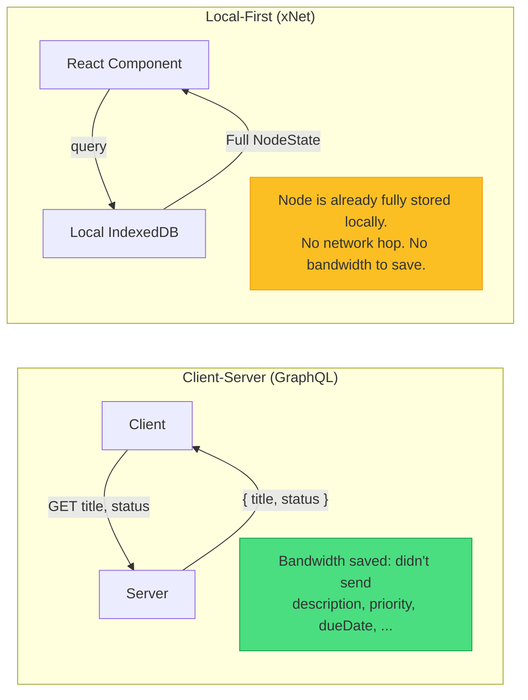

#### Problem 1: Network Bandwidth — Not Applicable

Nodes are synced to the local store as complete `Change<NodePayload>` records. Each change contains a sparse set of properties, but the materialized `NodeState` contains all properties. By the time a query runs, the full node is already in IndexedDB. Returning 3 properties vs. 15 properties from a local `store.get()` call saves zero network bytes.

Could we sync only selected properties? **No.** The sync architecture requires full changes for correctness:

- **Ed25519 signatures** cover the entire `Change<NodePayload>` including all properties in the change. You can't strip properties without invalidating the signature.
- **BLAKE3 content hashes** are computed over the full change payload. Partial payloads would break the hash chain.
- **LWW conflict resolution** needs all property timestamps to determine which values win. If a peer only received `title` and `status`, it couldn't resolve conflicts on `priority`.
- **Change replay** (for history, time-travel, materialization) requires the full payload. Partial changes would create incomplete snapshots.

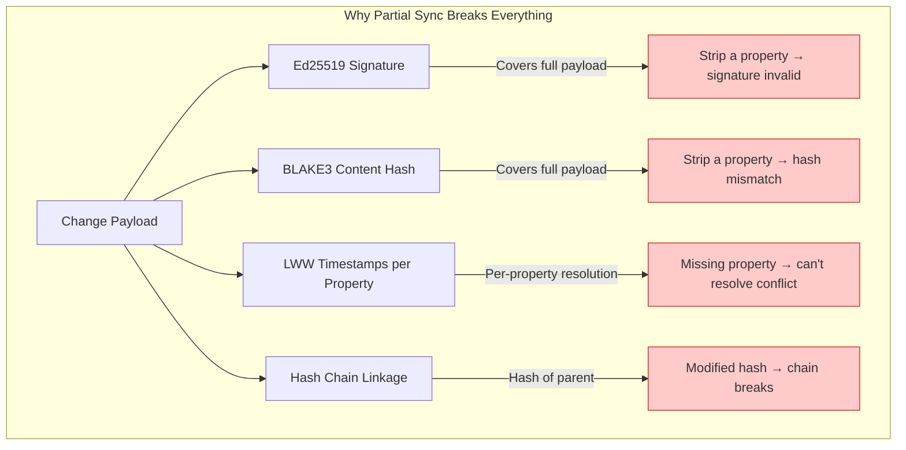

#### Problem 2: Computation Cost — Marginal

Reading 3 properties vs. 15 from a JavaScript object is effectively free. The cost is dominated by IndexedDB deserialization, which happens at the node level regardless of how many properties you read. There is no per-property I/O cost.

The one exception is **computed properties** (rollups, formulas). If a `select` clause omits a rollup, the engine could skip computing it. But this is better handled by making computed properties lazy by default — only compute when accessed, not when fetched.

#### Problem 3: Security — Handled at the Scope Level

In GraphQL, field-level access control prevents exposing sensitive data. In xNet, privacy is enforced at the **scope level** (see [Exploration 0040, Part 4](./0040_FIRST_CLASS_RELATIONS.md#part-4-the-privacy-scoped-graph)). If you have access to a node's scope, you have access to all its properties. Field-level redaction doesn't exist because the full node is already on your device.

### Where Property Selection Does Have Value

Despite the above, there are a few legitimate use cases:

#### 1. React Render Optimization

If `useQuery` returns full nodes and a component only reads `title`, it will still re-render when `priority` changes — because the node object reference changed. Property selection could enable **fine-grained subscriptions**:

```typescript
// Without select: re-renders on ANY property change
const { data } = useQuery(Task, taskId)
// Component only reads data.title, but re-renders when data.priority changes

// With select: only re-renders when selected properties change
const { data } = useQuery(Task, taskId, { select: ['title', 'status'] })
// data is { title, status } — only re-renders when title or status changes
```

This is a real optimization, but it's better solved with **selector functions** (like Zustand/Redux selectors) or **structural sharing** (like React Query) rather than a query-level `select` clause:

```typescript
// Better approach: selector at the hook level
const title = useQuery(Task, taskId, { select: (task) => task.title })
// Only re-renders when task.title actually changes (referential equality check)
```

#### 2. Memory Reduction for Large Result Sets

If you're loading 10,000 tasks for a reporting view and only need `title` and `status`, holding 10,000 full node objects in React state wastes memory. A `select` clause could project to lighter objects:

```typescript
// 10,000 full nodes: ~40 bytes × 15 properties × 10,000 = ~6MB
const { data } = useQuery(Task, { limit: 10000 })

// 10,000 projected nodes: ~40 bytes × 2 properties × 10,000 = ~800KB
const { data } = useQuery(Task, { select: ['title', 'status'], limit: 10000 })
```

This is meaningful at scale. But 10,000 nodes in a local-first app is already unusual — if you're hitting this, pagination is probably the better answer.

#### 3. TypeScript DX: Narrowing the Return Type

A `select` clause narrows the return type, which can improve developer experience:

```typescript
// Without select: full type, 15+ properties
const { data } = useQuery(Task)
// data[0] is FlatNode<TaskProperties> — lots of optional properties

// With select: only the properties you asked for
const { data } = useQuery(Task, { select: ['title', 'status'] as const })
// data[0] is Pick<FlatNode<TaskProperties>, 'id' | 'title' | 'status'>
```

But this is marginal — TypeScript autocomplete already handles large types well, and the `select` clause adds another concept to learn.

### Recommendation: Don't Add `select` to v1

Property selection in a local-first architecture is **solving problems that don't exist** at the storage/sync layer. The three traditional benefits (bandwidth, computation, security) don't apply because:

- Full nodes are already local — no network savings
- Property reads from JS objects are free — no computation savings
- Privacy is scope-level — no field-level security needed
- Partial sync would break signatures, hashes, LWW, and the change chain

The minor benefits (React render optimization, memory reduction) are better addressed by:

- **Selector functions** on the hook: `useQuery(Task, id, { select: (t) => t.title })` — familiar from Zustand/React Query, no new query concept
- **Pagination** for large result sets — the actual fix for memory pressure
- **Lazy computed properties** — don't evaluate rollups until accessed

If property selection is ever needed, it should be a **post-query projection** at the React layer, not a core query primitive:

```typescript
// Recommended: projection as a selector function (like React Query)
const { data: title } = useQuery(Task, taskId, {
  select: (task) => task?.title
})

// NOT recommended: projection as a query primitive
const { data } = useQuery(Task, taskId, {
  select: ['title'] // adds complexity to the query engine for minimal benefit
})
```

### Comparison: Where Each System Needs Property Selection

| System          | Storage         | Query Runs              | Property Selection Needed?                                 |
| --------------- | --------------- | ----------------------- | ---------------------------------------------------------- |
| **GraphQL**     | Server DB       | Server → wire → client  | **Yes** — saves bandwidth and server compute               |
| **Prisma**      | Server DB       | Server → wire → client  | **Yes** — `select` avoids fetching large BLOBs             |
| **Datomic**     | Server DB       | Server → wire → client  | **Useful** — Pull API shapes the response                  |
| **Convex**      | Cloud DB        | Cloud → wire → client   | **Yes** — reactive queries re-run on server                |
| **xNet**        | Local IndexedDB | Local store → JS object | **No** — data is already local, full nodes are cheap       |
| **TinyBase**    | Local memory    | Memory → JS object      | **No** — same reasoning as xNet                            |
| **ElectricSQL** | Local SQLite    | Local DB → JS object    | **Marginal** — SQLite can skip columns, but rows are small |

## Conclusion

The unified query API transforms xNet from "a store with basic CRUD" to "a reactive, graph-aware, local-first database with the query power of Datomic and the ergonomics of Prisma." The key architectural insight is that **two complementary APIs can share one engine**: Option C (Prisma-style `useQuery` with `where`, `include`, `from`, `follow`) handles 90% of application queries with near-zero learning curve, while Option D (Datalog-style `useFind` with logical variables and pattern matching) handles the remaining 10% — multi-hop joins, recursive traversals, graph analytics — that would be awkward or impossible in a SQL-family syntax. Both compile to the same internal logical clauses and share the same query planner, index selection, and incremental view maintenance. This gives:

- **Autocomplete**: Functions like `eq()`, `from()`, `follow()` are discoverable in any IDE
- **Type safety**: Invalid queries are compile-time errors, not runtime surprises
- **Composability**: Queries are values — store them, combine them, pass them around
- **Reactivity**: Every query is a live subscription by default
- **Serializability**: Operator functions return plain descriptors that can be serialized
- **Familiarity**: Looks like Prisma/Drizzle to web developers, acts like Datalog under the hood

The implementation is incremental: Phase 1 (enhanced filtering) can ship independently and is backward-compatible with today's `useQuery`. Each subsequent phase adds capabilities without breaking existing queries.
