# Documentation Site: Starlight Integration & Content Strategy

> **Date**: February 2026
> **Status**: Completed
> **Goal**: Add a comprehensive, engaging documentation site to the existing xNet landing page using Astro Starlight

## Implementation Status

- [x] **Starlight integration** — `@astrojs/starlight` configured in `site/astro.config.mjs`
- [x] **Content structure** — 40+ MDX files in `site/src/content/docs/docs/`
- [x] **React hooks documentation** — `useQuery`, `useMutate`, `useNode`, `useIdentity` pages
- [x] **Schema documentation** — `defineSchema`, property types, relations, type inference
- [x] **Concept pages** — local-first, CRDTs, sync architecture, identity model, cryptography, data model
- [x] **Guide pages** — sync, offline, collaboration, plugins, electron, testing, canvas, editor, devtools
- [x] **Architecture pages** — overview, decisions, package graph
- [x] **Contributing pages** — getting started, code style, testing
- [x] **AI documentation** — understanding-xnet.mdx for AI agents
- [x] **Theme customization** — Dark theme matching landing page
- [x] **Navigation sidebar** — Organized by category with collapsible sections

---

## Executive Summary

xNet has excellent internal documentation (TRADEOFFS.md, VISION.md, 45 explorations, detailed plan docs) but almost no public-facing developer documentation. The `@xnetjs/react` README is the only package with real API docs. The `@xnetjs/data` README still describes a deprecated API. `@xnetjs/sync` has no README at all.

This exploration designs a documentation site that:

1. Integrates into the existing Astro site (Starlight alongside the custom landing page)
2. Prioritizes React hooks documentation (what 90% of developers will interact with)
3. Uses Mermaid diagrams, interactive elements, and progressive disclosure to make docs engaging
4. Follows the Diátaxis framework (tutorials, guides, reference, explanation)
5. Establishes patterns that scale as the project grows

---

## Table of Contents

1. [Technical Integration: Starlight + Existing Site](#1-technical-integration)
2. [Information Architecture](#2-information-architecture)
3. [Content Priority & Ordering](#3-content-priority--ordering)
4. [React Hooks Deep-Dive (The Core of the Docs)](#4-react-hooks-deep-dive)
5. [Making Docs Fun, Intuitive & Interactive](#5-making-docs-fun-intuitive--interactive)
6. [Mermaid Diagrams Strategy](#6-mermaid-diagrams-strategy)
7. [Visual Design & Theme](#7-visual-design--theme)
8. [Plugins & Tooling](#8-plugins--tooling)
9. [Content Templates](#9-content-templates)
10. [Implementation Plan](#10-implementation-plan)

---

## 1. Technical Integration

### How Starlight Coexists with the Landing Page

Starlight is an Astro integration that owns `src/content/docs/` while regular Astro pages live in `src/pages/`. They coexist cleanly:

```
site/
  src/
    content/
      docs/           # ← Starlight owns this
        index.mdx     # → /docs/
        quickstart.mdx
        hooks/
          useQuery.mdx
          useMutate.mdx
          useNode.mdx
        ...
    pages/
      index.astro     # ← Custom landing page (untouched)
    components/
      sections/       # ← Existing landing page components
      ui/             # ← Existing UI components
      docs/           # ← NEW: custom components for docs (demos, diagrams)
    styles/
      docs.css        # ← Starlight theme overrides
  content.config.ts   # ← NEW: Starlight content collection config
  astro.config.mjs    # ← Updated: add starlight() integration
```

### Configuration

```typescript
// astro.config.mjs
import { defineConfig } from 'astro/config'
import starlight from '@astrojs/starlight'
import tailwind from '@astrojs/tailwind'

export default defineConfig({
  site: 'https://xnet.fyi',
  base: '/',
  integrations: [
    starlight({
      title: 'xNet',
      customCss: ['./src/styles/docs.css'],
      social: [{ icon: 'github', label: 'GitHub', href: 'https://github.com/crs48/xNet' }],
      editLink: {
        baseUrl: 'https://github.com/crs48/xNet/edit/main/site/'
      },
      sidebar: [
        /* see Section 2 */
      ]
    }),
    tailwind()
  ]
})
```

### Content Config

```typescript
// content.config.ts
import { defineCollection } from 'astro:content'
import { docsLoader } from '@astrojs/starlight/loaders'
import { docsSchema } from '@astrojs/starlight/schema'

export const collections = {
  docs: defineCollection({ loader: docsLoader(), schema: docsSchema() })
}
```

### Key Decision: Docs at `/docs/` or Root?

**Recommendation: `/docs/`** — Keep the landing page at `/` (the marketing/recruitment page) and docs at `/docs/`. The landing page links to `/docs/` via the "Get Started" CTA. This is the pattern used by Vite, Astro itself, Tailwind, and most DevTools.

---

## 2. Information Architecture

### Diátaxis-Aligned Structure

The Diátaxis framework defines four documentation modes. Each serves a different user need and should not be mixed:

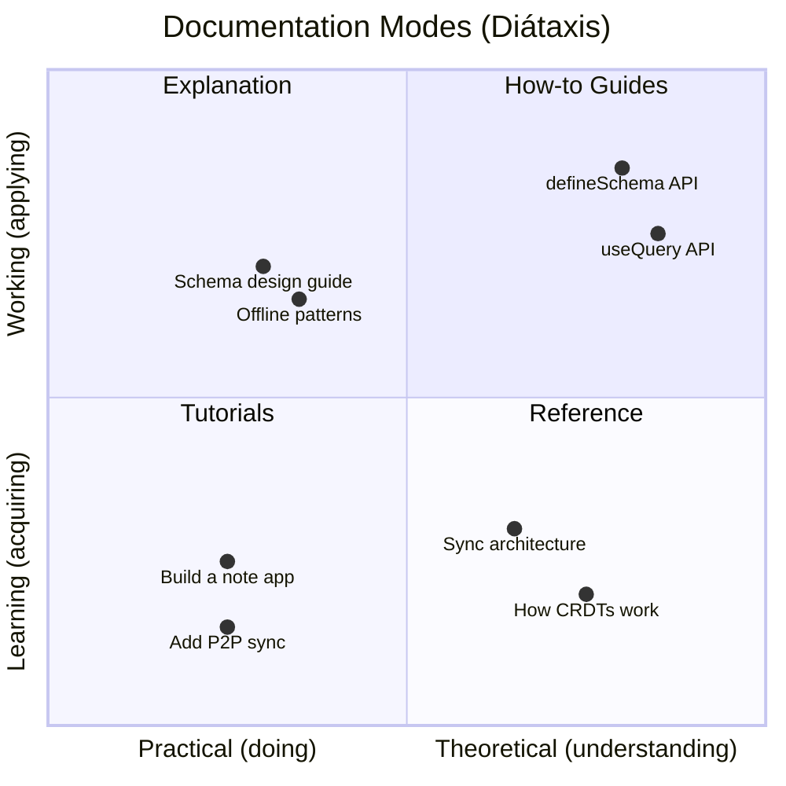

### Sidebar Structure

```typescript
sidebar: [
  // ─── Onboarding ─────────────────────────────────
  {
    label: 'Start Here',
    items: [{ slug: 'introduction' }, { slug: 'quickstart' }, { slug: 'core-concepts' }]
  },

  // ─── The Main Event: React Hooks ────────────────
  {
    label: 'React Hooks',
    items: [
      { slug: 'hooks/overview' },
      { slug: 'hooks/useQuery' },
      { slug: 'hooks/useMutate' },
      { slug: 'hooks/useNode' },
      { slug: 'hooks/useIdentity' },
      { slug: 'hooks/useComments' },
      { slug: 'hooks/useHistory' },
      { slug: 'hooks/patterns' }
    ]
  },

  // ─── Schema System ──────────────────────────────
  {
    label: 'Schemas & Data',
    items: [
      { slug: 'schemas/overview' },
      { slug: 'schemas/defineSchema' },
      { slug: 'schemas/property-types' },
      { slug: 'schemas/relations' },
      { slug: 'schemas/built-in-schemas' },
      { slug: 'schemas/type-inference' }
    ]
  },

  // ─── Guides ─────────────────────────────────────
  {
    label: 'Guides',
    items: [
      { slug: 'guides/sync' },
      { slug: 'guides/offline' },
      { slug: 'guides/identity' },
      { slug: 'guides/collaboration' },
      { slug: 'guides/plugins' },
      { slug: 'guides/electron' },
      { slug: 'guides/testing' }
    ]
  },

  // ─── Understanding ──────────────────────────────
  {
    label: 'Concepts',
    collapsed: true,
    items: [
      { slug: 'concepts/local-first' },
      { slug: 'concepts/crdts' },
      { slug: 'concepts/sync-architecture' },
      { slug: 'concepts/identity-model' },
      { slug: 'concepts/cryptography' },
      { slug: 'concepts/data-model' }
    ]
  },

  // ─── Package Reference ──────────────────────────
  {
    label: 'Packages',
    collapsed: true,
    autogenerate: { directory: 'packages' }
  },

  // ─── Architecture ───────────────────────────────
  {
    label: 'Architecture',
    collapsed: true,
    items: [
      { slug: 'architecture/overview' },
      { slug: 'architecture/decisions' },
      { slug: 'architecture/package-graph' }
    ]
  },

  // ─── Contributing ───────────────────────────────
  {
    label: 'Contributing',
    collapsed: true,
    items: [
      { slug: 'contributing/getting-started' },
      { slug: 'contributing/code-style' },
      { slug: 'contributing/testing' },
      { slug: 'contributing/good-first-issues' }
    ]
  }
]
```

### Sidebar Annotations

Starlight supports badges on sidebar items via frontmatter:

```yaml
---
title: useQuery
sidebar:
  badge:
    text: Core
    variant: success
---
```

Use badges for: `Core` (green) on the three main hooks, `New` (blue) on recently added features, `Beta` (yellow) on unstable APIs, `Advanced` (default) on deep-dive pages.

---

## 3. Content Priority & Ordering

### Phase 1: The Essential Path (write first)

These pages represent the 80/20 — what 80% of developers need 80% of the time:

| Priority | Page           | Type        | Why First                                |
| -------- | -------------- | ----------- | ---------------------------------------- |
| **P0**   | Quick Start    | Tutorial    | First thing every developer reads        |
| **P0**   | useQuery       | Reference   | Most-used hook, the entry point          |
| **P0**   | useMutate      | Reference   | Second most-used hook                    |
| **P0**   | useNode        | Reference   | The complex one that needs the most docs |
| **P0**   | defineSchema   | Reference   | Required to use any hook                 |
| **P0**   | Property Types | Reference   | Required to define schemas               |
| **P1**   | Introduction   | Explanation | "What is xNet and why should I care"     |
| **P1**   | Core Concepts  | Explanation | Mental model for the whole system        |
| **P1**   | Hooks Overview | Guide       | How the hooks connect, which to use when |
| **P1**   | Hook Patterns  | Guide       | Common patterns, gotchas, best practices |

### Phase 2: Depth (write second)

| Priority | Page                 | Type        |
| -------- | -------------------- | ----------- |
| **P2**   | useIdentity          | Reference   |
| **P2**   | useComments          | Reference   |
| **P2**   | useHistory / useUndo | Reference   |
| **P2**   | Relations            | Guide       |
| **P2**   | Built-in Schemas     | Reference   |
| **P2**   | Type Inference       | Explanation |
| **P2**   | Sync Guide           | Guide       |
| **P2**   | Offline Guide        | Guide       |

### Phase 3: Ecosystem (write third)

| Priority | Page                    | Type        |
| -------- | ----------------------- | ----------- |
| **P3**   | Identity & Crypto Guide | Guide       |
| **P3**   | Real-time Collaboration | Guide       |
| **P3**   | Plugin Development      | Guide       |
| **P3**   | Electron Setup          | Guide       |
| **P3**   | Concepts (all 6 pages)  | Explanation |
| **P3**   | Package Reference (all) | Reference   |
| **P3**   | Architecture pages      | Explanation |
| **P3**   | Contributing pages      | Guide       |

---

## 4. React Hooks Deep-Dive

This is the most important section of the docs. Here's how each hook page should be structured:

### Page Template for Hook Reference

Every hook page follows this structure:

```
1. Title + one-line description
2. "You Will Learn" box (3-4 bullet points)
3. Quick Example (copy-paste-able, works immediately)
4. Signature (full TypeScript with all overloads)
5. Parameters (table with types, defaults, descriptions)
6. Return Value (table with every field explained)
7. Usage Patterns (2-4 complete examples)
8. "What This Replaces" callout (maps to traditional stack)
9. Gotchas & Edge Cases (tip/caution callouts)
10. Data Flow Diagram (Mermaid)
11. Related Hooks (links)
```

### useQuery Deep-Dive Content

**Signature section** shows all three overloads clearly:

```typescript
// List all nodes of a schema
useQuery(schema: DefinedSchema<P>): QueryListResult<P>

// Get a single node by ID
useQuery(schema: DefinedSchema<P>, id: string): QuerySingleResult<P>

// Filtered query with where, orderBy, limit, offset
useQuery(schema: DefinedSchema<P>, filter: QueryFilter<P>): QueryListResult<P>
```

**Return value table:**

| Field     | Type                                     | Description                                                                          |
| --------- | ---------------------------------------- | ------------------------------------------------------------------------------------ |
| `data`    | `FlatNode<P>[]` or `FlatNode<P> \| null` | The query results. Properties are spread to top level for convenience.               |
| `loading` | `boolean`                                | `true` during initial load. `false` once data is available (instant for local data). |
| `error`   | `Error \| null`                          | Any error during query execution.                                                    |
| `reload`  | `() => Promise<void>`                    | Force re-fetch from store. Rarely needed — data auto-updates.                        |

**QueryFilter table:**

| Field            | Type                              | Default | Description                                          |
| ---------------- | --------------------------------- | ------- | ---------------------------------------------------- |
| `where`          | `Partial<InferCreateProps<P>>`    | —       | Filter by property values. Strict equality matching. |
| `includeDeleted` | `boolean`                         | `false` | Include soft-deleted nodes in results.               |
| `orderBy`        | `Record<string, 'asc' \| 'desc'>` | —       | Sort by any property or `createdAt`/`updatedAt`.     |
| `limit`          | `number`                          | —       | Maximum results to return.                           |
| `offset`         | `number`                          | —       | Skip N results (for pagination).                     |

**Usage patterns** — each pattern is a complete, copy-paste-able example:

1. **List all** — simplest possible usage
2. **Filter and sort** — where + orderBy + limit
3. **Single node by ID** — the overload
4. **Conditional query** — skip when ID is null
5. **Pagination** — offset + limit pattern

**Mermaid data flow diagram:**

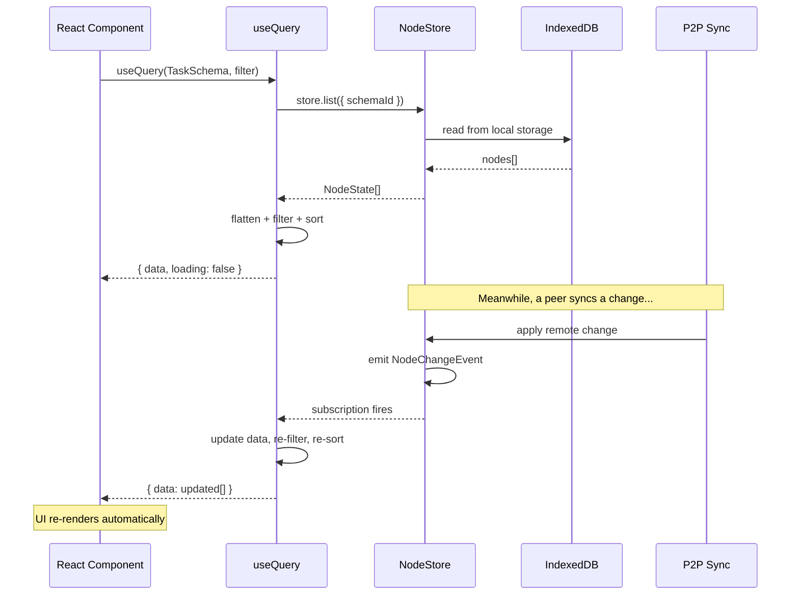

**Gotchas** (shown as Starlight asides):

```markdown
:::caution[Object reference in `where`]
The `where` filter uses `JSON.stringify()` internally for dependency tracking.
If you create a new object on every render, the subscription will re-fire.
Memoize your filter or define it outside the component.
:::

:::tip[No loading spinners for local data]
Since data is stored locally, `loading` transitions from `true` to `false`
almost instantly. You usually don't need a loading state for local queries —
the data is already there.
:::

:::caution[Filter is in-memory]
`where` filtering happens in JavaScript after loading from the store.
For large datasets (1000+ nodes), consider using `limit` and `offset`
rather than loading everything and filtering.
:::
```

### useMutate Deep-Dive Content

**Return value table:**

| Field          | Type                                                         | Description                                          |
| -------------- | ------------------------------------------------------------ | ---------------------------------------------------- |
| `create`       | `(schema, data, id?, options?) => Promise<FlatNode \| null>` | Create a new node. Schema validates at compile time. |
| `update`       | `(schema, id, data, options?) => Promise<FlatNode \| null>`  | Update properties. Only changed fields are sent.     |
| `remove`       | `(id, options?) => Promise<void>`                            | Soft-delete a node. Recoverable via `restore`.       |
| `restore`      | `(id, options?) => Promise<FlatNode \| null>`                | Restore a soft-deleted node.                         |
| `mutate`       | `(ops[], options?) => Promise<TransactionResult \| null>`    | Batch multiple operations in a single transaction.   |
| `isPending`    | `boolean`                                                    | Any mutation currently in flight.                    |
| `pendingCount` | `number`                                                     | Number of mutations in flight.                       |

**Usage patterns:**

1. **Basic CRUD** — create, update, remove, restore
2. **Transactions** — batch multiple ops atomically
3. **With temp IDs** — create related nodes in one transaction
4. **Form integration** — using update with form state
5. **Optimistic patterns** — (document that `optimistic` option exists but isn't yet implemented)

**Mermaid data flow:**

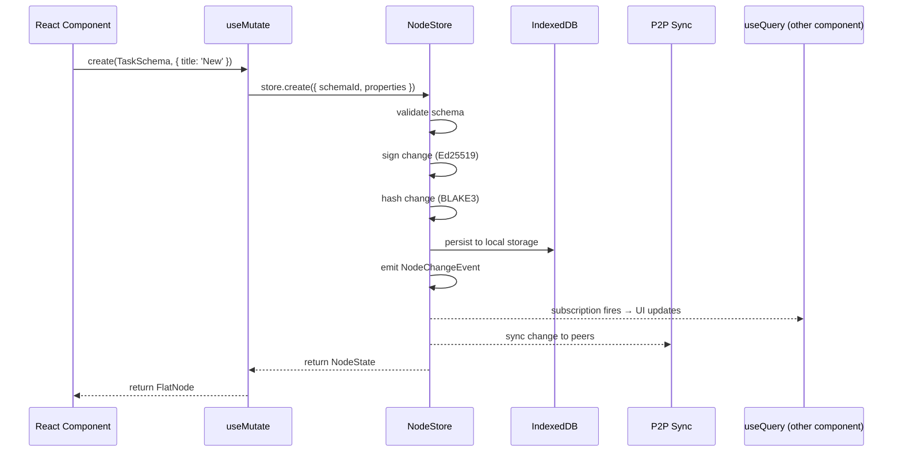

### useNode Deep-Dive Content

This is the most complex hook and needs the most documentation:

**Options table:**

| Option             | Type                  | Default                   | Description                                             |
| ------------------ | --------------------- | ------------------------- | ------------------------------------------------------- |
| `signalingServers` | `string[]`            | `['ws://localhost:4444']` | WebSocket servers for peer discovery.                   |
| `disableSync`      | `boolean`             | `false`                   | Disable P2P sync (local-only mode).                     |
| `persistDebounce`  | `number`              | `1000`                    | Milliseconds to debounce Y.Doc saves to storage.        |
| `createIfMissing`  | `InferCreateProps<P>` | —                         | Auto-create the node if it doesn't exist.               |
| `did`              | `string`              | —                         | User's DID for presence awareness (cursors, user list). |

**Return value — grouped by category:**

**Data:**
| Field | Type | Description |
|-------|------|-------------|
| `data` | `FlatNode<P> \| null` | The node's structured properties (flattened). |
| `doc` | `Y.Doc \| null` | Yjs document for collaborative editing. `null` if schema has no `document: 'yjs'`. |

**Mutations:**
| Field | Type | Description |
|-------|------|-------------|
| `update` | `(props) => Promise<void>` | Update structured properties. Dual-writes to both NodeStore AND Y.Doc meta map. |
| `remove` | `() => Promise<void>` | Soft-delete this node. |

**State:**
| Field | Type | Description |
|-------|------|-------------|
| `loading` | `boolean` | True during initial load. |
| `error` | `Error \| null` | Any error. |
| `isDirty` | `boolean` | True if Y.Doc has unsaved changes. |
| `lastSavedAt` | `number \| null` | Timestamp of last persistence. |
| `wasCreated` | `boolean` | True if the node was auto-created via `createIfMissing`. |

**Sync:**
| Field | Type | Description |
|-------|------|-------------|
| `syncStatus` | `'offline' \| 'connecting' \| 'connected' \| 'error'` | Current P2P connection state. |
| `syncError` | `string \| null` | Error message if sync failed. |
| `peerCount` | `number` | Number of connected collaborators. |

**Presence:**
| Field | Type | Description |
|-------|------|-------------|
| `presence` | `PresenceUser[]` | Other users editing this document. Each has `did`, `name?`, `color?`, `lastSeen?`, `isStale?`. |
| `awareness` | `Awareness \| null` | Yjs Awareness instance. Pass to TipTap's `CollaborationCursor` extension. |

**Usage patterns:**

1. **Basic document editing** — load node, bind Y.Doc to TipTap
2. **Structured properties + rich text** — using both `data` and `doc`
3. **Presence awareness** — showing who's online with cursor colors
4. **Auto-create** — using `createIfMissing` for "new page" flows
5. **Offline-first** — handling syncStatus changes gracefully
6. **Manual save** — using `save()` for critical data

**The lifecycle diagram (most important diagram in the docs):**

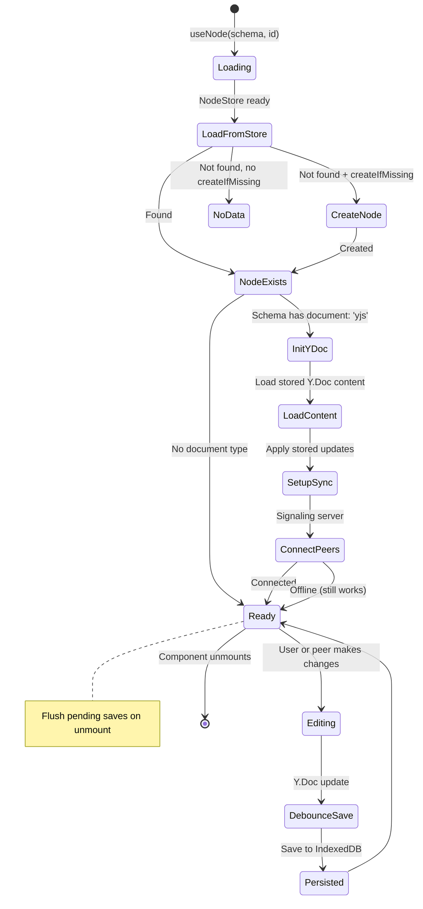

**Critical gotcha section:**

````markdown
:::danger[Dual-write: update() writes to BOTH stores]
When you call `update({ title: 'New Title' })`, it writes to:

1. The NodeStore (structured data with Lamport timestamps)
2. The Y.Doc's `meta` map (for peer sync)

If you modify the Y.Doc directly (e.g., via TipTap), those changes
do NOT automatically propagate to the NodeStore. The `meta` bridge
handles the reverse direction (Y.Doc → NodeStore) for remote changes.
:::

:::caution[Pending flushes across navigation]
When the component unmounts, useNode flushes the Y.Doc to storage.
If the user navigates to the same node quickly, the new instance
waits for the previous flush to complete before loading. This prevents
data loss but can cause a brief delay.
:::

:::tip[Pass `did` for presence]
Without the `did` option, presence awareness is disabled and `presence`
will always be empty. Always pass the current user's DID:

```tsx
const { did } = useIdentity()
const { doc, presence } = useNode(PageSchema, id, { did })
```
````

:::

````

---

## 5. Making Docs Fun, Intuitive & Interactive

### Principles

1. **Show, don't tell** — every concept gets a diagram or code example, not just prose
2. **Progressive disclosure** — start simple, let people dig deeper
3. **Personality without cringe** — technical confidence, occasional wit, never corporate
4. **Copy-paste-able** — every code example should work if pasted into a project
5. **Respect the reader's time** — "You Will Learn" boxes set expectations, TOC lets you skip

### Specific Techniques

#### "You Will Learn" Boxes

Every tutorial and guide page opens with:

```markdown
:::note[You will learn]
- How to define a schema with `defineSchema()`
- How to query data reactively with `useQuery()`
- How to create and update nodes with `useMutate()`
- How offline-first works (spoiler: you don't have to do anything)
:::
````

#### "What This Replaces" Callouts

On each hook page, a callout that maps to the traditional stack:

```markdown
:::tip[What useQuery replaces]
In a traditional React app, `useQuery` replaces:

- **React Query / SWR** — reactive data fetching
- **REST/GraphQL client** — API calls
- **Database queries** — Prisma/Drizzle on the backend
- **WebSocket subscriptions** — real-time updates

With xNet, all of this is one hook. Data is local, so queries are instant.
:::
```

#### Interactive Code Examples

Using Starlight's Expressive Code with tabs:

````markdown
import { Tabs, TabItem } from '@astrojs/starlight/components';

<Tabs>
  <TabItem label="Schema">
    ```ts title="schema.ts"
    import { defineSchema, text, select } from '@xnetjs/data'

    export const TaskSchema = defineSchema({
      name: 'Task',
      namespace: 'xnet://your-app/',
      properties: {
        title: text({ required: true }),
        status: select({ options: ['todo', 'doing', 'done'] })
      }
    })
    ```

  </TabItem>
  <TabItem label="Component">
    ```tsx title="TaskList.tsx"
    import { useQuery, useMutate } from '@xnetjs/react'
    import { TaskSchema } from './schema'

    function TaskList() {
      const { data: tasks } = useQuery(TaskSchema)
      const { create } = useMutate()

      return (
        <ul>
          {tasks.map(t => <li key={t.id}>{t.title}</li>)}
          <button onClick={() => create(TaskSchema, {
            title: 'New task', status: 'todo'
          })}>Add</button>
        </ul>
      )
    }
    ```

  </TabItem>
</Tabs>
````

#### Progressive Disclosure with Details

````markdown
<details>
<summary>How does type inference work under the hood?</summary>

The `defineSchema()` function captures the property builders in its type parameter:

```typescript
function defineSchema<P extends Record<string, PropertyBuilder>>(
  options: DefineSchemaOptions<P>
): DefinedSchema<P>
```
````

Each property builder (e.g., `text()`, `select()`) carries its type:

- `text()` → `PropertyBuilder<string>`
- `select({ options: ['a', 'b'] as const })` → `PropertyBuilder<'a' | 'b'>`

`InferCreateProps<P>` then maps over the record to extract each type,
respecting `required` to determine optional vs. mandatory fields.

</details>
```

#### Step-by-Step Instructions

Starlight's `<Steps>` component for tutorials:

````markdown
import { Steps } from '@astrojs/starlight/components';

<Steps>
1. Install the packages

```bash
pnpm add @xnetjs/react @xnetjs/data
```
````

2. Define your schema

   ```ts title="schema.ts"
   import { defineSchema, text } from '@xnetjs/data'

   export const NoteSchema = defineSchema({
     name: 'Note',
     namespace: 'xnet://my-app/',
     properties: { title: text({ required: true }) }
   })
   ```

3. Wrap your app in `XNetProvider`

   ```tsx title="App.tsx" {3,8-10}
   import { XNetProvider } from '@xnetjs/react'

   function App() {
     return (
       <XNetProvider
         config={{
           authorDID: 'did:key:z6Mk...',
           signingKey: keyBytes
         }}
       >
         <NoteList />
       </XNetProvider>
     )
   }
   ```

   </Steps>

````

#### File Tree for Project Structure

```markdown
import { FileTree } from '@astrojs/starlight/components';

<FileTree>
- src/
  - schemas/
    - task.ts        # defineSchema() definitions
    - page.ts
  - components/
    - TaskList.tsx    # useQuery(TaskSchema)
    - TaskForm.tsx    # useMutate()
    - PageEditor.tsx  # useNode() + TipTap
  - App.tsx           # XNetProvider
</FileTree>
````

#### Comparison Cards

Link cards to related pages:

```markdown
import { Card, CardGrid, LinkCard } from '@astrojs/starlight/components';

<CardGrid>
  <LinkCard
    title="useQuery"
    description="Read data reactively. Filter, sort, paginate."
    href="/docs/hooks/useQuery"
  />
  <LinkCard
    title="useMutate"
    description="Create, update, delete with type safety."
    href="/docs/hooks/useMutate"
  />
</CardGrid>
```

---

## 6. Mermaid Diagrams Strategy

### Integration

Install the `astro-mermaid` plugin (or use `remark-mermaidjs` for build-time SVG rendering). Mermaid diagrams render from fenced code blocks:

````markdown
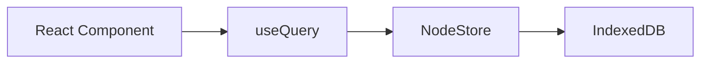
````

### Diagram Inventory

Every major concept gets a diagram. Here's the full inventory:

#### Architecture Diagrams

**1. Package Dependency Graph** (Architecture Overview page)

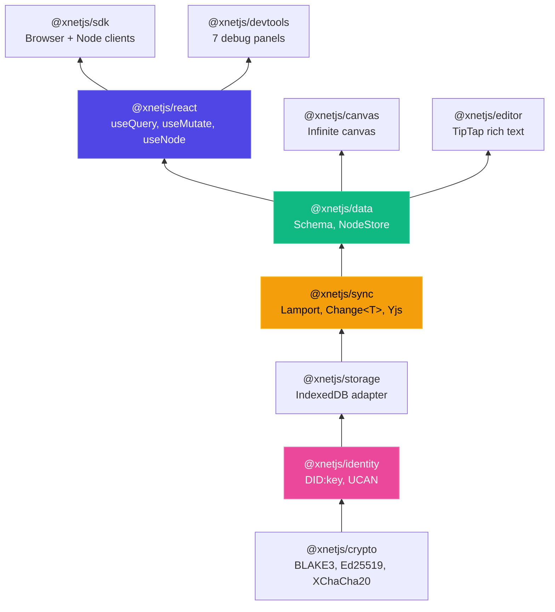

**2. Data Flow Overview** (Core Concepts page)

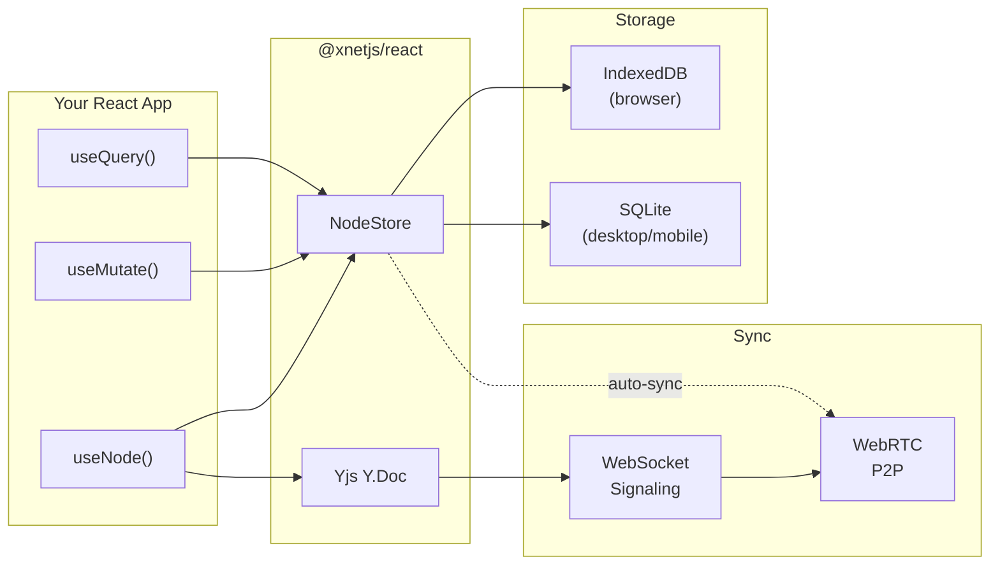

**3. Sync Protocol** (Sync Architecture concept page)

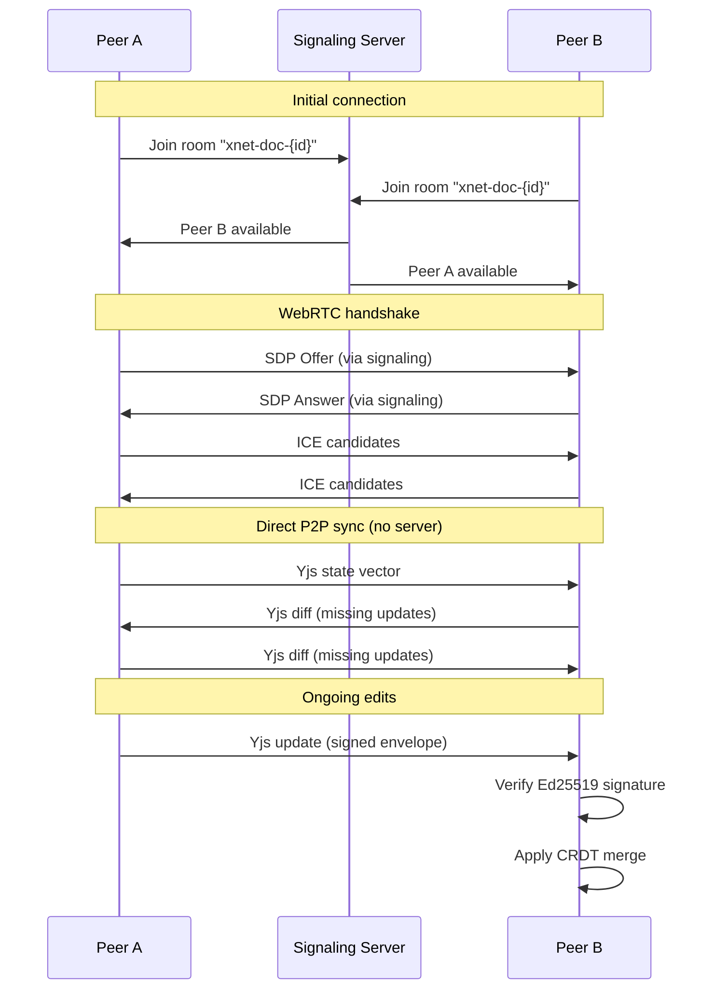

**4. CRDT Conflict Resolution** (CRDTs concept page)

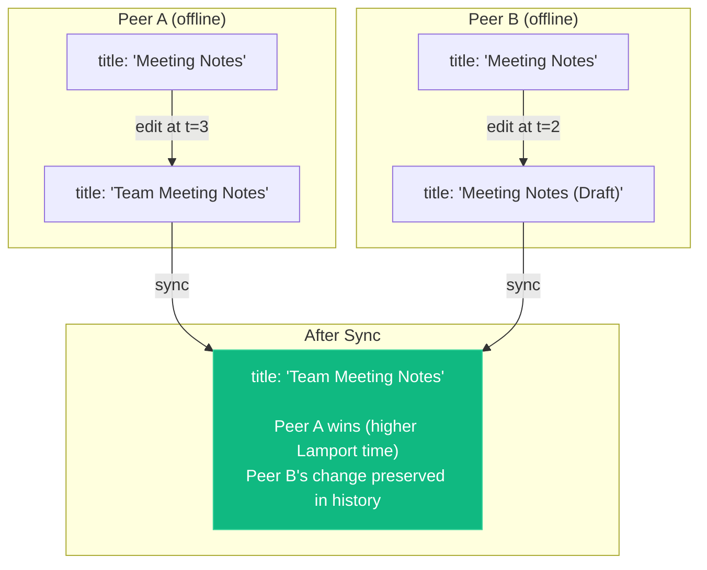

**5. Identity Model** (Identity concept page)

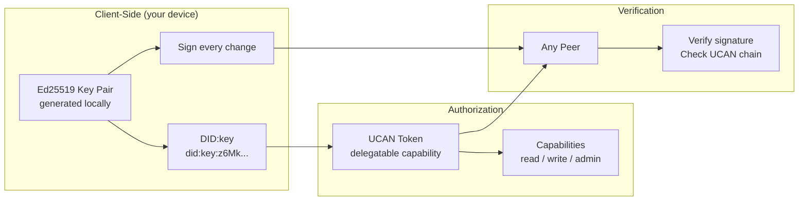

**6. useNode Lifecycle** (useNode reference page — see Section 4 above)

**7. XNetProvider Initialization** (Quick Start page)

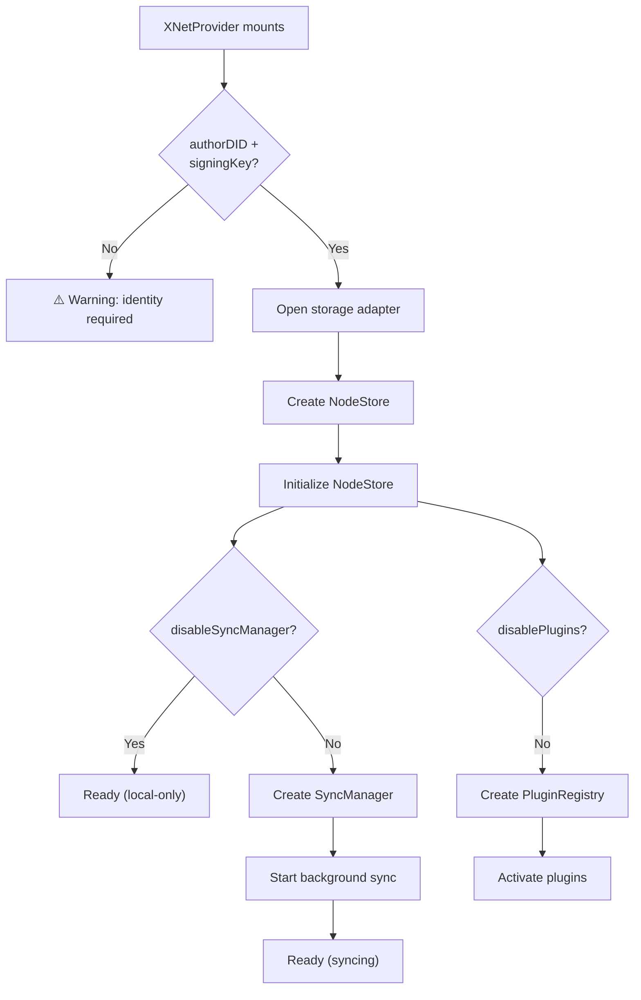

**8. Property Type System** (Property Types reference)

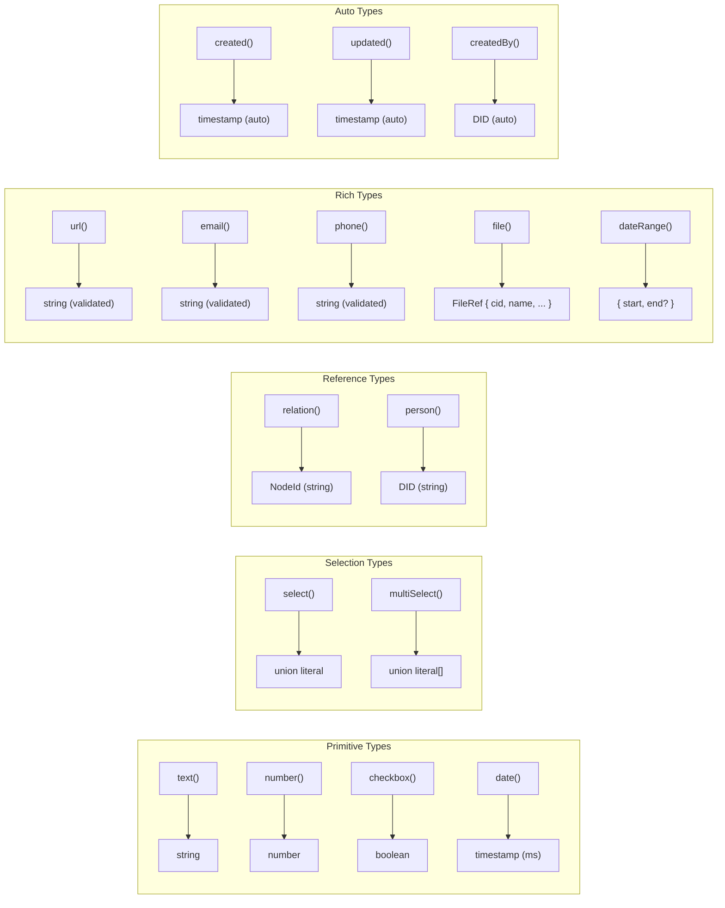

---

## 7. Visual Design & Theme

### Match the Landing Page

Override Starlight's CSS custom properties to match the existing dark theme:

```css
/* src/styles/docs.css */

/* Dark theme (default) */
:root {
  --sl-color-accent-low: #1a1a3e;
  --sl-color-accent: #6366f1; /* indigo-500 */
  --sl-color-accent-high: #c7d2fe; /* indigo-200 */

  --sl-color-bg-nav: #0a0a0f;
  --sl-color-bg-sidebar: #0d0d14;

  --sl-color-gray-1: #e5e7eb; /* gray-200 */
  --sl-color-gray-2: #9ca3af; /* gray-400 */
  --sl-color-gray-3: #6b7280; /* gray-500 */
  --sl-color-gray-4: #4b5563; /* gray-600 */
  --sl-color-gray-5: #1e1e2e; /* border color */
  --sl-color-gray-6: #12121a; /* surface color */
  --sl-color-gray-7: #0a0a0f; /* bg color */

  --sl-font: system-ui, -apple-system, sans-serif;
  --sl-font-mono: 'JetBrains Mono', 'Fira Code', monospace;

  --sl-content-width: 50rem;
}

/* Light theme overrides (optional — could disable light mode) */
:root[data-theme='light'] {
  --sl-color-accent-low: #e8e8ff;
  --sl-color-accent: #4f46e5;
  --sl-color-accent-high: #1e1b4b;
}
```

### Custom Header with Landing Page Link

Override Starlight's Header component to include a link back to the landing page:

```typescript
// astro.config.mjs
starlight({
  components: {
    SiteTitle: './src/components/docs/SiteTitle.astro'
  }
})
```

The custom `SiteTitle` links "xNet" back to `/` (the landing page) while "Docs" links to `/docs/`.

---

## 8. Plugins & Tooling

### Must-Have Plugins

| Plugin                                    | Purpose                                  | Priority |
| ----------------------------------------- | ---------------------------------------- | -------- |
| **remark-mermaidjs** or **astro-mermaid** | Render Mermaid diagrams from code blocks | P0       |
| **starlight-links-validator**             | CI check for broken internal links       | P1       |
| **starlight-llms-txt**                    | Generate llms.txt for AI discoverability | P1       |

### Nice-to-Have Plugins

| Plugin                       | Purpose                                            | Priority |
| ---------------------------- | -------------------------------------------------- | -------- |
| **starlight-typedoc**        | Auto-generate API reference from TypeScript source | P2       |
| **starlight-heading-badges** | Mark sections as "new", "beta", "advanced"         | P2       |
| **starlight-image-zoom**     | Click-to-zoom on architecture diagrams             | P2       |
| **starlight-site-graph**     | Interactive graph showing page relationships       | P3       |
| **starlight-blog**           | Changelog / release announcements                  | P3       |

### Build-Time Validation

Add to CI:

- Link validation (starlight-links-validator)
- MDX compilation check (catches broken imports)
- Mermaid syntax validation

---

## 9. Content Templates

### Tutorial Template

```markdown
---
title: 'Build a [thing] with xNet'
description: 'Step-by-step tutorial to build [thing] using xNet React hooks.'
sidebar:
  badge:
    text: Tutorial
    variant: note
---

import { Steps, Tabs, TabItem, FileTree } from '@astrojs/starlight/components'

:::note[You will learn]

- How to [thing 1]
- How to [thing 2]
- How to [thing 3]
  :::

## Prerequisites

- Node.js 22+
- pnpm
- Basic React knowledge

## What you'll build

[Screenshot or description of the finished product]

<Steps>
1. Set up the project
   ...
2. Define your schema
   ...
3. Build the UI
   ...
</Steps>

## Next steps

- [Link to related guide]
- [Link to related reference]
```

### Hook Reference Template

```markdown
---
title: 'useHookName'
description: 'One-line description of what the hook does.'
sidebar:
  badge:
    text: Core
    variant: success
---

import { Tabs, TabItem } from '@astrojs/starlight/components'

:::note[You will learn]

- The full API signature and all parameters
- Common usage patterns with copy-paste examples
- Gotchas and edge cases
  :::

:::tip[What this replaces]
In a traditional app, `useHookName` replaces: [list]
:::

## Quick Example

[Minimal, complete, working example]

## Signature

[Full TypeScript signature with all overloads]

## Parameters

[Table]

## Return Value

[Table grouped by category]

## Usage Patterns

### Pattern 1: [Name]

[Complete example]

### Pattern 2: [Name]

[Complete example]

## Data Flow

[Mermaid diagram]

## Gotchas

[Aside callouts]

## Related

- [Links to related hooks/guides]
```

### Concept Page Template

```markdown
---
title: '[Concept Name]'
description: 'Understanding [concept] in xNet.'
---

:::note[In this article]

- What [concept] is and why it matters
- How xNet implements [concept]
- Tradeoffs and alternatives
  :::

## The Problem

[What problem does this solve? Why should the reader care?]

## How It Works

[Explanation with Mermaid diagrams]

## In Practice

[How this manifests in xNet's API]

## Tradeoffs

[Honest assessment of alternatives]

## Further Reading

- [External links to foundational papers/posts]
- [Links to related xNet docs]
```

---

## 10. Implementation Plan

### Phase 1: Foundation (get Starlight running + P0 content)

1. Install Starlight, configure integration alongside existing landing page
2. Set up theme CSS to match dark landing page
3. Add remark-mermaidjs for Mermaid diagrams
4. Write: Introduction, Quick Start
5. Write: Hooks Overview, useQuery, useMutate, useNode
6. Write: defineSchema, Property Types
7. Add navigation link from landing page to docs

### Phase 2: Depth (P1 + P2 content)

8. Write: useIdentity, useComments, useHistory/useUndo
9. Write: Relations, Built-in Schemas, Type Inference
10. Write: Hook Patterns (common patterns, gotchas)
11. Write: Sync Guide, Offline Guide
12. Write: Core Concepts page

### Phase 3: Ecosystem (P3 content)

13. Write: All Concept pages (6 pages)
14. Write: All Guide pages (Identity, Collaboration, Plugins, Electron, Testing)
15. Write: Package Reference pages (auto-generate with starlight-typedoc or manual)
16. Write: Architecture pages (Overview, Decisions, Package Graph)
17. Write: Contributing pages (Getting Started, Code Style, Testing, Good First Issues)

### Phase 4: Polish

18. Add starlight-links-validator to CI
19. Add starlight-llms-txt for AI discoverability
20. Review all pages for consistency with templates
21. Add "Edit this page" links
22. Cross-link between landing page and docs

---

## Open Questions

1. **Disable light mode?** The landing page is dark-only. Starlight has a theme toggle by default. We could either: (a) disable it to match the landing page, or (b) keep it since docs in light mode is a valid preference. Leaning toward keeping it — developers may read docs for hours and prefer light mode.

2. **Search provider?** Starlight includes Pagefind (static search). For a small docs site this is fine. Consider Algolia DocSearch when docs exceed ~50 pages.

3. **Interactive playgrounds?** React.dev uses Sandpack for in-browser code editing. This is high-effort but extremely compelling. The `astro-live-code` plugin could enable this for MDX code blocks. Not for Phase 1, but worth revisiting.

4. **Auto-generated API docs?** `starlight-typedoc` can auto-generate reference pages from TypeScript source. Pros: always in sync. Cons: generated docs are often ugly and hard to read. Recommendation: hand-write the primary hook pages (they need narrative), auto-generate the package reference pages (they need completeness).

5. **Versioning?** Not needed yet (pre-release). When xNet hits 1.0, add `starlight-versions` to maintain docs for multiple versions.
