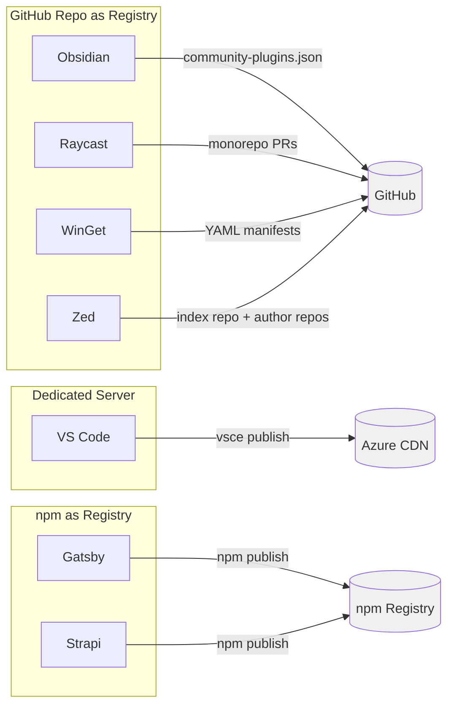
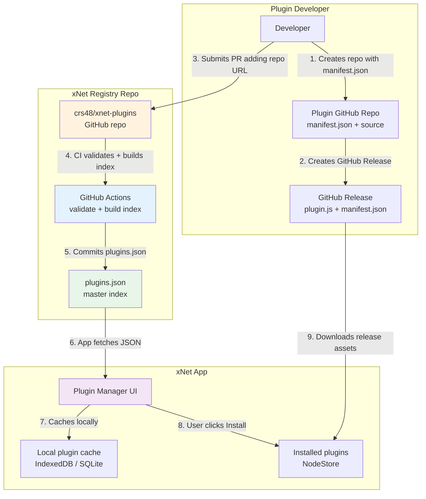
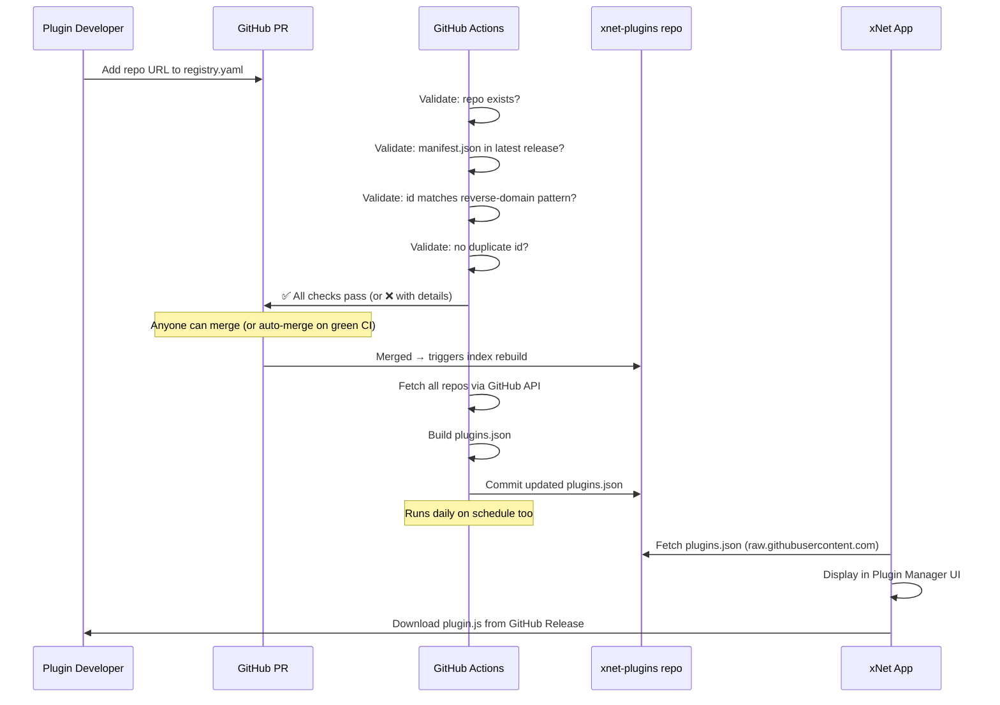
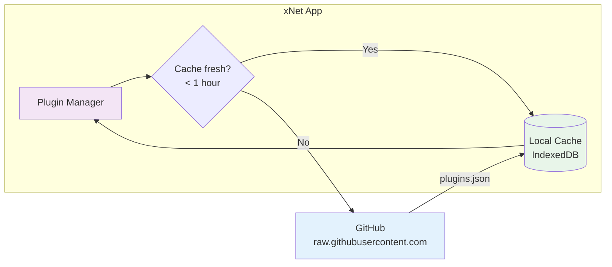
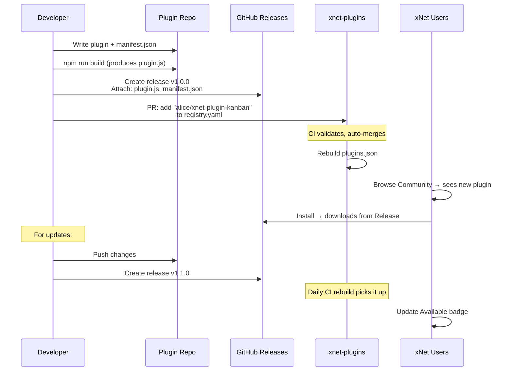
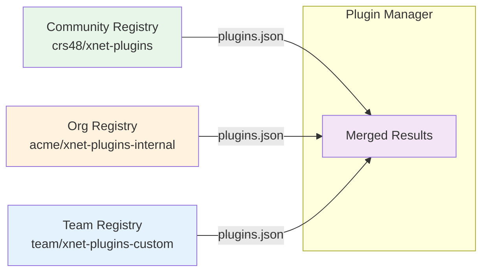

# Exploration 0047: Plugin Marketplace

> How to build a self-managing plugin marketplace for xNet using GitHub as the backbone — no servers, no moderation burden, no cost.

## Context

xNet has a working plugin system ([Exploration 0006](./0006_[x]_PLUGIN_ARCHITECTURE.md), `@xnetjs/plugins`). Extensions can register schemas, views, commands, editor extensions, sidebar items, slash commands, property handlers, and blocks. Plugins are persisted as Nodes in the NodeStore. One bundled plugin (Mermaid diagrams) ships today.

What's missing is **discovery** — a way for developers to publish plugins and for users to find, install, and update them from inside the app.

### Goals

1. **Zero infrastructure cost** — no servers to run, no CDN to pay for
2. **Self-managing** — minimal moderation burden on the xNet team
3. **Instant publishing** — developers push code, it shows up in the marketplace
4. **Good discovery UX** — search, filter, sort by popularity in the app
5. **Trust signals** — stars, downloads, verified authors without building a reputation system
6. **Works offline** — the installed plugin index is local, not dependent on network

### Non-Goals

- Paid plugins / revenue sharing (maybe later)
- Sandboxed execution of marketplace plugins (already handled by the plugin system's 4 layers)
- Plugin auto-updates without user consent

## Prior Art Analysis

### How Others Do It



### Comparison

| Dimension          | GitHub Repo Registry                                | Dedicated Server                   | npm Registry               |
| ------------------ | --------------------------------------------------- | ---------------------------------- | -------------------------- |
| **Used by**        | Obsidian, Raycast, WinGet, Zed, Homebrew            | VS Code Marketplace                | Gatsby, Strapi, Docusaurus |
| **Infra cost**     | $0 (GitHub hosts everything)                        | Significant (servers, CDN, API)    | $0 (npm hosts everything)  |
| **Publish speed**  | Slow if PR-reviewed; instant for updates            | Instant (VS Code)                  | Instant                    |
| **Security model** | Manual review on initial submit                     | Post-publish scanning only         | Post-publish scanning only |
| **Update review**  | Varies: Raycast=every update, Obsidian=initial only | None                               | None                       |
| **Discovery UX**   | Basic (JSON list → in-app UI)                       | Rich (ratings, badges, trending)   | Weak (keyword search)      |
| **Scalability**    | Degrades at scale (large repos)                     | Excellent                          | Excellent                  |
| **Dev friction**   | Medium (PR workflow)                                | Medium (Azure DevOps PAT)          | Low (familiar npm)         |
| **Transparency**   | Full (public PRs, audit trail)                      | Low (proprietary backend)          | Medium                     |
| **Self-hosting**   | Easy (clone repo)                                   | Difficult                          | Easy (npm mirror)          |
| **Trust signals**  | GitHub stars, contributor count                     | Ratings, verified badges, installs | Download counts            |

### Key Lessons

1. **Obsidian's model is closest to what we want**: a single JSON file in a GitHub repo lists all community plugins. Each plugin lives in its own repo. No infrastructure. ~2000+ plugins. Reviews only on initial submission; updates ship freely via GitHub Releases.

2. **The Obsidian bottleneck is review**: their team manually reviews every initial PR. For xNet, we want to avoid this — leverage GitHub stars and community trust signals instead.

3. **WinGet's innovation**: they serve a pre-built SQLite index to clients rather than having each client clone the repo. This scales well.

4. **Zed's split**: index repo (metadata only) + author repos (actual code). The index is tiny and fast to fetch. CI auto-rebuilds when authors push updates.

5. **npm has zero curation**: anyone can publish, and keyword-based discovery is unreliable. Works when your audience is developers comfortable evaluating packages, but not great for end-user discovery.

6. **Nobody has solved paid plugins well**: VS Code added pricing labels but no payment processing. Everyone else is free. Revenue comes from the host app.

## Recommended Approach: GitHub Registry with Auto-Index

### The Architecture



### How It Works

**For plugin developers:**

1. Create a GitHub repo with a `manifest.json` and plugin source
2. Tag a release — GitHub Release contains the built `plugin.js` + `manifest.json`
3. Submit a PR to `crs48/xnet-plugins` adding one line to `registry.yaml`:

```yaml
# registry.yaml — the source of truth
plugins:
  - repo: alice/xnet-plugin-kanban
  - repo: bob/xnet-plugin-excalidraw
  - repo: charlie/xnet-plugin-calendar
  - repo: dave/xnet-plugin-mermaid-themes
```

That's it. No manifest to maintain in the registry, no metadata to keep in sync.

**Automated by GitHub Actions:**

1. CI validates the PR: checks the repo exists, has a valid `manifest.json`, has at least one release
2. On merge, CI crawls every listed repo via GitHub API:
   - Fetches `manifest.json` from latest release
   - Fetches repo metadata (stars, description, topics, license, last updated)
   - Fetches release info (download count, version, release date)
3. Builds a rich `plugins.json` index and commits it to the repo
4. Runs on a schedule (daily) to keep metadata fresh (stars, downloads change over time)

**For xNet users:**

1. Open Settings → Plugins → Browse Community
2. App fetches `plugins.json` from GitHub (raw URL or GitHub Pages)
3. Search, filter by category/platform, sort by stars/updated/downloads
4. Click Install → app downloads `plugin.js` from the plugin's GitHub Release
5. Plugin is stored as a Node, activated, and ready

### The Index Format

```typescript
// plugins.json — auto-generated, never manually edited
interface PluginIndex {
  version: 1
  generatedAt: string // ISO timestamp
  plugins: PluginEntry[]
  revoked: RevokedEntry[] // Plugins removed for cause (see Security section)
}

interface PluginEntry {
  // From registry.yaml (developer-submitted)
  repo: string // "alice/xnet-plugin-kanban"

  // From manifest.json (fetched from latest release)
  id: string // "dev.alice.kanban"
  name: string // "Kanban Board"
  version: string // "1.2.0"
  description: string // "Drag-and-drop kanban boards for any schema"
  author: {
    name: string // "Alice"
    url?: string // "https://alice.dev"
  }
  xnetVersion: string // ">=0.5.0"
  platforms: Platform[] // ["electron", "web"]
  permissions: string[] // ["schemas.read", "schemas.write"]
  contributes: string[] // ["views", "commands", "slashCommands"]

  // From GitHub API (auto-fetched)
  github: {
    stars: number // 142
    forks: number // 12
    openIssues: number // 3
    closedIssues: number // 47
    license: string // "MIT"
    topics: string[] // ["kanban", "project-management"]
    language: string // "TypeScript"
    createdAt: string // ISO
    updatedAt: string // ISO
    avatarUrl: string // Author avatar
    contributors: number // 5
  }

  // From GitHub API (auto-fetched, repo health signals)
  health: {
    commitFrequency: number // Commits in last 90 days
    lastCommitAt: string // ISO — more accurate than repo updatedAt
    issueCloseRate: number // closedIssues / (openIssues + closedIssues), 0-1
    releaseFrequency: number // Releases in last 12 months
    hasReadme: boolean
    hasLicense: boolean
    isArchived: boolean
  }

  // From GitHub Releases (auto-fetched)
  release: {
    version: string // "1.2.0"
    publishedAt: string // ISO
    downloadCount: number // 5432
    assetUrl: string // Direct download URL for plugin.js
    assetSize: number // bytes
    changelog?: string // Release body (first 500 chars)
  }
}
```

### The PR Workflow



### What Gets Reviewed (And What Doesn't)

| Action                              | Review needed?                                       | Who reviews?                      |
| ----------------------------------- | ---------------------------------------------------- | --------------------------------- |
| Initial listing (add repo URL)      | Automated CI only                                    | Nobody — if CI passes, auto-merge |
| Plugin updates (new release)        | No — auto-indexed daily                              | Nobody                            |
| Metadata changes (stars, downloads) | No — auto-refreshed                                  | Nobody                            |
| Removing a plugin                   | PR to delete line + add to `blocked.yaml`            | Anyone can propose                |
| Flagging malicious plugin           | GitHub issue → blocked.yaml update                   | Community + maintainers           |
| Blocking a repeat offender          | Add GitHub username to `blocked.yaml` `authors` list | Maintainers                       |

**The key insight**: we don't review plugin code. We rely on:

1. **GitHub stars** as a trust signal (community has already evaluated it)
2. **Open source** — all plugin repos are public, anyone can audit
3. **The existing sandbox** — Layer 1 scripts run in AST-validated sandbox; Layer 2 extensions are semi-trusted
4. **User consent** — the app shows permissions before install
5. **Community reporting** — GitHub issues on the registry repo for flagging

This is the same trust model as npm, Homebrew taps, and Chrome extensions — the ecosystem self-polices. If a plugin is malicious, it gets reported, the line gets removed from `registry.yaml`, and the next index build drops it.

## The Registry Repo

### Structure

```
crs48/xnet-plugins/
├── registry.yaml              # Source of truth — list of repo URLs
├── plugins.json               # Auto-generated index (committed by CI)
├── .github/
│   └── workflows/
│       ├── validate-pr.yml    # Runs on PRs: validate new entries
│       ├── build-index.yml    # Runs on merge + daily: rebuild plugins.json
│       └── CODEOWNERS         # Auto-approve if CI passes
├── categories.yaml            # Optional: category definitions
├── featured.yaml              # Optional: hand-picked featured plugins
├── blocked.yaml               # Blocked repos, authors, and plugin IDs
└── README.md                  # How to submit a plugin
```

### CI: Validate PR

```yaml
# .github/workflows/validate-pr.yml
name: Validate Plugin Submission
on:
  pull_request:
    paths: ['registry.yaml']

jobs:
  validate:
    runs-on: ubuntu-latest
    steps:
      - uses: actions/checkout@v4
      - uses: actions/setup-node@v4

      - name: Diff registry.yaml to find new entries
        id: diff
        run: |
          # Extract newly added repo lines
          git diff origin/main -- registry.yaml | grep '^+.*repo:' | sed 's/+.*repo: //' > new_repos.txt

      - name: Validate each new repo
        run: |
          while read repo; do
            echo "Validating $repo..."

            # 1. Repo exists and is public
            gh api "repos/$repo" --jq '.private' | grep -q 'false'

            # 2. Has at least one release
            RELEASE=$(gh api "repos/$repo/releases/latest" --jq '.tag_name')
            echo "  Latest release: $RELEASE"

            # 3. Release has manifest.json asset (or it's in repo root)
            gh api "repos/$repo/releases/latest" --jq '.assets[].name' | grep -q 'manifest.json' \
              || gh api "repos/$repo/contents/manifest.json" > /dev/null

            # 4. manifest.json has required fields
            MANIFEST=$(gh api "repos/$repo/contents/manifest.json" --jq '.content' | base64 -d)
            echo "$MANIFEST" | jq -e '.id, .name, .version' > /dev/null

            # 5. ID matches reverse-domain pattern
            ID=$(echo "$MANIFEST" | jq -r '.id')
            echo "$ID" | grep -qE '^[a-z][a-z0-9]*(\.[a-z][a-z0-9-]*)+$'

            # 6. Repo not in blocked repos list
            AUTHOR=$(echo "$repo" | cut -d'/' -f1)
            ! yq '.repos[]' blocked.yaml 2>/dev/null | grep -q "^$repo$"

            # 7. Author not in blocked authors list
            ! yq '.authors[]' blocked.yaml 2>/dev/null | grep -q "^$AUTHOR$"

            # 8. Plugin ID not in blocked IDs list
            ! yq '.plugin_ids[]' blocked.yaml 2>/dev/null | grep -q "^$ID$"

            # 9. No duplicate ID in existing index
            ! jq -e --arg id "$ID" '.plugins[] | select(.id == $id)' plugins.json > /dev/null 2>&1

            echo "  ✅ $repo is valid"
          done < new_repos.txt
        env:
          GH_TOKEN: ${{ secrets.GITHUB_TOKEN }}
```

### CI: Build Index

```yaml
# .github/workflows/build-index.yml
name: Build Plugin Index
on:
  push:
    branches: [main]
    paths: ['registry.yaml']
  schedule:
    - cron: '0 6 * * *' # Daily at 6am UTC
  workflow_dispatch: # Manual trigger

jobs:
  build:
    runs-on: ubuntu-latest
    steps:
      - uses: actions/checkout@v4
      - uses: actions/setup-node@v4

      - name: Build plugins.json
        run: node scripts/build-index.mjs
        env:
          GH_TOKEN: ${{ secrets.GITHUB_TOKEN }}

      - name: Commit updated index
        run: |
          git config user.name "github-actions[bot]"
          git config user.email "github-actions[bot]@users.noreply.github.com"
          git add plugins.json
          git diff --staged --quiet || git commit -m "chore: rebuild plugin index"
          git push
```

### The Index Builder Script

```typescript
// scripts/build-index.mjs
import { readFileSync } from 'fs'
import { parse } from 'yaml'

const daysAgo = (n) => new Date(Date.now() - n * 86400000).toISOString()

const registry = parse(readFileSync('registry.yaml', 'utf8'))
const blocked = parse(readFileSync('blocked.yaml', 'utf8')) ?? {}

const plugins = []

for (const entry of registry.plugins) {
  const { repo } = entry
  const blockedRepos = blocked.repos ?? []
  const blockedAuthors = blocked.authors ?? []
  const author = repo.split('/')[0]
  if (blockedRepos.includes(repo) || blockedAuthors.includes(author)) continue

  try {
    // Fetch repo metadata
    const repoData = await ghAPI(`repos/${repo}`)

    // Fetch latest release
    const release = await ghAPI(`repos/${repo}/releases/latest`)

    // Fetch manifest.json from release assets or repo root
    const manifest = await fetchManifest(repo, release)

    // Fetch activity signals (parallel)
    const [commits, issues, releases, contributors] = await Promise.all([
      // Commit activity in last 90 days
      ghAPI(`repos/${repo}/commits?since=${daysAgo(90)}&per_page=1`, { rawHeaders: true })
        .then((res) => parseInt(res.headers?.['x-total-count'] ?? '0', 10))
        .catch(() => 0),
      // Closed issues (open_issues_count is already on repoData)
      ghAPI(`repos/${repo}/issues?state=closed&per_page=1`, { rawHeaders: true })
        .then((res) => parseInt(res.headers?.['x-total-count'] ?? '0', 10))
        .catch(() => 0),
      // All releases in last 12 months
      ghAPI(`repos/${repo}/releases?per_page=100`)
        .then(
          (rels) => rels.filter((r) => new Date(r.published_at) > new Date(daysAgo(365))).length
        )
        .catch(() => 0),
      // Contributor count
      ghAPI(`repos/${repo}/contributors?per_page=1&anon=true`, { rawHeaders: true })
        .then((res) => parseInt(res.headers?.['x-total-count'] ?? '1', 10))
        .catch(() => 1)
    ])

    // Last commit date
    const lastCommit = await ghAPI(`repos/${repo}/commits?per_page=1`)
      .then((c) => c[0]?.commit?.committer?.date)
      .catch(() => repoData.pushed_at)

    const closedIssues = issues
    const openIssues = repoData.open_issues_count
    const totalIssues = openIssues + closedIssues

    plugins.push({
      repo,
      id: manifest.id,
      name: manifest.name,
      version: manifest.version,
      description: manifest.description ?? repoData.description,
      author: manifest.author ?? { name: repoData.owner.login },
      xnetVersion: manifest.xnetVersion ?? '*',
      platforms: manifest.platforms ?? ['electron', 'web'],
      permissions: summarizePermissions(manifest.permissions),
      contributes: Object.keys(manifest.contributes ?? {}),

      github: {
        stars: repoData.stargazers_count,
        forks: repoData.forks_count,
        openIssues,
        closedIssues,
        license: repoData.license?.spdx_id ?? 'Unknown',
        topics: repoData.topics ?? [],
        language: repoData.language,
        createdAt: repoData.created_at,
        updatedAt: repoData.pushed_at,
        avatarUrl: repoData.owner.avatar_url,
        contributors
      },

      health: {
        commitFrequency: commits,
        lastCommitAt: lastCommit,
        issueCloseRate: totalIssues > 0 ? closedIssues / totalIssues : 1,
        releaseFrequency: releases,
        hasReadme: repoData.has_wiki || true, // GitHub repos almost always have README
        hasLicense: !!repoData.license,
        isArchived: repoData.archived
      },

      release: {
        version: release.tag_name.replace(/^v/, ''),
        publishedAt: release.published_at,
        downloadCount: release.assets.reduce((sum, a) => sum + a.download_count, 0),
        assetUrl: findPluginAsset(release.assets)?.browser_download_url,
        assetSize: findPluginAsset(release.assets)?.size ?? 0,
        changelog: release.body?.slice(0, 500)
      }
    })
  } catch (err) {
    console.warn(`Skipping ${repo}: ${err.message}`)
  }
}

// Sort by stars descending as default
plugins.sort((a, b) => b.github.stars - a.github.stars)

// Build revoked list from blocked.yaml (repos + plugin IDs that were once listed)
const revoked = (blocked.revoked ?? []).map((r) => ({
  id: r.id,
  repo: r.repo,
  reason: r.reason,
  revokedAt: r.revokedAt
}))

const index = {
  version: 1,
  generatedAt: new Date().toISOString(),
  plugins,
  revoked
}

writeFileSync('plugins.json', JSON.stringify(index, null, 2))
console.log(`Built index with ${plugins.length} plugins`)
```

## Client-Side Integration

### Fetching the Index



```typescript
// packages/plugins/src/marketplace/index.ts

const INDEX_URL = 'https://raw.githubusercontent.com/crs48/xnet-plugins/main/plugins.json'
const CACHE_TTL = 60 * 60 * 1000 // 1 hour

interface MarketplaceOptions {
  indexUrl?: string // Override for self-hosted registries
  cacheTtl?: number
}

export class PluginMarketplace {
  private cache: PluginIndex | null = null
  private cacheTime = 0

  constructor(private options: MarketplaceOptions = {}) {}

  /**
   * Fetch the plugin index, using cache if fresh.
   */
  async getIndex(): Promise<PluginIndex> {
    const ttl = this.options.cacheTtl ?? CACHE_TTL
    if (this.cache && Date.now() - this.cacheTime < ttl) {
      return this.cache
    }

    const url = this.options.indexUrl ?? INDEX_URL
    const res = await fetch(url)
    if (!res.ok) {
      // Fall back to cache if network fails
      if (this.cache) return this.cache
      throw new Error(`Failed to fetch plugin index: ${res.status}`)
    }

    this.cache = await res.json()
    this.cacheTime = Date.now()
    return this.cache!
  }

  /**
   * Search plugins by query string.
   */
  async search(query: string, options?: SearchOptions): Promise<PluginEntry[]> {
    const index = await this.getIndex()
    let results = index.plugins

    // Text search across name, description, topics
    if (query) {
      const q = query.toLowerCase()
      results = results.filter(
        (p) =>
          p.name.toLowerCase().includes(q) ||
          p.description.toLowerCase().includes(q) ||
          p.github.topics.some((t) => t.includes(q))
      )
    }

    // Filter by platform
    if (options?.platform) {
      results = results.filter((p) => p.platforms.includes(options.platform!))
    }

    // Filter by contribution type
    if (options?.contributes) {
      results = results.filter((p) => p.contributes.includes(options.contributes!))
    }

    // Filter out archived/inactive if requested
    if (options?.activeOnly) {
      results = results.filter((p) => !p.health.isArchived && p.health.commitFrequency > 0)
    }

    // Sort
    switch (options?.sort ?? 'stars') {
      case 'stars':
        results.sort((a, b) => b.github.stars - a.github.stars)
        break
      case 'updated':
        results.sort(
          (a, b) =>
            new Date(b.health.lastCommitAt).getTime() - new Date(a.health.lastCommitAt).getTime()
        )
        break
      case 'downloads':
        results.sort((a, b) => b.release.downloadCount - a.release.downloadCount)
        break
      case 'activity':
        results.sort((a, b) => b.health.commitFrequency - a.health.commitFrequency)
        break
      case 'name':
        results.sort((a, b) => a.name.localeCompare(b.name))
        break
    }

    return results
  }

  /**
   * Download and install a plugin from its GitHub Release.
   */
  async install(entry: PluginEntry, registry: PluginRegistry): Promise<void> {
    if (!entry.release.assetUrl) {
      throw new Error(`No downloadable asset for ${entry.name}`)
    }

    // Download plugin.js
    const res = await fetch(entry.release.assetUrl)
    if (!res.ok) throw new Error(`Download failed: ${res.status}`)
    const code = await res.text()

    // Download manifest.json
    const manifestUrl = entry.release.assetUrl.replace(/plugin\.js$/, 'manifest.json')
    const manifestRes = await fetch(manifestUrl)
    const manifest = await manifestRes.json()

    // Evaluate the plugin module
    // (In production this would use a more sophisticated loader)
    const module = new Function('exports', code)
    const exports: Record<string, unknown> = {}
    module(exports)

    const extension = {
      ...manifest,
      activate: exports.activate as (ctx: ExtensionContext) => void,
      deactivate: exports.deactivate as () => void
    }

    // Install via the existing PluginRegistry
    registry.install(extension)
  }
}

interface SearchOptions {
  platform?: Platform
  contributes?: string
  sort?: 'stars' | 'updated' | 'downloads' | 'activity' | 'name'
  activeOnly?: boolean // Filter out archived repos and repos with 0 commits in 90 days
}
```

### React Hooks

```typescript
// packages/react/src/hooks/useMarketplace.ts

export function useMarketplace(options?: MarketplaceOptions) {
  const [marketplace] = useState(() => new PluginMarketplace(options))
  return marketplace
}

export function usePluginSearch(query: string, options?: SearchOptions) {
  const marketplace = useMarketplace()
  const [results, setResults] = useState<PluginEntry[]>([])
  const [loading, setLoading] = useState(false)

  useEffect(() => {
    let cancelled = false
    setLoading(true)

    marketplace
      .search(query, options)
      .then((r) => {
        if (!cancelled) {
          setResults(r)
          setLoading(false)
        }
      })
      .catch(() => {
        if (!cancelled) setLoading(false)
      })

    return () => {
      cancelled = true
    }
  }, [query, options?.platform, options?.contributes, options?.sort])

  return { results, loading }
}
```

### Plugin Manager UI

```mermaid
flowchart TB
    subgraph "Plugin Manager (Settings > Plugins)"
        TABS[Installed | Browse Community]

        subgraph "Installed Tab"
            LIST[Plugin list with<br/>activate/deactivate/uninstall]
        end

        subgraph "Browse Tab"
            SEARCH[Search bar]
            FILTERS[Platform | Category | Sort by]
            GRID[Plugin cards grid]
            DETAIL[Plugin detail modal]
        end
    end

    TABS --> LIST
    TABS --> SEARCH
    SEARCH --> GRID
    FILTERS --> GRID
    GRID -->|Click| DETAIL
    DETAIL -->|Install| LIST

    style TABS fill:#fff3e0
    style GRID fill:#e8f5e9
    style DETAIL fill:#f3e5f5
```

Each plugin card shows:

- Name + author avatar (from GitHub)
- Description (first line)
- Stars count + download count + contributor count
- Last commit date (e.g. "Updated 3 days ago" or "Last updated 8 months ago")
- Platform badges (Electron, Web, Mobile)
- Contribution type badges (Views, Commands, Editor, etc.)
- Activity indicator: green dot (active — commits in last 90 days), yellow dot (slow — no commits in 90 days but not archived), red dot (archived/abandoned)
- Install / Installed / Update Available button

The detail modal shows:

- Full description + README (fetched from repo)
- Changelog (from latest release)
- Permissions requested
- Screenshots (if linked in manifest.json `screenshots` array)
- Activity stats: commits in last 90 days, issue close rate, release frequency, contributor count
- Links: GitHub repo, issues, author

## Plugin Developer Experience

### Manifest Format

```jsonc
// manifest.json — in the plugin repo root AND in GitHub Release assets
{
  "id": "dev.alice.kanban",
  "name": "Kanban Board",
  "version": "1.2.0",
  "description": "Drag-and-drop kanban boards for any schema with status properties",
  "author": {
    "name": "Alice",
    "url": "https://alice.dev"
  },
  "xnetVersion": ">=0.5.0",
  "platforms": ["electron", "web"],
  "permissions": {
    "schemas": { "read": ["*"], "write": ["*"] }
  },
  "contributes": {
    "views": [{ "type": "kanban", "name": "Kanban Board" }],
    "commands": [{ "id": "kanban.create", "name": "Create Kanban View" }]
  },
  // Optional marketplace metadata
  "marketplace": {
    "categories": ["views", "project-management"],
    "screenshots": [
      "https://raw.githubusercontent.com/alice/xnet-plugin-kanban/main/docs/screenshot-1.png"
    ],
    "keywords": ["kanban", "board", "agile", "scrum", "tasks"]
  }
}
```

### Publishing Workflow



### Plugin Template

We should provide a template repo (`crs48/xnet-plugin-template`) that developers can "Use this template" from GitHub:

```
xnet-plugin-template/
├── src/
│   └── index.ts           # activate() + deactivate()
├── manifest.json           # Pre-filled with placeholders
├── package.json            # Build deps (@xnetjs/plugins as devDep)
├── tsconfig.json
├── build.mjs               # esbuild/tsup script → plugin.js
├── .github/
│   └── workflows/
│       └── release.yml     # Build + attach assets on tag push
└── README.md               # Template instructions
```

The release workflow auto-builds on version tags:

```yaml
# .github/workflows/release.yml
name: Release Plugin
on:
  push:
    tags: ['v*']
jobs:
  release:
    runs-on: ubuntu-latest
    steps:
      - uses: actions/checkout@v4
      - uses: actions/setup-node@v4
      - run: npm ci && npm run build
      - uses: softprops/action-gh-release@v2
        with:
          files: |
            dist/plugin.js
            manifest.json
```

## Alternative Considered: npm as Registry

### How It Would Work

Plugins published as npm packages with `xnet-plugin` keyword:

```bash
npm publish  # Standard npm workflow
```

xNet queries npm search API filtered by keyword:

```
https://registry.npmjs.org/-/v1/search?text=keywords:xnet-plugin&size=250
```

### Why We Rejected It

| Issue                   | Problem                                                                                                   |
| ----------------------- | --------------------------------------------------------------------------------------------------------- |
| **No stars/trust**      | npm has download counts but no stars. GitHub stars are a better trust signal for OSS.                     |
| **Namespace squatting** | Anyone can publish `xnet-plugin-kanban` first. No ownership enforcement.                                  |
| **Heavy downloads**     | npm packages include `node_modules`, source maps, tests. GitHub Releases contain just the built artifact. |
| **Keyword spam**        | Adding `xnet-plugin` keyword doesn't guarantee quality.                                                   |
| **Bundle size**         | npm packages need bundling/tree-shaking. GitHub Releases contain a single pre-built `plugin.js`.          |
| **No repo metadata**    | npm doesn't give you stars, commit activity, contributor count. GitHub API does.                          |

npm could work as a secondary distribution channel (for `npm install` in dev), but the primary marketplace discovery should use the GitHub registry.

## Alternative Considered: Fully Decentralized (P2P)

### How It Would Work

Plugins are Nodes in the xNet graph. Authors publish plugin Nodes with `PluginSchema`. Discovery via Hub federation search. Install by syncing the Node.

### Why We Deferred It

This is architecturally beautiful but premature:

- Requires Hub federation (Phase 13 of the Hub plan — not built)
- Requires full-text search on Hubs (Phase 5 — not built)
- No trust signals in a pure P2P model (no stars, no download counts)
- The GitHub registry approach can be built in a weekend

We can add P2P plugin discovery later as an additional channel. The `PluginMarketplace` class already accepts a custom `indexUrl`, so a Hub could serve its own `plugins.json`.

## Self-Hosted / Private Registries

Organizations can run their own registry:

```yaml
# In xNet settings
marketplace:
  registries:
    - name: 'Community'
      url: 'https://raw.githubusercontent.com/crs48/xnet-plugins/main/plugins.json'
    - name: 'Acme Corp Internal'
      url: 'https://raw.githubusercontent.com/acme/xnet-plugins-internal/main/plugins.json'
```

Each registry is just a GitHub repo (or any URL serving a `plugins.json`). The app merges results from all configured registries.



## Security Considerations

### Threat Model

| Threat                                           | Mitigation                                                                                      |
| ------------------------------------------------ | ----------------------------------------------------------------------------------------------- |
| Malicious plugin in registry                     | Multi-level blocklist (repo, author, plugin ID) + client-side revocation list                   |
| Malicious author resubmits under new repo        | Author-level blocking by GitHub username — all repos from that user rejected by CI              |
| Plugin update introduces malware                 | GitHub Release history is immutable and auditable. Users can pin versions.                      |
| Supply chain attack (compromised author account) | GitHub 2FA encouraged. Release signatures could be added later (Ed25519 from `@xnetjs/crypto`). |
| Registry repo compromised                        | `plugins.json` is committed by CI bot, changes are auditable in git history                     |
| Typosquatting                                    | Plugin IDs use reverse-domain format (`dev.alice.kanban`), harder to squat than names           |
| Excessive permissions                            | App shows permissions dialog before install. Users consent explicitly.                          |
| Installed plugin removed from registry           | Client-side revocation list embedded in `plugins.json` — app warns/disables on next fetch       |

### Blocklist & Revocation

The original design only blocked by repo path in `blocked.yaml`, which a malicious actor could trivially bypass by creating a new repo. The blocklist needs to operate at three levels:

```yaml
# blocked.yaml — multi-level blocklist
repos:
  - alice/xnet-plugin-keylogger # Block specific repo
  - bob/xnet-plugin-data-exfil

authors:
  - mallory # Block ALL repos from this GitHub user
  - eve # CI rejects any PR adding a repo owned by these users

plugin_ids:
  - dev.mallory.keylogger # Block this plugin ID from ever being registered
  - net.evil.data-exfil # Even if submitted from a different author's repo
```

**CI validates all three levels:**

1. **Repo check**: `! grep -q "$repo" blocked.yaml` (already existed)
2. **Author check**: extract the GitHub username from the repo path (`alice/foo` → `alice`) and reject if in `authors` list
3. **Plugin ID check**: parse the `manifest.json` from the submitted repo and reject if the ID is in `plugin_ids` list

This means a blocked author can't just create `mallory2/xnet-plugin-harmless` — the CI would reject it because `mallory2` would need to be a different GitHub account entirely. And if they go that far, the community reporting cycle catches them again.

**Client-side revocation:**

The `plugins.json` index includes a `revoked` array that the client checks against installed plugins:

```typescript
interface PluginIndex {
  version: 1
  generatedAt: string
  plugins: PluginEntry[]
  revoked: RevokedEntry[] // Plugins removed for cause
}

interface RevokedEntry {
  id: string // "dev.mallory.keylogger"
  repo: string // "mallory/xnet-plugin-keylogger"
  reason: string // "Exfiltrates user data to external server"
  revokedAt: string // ISO timestamp
}
```

When the app fetches a fresh index, it checks `revoked` against installed plugins:

```typescript
async checkRevocations(index: PluginIndex, registry: PluginRegistry): Promise<RevokedEntry[]> {
  const installed = registry.getInstalledPlugins()
  const revoked: RevokedEntry[] = []

  for (const entry of index.revoked) {
    const match = installed.find(p => p.id === entry.id)
    if (match) {
      // Deactivate the plugin immediately, notify the user
      registry.deactivate(match.id)
      revoked.push(entry)
    }
  }

  return revoked // Caller shows warning UI with reasons
}
```

The app shows a warning modal: "Plugin X was removed from the marketplace: [reason]. It has been deactivated. You can uninstall it in Settings > Plugins." The plugin is deactivated but not auto-deleted — the user has the final say on removal.

### Future: Signed Plugins

When the trust model needs to be stronger:

```jsonc
// manifest.json with signature
{
  "id": "dev.alice.kanban",
  "signature": {
    "did": "did:key:z6Mk...",
    "sig": "base64-ed25519-signature-of-manifest-hash"
  }
}
```

The index builder could verify signatures and add a `verified: true` flag. The app could show a verified badge. This leverages the existing `@xnetjs/crypto` Ed25519 infrastructure.

## Implementation Plan

### Phase 1: Registry Repo (1 day)

- Create `crs48/xnet-plugins` GitHub repo
- Write `registry.yaml` schema + validation script
- Set up `validate-pr.yml` GitHub Action
- Set up `build-index.yml` GitHub Action
- Write `scripts/build-index.mjs`
- Seed with 2-3 example plugins (Mermaid, a sample view, a sample command)
- Create `crs48/xnet-plugin-template` template repo

### Phase 2: Client Library (1 day)

- Implement `PluginMarketplace` class in `packages/plugins/src/marketplace/`
- Add `useMarketplace()` and `usePluginSearch()` hooks to `packages/react/`
- Add `install()` method that downloads from GitHub Releases
- Add version comparison for update detection

### Phase 3: Browse UI (2 days)

- Add "Browse Community" tab to existing `PluginManager.tsx`
- Plugin card grid with search + filters
- Plugin detail modal with README, changelog, permissions
- Install/update/uninstall flow
- Platform compatibility warnings

### Phase 4: Developer Tooling (1 day)

- Plugin template repo with build script + release workflow
- `npx create-xnet-plugin` scaffolding command
- Docs page on xNet site: "Building Plugins"

## Open Questions

1. **Auto-merge PRs?** If CI passes, should new plugin submissions auto-merge? This maximizes speed but means zero human review of the repo URL itself. A compromise: auto-merge for repos with >10 stars, manual review for new/low-star repos.

2. **README in the index?** Fetching full README for every plugin would make `plugins.json` very large. Better to fetch README on-demand when the user opens the detail modal.

3. **Plugin categories?** We could define categories in `categories.yaml` or derive them from GitHub topics. Topics are more flexible and don't require curation.

4. **Version pinning?** Should the app pin installed plugin versions, or auto-update? Recommend: show "Update Available" badge, let the user choose. Never auto-update without consent.

5. **Offline plugin development?** Developers should be able to load plugins from a local path during development, bypassing the registry entirely. The current `PluginManager` already supports manual JSON paste — extend this with a "Load from folder" option.

## Summary

| Decision            | Choice                                    | Rationale                                               |
| ------------------- | ----------------------------------------- | ------------------------------------------------------- |
| Registry backend    | GitHub repo (`crs48/xnet-plugins`)        | Free, transparent, familiar to developers               |
| Index format        | Single `plugins.json` auto-built by CI    | Fast to fetch, easy to cache, offline-friendly          |
| Discovery metadata  | GitHub API (stars, topics, releases)      | Free trust signals without building a reputation system |
| Plugin hosting      | Author's GitHub Releases                  | Decentralized — xNet doesn't host binaries              |
| Review process      | Automated CI validation only              | Self-managing — no human review bottleneck              |
| Trust model         | GitHub stars + open source + user consent | Matches npm/Homebrew — ecosystem self-polices           |
| Multiple registries | Configurable URL list                     | Supports private/org registries alongside community     |
| Updates             | Manual (badge + user action)              | No silent auto-updates                                  |

The entire system is a single GitHub repo with two YAML files and a CI script. No servers, no databases, no moderation queue. The community manages itself through GitHub's existing tools (stars, issues, PRs), and the app renders it into a polished marketplace UI.
