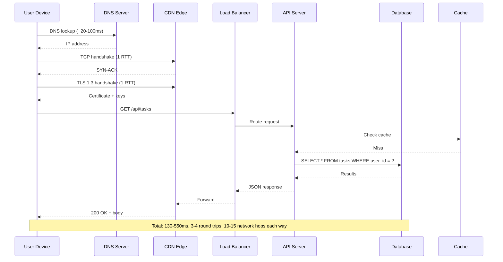
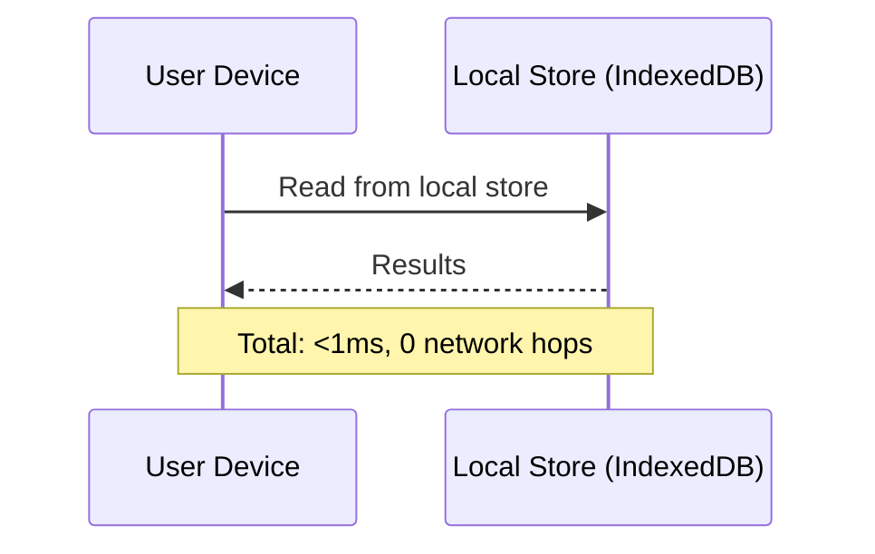
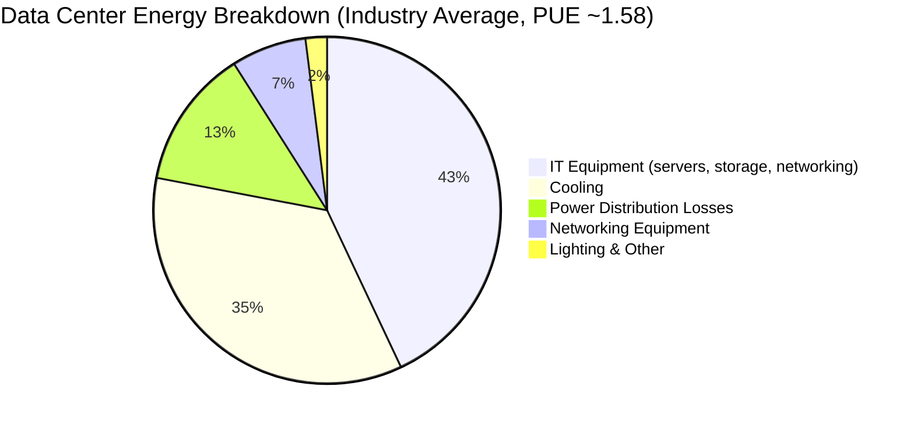
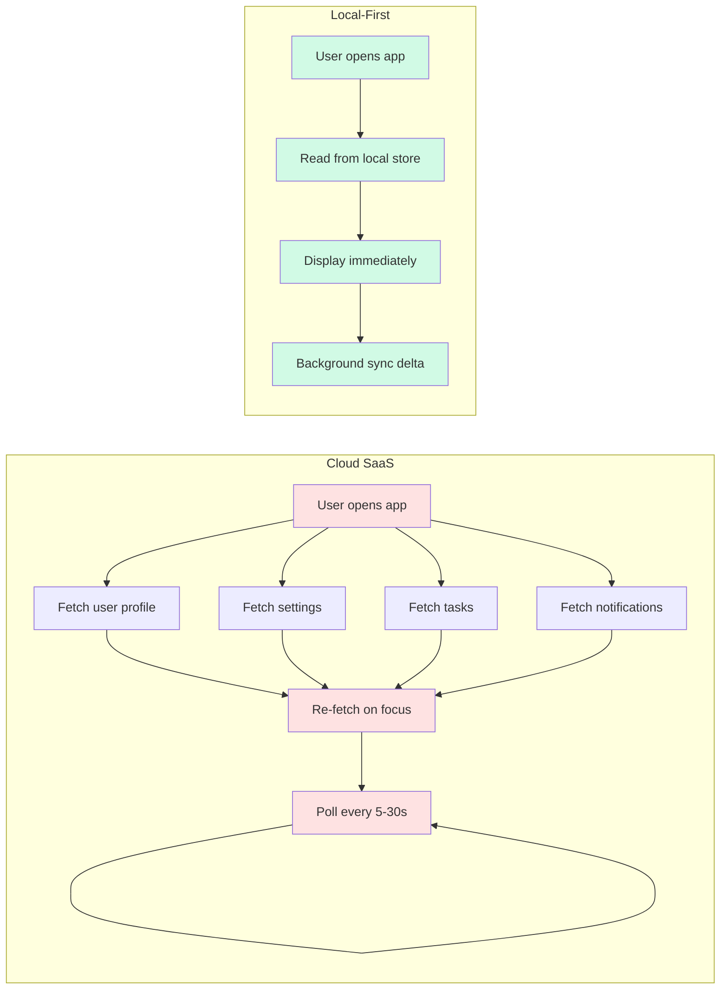
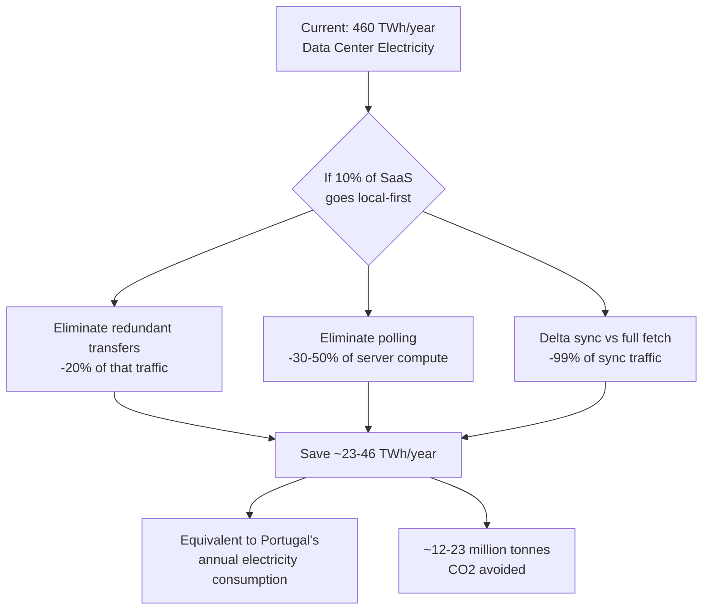
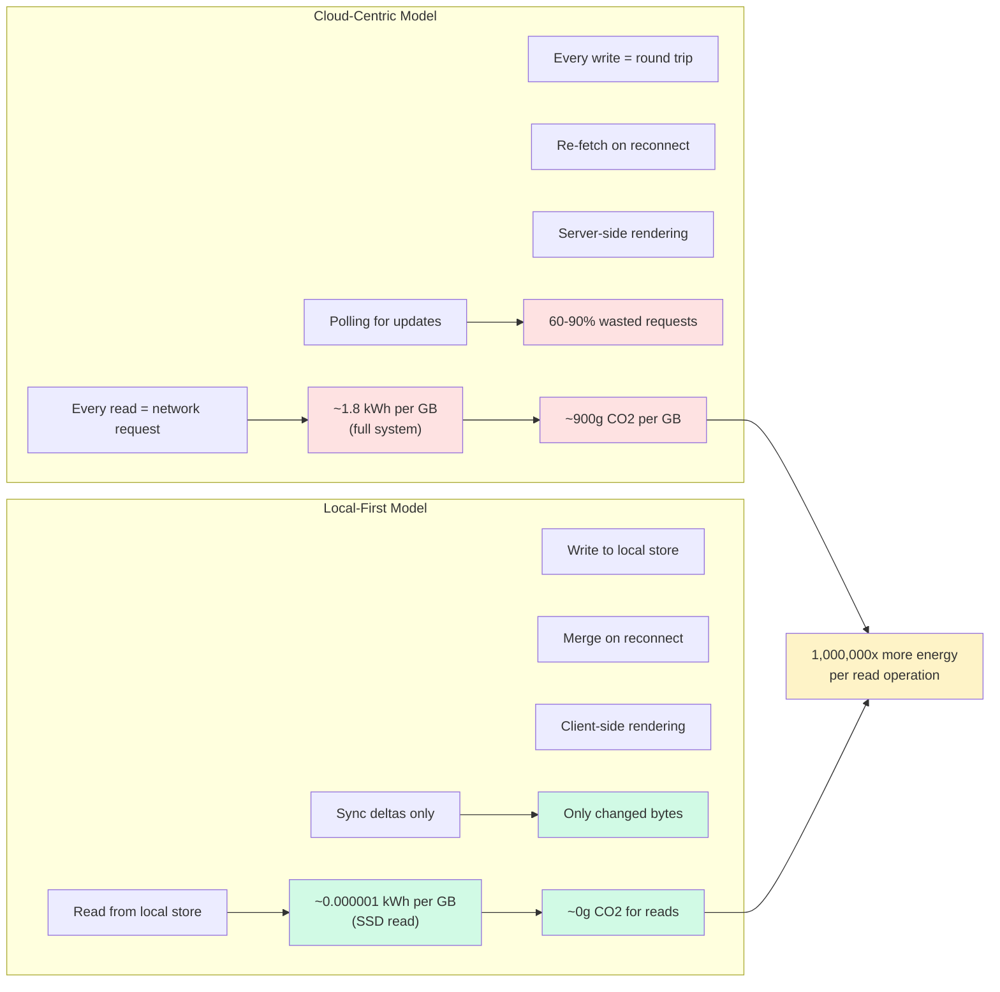

# 0048: The Energy Cost of Moving Data — Local-First vs the Cloud

> **Status:** Exploration
> **Created:** 2026-02-04
> **Tags:** sustainability, local-first, energy, infrastructure, environment

## Summary

Every byte that crosses a network costs energy, time, and money. The cloud-centric model of modern software — where data lives on remote servers and every interaction requires a round trip — imposes massive costs that are invisible to most developers. This exploration quantifies those costs and makes the case that local-first architecture isn't just better UX — it's better for the planet.

---

## The Hidden Cost of a Network Request

When a user taps "refresh" on a typical SaaS app, here's what actually happens:

For a local-first app, the same operation:

**The energy difference is not 2x or 10x. It's roughly 1,000,000x.**

---

## Energy Per Byte: The Numbers

### System Boundaries Matter

The energy cost of transmitting data varies wildly depending on what you measure:

| System Boundary | Energy per GB   | What's Included                          |
| --------------- | --------------- | ---------------------------------------- |
| Network only    | **0.06 kWh/GB** | Routers, switches, fiber optic equipment |
| + Data centers  | **~0.5 kWh/GB** | Servers, cooling, power distribution     |
| + End devices   | **~1.8 kWh/GB** | Client radios, device processing         |

**Sources:** Aslan et al. (2017), "Electricity Intensity of Internet Data Transmission" — Journal of Industrial Ecology; Andrae & Edler (2015), "On Global Electricity Usage of Communication Technology" — MDPI Challenges.

### Local Read vs Remote Read

| Operation                | Energy                | Time           | Cost               |
| ------------------------ | --------------------- | -------------- | ------------------ |
| Read 1 MB from local SSD | ~0.000000001 kWh      | <0.3 ms        | $0.00              |
| Read 1 MB from cloud API | ~0.00006–0.0018 kWh   | 130–550 ms     | $0.00009 (egress)  |
| **Ratio**                | **60,000–1,800,000x** | **400–1,800x** | **$0 vs per-byte** |

The local read takes nanosecond-scale energy — the SSD draws ~3-5W, reads at 3,000+ MB/s, and the entire operation is sub-millisecond. The remote read involves DNS resolution, TCP/TLS handshakes, server processing, database queries, serialization, and multi-hop routing through 10-15 network devices.

---

## Where the Energy Goes

**PUE (Power Usage Effectiveness)** measures overhead. A PUE of 1.58 means for every watt of useful compute, 0.58 watts go to cooling, power conversion, and infrastructure.

| Operator            | PUE  | Overhead  |
| ------------------- | ---- | --------- |
| Industry average    | 1.58 | 58% waste |
| Google              | 1.10 | 10% waste |
| Theoretical minimum | 1.00 | 0% waste  |
| Your laptop         | ~1.0 | ~0% waste |

**Source:** Uptime Institute (2023) Global PUE Survey; Google Sustainability Report (2023).

Local-first eliminates the data center entirely for reads. No cooling. No power distribution. No networking overhead. Just a direct SSD read on hardware that's already powered on.

---

## The Mobile Tax

Mobile networks are especially expensive:

| Medium    | Energy per GB    | Relative Cost |
| --------- | ---------------- | ------------- |
| WiFi      | ~0.02 kWh/GB     | 1x            |
| 4G/LTE    | ~0.46 kWh/GB     | **23x**       |
| 5G        | ~0.2–0.4 kWh/GB  | **10–20x**    |
| Local SSD | ~0.000001 kWh/GB | **0.00005x**  |

**Source:** Low Tech Magazine (2015), "Why We Need a Speed Limit for the Internet," citing multiple studies on mobile radio energy consumption.

### Tail Energy: The Hidden Battery Killer

Mobile radios don't just drain power during transfer. After the last byte, the radio remains in a high-power state for 5-10 seconds, waiting for more data. This "tail energy" accounts for **50-60% of total mobile radio energy consumption** (University of Michigan, 2012).

A SaaS app that polls every 5 seconds keeps the radio permanently in high-power state. A local-first app that syncs via a single persistent WebSocket — or not at all — can let the radio sleep.

```mermaid
gantt
    title Mobile Radio Power State: Polling vs Local-First
    dateFormat X
    axisFormat %s

    section Polling (every 5s)
    High power (request)    :active, 0, 2
    Tail energy (idle wait) :crit, 2, 7
    High power (request)    :active, 7, 9
    Tail energy (idle wait) :crit, 9, 14
    High power (request)    :active, 14, 16
    Tail energy (idle wait) :crit, 16, 21

    section Local-First
    High power (sync burst) :active, 0, 1
    Radio sleep             :done, 1, 21
```

---

## The Redundancy Problem

Most internet traffic is wasted.

### How Much Is Redundant?

| Source              | Finding                                                            |
| ------------------- | ------------------------------------------------------------------ |
| Google research     | ~20-30% of web traffic is re-downloading unchanged resources       |
| Akamai              | ~50% of transferred bytes are potentially cacheable but not cached |
| Typical API polling | 60-90% of poll requests return unchanged data                      |
| HTTP Archive (2024) | Median page makes 71 requests per load                             |

A dashboard that polls `/api/tasks` every 5 seconds generates 17,280 requests per day. If tasks change once per hour, **99.98% of those requests are wasted**.

### What Local-First Eliminates

---

## CRDT Sync Efficiency vs REST Polling

This is where local-first gets its real advantage: **delta sync**.

### The Yjs Benchmark

Kevin Jahns (Yjs creator) tested a real editing trace — a 17-page academic paper with 260,000 individual edits:

| Metric                                   | Yjs                      | REST (full fetch)    |
| ---------------------------------------- | ------------------------ | -------------------- |
| Final document                           | 104,852 chars            | 104,852 chars        |
| Data stored                              | 160 KB (full CRDT state) | ~100 KB (plain text) |
| Per-keystroke sync                       | ~30-50 bytes             | ~100 KB (re-fetch)   |
| Total data transferred for ongoing edits | **~8 MB**                | **~26 GB**           |
| Ratio                                    | 1x                       | **~3,200x more**     |

**Source:** Kevin Jahns (2020), "Are CRDTs suitable for shared editing?"; Joseph Gentle (2021), "5000x faster CRDTs."

### CRDT Performance

| Implementation         | Time (260K ops) | Memory | Relative Speed |
| ---------------------- | --------------- | ------ | -------------- |
| Automerge (v1)         | 291 seconds     | 880 MB | 1x             |
| Yjs                    | 0.97 seconds    | 3.3 MB | **300x**       |
| Diamond Types (WASM)   | 0.19 seconds    | —      | **1,500x**     |
| Diamond Types (native) | 0.056 seconds   | —      | **5,000x**     |

**Source:** Joseph Gentle (2021), "5000x faster CRDTs: An Adventure in Optimization."

---

## The Money

### Cloud Egress: A Tax on Every Byte

| Provider        | Egress Cost     | Notes                   |
| --------------- | --------------- | ----------------------- |
| AWS S3          | $0.05–$0.09/GB  | After 100 GB/month free |
| Google Cloud    | $0.085–$0.12/GB | After 200 GB/month free |
| Azure           | $0.087/GB       | After 100 GB/month free |
| Cloudflare      | $0.00/GB        | No egress fees          |
| **Local-first** | **$0.00/GB**    | **Forever**             |

**Source:** AWS, GCP, Azure pricing pages (2025).

### Example: 100K-User SaaS

| Scenario                     | Daily Egress   | Monthly Cost    | Annual Cost       |
| ---------------------------- | -------------- | --------------- | ----------------- |
| Cloud SaaS (100 MB/user/day) | 10 TB          | $15,000–$27,000 | $180,000–$324,000 |
| Local-first (sync only)      | ~10 GB         | $0–$1           | $0–$12            |
| **Savings**                  | **99.9% less** | **~$25,000/mo** | **~$300,000/yr**  |

The local-first app only transfers the CRDT deltas — typically 1,000–10,000x less data than the full payloads a cloud SaaS re-fetches on every interaction.

---

## Environmental Impact

### CO2 Per Gigabyte

| System Boundary | CO2 per GB |
| --------------- | ---------- |
| Network only    | ~30g CO2   |
| Full system     | ~900g CO2  |

Derived from energy figures × global grid average of ~0.5 kgCO2/kWh.

### Global Scale

- Data centers consumed **~460 TWh** in 2022 (IEA) — about 1.3% of global electricity.
- This is projected to reach **~1,000 TWh by 2026** (largely driven by AI).
- If the internet were a country, it would be the **13th largest emitter** of CO2, between Mexico and Brazil.
- The full ICT sector (including device manufacturing) emits **~1-2 billion tonnes CO2/year**.

**Sources:** IEA (2024), "Data Centres and Data Transmission Networks"; Sustainable Web Design Model V4.

### What If 10% of SaaS Went Local-First?

That's a conservative estimate. The real savings compound: less traffic means fewer servers, less cooling, less networking equipment, and less manufacturing of hardware that doesn't need to exist.

---

## The Full Picture

---

## What This Means for xNet

xNet's architecture eliminates the vast majority of network traffic by design:

1. **All reads are local.** `useQuery` reads from IndexedDB. Zero network requests. Zero energy. Zero latency.

2. **Writes are local-first.** `useMutate` writes to the local store, then syncs deltas in the background.

3. **Sync is delta-based.** Yjs CRDTs send only the changed bytes — typically 30-50 bytes per operation vs 100+ KB for a full REST re-fetch.

4. **No polling.** Changes propagate via WebSocket/WebRTC when available. No wasted requests when nothing has changed.

5. **Offline by default.** No network connection = no energy spent on networking. The app works regardless.

6. **Hub-optional.** P2P sync means peers can sync directly without any server infrastructure. A Hub is useful for always-on relay and backup, but it's not required.

For a collaborative note-taking app with 10,000 users:

| Architecture       | Daily Data Transfer | Daily Energy | Monthly Egress Cost |
| ------------------ | ------------------- | ------------ | ------------------- |
| Traditional SaaS   | ~1 TB               | ~1.8 MWh     | ~$90                |
| Local-first (xNet) | ~1 GB               | ~0.0018 MWh  | ~$0                 |
| **Reduction**      | **99.9%**           | **99.9%**    | **100%**            |

---

## Key Takeaways

1. **A remote read costs ~1,000,000x more energy than a local read.** This isn't an approximation — it's physics.

2. **60-90% of cloud API traffic is redundant.** Polling, re-fetching unchanged data, and cache misses waste enormous amounts of energy.

3. **CRDTs transfer ~1,000-10,000x less data** than REST polling for collaborative workloads.

4. **Mobile networks amplify the problem 10-23x** over WiFi, and tail energy means even small requests have outsized battery impact.

5. **Cloud egress costs $0.05-$0.12/GB.** Local reads cost $0/GB. Forever.

6. **If 10% of SaaS went local-first**, we'd save ~23-46 TWh/year — equivalent to Portugal's annual electricity consumption.

7. **Local-first isn't just a developer experience improvement.** It's a fundamentally more efficient architecture for the planet.

---

## Sources

1. Aslan et al. (2017), "Electricity Intensity of Internet Data Transmission: Untangling the Estimates" — Journal of Industrial Ecology
2. Andrae & Edler (2015), "On Global Electricity Usage of Communication Technology: Trends to 2030" — MDPI Challenges
3. Shehabi et al. (2016), "United States Data Center Energy Usage Report" — Lawrence Berkeley National Laboratory
4. Jones, N. (2018), "How to stop data centres from gobbling up the world's electricity" — Nature 561, 163-166
5. IEA (2024), "Data Centres and Data Transmission Networks"
6. Cisco Annual Internet Report (2018-2023)
7. HTTP Archive Web Almanac (2024), Page Weight chapter
8. Kevin Jahns (2020), "Are CRDTs suitable for shared editing?" — blog.kevinjahns.de
9. Joseph Gentle (2021), "5000x faster CRDTs: An Adventure in Optimization" — josephg.com
10. Low Tech Magazine (2015), "Why We Need a Speed Limit for the Internet"
11. Uptime Institute (2023), Global PUE Survey
12. Sustainable Web Design Model V4, Green Web Foundation
13. IDC Global DataSphere (via Statista, 2025)
14. AWS S3 Pricing (2025)
