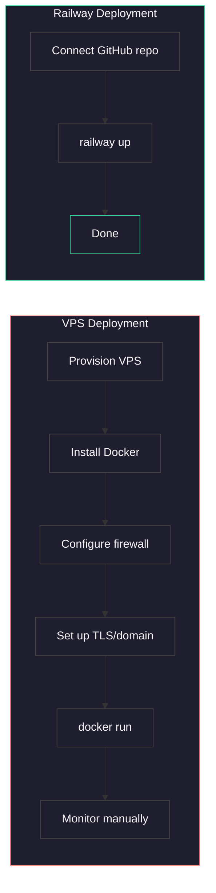
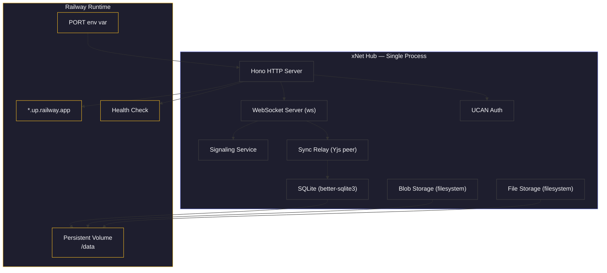
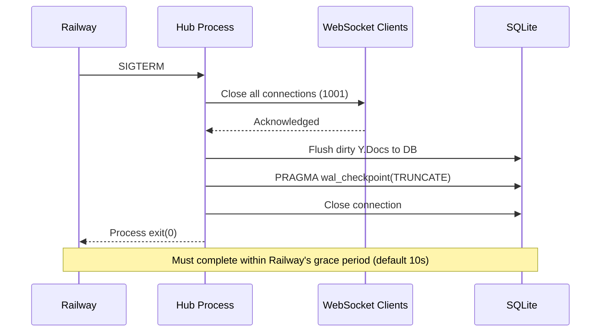
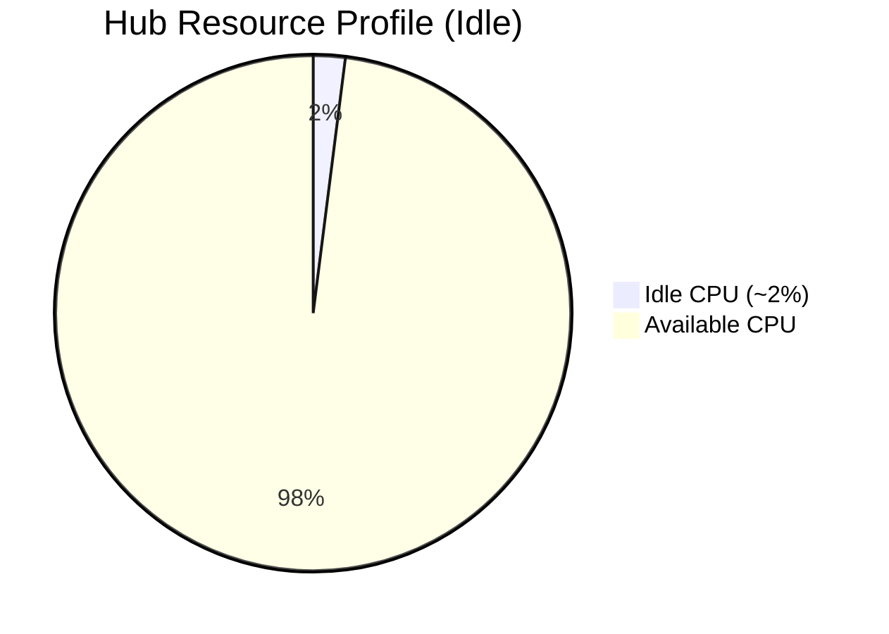
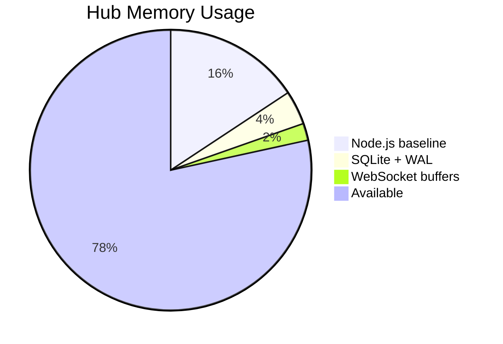
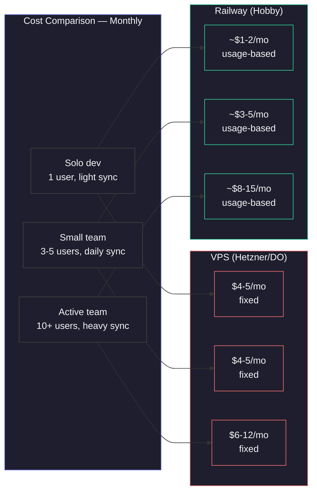
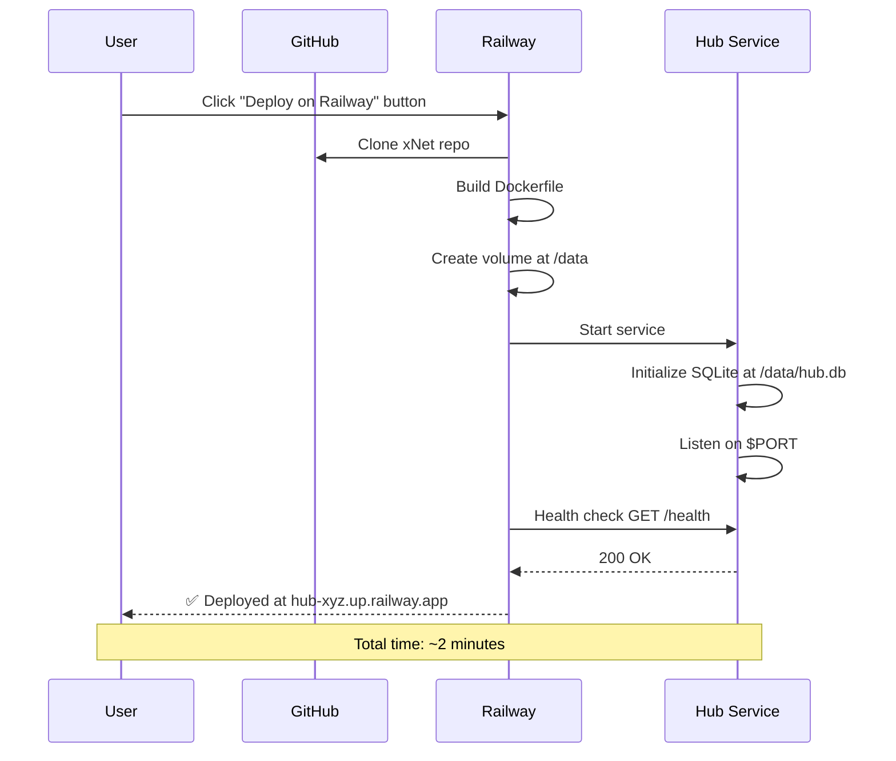
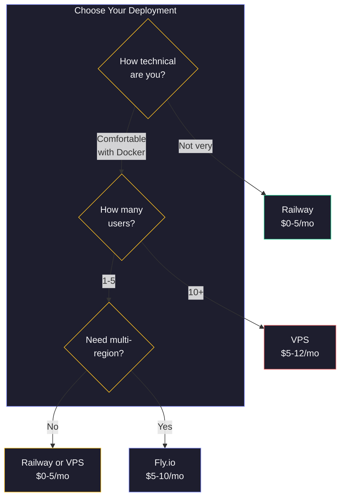

# 0049: Hub Deployment on Railway — PaaS as a Competitive Alternative to VPS

> **Status:** Exploration
> **Created:** 2026-02-04
> **Tags:** hub, deployment, railway, infrastructure, pricing, PaaS

## Summary

The xNet Hub is currently designed for VPS deployment (Docker on a $5/month server). This exploration investigates Railway as a deployment target — a usage-based PaaS that could be cheaper for low-traffic Hubs, simpler to deploy, and more aligned with the "zero-ops" ethos of local-first software. We analyze what architectural changes are needed, compare costs at various usage levels, and propose a `railway.toml` config-as-code approach.

---

## Why Consider Railway?

The current Hub deployment story is:

```
docker run -d -p 4444:4444 -v xnet-hub-data:/data ghcr.io/crs48/xnet-hub:latest
```

This assumes the user has:

1. A VPS with Docker installed
2. SSH access and basic sysadmin knowledge
3. A domain + TLS configured (nginx/Caddy reverse proxy)
4. Monitoring and restart policies set up manually

Railway eliminates all of that:



---

## Railway Platform Constraints

### What Railway Provides

| Feature                | Details                                               |
| ---------------------- | ----------------------------------------------------- |
| **Docker support**     | Full Dockerfile builds, custom paths supported        |
| **Persistent volumes** | Mounted at runtime (not build time), root-owned       |
| **WebSockets**         | Native support via HTTP proxy                         |
| **Custom domains**     | Free Railway subdomain + custom domains with auto-TLS |
| **Config as code**     | `railway.toml` or `railway.json` in repo              |
| **Health checks**      | HTTP endpoint polling                                 |
| **Auto-deploy**        | On git push to connected branch                       |
| **Logs + metrics**     | CPU/RAM/disk/network built-in                         |
| **Private networking** | Service-to-service within a project                   |

### What Railway Does NOT Provide

| Constraint                             | Impact on Hub                                                          |
| -------------------------------------- | ---------------------------------------------------------------------- |
| **No build-time volumes**              | SQLite migrations must run at start, not during build                  |
| **Volume mounted as root**             | Must set `RAILWAY_RUN_UID=0` or adjust file permissions                |
| **Volume not available in pre-deploy** | DB migrations must be in the start command                             |
| **Single region per service (Hobby)**  | No multi-region for Hobby tier; Pro supports concurrent regions        |
| **5 GB max volume (Hobby)**            | Sufficient for most personal Hubs, Pro supports up to 1 TB             |
| **No raw TCP**                         | WebSocket over HTTP works fine; raw TCP proxy available but not needed |

---

## Hub Architecture Compatibility

The Hub is a single-process Node.js server with Hono (HTTP) + ws (WebSocket). Let's evaluate each component:



### Component Compatibility Matrix

| Component               | Railway Compatible? | Notes                                         |
| ----------------------- | :-----------------: | --------------------------------------------- |
| Hono HTTP               |         Yes         | Listen on `PORT` env var (Railway injects it) |
| WebSocket (ws)          |         Yes         | Upgrade handled by Railway's HTTP proxy       |
| SQLite (better-sqlite3) |         Yes         | Volume-backed, WAL mode works on ext4         |
| Blob storage (fs)       |         Yes         | Write to volume mount path                    |
| File storage (fs)       |         Yes         | Write to volume mount path                    |
| UCAN auth               |         Yes         | Stateless, no external deps                   |
| Health check            |         Yes         | `/health` endpoint already exists             |

**Verdict: Fully compatible.** The Hub's single-process, SQLite-based architecture is ideal for Railway.

---

## Required Changes

### 1. Respect the PORT Environment Variable

Railway injects a `PORT` environment variable that the service must listen on. The Hub currently defaults to `4444` via CLI flag.

**Change required in `packages/hub/src/server.ts`:**

```typescript
// Before
const port = config.port // defaults to 4444

// After
const port = Number(process.env.PORT) || config.port // Railway injects PORT
```

This is a one-line change and is backward-compatible with VPS deployment.

### 2. Use RAILWAY_VOLUME_MOUNT_PATH for Data Directory

Railway provides `RAILWAY_VOLUME_MOUNT_PATH` when a volume is attached. The Hub should respect this:

```typescript
// In cli.ts or config resolution
const dataDir =
  process.env.HUB_DATA_DIR || process.env.RAILWAY_VOLUME_MOUNT_PATH || './xnet-hub-data'
```

### 3. Handle Volume Permissions

Railway mounts volumes as root. Since the Hub Dockerfile planned to use the `node` user, we need either:

- **Option A:** Set `RAILWAY_RUN_UID=0` (run as root on Railway)
- **Option B:** `chown` the volume directory in the entrypoint script

Option A is simpler and fine for a single-user Hub.

### 4. Graceful Shutdown on SIGTERM

Railway sends SIGTERM before stopping a service. The Hub already plans graceful shutdown (flush WAL, close WebSockets), but this must be implemented and tested:



### 5. Config as Code (railway.toml)

Add a `railway.toml` to the Hub package for one-click deployment:

```toml
[build]
builder = "dockerfile"
dockerfilePath = "Dockerfile"

[deploy]
startCommand = "node dist/cli.js --port $PORT --data $RAILWAY_VOLUME_MOUNT_PATH"
healthcheckPath = "/health"
healthcheckTimeout = 10
restartPolicyType = "on_failure"
restartPolicyMaxRetries = 5
```

---

## Cost Comparison

### Railway Pricing Model

Railway charges per-second for actual usage:

| Resource | Rate                                 |
| -------- | ------------------------------------ |
| CPU      | $0.000463/vCPU/min                   |
| Memory   | $0.000231/GB/min                     |
| Volume   | $0.00000006/GB/sec (~$0.16/GB/month) |
| Egress   | $0.05/GB                             |

The Hobby plan includes $5/month of credits.

### Estimating Hub Resource Usage

A typical personal Hub (1-5 users, occasional sync):





**Estimated idle baseline:**

- CPU: ~0.02 vCPU average (spikes during sync)
- Memory: ~55 MB steady state
- Volume: 1 GB (growing slowly)

### Monthly Cost Scenarios



#### Detailed Breakdown: Solo Dev

| Resource  | Usage                 | Railway Cost  | VPS Cost    |
| --------- | --------------------- | ------------- | ----------- |
| CPU       | 0.02 vCPU avg \* 730h | $0.67/mo      | Included    |
| Memory    | 55 MB \* 730h         | $0.60/mo      | Included    |
| Volume    | 1 GB                  | $0.16/mo      | Included    |
| Egress    | ~0.5 GB               | $0.03/mo      | Included    |
| **Total** |                       | **~$1.46/mo** | **$4-5/mo** |

With the $5 Hobby credit, the solo dev pays **$0/mo** — the Hub fits entirely within free credits.

#### Detailed Breakdown: Small Team (5 users)

| Resource  | Usage                 | Railway Cost  | VPS Cost    |
| --------- | --------------------- | ------------- | ----------- |
| CPU       | 0.08 vCPU avg \* 730h | $2.70/mo      | Included    |
| Memory    | 80 MB \* 730h         | $0.87/mo      | Included    |
| Volume    | 2 GB                  | $0.32/mo      | Included    |
| Egress    | ~2 GB                 | $0.10/mo      | Included    |
| **Total** |                       | **~$3.99/mo** | **$4-5/mo** |

Still within the $5 Hobby credit for most months. **Effectively free or $0-1/mo after credits.**

#### Crossover Point

Railway becomes more expensive than a $5 VPS at roughly:

- **8-10 concurrent users** with frequent sync activity
- **Sustained CPU > 0.1 vCPU** (constant WebSocket traffic)
- **> 5 GB stored data** (volume costs exceed Hobby tier limits)

For most personal and small-team Hubs, Railway is cheaper or comparable.

---

## Deployment Flow

### One-Click Deploy (Recommended)



We can add a "Deploy on Railway" button to the README and docs:

```markdown
[](https://railway.app/template/xnet-hub)
```

This creates a Railway template that pre-configures:

- The Dockerfile build
- A persistent volume at `/data`
- Environment variables (`HUB_DATA_DIR=/data`, `NODE_ENV=production`)
- Health check at `/health`

### CLI Deploy

```bash
# Install Railway CLI
npm i -g @railway/cli

# Login and initialize
railway login
railway init

# Link to existing project or create new
railway link

# Deploy
railway up
```

---

## Railway vs VPS vs Fly.io



| Feature               | Railway             | VPS (Hetzner/DO)       | Fly.io           |
| --------------------- | ------------------- | ---------------------- | ---------------- |
| **Setup time**        | ~2 min              | ~30 min                | ~10 min          |
| **TLS/domain**        | Automatic           | Manual (Caddy/nginx)   | Automatic        |
| **Monitoring**        | Built-in dashboard  | DIY (Prometheus, etc.) | Built-in         |
| **Pricing model**     | Per-second usage    | Fixed monthly          | Per-second usage |
| **Idle cost**         | ~$1.50/mo           | $4-5/mo                | ~$3-5/mo         |
| **WebSocket support** | Native              | Native                 | Native           |
| **Persistent volume** | Yes (5 GB Hobby)    | Yes (unlimited)        | Yes (1-500 GB)   |
| **Multi-region**      | Pro plan only       | Manual                 | Built-in         |
| **Git deploy**        | Yes                 | Manual or CI/CD        | Yes              |
| **SQLite + WAL**      | Works on volume     | Works                  | Works on volume  |
| **Root access**       | No                  | Yes                    | No               |
| **Auto-scaling**      | Vertical auto-scale | Manual                 | Auto-scale       |

---

## Implementation Plan

### Phase 1: Minimal Railway Support (1-2 hours)

1. **Read `PORT` env var** in `server.ts` — one line
2. **Read `RAILWAY_VOLUME_MOUNT_PATH`** in config resolution — one line
3. **Add `railway.toml`** to `packages/hub/` — 10 lines
4. **Test locally** with `PORT=3000 node dist/cli.js`

### Phase 2: One-Click Template (1 hour)

1. Create Railway template at railway.app/template
2. Pre-configure volume, env vars, health check
3. Add "Deploy on Railway" button to Hub docs and README

### Phase 3: Documentation (1 hour)

1. Add Railway deployment guide to `site/src/content/docs/docs/guides/hub.mdx`
2. Update landing page Hubs section to mention Railway as alternative
3. Add cost comparison table to docs

---

## Open Questions

1. **Railway sleep/wake behavior** — Does Railway support sleeping idle services (like Fly.io machines)? If so, WebSocket connections would drop on sleep. The Hub could reconnect gracefully, but this needs testing.

2. **Volume backup strategy** — Railway supports volume backups, but how do we automate SQLite-safe backups? We should checkpoint WAL before Railway snapshots the volume.

3. **Egress costs at scale** — At $0.05/GB, egress is the main variable cost. For Hubs that serve large files (images, attachments), egress could dominate. Railway's Object Storage ($0.015/GB-month, free egress) might be better for blob/file storage.

4. **WebSocket idle timeout** — Does Railway's HTTP proxy have an idle timeout for WebSocket connections? If so, we need heartbeat/ping intervals shorter than that timeout.

5. **Monorepo deployment** — The Hub is in `packages/hub/` within a monorepo. Railway supports custom Dockerfile paths (`RAILWAY_DOCKERFILE_PATH`), but we need to verify the build context includes workspace dependencies (`@xnet/core`, `@xnet/crypto`, `@xnet/identity`).

---

## Key Takeaways

- The xNet Hub is **already architecturally compatible** with Railway — single process, SQLite, filesystem storage
- Required code changes are **minimal** — 2-3 lines to respect Railway env vars, plus a `railway.toml`
- Railway is **cheaper for small Hubs** ($0-2/mo vs $5/mo fixed VPS) thanks to usage-based pricing and the $5 Hobby credit
- Railway is **dramatically simpler to deploy** — no SSH, no Docker knowledge, no TLS configuration
- The crossover point where VPS becomes cheaper is around **8-10 active users** with heavy sync
- We should support **both** deployment targets: Railway for simplicity, VPS/Fly.io for power users
