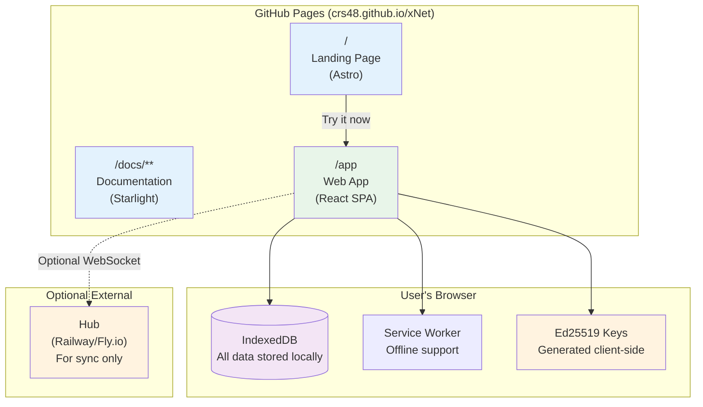
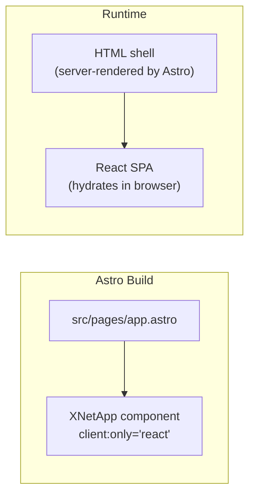
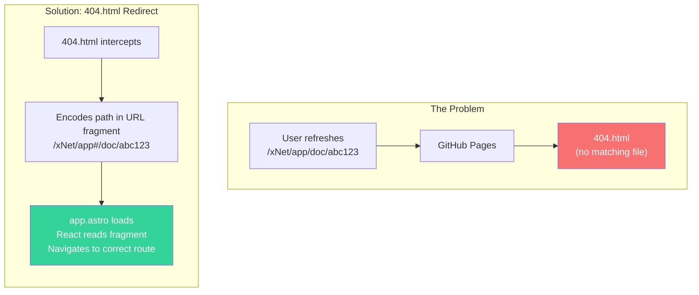
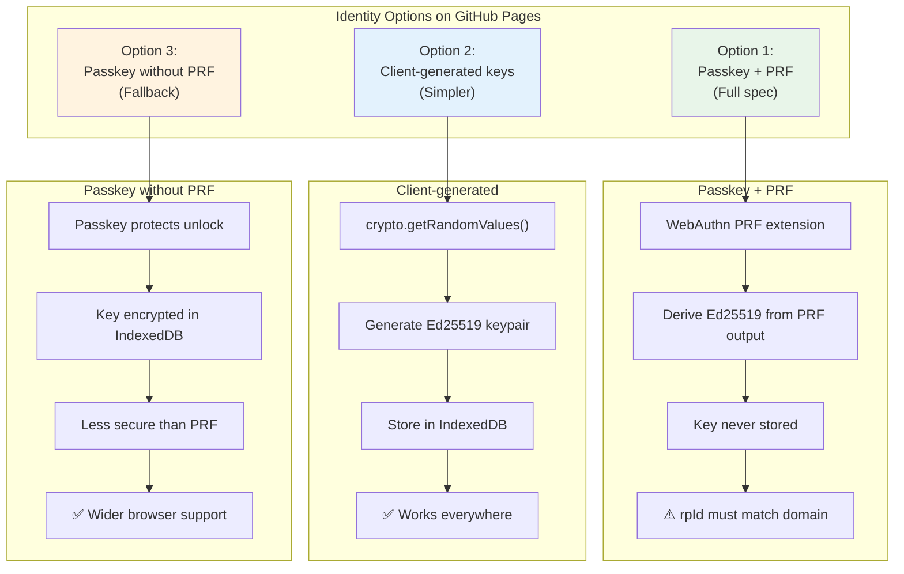
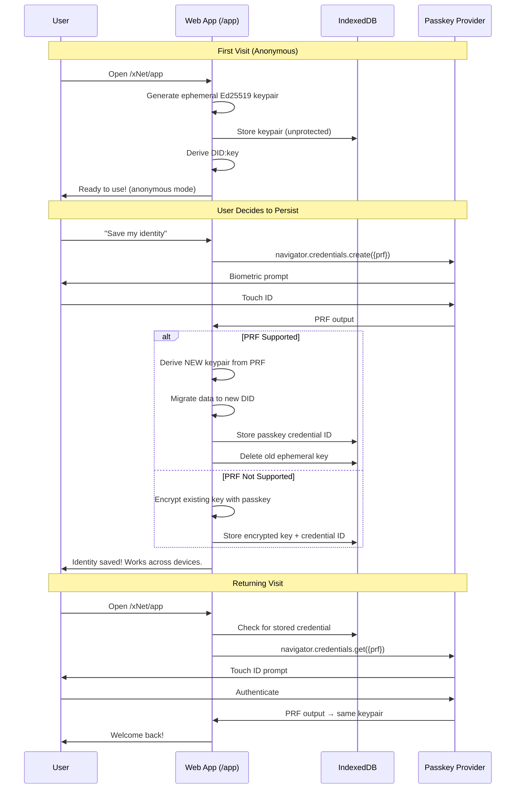
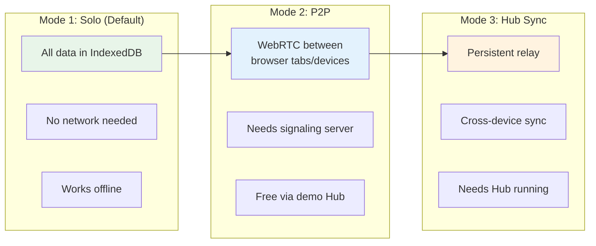
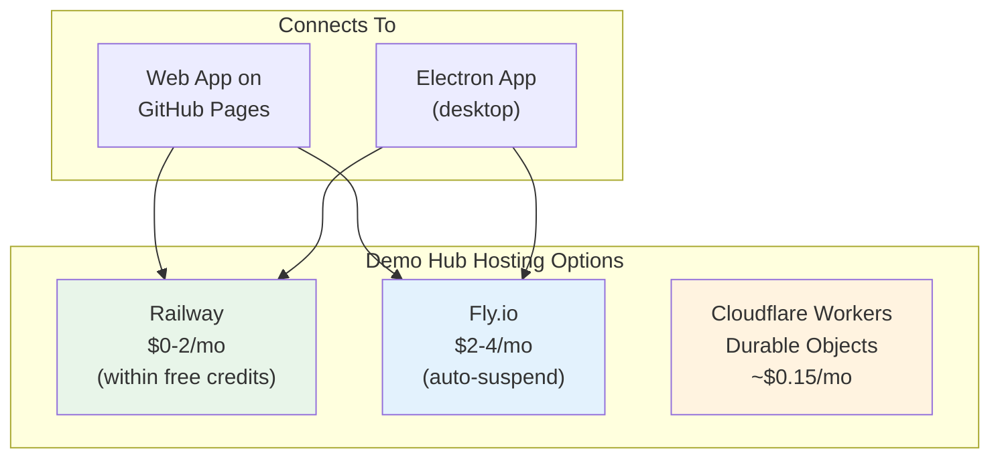
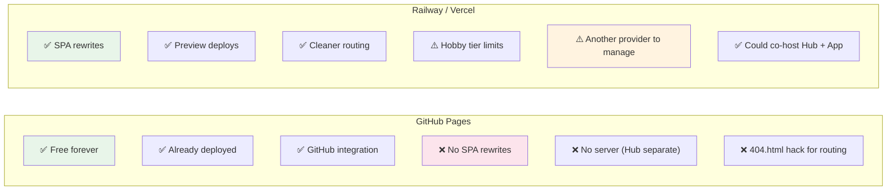
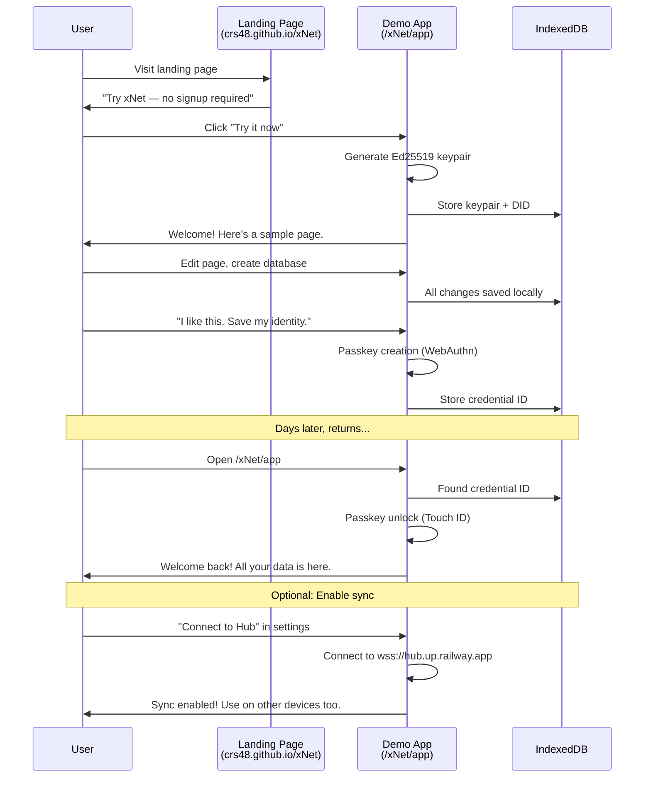
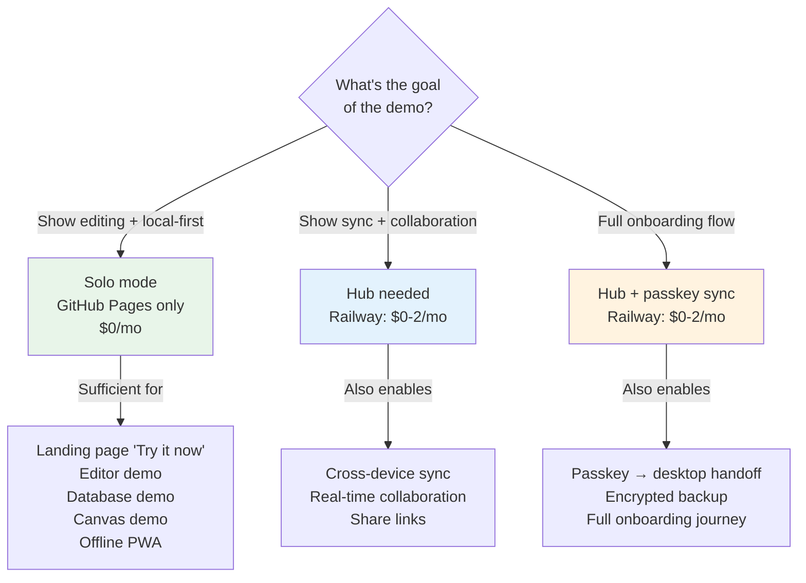

# 0050: Hosting xNet Web App on GitHub Pages — Free Demo at /app

> **Status:** Completed
> **Created:** 2026-02-04
> **Tags:** web-app, github-pages, deployment, onboarding, identity, demo

## Implementation Status

- [x] **Vite base path** — `base: '/app/'` in `apps/web/vite.config.ts`
- [x] **TanStack Router basepath** — `basepath: '/app'` configured
- [x] **PWA manifest scope** — `scope: '/app/'` for service worker
- [x] **Deploy workflow** — `deploy-site.yml` builds web app and copies to `site/dist/app/`
- [x] **SPA fallback** — 404.html copied for client-side routing
- [x] **CNAME** — `xnet.fyi` custom domain configured
- [x] **Landing page CTA** — "Try it now" button links to `/app`
- [x] **Passkey identity** — Client-side Ed25519 key generation via `@xnet/identity`
- [x] **Progressive identity** — Onboarding flow with passkey creation
- [x] **Hub connection** — `wss://hub.xnet.fyi` as default signaling URL

## Summary

This exploration investigates embedding the xNet web app (currently `apps/web/`) into the Astro documentation site at `/app`, deployed for free on GitHub Pages. We analyze the technical feasibility, identity/key generation without a server, sync constraints, onboarding tradeoffs, and compare GitHub Pages hosting vs Railway/Vercel alternatives.

**Key finding:** A fully functional demo app on GitHub Pages is feasible — the web app is already a static SPA with IndexedDB storage and ~320 KB gzipped. The main challenges are SPA routing on GitHub Pages, identity generation without a backend, and sync without a Hub. All are solvable.

---

## Current State

### Web App (`apps/web/`)

| Property          | Value                                        |
| ----------------- | -------------------------------------------- |
| Framework         | React 18 + Vite 5 + TanStack Router          |
| Output            | Static SPA (~1 MB raw, ~320 KB gzipped)      |
| Storage           | IndexedDB (structured data + blobs)          |
| Identity          | Hardcoded placeholder DID + fake signing key |
| Sync              | Disabled (`disableSync: true`)               |
| PWA               | Configured (Workbox service worker)          |
| Server dependency | **None** — fully client-side                 |

### Astro Site (`site/`)

| Property     | Value                                             |
| ------------ | ------------------------------------------------- |
| Output       | Static (SSG), deployed to GitHub Pages            |
| Base URL     | `/xNet`                                           |
| Routing      | Landing page at `/`, Starlight docs at `/docs/**` |
| React        | Not installed — pure Astro components             |
| `/app` route | **Unclaimed** — available                         |

---

## Architecture: How It Would Work



The app runs entirely in the browser. GitHub Pages serves the static files. No server needed for core functionality — identity, storage, editing, and offline all work without a backend.

---

## Technical Implementation

### 1. Embedding React in the Astro Site

Two approaches:

#### Option A: Astro React Island (Recommended)

Add `@astrojs/react` to the site and create a catch-all page:



```astro
<!-- site/src/pages/app.astro -->
---
import AppLayout from '../layouts/AppLayout.astro'
---
<AppLayout title="xNet App">
  <div id="app-root">
    <!-- React mounts here via client:only -->
    <XNetApp client:only="react" />
  </div>
</AppLayout>
```

Astro renders the HTML shell at build time. React takes over in the browser. The `client:only="react"` directive means zero server-side rendering of React — it's purely a client-side SPA.

#### Option B: Separate Vite Build, Copy to dist

Build the web app separately and copy `apps/web/dist/` into `site/dist/app/`:

```bash
# In CI/CD
cd apps/web && pnpm build --base /xNet/app/
cp -r dist/ ../site/dist/app/
```

This is simpler but creates two separate builds and duplicates React/Tailwind bundles.

**Recommendation: Option A** — single build, shared dependencies, consistent styling.

### 2. SPA Routing on GitHub Pages

GitHub Pages serves static files — there's no server to handle `pushState` routing. When a user navigates to `/xNet/app/doc/abc123` and refreshes, GitHub Pages returns 404.



Three solutions:

| Solution                       | Complexity |                             UX                             |
| ------------------------------ | :--------: | :--------------------------------------------------------: |
| **Hash routing** (`#/doc/abc`) |    Low     |               Ugly URLs but works perfectly                |
| **404.html redirect trick**    |   Medium   |             Clean URLs, brief flash on refresh             |
| **Pre-render known routes**    |    High    | Clean URLs, no flash, but can't pre-render dynamic doc IDs |

**Recommendation: Hash routing** for the demo. It's the simplest and most reliable on GitHub Pages. TanStack Router supports `createHashHistory()`.

### 3. Identity & Key Generation

This is the most interesting challenge. The onboarding plan (`plan03_9_1OnboardingAndPolish`) specifies passkey-based identity with PRF key derivation. Can we do this on GitHub Pages?



#### Passkey PRF on GitHub Pages

The WebAuthn `rpId` (Relying Party ID) is tied to the domain. For GitHub Pages:

- **rpId:** `crs48.github.io`
- **origin:** `https://crs48.github.io`

This works! Passkeys created on `crs48.github.io` are valid for that domain. However:

| Concern                              | Impact                                                  |
| ------------------------------------ | ------------------------------------------------------- |
| Passkey is tied to `crs48.github.io` | If we later move to `xnet.dev`, passkeys won't transfer |
| PRF support                          | Chrome 116+, Safari 18+, Firefox experimental           |
| Cross-device passkey sync            | Works via iCloud Keychain / Google Password Manager     |

**The rpId portability problem is significant.** If a user creates a passkey on `crs48.github.io` and we later host on `xnet.dev`, they can't use that passkey. Their DID would be the same (derived from PRF output which is the same regardless of rpId), but they'd need to re-register the passkey on the new domain.

#### Recommended Approach: Progressive Identity



This approach:

1. **Zero friction start** — user starts immediately with a generated key
2. **Optional upgrade** — passkey protection when they're ready
3. **Works on GitHub Pages** — no server needed for WebAuthn (it's a client-side API)
4. **Portable** — if they later use the Electron app, same passkey = same DID

### 4. Sync Without a Hub

The demo can work in three modes:



| Mode         | Requirements     | Cost           | UX                                |
| ------------ | ---------------- | -------------- | --------------------------------- |
| **Solo**     | Nothing          | Free           | Single device, all data local     |
| **P2P**      | Signaling server | ~$0 (demo Hub) | Multi-tab/device when both online |
| **Hub sync** | Running Hub      | ~$0-5/mo       | Async sync, backup, search        |

**For the GitHub Pages demo, Solo mode is the default.** Users create and edit content with zero infrastructure. If they want sync, they can:

1. Connect to our demo Hub (we'd run one on Railway for ~$0-2/mo)
2. Self-host their own Hub

This is actually _the perfect demo of local-first_: everything works without a server.

### 5. What We Can Demo Without a Hub

| Feature               | Works on GH Pages? | Notes                                 |
| --------------------- | :----------------: | ------------------------------------- |
| Create/edit pages     |        Yes         | Rich text editor (TipTap)             |
| Create/edit databases |        Yes         | Schema system, 15 property types      |
| Canvas                |        Yes         | Infinite canvas with spatial indexing |
| Offline               |        Yes         | Service worker + IndexedDB            |
| Identity (basic)      |        Yes         | Client-generated Ed25519 keys         |
| Identity (passkey)    |        Yes         | WebAuthn is a client-side API         |
| File attachments      |        Yes         | Stored in IndexedDB blobs             |
| Search                |        Yes         | Client-side IndexedDB queries         |
| Sync between devices  |         No         | Needs signaling server                |
| Encrypted backup      |         No         | Needs Hub                             |
| Sharing/collaboration |         No         | Needs Hub + signaling                 |

### 6. What We Need a Hub For

If we want the demo to support sync, we need a running Hub. Options:



---

## GitHub Pages vs Alternative Hosts

### For the Static Site + Demo App

| Feature                  |  GitHub Pages  | Railway (Static) |     Vercel      |   Cloudflare Pages    |
| ------------------------ | :------------: | :--------------: | :-------------: | :-------------------: |
| **Cost**                 |      Free      |   ~$0 (static)   |  Free (Hobby)   |         Free          |
| **Custom domain**        |      Yes       |       Yes        |       Yes       |          Yes          |
| **SPA routing**          | 404.html hack  | Native rewrites  | Native rewrites |    Native rewrites    |
| **Build CI/CD**          | GitHub Actions |     Git push     |    Git push     |       Git push        |
| **Bandwidth**            |   100 GB/mo    |     Included     |    100 GB/mo    |       Unlimited       |
| **Deploy from monorepo** | Yes (Actions)  |       Yes        |       Yes       |          Yes          |
| **WebSocket (for Hub)**  |       No       |       Yes        | No (serverless) | Yes (Durable Objects) |

### The Key Tradeoff



**Recommendation: Start on GitHub Pages, migrate if needed.** The hash routing limitation is minor for a demo. If we later want clean URLs, we can move the app to Vercel/Cloudflare Pages while keeping docs on GitHub Pages, or use a custom domain with Cloudflare in front.

---

## Onboarding Flow on GitHub Pages

Based on the onboarding plan (`plan03_9_1OnboardingAndPolish`), here's how the user journey maps to a GitHub Pages demo:



### What the Onboarding Plan Requires vs What GitHub Pages Can Do

| Onboarding Step                   | Needs Server? |              GitHub Pages?              |
| --------------------------------- | :-----------: | :-------------------------------------: |
| Visit landing page                |      No       |                   Yes                   |
| Try web app immediately           |      No       |                   Yes                   |
| Generate identity (Ed25519)       |      No       |                   Yes                   |
| Passkey creation (WebAuthn PRF)   |      No       |                   Yes                   |
| Passkey unlock (returning user)   |      No       |                   Yes                   |
| Create pages, databases, canvases |      No       |                   Yes                   |
| Offline access (PWA)              |      No       |                   Yes                   |
| Cross-device sync via passkey     | **Yes** (Hub) | Partial — passkey syncs, data needs Hub |
| Hub-mediated sync                 | **Yes** (Hub) |            Need external Hub            |
| Share via link                    | **Yes** (Hub) |            Need external Hub            |
| Download desktop app              |      No       |      Yes (link to GitHub Releases)      |

**8 of 11 onboarding steps work on GitHub Pages with zero infrastructure.**

---

## Implementation Plan

### Phase 1: Static Demo (No Sync)

1. Install `@astrojs/react` and `react`/`react-dom` in `site/`
2. Create `site/src/pages/app.astro` with React `client:only` island
3. Port essential web app components (editor, database, canvas)
4. Implement client-side key generation (replace hardcoded DID)
5. Configure hash routing for TanStack Router
6. Add "Try it now" button on landing page linking to `/xNet/app`
7. Add PWA manifest and icons

### Phase 2: Identity (Passkey)

1. Implement `createIdentityManager()` from passkey plan
2. Progressive identity: start anonymous, upgrade to passkey
3. Store credential ID + public key in IndexedDB
4. Implement passkey unlock flow

### Phase 3: Optional Sync (External Hub)

1. Deploy demo Hub on Railway (~$0-2/mo)
2. Add Hub URL configuration in app settings
3. Re-enable `WebSocketSyncProvider` when Hub URL is set
4. Add "Connect to Hub" onboarding step (optional)

---

## Bundle Size Considerations

Current web app bundle: ~985 KB raw, ~313 KB gzipped. Adding it to the Astro site:

| Component                      | Size Impact              |
| ------------------------------ | ------------------------ |
| React + ReactDOM               | ~140 KB (already needed) |
| TanStack Router                | ~45 KB                   |
| TipTap Editor                  | ~350 KB (largest dep)    |
| @xnet/data + @xnet/react       | ~120 KB                  |
| @xnet/crypto (BLAKE3, Ed25519) | ~80 KB (WASM)            |
| @xnet/storage (IndexedDB)      | ~30 KB                   |
| Tailwind (shared with site)    | 0 KB (already included)  |

**Total app bundle: ~750-900 KB gzipped**, loaded only when visiting `/app`. The landing page and docs remain lightweight.

Using `client:only="react"` ensures the app JS is only loaded on the `/app` route — it doesn't affect landing page or docs performance.

---

## Risks and Mitigations

| Risk                                       | Impact                                              | Mitigation                                                        |
| ------------------------------------------ | --------------------------------------------------- | ----------------------------------------------------------------- |
| **Passkey rpId tied to `crs48.github.io`** | Can't migrate passkeys to custom domain             | Accept for demo; use custom domain from the start if possible     |
| **No sync in demo**                        | Users might think xNet doesn't sync                 | Clear messaging: "This is a solo demo. Enable sync in settings."  |
| **IndexedDB data loss**                    | Browser clear storage deletes everything            | Encourage passkey + Hub backup; warn users                        |
| **Hash routing looks unprofessional**      | URLs like `/xNet/app#/doc/abc`                      | Minor for a demo; migrate to Vercel/CF Pages for clean URLs later |
| **Large bundle for demo**                  | ~900 KB JS on first load                            | Service worker caches after first load; subsequent visits instant |
| **WebAuthn on GitHub Pages subdomain**     | Some browsers restrict WebAuthn to "secure context" | GitHub Pages is HTTPS — this works fine                           |
| **Crypto WASM in browser**                 | BLAKE3/Ed25519 WASM might not load                  | All @xnet/crypto already works in browsers; tested in web app     |

---

## Decision: Do We Need a Hub for the Demo?



**Recommendation: Start with Solo mode (Phase 1).** It demonstrates the core local-first value proposition at zero cost. Add Hub sync (Phase 3) when the Hub is ready — it's a configuration change, not an architectural one.

---

## Key Takeaways

1. **Hosting the web app on GitHub Pages at `/app` is fully feasible** — it's already a static SPA with zero server dependencies
2. **Identity generation works client-side** — Ed25519 keys via `@xnet/crypto`, passkeys via WebAuthn (both are browser APIs, no server needed)
3. **The passkey rpId portability issue is the main concern** — passkeys created on `crs48.github.io` won't transfer to a custom domain
4. **8 of 11 onboarding steps work without any server** — the demo is genuinely useful even without sync
5. **Hash routing is the pragmatic choice** for GitHub Pages SPA routing
6. **Bundle cost is ~900 KB gzipped** but only loads on `/app` — doesn't affect landing page or docs
7. **Adding sync later is a config change** — deploy a Hub on Railway ($0-2/mo) and set the URL in settings
8. **Option A (Astro React island)** is the recommended integration approach — single build, shared Tailwind, clean separation
