# 0051: Demo Hub on Railway — Full-Featured Try-Before-You-Install Experience

> **Status:** Exploration
> **Created:** 2026-02-04
> **Tags:** demo, railway, hub, onboarding, data-eviction, custom-domain, xnet.fyi
> **Builds on:** [0049 Hub Railway Deployment](./0049_HUB_RAILWAY_DEPLOYMENT.md), [0050 Web App on GitHub Pages](./0050_WEB_APP_ON_GITHUB_PAGES.md)

## Summary

Explorations 0049 and 0050 established that the Hub runs on Railway and the web app works on GitHub Pages. But the GitHub Pages demo is limited — no sync, no sharing, no collaboration. This exploration proposes a **full-featured demo** powered by a Railway-hosted Hub behind a custom domain (`xnet.fyi`), with aggressive data limits (5-10 MB per user, 24-hour auto-eviction) that make it a try-it-out sandbox rather than a production workspace. The goal: users experience the complete xNet flow — create identity, edit content, sync across devices, share with others — then graduate to the desktop app or self-hosted Hub to keep their data.

This document integrates deeply with the [Onboarding & Polish plan](../planStep03_91OnboardingAndPolish/README.md) (steps 01-11) and proposes concrete changes to make the demo the primary entry point for the entire onboarding journey.

---

## The Problem with a GitHub Pages-Only Demo

Exploration 0050 showed that 8 of 11 onboarding steps work without a server. But the 3 that don't are the _magic moments_:

| Missing Feature   | Why It Matters                                            |
| ----------------- | --------------------------------------------------------- |
| Cross-device sync | "I made this on my phone and it appeared on my laptop"    |
| Real-time collab  | "My friend is editing this page right now — I can see it" |
| Share links       | "Click this link to see what I built"                     |

Without these, the demo feels like a note-taking app. With them, it feels like _the future of software_.

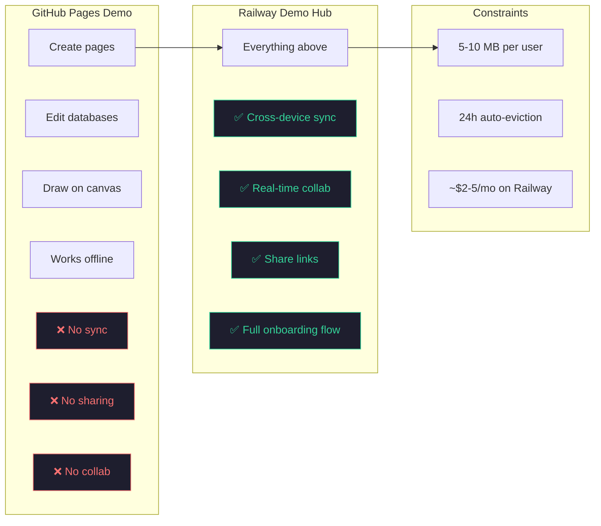

---

## Architecture Overview

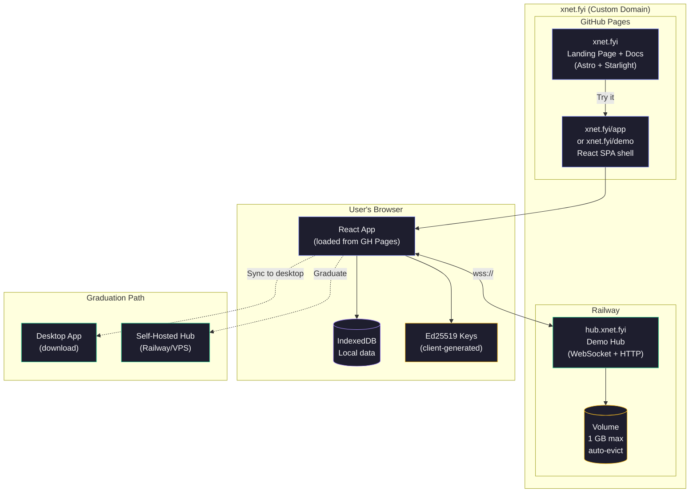

The key insight: **the app JS is served from GitHub Pages (free), but connects to a Railway Hub for sync (cheap)**. The Hub doesn't serve any static files — it's purely a WebSocket relay + HTTP API for backup/files/schemas.

---

## Domain Strategy: `xnet.fyi`

The `.fyi` TLD is short, memorable, and available. It signals "this is for information/demo purposes" without claiming to be the final production domain.

### Option 1: Subpath Routing (Recommended)

```
xnet.fyi/           → Landing page (GitHub Pages)
xnet.fyi/docs/      → Documentation (GitHub Pages / Starlight)
xnet.fyi/app        → Web app SPA (GitHub Pages, connects to Hub)
hub.xnet.fyi        → Demo Hub WebSocket/API (Railway)
```

### Option 2: Subdomain for App

```
xnet.fyi/           → Landing page
xnet.fyi/docs/      → Documentation
app.xnet.fyi        → Web app SPA (separate deployment)
hub.xnet.fyi        → Demo Hub
```

### Comparison

| Factor                   | Subpath (`/app`)         | Subdomain (`app.`)                    |
| ------------------------ | ------------------------ | ------------------------------------- |
| **Passkey rpId**         | `xnet.fyi` (shared)      | `app.xnet.fyi` (separate)             |
| **Cookie scope**         | Shared with site         | Isolated                              |
| **Deployment**           | Single GH Pages build    | Separate deploy needed                |
| **SPA routing**          | Hash routing on GH Pages | Full SPA routing if on Railway/Vercel |
| **CORS with Hub**        | Cross-origin either way  | Cross-origin either way               |
| **User perception**      | Feels integrated         | Feels like separate product           |
| **IndexedDB isolation**  | Shared origin            | Separate origin                       |
| **Service Worker scope** | Under `/app/`            | Root `/` of subdomain                 |

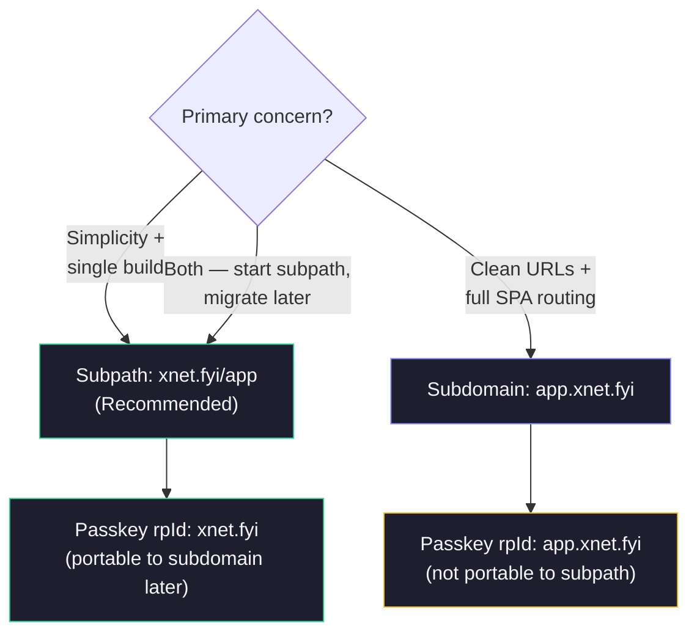

**Recommendation: Start with `xnet.fyi/app`** (subpath). The passkey `rpId` of `xnet.fyi` is portable — if we later move the app to `app.xnet.fyi`, passkeys created with rpId `xnet.fyi` are still valid on subdomains (WebAuthn allows rpId to be a registrable domain suffix). Going the other direction (subdomain rpId → parent domain) does NOT work.

### DNS Setup

```
# GitHub Pages (landing + docs + app shell)
xnet.fyi        A     185.199.108.153
                A     185.199.109.153
                A     185.199.110.153
                A     185.199.111.153
www.xnet.fyi    CNAME crs48.github.io

# Railway (demo Hub)
hub.xnet.fyi    CNAME <railway-provided-domain>.up.railway.app
```

GitHub Pages custom domain: add `CNAME` file with `xnet.fyi` to `site/public/`.

---

## Demo Hub: Data Limits & Auto-Eviction

The demo Hub exists to let people try xNet, not to host their data long-term. Aggressive limits keep costs low and prevent abuse.

### Per-User Quotas

| Limit               | Value  | Rationale                                    |
| ------------------- | ------ | -------------------------------------------- |
| **Storage per DID** | 10 MB  | Enough for ~50 pages with rich text          |
| **Max blob size**   | 2 MB   | Allow small images, block large files        |
| **Max documents**   | 50     | Prevent doc-hoarding                         |
| **Data TTL**        | 24 hrs | Auto-evict after 1 day of inactivity         |
| **Max connections** | 3      | Per DID — one browser + one desktop + buffer |

### Auto-Eviction Strategy

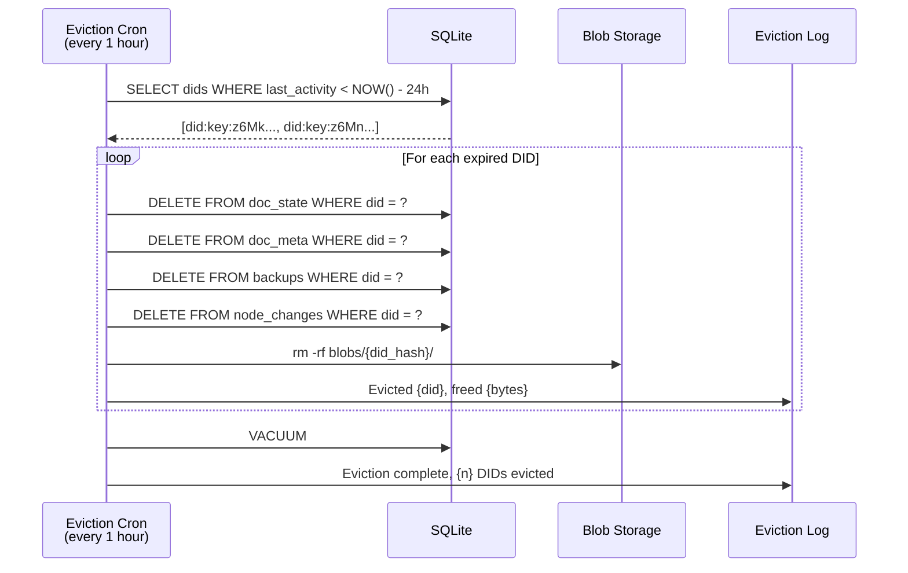

### Implementation: Demo Mode Config

```typescript
// packages/hub/src/demo.ts

import type { HubConfig } from './types'

/**
 * Demo Hub configuration overrides.
 * Applied when HUB_MODE=demo or --demo flag is set.
 */
export const DEMO_OVERRIDES: Partial<HubConfig> = {
  // Tight storage limits
  defaultQuota: 10 * 1024 * 1024, // 10 MB per DID
  maxBlobSize: 2 * 1024 * 1024, // 2 MB per blob
  maxDocuments: 50, // 50 docs per DID

  // Rate limits (generous for real-time collab)
  maxConnections: 200, // Total concurrent connections
  maxConnectionsPerDid: 3, // Per-user connection limit

  // Auto-eviction
  evictionEnabled: true,
  evictionTtlMs: 24 * 60 * 60 * 1000, // 24 hours of inactivity
  evictionIntervalMs: 60 * 60 * 1000, // Check every hour
  evictionGracePeriodMs: 0, // No grace — data warned as ephemeral

  // Disable features that don't make sense for demo
  federationEnabled: false,
  crawlEnabled: false,
  shardingEnabled: false
}
```

### EvictionService

```typescript
// packages/hub/src/services/eviction.ts

export class EvictionService {
  private timer: NodeJS.Timeout | null = null

  constructor(
    private storage: HubStorage,
    private config: {
      ttlMs: number
      intervalMs: number
      enabled: boolean
    },
    private logger: Logger
  ) {}

  start(): void {
    if (!this.config.enabled) return

    this.logger.info('Eviction service started', {
      ttl: `${this.config.ttlMs / 3600000}h`,
      interval: `${this.config.intervalMs / 60000}min`
    })

    this.timer = setInterval(() => this.evict(), this.config.intervalMs)
    // Run once on startup to clear anything stale
    this.evict()
  }

  stop(): void {
    if (this.timer) {
      clearInterval(this.timer)
      this.timer = null
    }
  }

  async evict(): Promise<{ evictedDids: number; freedBytes: number }> {
    const cutoff = Date.now() - this.config.ttlMs
    const staleDids = await this.storage.getDidsInactiveSince(cutoff)

    let freedBytes = 0

    for (const did of staleDids) {
      const usage = await this.storage.getStorageUsed(did)
      await this.storage.deleteAllForDid(did)
      freedBytes += usage

      this.logger.info('Evicted DID data', {
        did: did.slice(0, 20) + '...',
        freedBytes: usage
      })
    }

    if (staleDids.length > 0) {
      await this.storage.vacuum()
    }

    this.logger.info('Eviction cycle complete', {
      evictedDids: staleDids.length,
      freedBytes
    })

    return { evictedDids: staleDids.length, freedBytes }
  }
}
```

### Storage Methods Needed

```typescript
// Additional methods for HubStorage interface

interface HubStorage {
  // ... existing methods ...

  /** Track last activity per DID (called on every write) */
  touchDid(did: DID): Promise<void>

  /** Get all DIDs with no activity since cutoff timestamp */
  getDidsInactiveSince(cutoffMs: number): Promise<DID[]>

  /** Delete ALL data for a DID (docs, blobs, node changes, etc.) */
  deleteAllForDid(did: DID): Promise<void>

  /** Run SQLite VACUUM to reclaim space */
  vacuum(): Promise<void>
}
```

SQLite schema addition:

```sql
CREATE TABLE IF NOT EXISTS did_activity (
  did       TEXT PRIMARY KEY,
  last_seen INTEGER NOT NULL,
  bytes_used INTEGER NOT NULL DEFAULT 0
);

CREATE INDEX idx_did_activity_last_seen ON did_activity(last_seen);
```

---

## Client-Side: Demo Mode UX

The web app needs to communicate that this is a sandbox — data is ephemeral, and users should graduate to the desktop app or self-hosted Hub for permanent storage.

### Demo Banner

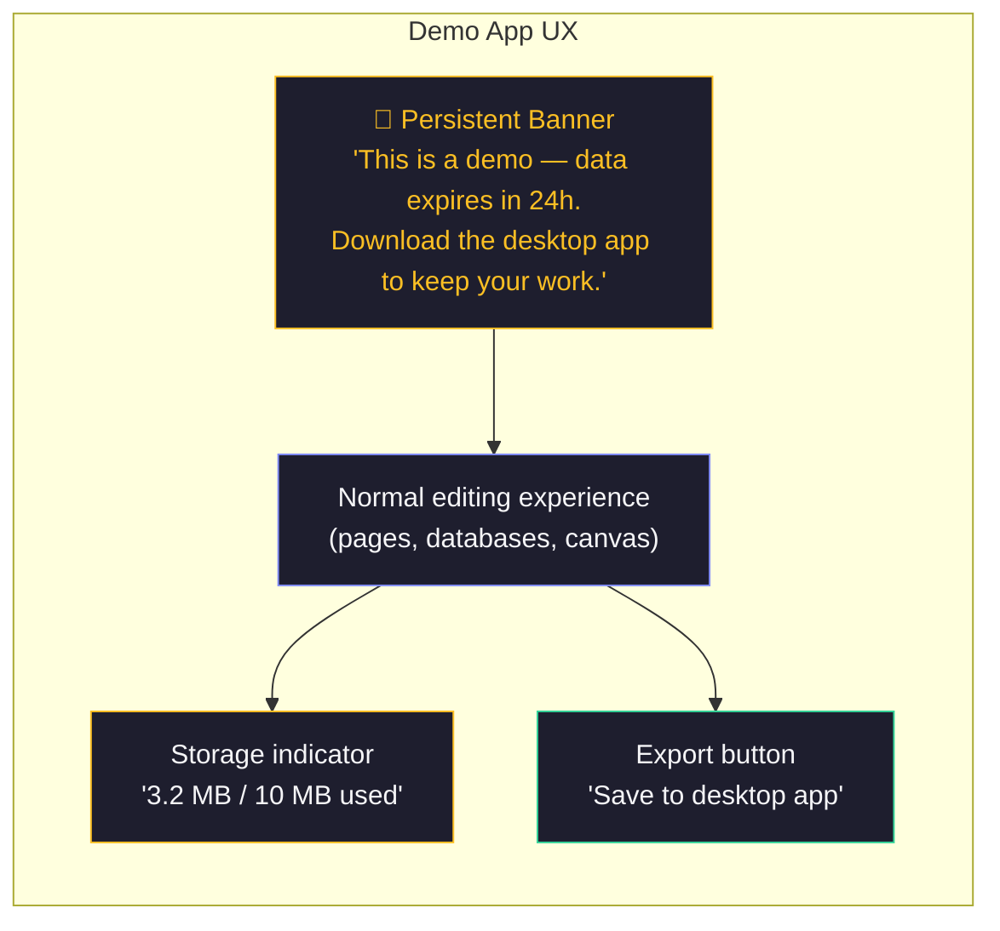

### Demo Mode State Machine

```typescript
// packages/react/src/demo/DemoMode.ts

export type DemoState =
  | 'fresh' // First visit, no identity
  | 'anonymous' // Generated ephemeral key, editing
  | 'identified' // Created passkey, syncing with Hub
  | 'quota-warning' // Approaching 10 MB limit
  | 'quota-exceeded' // At limit, read-only
  | 'expired-warning' // Data will expire soon (< 2 hours)
  | 'graduated' // User has desktop app, actively syncing
```

### Quota & Expiry Indicators

```typescript
// packages/react/src/demo/DemoStatusBar.tsx

interface DemoStatus {
  /** Bytes used on Hub */
  bytesUsed: number
  /** Quota in bytes */
  quotaBytes: number
  /** When data was last synced (resets eviction timer) */
  lastSyncAt: number
  /** When data will be evicted */
  evictsAt: number
  /** Whether user has desktop app syncing */
  hasDesktopPeer: boolean
}

// Renders as a slim bar at the top of the app:
// "Demo mode — 3.2 MB / 10 MB — Expires in 18h — [Download Desktop App]"
```

---

## Integration with Onboarding Plan (Steps 01-11)

The onboarding plan in `planStep03_91OnboardingAndPolish/` describes an 11-step, 35-day journey from passkey auth to final polish. Here's how each step maps to the demo:

### Step-by-Step Integration Matrix

```mermaid
flowchart TB
    subgraph "Onboarding Steps"
        direction TB
        S01["01 Passkey Auth"]
        S02["02 Onboarding Flow"]
        S03["03 Cross-Device Sync"]
        S04["04 Sharing & Permissions"]
        S05["05 Electron CD"]
        S06["06 Static Site"]
        S07["07 Demo Hub"]
        S08["08 Self-Hosted Hub"]
        S09["09 Hub CD"]
        S10["10 Expo Polish"]
        S11["11 Final Polish"]
    end

    subgraph "Demo Impact"
        direction TB
        D01["Progressive identity:\nanonymous → passkey"]
        D02["Adapted for demo:\n'Try it' not 'Get Started'"]
        D03["Demo Hub enables this\nfor the first time"]
        D04["Share links work\nvia hub.xnet.fyi"]
        D05["Download CTA\nin demo banner"]
        D06["xnet.fyi replaces\ncrs48.github.io/xNet"]
        D07["THIS exploration\nRailway, not Fly.io"]
        D08["Graduation path:\n'Run your own'"]
        D09["Automated deploy\nfor demo Hub"]
        D10["Mobile demo\n(future)"]
        D11["Demo-specific polish:\nbanner, quota, export"]
    end

    S01 --> D01
    S02 --> D02
    S03 --> D03
    S04 --> D04
    S05 --> D05
    S06 --> D06
    S07 --> D07
    S08 --> D08
    S09 --> D09
    S10 --> D10
    S11 --> D11

    style S07 fill:#1e1e2e,stroke:#34d399,color:#34d399
    style D07 fill:#1e1e2e,stroke:#34d399,color:#34d399
```

### Detailed Integration Notes

#### Step 01: Passkey Auth — Progressive Identity

The passkey plan uses `rpId: window.location.hostname`. For `xnet.fyi`, this gives us a stable rpId that works across:

- `xnet.fyi/app` (demo web app)
- `xnet.fyi/` (landing page, if we ever add auth there)
- Future `app.xnet.fyi` subdomain (WebAuthn allows parent domain rpId)

**Change from the plan:** Instead of passkey-first, the demo uses **anonymous-first**:

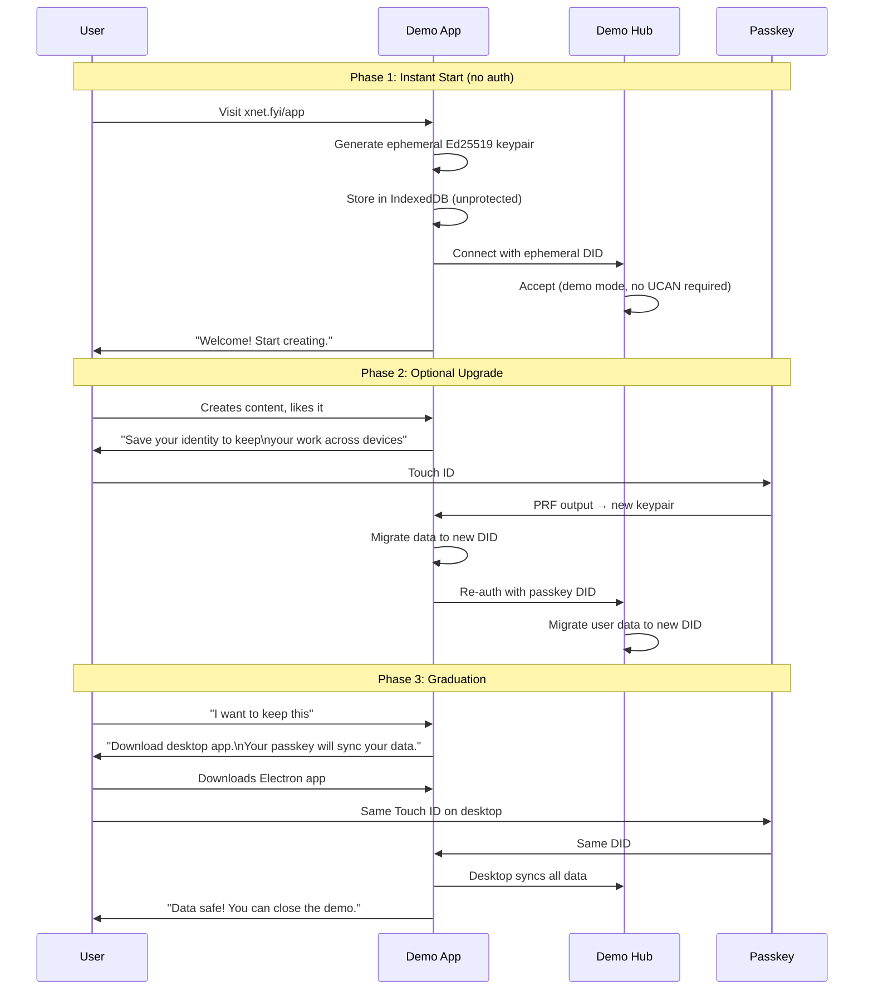

**Key difference from passkey plan:** The demo Hub accepts anonymous connections (no UCAN required for `HUB_MODE=demo`). This removes ALL friction from first visit. UCAN auth is only needed when the user upgrades to a passkey identity.

#### Step 02: Onboarding Flow — Demo-Adapted Screens

The onboarding flow from step 02 has 4 screens: Welcome, Passkey Setup, Hub Connect, Ready. For the demo, we modify these:

| Original Screen | Demo Adaptation                                                        |
| --------------- | ---------------------------------------------------------------------- |
| Welcome         | "Try xNet — no signup, no download. Everything works in your browser." |
| Passkey Setup   | Deferred — shown after user creates 2+ pages                           |
| Hub Connect     | Automatic — demo Hub URL hardcoded                                     |
| Ready           | "You're in! This is a demo — data expires in 24h."                     |

The onboarding state machine from `02-onboarding-flow.md` gains a new initial state:

```typescript
// New states for demo mode
export type DemoOnboardingState =
  | 'instant-start' // Skip welcome, go straight to editing
  | 'first-edit' // User made first change
  | 'passkey-nudge' // After 2+ pages: "Save your identity?"
  | 'passkey-setup' // Same as original passkey-prompt
  | 'demo-ready' // Syncing with demo Hub, banner shown
  | 'graduation-nudge' // After significant use: "Download desktop app"
```

#### Step 03: Cross-Device Sync — Enabled by Demo Hub

This is where the demo Hub unlocks the magic. The cross-device sync plan from step 03 requires:

1. Same passkey → same DID across devices
2. Hub-mediated initial sync
3. Conflict-free merge

All of this works with the demo Hub. The user's journey:

1. Try demo on phone → create passkey with rpId `xnet.fyi`
2. Open demo on laptop → same passkey (synced via iCloud/Google)
3. Data syncs through `hub.xnet.fyi` → "Whoa, it just works!"

**Constraint:** The 24-hour eviction timer resets on _any_ activity. So a user actively using the demo across devices won't lose data. They only lose data if they abandon the demo for >24 hours.

#### Step 04: Sharing & Permissions — Demo Share Links

Share links from step 04 encode a UCAN token + resource ID + Hub URL. For the demo:

```
https://xnet.fyi/s/eyJ...
```

When a recipient clicks a share link:

1. Web app loads at `xnet.fyi/app` (or dedicated `/s/` route)
2. UCAN token is extracted from URL
3. App connects to `hub.xnet.fyi` with the share token
4. Shared content loads — recipient can view/edit

This is the best possible demo experience. Someone can share a link on Twitter and anyone can click it and see xNet in action.

**Security note:** Demo share links expire with the data (24 hours). This is actually ideal — demo links shouldn't persist forever.

#### Step 06: Static Site — Custom Domain Migration

The static site plan references `xnet.dev` as the domain. We're using `xnet.fyi` instead (or alongside — `xnet.fyi` for demo, `xnet.dev` for production later). The Astro site config changes:

```javascript
// site/astro.config.mjs
export default defineConfig({
  site: 'https://xnet.fyi',
  base: '/' // No more /xNet prefix!
  // ...
})
```

This is a significant improvement — no more `/xNet` base path, clean URLs everywhere.

#### Step 07: Demo Hub — Railway Replaces Fly.io

The original plan specifies Fly.io for the demo Hub. Railway is a better fit for the demo because:

| Factor            | Fly.io               | Railway                     |
| ----------------- | -------------------- | --------------------------- |
| Idle cost         | ~$3-5/mo (always-on) | ~$1-2/mo (usage-based)      |
| Setup complexity  | `flyctl` + config    | "Deploy on Railway" button  |
| Volume support    | Yes                  | Yes                         |
| WebSocket support | Yes                  | Yes                         |
| Auto-TLS          | Yes                  | Yes                         |
| Custom domain     | Yes                  | Yes                         |
| Monitoring        | Built-in             | Built-in                    |
| Sleep/suspend     | Machine auto-stop    | Not by default (Pro has it) |
| $5 free credits   | $5/mo included       | $5/mo Hobby credit          |

For a demo Hub that serves ephemeral data with aggressive eviction, Railway's usage-based pricing is ideal. We're not paying for idle capacity.

#### Steps 08-09: Self-Hosted Hub + CD — Graduation Path

The demo teaches users what xNet can do. When they're ready for permanent storage, the graduation flow offers:

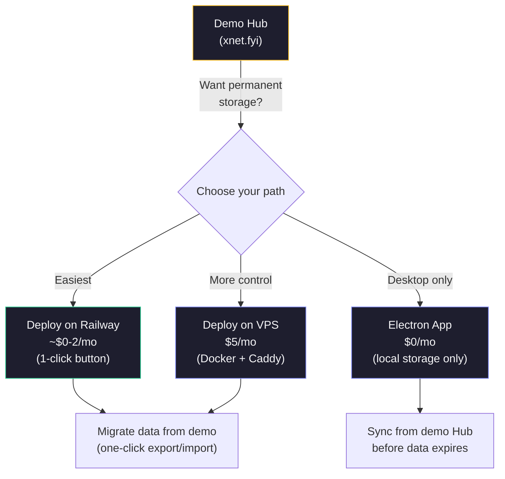

The demo Hub's eviction timer is the forcing function. "Your data expires in 18 hours. Want to keep it? Here are your options."

#### Step 11: Final Polish — Demo-Specific Items

Additional polish items specific to the demo:

- Demo banner with countdown timer
- Quota usage indicator in sidebar
- Export-to-desktop-app flow
- "Data expired" recovery message (if user returns after 24h)
- Loading states during Hub connection
- Offline fallback when Hub is unreachable

---

## Cost Analysis

### Railway Demo Hub

```mermaid
pie title Monthly Cost Estimate (Demo Hub)
    "CPU (~0.05 vCPU avg)" : 1.70
    "Memory (~80 MB)" : 0.87
    "Volume (1 GB)" : 0.16
    "Egress (~3 GB)" : 0.15
    "Hobby credit" : -2.88
```

| Resource  | Usage                | Cost/mo   |
| --------- | -------------------- | --------- |
| CPU       | 0.05 vCPU avg        | $1.70     |
| Memory    | 80 MB                | $0.87     |
| Volume    | 1 GB (with eviction) | $0.16     |
| Egress    | ~3 GB                | $0.15     |
| **Total** |                      | **$2.88** |
| Credit    | Hobby ($5)           | -$2.88    |
| **Net**   |                      | **$0.00** |

With the $5 Hobby credit and 24-hour eviction keeping the volume small, **the demo Hub is effectively free**.

Even if usage spikes (virality, HN front page), Railway's usage-based pricing means we only pay for what we use. The 10 MB quota and eviction ensure storage doesn't grow unbounded.

### Worst-Case Scenario: Viral Traffic

| Scenario         | Concurrent users | CPU  | Memory | Egress | Monthly cost |
| ---------------- | ---------------- | ---- | ------ | ------ | ------------ |
| Normal           | 5-10             | 0.05 | 80 MB  | 3 GB   | ~$3          |
| Moderate traffic | 50-100           | 0.2  | 200 MB | 20 GB  | ~$10         |
| HN front page    | 500-1000         | 1.0  | 500 MB | 100 GB | ~$40         |
| Sustained viral  | 1000+            | 2.0  | 1 GB   | 500 GB | ~$100        |

Even the viral scenario is manageable at ~$100/mo. The eviction service ensures storage stays bounded.

---

## Hub Auth for Demo Mode

The demo Hub needs a relaxed auth model. The current Hub requires UCAN tokens for all WebSocket connections. For the demo:

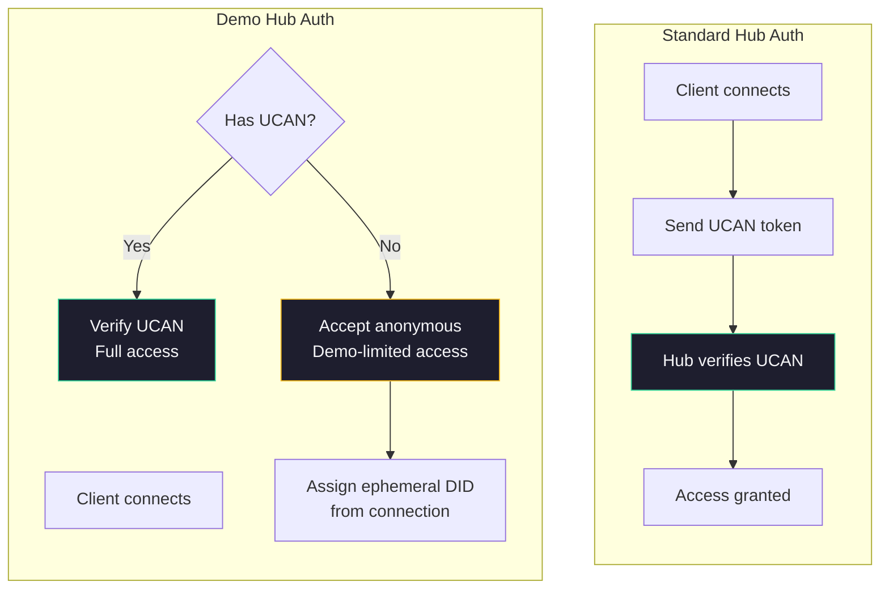

### Implementation

```typescript
// packages/hub/src/middleware/demo-auth.ts

export function createDemoAuthMiddleware(config: HubConfig) {
  return async (ws: WebSocket, did: DID | null) => {
    if (did) {
      // Authenticated user — apply demo quotas
      return {
        did,
        quota: config.defaultQuota, // 10 MB
        maxDocs: config.maxDocuments, // 50
        authenticated: true
      }
    }

    // Anonymous user — generate ephemeral identity
    // The client sends its self-generated DID; we trust it for demo purposes
    // (no UCAN verification, but still scoped to that DID for isolation)
    return {
      did: `did:key:demo-${randomId()}`,
      quota: config.defaultQuota,
      maxDocs: config.maxDocuments,
      authenticated: false
    }
  }
}
```

The `--demo` flag or `HUB_MODE=demo` environment variable activates demo mode:

```typescript
// packages/hub/src/cli.ts additions

program.option('--demo', 'Run in demo mode with ephemeral storage and relaxed auth')

// In server startup:
if (options.demo || process.env.HUB_MODE === 'demo') {
  Object.assign(config, DEMO_OVERRIDES)
}
```

---

## Data Migration: Demo → Desktop

The critical graduation flow. When a user decides to keep their data, they need to get it out of the demo Hub before eviction.

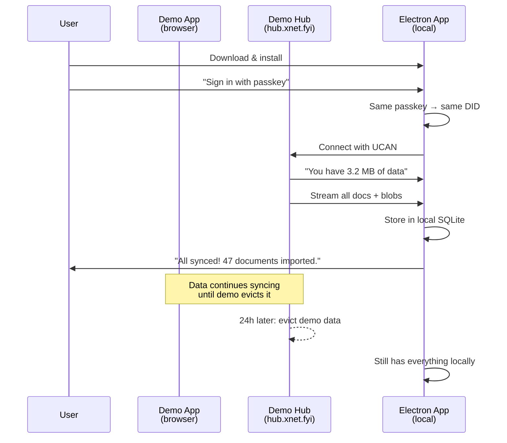

This is exactly the `InitialSyncManager` from step 03 of the onboarding plan. No new code needed — the same sync mechanism that enables cross-device sync also enables demo-to-desktop migration.

### What if the user doesn't have passkeys?

If the user never upgraded from anonymous mode, they can:

1. **Export as JSON/HTML** — download their content as files
2. **Create a passkey now** — upgrade identity, then sync to desktop
3. **QR code link** — scan from desktop app to transfer identity (step 03, QR linking)

---

## Railway Deployment Configuration

### railway.toml (Demo Hub)

```toml
[build]
builder = "dockerfile"
dockerfilePath = "packages/hub/Dockerfile"

[deploy]
startCommand = "node packages/hub/dist/cli.js --demo --port $PORT --data $RAILWAY_VOLUME_MOUNT_PATH"
healthcheckPath = "/health"
healthcheckTimeout = 10
restartPolicyType = "on_failure"
restartPolicyMaxRetries = 5
```

### Environment Variables

```bash
# Railway service variables
HUB_MODE=demo
HUB_PORT=$PORT                            # Railway injects PORT
HUB_DATA_DIR=$RAILWAY_VOLUME_MOUNT_PATH   # Railway volume
HUB_AUTH=false                             # Demo: anonymous access
HUB_LOG_LEVEL=info
NODE_ENV=production

# Demo-specific
DEMO_QUOTA_BYTES=10485760                  # 10 MB per DID
DEMO_MAX_BLOB_SIZE=2097152                 # 2 MB per blob
DEMO_MAX_DOCUMENTS=50
DEMO_EVICTION_TTL_MS=86400000             # 24 hours
DEMO_EVICTION_INTERVAL_MS=3600000         # Check every hour
```

### Volume

Railway volume: 1 GB at `/data`. With 24-hour eviction and 10 MB per user, we can support ~100 active users simultaneously before hitting the volume limit. In practice, most demo users will create <1 MB of data.

---

## User Journey: End-to-End

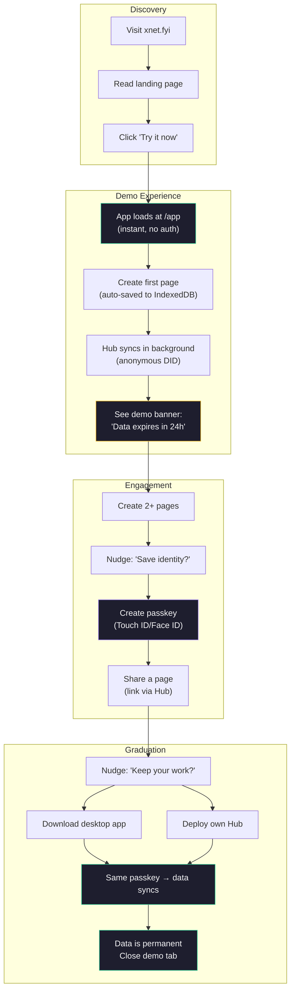

---

## Implementation Phases

### Phase 1: Demo Hub on Railway (2-3 days)

1. Add `--demo` flag and `DEMO_OVERRIDES` to Hub CLI/config
2. Implement `EvictionService` with SQLite `did_activity` table
3. Add `touchDid()` calls on all write operations
4. Add `deleteAllForDid()` and `getDidsInactiveSince()` to SQLite storage
5. Add demo quota enforcement (10 MB, 50 docs, 2 MB blobs)
6. Allow anonymous WebSocket connections in demo mode
7. Deploy to Railway with custom domain `hub.xnet.fyi`
8. Test: create data, wait 24h, verify eviction

### Phase 2: Custom Domain + Web App (2-3 days)

1. Register `xnet.fyi` domain
2. Configure DNS for GitHub Pages + Railway
3. Update Astro config: `site: 'https://xnet.fyi'`, `base: '/'`
4. Add `CNAME` file to `site/public/`
5. Install `@astrojs/react` in site
6. Create `site/src/pages/app.astro` — React SPA island
7. Port web app components into Astro site
8. Hardcode demo Hub URL (`wss://hub.xnet.fyi`)
9. Implement hash routing for SPA
10. Deploy and test full flow

### Phase 3: Demo UX (2-3 days)

1. Implement demo status bar (quota, expiry countdown)
2. Implement progressive identity (anonymous → passkey)
3. Add "Save your identity" nudge after 2+ pages
4. Add "Download desktop app" graduation CTA
5. Implement export-as-JSON fallback
6. Add "data expired" recovery message
7. Test onboarding flow end-to-end

### Phase 4: Share Links + Collab (1-2 days)

1. Implement share link generation (step 04)
2. Add `/s/:shareData` route to app
3. Test real-time collaboration between two browser tabs
4. Test cross-device sync (phone → laptop via passkey)

### Phase 5: Polish + Monitoring (1-2 days)

1. Add Railway monitoring dashboard
2. Set up health check alerts
3. Add eviction metrics (DIDs evicted, bytes freed)
4. Test HN-front-page scenario (load test with 100+ concurrent users)
5. Landing page updates: "Try it now" → links to `xnet.fyi/app`

**Total: ~10-13 days**, which maps well to phases 2-3 and 6-7 of the onboarding plan.

---

## Open Questions

### 1. `/app` vs `/demo` vs `/try`

The URL path for the demo app:

| Path    | Pros                      | Cons                         |
| ------- | ------------------------- | ---------------------------- |
| `/app`  | Familiar, professional    | Implies permanence           |
| `/demo` | Clear expectation setting | Feels less "real"            |
| `/try`  | Action-oriented, friendly | Unconventional               |
| `/play` | Low-pressure, inviting    | Might not be taken seriously |

**Recommendation: `/app`** with demo mode communicated via banner, not URL. The URL should look permanent — the app IS the app, it just happens to be in demo mode on this Hub. When users self-host, the same `/app` URL serves the full experience.

### 2. Should the demo Hub require any auth at all?

Options:

- **No auth (recommended for demo):** Anyone can connect and create content. Abuse is mitigated by tight quotas and 24h eviction.
- **Lightweight auth:** Require a self-signed token (client generates, no server verification). Provides basic DID binding without friction.
- **Full UCAN auth:** Requires passkey setup before any sync. High friction, kills the instant-start experience.

### 3. What happens when a demo user's data is evicted?

If a user returns after 24h and their data is gone:

- Local IndexedDB still has everything (the browser is the source of truth!)
- The Hub just doesn't have a copy anymore
- If they create a passkey and connect again, data re-syncs FROM the browser TO the Hub
- The eviction timer resets

This is actually a beautiful demonstration of local-first: the Hub is just a relay, not the source of truth.

### 4. Should we show other demo users' data?

No. Each DID is isolated. The demo Hub enforces DID-scoped access even in anonymous mode. You can only read/write your own data (or data shared with you via UCAN).

### 5. Rate limiting for the demo

With anonymous access, we need protection against abuse:

| Protection          | Setting                     |
| ------------------- | --------------------------- |
| Connections per IP  | 10                          |
| Messages per minute | 100 (existing rate limiter) |
| Storage per DID     | 10 MB                       |
| Docs per DID        | 50                          |
| Blobs per DID       | 20 (max 2 MB each)          |
| Connections per DID | 3                           |
| Total connections   | 200                         |
| Auto-eviction       | 24h inactivity              |

---

## Comparison: This Approach vs Alternatives

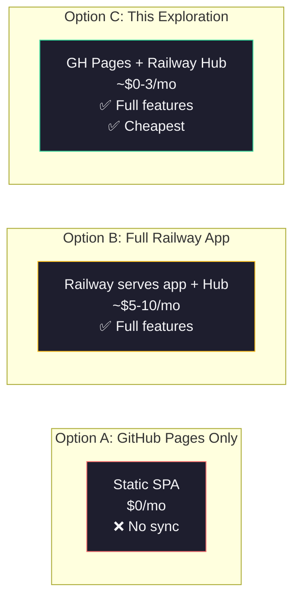

| Approach                   | Cost/mo  | Sync    | Collab  | Share Links | Complexity |
| -------------------------- | -------- | ------- | ------- | ----------- | ---------- |
| GitHub Pages only          | $0       | No      | No      | No          | Low        |
| Railway (app + Hub)        | $5-10    | Yes     | Yes     | Yes         | Medium     |
| **GH Pages + Railway Hub** | **$0-3** | **Yes** | **Yes** | **Yes**     | **Medium** |
| Vercel + Railway Hub       | $0-3     | Yes     | Yes     | Yes         | Medium     |
| Cloudflare Pages + Workers | $0-5     | Yes     | Yes     | Yes         | High       |

---

## Key Takeaways

1. **A demo Hub on Railway unlocks all 11 onboarding steps** — not just 8/11 like GitHub Pages alone
2. **Cost is effectively $0/mo** with the Railway Hobby credit and aggressive eviction
3. **Data limits (10 MB, 24h TTL) are features, not bugs** — they communicate "this is a sandbox" and create a natural graduation path to desktop/self-hosted
4. **`xnet.fyi` with subpath `/app` is the right domain strategy** — clean URLs, portable passkey rpId, single GitHub Pages deployment
5. **Anonymous auth for the demo removes all friction** — instant start, zero signup
6. **The eviction timer resets on activity** — active users never lose data; only abandoned demos are cleaned up
7. **Local-first shines here** — even after Hub eviction, the browser still has everything. The Hub is truly just a relay.
8. **This plan integrates cleanly with all 11 steps of the onboarding plan** — it's not a separate track, it's the first implementation of that plan
9. **Graduation is natural, not forced** — users experience the full product, then choose to self-host or use desktop when they're ready
10. **The demo is the product** — same code, same UI, just with tighter quotas and a banner. No separate "demo mode" codebase.
