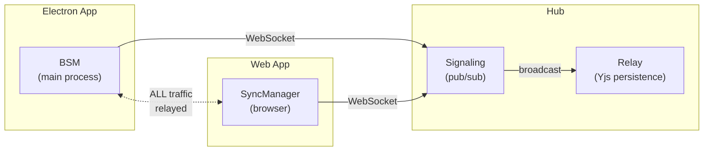
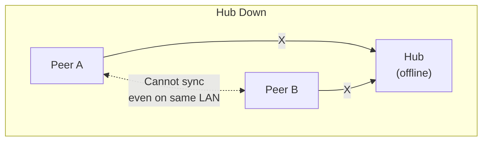
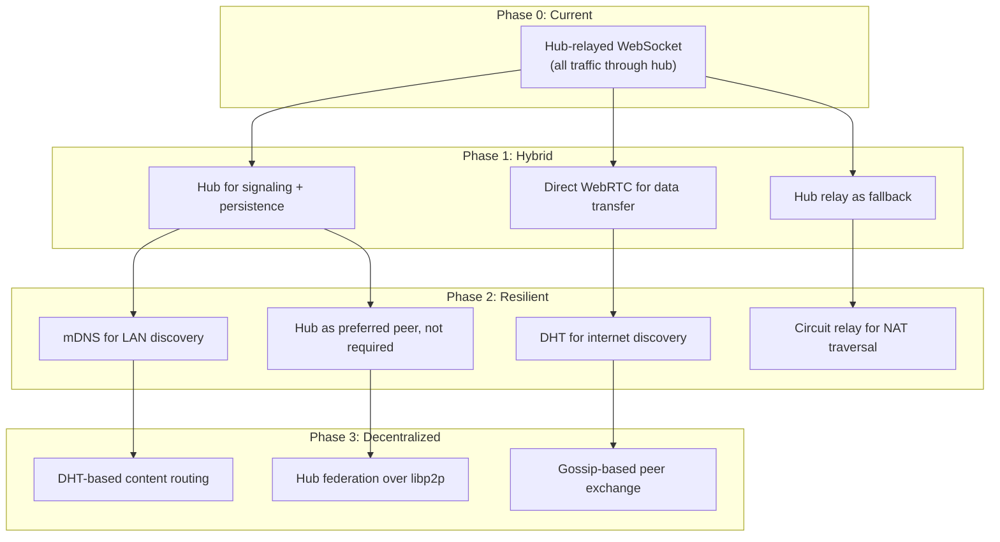
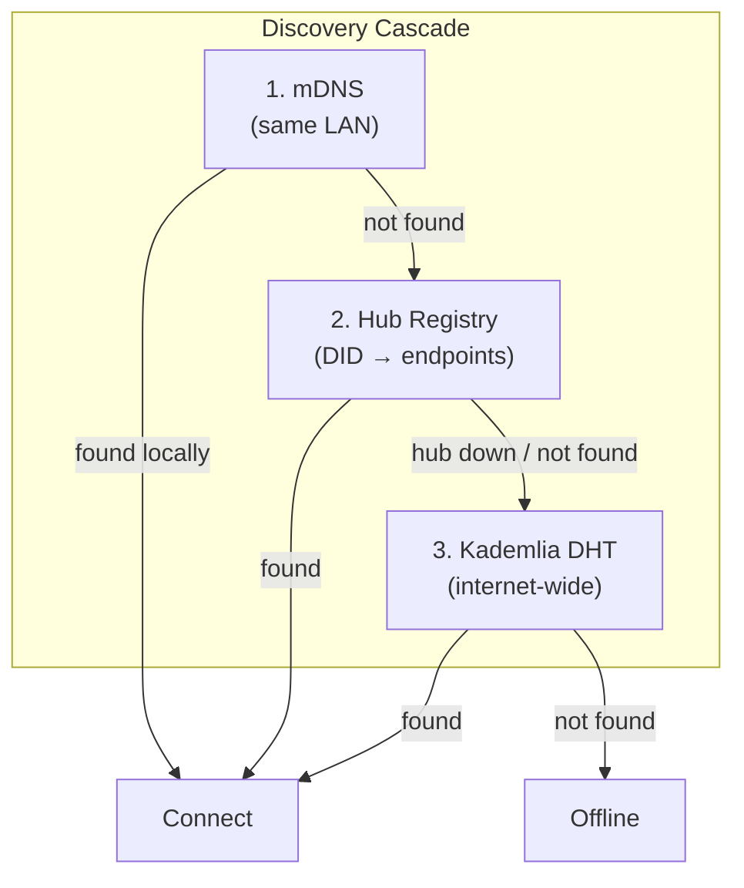
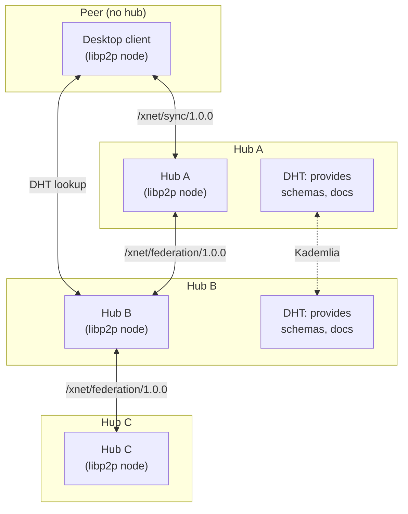

# 0052 - libp2p Reintegration

> **Status:** Exploration
> **Tags:** libp2p, P2P, WebRTC, DHT, NAT traversal, decentralization, hub, electron
> **Created:** 2026-02-04
> **Context:** The `infrastructure/bootstrap/` directory (Kademlia DHT bootstrap node) was removed because it was never deployed and the hub now handles signaling. `packages/network/` still has a complete but dormant libp2p node with WebRTC, DHT, circuit relay, and a custom sync protocol. All sync currently flows through the hub's WebSocket relay. This exploration asks: when and how should libp2p come back?

## Current State

### What We Have



Every byte of sync data passes through the hub. The hub is:

- The **signaling server** (room-based pub/sub)
- The **sync relay** (persists Yjs doc state, replays to new peers)
- The **rendezvous point** (DID-based peer discovery)
- The **single point of failure**

### What Exists in Code but Isn't Used

| Module                | File                                        | LOC | Status               |
| --------------------- | ------------------------------------------- | --- | -------------------- |
| libp2p node factory   | `packages/network/src/node.ts`              | 119 | Dead code            |
| Custom sync protocol  | `packages/network/src/protocols/sync.ts`    | 118 | Dead code            |
| y-webrtc wrapper      | `packages/network/src/providers/ywebrtc.ts` | 72  | Dead code (replaced) |
| Network types/config  | `packages/network/src/types.ts`             | 103 | Dead code            |
| DHT resolution config | `packages/core/src/resolution.ts`           | ~50 | Placeholder          |
| Connection gater      | `packages/network/src/security/gater.ts`    | ~80 | Dead code            |

**10 libp2p npm dependencies** are installed in `packages/network/` but unused at runtime. These add to install time and security surface.

### Why It Ended Up This Way

The [tradeoffs doc](../TRADEOFFS.md) and [exploration 0035](./0035_[x]_MINIMAL_SIGNALING_ONLY_HUB.md) explain the decision:

1. **y-webrtc was unreliable** -- WebRTC peer connections have high failure rates behind corporate NATs, carrier-grade NAT, and symmetric NATs. Connection setup takes 2-10 seconds when it works.
2. **WebSocket relay is simple and reliable** -- Sub-100ms connection, works everywhere, no ICE negotiation.
3. **The hub needed to persist data anyway** -- For always-on availability, the hub must have a copy of every doc. If it already sees all traffic, making it the relay too is free.
4. **libp2p-js in the browser is heavy** -- ~500KB bundle, slow startup, limited transport options.

These were correct decisions for Phase 1. But they created a centralized architecture that contradicts xNet's "user-owned data" vision.

## The Problem

### Hub as Single Point of Failure



When the hub is offline:

- No new peer connections (no signaling)
- No sync (no relay)
- No discovery (no rendezvous)
- Same-LAN peers can't find each other

### Hub Sees Everything

All Yjs updates (including document content) pass through the hub in plaintext. The hub is trusted infrastructure. For a personal hub this is fine (you trust your own server), but for shared hubs or hosted services, this is a privacy concern.

### Bandwidth Bottleneck

Two users syncing a large document in the same office both upload to and download from a remote hub. The data traverses the internet twice when it could traverse the LAN once.

## Reintegration Strategy

The goal is **not** to replace the hub -- it's to make the hub **optional for connectivity** while keeping it **valuable for persistence and availability**.



### Phase 1: WebRTC Data Channels (Hub-Assisted)

**Goal:** Direct peer-to-peer data transfer. Hub handles only signaling (SDP/ICE exchange) and persistence.

```mermaid
sequenceDiagram
    participant A as Peer A
    participant Hub as Hub (Signaling)
    participant B as Peer B

    A->>Hub: subscribe(room)
    B->>Hub: subscribe(room)
    Hub-->>A: peer B joined
    Hub-->>B: peer A joined

    Note over A,B: SDP/ICE exchange via hub signaling
    A->>Hub: signal(offer, to=B)
    Hub->>B: signal(offer, from=A)
    B->>Hub: signal(answer, to=A)
    Hub->>A: signal(answer, from=B)

    Note over A,B: Direct WebRTC DataChannel established
    A<-->B: Yjs sync (direct, encrypted)

    Note over Hub: Hub only receives periodic<br/>state snapshots for persistence
    A->>Hub: snapshot(docState)
```

**What changes:**

| Component     | Current              | Phase 1                         |
| ------------- | -------------------- | ------------------------------- |
| Signaling     | Hub WebSocket        | Hub WebSocket (unchanged)       |
| Data transfer | Hub relay            | WebRTC DataChannel (direct)     |
| Persistence   | Hub sees all updates | Hub receives periodic snapshots |
| Fallback      | None                 | Hub relay when WebRTC fails     |

**Implementation approach:**

The existing `packages/network/src/node.ts` already configures `@libp2p/webrtc`. But libp2p's WebRTC transport is designed for full libp2p-to-libp2p connections. For Phase 1, a lighter approach would work:

**Option A: Use libp2p WebRTC transport**

- Reactivate `createNode()` in the Electron app
- Use the hub's signaling WebSocket as the SDP relay (libp2p supports custom signaling channels)
- Run the `/xnet/sync/1.0.0` protocol over libp2p streams
- Pro: Full libp2p stack, easy to extend with DHT/relay later
- Con: Heavy (~500KB), slow startup in browser, not all libp2p-js WebRTC works reliably

**Option B: Use plain WebRTC DataChannels (no libp2p)**

- Create `SimplePeerConnection` using browser `RTCPeerConnection` API directly
- Exchange SDP/ICE via the existing hub signaling protocol (already supports `{ type: 'signal', data: { type: 'offer/answer/candidate' } }`)
- Pipe Yjs sync messages over the DataChannel
- Pro: Tiny bundle, fast, well-tested browser API
- Con: No libp2p protocol stack, harder to extend later

**Recommendation: Option B for Phase 1.** The existing signaling protocol already carries WebRTC signals (the `y-webrtc` library did exactly this). The change is: instead of relaying Yjs updates through the hub, relay them through a direct DataChannel. If the DataChannel fails, fall back to hub relay. This is ~200 lines of new code, no new dependencies.

**Where it lives:**

```
packages/network/src/
  webrtc/
    peer-connection.ts     # RTCPeerConnection wrapper
    signaling-bridge.ts    # Maps hub signaling ↔ SDP exchange
    data-channel-sync.ts   # Yjs sync over DataChannel
```

**Electron-specific considerations:**

Electron's main process (where BSM runs) does **not** have `RTCPeerConnection`. Options:

1. Move WebRTC to the renderer process (complicates the BSM architecture)
2. Use `wrtc` npm package (native WebRTC for Node.js) -- adds ~50MB native dependency
3. Use Electron's renderer WebRTC via IPC bridge -- BSM sends SDP to renderer, renderer creates the DataChannel, pipes updates back via MessagePort

Option 3 fits the existing architecture (BSM already uses MessagePort for binary Yjs updates to the renderer).

### Phase 2: Resilient Discovery

**Goal:** Peers can find each other without the hub.



**mDNS (LAN discovery):**

- `@libp2p/mdns` or raw `dns-sd` / Bonjour
- Electron main process can do mDNS natively
- Browser cannot (but can discover mDNS peers via the hub or a local Electron bridge)
- Enables same-office sync with zero internet connectivity

**Kademlia DHT:**

- Reactivate the DHT from `packages/network/src/node.ts`
- Store DID → multiaddr mappings
- Bootstrap peers: the hub itself acts as a bootstrap node (it's always-on)
- Fallback when hub is unreachable

**Circuit Relay:**

- The hub can serve as a circuit relay v2 node
- Peers behind symmetric NAT connect to the hub relay, then the hub bridges their streams
- Already configured in `node.ts` (the `circuitRelayTransport()` import)
- Difference from current WebSocket relay: circuit relay is a libp2p transport-level primitive that works with any libp2p protocol, not just Yjs sync

**Where libp2p shines here:** Discovery is libp2p's strongest value proposition. The stack (mDNS + DHT + relay) is battle-tested by IPFS (millions of nodes). The question is whether to use the full libp2p stack or cherry-pick individual components.

### Phase 3: Decentralized Protocol Stack

**Goal:** Hub federation and content routing over libp2p.

This is the long-term vision from the [landscape analysis](./0027_[x]_LANDSCAPE_ANALYSIS.md):



Custom libp2p protocols:

- `/xnet/sync/1.0.0` -- Already scaffolded in `protocols/sync.ts`. Yjs doc sync over libp2p streams.
- `/xnet/federation/1.0.0` -- Hub-to-hub schema sharing, federated queries.
- `/xnet/search/1.0.0` -- Distributed search (from [exploration 0023](./0023_[_]_DECENTRALIZED_SEARCH.md)).
- `/xnet/identity/1.0.0` -- DID resolution over DHT `PUT`/`GET`.

**Hub as a "super peer":** In this model, hubs are full libp2p nodes that participate in the DHT, serve as circuit relays, and expose custom protocols. Desktop clients are also libp2p nodes (lighter config). The web app connects to the nearest hub via WebSocket (browser can't do full libp2p).

## Alternative: iroh Instead of libp2p

[Exploration 0027](./0027_[x]_LANDSCAPE_ANALYSIS.md) mentions [iroh](https://iroh.computer/) as a potential alternative to libp2p:

| Aspect             | libp2p                              | iroh                                  |
| ------------------ | ----------------------------------- | ------------------------------------- |
| Language           | Rust (with JS bindings) + JS-native | Rust (with JS bindings via NAPI)      |
| NAT traversal      | ICE + relay (complex, fragile)      | DERP relay (simple, always works)     |
| Transport          | WebRTC, TCP, WebSocket, QUIC        | QUIC only (fast, reliable)            |
| Browser support    | WebRTC transport (heavy)            | Not yet (planned)                     |
| Content addressing | CID-based                           | BLAKE3 hash-based (aligned with xNet) |
| Maturity           | 8+ years, battle-tested             | 2 years, rapidly evolving             |
| Bundle size (JS)   | ~500KB                              | ~200KB (WASM)                         |

iroh's advantages for xNet:

- Uses BLAKE3 natively (xNet already uses BLAKE3 everywhere)
- QUIC transport is more reliable than WebRTC
- Simpler API than libp2p (fewer abstractions)
- Built-in document sync (iroh-docs) inspired by CRDTs

iroh's disadvantages:

- No browser support yet (critical for the web app)
- Smaller ecosystem
- Would require replacing all existing libp2p scaffolding

**Recommendation:** Keep libp2p for now. Revisit iroh when it has browser support. The libp2p code already exists and the ecosystem is proven.

## Cleanup: What to Do With Dead Code

### Option A: Remove It (Lean)

Remove all unused libp2p code from `packages/network/`. Delete `node.ts`, `protocols/sync.ts`, `providers/ywebrtc.ts`, `types.ts`, and the connection gater. Remove 10 unused libp2p dependencies from `package.json`. Keep only `security/` (actively used patterns) and `resolution/did.ts` (used by hub clients).

**Pro:** Honest codebase. No misleading code. Faster installs.
**Con:** Need to rewrite when Phase 1/2 arrives.

### Option B: Keep It (Scaffolding)

Keep the code but clearly mark it as dormant. Add `@deprecated` JSDoc tags and a `DORMANT.md` in `packages/network/`.

**Pro:** Less work when reintegrating. Patterns already established.
**Con:** Dependencies still installed. Code rots without tests.

### Option C: Extract to Branch

Move unused libp2p code to a `feature/libp2p-scaffolding` branch. Remove from `main`. Restore when needed.

**Pro:** Clean main branch. Code preserved.
**Con:** Branch diverges from main over time.

**Recommendation: Option A (remove).** The libp2p ecosystem moves fast -- the deps from 2024/2025 will likely have breaking changes by the time we reintegrate. It's better to start fresh with current APIs than fight version skew. The architecture knowledge is preserved in this exploration doc.

## Effort Estimates

| Phase                             | Scope                                   | Effort    | Dependencies            |
| --------------------------------- | --------------------------------------- | --------- | ----------------------- |
| Phase 1 (WebRTC DataChannels)     | Direct P2P sync, hub fallback           | 2-3 weeks | None (plain WebRTC API) |
| Phase 2 (Resilient Discovery)     | mDNS, DHT, circuit relay                | 3-4 weeks | libp2p (re-add)         |
| Phase 3 (Decentralized Protocols) | Federation over libp2p, content routing | 6-8 weeks | Phase 2                 |
| Cleanup (remove dead code)        | Remove unused libp2p deps               | 1 day     | None                    |

## Decision Points

1. **Should we clean up dead libp2p code now?** (Yes -- see recommendation above)
2. **Phase 1: libp2p WebRTC or plain WebRTC?** (Plain WebRTC -- simpler, smaller, faster)
3. **When to start Phase 1?** (After hub is stable and deployed -- direct P2P is a reliability improvement, not a blocker)
4. **iroh or libp2p for Phase 2+?** (libp2p for now, revisit iroh when it has browser support)

## References

- [Exploration 0035: Minimal Signaling-Only Hub](./0035_[x]_MINIMAL_SIGNALING_ONLY_HUB.md) -- Original analysis of P2P vs relay tradeoffs
- [Exploration 0027: Landscape Analysis](./0027_[x]_LANDSCAPE_ANALYSIS.md) -- libp2p vs iroh comparison
- [Exploration 0023: Decentralized Search](./0023_[_]_DECENTRALIZED_SEARCH.md) -- DHT-based search vision
- [Exploration 0011: Server Infrastructure](./0011_[x]_SERVER_INFRASTRUCTURE.md) -- Original bootstrap node plan
- [Plan: Hub Phase 1](../plans/plan03_8HubPhase1VPS/README.md) -- Hub as signaling replacement
- [Tradeoffs](../TRADEOFFS.md) -- "Signaling + WebRTC (with future DHT)" architecture decision
