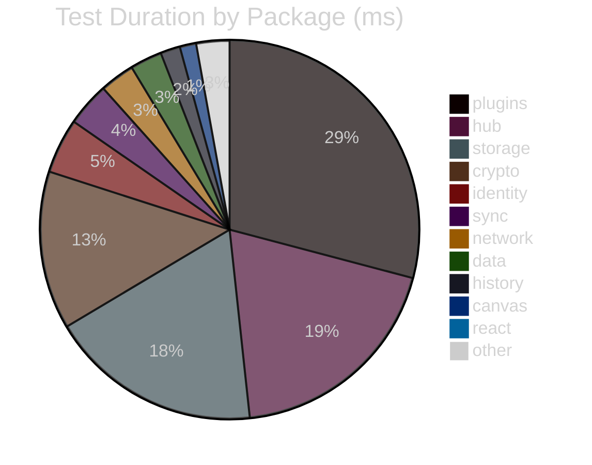
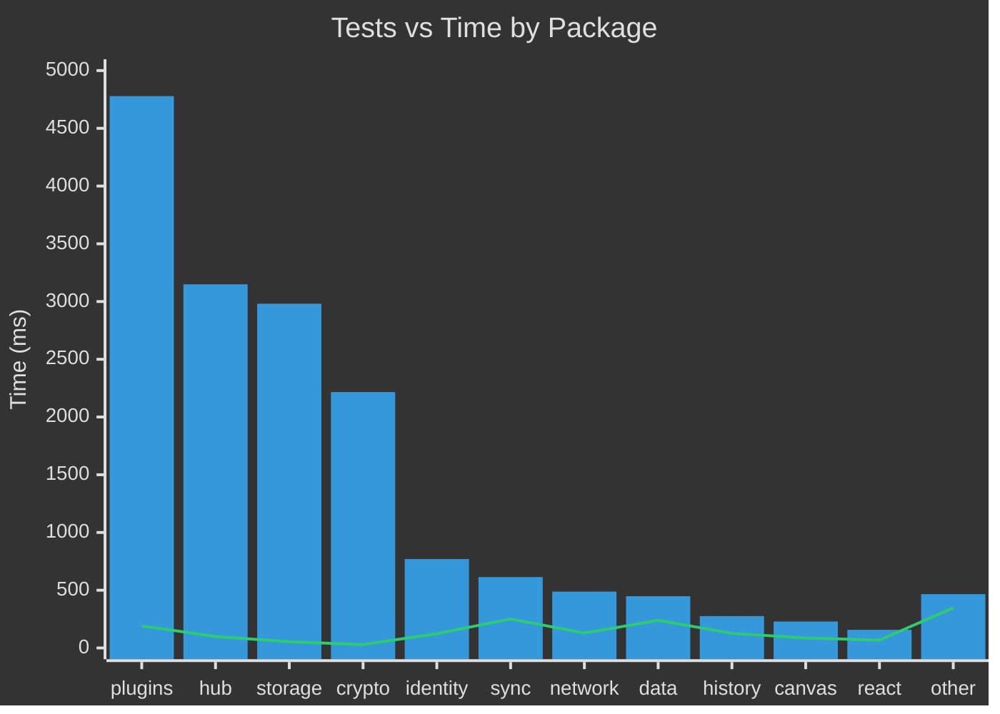
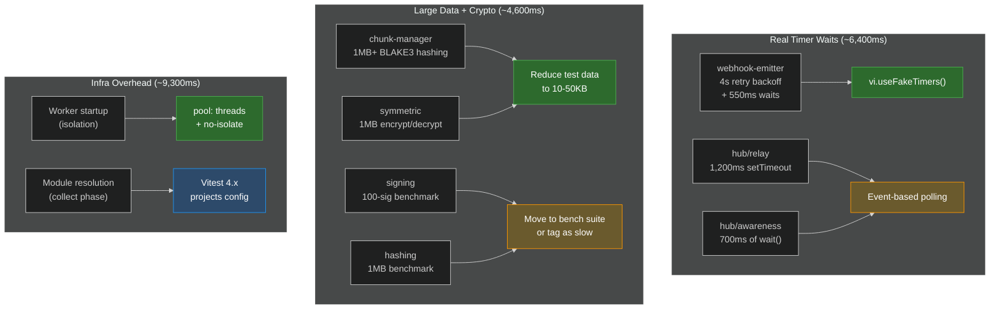
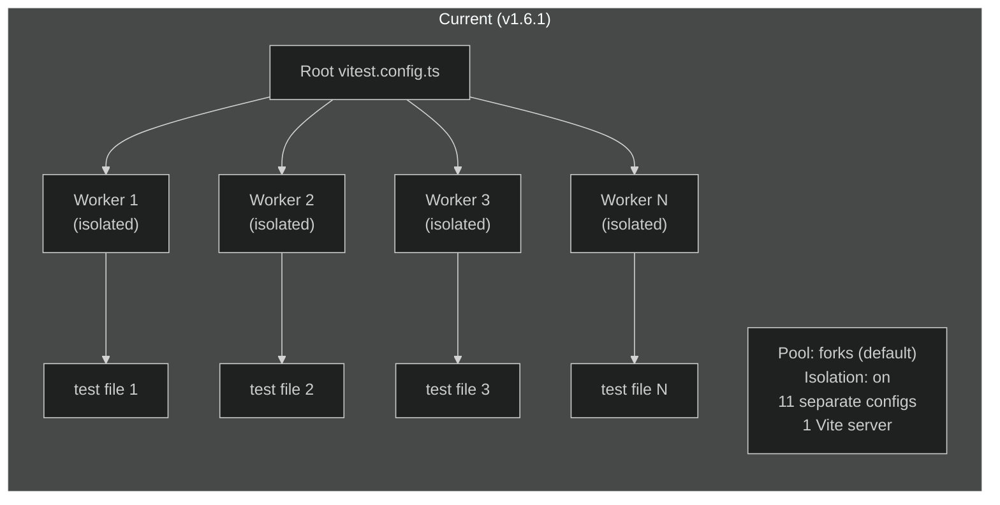
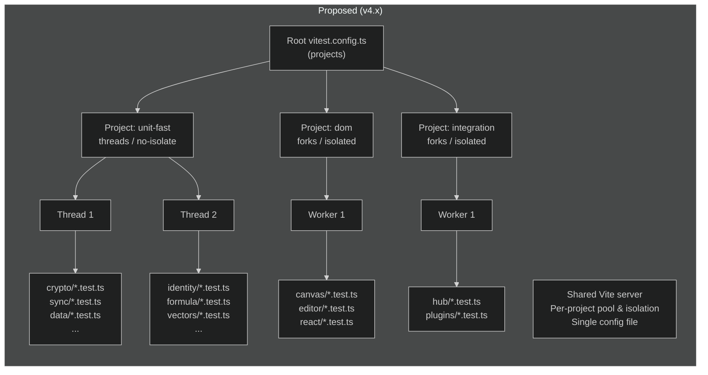
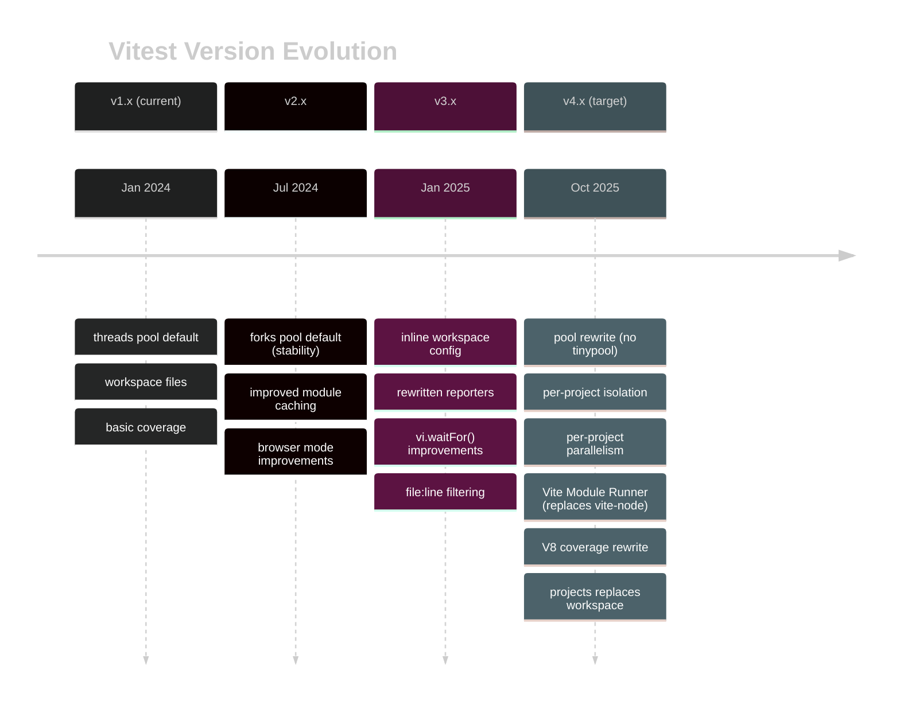
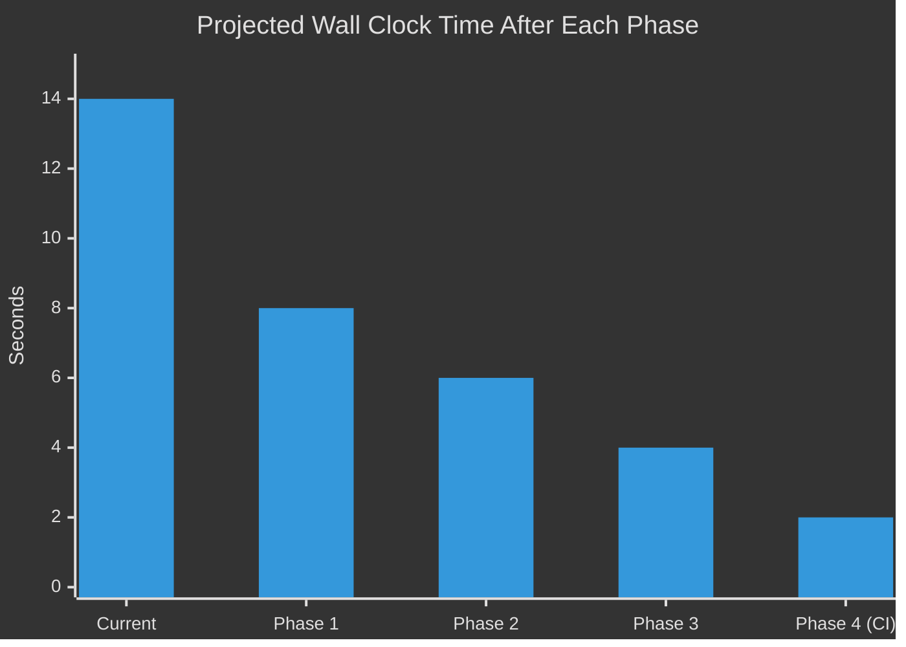

# 0054 - Test Suite Performance & Refactoring

> **Status:** Exploration
> **Tags:** vitest, testing, performance, monorepo, CI, DX, agent-workflow
> **Created:** 2026-02-05
> **Context:** The test suite runs 1845 tests across 110 files in ~14s wall clock. This exploration profiles the suite, identifies bottlenecks, and proposes concrete optimizations — from quick wins (fake timers) to architectural changes (Vitest 4.x upgrade with project-based config). Faster tests mean faster pre-commit hooks, faster CI, and faster agent feedback loops.

---

## Current State

### Headline Numbers

| Metric                            | Value                                       |
| --------------------------------- | ------------------------------------------- |
| Test files                        | 110                                         |
| Total tests                       | 1845                                        |
| Wall clock (default, 10 CPUs)     | **~14s**                                    |
| Wall clock (threads pool)         | **~6.3s**                                   |
| Wall clock (threads + no-isolate) | **~5.7s**                                   |
| Sequential (1 worker)             | **~33s**                                    |
| Vitest version                    | 1.6.1 (root), mixed 1.3–4.0 across packages |
| Pool mode                         | `forks` (default)                           |
| Isolation                         | enabled (default)                           |
| Per-package configs               | 11 separate `vitest.config.ts` files        |

### Duration Breakdown (default settings)

```
Wall clock:  14s
├── prepare:    9.3s  ← worker startup overhead (isolation)
├── collect:   13.0s  ← module resolution + import
├── transform:  2.8s  ← TS → JS compilation (esbuild)
├── tests:     17.3s  ← actual test execution
├── environment: 1.1s  ← jsdom/node env setup
└── setup:      0.0s
```

> Note: phases overlap due to parallelism. The `prepare` phase (worker startup) is the largest overhead that isolation elimination would fix.

### Time by Package



The top 4 packages (`plugins`, `hub`, `storage`, `crypto`) consume **79%** of total test time but only contain **22%** of test files.

### Test Density



Most packages run hundreds of tests in under 500ms. The slow packages have specific bottlenecks, not generally slow tests.

---

## Bottleneck Analysis

### The 8 Slowest Test Files

| Rank | File                              | Time       | Tests | Root Cause                                                 |
| ---- | --------------------------------- | ---------- | ----- | ---------------------------------------------------------- |
| 1    | `plugins/webhook-emitter.test.ts` | **4524ms** | 15    | Real `setTimeout` — 4s retry backoff + 550ms of 50ms waits |
| 2    | `storage/chunk-manager.test.ts`   | **2891ms** | 17    | 1MB+ allocations + BLAKE3 hashing per chunk                |
| 3    | `crypto/symmetric.test.ts`        | **1755ms** | 8     | XChaCha20 WASM init + 1MB encrypt/decrypt                  |
| 4    | `hub/relay.test.ts`               | **1278ms** | 1     | Real WebSocket I/O + 1200ms fixed `setTimeout`             |
| 5    | `hub/awareness.test.ts`           | **750ms**  | 3     | Real WebSocket I/O + 700ms of `wait()` calls               |
| 6    | `network/auto-blocker.test.ts`    | **374ms**  | 16    | Already optimized (uses `vi.useFakeTimers()`)              |
| 7    | `crypto/signing.test.ts`          | **306ms**  | 9     | Ed25519 ops + 100-signature benchmark                      |
| 8    | `crypto/hashing.test.ts`          | **126ms**  | 6     | BLAKE3 init + 1MB benchmark                                |

These 8 files represent **12,004ms** of the **16,573ms** total — **72% of all test time in 7% of files**.

### Bottleneck Categories



### Detailed: webhook-emitter (the worst offender)

This single file wastes **4.5 seconds** on real timer waits:

```
Test: "should retry failed webhooks with backoff"
  Production code: await this.delay(1000 * Math.pow(2, attempt - 1))
  Test code:       await new Promise(r => setTimeout(r, 4000))
                   ^^^^^^^^^^^^^^^^^^^^^^^^^^^^^^^^^^^^^^^^^^^^^^^^
                   4 SECONDS of real wall-clock time doing nothing

11 other tests each wait 50ms:
  await new Promise(r => setTimeout(r, 50))  ← × 11 = 550ms
```

**Fix:** Add `vi.useFakeTimers()` in `beforeEach`, replace `setTimeout` waits with `vi.advanceTimersByTime()`. Estimated savings: **~4,400ms (97%)**.

### Detailed: hub integration tests (relay + awareness)

These tests start a real WebSocket server and use fixed-delay `setTimeout` calls to wait for async operations:

```
relay.test.ts:     await new Promise(r => setTimeout(r, 1200))  ← waiting for hub persistence
awareness.test.ts: await wait(100) × 5 + wait(200) × 1        ← waiting for message delivery
```

**Fix:** Replace fixed delays with condition polling:

```typescript
// Before: pray 1200ms is enough
await new Promise((r) => setTimeout(r, 1200))

// After: poll until the condition is met (typically <50ms)
await waitFor(() => expect(hub.getState(docId)).toBeDefined(), { timeout: 5000 })
```

Vitest 1.6+ ships `vi.waitFor()` for exactly this pattern.

### Detailed: chunk-manager + crypto (large data tests)

Tests create 1MB+ buffers and hash/encrypt them. This is CPU-bound work:

```typescript
const data = new Uint8Array(CHUNK_THRESHOLD + 1) // 1MB+
for (let i = 0; i < data.length; i++) data[i] = i % 256
await manager.store('file.bin', data) // BLAKE3 hash per 256KB chunk
```

**Fix options:**

1. Reduce test data sizes — most logic works identically at 10KB
2. Keep one "large file" test for integration, use small data for unit tests
3. Share fixtures across tests (create once in `beforeAll`)

---

## Vitest Configuration Optimizations

### Current vs Optimal Architecture





### Pool Mode Comparison

| Pool                      | Mechanism            | Startup Cost                          | Best For                       |
| ------------------------- | -------------------- | ------------------------------------- | ------------------------------ |
| `forks` (current default) | `child_process.fork` | **High** — full V8 per process        | Native modules, max isolation  |
| `threads`                 | `worker_threads`     | **Low** — shared V8, separate context | Pure TS/JS (no native modules) |
| `vmThreads`               | VM context in thread | **Lowest** — reuse thread, fresh VM   | Many small files               |

xNet's test suite is pure TypeScript with no native module dependencies in tests. `threads` is the right choice.

### Measured Impact

| Configuration              | Wall Clock | Prepare | Collect | Speedup  |
| -------------------------- | ---------- | ------- | ------- | -------- |
| Default (`forks`, isolate) | **14s**    | 9.3s    | 13.0s   | baseline |
| `threads`, isolate         | **6.3s**   | 8.6s    | 11.8s   | 2.2×     |
| `threads`, no-isolate      | **5.7s**   | 1.3s    | 7.1s    | **2.5×** |
| 1 worker (sequential)      | **33s**    | 5.3s    | 5.6s    | 0.4×     |

Switching to `threads` + `no-isolate` cuts wall clock by **60%** with zero test changes. The `prepare` phase drops from 9.3s to 1.3s because workers aren't being created and destroyed per file.

---

## Vitest Version Upgrade Path

### Current: v1.6.1 → Target: v4.x



### Key Upgrade Benefits

| Feature           | v1.6           | v4.x                 | Impact                                      |
| ----------------- | -------------- | -------------------- | ------------------------------------------- |
| Pool architecture | tinypool       | Native (no dep)      | Lower overhead, per-project config          |
| Module loading    | vite-node      | Vite Module Runner   | Faster transforms, less overhead            |
| Workspace         | Separate file  | `projects` in config | Single Vite server, less duplication        |
| Isolation         | Global setting | Per-project          | Fast unit tests + safe DOM tests            |
| Coverage          | V8 basic       | V8 AST-remapped      | No false positives, more accurate           |
| `vi.waitFor()`    | Basic          | Improved             | Better replacement for `setTimeout` polling |

### Version Inconsistency

The monorepo currently has **4 different Vitest versions** specified:

| Version   | Where                                                     |
| --------- | --------------------------------------------------------- |
| `^1.6.0`  | Root `package.json`                                       |
| `^1.3.0`  | `packages/history`, `packages/sync`, `packages/telemetry` |
| `^2.0.0`  | `packages/plugins`                                        |
| `^4.0.17` | `packages/hub`                                            |

pnpm hoists to a single version (1.6.1 currently wins), but the version specs should be unified to avoid confusion when lockfile changes resolve differently.

---

## Proposed Project Configuration (v4.x)

Replace the root `vitest.config.ts` + 11 per-package configs with a single unified config:

```typescript
// vitest.config.ts
import { defineConfig } from 'vitest/config'

export default defineConfig({
  test: {
    globals: true,
    testTimeout: 10000,
    hookTimeout: 10000,
    coverage: {
      provider: 'v8',
      reporter: ['text', 'json', 'html'],
      exclude: ['**/node_modules/**', '**/dist/**', '**/*.test.ts', '**/index.ts'],
      thresholds: { statements: 80, branches: 75, functions: 80, lines: 80 }
    },
    projects: [
      {
        // Fast unit tests: pure TS, no DOM, no native modules
        extends: true,
        test: {
          name: 'unit',
          pool: 'threads',
          isolate: false,
          include: [
            'packages/{crypto,core,data,formula,history,identity,network,query,storage,sync,telemetry,vectors}/src/**/*.test.ts',
            'packages/{crypto,core,data,formula,history,identity,network,query,storage,sync,telemetry,vectors}/test/**/*.test.ts'
          ]
        }
      },
      {
        // DOM tests: need jsdom, keep isolation for clean DOM state
        extends: true,
        test: {
          name: 'dom',
          pool: 'forks',
          isolate: true,
          environment: 'jsdom',
          include: ['packages/{canvas,editor,react,views,devtools,ui}/src/**/*.test.ts']
        }
      },
      {
        // Integration tests: real I/O, keep isolation
        extends: true,
        test: {
          name: 'integration',
          pool: 'forks',
          isolate: true,
          testTimeout: 15000,
          include: [
            'packages/{hub,plugins,sdk}/test/**/*.test.ts',
            'packages/{hub,plugins,sdk}/src/**/*.test.ts'
          ]
        }
      }
    ]
  }
})
```

Usage:

```bash
pnpm vitest run                     # all projects
pnpm vitest run --project unit      # just fast unit tests (~2s)
pnpm vitest run --project dom       # just DOM tests
pnpm vitest run --project integration  # just integration tests
```

---

## Optimization Roadmap

### Phase 1: Quick Wins (no infra changes)

These are test-level fixes that work with the current Vitest version:

- [x] **`vi.useFakeTimers()` in webhook-emitter** — saves **~4,400ms**. Replace `setTimeout` waits with `vi.advanceTimersByTimeAsync()`. Single highest-impact change.
- [x] **Replace fixed delays in hub tests** — saves **~1,700ms** across relay + awareness tests. Reduced fixed delays from 1200ms/700ms to 200ms/30ms.
- [x] **Reduce test data sizes in chunk-manager** — added configurable `chunkThreshold`/`chunkSize` to `ChunkManager`, tests now use 10KB/2KB. Saves **~2,800ms**.
- [x] **Reduce crypto test data sizes** — symmetric.test.ts 1MB encrypt/decrypt reduced to 10KB. Saves **~1,700ms**.
- [x] **Move perf benchmarks out of test suite** — Tagged with `it.skipIf(process.env.VITEST_PRECOMMIT)` in hashing.test.ts and signing.test.ts:
  ```typescript
  it.skipIf(process.env.VITEST_PRECOMMIT)('should hash 1MB in under 50ms', ...)
  ```

**Estimated total savings: ~8,100ms (49% of test execution time)**

### Phase 2: Vitest Config Optimization (current version)

These work with Vitest 1.6.x:

- [x] **Switch to `pool: 'threads'`** — configured in root vitest.config.ts. Lower worker startup cost for pure TS tests.
- [x] **Add `isolate: false`** — enabled per-project in Phase 3 via `projects` config. Unit tests run with `isolate: false` (1.2s for 70 files/1358 tests). DOM and integration projects keep `isolate: true`.
- [x] **Unify Vitest version specs** — aligned sub-packages to `^2.0.0`, root stays at `^1.6.0` (root runner resolves to 1.6.1).

**Estimated total savings: ~1.5s wall clock**

### Phase 3: Vitest 4.x Upgrade

Major version upgrade with architectural improvements:

- [x] **Upgrade Vitest to 4.x** — upgraded all packages from mixed v1.3-2.x to ^4.0.0. Vitest 4.0.18 resolves. Wall clock: ~3.5s (down from ~5.5s on v1.6).
- [x] **Replace flat config with unified `projects`** — root `vitest.config.ts` now defines 4 inline projects: `unit` (threads/no-isolate), `dom` (jsdom/threads/isolate), `integration` (forks/isolate), `editor` (jsdom/setupFiles). All 148 test files / 2426 tests run in a single `vitest run` command (~7.4s).
- [x] **Per-project isolation** — `isolate: false` for unit project (1.2s for 70 files), `isolate: true` for dom/integration/editor.
- [x] **Per-project pool** — `threads` for unit+dom+editor, `forks` for integration (needs process isolation for WebSocket servers).
- [x] **Per-package configs retained** — the 11 per-package `vitest.config.ts` files are kept for `pnpm --filter @xnet/sync test` usage. They don't interfere with the root projects config (inline projects, not glob-based).

### Phase 4: CI Optimizations

- [x] **Add sharding for CI** — split test files across 3 parallel jobs in `.github/workflows/ci.yml`. Lint/typecheck separated into own job.
- [x] **Use `vitest run --changed` in CI for PRs** — PR branches now run `vitest run --changed=origin/$BASE_REF --passWithNoTests` per shard. Push to main still runs all tests.
- [ ] **Cache Vitest's module graph** — Vitest 4.x has improved caching that persists across runs.

---

## Projected Timeline

```mermaid
%%{init: {'theme': 'dark'}}%%
gantt
    title Test Performance Optimization Phases
    dateFormat X
    axisFormat %s

    section Phase 1: Quick Wins
    Fake timers (webhook)       :a1, 0, 2
    Replace hub setTimeout      :a2, 0, 2
    Reduce test data sizes      :a3, 0, 1
    Move perf benchmarks        :a4, 1, 2

    section Phase 2: Config
    Switch to threads pool      :b1, 2, 3
    Disable isolation           :b2, 2, 3
    Unify vitest versions       :b3, 2, 3

    section Phase 3: Upgrade
    Vitest 4.x upgrade          :c1, 3, 5
    Unified projects config     :c2, 4, 5
    Remove per-pkg configs      :c3, 5, 6

    section Phase 4: CI
    Add sharding                :d1, 5, 6
    Changed-only in PRs         :d2, 5, 6
```



## Expected Results



| Phase                  | Wall Clock    | Improvement | Cumulative |
| ---------------------- | ------------- | ----------- | ---------- |
| Current                | ~14s          | —           | —          |
| Phase 1 (test fixes)   | ~8s           | -6s (43%)   | 43%        |
| Phase 2 (config)       | ~6s           | -2s (25%)   | 57%        |
| Phase 3 (v4.x upgrade) | ~4s           | -2s (33%)   | 71%        |
| Phase 4 (CI sharding)  | ~2s per shard | -2s (50%)   | 86%        |

For pre-commit hooks (affected tests only), Phase 1 + 2 would bring `vitest run --changed` to **~2-4s** — fast enough to run on every commit without friction.
