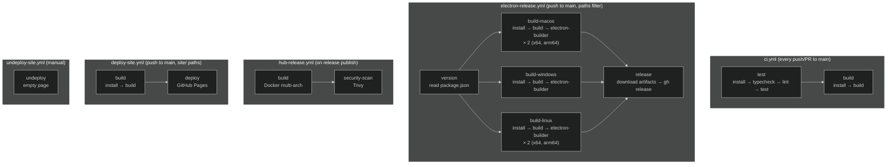
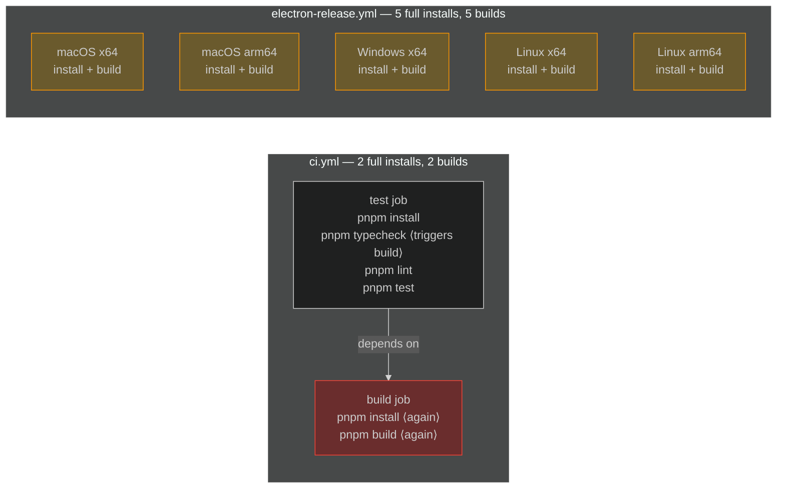
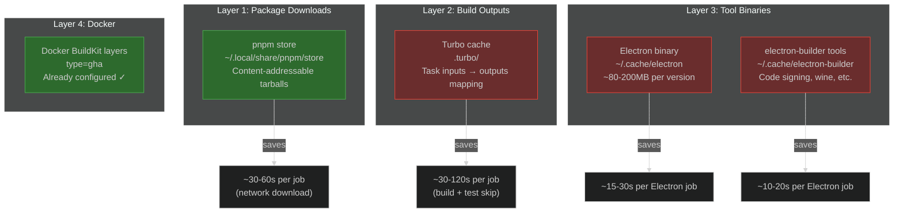
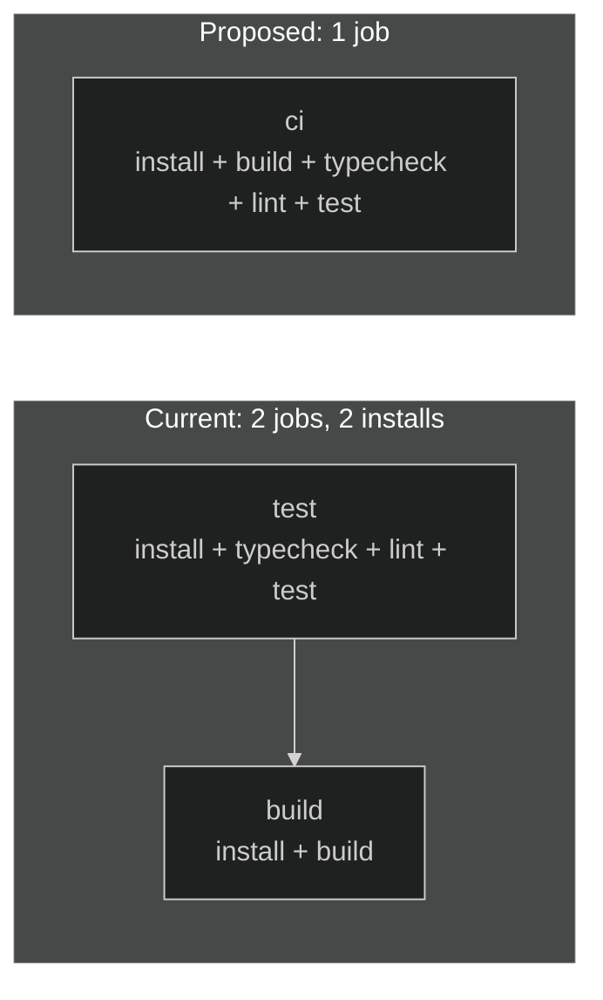
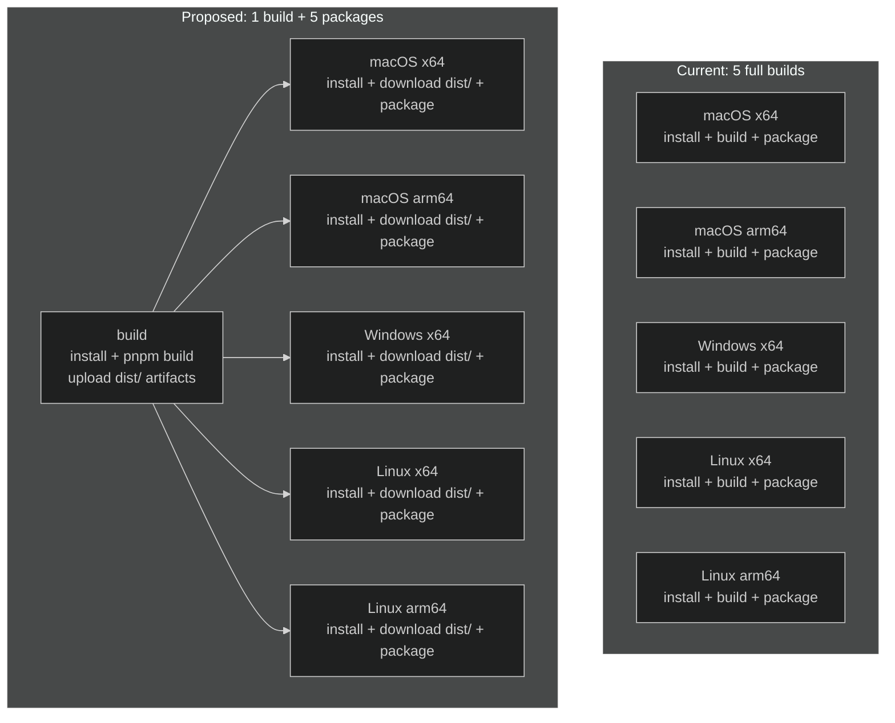

# 0055 - GitHub Actions Caching & CI Optimization

> **Status:** Exploration
> **Tags:** CI, GitHub Actions, caching, pnpm, turbo, electron, performance, cost
> **Created:** 2026-02-05
> **Context:** The monorepo has 5 GitHub Actions workflows totaling 14 jobs. Caching is minimal — only pnpm store via `actions/setup-node`. Turbo's cache is not persisted across runs, Electron binaries are re-downloaded every build, and identical work (install + build) is repeated across jobs. This exploration maps what's cached, what's not, and what the savings would be.

---

## Current State

### Workflow Inventory



### Current Caching

| Workflow               | What's Cached | Mechanism                       | What's NOT Cached                                      |
| ---------------------- | ------------- | ------------------------------- | ------------------------------------------------------ |
| `ci.yml`               | pnpm store    | `setup-node` `cache: 'pnpm'`    | Turbo outputs, build artifacts                         |
| `electron-release.yml` | pnpm store    | `setup-node` `cache: 'pnpm'`    | Turbo outputs, Electron binary, electron-builder tools |
| `hub-release.yml`      | Docker layers | BuildKit GHA cache (`type=gha`) | n/a (good)                                             |
| `deploy-site.yml`      | pnpm store    | `setup-node` `cache: 'pnpm'`    | Build output                                           |
| `undeploy-site.yml`    | nothing       | n/a                             | n/a                                                    |

The `hub-release.yml` is actually well-optimized — Docker BuildKit's GHA layer cache is the gold standard for container builds. The others have significant gaps.

### Redundant Work



**`ci.yml`:** The `build` job is fully redundant. The `test` job already triggers `pnpm build` through Turbo's dependency graph (`typecheck` depends on `^build`). The separate `build` job re-does checkout, pnpm setup, install, and build — all from scratch.

**`electron-release.yml`:** `pnpm build` (the JS/TS monorepo build) runs 5 times across 5 runners. The output is identical on every platform — it's pure JS. Only the `electron-builder` step is platform-specific.

### Version Inconsistencies

| Setting             | `ci.yml`     | `electron-release.yml` | `deploy-site.yml`                |
| ------------------- | ------------ | ---------------------- | -------------------------------- |
| `pnpm/action-setup` | `@v3`        | `@v3`                  | `@v4`                            |
| Node version        | 20           | 20                     | 22                               |
| pnpm version        | `version: 9` | `version: 9`           | (inferred from `packageManager`) |

---

## Caching Layers Available



Green = currently cached. Red = not cached.

### Layer 1: pnpm Store (currently cached)

`actions/setup-node` with `cache: 'pnpm'` caches `~/.local/share/pnpm/store/v3`, keyed on `pnpm-lock.yaml` hash. This skips package downloads but `pnpm install` still runs to link packages into `node_modules` (~10-15s in this monorepo).

This is the correct approach. Caching `node_modules` directly is fragile with pnpm's hardlink architecture and not recommended.

### Layer 2: Turbo Cache (NOT cached)

This is the biggest gap. Turbo already computes cache keys based on file hashes and task dependencies. Currently:

- Within a single job, Turbo's local cache works — if `typecheck` triggers builds, those builds are cached for later steps
- Between jobs and between runs, the cache is lost
- Every CI run rebuilds every package from scratch

Two options:

**Option A: GitHub Actions cache for `.turbo/`**

```yaml
- uses: actions/cache@v4
  with:
    path: .turbo
    key: turbo-${{ runner.os }}-${{ github.sha }}
    restore-keys: |
      turbo-${{ runner.os }}-
```

- Free, no external dependencies
- Subject to GitHub's 10GB per-repo limit and 7-day eviction
- Only works within GitHub Actions (no local dev sharing)

**Option B: Vercel Remote Cache**

```yaml
env:
  TURBO_TOKEN: ${{ secrets.TURBO_TOKEN }}
  TURBO_TEAM: ${{ vars.TURBO_TEAM }}
```

- Shared across CI and local development
- No `actions/cache` step needed — Turbo handles it natively
- Requires a Vercel account (free tier includes remote caching)
- Adds vendor dependency

**Recommendation:** Start with Option A (zero cost, zero vendor dependency). Upgrade to Option B if local dev sharing becomes valuable.

### Layer 3: Electron Binaries (NOT cached)

Each Electron build job downloads the Electron binary (~80-200MB) and electron-builder tools fresh. These rarely change between runs.

```yaml
- uses: actions/cache@v4
  with:
    path: |
      ~/.cache/electron
      ~/.cache/electron-builder
    key: electron-${{ runner.os }}-${{ runner.arch }}-${{ hashFiles('apps/electron/package.json') }}
    restore-keys: |
      electron-${{ runner.os }}-${{ runner.arch }}-
```

Saves ~15-30s per Electron build job × 5 jobs = **~75-150s per release**.

### Layer 4: Docker (already cached)

`hub-release.yml` already uses BuildKit GHA cache. No changes needed.

---

## Structural Optimizations

### 1. Merge CI Jobs

The `ci.yml` `build` job is redundant. Merge into a single job:



```yaml
# Proposed ci.yml
jobs:
  ci:
    runs-on: ubuntu-latest
    steps:
      - uses: actions/checkout@v4
      - uses: pnpm/action-setup@v4
      - uses: actions/setup-node@v4
        with:
          node-version: 22
          cache: 'pnpm'
      - uses: actions/cache@v4
        with:
          path: .turbo
          key: turbo-${{ runner.os }}-${{ github.sha }}
          restore-keys: turbo-${{ runner.os }}-
      - run: pnpm install --frozen-lockfile
      - run: pnpm turbo run build typecheck lint
      - run: pnpm test:coverage
      - uses: codecov/codecov-action@v4
        with:
          files: ./coverage/coverage-final.json
          fail_ci_if_error: false
```

**Savings:** Eliminates 1 full checkout + install + build cycle (~2-3 min).

### 2. Extract Reusable Setup Action

Create `.github/actions/setup/action.yml` to eliminate the 4-step copy-paste across 8 jobs:

```yaml
# .github/actions/setup/action.yml
name: 'Setup xNet'
description: 'Checkout, install pnpm, Node.js, and dependencies'
inputs:
  node-version:
    default: '22'
  turbo-cache:
    default: 'true'
runs:
  using: 'composite'
  steps:
    - uses: pnpm/action-setup@v4
      shell: bash
    - uses: actions/setup-node@v4
      with:
        node-version: ${{ inputs.node-version }}
        cache: 'pnpm'
    - if: inputs.turbo-cache == 'true'
      uses: actions/cache@v4
      with:
        path: .turbo
        key: turbo-${{ runner.os }}-${{ github.sha }}
        restore-keys: turbo-${{ runner.os }}-
    - run: pnpm install --frozen-lockfile
      shell: bash
```

Usage:

```yaml
steps:
  - uses: actions/checkout@v4
  - uses: ./.github/actions/setup
```

### 3. Separate JS Build from Electron Build

The JS/TS monorepo build (`pnpm build`) produces identical output on all platforms. Build it once and share via artifacts:



This saves 4 redundant `pnpm build` executions. With Turbo cache, even the platform-specific jobs might get cache hits for unchanged packages.

**Caveat:** Platform jobs still need `pnpm install` for native modules (`better-sqlite3`). The JS build can be shared, but the install cannot.

---

## Optimization Checklist

### Phase 1: Quick Wins (config changes only)

- [ ] **Add Turbo cache to `ci.yml`** — `actions/cache` on `.turbo` directory. Biggest bang for buck.
- [ ] **Merge `ci.yml` jobs** — combine `test` and `build` into a single job. Eliminates redundant install + build.
- [ ] **Add Electron binary cache to `electron-release.yml`** — cache `~/.cache/electron` and `~/.cache/electron-builder`.
- [ ] **Add Turbo cache to `electron-release.yml`** — each build job benefits from cached package builds.
- [ ] **Unify action versions** — all workflows should use `pnpm/action-setup@v4` and Node 22.

### Phase 2: Structural Changes

- [ ] **Create composite setup action** — `.github/actions/setup/action.yml` to DRY up the 8 duplicated setup sequences.
- [ ] **Separate JS build from Electron packaging** — build once on Linux, share `dist/` via artifacts, then run platform-specific packaging only.

### Phase 3: Advanced

- [ ] **Turbo Remote Cache** — if local `.turbo` cache is insufficient (10GB limit, 7-day eviction), set up Vercel Remote Cache with `TURBO_TOKEN`/`TURBO_TEAM`.
- [ ] **Run Turbo with `--filter` in CI** — for PRs, only build/test affected packages: `turbo run build test --filter=...[origin/main]`.
- [ ] **CI sharding for tests** — split test files across parallel jobs with `vitest --shard` (see exploration 0054).

---

## Estimated Savings

| Optimization           | Where                  | Time Saved Per Run            | Cost Saved              |
| ---------------------- | ---------------------- | ----------------------------- | ----------------------- |
| Merge CI jobs          | `ci.yml`               | ~2-3 min                      | Eliminates 1 runner     |
| Turbo cache (CI)       | `ci.yml`               | ~1-2 min (cached builds skip) | —                       |
| Turbo cache (Electron) | `electron-release.yml` | ~1-2 min × 5 jobs             | ~5-10 min total         |
| Electron binary cache  | `electron-release.yml` | ~30s × 5 jobs                 | ~2.5 min total          |
| Composite setup action | All workflows          | ~0 (DX only)                  | Reduced maintenance     |
| Separate JS build      | `electron-release.yml` | ~3-5 min (4 skipped builds)   | Biggest release savings |

**Total CI savings:** ~3-5 min per CI run, ~10-20 min per Electron release.

**Cost impact:** macOS runners are billed at 10× Linux. Reducing macOS build time by even 2 min saves 20 billed minutes per release. With 2 macOS jobs, that's 40 billed minutes saved per release.

---

## GitHub Actions Cache Limits

| Limit                | Value                                          |
| -------------------- | ---------------------------------------------- |
| Default storage      | 10 GB per repository                           |
| Entry eviction       | 7 days without access                          |
| Max entries per repo | Unlimited (within storage)                     |
| Branch scoping       | PRs access base branch + default branch caches |
| Rate limit           | 200 cache uploads/minute                       |

Our estimated cache sizes:

- pnpm store: ~200-500MB (already cached)
- Turbo cache: ~50-200MB
- Electron binaries: ~200-400MB (per OS/arch)
- Total: ~1-2GB — well within the 10GB limit
