# Exploration 0056: Web App Integration & Onboarding

**Status:** Proposed
**Created:** 2026-02-05
**Depends on:** 0050 (Web App on GitHub Pages), 0051 (Demo Hub on Railway)
**Plan reference:** `docs/planStep03_9_1OnboardingAndPolish/`

## Problem

The web app (`apps/web/`) exists as a functional Vite + React SPA with page CRUD, a rich text editor, and local IndexedDB storage — but it is completely disconnected from the live site. Visiting `xnet.fyi/app` returns a 404. The landing page has no CTA linking to a live demo. The download page has a dead "Use in browser" link.

Meanwhile, the infrastructure to support a live web app already exists:

- **`@xnet/identity`** — passkey creation, unlock, PRF-based key derivation, fallback, discovery — all fully implemented.
- **`@xnet/react` onboarding** — state machine, provider, 8 screens, templates — all fully implemented.
- **Demo Hub** — `hub.xnet.fyi` is live on Railway with eviction and demo config.
- **`@xnet/react` sync** — `InitialSyncManager`, `SyncProgressOverlay`, hub status hooks — all ready.

The gap is integration. The web app uses a hardcoded DID/signing key, has no onboarding flow, no hub connection, and is not served from the site.

## Current State Audit

```mermaid
block-beta
  columns 4

  block:identity["@xnet/identity"]:1
    id_passkey["Passkey Auth"]
    id_manager["Identity Manager"]
    id_sharing["Share Tokens"]
  end

  block:react["@xnet/react"]:1
    r_onboarding["Onboarding Flow"]
    r_hooks["18+ Hooks"]
    r_components["ErrorBoundary\nSkeleton\nOfflineIndicator"]
  end

  block:hub["Demo Hub"]:1
    h_live["hub.xnet.fyi"]
    h_eviction["Eviction Service"]
    h_config["Demo Config"]
  end

  block:missing["Missing"]:1
    m_integration["Web App Integration"]
    m_site["Site /app Route"]
    m_demo_ui["Demo UI Components"]
  end

  style identity fill:#10b981,color:#fff
  style react fill:#10b981,color:#fff
  style hub fill:#10b981,color:#fff
  style missing fill:#ef4444,color:#fff
```

### What's Built

| Component                                  | Package          | Status |
| ------------------------------------------ | ---------------- | ------ |
| Passkey create/unlock/fallback/discovery   | `@xnet/identity` | Done   |
| Identity manager factory                   | `@xnet/identity` | Done   |
| Share token create/parse/verify            | `@xnet/identity` | Done   |
| Onboarding state machine + reducer         | `@xnet/react`    | Done   |
| OnboardingProvider + useOnboarding         | `@xnet/react`    | Done   |
| 8 onboarding screens                       | `@xnet/react`    | Done   |
| Quick-start templates                      | `@xnet/react`    | Done   |
| InitialSyncManager (client-side)           | `@xnet/react`    | Done   |
| SyncProgressOverlay                        | `@xnet/react`    | Done   |
| ErrorBoundary, Skeleton, OfflineIndicator  | `@xnet/react`    | Done   |
| HubStatusIndicator                         | `@xnet/react`    | Done   |
| 18+ React hooks                            | `@xnet/react`    | Done   |
| Demo hub live on Railway                   | `@xnet/hub`      | Done   |
| Eviction service                           | `@xnet/hub`      | Done   |
| Demo config + overrides                    | `@xnet/hub`      | Done   |
| Web app routes (/, /settings, /doc/$docId) | `apps/web`       | Done   |
| Editor, sidebar, global search, backlinks  | `apps/web`       | Done   |

### What's Missing

| Component                      | Package       | Gap                                |
| ------------------------------ | ------------- | ---------------------------------- |
| Passkey auth in web app        | `apps/web`    | Hardcoded DID/key, no passkey flow |
| Onboarding flow in web app     | `apps/web`    | OnboardingProvider not wired in    |
| Hub connection in web app      | `apps/web`    | No WebSocket sync, purely local    |
| `@astrojs/react` integration   | `site/`       | Not installed, not configured      |
| `/app` route in site           | `site/`       | No page exists                     |
| SPA fallback for `/app/*`      | `site/`       | No client-side routing support     |
| DemoBanner component           | `@xnet/react` | Not implemented                    |
| DemoQuotaIndicator component   | `@xnet/react` | Not implemented                    |
| Hub quota enforcement service  | `@xnet/hub`   | Quota types exist, no enforcement  |
| Hub initial-sync service       | `@xnet/hub`   | Client-side only, no server push   |
| Demo-specific rate limit tiers | `@xnet/hub`   | Generic rate limiter, no demo tier |
| ShareDialog React component    | `@xnet/react` | Logic in identity pkg, no UI       |
| Landing page "Try it" CTA      | `site/`       | No link to /app                    |
| CI trigger for web app changes | `.github/`    | deploy-site.yml only watches site/ |

## Architecture Decision: How to Serve `/app`

### Option A: Astro React Island (Planned)

Embed the web app as a React island inside the Astro site using `@astrojs/react`. Create `site/src/pages/app.astro` that renders a full-page React component.

```
site/src/pages/app.astro  →  <WebApp client:only="react" />
```

**Pros:** Single deployment, shared domain and passkey rpId, simple CI.
**Cons:** Requires moving or duplicating web app source into the site package. Astro's React island model is designed for components, not full SPAs with client-side routing. TanStack Router's file-based routing conflicts with Astro's file-based routing. The site is not in the pnpm workspace — it runs `pnpm install --ignore-workspace`.

### Option B: Pre-built SPA Copied Into Site Dist (Recommended)

Build the web app with Vite as a standalone SPA (rooted at `/app/`), then copy the output into the Astro site's dist directory before the GitHub Pages upload. The Astro site and web app remain completely separate build steps.

```
1. pnpm --filter xnet-web build     →  apps/web/dist/
2. cd site && pnpm build             →  site/dist/
3. cp -r apps/web/dist/* site/dist/app/
4. Upload site/dist/ to GitHub Pages
```

SPA fallback is handled by a `404.html` that redirects `/app/*` back to `/app/index.html` (GitHub Pages serves `404.html` for missing paths). Alternatively, duplicate `index.html` as `404.html` within the `/app/` subdirectory.

**Pros:** No coupling between Astro and the web app. Web app keeps its own Vite config, TanStack Router, and PWA service worker. Clean separation of concerns. Works with GitHub Pages.
**Cons:** Slightly more complex CI (two build steps). Need to configure Vite's `base` to `/app/`.

### Option C: Separate Deployment (Subdomain)

Deploy the web app to a separate host (Cloudflare Pages, Vercel, etc.) at `app.xnet.fyi`.

**Pros:** Fully independent deployment lifecycle.
**Cons:** Different origin breaks passkey rpId sharing (passkeys created on `xnet.fyi` won't work on `app.xnet.fyi`). Adds infrastructure complexity. Planning docs explicitly rejected this approach (exploration 0051).

### Recommendation: Option B

Option B gives the cleanest architecture — the web app stays a normal Vite SPA, the site stays a normal Astro site, and they're stitched together at the CI level. No framework coupling, no routing conflicts.

## Feature Parity: Electron as Reference Implementation

The Electron app has the most complete feature set. The web app and Expo need to reach parity with it. This section details every feature in the Electron app that needs to be ported.

### Document Types

The Electron app supports three document types, each with its own schema, editor, and features:

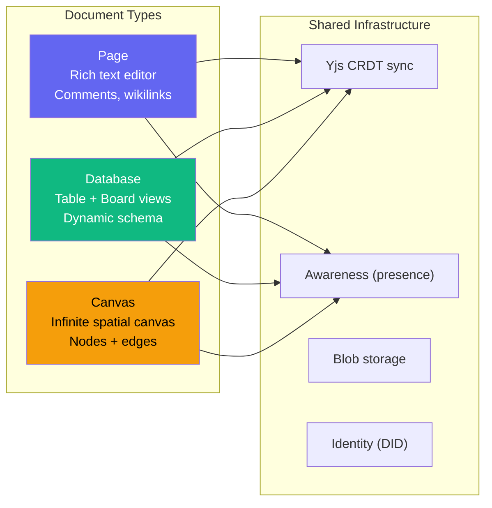

| Type         | Schema           | Package        | Web Status            | Expo Status          |
| ------------ | ---------------- | -------------- | --------------------- | -------------------- |
| **Page**     | `PageSchema`     | `@xnet/editor` | Partial (no comments) | CDN WebView (no Yjs) |
| **Database** | `DatabaseSchema` | `@xnet/views`  | Missing               | Missing              |
| **Canvas**   | `CanvasSchema`   | `@xnet/canvas` | Missing               | Missing              |

### Electron App Component Tree

```
App.tsx (shell)
├── Sidebar.tsx (314 lines)
│   ├── Collapsible sections (Pages, Databases, Canvases)
│   ├── Document list with icons, delete, hover states
│   ├── Create dropdown (Page, Database, Canvas, Add Shared)
│   ├── Plugin sidebar items (top, bottom, section)
│   └── Settings link
│
├── PageView.tsx (907 lines)
│   ├── DocumentHeader (title, share button)
│   ├── SyncIndicator (status dot, peer count)
│   ├── PresenceAvatars (remote users)
│   ├── RichTextEditor (@xnet/editor)
│   │   ├── Collaborative Yjs binding
│   │   ├── Image/file upload hooks
│   │   ├── Plugin extensions (mermaid, etc.)
│   │   └── Toolbar (desktop mode)
│   ├── Comment System
│   │   ├── CommentMark extension (text anchors)
│   │   ├── CommentPopover (preview/full modes)
│   │   ├── CommentsSidebar (thread list)
│   │   └── OrphanedThreadList (deleted anchor handling)
│   └── New comment input modal
│
├── DatabaseView.tsx (1300 lines)
│   ├── View mode switcher (Table / Board)
│   ├── TableView (@xnet/views)
│   │   ├── Virtual scrolling
│   │   ├── Column CRUD (add, rename, delete, reorder)
│   │   ├── Cell presence indicators
│   │   └── Inline editing
│   ├── BoardView (@xnet/views)
│   │   ├── Kanban columns from select options
│   │   ├── Card drag-and-drop
│   │   ├── Column reordering
│   │   └── CardDetailModal
│   ├── Cell comments (anchor to row+column)
│   └── CommentsSidebar with cell hover highlighting
│
├── CanvasView.tsx (183 lines)
│   ├── Canvas (@xnet/canvas)
│   │   ├── Infinite pan/zoom
│   │   ├── Grid background
│   │   ├── Node creation (card type)
│   │   └── Edge creation (arrows, dashed)
│   ├── Toolbar (Add Node, Center)
│   └── PresenceAvatars
│
├── SettingsView.tsx (295 lines)
│   ├── General (startup behavior, auto-save)
│   ├── Appearance (theme, font size, sidebar position)
│   ├── Plugins (PluginManager)
│   ├── Data (storage info, clear, export)
│   └── Network (P2P toggle, signaling server, local API)
│
├── PluginManager.tsx
│   ├── Installed plugin list with status badges
│   ├── Activate / Deactivate / Uninstall actions
│   └── Install from manifest dialog
│
└── Supporting Components
    ├── ShareButton (copy share ID)
    ├── PresenceAvatars (DIDAvatar stack)
    ├── DocumentHeader (editable title)
    ├── AddSharedDialog (paste shared ID)
    ├── BundledPluginInstaller (auto-install on startup)
    └── UpdateNotification (Electron-only)
```

### Feature Parity Matrix

#### Core Features

| Feature                |   Electron    |    Web    |     Expo     | Priority |
| ---------------------- | :-----------: | :-------: | :----------: | -------- |
| Page CRUD              |      Yes      |    Yes    |     Yes      | P0       |
| Database CRUD          |      Yes      |    No     |      No      | P0       |
| Canvas CRUD            |      Yes      |    No     |      No      | P1       |
| Rich text editor       |     Full      |   Basic   | CDN (no Yjs) | P0       |
| Yjs collaborative sync |      Yes      | Disabled  |      No      | P0       |
| Passkey identity       | Profile-based | Hardcoded |   SDK auto   | P0       |
| Hub connection         |    IPC→BSM    |   None    |     None     | P0       |
| Onboarding flow        |      No       |    No     |      No      | P0       |

#### Editor Features

| Feature                  | Electron |   Web   | Expo | Priority |
| ------------------------ | :------: | :-----: | :--: | -------- |
| RichTextEditor component |   Yes    |   Yes   | CDN  | P0       |
| Toolbar (desktop mode)   |   Yes    | Default |  No  | P1       |
| Image upload             |   Yes    |   Yes   |  No  | P1       |
| File upload/download     |   Yes    |   Yes   |  No  | P2       |
| Wikilinks                |   Yes    |   Yes   |  No  | P1       |
| Slash commands           |   Yes    |   Yes   |  No  | P1       |
| Drag handle              |   Yes    |   Yes   |  No  | P2       |
| Callouts                 |   Yes    |   Yes   |  No  | P2       |
| Toggle blocks            |   Yes    |   Yes   |  No  | P2       |
| Code blocks              |   Yes    |   Yes   |  No  | P1       |
| Mermaid diagrams         |  Plugin  |   No    |  No  | P2       |

#### Comment System

| Feature                       | Electron | Web | Expo | Priority |
| ----------------------------- | :------: | :-: | :--: | -------- |
| Text anchor comments          |   Yes    | No  |  No  | P1       |
| CommentMark extension         |   Yes    | No  |  No  | P1       |
| CommentPopover (preview/full) |   Yes    | No  |  No  | P1       |
| CommentsSidebar               |   Yes    | No  |  No  | P1       |
| Reply threads                 |   Yes    | No  |  No  | P1       |
| Resolve/reopen                |   Yes    | No  |  No  | P2       |
| Orphaned comment handling     |   Yes    | No  |  No  | P2       |
| Cell comments (database)      |   Yes    | No  |  No  | P2       |
| Row/column comments           |   Yes    | No  |  No  | P2       |

#### Database Features

| Feature                                                    | Electron | Web | Expo | Priority |
| ---------------------------------------------------------- | :------: | :-: | :--: | -------- |
| TableView                                                  |   Yes    | No  |  No  | P0       |
| BoardView                                                  |   Yes    | No  |  No  | P0       |
| Column CRUD                                                |   Yes    | No  |  No  | P0       |
| Column types (text, number, checkbox, select, multiSelect) |   Yes    | No  |  No  | P0       |
| Row CRUD                                                   |   Yes    | No  |  No  | P0       |
| Virtual scrolling                                          |   Yes    | No  |  No  | P1       |
| Cell presence indicators                                   |   Yes    | No  |  No  | P1       |
| CardDetailModal                                            |   Yes    | No  |  No  | P1       |
| View configuration (sorts, groups)                         |   Yes    | No  |  No  | P2       |
| Gallery view                                               |    No    | No  |  No  | P3       |
| Timeline view                                              |    No    | No  |  No  | P3       |
| Calendar view                                              |    No    | No  |  No  | P3       |

#### Canvas Features

| Feature            | Electron | Web | Expo | Priority |
| ------------------ | :------: | :-: | :--: | -------- |
| Infinite pan/zoom  |   Yes    | No  |  No  | P1       |
| Grid background    |   Yes    | No  |  No  | P1       |
| Card nodes         |   Yes    | No  |  No  | P1       |
| Edge connections   |   Yes    | No  |  No  | P1       |
| Arrow/dashed edges |   Yes    | No  |  No  | P2       |
| Node double-click  |   Yes    | No  |  No  | P2       |
| Fit to content     |   Yes    | No  |  No  | P2       |

#### Sidebar Features

| Feature              | Electron  |    Web     |    Expo    | Priority |
| -------------------- | :-------: | :--------: | :--------: | -------- |
| Document list        |  3 types  | Pages only |  FlatList  | P0       |
| Collapsible sections |    Yes    |     No     |    N/A     | P1       |
| Document type icons  |    Yes    |     No     |     No     | P1       |
| Delete on hover      |    Yes    |     No     | Long press | P1       |
| Create dropdown      | 4 options | Link only  |   Button   | P0       |
| Add Shared dialog    |    Yes    |     No     |     No     | P1       |
| Plugin sidebar items |    Yes    |     No     |     No     | P2       |
| Settings link        |    Yes    |    Yes     |   Screen   | P1       |

#### Settings Features

| Feature                 | Electron |     Web     |    Expo     | Priority      |
| ----------------------- | :------: | :---------: | :---------: | ------------- |
| Theme selector          |   Yes    | Toggle only | System only | P1            |
| Signaling server config |   Yes    |     No      |     No      | P2            |
| Clear local data        |   Yes    |     No      |     Yes     | P1            |
| Export data             |   Yes    |     No      |     No      | P2            |
| Plugin manager          |   Yes    |     No      |     No      | P2            |
| Local API toggle        |   Yes    |     No      |     No      | Electron-only |
| Auto-save toggle        |   Yes    |     No      |     No      | P2            |

#### Presence & Collaboration

| Feature                  | Electron  |     Web      | Expo | Priority |
| ------------------------ | :-------: | :----------: | :--: | -------- |
| Sync status indicator    |    Yes    |     Yes      |  No  | P0       |
| Peer count               |    Yes    |      No      |  No  | P1       |
| PresenceAvatars          | DIDAvatar | Inline spans |  No  | P1       |
| Remote cursor (editor)   |    Yes    |      No      |  No  | P1       |
| Cell presence (database) |    Yes    |      No      |  No  | P2       |

#### Sharing

| Feature           | Electron | Web | Expo | Priority |
| ----------------- | :------: | :-: | :--: | -------- |
| Share button      |   Yes    | No  |  No  | P1       |
| Copy share ID     |   Yes    | No  |  No  | P1       |
| Add Shared dialog |   Yes    | No  |  No  | P1       |
| Type-prefixed IDs |   Yes    | No  |  No  | P1       |

### Shared Package Usage

The Electron app uses the full suite of shared packages. The web and Expo apps need to expand their usage:

```mermaid
graph TD
    subgraph "Shared Packages (platform-agnostic)"
        react["@xnet/react<br/>hooks, providers, onboarding"]
        data["@xnet/data<br/>schemas, NodeStore"]
        editor["@xnet/editor<br/>RichTextEditor, extensions"]
        views["@xnet/views<br/>TableView, BoardView, CardDetailModal"]
        canvas["@xnet/canvas<br/>Canvas, nodes, edges"]
        ui["@xnet/ui<br/>CommentPopover, CommentsSidebar,<br/>DIDAvatar, ThemeToggle"]
        identity["@xnet/identity<br/>passkey, DID, UCAN"]
        sync["@xnet/sync<br/>Yjs sync, awareness"]
        storage["@xnet/storage<br/>IndexedDB, BlobStore"]
        devtools["@xnet/devtools<br/>debug panels"]
        plugins["@xnet/plugins<br/>plugin system"]
    end

    subgraph "Electron (uses all)"
        E["apps/electron"]
    end

    subgraph "Web (needs expansion)"
        W["apps/web"]
    end

    subgraph "Expo (needs major work)"
        X["apps/expo"]
    end

    E --> react & data & editor & views & canvas & ui & identity & sync & storage & devtools & plugins

    W --> react & data & editor & ui & storage
    W -.->|"needs"| views & canvas & identity & sync & devtools

    X --> react
    X -.->|"needs"| data & editor & views & canvas & ui & identity & sync & storage

    style E fill:#10b981,color:#fff
    style W fill:#f59e0b,color:#000
    style X fill:#ef4444,color:#fff
```

### Web App Parity Roadmap

To bring `apps/web` to parity with Electron, implement in this order:

#### Phase A: Infrastructure (before Phase 1)

1. **Add missing package dependencies** to `apps/web/package.json`:

   ```json
   "@xnet/identity": "workspace:*",
   "@xnet/views": "workspace:*",
   "@xnet/canvas": "workspace:*",
   "@xnet/devtools": "workspace:*",
   "@xnet/plugins": "workspace:*"
   ```

2. **Port the App shell** from Electron's `App.tsx`:
   - State-based document selection (or integrate with TanStack Router params)
   - Support for all three document types
   - Create dropdown with Page/Database/Canvas/Add Shared

3. **Port the Sidebar** from Electron's `Sidebar.tsx`:
   - Collapsible sections by document type
   - Document type icons
   - Delete button on hover
   - Full create dropdown

#### Phase B: Database Support

4. **Add DatabaseView** using `@xnet/views`:
   - Import `TableView`, `BoardView`, `CardDetailModal`
   - Port the view mode switcher
   - Port column CRUD operations
   - Port cell presence indicators

5. **Add database routing**:
   - New route: `/db/$dbId`
   - Or extend the existing routing to support document types

#### Phase C: Canvas Support

6. **Add CanvasView** using `@xnet/canvas`:
   - Import `Canvas` component
   - Port toolbar (Add Node, Center)
   - Port initial content creation

7. **Add canvas routing**:
   - New route: `/canvas/$canvasId`

#### Phase D: Comment System

8. **Integrate comment system** from `@xnet/ui`:
   - Import `CommentPopover`, `CommentsSidebar`, `OrphanedThreadList`
   - Add `useComments` hook usage
   - Port the comment mark extension integration
   - Add comment count badge to header

#### Phase E: Sharing & Presence

9. **Add ShareButton** component
10. **Add AddSharedDialog** component
11. **Upgrade PresenceAvatars** to use `DIDAvatar` from `@xnet/ui`

#### Phase F: Settings & Plugins

12. **Expand SettingsView** with all sections from Electron
13. **Add PluginManager** (optional for web, but enables same plugin ecosystem)
14. **Add devtools** via `@xnet/devtools`

### Expo Parity Strategy

Expo requires a different approach due to React Native's constraints. The `@xnet/editor`, `@xnet/views`, and `@xnet/canvas` packages are DOM-based and cannot run natively. The solution is the WebView-first architecture described in the Cross-Platform Convergence section:

1. **Replace CDN TipTap** in `WebViewEditor.tsx` with the actual `apps/web` bundle
2. **Implement PostMessage bridge** for storage, identity, and sync
3. **Native shell** handles navigation, biometrics, SQLite storage
4. **WebView** renders the full app UI

This gives Expo full feature parity with web automatically — when web gains a feature, Expo gets it too.

## Implementation Checklists

### Web App: P0 (Critical Path)

These must be done to have a functional demo at `xnet.fyi/app`:

- [x] **Identity & Auth**
  - [x] Add `@xnet/identity` to `apps/web/package.json`
  - [x] Remove hardcoded `AUTHOR_DID` and `SIGNING_KEY` from `main.tsx`
  - [x] Integrate `createIdentityManager()` for passkey auth
  - [x] Add unlock flow for returning users
  - [ ] Handle fallback for non-PRF browsers

- [x] **Onboarding**
  - [x] Import `OnboardingProvider` and `OnboardingFlow` from `@xnet/react`
  - [x] Wire onboarding into app entry point
  - [x] Configure hub URL (`wss://hub.xnet.fyi`)
  - [ ] Add template picker on `ReadyScreen`

- [x] **Hub Connection**
  - [x] Pass `hubUrl` to `XNetProvider` config
  - [ ] Remove `disableSync: true` from `useNode` calls
  - [ ] Verify Yjs sync works end-to-end

- [x] **Deployment**
  - [x] Set `base: '/app/'` in `vite.config.ts`
  - [x] Set `basepath: '/app'` in TanStack Router
  - [x] Update PWA manifest `start_url` and `scope`
  - [x] Update `deploy-site.yml` to build web app
  - [x] Add SPA fallback (`404.html`)
  - [ ] Verify deployment at `xnet.fyi/app`

- [x] **Landing Page**
  - [x] Add "Try it now" CTA to Hero section
  - [x] Add "Try it" to Nav
  - [ ] Verify download page `/app` link works

### Web App: P1 (Feature Parity - Core)

These bring the web app to basic feature parity with Electron:

- [x] **Database Support**
  - [x] Add `@xnet/views` to dependencies
  - [x] Create `DatabaseView.tsx` component
  - [x] Import and configure `TableView`
  - [x] Import and configure `BoardView`
  - [x] Add view mode switcher
  - [x] Add route `/db/$dbId`
  - [x] Add "New Database" to create menu

- [x] **Canvas Support**
  - [x] Add `@xnet/canvas` to dependencies
  - [x] Create `CanvasView.tsx` component
  - [x] Import and configure `Canvas`
  - [x] Add toolbar (Add Node, Center)
  - [x] Add route `/canvas/$canvasId`
  - [x] Add "New Canvas" to create menu

- [x] **Sidebar Upgrade**
  - [x] Add collapsible sections (Pages, Databases, Canvases)
  - [x] Add document type icons (FileText, Database, Layout)
  - [x] Add delete button on hover
  - [x] Upgrade create button to dropdown with all types
  - [x] Add "Add Shared..." option

- [x] **Comment System**
  - [x] Import `CommentPopover` from `@xnet/ui`
  - [x] Import `CommentsSidebar` from `@xnet/ui`
  - [x] Add `useComments` hook integration
  - [x] Add CommentMark extension to editor
  - [x] Add comment count badge to header
  - [x] Add new comment input modal

- [x] **Presence & Sharing**
  - [x] Import `DIDAvatar` from `@xnet/ui`
  - [x] Upgrade `PresenceAvatars` to use `DIDAvatar`
  - [x] Add peer count to sync indicator
  - [x] Create `ShareButton` component
  - [x] Create `AddSharedDialog` component
  - [x] Implement type-prefixed share IDs

### Web App: P2 (Feature Parity - Polish)

These complete feature parity:

- [x] **Editor Enhancements**
  - [ ] Add Mermaid plugin support
  - [x] Configure toolbar mode (desktop)

- [x] **Comment System (Advanced)**
  - [x] Add resolve/reopen functionality
  - [x] Add `OrphanedThreadList` component
  - [x] Handle orphaned comment restoration (dismiss/select - reattach TBD)

- [x] **Database (Advanced)**
  - [x] Add `CardDetailModal` for row editing
  - [x] Add cell presence indicators
  - [x] Add view configuration (sorts, groups)

- [x] **Canvas (Advanced)**
  - [x] Add arrow/dashed edge styles
  - [x] Add node double-click handler
  - [x] Add fit-to-content action

- [x] **Settings Expansion**
  - [x] Add theme selector (Light/Dark/System)
  - [x] Add clear local data button
  - [x] Add export data button
  - [x] Add signaling server config (advanced)
  - [ ] Add auto-save toggle

- [x] **Plugin System**
  - [x] Add `@xnet/plugins` to dependencies
  - [x] Add `PluginManager` component
  - [ ] Add plugin sidebar item support
  - [ ] Configure bundled plugins

- [x] **DevTools**
  - [x] Add `@xnet/devtools` to dependencies
  - [x] Add `XNetDevToolsProvider`
  - [x] Wire devtools panel

### Web App: Demo Polish

These improve the demo experience:

- [ ] **Demo UI Components**
  - [ ] Create `DemoBanner.tsx` in `@xnet/react`
  - [ ] Create `DemoQuotaIndicator.tsx` in `@xnet/react`
  - [ ] Create `DemoDataExpiredScreen.tsx` in `@xnet/react`
  - [ ] Add demo mode detection from hub handshake
  - [ ] Wire demo components into app

- [x] **Error Handling**
  - [x] Add `ErrorBoundary` to root
  - [x] Add `OfflineIndicator` to root
  - [x] Add `HubStatusIndicator` to header

### Expo: WebView Migration

These replace the CDN-based editor with the full web app:

- [ ] **WebView Setup**
  - [ ] Build `apps/web` for embedding (adjust base path)
  - [ ] Update `WebViewEditor.tsx` to load web app bundle
  - [ ] Or: load from hosted URL (`xnet.fyi/app`)

- [ ] **PostMessage Bridge**
  - [ ] Define message protocol types
  - [ ] Implement `storage.query` / `storage.mutate` handlers
  - [ ] Implement `identity.unlock` / `identity.create` handlers
  - [ ] Implement `sync.connect` / `sync.send` handlers
  - [ ] Implement `navigation.push` / `navigation.pop` handlers

- [ ] **Native Adapters**
  - [ ] Create `PostMessageStorageAdapter` for SQLite bridge
  - [ ] Create `PostMessageSyncAdapter` for WebSocket bridge
  - [ ] Create `BiometricIdentityProvider` using `expo-local-authentication`

- [ ] **Navigation Integration**
  - [ ] Sync React Navigation state with WebView routes
  - [ ] Update native header title from WebView
  - [ ] Handle back button / swipe gestures

### Hub: Demo Hardening

These make the demo more robust:

- [ ] **Quota Enforcement**
  - [ ] Create `services/quota.ts`
  - [ ] Enforce per-DID storage limits
  - [ ] Enforce document count limits
  - [ ] Enforce blob size limits
  - [ ] Return structured errors for quota exceeded

- [ ] **Rate Limiting**
  - [ ] Add demo-specific rate limit tier
  - [ ] Configure tighter limits (100 msgs/min, 10 conn/IP)

- [ ] **Initial Sync**
  - [ ] Create `services/initial-sync.ts`
  - [ ] Push full Y.Doc state to new devices
  - [ ] Push node changes since last sync

### Platform Convergence (Long-term)

These enable the "write once, run everywhere" architecture:

- [ ] **Platform Adapter Interface**
  - [ ] Define `PlatformAdapter` type
  - [ ] Create `BrowserAdapter` implementation
  - [ ] Create `ElectronAdapter` implementation (refactor from IPC)
  - [ ] Create `MobileAdapter` implementation (PostMessage)

- [ ] **Electron Migration**
  - [ ] Configure Electron to load `apps/web` build
  - [ ] Update preload to inject adapters
  - [ ] Remove duplicate renderer code
  - [ ] Verify all features work

- [ ] **Mobile Full Integration**
  - [ ] Complete PostMessage bridge
  - [ ] Test all document types in WebView
  - [ ] Optimize WebView performance
  - [ ] Add platform-adaptive styling

## Integration Plan

### Phase 1: Wire Up the Web App (apps/web)

Connect the existing onboarding and identity infrastructure to the web app.

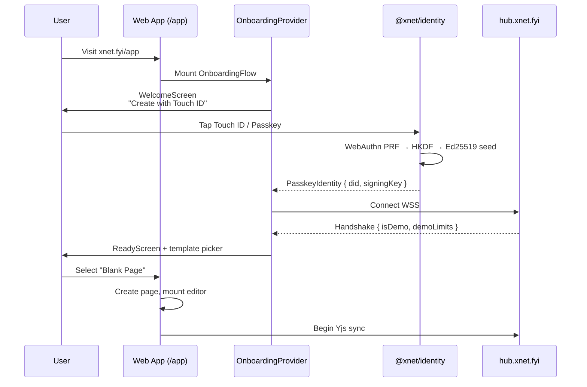

#### 1.1 Replace Hardcoded Identity with Passkey Auth

**File: `apps/web/src/main.tsx`**

Remove the hardcoded `AUTHOR_DID` and `SIGNING_KEY`. Instead:

1. On app load, check if a passkey identity exists in IndexedDB via `identityManager.hasIdentity()`.
2. If yes, render the app with an unlock gate (Touch ID prompt).
3. If no, render the onboarding flow.

The `XNetProvider` config receives `authorDID` and `signingKey` from the passkey identity once authenticated.

```typescript
// Pseudocode for new main.tsx flow
const identityManager = createIdentityManager()

function App() {
  const [identity, setIdentity] = useState<PasskeyIdentity | null>(null)

  if (!identity) {
    return (
      <OnboardingProvider
        hubUrl="wss://hub.xnet.fyi"
        onComplete={(id) => setIdentity(id)}
      >
        <OnboardingFlow />
      </OnboardingProvider>
    )
  }

  return (
    <XNetProvider config={{
      nodeStorage,
      authorDID: identity.did,
      signingKey: identity.signingKey,
      blobStore,
      signalingUrl: 'wss://hub.xnet.fyi'
    }}>
      <BlobProvider blobService={blobService}>
        <RouterProvider router={router} />
      </BlobProvider>
    </XNetProvider>
  )
}
```

#### 1.2 Add Hub Connection (Sync)

**File: `apps/web/src/main.tsx`**

Pass `signalingUrl: 'wss://hub.xnet.fyi'` to `XNetProvider`. This enables the existing `SyncManager` to establish a WebSocket connection for Yjs CRDT sync.

The demo hub URL should be configurable via environment variable:

```typescript
const HUB_URL = import.meta.env.VITE_HUB_URL || 'wss://hub.xnet.fyi'
```

#### 1.3 Add Demo UI Components

**New files in `packages/react/src/components/`:**

- **`DemoBanner.tsx`** — Fixed top banner: "You're using the demo. Data expires after 24h of inactivity." with dismiss and "Download desktop app" CTA.
- **`DemoQuotaIndicator.tsx`** — Shows storage used / quota limit with a progress bar. Warns at 80%+ usage.

These render conditionally based on the hub handshake response (`isDemo: true`).

#### 1.4 Wire Onboarding Into Root Layout

**File: `apps/web/src/routes/__root.tsx`**

After onboarding completes and the app renders, add:

- `<OfflineIndicator />` — already built, just needs mounting
- `<DemoBanner />` — new, shows in demo mode
- `<HubStatusIndicator />` — already built, shows sync status

### Phase 2: Serve from the Site (CI Pipeline)

Get the web app building and deploying at `xnet.fyi/app`.

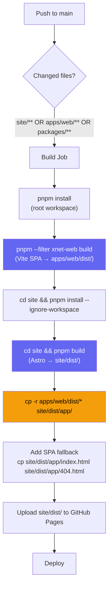

#### 2.1 Configure Vite Base Path

**File: `apps/web/vite.config.ts`**

Set `base: '/app/'` so all asset paths are relative to `/app/`:

```typescript
export default defineConfig({
  base: '/app/'
  // ... rest of config
})
```

This ensures `<script>`, `<link>`, and asset URLs all prefix with `/app/`.

#### 2.2 Configure TanStack Router Base Path

TanStack Router needs to know it's mounted at `/app`:

```typescript
const router = createRouter({
  routeTree,
  basepath: '/app'
})
```

Routes will then be:

- `/app/` — page list
- `/app/settings` — settings
- `/app/doc/:docId` — document editor

#### 2.3 Update PWA Manifest

**File: `apps/web/vite.config.ts`**

Update the PWA manifest `start_url` and `scope`:

```typescript
manifest: {
  start_url: '/app/',
  scope: '/app/',
  // ... rest of manifest
}
```

#### 2.4 SPA Fallback on GitHub Pages

GitHub Pages doesn't support server-side rewrites. The standard workaround: place a copy of `index.html` at `404.html` within the `/app/` directory. When GitHub Pages can't find `/app/doc/abc123`, it serves `404.html` (which is the SPA shell), and TanStack Router handles the route client-side.

Add this to the CI build step:

```bash
cp site/dist/app/index.html site/dist/app/404.html
```

Note: This only works for paths under `/app/`. The site's own `404.html` (if any) is separate.

#### 2.5 Update deploy-site.yml

**File: `.github/workflows/deploy-site.yml`**

The workflow currently only triggers on `site/**` changes and only builds the Astro site. It needs to:

1. **Trigger on** `site/**`, `apps/web/**`, and `packages/**` changes (since the web app depends on workspace packages).
2. **Install the full workspace** (not just site/) to build the web app.
3. **Build the web app** before the site.
4. **Copy the web app** into the site dist.

```yaml
on:
  push:
    branches: [main]
    paths:
      - 'site/**'
      - 'apps/web/**'
      - 'packages/**'
  workflow_dispatch:

jobs:
  build:
    runs-on: ubuntu-latest
    steps:
      - uses: actions/checkout@v4
      - uses: pnpm/action-setup@v4
      - uses: actions/setup-node@v4
        with:
          node-version: 22
          cache: pnpm

      # Build web app (needs workspace packages)
      - name: Install workspace dependencies
        run: pnpm install --frozen-lockfile

      - name: Build packages
        run: pnpm build --filter xnet-web...

      - name: Build web app
        run: pnpm --filter xnet-web build

      # Build Astro site (independent)
      - name: Install site dependencies
        run: pnpm install --ignore-workspace
        working-directory: site

      - name: Build site
        run: pnpm build
        working-directory: site

      # Stitch together
      - name: Copy web app into site
        run: |
          mkdir -p site/dist/app
          cp -r apps/web/dist/* site/dist/app/
          cp site/dist/app/index.html site/dist/app/404.html

      - name: Upload Pages artifact
        uses: actions/upload-pages-artifact@v3
        with:
          path: site/dist
```

### Phase 3: Landing Page Integration

Connect the dots in the marketing site.

#### 3.1 Hero CTA

**File: `site/src/components/sections/Hero.astro`**

Add a prominent "Try it now" button alongside "Get Started":

```html
<a href="/app" class="primary-cta">
  Try it now
  <span class="badge">No signup</span>
</a>
```

#### 3.2 Nav Link

**File: `site/src/components/sections/Nav.astro`**

Add "Try it" as a top-level nav item linking to `/app`.

#### 3.3 Fix Download Page Dead Link

**File: `site/src/pages/download.astro`**

The "Use in browser" link at line 125 already points to `/app`. Once the app is deployed, this link will work. No change needed.

#### 3.4 GetStarted Section

**File: `site/src/components/sections/GetStarted.astro`**

Add a "Try in browser" option alongside the existing "Read the Docs" and "View on GitHub" CTAs.

### Phase 4: Demo UI Polish

#### 4.1 DemoBanner Component

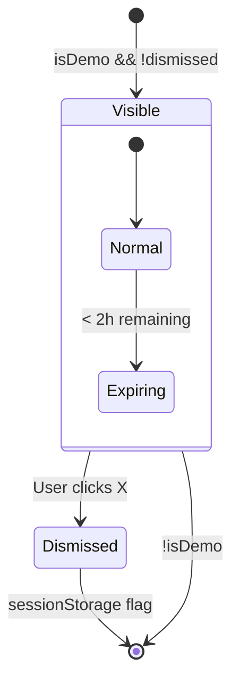

A fixed-position banner at the top of the app when connected to a demo hub:

> **Demo mode** — Your data is stored temporarily and expires after 24 hours of inactivity. [Download the desktop app](/download) to keep your data permanently.

Dismissible per session (uses `sessionStorage`). Re-appears if the user's data is close to eviction.

#### 4.2 DemoQuotaIndicator Component

Shows in the sidebar footer when in demo mode:

```
Storage: ████████░░ 7.2 MB / 10 MB
```

Warns at 80% with yellow, errors at 95% with red. Links to download page when full.

Requires the hub to report usage in the handshake or via a periodic quota check endpoint.

#### 4.3 Demo Data Expired Screen

When a user returns after eviction, their IndexedDB still has a passkey identity but the hub has purged their data. The app should detect this (empty initial sync) and show:

> **Your demo data has expired.** Demo data is removed after 24 hours of inactivity. You can start fresh or download the desktop app to keep your data permanently.
>
> [Start Fresh] [Download Desktop App]

### Phase 5: Hub Hardening (Lower Priority)

These are server-side improvements that make the demo more robust but aren't blocking the initial launch.

#### 5.1 Quota Enforcement Service

**File: `packages/hub/src/services/quota.ts`**

Enforce per-DID storage limits. Check on every Yjs update and blob upload:

- Total storage per DID (default 10 MB for demo)
- Max document count (default 50 for demo)
- Max single blob size (default 2 MB for demo)

Reject operations that exceed limits with a structured error the client can display.

#### 5.2 Demo Rate Limit Tier

**File: `packages/hub/src/middleware/rate-limit.ts`**

Add demo-specific limits that are tighter than the default:

- 100 WebSocket messages per minute (vs 1000 default)
- 10 connections per IP (vs 100 default)

#### 5.3 Hub Initial Sync Service

**File: `packages/hub/src/services/initial-sync.ts`**

When a new device connects with an existing DID, the hub should push all stored Y.Doc state and node changes. Currently the client-side `InitialSyncManager` handles tracking, but the hub needs to actively send the data.

## Full User Journey

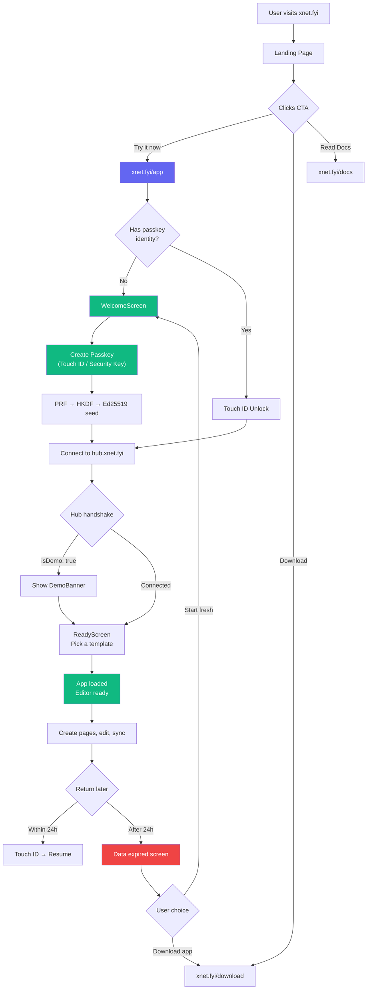

## Implementation Order & Dependencies

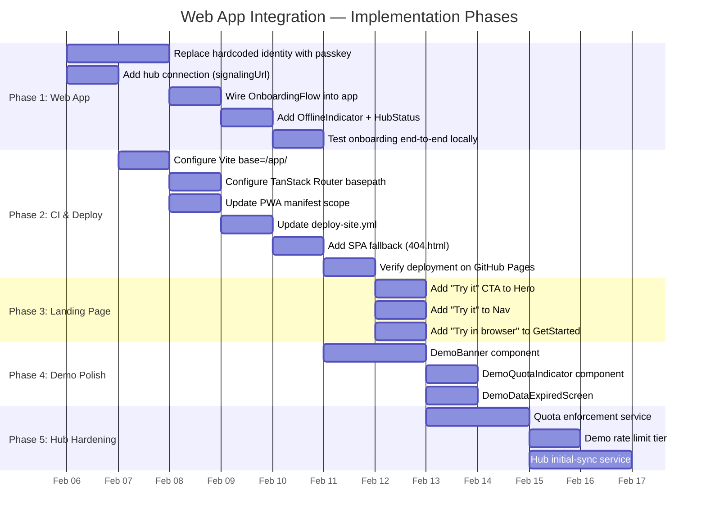

## File Change Summary

### Must Change (Phase 1 + 2)

| File                                | Change                                                              |
| ----------------------------------- | ------------------------------------------------------------------- |
| `apps/web/src/main.tsx`             | Replace hardcoded identity with passkey auth + onboarding + hub URL |
| `apps/web/src/routes/__root.tsx`    | Add OfflineIndicator, HubStatusIndicator, DemoBanner                |
| `apps/web/vite.config.ts`           | Set `base: '/app/'`, update PWA manifest scope                      |
| `apps/web/package.json`             | Add `@xnet/identity` dependency                                     |
| `.github/workflows/deploy-site.yml` | Full workspace build + web app copy step                            |

### Must Create (Phase 1 + 2)

| File                   | Purpose                                         |
| ---------------------- | ----------------------------------------------- |
| `apps/web/src/App.tsx` | Top-level component with auth gate + onboarding |

### Should Change (Phase 3)

| File                                            | Change                   |
| ----------------------------------------------- | ------------------------ |
| `site/src/components/sections/Hero.astro`       | Add "Try it now" CTA     |
| `site/src/components/sections/Nav.astro`        | Add "Try it" nav link    |
| `site/src/components/sections/GetStarted.astro` | Add "Try in browser" CTA |

### Should Create (Phase 4)

| File                                                      | Purpose                 |
| --------------------------------------------------------- | ----------------------- |
| `packages/react/src/components/DemoBanner.tsx`            | Demo mode banner        |
| `packages/react/src/components/DemoQuotaIndicator.tsx`    | Storage quota indicator |
| `packages/react/src/components/DemoDataExpiredScreen.tsx` | Post-eviction screen    |

### Could Create (Phase 5)

| File                                        | Purpose                               |
| ------------------------------------------- | ------------------------------------- |
| `packages/hub/src/services/quota.ts`        | Per-DID quota enforcement             |
| `packages/hub/src/services/initial-sync.ts` | Server-push full state to new devices |

## Risks & Mitigations

| Risk                                              | Impact                                              | Mitigation                                                                                                                                                                                                         |
| ------------------------------------------------- | --------------------------------------------------- | ------------------------------------------------------------------------------------------------------------------------------------------------------------------------------------------------------------------ |
| GitHub Pages 404.html SPA fallback is a hack      | Incorrect status codes (404 not 200), poor SEO      | Acceptable for an SPA — search engines don't need to index `/app/doc/xyz`. Can migrate to Cloudflare Pages later for proper `_redirects`.                                                                          |
| Passkey PRF not supported on all browsers         | Users on Firefox/older Chrome can't create identity | `@xnet/identity` already has a fallback path (`createFallbackIdentity`) that encrypts a generated key in IndexedDB. `detectPasskeySupport()` handles detection. Show appropriate UI on `UnsupportedBrowserScreen`. |
| Demo hub eviction confuses returning users        | User returns, data is gone, they're confused        | `DemoDataExpiredScreen` explains what happened and offers clear next steps. The `DemoBanner` warns upfront.                                                                                                        |
| Large packages/\*\* trigger deploys unnecessarily | CI cost increases                                   | Use path filtering in the workflow — only trigger on changes to packages the web app actually depends on, or use turbo's `--filter` to detect affected packages.                                                   |
| PWA service worker caches stale assets at /app/   | Users see old version after deploy                  | `registerType: 'autoUpdate'` in VitePWA already handles this — the service worker auto-updates in the background.                                                                                                  |

## Open Questions

1. **Should the web app share styles/components with the Astro site?** Currently they're completely separate. The site uses Astro components with Tailwind; the web app uses React with Tailwind. They have different Tailwind configs. Keeping them separate is simpler but means visual inconsistency is possible.

2. **Should we add a `/app` page to Astro that redirects to the SPA?** If someone visits `/app` and the SPA's `index.html` is at `/app/index.html`, GitHub Pages should serve it automatically for the directory. But if we want a loading screen or meta tags, an Astro page could render minimal HTML that bootstraps the SPA.

3. **How should the hub report quota usage?** Options: (a) include usage in the WebSocket handshake response, (b) expose a REST endpoint (`GET /quota/:did`), (c) include usage in periodic heartbeats. Option (a) is simplest for initial load; (b) is needed for real-time updates.

4. **Should the web app be a separate PWA or share the site's service worker?** Currently it has its own VitePWA service worker with `scope: '/app/'`. This is correct — the Astro site doesn't need a service worker, and the web app's offline capabilities are independent.

## Cross-Platform Convergence: Write Once, Run Everywhere

The web app integration is part of a larger question: how much UI code should be shared across Electron, Web, and Mobile? Today the answer is "almost none." This section analyzes the current state, proposes a convergence strategy, and outlines how to get there.

### Current Platform Architecture


### Code Sharing Audit

| Component          | Electron                                                        | Web                              | Expo                                                 | Shared?                                    |
| ------------------ | --------------------------------------------------------------- | -------------------------------- | ---------------------------------------------------- | ------------------------------------------ |
| **Sidebar**        | 314 lines, 3 doc types, plugins, collapse                       | 65 lines, pages only             | N/A (FlatList on HomeScreen)                         | No                                         |
| **Editor**         | `@xnet/editor` + 907-line wrapper (comments, plugins, presence) | `@xnet/editor` + 31-line wrapper | CDN TipTap in WebView (no Yjs, no custom extensions) | Partially (Electron+Web share core editor) |
| **Database views** | Full TableView, BoardView from `@xnet/views`                    | None                             | None                                                 | No                                         |
| **Canvas**         | `@xnet/canvas`                                                  | None                             | None                                                 | No                                         |
| **Settings**       | 295 lines, 5 tabs                                               | 42 lines, 2 sections             | 126 lines, RN StyleSheet                             | No                                         |
| **Identity**       | `identityFromPrivateKey()` with profile seed                    | Hardcoded DID + key              | Auto-generated via SDK                               | No                                         |
| **Sync**           | IPC through main process BSM                                    | Disabled                         | Disabled                                             | No                                         |
| **Onboarding**     | None                                                            | None                             | None                                                 | N/A (exists in @xnet/react but unused)     |
| **Search**         | None                                                            | GlobalSearch (240 lines)         | None                                                 | No                                         |
| **Presence**       | DIDAvatar from @xnet/ui                                         | Inline colored spans             | None                                                 | No                                         |
| **Provider stack** | XNet + Blob + Theme + Telemetry + DevTools                      | XNet + Blob + Theme              | React Navigation only                                | Minimal                                    |

### Package Usage Per Platform

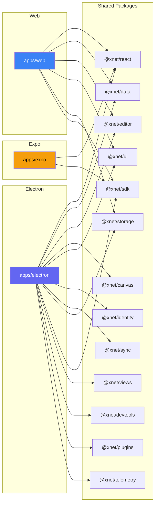

Electron uses 13/13 packages. Web uses 6/13. Expo uses 2/13 and barely touches them.

### The Key Insight: Electron's Renderer IS a Web App

The Electron renderer is a Vite-bundled React SPA loaded in a `BrowserWindow`. It uses standard DOM APIs, React, Tailwind, and shared packages. The only Electron coupling is the preload bridge (`window.xnet*` APIs for IPC-based sync, storage, and services).

This means the Electron renderer could run in any browser if the platform bridges were abstracted. And inversely, `apps/web` should converge toward the Electron renderer's feature set rather than duplicating it from scratch.

### The Expo Problem

Expo is the most disconnected platform:

- Does **not** use `XNetProvider`, `BlobProvider`, or `ThemeProvider`
- Does **not** use `@xnet/data`, `@xnet/editor`, `@xnet/ui`, `@xnet/views`, `@xnet/storage`, `@xnet/identity`, `@xnet/sync`, `@xnet/devtools`, or `@xnet/plugins`
- Has its own `useXNet` and `useNode` hooks that wrap `@xnet/sdk`
- Has its own `ExpoStorageAdapter` using `expo-sqlite`
- Loads TipTap from **CDN** in a WebView — no Yjs, no custom extensions, no collaboration
- Uses React Native `StyleSheet` instead of Tailwind
- Networking is disabled

The Expo app is effectively a separate product that happens to share a repo. Getting it to feature parity with Electron by reimplementing everything in React Native would be enormous effort and would create a permanent maintenance burden (every new feature ships twice).

### Proposed Architecture: WebView-First Mobile

The `@xnet/editor` and `@xnet/views` packages are inherently DOM-based (TipTap/ProseMirror requires a DOM). They cannot run natively in React Native. But they run perfectly in a WebView. The Expo app already uses a WebView for the editor — it's just loading a stripped-down CDN version instead of the actual shared code.

The proposal: **Expo should load the web app (`apps/web` build) in a WebView** for all rich content (editor, databases, canvas), with a thin React Native shell for navigation, native storage, and platform-specific features (biometrics, file system, push notifications).

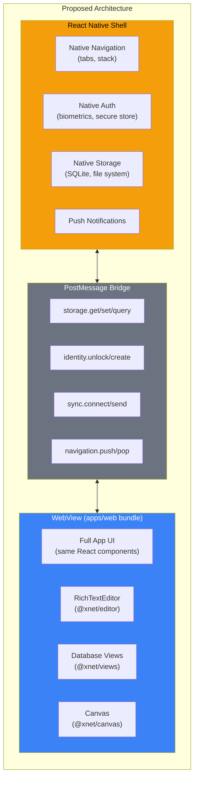

### Three-Tier Convergence Strategy

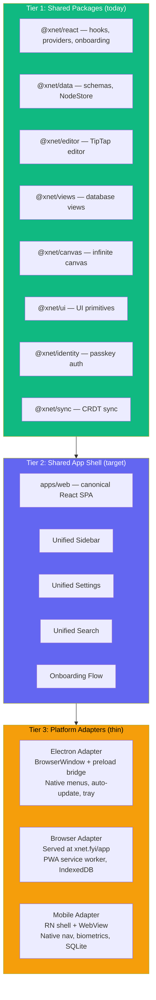

**Tier 1 (Shared Packages)** — Already exists. These are platform-agnostic libraries.

**Tier 2 (Shared App Shell)** — The `apps/web` SPA becomes the canonical UI that all platforms render. It contains the sidebar, settings, editor wrappers, search, onboarding, and all view components. Today, Electron has the most complete feature set, so the web app should converge toward Electron's renderer rather than being built from scratch.

**Tier 3 (Platform Adapters)** — Thin wrappers that provide platform-specific storage, sync, identity, and navigation:

| Concern         | Browser                        | Electron                       | Mobile                                     |
| --------------- | ------------------------------ | ------------------------------ | ------------------------------------------ |
| **Storage**     | IndexedDB via `@xnet/storage`  | SQLite via IPC preload bridge  | SQLite via RN postMessage bridge           |
| **Sync**        | WebSocket direct to hub        | WebSocket via main process BSM | WebSocket via RN bridge or direct          |
| **Identity**    | WebAuthn passkey (browser API) | Touch ID via Electron preload  | Biometrics via `expo-local-authentication` |
| **Rendering**   | Direct DOM                     | BrowserWindow (direct DOM)     | WebView (DOM inside RN)                    |
| **Navigation**  | TanStack Router (URL-based)    | TanStack Router or state-based | RN Navigation wrapping WebView routes      |
| **File access** | File API / downloads           | Node.js `fs` via IPC           | `expo-file-system` via bridge              |
| **Updates**     | Service worker                 | `electron-updater`             | App store / OTA via EAS                    |

### Convergence Path

This is not a "rewrite everything" proposal. It's an incremental convergence:

#### Step 1: Make `apps/web` the Feature-Complete SPA

Bring the web app to parity with Electron's renderer by porting features from `apps/electron/src/renderer/`:

1. **Port the Sidebar** — Electron's sidebar supports pages, databases, canvases, collapsible sections, plugin items, delete, and create menu. The web sidebar only lists pages. Port the Electron sidebar to the web app using the shared `@xnet/views` and `@xnet/ui` packages.

2. **Port DatabaseView and CanvasView** — Currently only in Electron. These use `@xnet/views` and `@xnet/canvas` which are platform-agnostic React packages. They should work in the web app with no changes.

3. **Port comments, presence, share** — The comment system (`CommentPopover`, `CommentsSidebar`, `OrphanedThreadList`) lives in `@xnet/ui`. The presence system uses `DIDAvatar` from `@xnet/ui`. These should be usable directly.

4. **Integrate onboarding** — Wire in `OnboardingProvider` + `OnboardingFlow` from `@xnet/react` (covered in Phase 1 of this exploration).

5. **Add devtools** — `@xnet/devtools` is a React package, not Electron-specific. Add it to the web app for developer experience.

#### Step 2: Abstract Platform Bridges

Define a `PlatformAdapter` interface that each platform implements:

```typescript
type PlatformAdapter = {
  storage: NodeStorageAdapter
  blobStore: BlobStoreAdapter
  sync: SyncManagerFactory
  identity: IdentityProvider
  platform: 'web' | 'electron' | 'mobile'
  capabilities: {
    nativeMenus: boolean
    fileSystem: boolean
    autoUpdate: boolean
    biometrics: boolean
    pushNotifications: boolean
  }
}
```

The web app (`apps/web/src/main.tsx`) detects the platform and uses the appropriate adapter:

- **Browser:** `IndexedDBAdapter` + `WebSocketSyncManager` + `PasskeyIdentityProvider`
- **Electron:** `IPCStorageAdapter` + `IPCSyncManager` + `PreloadIdentityProvider` (injected via `window.xnet*`)
- **Mobile:** `PostMessageStorageAdapter` + `PostMessageSyncManager` + `BiometricIdentityProvider` (bridged via postMessage)

#### Step 3: Electron Renders `apps/web`

Instead of maintaining a separate renderer in `apps/electron/src/renderer/`, Electron loads the `apps/web` build. The preload script injects the platform adapter via `contextBridge`. Electron-specific features (native menus, tray, auto-update, window management) stay in the main process.

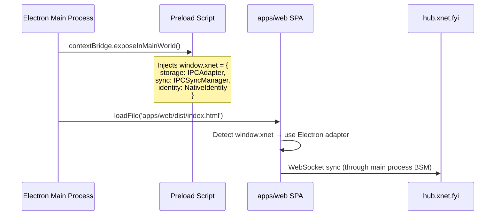

This eliminates the duplicated renderer code. The Electron app becomes:

- `src/main/` — Main process (window management, IPC handlers, native menus, auto-update)
- `src/preload/` — Bridge injection (same as today)
- **No `src/renderer/`** — Uses `apps/web/dist/` directly

#### Step 4: Mobile Loads `apps/web` in WebView

Replace the current Expo WebView approach (CDN TipTap in inline HTML) with loading the actual `apps/web` bundle. The RN shell provides:

- Tab/stack navigation (wrapping WebView route changes)
- Native biometric auth (bridged to the web app's identity layer)
- SQLite storage (bridged via postMessage as `NodeStorageAdapter`)
- Push notifications
- Native share sheet

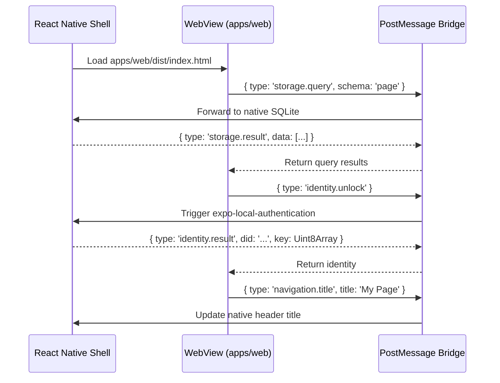

### What This Changes About the Web App Integration

The web app integration (Phases 1-3 of this exploration) becomes even more important under the convergence strategy. `apps/web` is not just "the browser version" — it's the **canonical UI** that all platforms render. Decisions made now about its architecture set the foundation for cross-platform convergence:

1. **The platform adapter pattern should be introduced from the start** — Don't hardcode `IndexedDBAdapter` in `main.tsx`. Use a factory that returns the right adapter for the platform.

2. **Feature parity matters** — Features added to Electron's renderer should be added to `apps/web` instead, since Electron will eventually render `apps/web`.

3. **The onboarding flow is platform-agnostic** — `OnboardingProvider` from `@xnet/react` works in any React environment. Wiring it into `apps/web` means it works on all three platforms for free.

4. **TanStack Router works everywhere** — URL-based routing works in browsers, Electron BrowserWindows, and WebViews. The basepath just changes (`/app/` for browser, `/` for Electron, `/` for WebView).

### Migration Risk Assessment

| Risk                                                   | Severity | Mitigation                                                                                                                                                                                                                |
| ------------------------------------------------------ | -------- | ------------------------------------------------------------------------------------------------------------------------------------------------------------------------------------------------------------------------- |
| Electron renderer rewrite is disruptive                | High     | Incremental migration: first get web app to feature parity, then switch Electron to load it. Keep old renderer as fallback.                                                                                               |
| WebView performance on mobile                          | Medium   | Profile early. TipTap/ProseMirror is lightweight. The current Expo WebView editor already works fine. Only complex database views with many rows might need optimization (virtual scrolling is already in `@xnet/views`). |
| PostMessage bridge latency                             | Medium   | Batch storage queries, use optimistic UI. The bridge only carries data operations, not rendering — the WebView handles all DOM work locally.                                                                              |
| WebView doesn't feel "native" on mobile                | Medium   | The RN shell provides native navigation chrome (headers, tabs, gestures). Content inside the WebView uses the same Tailwind styles. Platform-adaptive CSS can handle differences.                                         |
| Two build targets for `apps/web` (browser vs embedded) | Low      | Same Vite build, different `base` path. The platform adapter pattern means no code changes — just different runtime config.                                                                                               |

## Conclusion

The hardest work is already done. The identity system, onboarding flow, sync infrastructure, and hub are all implemented. The shared packages (`@xnet/react`, `@xnet/editor`, `@xnet/views`, `@xnet/ui`, `@xnet/canvas`) are platform-agnostic React libraries that work in any DOM environment.

### Immediate Priority: Get `xnet.fyi/app` Live

1. **Wire `apps/web/` to use `@xnet/identity` and `@xnet/react` onboarding** (~1 day)
2. **Set Vite base path and TanStack basepath to `/app/`** (~1 hour)
3. **Update the CI workflow to build and stitch both projects** (~1 hour)
4. **Add landing page CTAs** (~1 hour)
5. **Build demo UI polish components** (DemoBanner, quota indicator — ~1 day)

### Medium-Term: Feature Parity

The Feature Parity section above details every capability in the Electron app. The web app needs:

- **Database support** — Port `TableView`, `BoardView`, and `CardDetailModal` from `@xnet/views`
- **Canvas support** — Port `Canvas` component from `@xnet/canvas`
- **Comment system** — Integrate `CommentPopover`, `CommentsSidebar` from `@xnet/ui`
- **Full sidebar** — Collapsible sections, all document types, create dropdown
- **Sharing** — `ShareButton`, `AddSharedDialog`, type-prefixed IDs
- **Settings** — Full settings panel with all sections

Most of this is importing existing shared packages — the Electron app already uses them, so they're proven to work.

### Long-Term: Platform Convergence

The broader opportunity is convergence. Today, Electron has the richest feature set (databases, canvas, comments, plugins, devtools) while the web app is a minimal page editor and Expo is essentially a separate product.

By making `apps/web` the canonical React SPA and introducing a platform adapter pattern, all three platforms can render the same UI:

- **Electron** — BrowserWindow loading `apps/web` with IPC adapters
- **Browser** — Direct load at `xnet.fyi/app` with IndexedDB/WebSocket adapters
- **Mobile** — React Native shell with WebView loading `apps/web`, native adapters via postMessage

Features are written once in shared packages. The app shell is written once in `apps/web`. Platform-specific concerns (storage, sync, auth, native capabilities) are handled by thin adapters. This is not a rewrite — it's an incremental convergence that starts with the web app integration described in this document.
