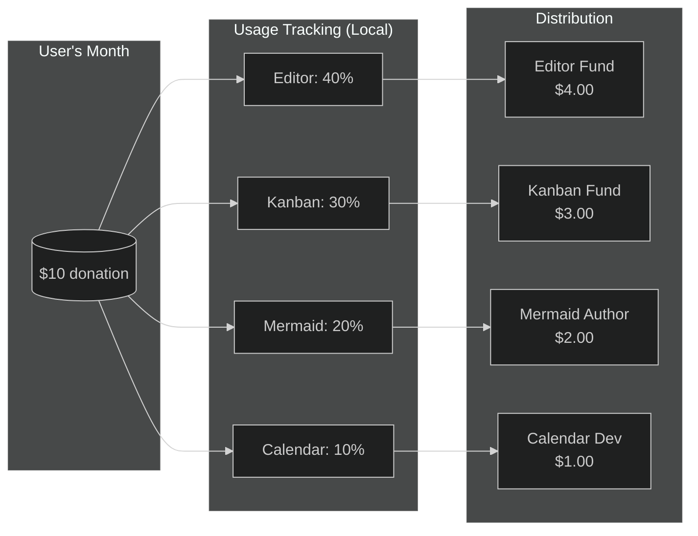
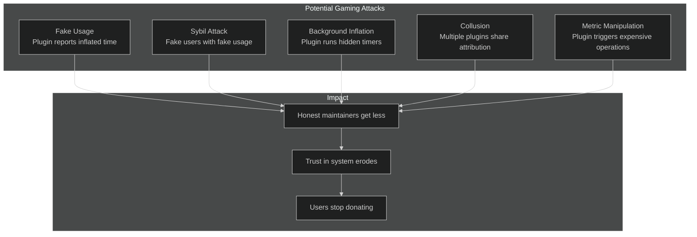
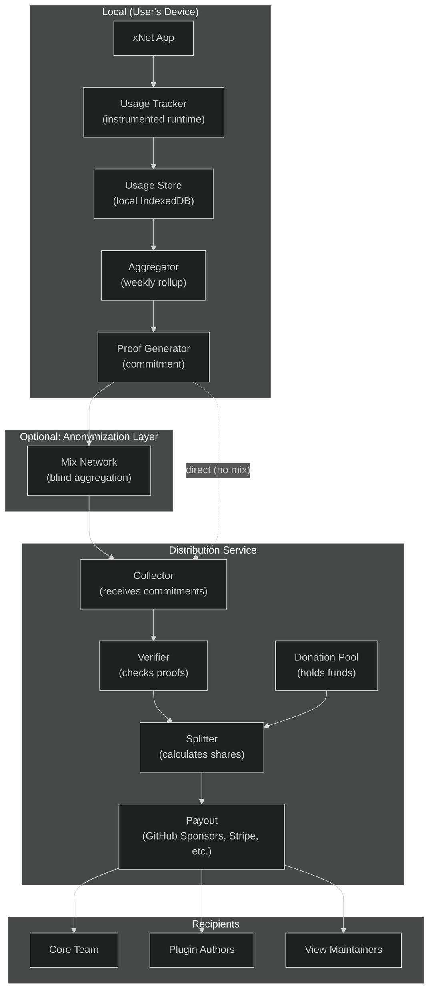
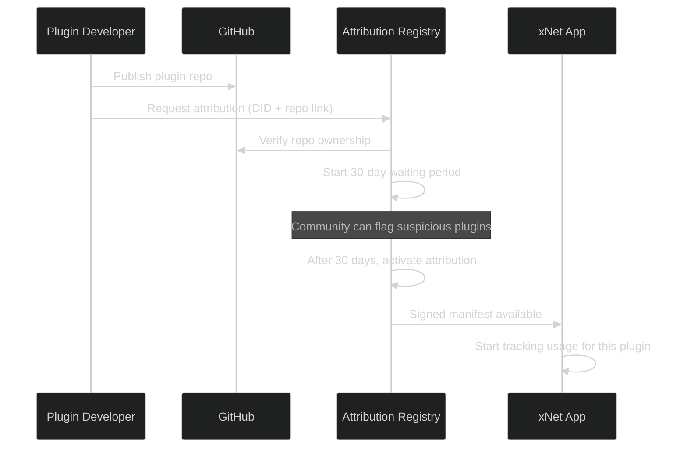
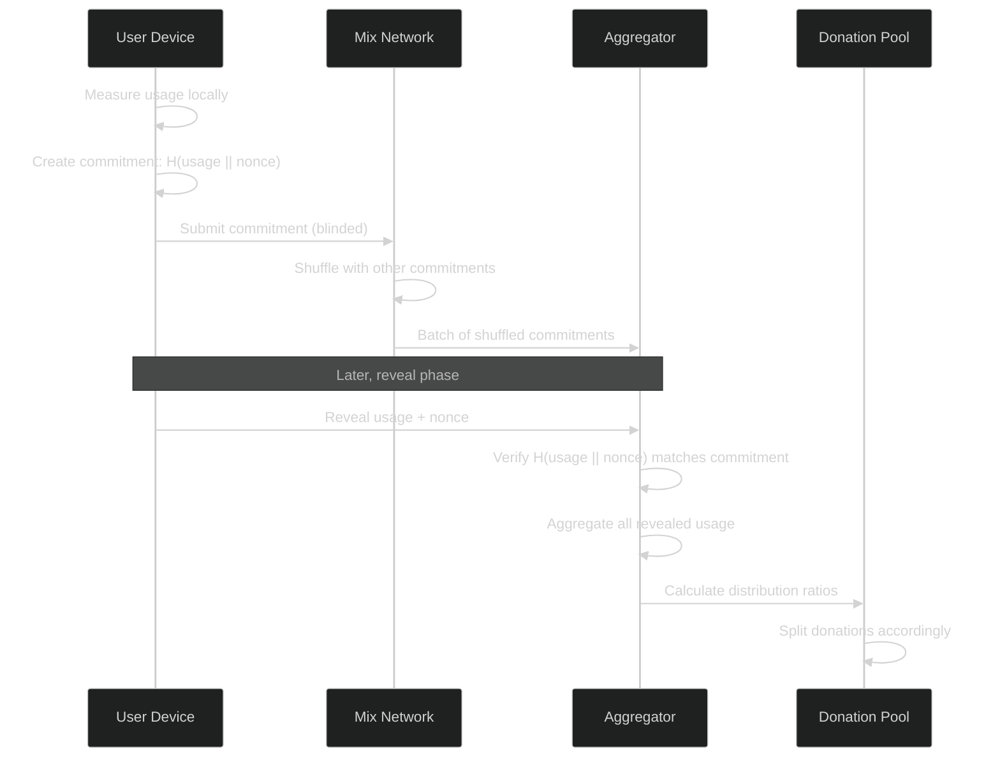
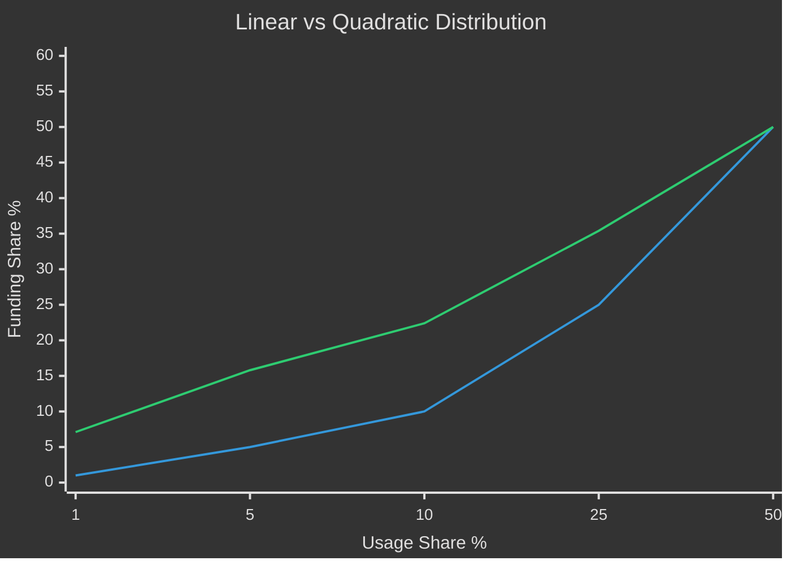
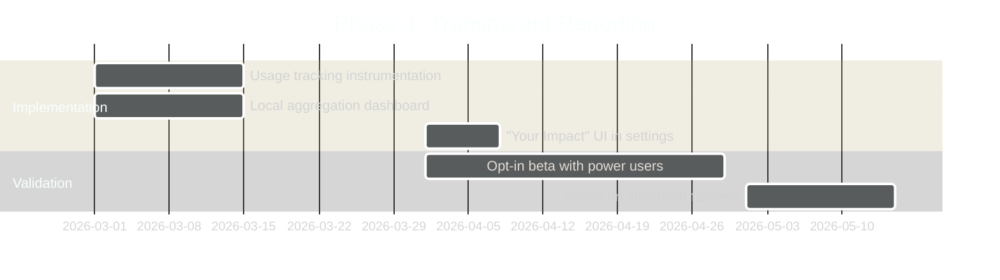
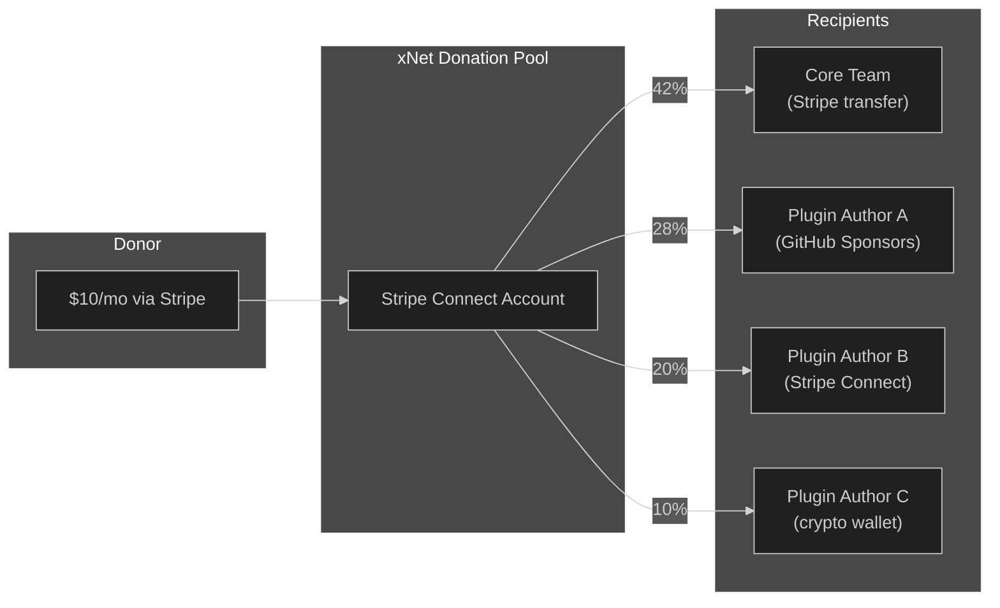

# Exploration 0057: Usage-Based Donation Distribution

> **Status:** Exploration
> **Tags:** business model, sustainability, donations, open source, decentralized, incentives
> **Created:** 2026-02-05
> **Context:** xNet is a decentralized, local-first productivity platform. Traditional monetization (subscriptions, ads, data-selling) conflicts with its values. This exploration investigates a model where users donate what they can, and those donations automatically flow to the maintainers of the tools they actually use — proportional to usage.

---

## The Vision

You donate $10/month. You don't pick who gets it. xNet observes that you spend 40% of your time in the editor, 30% using the Kanban view, 20% with Mermaid diagrams, and 10% with a community calendar plugin. Your donation automatically splits:

- $4.00 → Editor maintainers
- $3.00 → Kanban view maintainers
- $2.00 → Mermaid extension author
- $1.00 → Calendar plugin developer

No thought required. No guilt about which projects to support. The money flows to what you actually use.



---

## Why This Is Hard

### The Core Tension

| Requirement                | Challenge                                         |
| -------------------------- | ------------------------------------------------- |
| **Track usage accurately** | Must work offline, locally, without phoning home  |
| **Prevent gaming**         | Malicious plugins could inflate their own metrics |
| **Decentralized**          | No central authority to validate claims           |
| **Privacy-preserving**     | Users shouldn't have to reveal what they do       |
| **Simple UX**              | Users just want to donate, not manage allocations |
| **Fair to small projects** | Can't let popular projects dominate forever       |

### Attack Vectors



---

## Prior Art

### Existing Models

| System              | How It Works                     | Pros                       | Cons                                 |
| ------------------- | -------------------------------- | -------------------------- | ------------------------------------ |
| **GitHub Sponsors** | Direct sponsorship per project   | Simple, transparent        | User must choose recipients manually |
| **Open Collective** | Fiscal host, project-based       | Transparent budgets        | No usage tracking                    |
| **Brave Rewards**   | Attention-based BAT distribution | Privacy-preserving         | Requires cryptocurrency              |
| **Flattr**          | Auto-distribute to visited sites | Closest to our vision      | Failed commercially, gaming concerns |
| **thanks.dev**      | Dependency tree analysis         | Automated for npm/pip deps | Build-time only, not runtime usage   |
| **StackAid**        | Dependency-weighted distribution | Objective (package.json)   | Misses runtime usage patterns        |
| **tea.xyz**         | Blockchain-based OSS incentives  | Decentralized              | Complexity, environmental concerns   |

### Lessons from Flattr's Failure

Flattr (2010-2021) tried exactly this for web content:

1. Users set monthly budget
2. Flattr button on content counted as "engagement"
3. Monthly budget split across engaged content

**Why it failed:**

- Publishers could place invisible Flattr buttons
- No way to verify "real" engagement vs automated clicks
- Users didn't trust the system
- Eventually sold to Eyeo (AdBlock Plus) and pivoted

**Our advantage:** xNet controls the runtime. We can instrument usage at a level Flattr couldn't.

---

## Proposed Architecture

### Design Principles

1. **Usage tracking is local and auditable** — users can see exactly what's measured
2. **Aggregation is privacy-preserving** — only totals leave the device
3. **Attribution is deterministic** — same inputs = same outputs, verifiable
4. **Core gets a floor** — prevents core maintainers from starving
5. **Gaming has economic cost** — attacks must cost more than they gain

### System Overview



### What Gets Tracked

| Metric                  | Description                                                | Why It's Fair                              |
| ----------------------- | ---------------------------------------------------------- | ------------------------------------------ |
| **Active time in view** | Seconds a view (Editor, Kanban, Calendar, etc.) is focused | Measures actual use, not just installation |
| **Block render count**  | How often a block type (Mermaid, Embed, etc.) renders      | Captures value from content blocks         |
| **Command invocations** | When user triggers a plugin command                        | Explicit user action                       |
| **Schema operations**   | CRUD on plugin-defined schemas                             | Measures data utility                      |

**What's NOT tracked:**

- Content of documents (privacy)
- Specific nodes/pages (privacy)
- Network activity (irrelevant)
- Passive loading (too gameable)

### Attribution Model

Every trackable component has an **attribution manifest**:

```typescript
interface AttributionManifest {
  // Who gets credit for this component
  id: string // e.g., "xnet:views:kanban"
  maintainers: Maintainer[] // DIDs or verified identities

  // How credit is calculated
  weight: number // Base weight (1.0 = normal)
  trackingMethods: TrackingMethod[]

  // Trust chain
  signature: string // Signed by xNet registry or author
  registeredAt: number // Timestamp of registration
}

interface Maintainer {
  did: string // Decentralized identifier
  payoutMethod: PayoutMethod // How they receive funds
  share: number // Their share of this component's attribution (0-1)
}
```

---

## Anti-Gaming Mechanisms

### 1. Signed Attribution Registry

Only components signed by the xNet registry (for core) or verified plugin authors can receive attribution. The registry requires:

- GitHub account linked to DID
- Plugin published to marketplace
- Waiting period before attribution starts (30 days)



### 2. Rate Limiting and Anomaly Detection

The local tracker enforces sanity limits:

```typescript
const SANITY_LIMITS = {
  maxActiveSecondsPerDay: 16 * 60 * 60, // 16 hours max
  maxViewSwitchesPerMinute: 30, // Prevent rapid switching
  maxBlockRendersPerSecond: 10, // Prevent render spam
  minFocusDuration: 3_000 // 3s minimum to count
}
```

The aggregator flags anomalies:

- Usage patterns that don't match human behavior
- Sudden spikes in previously unused components
- Usage during times the app was backgrounded

### 3. Commitment Scheme (Privacy-Preserving Aggregation)

Users don't submit raw usage data. They submit **commitments** — cryptographic proofs that their usage was measured correctly without revealing the actual numbers until aggregation.



### 4. Economic Stake

Plugin authors must stake to receive attribution:

| Plugin Tier    | Required Stake          | Attribution Cap/Month |
| -------------- | ----------------------- | --------------------- |
| New (<30 days) | $0 (no attribution yet) | $0                    |
| Community      | $50                     | $500                  |
| Verified       | $200                    | $5,000                |
| Core           | N/A (xNet team)         | Unlimited             |

If a plugin is found gaming, its stake is slashed. This makes attacks economically irrational for honest-looking returns.

### 5. Quadratic Distribution

Instead of linear distribution, use quadratic funding principles:

```
effective_share = sqrt(raw_usage_share) / sum(sqrt(all_usage_shares))
```

This prevents popular plugins from dominating and gives smaller plugins a better chance. A plugin with 1% usage doesn't get 1% of funds — it gets proportionally more compared to a plugin with 25% usage.



---

## Implementation Phases

### Phase 1: Transparent Reporting (No Money)

**Goal:** Build trust by showing users what _would_ be distributed.



Users see:

> "This month, if you donated $10, here's where it would go:"
>
> - xNet Core: $4.20
> - Kanban View: $2.80
> - Mermaid Diagrams: $1.50
> - Calendar Plugin by @alice: $1.00
> - Other: $0.50

No actual money moves. Pure transparency. Collect feedback on whether the attribution "feels right."

### Phase 2: Core-Only Donations

**Goal:** Validate the donation flow with a simple case.

Users can donate to "xNet" as a whole. All funds go to the core team. Usage tracking continues, but distribution is informational only.

This validates:

- Payment integration (Stripe, GitHub Sponsors, crypto)
- Donor management and receipts
- Legal/tax structure

### Phase 3: Full Distribution

**Goal:** Actually split donations based on usage.



Requires:

- Attribution registry with verified maintainers
- Payout method registration for plugin authors
- Monthly distribution calculation and execution
- Transparency reports (public, anonymized aggregate data)

---

## Alternative Approaches Considered

### 1. Dependency-Based Distribution (like thanks.dev)

**How it works:** Analyze `package.json` dependencies, weight by dependency depth, distribute accordingly.

**Pros:**

- Objective (code doesn't lie)
- Already proven (StackAid, thanks.dev)
- No runtime instrumentation needed

**Cons:**

- Doesn't capture runtime value — a dependency used once gets same credit as one used constantly
- Misses plugins entirely (they're not npm dependencies)
- xNet's value is in usage patterns, not build dependencies

**Verdict:** Could complement runtime tracking for core infrastructure packages.

### 2. User-Allocated Voting

**How it works:** Users explicitly allocate percentages to projects they want to support.

**Pros:**

- User agency
- Simple to implement
- No gaming concerns

**Cons:**

- Defeats the "zero thought" goal
- Popular projects get mindshare, not usage
- Users don't know what they actually use

**Verdict:** Offer as optional override, not the default.

### 3. Blockchain-Based Tracking

**How it works:** All usage events written to a blockchain, transparent and immutable.

**Pros:**

- Fully decentralized verification
- Tamper-proof audit trail

**Cons:**

- Privacy nightmare (all usage public)
- Gas costs for frequent events
- Complexity explosion
- Environmental concerns

**Verdict:** Overkill. Local tracking with commitments achieves decentralization without blockchain.

### 4. Reputation-Weighted Distribution

**How it works:** Weight attribution by project reputation (GitHub stars, downloads, age).

**Pros:**

- Rewards established projects
- Community signal

**Cons:**

- New projects starve
- Stars can be bought
- Doesn't reflect actual value to users

**Verdict:** Use as tie-breaker, not primary signal.

---

## Open Questions

1. **Minimum viable attribution granularity?**
   - Per-package? Per-view? Per-command? Per-block-type?
   - Finer granularity = more accurate, but more complexity

2. **How to handle shared maintainership?**
   - Core views have multiple contributors
   - Git blame? Manual declaration? DAO voting?

3. **What about indirect contributions?**
   - Docs writers, issue triagers, community moderators
   - Should non-code contributions get attribution?

4. **Privacy vs accountability trade-off?**
   - Full anonymity prevents auditing
   - Full transparency kills privacy
   - Where's the right balance?

5. **International payments?**
   - Stripe doesn't work everywhere
   - Crypto volatility concerns
   - Which platforms to support?

6. **Tax implications?**
   - Donations vs payments for services
   - 501(c)(3) vs for-profit
   - Per-jurisdiction complexity

---

## Recommended Next Steps

1. **Instrument usage tracking** — Add telemetry hooks to views, plugins, and blocks. Store locally only. No network calls.

2. **Build the "Your Impact" dashboard** — Show users what their hypothetical $10 would fund. Get feedback.

3. **Design the attribution manifest format** — Define how components declare maintainers and payout methods.

4. **Research payment rails** — Stripe Connect, GitHub Sponsors API, Open Collective API, cryptocurrency options.

5. **Legal consultation** — Tax implications, donation vs payment classification, international considerations.

6. **Pilot with core team only** — Accept donations, distribute manually based on tracked usage, validate the model.

---

## Success Metrics

| Metric                      | Target                     | Why It Matters                                         |
| --------------------------- | -------------------------- | ------------------------------------------------------ |
| Donation conversion rate    | 2% of active users         | Sustainable if even a small fraction donates           |
| Average donation            | $5-10/month                | Comparable to Spotify/Netflix suggests perceived value |
| Attribution accuracy        | >90% user agreement        | If users say "that's not what I use," model is broken  |
| Plugin author participation | 50% of marketplace plugins | Authors must opt in for ecosystem health               |
| Gaming incidents            | <1% of donations           | System must resist abuse                               |
| Time to first payout        | <60 days                   | Authors need to see real money to trust the system     |

---

## Conclusion

Usage-based donation distribution is technically feasible and philosophically aligned with xNet's values. The key challenges are:

1. **Preventing gaming** without sacrificing privacy or decentralization
2. **Building trust** through transparency and gradual rollout
3. **Payment logistics** for a global, diverse maintainer base

The phased approach — transparent reporting → core donations → full distribution — allows validation at each step without betting the entire system on untested assumptions.

If successful, this could become a model for sustainable open-source funding beyond xNet: **"Use what you love, and your support automatically flows to those who build it."**
