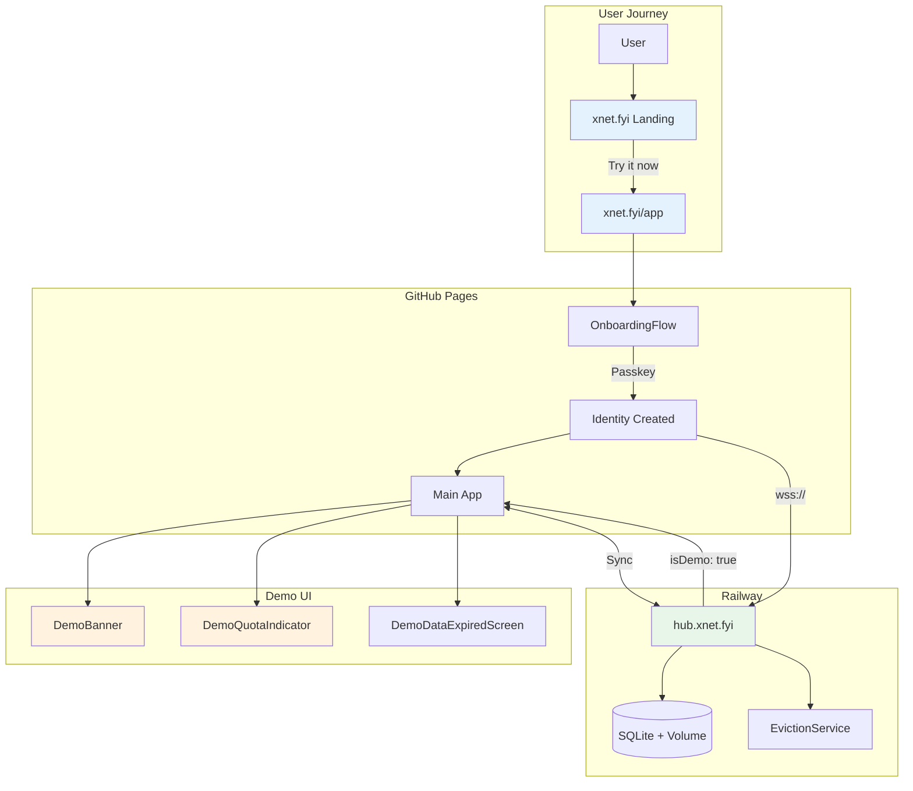
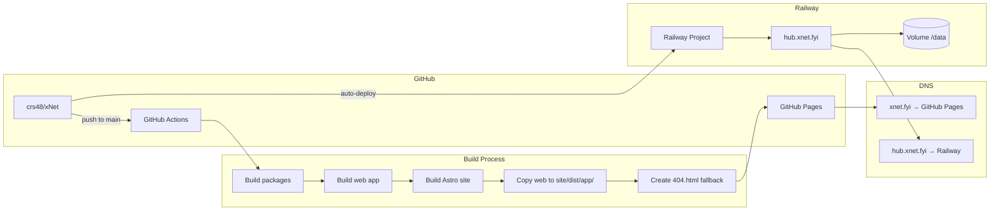
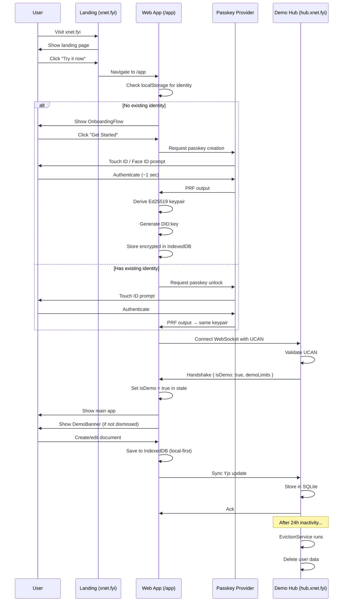

# 0058: Demo App Live Deployment

> Getting xnet.fyi/app live with full demo mode experience

**Status:** In Progress
**Created:** 2026-02-05
**Dependencies:**

- Exploration 0051 (Demo Hub on Railway)
- Exploration 0056 (Web App Integration)
- Plan 07-demo-hub.md

## Problem Statement

Users visiting xnet.fyi see "Try it now" but clicking it leads to a 404. The web app exists (`apps/web/`), the deployment workflow exists, but the full demo experience isn't wired up:

1. **No live deployment verification** — Need to confirm `/app` actually deploys
2. **No demo mode detection** — App doesn't know it's on demo hub
3. **No demo UI** — Missing banners, quota indicators, expiration warnings
4. **No hub connection** — `hub.xnet.fyi` isn't deployed to Railway yet

## Current State

### What's Working

| Component              | Status | Evidence                                         |
| ---------------------- | ------ | ------------------------------------------------ |
| Vite base path         | Done   | `apps/web/vite.config.ts:4` — `base: '/app/'`    |
| Router basepath        | Done   | `apps/web/src/App.tsx:27` — `basepath: '/app'`   |
| PWA manifest scope     | Done   | `apps/web/vite.config.ts:13` — `scope: '/app/'`  |
| Deploy workflow        | Done   | `.github/workflows/deploy-site.yml:58-63`        |
| SPA fallback           | Done   | 404.html copied in workflow                      |
| CNAME                  | Done   | `site/public/CNAME` — `xnet.fyi`                 |
| Landing CTA            | Done   | `site/src/components/sections/Hero.astro:36`     |
| Onboarding flow        | Done   | `packages/react/src/onboarding/`                 |
| Hub URL default        | Done   | `apps/web/src/App.tsx:46` — `wss://hub.xnet.fyi` |
| `isDemo` context       | Done   | `packages/react/src/onboarding/machine.ts:52`    |
| BundledPluginInstaller | Done   | Mermaid plugin works                             |
| Network settings       | Done   | Hub URL configurable in settings                 |

### What's Missing

| Component              | Status  | Location                         |
| ---------------------- | ------- | -------------------------------- |
| Demo hub deployed      | Missing | Railway not configured           |
| Hub handshake `isDemo` | Missing | `packages/hub/src/services/`     |
| DemoBanner component   | Missing | `packages/react/src/components/` |
| DemoQuotaIndicator     | Missing | `packages/react/src/components/` |
| DemoDataExpiredScreen  | Missing | `packages/react/src/components/` |
| Demo mode detection    | Missing | `isDemo` never set to `true`     |
| Demo banner CSS        | Missing | `packages/react/src/styles/`     |
| useDemoMode hook       | Missing | `packages/react/src/hooks/`      |

## Architecture



## Deployment Architecture



## Implementation Plan

### Phase 1: Verify Deployment (Day 1 Morning)

**Goal:** Confirm the web app actually deploys to xnet.fyi/app

#### 1.1 Trigger Deployment

```bash
# Make a trivial change and push to main
git commit --allow-empty -m "chore: trigger deploy"
git push origin main
```

#### 1.2 Verify GitHub Actions

- Check `.github/workflows/deploy-site.yml` runs successfully
- Verify `site/dist/app/` contains web app build
- Verify 404.html exists for SPA fallback

#### 1.3 Test Live URL

```bash
# Should return 200 with web app HTML
curl -I https://xnet.fyi/app

# Should return 200 (SPA fallback)
curl -I https://xnet.fyi/app/doc/test-123

# Check for correct content
curl https://xnet.fyi/app | grep -o '<title>.*</title>'
```

### Phase 2: Deploy Demo Hub to Railway (Day 1 Afternoon)

**Goal:** Get `hub.xnet.fyi` running on Railway

#### 2.1 Move railway.toml to Repo Root

The Dockerfile in `packages/hub/Dockerfile` expects to build from the monorepo root (it copies from multiple `packages/*` directories). Railway needs the config at repo root.

**Why:** The Dockerfile has `COPY` commands like:

```dockerfile
COPY packages/hub/package.json packages/hub/
COPY packages/core/package.json packages/core/
# etc.
```

This only works when Docker's build context is the monorepo root, not `packages/hub/`.

**File created:** `railway.toml` (at repo root)

```toml
# Railway configuration for xNet Demo Hub
#
# This file must be at the repo root because the Dockerfile
# expects to build from monorepo context (copies multiple packages).

[build]
builder = "dockerfile"
dockerfilePath = "packages/hub/Dockerfile"

[deploy]
startCommand = "node packages/hub/dist/cli.js --demo"
healthcheckPath = "/health"
healthcheckTimeout = 10
restartPolicyType = "on_failure"
restartPolicyMaxRetries = 5
```

**Status:** Done - file moved from `packages/hub/railway.toml` to repo root.

#### 2.2 Railway Project Setup (Step-by-Step)

##### Step 1: Create Railway Account & Project

1. Go to [railway.app](https://railway.app)
2. Sign in with GitHub (recommended for auto-deploy)
3. Click **"New Project"** in the dashboard

##### Step 2: Connect GitHub Repository

1. Select **"Deploy from GitHub repo"**
2. If prompted, authorize Railway to access your GitHub
3. Find and select `crs48/xNet` (or your fork)
4. Railway will scan for config files

##### Step 3: Verify Build Settings

Railway should auto-detect from `railway.toml`:

- **Builder:** Dockerfile
- **Dockerfile Path:** `packages/hub/Dockerfile`
- **Root Directory:** `/` (monorepo root) — **important!**

If Railway sets Root Directory to `packages/hub`, change it to `/` in Settings → Build.

##### Step 4: Add Persistent Volume (Critical!)

Without a volume, SQLite data is lost on every deploy.

1. In your service, click **"+ New"** → **"Volume"**
2. Set **Mount Path:** `/data`
3. Railway auto-creates `RAILWAY_VOLUME_MOUNT_PATH=/data` environment variable
4. The hub's config.ts automatically uses this path

##### Step 5: Set Environment Variables

Go to **Variables** tab and add:

| Variable    | Value        | Purpose                       |
| ----------- | ------------ | ----------------------------- |
| `NODE_ENV`  | `production` | Production optimizations      |
| `HUB_MODE`  | `demo`       | Enable demo quotas & eviction |
| `LOG_LEVEL` | `info`       | Logging verbosity             |

**Note:** `PORT` is auto-set by Railway. `HUB_PORT` isn't needed — the hub reads `PORT`.

##### Step 6: Deploy

1. Click **"Deploy"** or push to main branch
2. Watch the build logs for errors
3. Build takes ~3-5 minutes (multi-stage Docker build)

##### Step 7: Verify Deployment

Once deployed, Railway provides a URL like `xnet-hub-production.up.railway.app`.

```bash
# Test the auto-generated URL first
curl https://xnet-hub-production.up.railway.app/health
```

#### 2.3 Custom Domain Setup

##### Step 1: Add Domain in Railway

1. Go to **Settings** → **Networking** → **Public Networking**
2. Click **"Generate Domain"** first (required before custom domains)
3. Click **"+ Custom Domain"**
4. Enter: `hub.xnet.fyi`
5. Railway shows the required DNS records

##### Step 2: Configure DNS

Railway will show something like:

```
Type: CNAME
Name: hub
Value: xnet-hub-production.up.railway.app
```

Add this to your DNS provider (e.g., Cloudflare, Namecheap, Route53):

| Type  | Name | Value                              | TTL  |
| ----- | ---- | ---------------------------------- | ---- |
| CNAME | hub  | xnet-hub-production.up.railway.app | Auto |

##### Step 3: Wait for SSL

Railway auto-provisions SSL via Let's Encrypt. This takes 1-5 minutes after DNS propagates.

##### Step 4: Verify Custom Domain

```bash
# Should work with HTTPS
curl https://hub.xnet.fyi/health

# Check SSL certificate
openssl s_client -connect hub.xnet.fyi:443 -servername hub.xnet.fyi </dev/null 2>/dev/null | openssl x509 -noout -dates
```

#### 2.4 Railway Dashboard Checklist

After setup, verify in Railway dashboard:

- [ ] **Deployments** tab shows successful deploy (green checkmark)
- [ ] **Logs** tab shows `[hub] Server listening on port 4444`
- [ ] **Metrics** tab shows memory/CPU usage
- [ ] **Variables** tab has `NODE_ENV`, `HUB_MODE`, `RAILWAY_VOLUME_MOUNT_PATH`
- [ ] **Volumes** tab shows mounted volume at `/data`
- [ ] **Networking** shows custom domain with valid SSL

#### 2.5 Troubleshooting Railway

**Build fails with "Cannot find module":**

- Ensure Root Directory is `/` not `packages/hub`
- The Dockerfile needs monorepo context

**Container crashes on start:**

- Check Logs tab for error message
- Common: Missing volume mount (SQLite can't write)
- Common: Wrong PORT (should use Railway's auto-assigned PORT)

**Health check fails:**

- Verify the hub is listening on `$PORT` not hardcoded 4444
- Check that `/health` endpoint exists and returns 200

**SSL certificate not provisioning:**

- DNS must be correctly configured first
- Wait up to 10 minutes for propagation
- Try removing and re-adding the custom domain

#### 2.6 Verify Hub

```bash
# Health check
curl https://hub.xnet.fyi/health

# Expected response:
# {
#   "status": "ok",
#   "mode": "demo",
#   "demo": {
#     "quota": 10485760,
#     "evictionTtl": 86400000,
#     "maxDocs": 50
#   },
#   ...
# }
```

### Phase 3: Hub Handshake Demo Info (Day 2)

**Goal:** Hub tells client it's in demo mode on connection

#### 3.1 Update Hub Handshake Response

```typescript
// packages/hub/src/services/connection.ts

interface HandshakeResponse {
  version: string
  hubDid: string
  isDemo: boolean
  demoLimits?: {
    quotaBytes: number
    maxDocs: number
    maxBlobBytes: number
    evictionTtlMs: number
  }
}

// In handleConnection or sendHandshake:
const handshake: HandshakeResponse = {
  version: config.version,
  hubDid: config.hubDid,
  isDemo: !!config.demoOverrides,
  ...(config.demoOverrides && {
    demoLimits: {
      quotaBytes: config.demoOverrides.quota,
      maxDocs: config.demoOverrides.maxDocs,
      maxBlobBytes: config.demoOverrides.maxBlob,
      evictionTtlMs: config.demoOverrides.evictionTtl
    }
  })
}
```

#### 3.2 Update Network Package Types

```typescript
// packages/network/src/types.ts

export interface DemoLimits {
  quotaBytes: number
  maxDocs: number
  maxBlobBytes: number
  evictionTtlMs: number
}

export interface HubHandshake {
  version: string
  hubDid: string
  isDemo: boolean
  demoLimits?: DemoLimits
}
```

#### 3.3 Update SyncManager State

```typescript
// packages/network/src/sync-manager.ts

export interface SyncManagerState {
  // ... existing fields
  isDemo: boolean
  demoLimits?: DemoLimits
}

// In handleHandshake:
private handleHandshake(message: HubHandshake): void {
  if (message.isDemo) {
    this.state.isDemo = true
    this.state.demoLimits = message.demoLimits
    this.emit('demo-mode', message.demoLimits)
  }
}
```

### Phase 4: Demo UI Components (Day 3)

**Goal:** Visual indicators for demo mode

#### 4.1 DemoBanner Component

```typescript
// packages/react/src/components/DemoBanner.tsx

import { useState } from 'react'

export interface DemoBannerProps {
  evictionHours: number
  onDismiss?: () => void
}

export function DemoBanner({ evictionHours, onDismiss }: DemoBannerProps) {
  const [dismissed, setDismissed] = useState(() => {
    if (typeof window === 'undefined') return false
    return localStorage.getItem('xnet:demo-banner-dismissed') === 'true'
  })

  if (dismissed) return null

  const handleDismiss = () => {
    localStorage.setItem('xnet:demo-banner-dismissed', 'true')
    setDismissed(true)
    onDismiss?.()
  }

  return (
    <div className="fixed top-0 left-0 right-0 z-50 flex items-center justify-between px-4 py-2 bg-amber-100 dark:bg-amber-900/50 border-b border-amber-300 dark:border-amber-700 text-amber-900 dark:text-amber-100 text-sm">
      <div className="flex items-center gap-2">
        <span>Demo mode — data expires after {evictionHours}h of inactivity.</span>
        <a
          href="/download"
          className="ml-2 px-2 py-0.5 bg-amber-500 hover:bg-amber-600 text-white rounded text-xs font-medium transition-colors"
        >
          Download desktop app
        </a>
      </div>
      <button
        onClick={handleDismiss}
        className="p-1 hover:bg-amber-200 dark:hover:bg-amber-800 rounded transition-colors"
        aria-label="Dismiss banner"
      >
        <svg className="w-4 h-4" fill="none" stroke="currentColor" viewBox="0 0 24 24">
          <path strokeLinecap="round" strokeLinejoin="round" strokeWidth={2} d="M6 18L18 6M6 6l12 12" />
        </svg>
      </button>
    </div>
  )
}
```

#### 4.2 DemoQuotaIndicator Component

```typescript
// packages/react/src/components/DemoQuotaIndicator.tsx

export interface DemoQuotaIndicatorProps {
  usedBytes: number
  limitBytes: number
}

function formatBytes(bytes: number): string {
  if (bytes < 1024) return `${bytes} B`
  if (bytes < 1024 * 1024) return `${(bytes / 1024).toFixed(1)} KB`
  return `${(bytes / (1024 * 1024)).toFixed(1)} MB`
}

export function DemoQuotaIndicator({ usedBytes, limitBytes }: DemoQuotaIndicatorProps) {
  const percentage = Math.round((usedBytes / limitBytes) * 100)
  const isWarning = percentage >= 80
  const isCritical = percentage >= 95

  return (
    <div className="flex items-center gap-2 text-xs text-muted-foreground">
      <div className="w-16 h-1.5 bg-border rounded-full overflow-hidden">
        <div
          className={`h-full transition-all ${
            isCritical ? 'bg-red-500' : isWarning ? 'bg-amber-500' : 'bg-primary'
          }`}
          style={{ width: `${Math.min(percentage, 100)}%` }}
        />
      </div>
      <span className={isCritical ? 'text-red-500' : isWarning ? 'text-amber-500' : ''}>
        {formatBytes(usedBytes)} / {formatBytes(limitBytes)}
      </span>
    </div>
  )
}
```

#### 4.3 DemoDataExpiredScreen Component

```typescript
// packages/react/src/components/DemoDataExpiredScreen.tsx

export function DemoDataExpiredScreen() {
  return (
    <div className="flex flex-col items-center justify-center min-h-screen p-6 text-center">
      <div className="text-6xl mb-6">🕐</div>
      <h1 className="text-2xl font-bold mb-3">Your demo data has expired</h1>
      <p className="text-muted-foreground max-w-md mb-6">
        Demo data is automatically removed after 24 hours of inactivity to keep the demo hub clean.
      </p>
      <div className="flex gap-3">
        <button
          onClick={() => window.location.reload()}
          className="px-4 py-2 bg-primary text-primary-foreground rounded-md hover:bg-primary/90 transition-colors"
        >
          Start Fresh
        </button>
        <a
          href="/download"
          className="px-4 py-2 border border-border rounded-md hover:bg-accent transition-colors"
        >
          Download Desktop App
        </a>
      </div>
      <p className="mt-8 text-sm text-muted-foreground">
        The desktop app stores data permanently on your device.
      </p>
    </div>
  )
}
```

#### 4.4 useDemoMode Hook

```typescript
// packages/react/src/hooks/useDemoMode.ts

import { useState, useEffect } from 'react'
import { useXNet } from '../context'

export interface DemoLimits {
  quotaBytes: number
  maxDocs: number
  evictionHours: number
}

export interface DemoModeState {
  isDemo: boolean
  limits?: DemoLimits
  usage?: {
    usedBytes: number
    docCount: number
  }
}

export function useDemoMode(): DemoModeState {
  const { syncManager } = useXNet()
  const [state, setState] = useState<DemoModeState>({ isDemo: false })

  useEffect(() => {
    if (!syncManager) return

    const handleDemoMode = (limits: {
      quotaBytes: number
      maxDocs: number
      evictionTtlMs: number
    }) => {
      setState({
        isDemo: true,
        limits: {
          quotaBytes: limits.quotaBytes,
          maxDocs: limits.maxDocs,
          evictionHours: Math.round(limits.evictionTtlMs / 3600000)
        }
      })
    }

    syncManager.on('demo-mode', handleDemoMode)

    // Check if already connected in demo mode
    const currentState = syncManager.getState?.()
    if (currentState?.isDemo && currentState?.demoLimits) {
      handleDemoMode(currentState.demoLimits)
    }

    return () => {
      syncManager.off('demo-mode', handleDemoMode)
    }
  }, [syncManager])

  return state
}
```

### Phase 5: Wire Demo Components into Web App (Day 4)

**Goal:** Integrate demo UI into the web app

#### 5.1 Export Components from @xnet/react

```typescript
// packages/react/src/index.ts (additions)

export { DemoBanner } from './components/DemoBanner'
export type { DemoBannerProps } from './components/DemoBanner'

export { DemoQuotaIndicator } from './components/DemoQuotaIndicator'
export type { DemoQuotaIndicatorProps } from './components/DemoQuotaIndicator'

export { DemoDataExpiredScreen } from './components/DemoDataExpiredScreen'

export { useDemoMode } from './hooks/useDemoMode'
export type { DemoModeState, DemoLimits } from './hooks/useDemoMode'
```

#### 5.2 Update Root Layout

```typescript
// apps/web/src/routes/__root.tsx (additions)

import { DemoBanner } from '@xnet/react'
import { useDemoMode } from '@xnet/react'

// Inside RootLayout component:
const { isDemo, limits } = useDemoMode()

// In render, before other content:
{isDemo && limits && (
  <DemoBanner evictionHours={limits.evictionHours} />
)}

// Add padding-top to main content when banner is shown:
<main className={isDemo ? 'pt-10' : ''}>
```

#### 5.3 Update Sidebar/Header for Quota (Optional)

```typescript
// apps/web/src/components/Sidebar.tsx (additions)

import { DemoQuotaIndicator, useDemoMode } from '@xnet/react'

// In sidebar footer:
const { isDemo, limits, usage } = useDemoMode()

{isDemo && usage && limits && (
  <div className="p-3 border-t border-border">
    <DemoQuotaIndicator
      usedBytes={usage.usedBytes}
      limitBytes={limits.quotaBytes}
    />
  </div>
)}
```

### Phase 6: Testing & Validation (Day 5)

#### 6.1 Manual Testing Checklist

**Landing Page:**

- [ ] Visit `xnet.fyi` — landing page loads
- [ ] Click "Try it now" — navigates to `/app`
- [ ] Direct visit to `xnet.fyi/app` — app loads
- [ ] Deep link `xnet.fyi/app/doc/test` — app loads (SPA fallback works)

**Onboarding:**

- [ ] Passkey prompt appears (Touch ID / Face ID / Windows Hello)
- [ ] After auth, main app loads
- [ ] Identity persists on page reload
- [ ] Same passkey on different device works

**Demo Mode:**

- [ ] DemoBanner appears at top of screen
- [ ] Banner shows "24h inactivity" message
- [ ] "Download desktop app" link works
- [ ] Dismiss button hides banner
- [ ] Banner stays dismissed after reload
- [ ] Clear localStorage → banner reappears

**Hub Connection:**

- [ ] DevTools → Network → WebSocket connected to `wss://hub.xnet.fyi`
- [ ] Create a document — syncs to hub
- [ ] Open second browser tab — document appears
- [ ] Refresh — document persists

**Error States:**

- [ ] Hub offline → app still works (offline mode)
- [ ] OfflineIndicator shows when disconnected
- [ ] Reconnects automatically when hub comes back

#### 6.2 Curl Tests

```bash
# Landing page
curl -I https://xnet.fyi
# Expected: 200 OK

# Web app
curl -I https://xnet.fyi/app
# Expected: 200 OK

# SPA fallback
curl -I https://xnet.fyi/app/doc/test-123
# Expected: 200 OK (not 404)

# Hub health
curl https://hub.xnet.fyi/health
# Expected: { "status": "ok", "mode": "demo", ... }

# Hub WebSocket (test connection)
wscat -c wss://hub.xnet.fyi
# Expected: Connection opens
```

#### 6.3 Browser Console Checks

Open DevTools Console and verify:

- [ ] No unhandled promise rejections
- [ ] No React errors/warnings
- [ ] WebSocket connection established
- [ ] `[xnet:sync]` logs show connection (if debug enabled)

## Sequence Diagram: Full User Flow



## Implementation Checklist

### Infrastructure

- [x] Move `packages/hub/railway.toml` to repo root
- [x] Update `dockerfilePath` to `packages/hub/Dockerfile`
- [x] Create Railway project from GitHub repo
- [x] Add persistent volume at `/data`
- [x] Set environment variables:
  - [x] `NODE_ENV=production`
  - [x] `HUB_MODE=demo`
  - [x] `LOG_LEVEL=info`
- [x] Add custom domain `hub.xnet.fyi`
- [x] Configure DNS CNAME record
- [x] Verify `/health` returns `mode: "demo"`
- [x] Verify WebSocket connections work (requires UCAN auth)

### Hub Changes

- [x] Add `isDemo` to handshake response
- [x] Add `demoLimits` to handshake response
- [x] Export `DemoLimits` type from `@xnet/network`
- [x] Update SyncManager to emit `demo-mode` event (via connection.onMessage)
- [x] Test handshake with demo mode enabled (signaling tests pass)

### React Package Changes

- [x] Create `DemoBanner.tsx` component
- [x] Create `DemoQuotaIndicator.tsx` component
- [x] Create `DemoDataExpiredScreen.tsx` component
- [x] Create `useDemoMode.ts` hook
- [x] Export all demo components from index.ts
- [x] Add TypeScript types for demo state

### Web App Changes

- [x] Import and wire `DemoBanner` in `__root.tsx`
- [x] Add top padding when banner is shown
- [ ] Optionally add `DemoQuotaIndicator` to sidebar
- [ ] Test banner dismiss persistence

### Deployment Verification

- [ ] Push changes to main branch
- [ ] Verify GitHub Actions workflow succeeds
- [ ] Verify `xnet.fyi/app` loads correctly
- [ ] Verify `xnet.fyi/app/doc/xyz` loads (SPA fallback)
- [ ] Verify passkey auth completes
- [ ] Verify WebSocket connects to `hub.xnet.fyi`
- [ ] Verify DemoBanner appears for new users
- [ ] Verify data syncs across browser tabs

### Documentation

- [ ] Update main README with demo link
- [ ] Add demo mode section to docs
- [ ] Document demo limitations (10MB, 50 docs, 24h TTL)
- [ ] Add troubleshooting guide for common issues

## Timeline

| Phase                       | Duration | Deliverable                    |
| --------------------------- | -------- | ------------------------------ |
| Phase 1: Verify Deployment  | 0.5 day  | Confirm /app deploys           |
| Phase 2: Deploy Demo Hub    | 1 day    | hub.xnet.fyi live              |
| Phase 3: Hub Handshake      | 0.5 day  | isDemo in handshake response   |
| Phase 4: Demo UI Components | 1 day    | Banner, quota, expired screens |
| Phase 5: Wire into App      | 0.5 day  | Components integrated          |
| Phase 6: Testing            | 0.5 day  | Full validation                |

**Total: ~4 days**

## Risks & Mitigations

| Risk                          | Impact | Mitigation                                                  |
| ----------------------------- | ------ | ----------------------------------------------------------- |
| Railway deployment fails      | High   | Test Dockerfile locally first; have Fly.io as backup        |
| Passkey not supported         | Medium | Clear error message; link to browser requirements           |
| Hub connection fails          | Medium | App works offline; show "offline" indicator                 |
| Demo banner too annoying      | Low    | Dismissible with localStorage persistence                   |
| Users confused by eviction    | Medium | Clear messaging in banner + DemoDataExpiredScreen           |
| GitHub Pages caching issues   | Low    | Service worker handles updates; add cache-busting if needed |
| WebSocket blocked by firewall | Medium | Document that WSS on port 443 is required                   |

## Cost Analysis

| Service      | Cost       | Notes                                 |
| ------------ | ---------- | ------------------------------------- |
| GitHub Pages | Free       | Static hosting for site + web app     |
| Railway      | ~$0/mo     | Hobby plan $5 credit covers small hub |
| Domain       | ~$12/yr    | xnet.fyi (already owned)              |
| **Total**    | **~$1/mo** | Essentially free for demo usage       |

## Success Criteria

1. **User can try xNet in < 10 seconds** — Visit → Touch ID → Using app
2. **Demo mode is clearly indicated** — Banner explains limitations
3. **Data syncs across tabs/devices** — Real-time collaboration works
4. **Offline mode works** — App usable without hub connection
5. **Eviction is graceful** — Clear screen when data expires
6. **No errors in console** — Clean user experience

## References

- [Exploration 0051: Demo Hub on Railway](./0051_DEMO_HUB_ON_RAILWAY.md)
- [Exploration 0056: Web App Integration](./0056_WEB_APP_INTEGRATION.md)
- [Plan: 07-demo-hub.md](../planStep03_9_1OnboardingAndPolish/07-demo-hub.md)
- [Plan: 11-final-polish.md](../planStep03_9_1OnboardingAndPolish/11-final-polish.md)
- [Railway Docs](https://docs.railway.app/)
- [GitHub Pages Docs](https://docs.github.com/en/pages)
