# 0059 - Version Compatibility in Distributed Sync

> **Status:** Exploration
> **Tags:** sync, versioning, CRDT, federation, schema evolution, protocol, compatibility
> **Created:** 2026-02-05
> **Context:** xNet is a local-first, peer-to-peer collaborative platform. When peers run different versions of xNet packages, they may have different schemas, plugins, property types, and sync protocol behaviors. This exploration analyzes the potential issues and proposes solutions based on how other collaborative and decentralized systems handle version compatibility.

## Executive Summary

Version mismatches between peers in a distributed system can cause:

1. **Silent data corruption** - Newer fields ignored or misinterpreted
2. **Sync failures** - Protocol incompatibilities breaking connections
3. **Schema conflicts** - Different property definitions causing validation errors
4. **Plugin inconsistencies** - Features available to some peers but not others
5. **Divergent document states** - Different CRDT behaviors producing different results

xNet currently has **no protocol versioning** in its sync layer. This is a critical gap that must be addressed before broader adoption.

---

## Current State Analysis

### What xNet Has Today

| Component       | Version Field             | Enforced? | Notes                                 |
| --------------- | ------------------------- | --------- | ------------------------------------- |
| `Change<T>`     | None                      | -         | Core sync primitive has no version    |
| `SyncProvider`  | None                      | -         | No version negotiation on connect     |
| Hub Handshake   | `version: string`         | No        | Returns `'0.0.1'`, unused             |
| Plugin Manifest | `version` + `xnetVersion` | No        | `xnetVersion` not checked             |
| Schema          | None in sync              | -         | Hub has `version INTEGER`, not synced |
| Yjs Updates     | None                      | -         | Binary format, version-agnostic       |

### The Change<T> Interface (packages/sync/src/change.ts:26-74)

```typescript
export interface Change<T = unknown> {
  id: string // Unique change ID
  type: string // e.g., 'yjs-update', 'node-change'
  payload: T // The actual change data
  hash: ContentId // BLAKE3 hash
  parentHash: ContentId | null // Chain linkage
  authorDID: DID // Author's identifier
  signature: Uint8Array // Ed25519 signature
  wallTime: number // Wall clock
  lamport: LamportTimestamp // Logical ordering
  // ... batch fields
}
```

**Critical observation:** No `protocolVersion` or `schemaVersion` field exists.

### Hub Handshake (packages/network/src/types.ts:66-72)

```typescript
export interface HubHandshake {
  type: 'handshake'
  version: string // Currently hardcoded '0.0.1'
  hubDid?: string
  isDemo: boolean
  demoLimits?: DemoLimits
}
```

The version field exists but is not used for any compatibility checks.

### Only Backward Compatibility Code Found

```typescript
// packages/sync/src/yjs-envelope.ts:137-145
export function isLegacyUpdate(msg: unknown): msg is { data: Uint8Array } {
  return (
    typeof msg === 'object' &&
    msg !== null &&
    'data' in msg &&
    (msg as Record<string, unknown>).data instanceof Uint8Array &&
    !('envelope' in msg)
  )
}
```

This detects unsigned Yjs updates from older clients - the only version handling in the codebase.

---

## Potential Issues by Category

### 1. Protocol-Level Incompatibilities

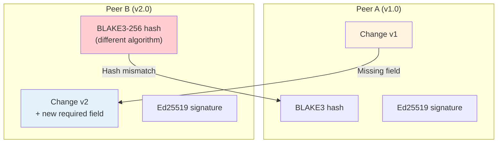
```mermaid
flowchart TB
    subgraph "Peer A (v1.0)"
        A_CHANGE["Change<T> v1"]
        A_HASH["BLAKE3 hash"]
        A_SIG["Ed25519 signature"]
    end

    subgraph "Peer B (v2.0)"
        B_CHANGE["Change<T> v2
        + new required field"]
        B_HASH["BLAKE3-256 hash
        (different algorithm)"]
        B_SIG["Ed25519 signature"]
    end

    A_CHANGE -->|"Missing field"| B_CHANGE
    B_HASH -->|"Hash mismatch"| A_HASH

    style A_CHANGE fill:#fff3e0
    style B_CHANGE fill:#e3f2fd
    style B_HASH fill:#ffcdd2
```

**Specific risks:**

| Change Type                         | Impact                                    | Severity |
| ----------------------------------- | ----------------------------------------- | -------- |
| Add required field to `Change<T>`   | Old clients can't parse new changes       | Critical |
| Change hash algorithm               | All existing hashes invalid, chains break | Critical |
| Change signature scheme             | All existing signatures invalid           | Critical |
| Modify `LamportTimestamp` format    | Ordering breaks, LWW conflicts            | Critical |
| Add optional field to `Change<T>`   | Old clients ignore it (usually safe)      | Low      |
| Change `NodePayload` structure      | Property updates may fail                 | High     |
| Change `YjsUpdatePayload` structure | Rich text sync breaks                     | High     |

### 2. Schema Evolution Conflicts

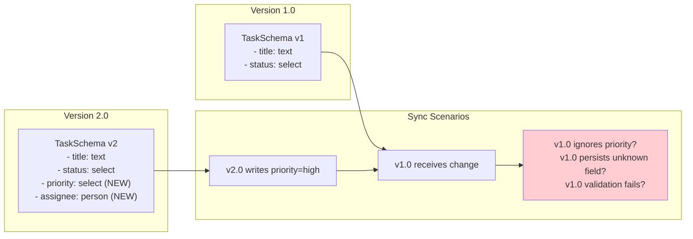
```mermaid
flowchart LR
    subgraph "Version 1.0"
        S1["TaskSchema v1
        - title: text
        - status: select"]
    end

    subgraph "Version 2.0"
        S2["TaskSchema v2
        - title: text
        - status: select
        - priority: select (NEW)
        - assignee: person (NEW)"]
    end

    subgraph "Sync Scenarios"
        WRITE["v2.0 writes priority=high"]
        READ["v1.0 receives change"]
        RESULT["v1.0 ignores priority?
        v1.0 persists unknown field?
        v1.0 validation fails?"]
    end

    S1 --> READ
    S2 --> WRITE
    WRITE --> READ
    READ --> RESULT

    style RESULT fill:#ffcdd2
```

**Schema change types and risks:**

| Schema Change                 | Forward Compatible?   | Backward Compatible? | Risk     |
| ----------------------------- | --------------------- | -------------------- | -------- |
| Add optional property         | Yes                   | Yes (ignored)        | Low      |
| Add required property         | No (validation fails) | Yes (ignored)        | High     |
| Remove property               | Yes (ignored)         | No (data loss)       | High     |
| Change property type          | No                    | No                   | Critical |
| Rename property               | No                    | No                   | Critical |
| Change select options         | Partial               | Partial              | Medium   |
| Change relation target schema | No                    | No                   | High     |

### 3. Plugin System Incompatibilities

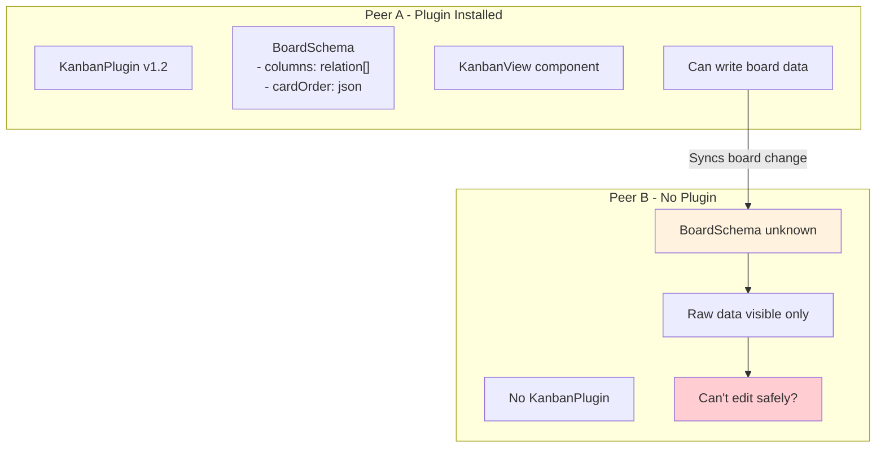
```mermaid
flowchart TB
    subgraph "Peer A - Plugin Installed"
        PA_PLUGIN["KanbanPlugin v1.2"]
        PA_SCHEMA["BoardSchema
        - columns: relation[]
        - cardOrder: json"]
        PA_VIEW["KanbanView component"]
        PA_WRITE["Can write board data"]
    end

    subgraph "Peer B - No Plugin"
        PB_NO_PLUGIN["No KanbanPlugin"]
        PB_UNKNOWN["BoardSchema unknown"]
        PB_RAW["Raw data visible only"]
        PB_BREAK["Can't edit safely?"]
    end

    PA_WRITE -->|"Syncs board change"| PB_UNKNOWN
    PB_UNKNOWN --> PB_RAW
    PB_RAW --> PB_BREAK

    style PB_BREAK fill:#ffcdd2
    style PB_UNKNOWN fill:#fff3e0
```

**Plugin contribution risks:**

| Contribution Type  | Missing Plugin Impact                  |
| ------------------ | -------------------------------------- |
| `schemas`          | Unknown schema, validation may fail    |
| `propertyHandlers` | Custom property types not rendered     |
| `views`            | View type unavailable, fallback needed |
| `editorExtensions` | Editor marks/nodes not rendered        |
| `blocks`           | Block type renders as unknown          |
| `slashCommands`    | Commands unavailable (benign)          |

### 4. Yjs Binary Format Evolution

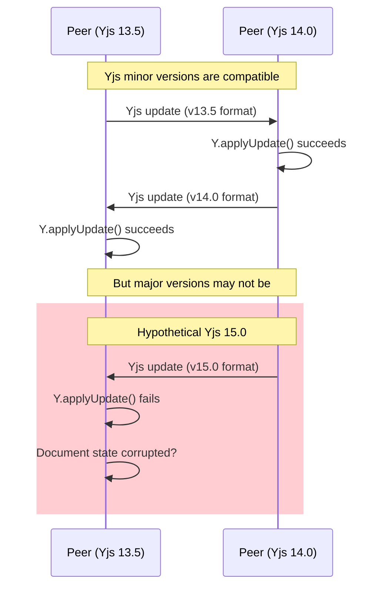
```mermaid
sequenceDiagram
    participant Old as Peer (Yjs 13.5)
    participant New as Peer (Yjs 14.0)

    Note over Old,New: Yjs minor versions are compatible

    Old->>New: Yjs update (v13.5 format)
    New->>New: Y.applyUpdate() succeeds
    New->>Old: Yjs update (v14.0 format)
    Old->>Old: Y.applyUpdate() succeeds

    Note over Old,New: But major versions may not be

    rect rgb(255, 205, 210)
        Note over Old,New: Hypothetical Yjs 15.0
        New->>Old: Yjs update (v15.0 format)
        Old->>Old: Y.applyUpdate() fails
        Old->>Old: Document state corrupted?
    end
```

**Yjs compatibility notes:**

- Yjs has maintained backward compatibility in its binary format
- But there's no guarantee this continues forever
- xNet wraps Yjs updates in `SignedYjsEnvelope` - this envelope format could change
- The `YjsUpdatePayload` within `Change<T>` has its own structure that could evolve

### 5. Cryptographic Algorithm Changes

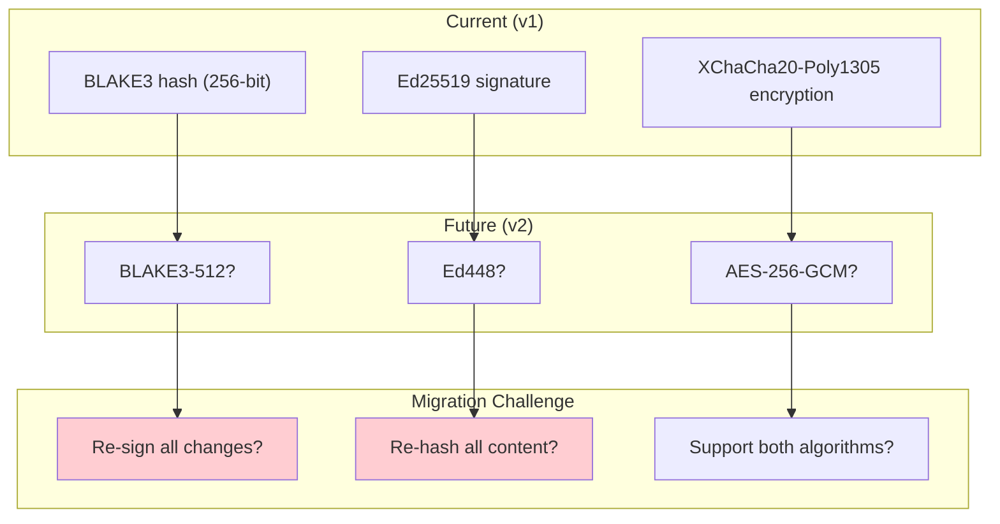
```mermaid
flowchart TB
    subgraph "Current (v1)"
        BLAKE3["BLAKE3 hash (256-bit)"]
        ED25519["Ed25519 signature"]
        XCHACHA["XChaCha20-Poly1305 encryption"]
    end

    subgraph "Future (v2)"
        BLAKE3_512["BLAKE3-512?"]
        ED448["Ed448?"]
        AES256["AES-256-GCM?"]
    end

    subgraph "Migration Challenge"
        RESIGN["Re-sign all changes?"]
        REHASH["Re-hash all content?"]
        DUAL["Support both algorithms?"]
    end

    BLAKE3 --> BLAKE3_512
    ED25519 --> ED448
    XCHACHA --> AES256

    BLAKE3_512 --> RESIGN
    ED448 --> REHASH
    AES256 --> DUAL

    style RESIGN fill:#ffcdd2
    style REHASH fill:#ffcdd2
```

---

## How Other Systems Handle This

### Matrix: Room Versions

Matrix uses explicit room versions that bundle algorithm choices:

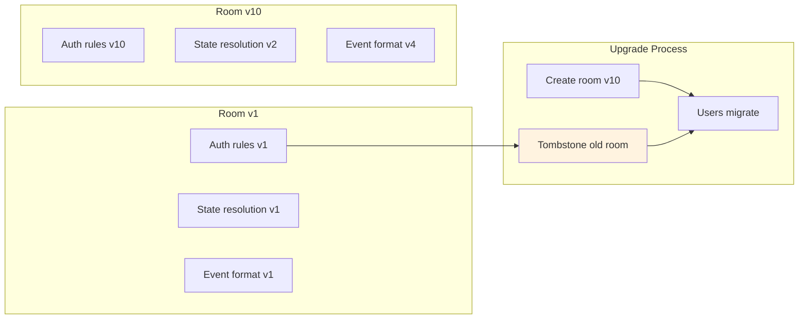
```mermaid
flowchart LR
    subgraph "Room v1"
        R1_AUTH["Auth rules v1"]
        R1_STATE["State resolution v1"]
        R1_EVENT["Event format v1"]
    end

    subgraph "Room v10"
        R10_AUTH["Auth rules v10"]
        R10_STATE["State resolution v2"]
        R10_EVENT["Event format v4"]
    end

    subgraph "Upgrade Process"
        CREATE["Create room v10"]
        TOMBSTONE["Tombstone old room"]
        MIGRATE["Users migrate"]
    end

    R1_AUTH --> TOMBSTONE
    CREATE --> MIGRATE
    TOMBSTONE --> MIGRATE

    style TOMBSTONE fill:#fff3e0
```

**Key lessons:**

- Rooms are versioned, not the global protocol
- Breaking changes require creating a new room
- Old rooms continue to work with old rules
- Users explicitly migrate to new rooms

### Automerge: Hard-coded Migrations

```typescript
// Automerge recommendation: hard-code migrations as byte arrays
const migrateV1toV2 = new Uint8Array([133, 111, 74, 131, ...])

function loadDocument(doc) {
  if (doc.version === 1) {
    [doc] = Automerge.applyChange(doc, [migrateV1toV2])
  }
  return doc
}
```

**Key lessons:**

- Schema changes must be identical across all peers
- Use deterministic actor IDs for migration changes
- Version property in document root enables branching
- Forward planning is essential

### Cambria: Bidirectional Lenses

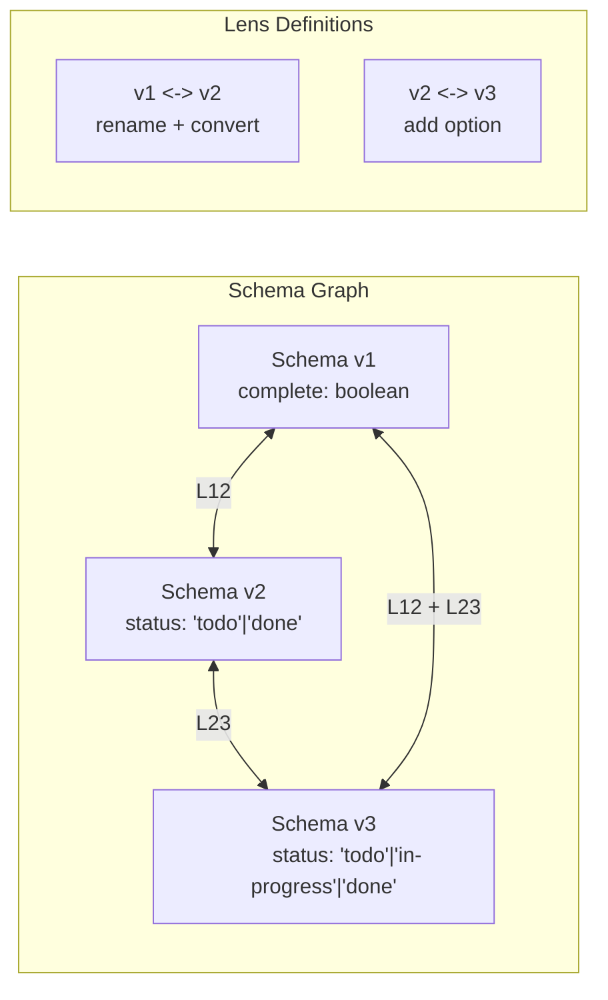
```mermaid
flowchart LR
    subgraph "Schema Graph"
        V1["Schema v1
        complete: boolean"]
        V2["Schema v2
        status: 'todo'|'done'"]
        V3["Schema v3
        status: 'todo'|'in-progress'|'done'"]
    end

    subgraph "Lens Definitions"
        L12["v1 <-> v2
        rename + convert"]
        L23["v2 <-> v3
        add option"]
    end

    V1 <-->|L12| V2
    V2 <-->|L23| V3
    V1 <-->|"L12 + L23"| V3
```

**Key lessons:**

- Translate on read, not write
- Store data in writer's schema
- Lenses are bidirectional - single definition
- Graph allows routing between any versions

### libp2p: Protocol Negotiation

```
/multistream/1.0.0      <- Negotiation protocol
/xnet/sync/1.0.0        <- Request this version
na                      <- Server doesn't support
/xnet/sync/0.9.0        <- Fallback version
/xnet/sync/0.9.0        <- Server confirms
```

**Key lessons:**

- Negotiate on connection, not per-message
- Include version in protocol identifier
- Support multiple versions simultaneously
- Graceful fallback to older versions

### Nostr: Event Kinds + NIPs

```json
{
  "kind": 1, // Short text note (NIP-01)
  "kind": 30023, // Long-form content (NIP-23)
  "kind": 9735, // Zap receipt (NIP-57)
  "tags": [
    ["e", "..."], // Event reference
    ["p", "..."], // Profile reference
    ["t", "topic"] // Hashtag (NIP-12)
  ]
}
```

**Key lessons:**

- Feature = new kind number, not version bump
- Relays/clients independently adopt NIPs
- Unknown kinds are ignored (graceful degradation)
- No coordination required for new features

### Figma: Server Authority + Property Independence

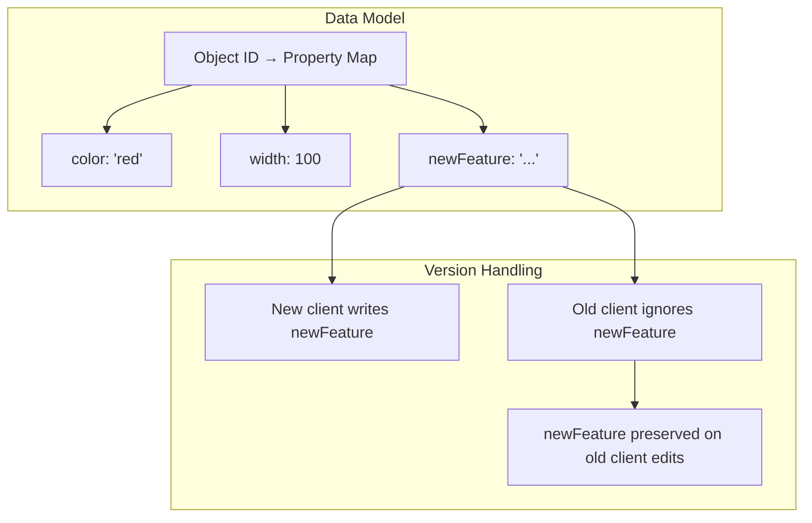
```mermaid
flowchart TB
    subgraph "Data Model"
        OBJ["Object ID → Property Map"]
        PROP1["color: 'red'"]
        PROP2["width: 100"]
        PROP3["newFeature: '...'"]
    end

    subgraph "Version Handling"
        NEW_CLIENT["New client writes newFeature"]
        OLD_CLIENT["Old client ignores newFeature"]
        PRESERVE["newFeature preserved on old client edits"]
    end

    OBJ --> PROP1
    OBJ --> PROP2
    OBJ --> PROP3

    PROP3 --> NEW_CLIENT
    PROP3 --> OLD_CLIENT
    OLD_CLIENT --> PRESERVE
```

**Key lessons:**

- Properties are independent - adding new ones is safe
- Old clients preserve unknown properties on edit
- Server is source of truth (not pure P2P)
- Atomic changes at property boundary, not object

---

## xNet-Specific Risk Analysis

### Scenario 1: New Property Type Added

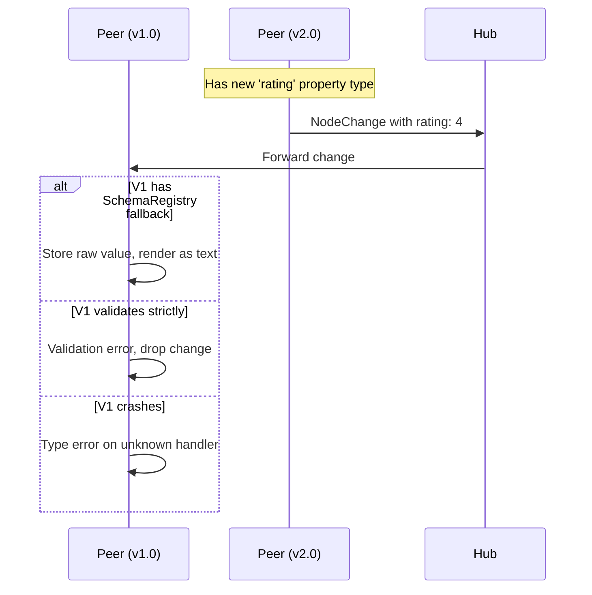
```mermaid
sequenceDiagram
    participant V1 as Peer (v1.0)
    participant V2 as Peer (v2.0)
    participant Hub

    Note over V2: Has new 'rating' property type

    V2->>Hub: NodeChange with rating: 4
    Hub->>V1: Forward change

    alt V1 has SchemaRegistry fallback
        V1->>V1: Store raw value, render as text
    else V1 validates strictly
        V1->>V1: Validation error, drop change
    else V1 crashes
        V1->>V1: Type error on unknown handler
    end
```

**Current behavior:** Unclear - depends on how unknown property types are handled in the UI layer.

### Scenario 2: New Change Type Introduced

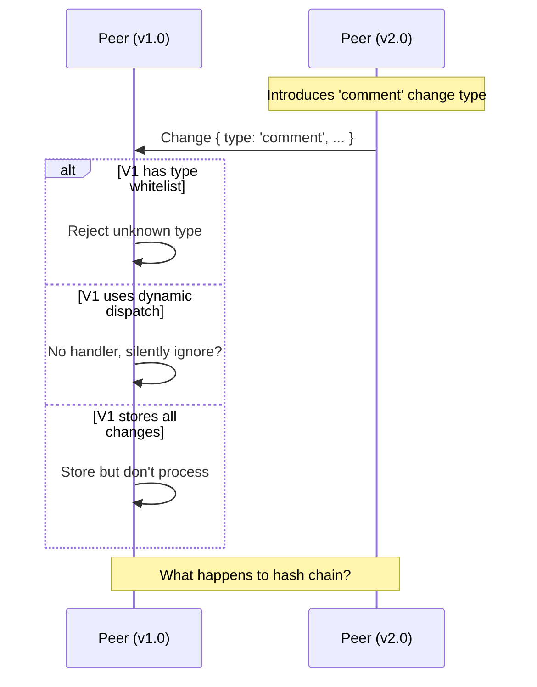
```mermaid
sequenceDiagram
    participant V1 as Peer (v1.0)
    participant V2 as Peer (v2.0)

    Note over V2: Introduces 'comment' change type

    V2->>V1: Change { type: 'comment', ... }

    alt V1 has type whitelist
        V1->>V1: Reject unknown type
    else V1 uses dynamic dispatch
        V1->>V1: No handler, silently ignore?
    else V1 stores all changes
        V1->>V1: Store but don't process
    end

    Note over V1,V2: What happens to hash chain?
```

**Current behavior:** The `applyRemoteChange` in NodeStore expects specific payload structures. Unknown types would likely cause errors.

### Scenario 3: Yjs Envelope Format Change

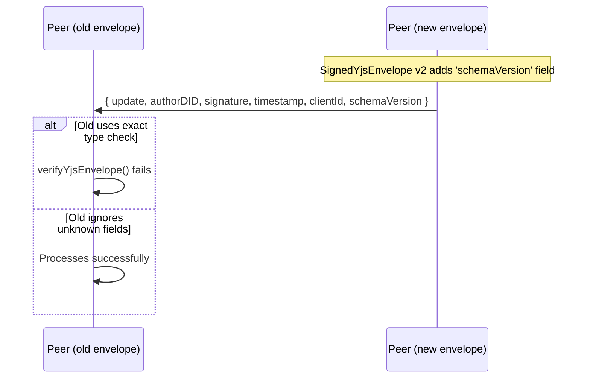
```mermaid
sequenceDiagram
    participant Old as Peer (old envelope)
    participant New as Peer (new envelope)

    Note over New: SignedYjsEnvelope v2 adds 'schemaVersion' field

    New->>Old: { update, authorDID, signature, timestamp, clientId, schemaVersion }

    alt Old uses exact type check
        Old->>Old: verifyYjsEnvelope() fails
    else Old ignores unknown fields
        Old->>Old: Processes successfully
    end
```

**Current behavior:** TypeScript types are strict, but runtime behavior depends on implementation.

### Scenario 4: Plugin Contributes Unknown Schema

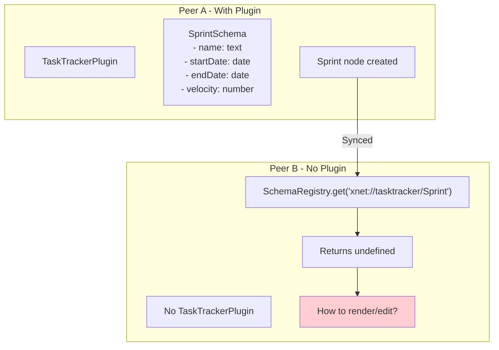
```mermaid
flowchart TB
    subgraph "Peer A - With Plugin"
        PLUGIN["TaskTrackerPlugin"]
        SCHEMA["SprintSchema
        - name: text
        - startDate: date
        - endDate: date
        - velocity: number"]
        NODE["Sprint node created"]
    end

    subgraph "Peer B - No Plugin"
        NO_PLUGIN["No TaskTrackerPlugin"]
        REGISTRY["SchemaRegistry.get('xnet://tasktracker/Sprint')"]
        RESULT["Returns undefined"]
        WHAT["How to render/edit?"]
    end

    NODE -->|"Synced"| REGISTRY
    REGISTRY --> RESULT
    RESULT --> WHAT

    style WHAT fill:#ffcdd2
```

**Current behavior:** SchemaRegistry has `setRemoteResolver` for fetching unknown schemas, but:

- Resolver may not find plugin-contributed schemas
- UI has no fallback for unknown schemas

---

## Proposed Solutions

### Solution 1: Protocol Version in Change<T>

Add explicit version to the sync primitive:

```typescript
export interface Change<T = unknown> {
  // NEW: Protocol version for this change
  protocolVersion: number // Start at 1, increment on breaking changes

  id: string
  type: string
  payload: T
  hash: ContentId
  // ... rest unchanged
}
```

**Version compatibility matrix:**

| Writer Version | Reader Version | Behavior                     |
| -------------- | -------------- | ---------------------------- |
| 1              | 1              | Full compatibility           |
| 1              | 2              | Reader applies v1 rules      |
| 2              | 1              | Reader rejects or downgrades |
| 2              | 2              | Full compatibility           |

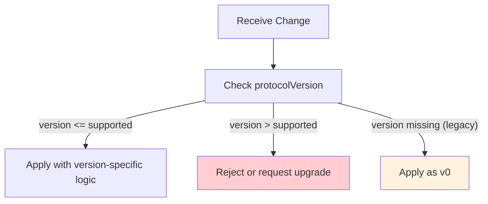
```mermaid
flowchart TB
    RECEIVE["Receive Change"]
    CHECK["Check protocolVersion"]

    RECEIVE --> CHECK

    CHECK -->|"version <= supported"| APPLY["Apply with version-specific logic"]
    CHECK -->|"version > supported"| REJECT["Reject or request upgrade"]
    CHECK -->|"version missing (legacy)"| LEGACY["Apply as v0"]

    style REJECT fill:#ffcdd2
    style LEGACY fill:#fff3e0
```

### Solution 2: Capability Negotiation on Connect

Add version/capability exchange to SyncProvider:

```typescript
export interface SyncCapabilities {
  protocolVersion: number
  supportedChangeTypes: string[]
  supportedSchemas: SchemaIRI[]
  yjsVersion: string
  features: string[] // Feature flags
}

export interface SyncProvider<T = unknown> {
  // NEW: Exchange capabilities on connect
  negotiate(peerId: string): Promise<NegotiatedCapabilities>

  readonly capabilities: SyncCapabilities
  // ... rest unchanged
}
```

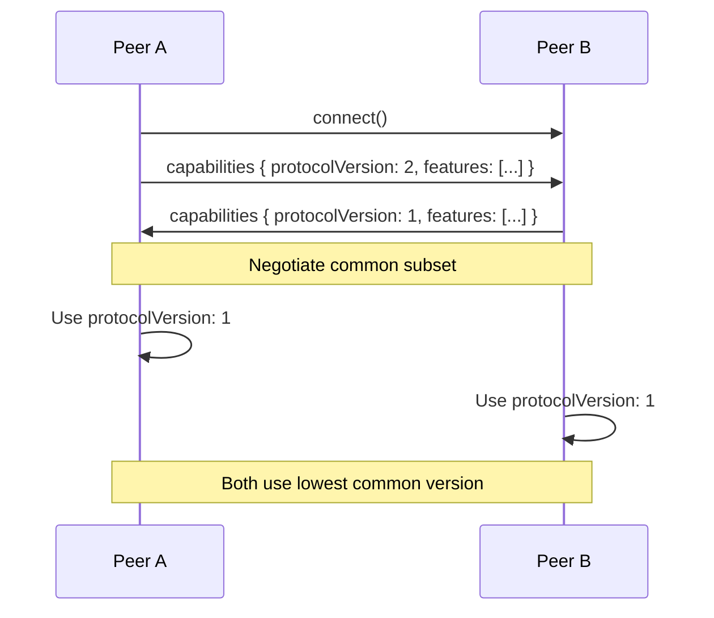
```mermaid
sequenceDiagram
    participant A as Peer A
    participant B as Peer B

    A->>B: connect()
    A->>B: capabilities { protocolVersion: 2, features: [...] }
    B->>A: capabilities { protocolVersion: 1, features: [...] }

    Note over A,B: Negotiate common subset

    A->>A: Use protocolVersion: 1
    B->>B: Use protocolVersion: 1

    Note over A,B: Both use lowest common version
```

### Solution 3: Schema Versioning in SchemaIRI

Embed version in schema identifier:

```typescript
// Current: xnet://xnet.fyi/Task
// Proposed: xnet://xnet.fyi/Task@1.0.0

type VersionedSchemaIRI = `${string}@${string}`

const TaskSchemaV1 = defineSchema({
  name: 'Task',
  namespace: 'xnet://xnet.fyi/',
  version: '1.0.0',  // NEW: Explicit version
  properties: { ... }
})

const TaskSchemaV2 = defineSchema({
  name: 'Task',
  namespace: 'xnet://xnet.fyi/',
  version: '2.0.0',
  migrateFrom: 'xnet://xnet.fyi/Task@1.0.0',  // NEW: Migration path
  properties: { ... }
})
```

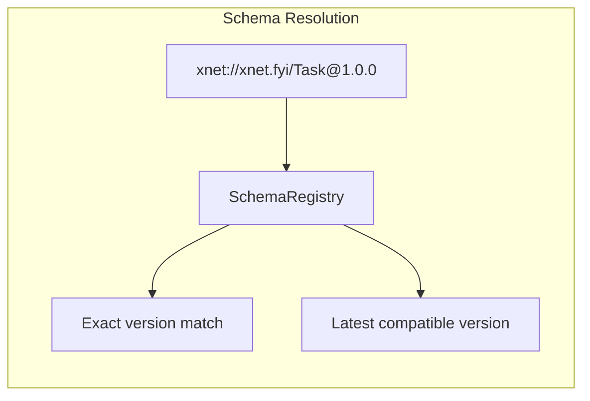
```mermaid
flowchart LR
    subgraph "Schema Resolution"
        IRI["xnet://xnet.fyi/Task@1.0.0"]
        REGISTRY["SchemaRegistry"]
        EXACT["Exact version match"]
        LATEST["Latest compatible version"]
    end

    IRI --> REGISTRY
    REGISTRY --> EXACT
    REGISTRY --> LATEST
```

### Solution 4: Translate on Read (Cambria-style Lenses)

Store data in writer's schema, translate for readers:

```typescript
interface SchemaLens {
  source: VersionedSchemaIRI
  target: VersionedSchemaIRI
  forward: (data: unknown) => unknown
  backward: (data: unknown) => unknown
}

const taskV1toV2: SchemaLens = {
  source: 'xnet://xnet.fyi/Task@1.0.0',
  target: 'xnet://xnet.fyi/Task@2.0.0',
  forward: (data) => ({
    ...data,
    status: data.complete ? 'done' : 'todo' // Boolean -> enum
  }),
  backward: (data) => ({
    ...data,
    complete: data.status === 'done' // Enum -> boolean
  })
}
```

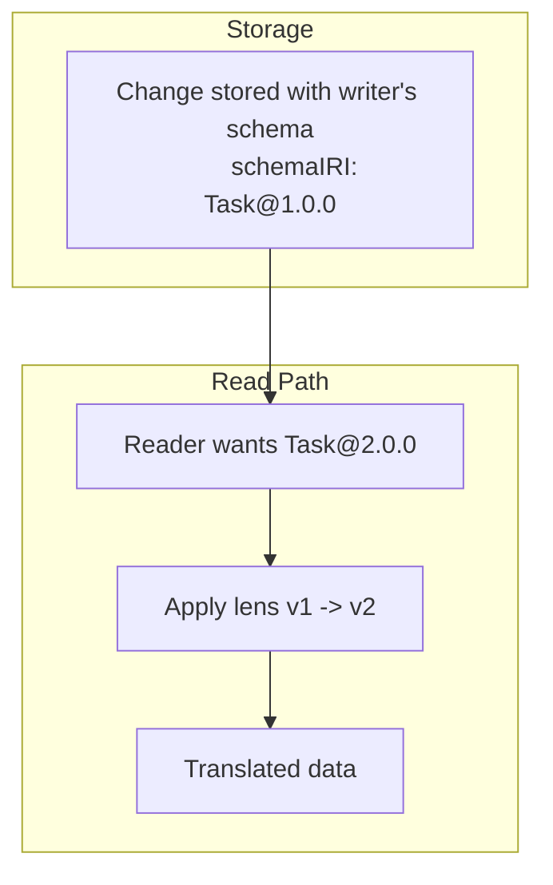
```mermaid
flowchart TB
    subgraph "Storage"
        CHANGE["Change stored with writer's schema
        schemaIRI: Task@1.0.0"]
    end

    subgraph "Read Path"
        READ["Reader wants Task@2.0.0"]
        LENS["Apply lens v1 -> v2"]
        RESULT["Translated data"]
    end

    CHANGE --> READ
    READ --> LENS
    LENS --> RESULT
```

### Solution 5: Feature Flags for Gradual Rollout

Use feature flags instead of version numbers for additive features:

```typescript
interface SyncFeatureFlags {
  yjs_signed_envelopes: boolean // Was added in v0.2.0
  batch_changes: boolean // Was added in v0.3.0
  peer_scoring: boolean // Was added in v0.4.0
  schema_inheritance: boolean // Coming in v0.5.0
}

// In capability negotiation
const features = {
  yjs_signed_envelopes: true,
  batch_changes: true,
  peer_scoring: true,
  schema_inheritance: false // Not yet supported
}
```

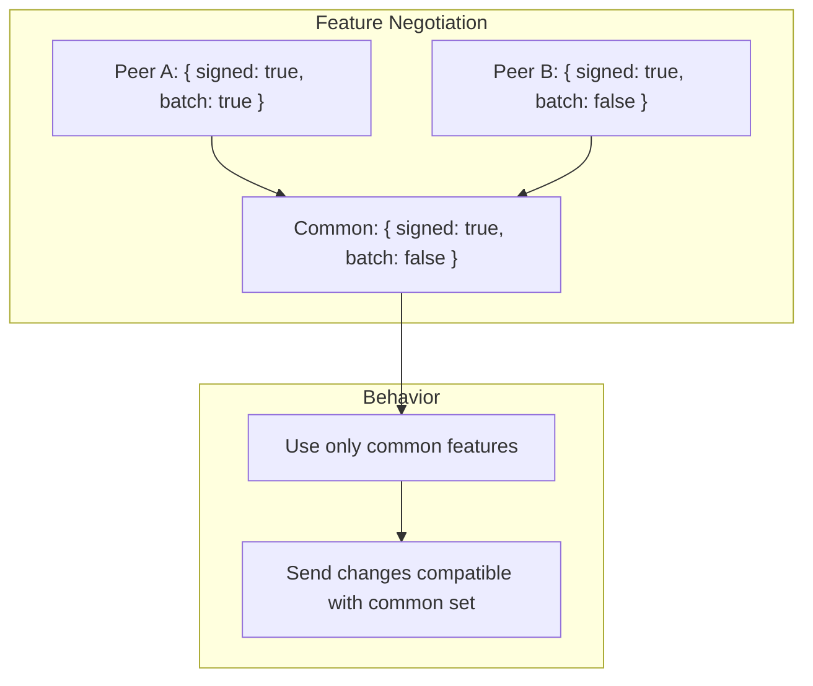
```mermaid
flowchart TB
    subgraph "Feature Negotiation"
        A_FLAGS["Peer A: { signed: true, batch: true }"]
        B_FLAGS["Peer B: { signed: true, batch: false }"]
        COMMON["Common: { signed: true, batch: false }"]
    end

    subgraph "Behavior"
        USE["Use only common features"]
        SEND["Send changes compatible with common set"]
    end

    A_FLAGS --> COMMON
    B_FLAGS --> COMMON
    COMMON --> USE
    USE --> SEND
```

### Solution 6: Document Version Header

Add version metadata to document/node root:

```typescript
interface DocumentMetadata {
  xnetVersion: string // Package version that created this
  protocolVersion: number // Sync protocol version
  schemaVersions: Record<SchemaIRI, string> // Schema versions used
  createdAt: number
  lastModifiedAt: number
}

// Store in Y.Doc meta or node property
doc.getMap('meta').set('xnet:version', metadata)
```

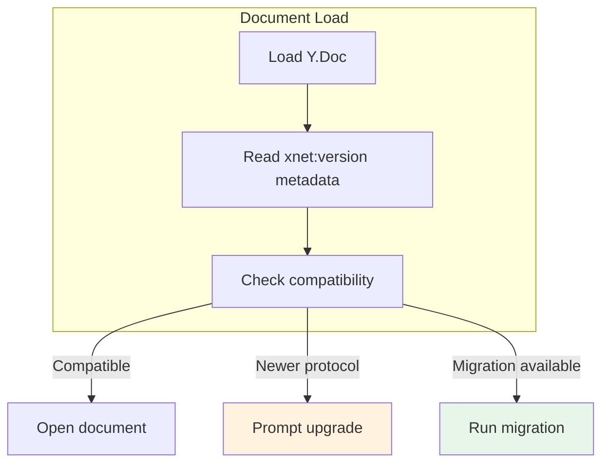
```mermaid
flowchart TB
    subgraph "Document Load"
        LOAD["Load Y.Doc"]
        META["Read xnet:version metadata"]
        CHECK["Check compatibility"]
    end

    LOAD --> META
    META --> CHECK

    CHECK -->|"Compatible"| OPEN["Open document"]
    CHECK -->|"Newer protocol"| UPGRADE["Prompt upgrade"]
    CHECK -->|"Migration available"| MIGRATE["Run migration"]

    style UPGRADE fill:#fff3e0
    style MIGRATE fill:#e8f5e9
```

---

## Implementation Roadmap

### Phase 1: Foundation (Non-breaking)

1. **Add `protocolVersion` to Change<T>** - Optional field, default to 1
2. **Add version to Hub handshake** - Already has field, start using it
3. **Add schema version to SchemaRegistry** - Track version per schema
4. **Add unknown property/type handling** - Graceful degradation

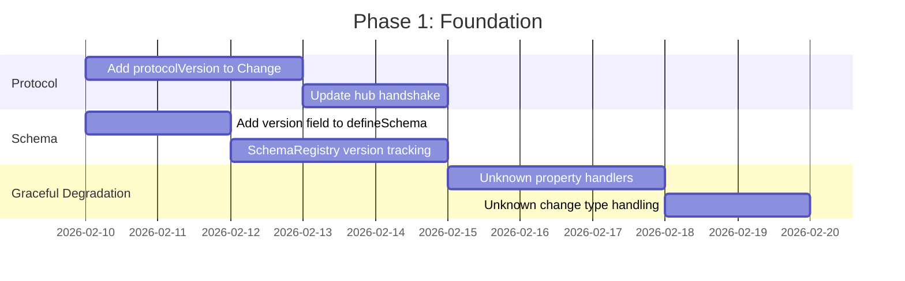
```mermaid
gantt
    title Phase 1: Foundation
    dateFormat  YYYY-MM-DD
    section Protocol
    Add protocolVersion to Change     :p1a, 2026-02-10, 3d
    Update hub handshake              :p1b, after p1a, 2d
    section Schema
    Add version field to defineSchema :p1c, 2026-02-10, 2d
    SchemaRegistry version tracking   :p1d, after p1c, 3d
    section Graceful Degradation
    Unknown property handlers         :p1e, 2026-02-15, 3d
    Unknown change type handling      :p1f, after p1e, 2d
```

### Phase 2: Negotiation (Breaking for old clients)

1. **Capability exchange in SyncProvider** - Negotiate on connect
2. **Feature flags system** - Additive features without version bumps
3. **Schema migration framework** - Define lens-style migrations
4. **Version compatibility matrix** - Document what works with what

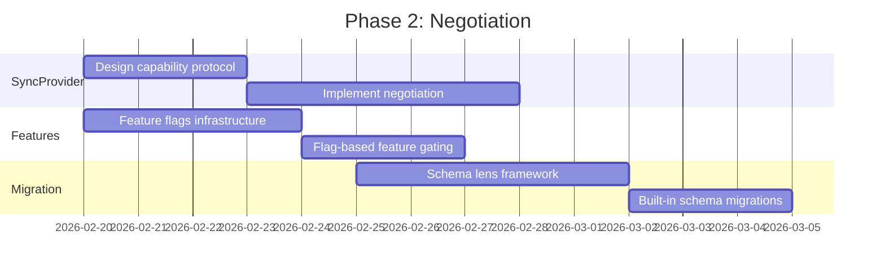
```mermaid
gantt
    title Phase 2: Negotiation
    dateFormat  YYYY-MM-DD
    section SyncProvider
    Design capability protocol        :p2a, 2026-02-20, 3d
    Implement negotiation             :p2b, after p2a, 5d
    section Features
    Feature flags infrastructure      :p2c, 2026-02-20, 4d
    Flag-based feature gating         :p2d, after p2c, 3d
    section Migration
    Schema lens framework             :p2e, 2026-02-25, 5d
    Built-in schema migrations        :p2f, after p2e, 3d
```

### Phase 3: Robustness

1. **Version-specific change handlers** - Process old/new formats
2. **Automatic schema migration** - Transparent upgrades
3. **Plugin version enforcement** - Check `xnetVersion` in manifest
4. **Deprecation warnings** - Notify about old versions

```mermaid
gantt
    title Phase 3: Robustness
    dateFormat  YYYY-MM-DD
    section Handlers
    Version-specific processors       :p3a, 2026-03-05, 5d
    Backward compatibility tests      :p3b, after p3a, 3d
    section Automation
    Auto schema migration             :p3c, 2026-03-05, 5d
    Migration test suite              :p3d, after p3c, 3d
    section Enforcement
    Plugin xnetVersion checking       :p3e, 2026-03-15, 3d
    Deprecation system                :p3f, after p3e, 2d
```

---

## Detailed Design: Protocol Versioning

### Change<T> v2 Specification

```typescript
// packages/sync/src/change.ts

export const CURRENT_PROTOCOL_VERSION = 1

export interface Change<T = unknown> {
  // Version field - required in v2+, optional for backward compat
  protocolVersion?: number

  // Existing fields...
  id: string
  type: string
  payload: T
  hash: ContentId
  parentHash: ContentId | null
  authorDID: DID
  signature: Uint8Array
  wallTime: number
  lamport: LamportTimestamp
  batchId?: string
  batchIndex?: number
  batchSize?: number
}

// Version-aware hash computation
export function computeChangeHash<T>(change: Change<T>): ContentId {
  const version = change.protocolVersion ?? 0

  if (version === 0) {
    // Legacy: hash without protocolVersion field
    return computeLegacyHash(change)
  }

  // v1+: include protocolVersion in hash
  const canonical = canonicalize({
    protocolVersion: change.protocolVersion,
    id: change.id,
    type: change.type,
    payload: change.payload,
    parentHash: change.parentHash,
    authorDID: change.authorDID,
    wallTime: change.wallTime,
    lamport: change.lamport
    // ... batch fields if present
  })

  return blake3Hash(canonical)
}

// Version-aware verification
export function verifyChange<T>(change: Change<T>, options: VerifyOptions = {}): VerifyResult {
  const version = change.protocolVersion ?? 0

  if (version > CURRENT_PROTOCOL_VERSION) {
    if (options.strictVersion) {
      return { valid: false, errors: ['Unsupported protocol version'] }
    }
    // Try to verify with current version rules
  }

  // Verify hash
  const expectedHash = computeChangeHash(change)
  if (change.hash !== expectedHash) {
    return { valid: false, errors: ['Hash mismatch'] }
  }

  // Verify signature
  const publicKey = didToPublicKey(change.authorDID)
  const valid = ed25519Verify(change.signature, change.hash, publicKey)

  return { valid, errors: valid ? [] : ['Invalid signature'] }
}
```

### Version Negotiation Protocol

```typescript
// packages/sync/src/negotiation.ts

export interface VersionInfo {
  protocolVersion: number
  minProtocolVersion: number
  packageVersion: string
  features: string[]
}

export interface NegotiationResult {
  success: boolean
  agreedVersion: number
  commonFeatures: string[]
  warnings: string[]
}

export function negotiateVersion(local: VersionInfo, remote: VersionInfo): NegotiationResult {
  // Find highest mutually supported version
  const maxVersion = Math.min(local.protocolVersion, remote.protocolVersion)
  const minVersion = Math.max(local.minProtocolVersion, remote.minProtocolVersion)

  if (maxVersion < minVersion) {
    return {
      success: false,
      agreedVersion: 0,
      commonFeatures: [],
      warnings: ['No compatible protocol version']
    }
  }

  // Find common features
  const commonFeatures = local.features.filter((f) => remote.features.includes(f))

  // Generate warnings
  const warnings: string[] = []
  if (maxVersion < local.protocolVersion) {
    warnings.push(`Peer using older protocol v${remote.protocolVersion}`)
  }

  return {
    success: true,
    agreedVersion: maxVersion,
    commonFeatures,
    warnings
  }
}
```

### WebSocket Handshake Extension

```typescript
// packages/network/src/types.ts

export interface HubHandshake {
  type: 'handshake'
  version: string // Package version
  protocolVersion: number // NEW: Sync protocol version
  minProtocolVersion: number // NEW: Minimum supported
  features: string[] // NEW: Feature flags
  hubDid?: string
  isDemo: boolean
  demoLimits?: DemoLimits
}

export interface ClientHandshake {
  type: 'client-handshake'
  did: string
  protocolVersion: number
  minProtocolVersion: number
  features: string[]
}
```

---

## Detailed Design: Schema Evolution

### Versioned Schema Definition

```typescript
// packages/data/src/schema/define.ts

export interface DefineSchemaOptions<P> {
  name: string
  namespace: string
  version?: string // NEW: Semver string
  migrateFrom?: SchemaIRI // NEW: Previous version to migrate from
  properties: P
  extends?: SchemaIRI
  document?: DocumentType
}

export function defineSchema<P>(options: DefineSchemaOptions<P>): DefinedSchema<P> {
  const version = options.version ?? '1.0.0'
  const iri = `${options.namespace}${options.name}@${version}` as SchemaIRI

  return {
    '@id': iri,
    '@type': 'xnet://xnet.fyi/Schema',
    name: options.name,
    namespace: options.namespace,
    version,
    migrateFrom: options.migrateFrom,
    properties: buildProperties(options.properties),
    extends: options.extends,
    document: options.document
  }
}
```

### Schema Migration System

```typescript
// packages/data/src/schema/migration.ts

export interface SchemaMigration {
  from: SchemaIRI
  to: SchemaIRI
  up: (data: Record<string, unknown>) => Record<string, unknown>
  down: (data: Record<string, unknown>) => Record<string, unknown>
}

export class SchemaMigrationRegistry {
  private migrations = new Map<string, SchemaMigration>()

  register(migration: SchemaMigration): void {
    const key = `${migration.from}:${migration.to}`
    this.migrations.set(key, migration)
  }

  findPath(from: SchemaIRI, to: SchemaIRI): SchemaMigration[] | null {
    // BFS to find shortest migration path
    const queue: { schema: SchemaIRI; path: SchemaMigration[] }[] = [{ schema: from, path: [] }]
    const visited = new Set<SchemaIRI>()

    while (queue.length > 0) {
      const { schema, path } = queue.shift()!

      if (schema === to) {
        return path
      }

      if (visited.has(schema)) continue
      visited.add(schema)

      // Find all migrations from this schema
      for (const [key, migration] of this.migrations) {
        if (migration.from === schema) {
          queue.push({
            schema: migration.to,
            path: [...path, migration]
          })
        }
      }
    }

    return null // No path found
  }

  migrate(data: Record<string, unknown>, from: SchemaIRI, to: SchemaIRI): Record<string, unknown> {
    const path = this.findPath(from, to)
    if (!path) {
      throw new Error(`No migration path from ${from} to ${to}`)
    }

    let result = data
    for (const migration of path) {
      result = migration.up(result)
    }
    return result
  }
}
```

### Example Migration

```typescript
// Example: Task schema evolution

const TaskV1 = defineSchema({
  name: 'Task',
  namespace: 'xnet://xnet.fyi/',
  version: '1.0.0',
  properties: {
    title: text({ required: true }),
    complete: checkbox({})
  }
})

const TaskV2 = defineSchema({
  name: 'Task',
  namespace: 'xnet://xnet.fyi/',
  version: '2.0.0',
  migrateFrom: 'xnet://xnet.fyi/Task@1.0.0',
  properties: {
    title: text({ required: true }),
    status: select({ options: ['todo', 'in-progress', 'done'] as const })
  }
})

// Register migration
migrationRegistry.register({
  from: 'xnet://xnet.fyi/Task@1.0.0',
  to: 'xnet://xnet.fyi/Task@2.0.0',
  up: (data) => ({
    ...data,
    status: data.complete ? 'done' : 'todo',
    complete: undefined // Remove old field
  }),
  down: (data) => ({
    ...data,
    complete: data.status === 'done',
    status: undefined
  })
})
```

---

## Testing Strategy

### Version Compatibility Tests

```typescript
// packages/sync/src/__tests__/version-compat.test.ts

describe('Version Compatibility', () => {
  describe('Change<T> versioning', () => {
    it('should create change with current protocol version', () => {
      const change = createUnsignedChange({ ... })
      expect(change.protocolVersion).toBe(CURRENT_PROTOCOL_VERSION)
    })

    it('should verify legacy changes without protocolVersion', () => {
      const legacyChange = { id: '...', type: '...', /* no protocolVersion */ }
      const result = verifyChange(legacyChange)
      expect(result.valid).toBe(true)
    })

    it('should reject changes from future protocol versions in strict mode', () => {
      const futureChange = { protocolVersion: 999, ... }
      const result = verifyChange(futureChange, { strictVersion: true })
      expect(result.valid).toBe(false)
    })
  })

  describe('Version negotiation', () => {
    it('should agree on lowest common version', () => {
      const local = { protocolVersion: 2, minProtocolVersion: 1, features: [] }
      const remote = { protocolVersion: 1, minProtocolVersion: 1, features: [] }
      const result = negotiateVersion(local, remote)
      expect(result.agreedVersion).toBe(1)
    })

    it('should fail when no compatible version exists', () => {
      const local = { protocolVersion: 2, minProtocolVersion: 2, features: [] }
      const remote = { protocolVersion: 1, minProtocolVersion: 1, features: [] }
      const result = negotiateVersion(local, remote)
      expect(result.success).toBe(false)
    })
  })
})
```

### Schema Migration Tests

```typescript
// packages/data/src/__tests__/schema-migration.test.ts

describe('Schema Migration', () => {
  it('should migrate data through multiple versions', () => {
    const v1Data = { title: 'Test', complete: true }
    const v3Data = migrationRegistry.migrate(
      v1Data,
      'xnet://xnet.fyi/Task@1.0.0',
      'xnet://xnet.fyi/Task@3.0.0'
    )
    expect(v3Data.status).toBe('done')
    expect(v3Data.priority).toBe('normal') // v3 default
  })

  it('should find shortest migration path', () => {
    const path = migrationRegistry.findPath(
      'xnet://xnet.fyi/Task@1.0.0',
      'xnet://xnet.fyi/Task@3.0.0'
    )
    expect(path.length).toBeLessThanOrEqual(2)
  })

  it('should support bidirectional migration', () => {
    const v1Data = { title: 'Test', complete: false }
    const v2Data = migrationRegistry.migrate(v1Data, 'Task@1.0.0', 'Task@2.0.0')
    const backToV1 = migrationRegistry.migrateDown(v2Data, 'Task@2.0.0', 'Task@1.0.0')
    expect(backToV1.complete).toBe(false)
  })
})
```

---

## Open Questions

1. **What is the minimum supported version?**
   - Should we support indefinite backward compatibility?
   - Or define a "support window" (e.g., last 3 major versions)?

2. **How to handle cryptographic algorithm changes?**
   - Dual-algorithm period with both signatures?
   - Or clean break with migration tool?

3. **Should schema versions be in the IRI or metadata?**
   - `xnet://xnet.fyi/Task@1.0.0` (in IRI)
   - `xnet://xnet.fyi/Task` + `version: "1.0.0"` (metadata)

4. **Centralized vs. decentralized migration?**
   - Each peer migrates on read (Cambria approach)
   - Or one peer migrates and broadcasts (authoritative)

5. **How to handle plugin-contributed schemas?**
   - Require plugin version in schema IRI?
   - Central registry of plugin schemas?

6. **What about network partition during migration?**
   - Peer A migrates, peer B offline
   - Peer B comes online with old version
   - How to reconcile?

---

## Recommendations

### Immediate Actions (Before v1.0)

1. **Add `protocolVersion: 1` to all new Change<T>** - Start tracking now
2. **Use hub handshake version field** - Check compatibility on connect
3. **Handle unknown change types gracefully** - Log and skip, don't crash
4. **Handle unknown properties gracefully** - Preserve and pass through

### Medium-term (v1.x)

1. **Implement capability negotiation** - Exchange features on connect
2. **Add schema versions** - Track in registry, include in changes
3. **Build migration framework** - Cambria-style lenses
4. **Enforce plugin xnetVersion** - Warn on incompatible plugins

### Long-term (v2.0)

1. **Multi-version support** - Process old/new formats simultaneously
2. **Automatic migration** - Transparent upgrades on read
3. **Deprecation system** - Warn and eventually drop old versions
4. **Version compatibility dashboard** - See what versions peers are running

---

## Conclusion

Version compatibility is a **critical but currently unaddressed gap** in xNet's architecture. The good news:

1. **The Change<T> hash chain design is solid** - Adding version is non-breaking
2. **Property-level LWW is inherently flexible** - Unknown properties can pass through
3. **Yjs is battle-tested** - Binary format has been stable

The key insight from researching other systems: **translate on read, not write**. Store data in the writer's format, transform for readers. This, combined with explicit version markers and capability negotiation, will make xNet resilient to version mismatches.

Priority should be:

1. Add version fields now (non-breaking)
2. Build graceful degradation for unknowns
3. Implement schema migration framework
4. Add capability negotiation

The goal is not to prevent all version mismatches - that's impossible in a decentralized system. The goal is to **fail gracefully, preserve data, and provide upgrade paths**.
