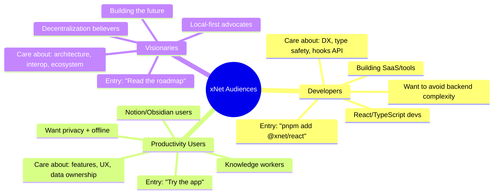
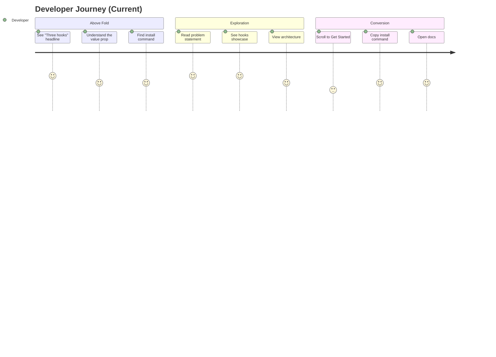
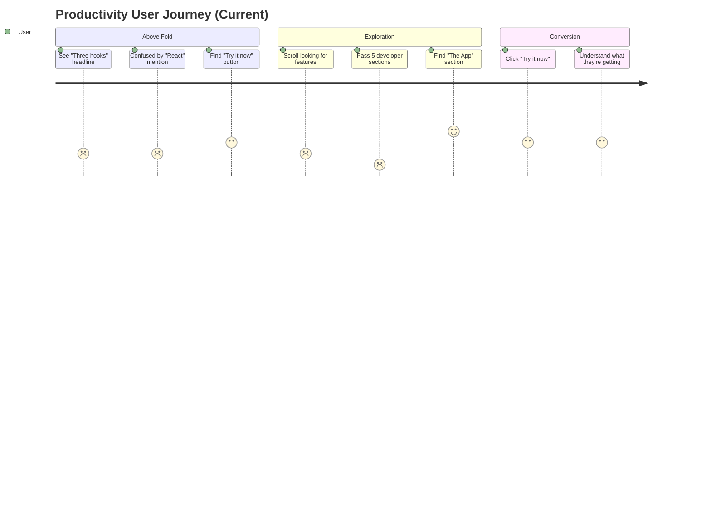
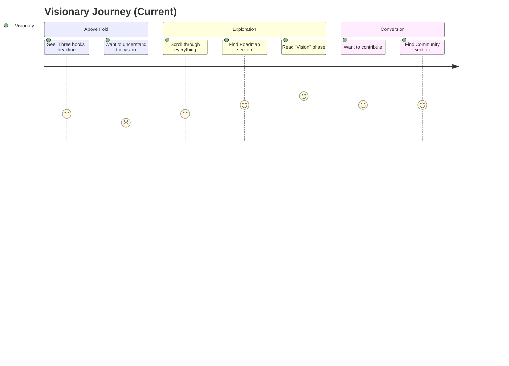
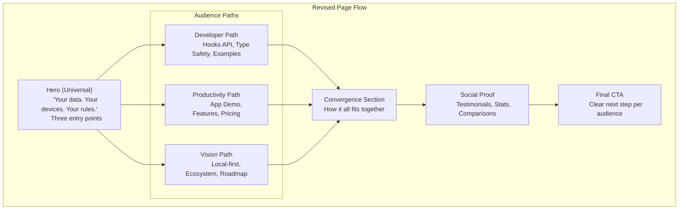
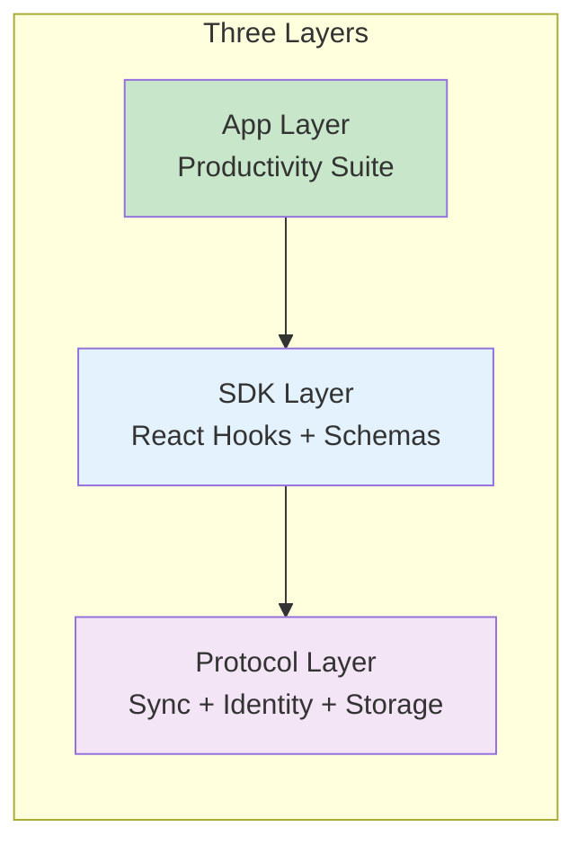

# 0060 - Landing Page Revision

> **Status:** Completed
> **Tags:** marketing, UX, landing page, messaging, personas, CTAs, information architecture
> **Created:** 2026-02-06
> **Context:** The xNet landing page currently presents multiple products and appeals: a productivity app, React developer tooling, Hub hosting infrastructure, and a grand vision for a decentralized data layer. While comprehensive, the page can feel overwhelming and lacks clear user journeys for different audiences. This exploration analyzes the current page and proposes revisions to improve flow, clarity, and conversion.

## Implementation Status

- [x] **Hero revision** — Updated headline to "Your data. Your devices. Your rules." with three-path CTAs
- [x] **"What Is xNet" section** — New `WhatIsXNet.astro` component explaining three layers (App/SDK/Protocol)
- [x] **"The App" section moved up** — `TheApp.astro` now appears early in the page flow
- [x] **"For Developers" consolidation** — `ForDevelopers.astro` combines hooks showcase and DX content
- [x] **"The Vision" standalone section** — `TheVision.astro` with emotional pitch and ecosystem vision
- [x] **Navigation simplification** — Nav updated to: App | Developers | Teams | Vision | Docs
- [x] **CTA consolidation** — Unified "Get Started" section with three paths
- [x] **Content polish** — Reduced jargon, added app preview placeholder
- [ ] **Testimonials** — Deferred until post-launch (no users yet)

## Executive Summary

The current landing page is **thorough but unfocused**. It tries to speak to everyone simultaneously, resulting in:

- 16 sections with no clear narrative arc
- Multiple competing CTAs ("Try it now", "Get Started", "Star", "Docs")
- Three distinct audiences (developers, productivity users, visionaries) with interleaved content
- A headline that appeals only to developers ("Three hooks. Zero backend.")

**Proposed changes:**

1. Restructure around **user journeys** rather than feature categories
2. Create **audience-specific entry points** above the fold
3. Consolidate CTAs into a **progressive engagement funnel**
4. Separate the **vision story** from the **practical utility**
5. Add **clear "What is this?"** positioning before diving into features

---

## Current State Analysis

### Page Structure (16 Sections)

```mermaid
flowchart TB
    subgraph "Current Page Flow"
        NAV[Nav]
        HERO[Hero - Developer Hook]
        PROB[Problem Statement]
        HOOKS[Hooks Showcase]
        BA[Before/After]
        BUILD[What You Can Build]
        DX[Developer Experience]
        UTH[Under The Hood]
        EFF[Efficiency]
        PLUG[Plugin System]
        APP[The App]
        HUBS[Hubs]
        LAND[Landscape Comparison]
        ROAD[Roadmap]
        COMM[Community]
        START[Get Started]
    end

    NAV --> HERO
    HERO --> PROB
    PROB --> HOOKS
    HOOKS --> BA
    BA --> BUILD
    BUILD --> DX
    DX --> UTH
    UTH --> EFF
    EFF --> PLUG
    PLUG --> APP
    APP --> HUBS
    HUBS --> LAND
    LAND --> ROAD
    ROAD --> COMM
    COMM --> START

    style HERO fill:#e3f2fd
    style HOOKS fill:#e3f2fd
    style BA fill:#e3f2fd
    style DX fill:#e3f2fd
    style UTH fill:#e3f2fd
    style PLUG fill:#e3f2fd
    style APP fill:#c8e6c9
    style HUBS fill:#fff3e0
    style ROAD fill:#f3e5f5
```



**Legend:**

- Blue = Developer-focused content
- Green = Productivity app content
- Orange = Infrastructure content
- Purple = Vision content

### Current Navigation Structure

| Nav Item     | Target          | Audience               |
| ------------ | --------------- | ---------------------- |
| Hooks        | #hooks          | Developers             |
| Build        | #build          | Developers             |
| Architecture | #under-the-hood | Developers             |
| App          | #app            | Productivity users     |
| Hubs         | #hubs           | Infrastructure/Teams   |
| Landscape    | #landscape      | Evaluators             |
| Roadmap      | #roadmap        | Investors/Contributors |
| Community    | #community      | Contributors           |
| Get Started  | #get-started    | Everyone               |
| Try it       | /app            | Productivity users     |
| Docs         | /docs           | Developers             |

**Problem:** Navigation mixes audiences. A productivity user scanning for "Is this like Notion?" has to scroll past 9 developer sections.

### Current Hero Messaging

```
Three hooks.
Zero backend.

Build local-first apps with React and TypeScript.
Your data lives on the device, syncs peer-to-peer, and works offline.
No servers to deploy. No auth to configure. No vendor to depend on.
```

**Analysis:**

- Speaks exclusively to React developers
- "Three hooks" is meaningless to non-developers
- The real differentiator (local-first, data ownership) is buried
- "Zero backend" sounds like less, not more

### CTA Analysis

| CTA              | Location    | Action               | Friction                     |
| ---------------- | ----------- | -------------------- | ---------------------------- |
| "Try it now"     | Hero        | Open web app         | Low - but what is "it"?      |
| "Get Started"    | Hero        | Scroll to install    | Medium - commits to dev path |
| "View on GitHub" | Hero        | External link        | High - leaves site           |
| "Star"           | Hero        | GitHub action        | High - requires account      |
| "Read the Docs"  | Get Started | Navigate to docs     | Medium                       |
| "View on GitHub" | Get Started | External (duplicate) | High                         |

**Problem:** Too many CTAs compete. No clear primary action. "Try it now" should be obvious but lacks context.

---

## Audience Analysis

### Three Distinct Personas



### Current Page: Audience Journey Friction







---

## Proposed Revision

### New Information Architecture



### Proposed Section Order (12 Sections)

| #   | Section          | Purpose                             | Primary Audience |
| --- | ---------------- | ----------------------------------- | ---------------- |
| 1   | Hero             | Universal value prop + entry points | All              |
| 2   | What Is xNet     | Quick explainer (30 seconds)        | All              |
| 3   | The App          | Productivity features demo          | Users            |
| 4   | For Developers   | Hooks API, DX, TypeScript           | Devs             |
| 5   | How It Works     | Architecture (accessible)           | All              |
| 6   | For Teams (Hubs) | Infrastructure, hosting             | Teams            |
| 7   | The Vision       | Local-first ecosystem               | Visionaries      |
| 8   | Comparison       | Landscape tables                    | Evaluators       |
| 9   | Roadmap          | Timeline (compact)                  | Contributors     |
| 10  | Community        | Ways to contribute                  | Contributors     |
| 11  | Get Started      | Three paths                         | All              |
| 12  | Footer           | Links, social                       | All              |

### Revised Hero Section

**Current:**

```
Three hooks.
Zero backend.
```

**Proposed:**

```
Your data. Your devices. Your rules.

xNet is a local-first platform for apps that work offline,
sync peer-to-peer, and keep your data under your control.

[Use the App] [Build with xNet] [Learn the Vision]
```

**Why:**

- Leads with benefit (data ownership) not implementation (hooks)
- Accessible to all audiences
- Three CTAs map to three journeys
- "Local-first platform" positions clearly

### Revised Hero Visual Mockup

```
┌─────────────────────────────────────────────────────────────────────┐
│  [xNet logo]                    Docs   GitHub   [Try the App]       │
├─────────────────────────────────────────────────────────────────────┤
│                                                                     │
│         ○ Pre-release — Join us in building the future              │
│                                                                     │
│                  Your data. Your devices.                           │
│                        Your rules.                                  │
│                                                                     │
│      xNet is a local-first platform for apps that work offline,     │
│      sync peer-to-peer, and keep your data under your control.      │
│                                                                     │
│     ┌──────────────┐  ┌──────────────┐  ┌──────────────┐           │
│     │  Use the App │  │Build with SDK│  │ The Vision   │           │
│     │              │  │              │  │              │           │
│     │  Documents,  │  │  3 hooks,    │  │ Decentralized│           │
│     │  Databases,  │  │  TypeScript, │  │ data layer   │           │
│     │  Canvas      │  │  React       │  │ for the web  │           │
│     └──────────────┘  └──────────────┘  └──────────────┘           │
│                                                                     │
│                    $ pnpm add @xnet/react @xnet/data                │
│                                                                     │
└─────────────────────────────────────────────────────────────────────┘
```

### New "What Is xNet" Section

This section doesn't exist currently. Add it immediately after Hero:

```markdown
## What is xNet?

xNet is three things:

1. **A productivity app** — Documents, databases, canvas, tasks.
   Like Notion, but your data stays on your device.

2. **A developer toolkit** — React hooks, TypeScript schemas,
   real-time sync. Build local-first apps in minutes.

3. **An open ecosystem** — A protocol for apps to share data
   across devices, users, and even other apps.

Each layer builds on the last. Use just the app.
Or build your own. Or join the movement.
```

**Visual:**



---

## Detailed Section Revisions

### Section 3: The App (Moved Up)

**Current position:** Section 10 (buried)
**New position:** Section 3 (early)

**Rationale:** Productivity users need to see the app first. They're the largest potential audience and have the lowest barrier to entry ("Try it now" vs "Install packages").

**Revisions:**

- Add app screenshot/video above the fold
- Lead with "See it in action" CTA
- Reduce technical jargon
- Emphasize: offline, privacy, sync, free

**Proposed structure:**

```
## The App

Documents. Databases. Canvas. Tasks.
Everything works offline. Everything syncs.

[Screenshot or video embed]

[Try the App] [Download for Desktop]

Features:
- Rich text editor with slash commands
- 15 property types for databases
- Infinite canvas for visual thinking
- Works on desktop, web, and mobile

Free forever. Open source. No account required.
```

### Section 4: For Developers

**Consolidate:** HooksShowcase + DeveloperExperience + BeforeAfter
**Rename:** "For Developers" (clear audience signal)

**Structure:**

```
## For Developers

Build local-first apps with three React hooks.

[Code example: useQuery, useMutate, useNode]

### What you get:
- Full TypeScript inference from schemas
- Offline-first by default
- P2P sync with no server code
- Works with any AI coding assistant

### What you skip:
- Backend deployment
- Auth configuration
- Database setup
- API design

[Get Started] [Read the Docs] [View Examples]
```

**Include the "Before/After" comparison** but more compact:

```
Before xNet:                    With xNet:
─────────────────────          ─────────────────────
□ Database (Postgres)          ✓ pnpm add @xnet/react
□ API layer (REST/GraphQL)     ✓ defineSchema({ ... })
□ Auth service (Auth0)         ✓ useQuery(MySchema)
□ Real-time (WebSockets)
□ Offline sync (custom)        Done.
□ Deployment (Vercel)
```

### Section 5: How It Works

**Consolidate:** UnderTheHood + PluginSystem (technical details)
**Tone:** Accessible but not dumbed down

**Structure:**

```
## How It Works

xNet stores data locally and syncs peer-to-peer.
No central server required.

[Simple architecture diagram]

### The Stack
- **Storage:** IndexedDB (browser), SQLite (desktop)
- **Sync:** CRDTs (Yjs for text, Lamport clocks for structured data)
- **Identity:** Cryptographic keys (Ed25519, DID:key)
- **Encryption:** End-to-end (XChaCha20-Poly1305)

### Extension Points
1. Schemas — Define your own data types
2. Views — Custom UI for any schema
3. Plugins — Add features to the app
4. Middleware — Process changes in flight

[Learn More in Docs]
```

### Section 6: For Teams (Hubs)

**Current:** "Hubs: your infrastructure, your rules"
**Revised:** Frame around team use cases, not infrastructure

**Structure:**

```
## For Teams

When you need always-on sync, backups, and access control.

### Without a Hub
- Works fully P2P between online devices
- Data stays on your devices
- Perfect for personal use

### With a Hub
- Always-on sync relay (offline devices catch up)
- Encrypted backups (restore to any device)
- Team permissions (UCAN-based access control)
- Full-text search across all documents

[Deploy on Railway] [Self-host Guide]

$5/month for a VPS. Or use our hosted demo.
```

### Section 7: The Vision

**Current:** Buried in Roadmap as "Vision" phase
**Revised:** Standalone section with emotional appeal

**Structure:**

```
## The Vision

Imagine if all your apps could share data.

Your task manager, your notes, your calendar, your CRM —
all using the same underlying data layer. Offline. Private. Yours.

That's what xNet is building: an open protocol for local-first apps
where data flows freely between devices, users, and applications.

Not blockchain. Not Web3. Just good software architecture
that puts you in control.

### What this enables:
- Apps that work together (shared contacts, unified search)
- Data portability (export everything, anytime)
- Community schemas (npm for data types)
- Decentralized social (follows, feeds, without a platform)

This is a long-term vision. Today, start with the app or SDK.
Tomorrow, join the ecosystem.

[Read the Roadmap]
```

### Section 11: Get Started (Revised)

**Current:** Developer-focused 3-step install
**Revised:** Three paths for three audiences

```
## Get Started

Choose your path:

┌─────────────────────┬─────────────────────┬─────────────────────┐
│   Use the App       │  Build with xNet    │  Join the Movement  │
├─────────────────────┼─────────────────────┼─────────────────────┤
│ Try xNet as a       │ Add local-first     │ Contribute to the   │
│ productivity tool   │ superpowers to      │ open protocol       │
│                     │ your React app      │                     │
│                     │                     │                     │
│ [Try in Browser]    │ $ pnpm add          │ [Star on GitHub]    │
│ [Download Desktop]  │   @xnet/react       │ [Join Discord]      │
│                     │   @xnet/data        │ [Read Contributing] │
│                     │                     │                     │
│ No install needed.  │ [Read the Docs]     │ Good first issues   │
│ Works offline.      │ [View on GitHub]    │ waiting for you.    │
└─────────────────────┴─────────────────────┴─────────────────────┘
```

---

## Revised Navigation

### Primary Nav

```
[xNet logo]  App  Developers  Teams  Vision  Docs  [Try the App]
```

**Changes:**

- Removed: Hooks, Build, Architecture, Landscape, Roadmap, Community
- Added: App, Developers, Teams, Vision
- Rationale: Nav items should map to audiences, not features

### Mobile Nav (Hamburger)

```
App
Developers
Teams
Vision
Docs
GitHub
─────────
Try the App
```

---

## CTA Consolidation

### Primary CTAs (Above the Fold)

| CTA           | Target       | Audience    | Visual Treatment           |
| ------------- | ------------ | ----------- | -------------------------- |
| "Try the App" | /app         | Users       | Primary button (filled)    |
| "Get Started" | #get-started | Developers  | Secondary button (outline) |
| "The Vision"  | #vision      | Visionaries | Text link                  |

### Section CTAs

| Section        | CTA                        | Target           |
| -------------- | -------------------------- | ---------------- |
| The App        | "Try the App" / "Download" | /app, /download  |
| For Developers | "Read the Docs"            | /docs/quickstart |
| For Teams      | "Deploy on Railway"        | Railway template |
| The Vision     | "Read the Roadmap"         | #roadmap         |
| Get Started    | Three paths                | Various          |

### Removed/Demoted CTAs

| Current CTA               | Action                          |
| ------------------------- | ------------------------------- |
| "Star"                    | Move to GitHub link hover state |
| "View on GitHub" (hero)   | Move to nav                     |
| "View on GitHub" (footer) | Keep                            |
| Multiple "Get Started"    | Consolidate                     |

---

## Implementation Checklist

### Phase 1: Restructure (Non-breaking)

- [x] Create new "What Is xNet" section component
- [x] Move "The App" section up (after What Is)
- [x] Consolidate developer sections into "For Developers"
- [x] Create "The Vision" standalone section
- [x] Update section order in index.astro

### Phase 2: Hero Revision

- [x] Update headline: "Your data. Your devices. Your rules."
- [x] Add three-path CTA buttons
- [x] Add "What is xNet?" brief under headline
- [x] Update meta description

### Phase 3: Navigation Revision

- [x] Simplify nav to: App | Developers | Teams | Vision | Docs
- [x] Update mobile nav
- [x] Add "Try the App" as primary nav CTA

### Phase 4: CTA Consolidation

- [x] Remove duplicate "View on GitHub" buttons
- [x] Move "Star" to less prominent position
- [x] Create unified "Get Started" section with three paths

### Phase 5: Content Polish

- [x] Review all section copy for audience clarity
- [x] Reduce jargon in non-developer sections
- [x] Add app preview/demo placeholder (ready for screenshots)
- [ ] Add testimonials/social proof section (deferred until post-launch)

---

## Metrics to Track

After implementation, measure:

| Metric          | Baseline | Target                 | How to Measure  |
| --------------- | -------- | ---------------------- | --------------- |
| Time on page    | ?        | +20%                   | Analytics       |
| Scroll depth    | ?        | >70% reach Get Started | Scroll tracking |
| App trial rate  | ?        | +30%                   | /app opens      |
| Docs engagement | ?        | +20%                   | /docs views     |
| GitHub stars    | ?        | +50%                   | GitHub API      |
| Bounce rate     | ?        | -15%                   | Analytics       |

---

## Alternative Approaches Considered

### A. Separate Landing Pages

**Idea:** Create separate pages for each audience:

- xnet.fyi/ → Productivity users (app focus)
- xnet.fyi/developers → SDK documentation
- xnet.fyi/vision → Ecosystem story

**Pros:**

- Maximum clarity per audience
- Easier A/B testing
- SEO for different keywords

**Cons:**

- Higher maintenance burden
- May fragment community
- Loses the "one platform" narrative

**Verdict:** Consider for future, but single page is fine for now.

### B. Interactive Chooser

**Idea:** Start with an interactive "What brings you here?"

```
What brings you to xNet?

[ I want a productivity app that respects my privacy ]
[ I want to build local-first software ]
[ I want to understand the future of data ]
```

**Pros:**

- Immediate personalization
- Clear intent signal
- Novel/engaging

**Cons:**

- Adds friction
- May confuse
- Doesn't work without JS

**Verdict:** Too clever. Simple is better.

### C. Video-First Hero

**Idea:** Replace text hero with a 60-second explainer video

**Pros:**

- Higher engagement
- Can show, not tell
- Modern/polished feel

**Cons:**

- Expensive to produce
- Hard to iterate
- Accessibility concerns
- Slow to load

**Verdict:** Add video in "The App" section, not hero.

---

## Content Tone Guidelines

### For All Audiences

- Lead with benefits, not features
- Use concrete examples over abstract concepts
- Acknowledge tradeoffs honestly
- Avoid superlatives ("best", "revolutionary")

### For Developers

- Be technically precise
- Show code, don't just describe it
- Compare to familiar tools (React Query, Prisma)
- Emphasize TypeScript DX

### For Productivity Users

- Focus on outcomes (organize, collaborate, own)
- Use screenshots and demos
- Emphasize: works offline, syncs automatically, free
- Compare to Notion/Obsidian they already know

### For Visionaries

- Paint the picture of the future
- Be honest about current state
- Invite contribution
- Use "we" not "xNet"

---

## Appendix: Full Revised Page Outline

```
1. Nav
   - Logo | App | Developers | Teams | Vision | Docs | [Try the App]

2. Hero
   - "Your data. Your devices. Your rules."
   - Three-path CTAs
   - Install command

3. What Is xNet
   - Three-layer explanation (App / SDK / Protocol)
   - Visual diagram

4. The App
   - Screenshot/video
   - Features grid (Documents, Databases, Canvas, Tasks)
   - Platform availability
   - [Try the App] [Download]

5. For Developers
   - Three hooks code example
   - TypeScript DX highlights
   - Before/After comparison
   - [Read the Docs] [View Examples]

6. How It Works
   - Architecture diagram
   - Stack overview
   - Extension points
   - [Learn More]

7. For Teams
   - Hub features
   - Without/With comparison
   - [Deploy on Railway] [Self-host]

8. The Vision
   - Emotional pitch
   - What this enables
   - Long-term roadmap preview
   - [Read the Roadmap]

9. Landscape Comparison
   - Simplified tables
   - Clear differentiation

10. Roadmap
    - Compact timeline
    - Current focus highlighted

11. Community
    - Ways to contribute
    - Discord/GitHub links

12. Get Started
    - Three paths (Use / Build / Join)
    - Clear next steps per audience

13. Footer
    - Links, social, legal
```

---

## Conclusion

The current landing page is comprehensive but unfocused. By restructuring around user journeys rather than feature categories, we can:

1. **Reduce cognitive load** — Visitors find their content faster
2. **Improve conversion** — Clear CTAs for each audience
3. **Tell a better story** — From practical utility to grand vision
4. **Scale with growth** — Easy to add content within clear structure

The key insight: **xNet is three products in one** (app, SDK, protocol). The landing page should acknowledge this explicitly and help visitors self-select into the right journey.

Priority order for implementation:

1. Hero revision (biggest impact)
2. "What Is xNet" section (clarity)
3. Move "The App" up (user journey)
4. CTA consolidation (conversion)
5. Navigation simplification (usability)
