# 0061 - AI Agent Integration

> **Status:** Exploration
> **Tags:** AI, agents, documentation, llms.txt, MCP, Claude, Cursor, Copilot, DX
> **Created:** 2026-02-06
> **Context:** AI coding assistants (Claude, Cursor, Copilot, etc.) are increasingly important for developer productivity. xNet has a different paradigm (local-first, CRDTs, schema-first) that AI agents may not understand without proper context. This exploration analyzes how to best expose xNet's documentation and APIs to AI agents, especially for developers who haven't cloned the repo.

## Executive Summary

AI agents struggle with novel paradigms. xNet's local-first, CRDT-based, schema-first approach is different enough from traditional client-server architectures that agents need explicit guidance.

**Current state:**

- Excellent AGENTS.md for repo contributors
- Good package READMEs with examples
- No llms.txt for external documentation discovery
- No .claude/rules/ for topic-specific guidance
- No MCP server for runtime assistance

**Proposed improvements:**

1. Create `/llms.txt` and `/llms-full.txt` for the docs site
2. Create `.claude/` directory structure with modular rules
3. Enhance package READMEs with "AI Agent Notes" sections
4. Build an MCP server for xNet development assistance
5. Create paradigm documentation specifically for AI understanding

---

## The Problem

### Why AI Agents Struggle with xNet

```mermaid
flowchart TB
    subgraph "Traditional Pattern (Familiar to AI)"
        CLIENT["React Component"]
        API["REST/GraphQL API"]
        SERVER["Backend Server"]
        DB["Database"]

        CLIENT -->|"fetch/mutation"| API
        API -->|"query"| SERVER
        SERVER -->|"SQL"| DB
    end

    subgraph "xNet Pattern (Unfamiliar)"
        COMPONENT["React Component"]
        HOOK["useQuery/useMutate"]
        STORE["NodeStore (local)"]
        SYNC["P2P Sync"]
        PEER["Other Devices"]

        COMPONENT -->|"schema-typed"| HOOK
        HOOK -->|"local read/write"| STORE
        STORE <-->|"CRDT merge"| SYNC
        SYNC <-->|"WebRTC/Hub"| PEER
    end

    style API fill:#ffcdd2
    style SERVER fill:#ffcdd2
    style DB fill:#ffcdd2
    style SYNC fill:#c8e6c9
    style PEER fill:#c8e6c9
```



**Key paradigm differences AI may not understand:**

| Concept       | Traditional        | xNet                   | AI Confusion Risk                |
| ------------- | ------------------ | ---------------------- | -------------------------------- |
| Data location | Server database    | Local device           | "Where's the API endpoint?"      |
| Auth          | JWT/sessions       | Cryptographic identity | "How do I set up OAuth?"         |
| Real-time     | WebSocket server   | CRDT sync              | "Where's the subscription?"      |
| Schema        | Backend validation | Client-side types      | "Where's the API schema?"        |
| Offline       | Cache layer        | First-class citizen    | "How to handle offline?"         |
| Conflicts     | Last-write-wins    | CRDT merge             | "How to handle race conditions?" |

### Common AI Mistakes Without Context

1. **Suggesting server-side code** when none is needed
2. **Asking about API endpoints** when there are none
3. **Implementing auth flows** when identity is built-in
4. **Adding state management** when hooks handle reactivity
5. **Writing fetch/axios calls** instead of using hooks
6. **Implementing optimistic updates** manually (already built-in)
7. **Creating WebSocket connections** for real-time (automatic)

---

## Industry Best Practices

### llms.txt Standard

The `llms.txt` standard (from Answer.AI) provides a machine-readable index of documentation at a known URL.

**Format:**

```markdown
# Project Name

> Brief summary (blockquote)

Optional detailed context...

## Section Name

- [Link title](url): Description

## Optional

- [Secondary content](url): Can skip for shorter context
```

**Who uses it:**
| Project | URL | Size |
|---------|-----|------|
| Next.js | nextjs.org/docs/llms.txt | 14k tokens index, 675k full |
| Supabase | supabase.com/llms.txt | Segmented by SDK |
| Vercel AI SDK | sdk.vercel.ai/llms.txt | Full with guides |
| tRPC | trpc.io/llms.txt | Version-specific variants |
| Prisma | prisma.io/llms.txt | Comprehensive |
| Automerge | automerge.org/llms.txt | CRDT-focused |
| MCP | modelcontextprotocol.io/llms.txt | Protocol docs |

### Claude Context Files

Claude Code (and other Claude integrations) support hierarchical context files:

```
.claude/
├── CLAUDE.md           # Main project instructions
├── rules/
│   ├── sync.md         # Rules for sync-related changes
│   ├── data.md         # Rules for data layer
│   ├── react.md        # Rules for React hooks
│   └── testing.md      # Testing conventions
└── context/
    ├── architecture.md # High-level architecture
    └── patterns.md     # Common patterns
```

**Features:**

- `@path/to/file` imports in any context file
- YAML frontmatter for path-specific rules
- Automatic loading based on working directory

### Cursor Rules

Cursor uses `.cursorrules` or `.cursor/rules/` for project-specific AI guidance:

```markdown
You are an expert in TypeScript, React, and local-first software.

Key Principles:

- Data lives on the client, not the server
- Use xNet hooks (useQuery, useMutate, useNode) for all data operations
- Never create API endpoints or server-side code
- Schemas define the shape of data, not the API

Code Style:

- Named exports only
- Type-first design with defineSchema
- Prefer type over interface
```

### MCP (Model Context Protocol)

MCP allows tools to expose capabilities to AI assistants:

```typescript
// Example: xNet documentation server
const server = new Server(
  {
    name: 'xnet-docs',
    version: '1.0.0'
  },
  {
    capabilities: {
      tools: {},
      resources: {}
    }
  }
)

// Tool: Search xNet documentation
server.setRequestHandler(ListToolsRequestSchema, async () => ({
  tools: [
    {
      name: 'search_xnet_docs',
      description: 'Search xNet documentation for a concept',
      inputSchema: {
        type: 'object',
        properties: {
          query: { type: 'string', description: 'Search query' }
        }
      }
    },
    {
      name: 'get_schema_example',
      description: 'Get example code for defining a schema',
      inputSchema: {
        type: 'object',
        properties: {
          propertyTypes: {
            type: 'array',
            items: { type: 'string' },
            description: 'Property types to include (text, number, date, etc.)'
          }
        }
      }
    }
  ]
}))
```

---

## Proposed Implementation

### 1. Create llms.txt for Documentation Site

**File: `site/public/llms.txt`**

```markdown
# xNet

> xNet is a local-first framework for building multiplayer applications with React. Data lives on the device, syncs peer-to-peer via CRDTs, and works offline. No backend required.

## Key Concepts

xNet is different from traditional client-server architectures:

1. **Local-first**: Data is stored on the device (IndexedDB/SQLite), not a remote database
2. **CRDT-based sync**: Conflicts are resolved automatically via Yjs (for rich text) and Lamport clocks (for structured data)
3. **Schema-first**: Define TypeScript schemas, get full type inference in hooks
4. **Cryptographic identity**: Users have Ed25519 key pairs, not usernames/passwords
5. **No API layer**: Hooks read/write directly to local storage; sync happens automatically

## What NOT to do

- Do NOT create API endpoints or server-side code
- Do NOT implement authentication flows (identity is built-in)
- Do NOT use fetch/axios for data operations (use hooks)
- Do NOT manage loading/error states manually (hooks handle this)
- Do NOT implement WebSocket connections for real-time (automatic)

## Core Packages

- [@xnet/react](/docs/hooks/): React hooks API (useQuery, useMutate, useNode)
- [@xnet/data](/docs/schemas/): Schema system with 15 property types
- [@xnet/sync](/docs/concepts/sync-architecture/): CRDT sync primitives
- [@xnet/identity](/docs/concepts/identity/): DID:key cryptographic identity

## Quick Start

- [Introduction](/docs/introduction/): What is xNet?
- [Quickstart](/docs/quickstart/): Build your first app in 5 minutes
- [Core Concepts](/docs/core-concepts/): Local-first, CRDTs, schemas

## Hooks API

- [useQuery](/docs/hooks/usequery/): Read data reactively with filters
- [useMutate](/docs/hooks/usemutate/): Create, update, delete operations
- [useNode](/docs/hooks/usenode/): Collaborative rich text editing
- [useIdentity](/docs/hooks/useidentity/): Current user's DID

## Schema System

- [defineSchema](/docs/schemas/define-schema/): Create typed schemas
- [Property Types](/docs/schemas/property-types/): 15 built-in types
- [Relations](/docs/schemas/relations/): Link nodes together
- [Type Inference](/docs/schemas/type-inference/): TypeScript magic

## Guides

- [Offline Support](/docs/guides/offline/): Works by default
- [Sync Architecture](/docs/guides/sync/): How P2P sync works
- [Plugins](/docs/guides/plugins/): Extend the platform
- [Hub Setup](/docs/guides/hub/): Optional always-on relay

## Optional

- [Architecture Overview](/docs/architecture/overview/): Deep dive
- [Comparison](/docs/introduction/#comparison): vs. other frameworks
- [Roadmap](/docs/roadmap/): What's coming
```

**File: `site/public/llms-full.txt`**

Full concatenation of all documentation pages (generate at build time).

### 2. Create .claude/ Directory Structure

**File: `.claude/CLAUDE.md`**

```markdown
# xNet Development Guidelines

You are working on xNet, a local-first framework for building multiplayer React applications.

## Critical Understanding

xNet is NOT a client-server architecture. There is no backend.

- Data lives on the device (IndexedDB in browser, SQLite in Electron)
- Sync happens peer-to-peer via WebRTC or through an optional Hub relay
- All operations are local-first: reads never hit a network, writes sync eventually
- Conflicts are resolved via CRDTs (Yjs for text, Lamport clocks for properties)

## What This Means For You

When asked to build features:

1. **Never create API endpoints** — Use `useQuery` and `useMutate` hooks
2. **Never implement auth flows** — Identity is cryptographic (DID:key)
3. **Never add state management** — Hooks are reactive and handle this
4. **Never worry about offline** — It works by default
5. **Never implement optimistic updates** — Built into the hooks

## Project References

@./rules/sync.md
@./rules/data.md
@./rules/react.md
@./rules/testing.md
@~/AGENTS.md
```

**File: `.claude/rules/data.md`**

````markdown
---
paths:
  - packages/data/**
  - '**/schema*.ts'
---

# Data Layer Rules

## Schema Definition

Always use `defineSchema()` with typed property builders:

```typescript
import { defineSchema, text, number, select, relation } from '@xnet/data'

const TaskSchema = defineSchema({
  name: 'Task',
  namespace: 'xnet://myapp/', // Must end with /
  properties: {
    title: text({ required: true }),
    priority: number({ min: 1, max: 5 }),
    status: select({
      options: ['todo', 'doing', 'done'] as const // as const for type inference
    }),
    assignee: relation({ schema: 'xnet://myapp/Person' })
  },
  document: 'yjs' // Enable rich text if needed
})
```
````

## Property Types

15 types available: `text`, `number`, `checkbox`, `date`, `dateRange`, `select`, `multiSelect`, `person`, `relation`, `url`, `email`, `phone`, `file`, `created`, `updated`

## Anti-patterns

- Do NOT use `any` in schema definitions
- Do NOT create schemas at runtime (define statically)
- Do NOT store computed values (use `formula` or `rollup`)
- Do NOT access `node.properties` directly (use flattened access)

````

**File: `.claude/rules/react.md`**

```markdown
---
paths:
  - packages/react/**
  - apps/*/src/**/*.tsx
---

# React Hooks Rules

## Core Hooks

```typescript
// READ data
const { data, loading, error } = useQuery(TaskSchema)
const { data: task } = useQuery(TaskSchema, taskId)
const { data: tasks } = useQuery(TaskSchema, { where: { status: 'todo' } })

// WRITE data
const { create, update, remove } = useMutate()
await create(TaskSchema, { title: 'New' })
await update(TaskSchema, id, { title: 'Updated' })
await remove(id)

// RICH TEXT
const { data: page, doc } = useNode(PageSchema, pageId)
// doc is a Y.Doc for collaborative editing
````

## Rules

1. Always pass schema as first argument (for type inference)
2. Never destructure hooks into separate variables
3. Handle loading/error states in JSX, not with conditionals
4. Use the returned `update` from `useNode`, not `useMutate`

## Anti-patterns

```typescript
// BAD: Using fetch/axios
const data = await fetch('/api/tasks')

// GOOD: Using hooks
const { data } = useQuery(TaskSchema)

// BAD: Manual state management
const [tasks, setTasks] = useState([])

// GOOD: Let hooks handle reactivity
const { data: tasks } = useQuery(TaskSchema)

// BAD: Manual optimistic updates
setTasks([...tasks, newTask])
await api.createTask(newTask)

// GOOD: Hooks handle this
const { create } = useMutate()
await create(TaskSchema, newTask) // UI updates instantly
```

````

**File: `.claude/rules/sync.md`**

```markdown
---
paths:
  - packages/sync/**
  - packages/network/**
---

# Sync Layer Rules

## Architecture

````

         ┌─────────────┐
         │   Y.Doc     │ ← Rich text (Yjs CRDT)
         └─────────────┘
                ↓
         ┌─────────────┐
         │  NodeStore  │ ← Structured data (Lamport LWW)
         └─────────────┘
                ↓
         ┌─────────────┐
         │  Change<T>  │ ← Signed, hashed changes
         └─────────────┘
                ↓
    ┌───────────────────────┐
    │    SyncProvider       │ ← P2P or Hub transport
    └───────────────────────┘

```

## Change<T> Structure

Every mutation creates a `Change<T>` with:
- `id`: Unique change ID
- `type`: 'node-change' or 'yjs-update'
- `payload`: The actual data
- `hash`: BLAKE3 content hash
- `parentHash`: Chain linkage
- `authorDID`: Who made the change
- `signature`: Ed25519 signature
- `lamport`: Logical clock for ordering

## Conflict Resolution

- **Rich text**: Yjs CRDT handles character-level merges
- **Structured data**: Per-property LWW using Lamport timestamps
- **Ties**: Broken by DID (deterministic ordering)

## Security

- All Yjs updates are signed in `SignedYjsEnvelope`
- Rate limiting per peer (`YjsRateLimiter`)
- Peer scoring for malicious behavior (`YjsPeerScorer`)
- Verify before apply (`verifyYjsEnvelope()`)
```

**File: `.claude/rules/testing.md`**

````markdown
---
paths:
  - '**/*.test.ts'
  - '**/*.test.tsx'
---

# Testing Rules

## Structure

```typescript
import { describe, it, expect, beforeEach } from 'vitest'

describe('ModuleName', () => {
  describe('functionName', () => {
    it('should describe expected behavior', () => {
      // Arrange
      const input = createTestData()

      // Act
      const result = functionUnderTest(input)

      // Assert
      expect(result).toBe(expected)
    })
  })
})
```
````

## Test Utilities

```typescript
// Memory adapter for isolated tests
import { MemoryNodeStorageAdapter } from '@xnet/data'
const adapter = new MemoryNodeStorageAdapter()

// Test identity
import { generateKeyBundle } from '@xnet/identity'
const keys = await generateKeyBundle()
```

## What to Test

- Core packages: Unit tests required
- React hooks: Integration tests with memory adapter
- UI components: Manual testing only (no UI tests)

## Commands

```bash
pnpm test                          # All tests
pnpm --filter @xnet/data test      # Single package
pnpm --filter @xnet/sync vitest run src/clock.test.ts  # Single file
```

````

### 3. Enhanced Package READMEs

Add "AI Agent Notes" section to each package README:

**Addition to `packages/react/README.md`:**

```markdown
## AI Agent Notes

If you're an AI assistant helping someone build with xNet:

### Mental Model
- This is NOT a client-server architecture
- `useQuery` reads from LOCAL storage, not an API
- `useMutate` writes to LOCAL storage, syncs automatically
- There is no backend code to write

### Common Tasks

**"Add a new feature to display tasks"**
→ Use `useQuery(TaskSchema)` - data is already local

**"Create an API to save tasks"**
→ Don't. Use `useMutate().create(TaskSchema, data)` - it syncs automatically

**"Add real-time updates"**
→ Already built-in. `useQuery` is reactive.

**"Handle offline mode"**
→ Already works. xNet is offline-first.

**"Add authentication"**
→ Use `useIdentity()` - cryptographic identity is built-in

### Patterns to Avoid

```typescript
// DON'T: Create API routes
app.post('/api/tasks', handler)

// DON'T: Use fetch
const res = await fetch('/api/tasks')

// DON'T: Manage state manually
const [tasks, setTasks] = useState([])

// DON'T: Implement WebSocket connections
const ws = new WebSocket(url)
````

````

### 4. MCP Server for xNet

Create `packages/mcp/` with a documentation and development assistance server:

**File: `packages/mcp/src/server.ts`**

```typescript
import { Server } from '@modelcontextprotocol/sdk/server/index.js'
import { StdioServerTransport } from '@modelcontextprotocol/sdk/server/stdio.js'

const server = new Server({
  name: 'xnet-assistant',
  version: '1.0.0',
}, {
  capabilities: {
    tools: {},
    resources: {},
    prompts: {}
  }
})

// Tool: Generate schema from description
server.setRequestHandler(CallToolRequestSchema, async (request) => {
  if (request.params.name === 'generate_schema') {
    const { description, propertyTypes } = request.params.arguments
    return generateSchemaCode(description, propertyTypes)
  }

  if (request.params.name === 'explain_hook') {
    const { hookName } = request.params.arguments
    return getHookDocumentation(hookName)
  }

  if (request.params.name === 'migration_guide') {
    const { fromFramework } = request.params.arguments
    return getMigrationGuide(fromFramework)
  }
})

// Resource: Package documentation
server.setRequestHandler(ListResourcesRequestSchema, async () => ({
  resources: [
    { uri: 'xnet://docs/react', name: '@xnet/react docs' },
    { uri: 'xnet://docs/data', name: '@xnet/data docs' },
    { uri: 'xnet://docs/sync', name: '@xnet/sync docs' },
    { uri: 'xnet://concepts/local-first', name: 'Local-first concepts' },
    { uri: 'xnet://concepts/crdt', name: 'CRDT explanation' },
  ]
}))

// Prompt: Migration from framework
server.setRequestHandler(ListPromptsRequestSchema, async () => ({
  prompts: [{
    name: 'migrate_from_react_query',
    description: 'Migrate from React Query to xNet hooks',
    arguments: [{
      name: 'existing_code',
      description: 'The React Query code to migrate',
      required: true
    }]
  }, {
    name: 'migrate_from_prisma',
    description: 'Migrate from Prisma schema to xNet schema',
    arguments: [{
      name: 'prisma_schema',
      description: 'The Prisma schema to migrate',
      required: true
    }]
  }]
}))
````

**Configuration for Claude Desktop:**

```json
{
  "mcpServers": {
    "xnet": {
      "command": "npx",
      "args": ["-y", "@xnet/mcp"]
    }
  }
}
```

### 5. Paradigm Documentation for AI

Create dedicated documentation explaining the paradigm shift:

**File: `site/src/content/docs/ai/understanding-xnet.mdx`**

```mdx
---
title: Understanding xNet (For AI Assistants)
description: A guide for AI coding assistants on how xNet differs from traditional architectures
---

# Understanding xNet: A Guide for AI Assistants

If you're an AI assistant helping a developer build with xNet, this guide will help you understand the fundamental paradigm differences.

## The Key Insight

**xNet has no backend.**

This is not a simplification or a limitation — it's the core design principle. Data lives on the user's device and syncs peer-to-peer.

## Mental Model Comparison

### Traditional Architecture
```

User → Frontend → API → Backend → Database
↑
Auth Service

```

### xNet Architecture
```

User → React Hooks → Local Storage ←→ P2P Sync ←→ Other Devices
↑
Cryptographic Identity (built-in)

````

## What This Means Practically

### There Are No API Endpoints

When a user asks "create an API to save tasks", the correct response is:

```typescript
// Don't create this:
// app.post('/api/tasks', handler)

// Do this instead:
const { create } = useMutate()
await create(TaskSchema, { title: 'New task' })
````

The `create` function writes to local storage. Sync happens automatically.

### There Is No Auth System to Implement

When a user asks "add authentication", the correct response is:

```typescript
// Don't create OAuth/JWT flows

// Identity is already built-in:
const { did, displayName } = useIdentity()

// DID is a cryptographic identifier like:
// did:key:z6MkhaXgBZDvotDkL5257faiztiGiC2QtKLGpbnnEGta2doK
```

### Offline Just Works

When a user asks "handle offline mode", the correct response is:

```typescript
// Don't add service workers or cache layers

// It already works:
const { data } = useQuery(TaskSchema)
// This reads from local storage
// Works whether online or offline
// Syncs when connectivity returns
```

### Real-time Is Built-in

When a user asks "add real-time updates", the correct response is:

```typescript
// Don't create WebSocket connections

// Hooks are already reactive:
const { data: tasks } = useQuery(TaskSchema)
// When another device syncs changes,
// this component re-renders automatically
```

## Common Mistakes to Avoid

| User Request     | Wrong Approach     | Correct Approach           |
| ---------------- | ------------------ | -------------------------- |
| "Save data"      | Create REST API    | Use `useMutate().create()` |
| "Fetch data"     | Use fetch/axios    | Use `useQuery()`           |
| "Add auth"       | Implement OAuth    | Use `useIdentity()`        |
| "Handle offline" | Add service worker | Already works              |
| "Real-time sync" | Add WebSockets     | Already built-in           |
| "Manage state"   | Add Redux/Zustand  | Hooks handle this          |
| "Optimistic UI"  | Manual rollback    | Built into mutations       |

## The Schema System

Schemas are central to xNet. They define data shapes AND provide type inference:

```typescript
import { defineSchema, text, select, relation } from '@xnet/data'

const TaskSchema = defineSchema({
  name: 'Task',
  namespace: 'xnet://myapp/',
  properties: {
    title: text({ required: true }),
    status: select({ options: ['todo', 'done'] as const }),
    assignee: relation({ schema: 'xnet://myapp/Person' })
  }
})

// Now hooks are fully typed:
const { data } = useQuery(TaskSchema)
data[0].title // string
data[0].status // 'todo' | 'done'
```

## When to Suggest Server Code

The only times server code is appropriate:

1. **Hub setup** — If deploying an always-on relay (optional)
2. **External integrations** — Webhooks, third-party APIs
3. **Heavy computation** — AI/ML that can't run on device

Even then, the Hub is just a relay — it doesn't process or store application logic.

## Summary

When helping with xNet:

1. **Never suggest API endpoints** — Use hooks
2. **Never implement auth** — It's cryptographic and built-in
3. **Never manage state** — Hooks are reactive
4. **Never handle offline** — It just works
5. **Always use schemas** — They're the source of truth

```

---

## Implementation Checklist

### Phase 1: Documentation Discovery (Week 1)

- [ ] Create `site/public/llms.txt` with structured index
- [ ] Create `site/public/llms-full.txt` (concatenated docs)
- [ ] Add build script to generate llms-full.txt
- [ ] Test with Claude, Cursor, and ChatGPT

### Phase 2: Context Files (Week 1-2)

- [ ] Create `.claude/CLAUDE.md` main file
- [ ] Create `.claude/rules/data.md`
- [ ] Create `.claude/rules/react.md`
- [ ] Create `.claude/rules/sync.md`
- [ ] Create `.claude/rules/testing.md`
- [ ] Create `.cursorrules` for Cursor users
- [ ] Test with Claude Code and Cursor

### Phase 3: README Enhancement (Week 2)

- [ ] Add "AI Agent Notes" to `@xnet/react` README
- [ ] Add "AI Agent Notes" to `@xnet/data` README
- [ ] Add "AI Agent Notes" to `@xnet/sync` README
- [ ] Add "Paradigm Differences" section to main README
- [ ] Add "Common Mistakes" section to quickstart docs

### Phase 4: MCP Server (Week 3-4)

- [ ] Create `packages/mcp/` package
- [ ] Implement schema generation tool
- [ ] Implement hook explanation tool
- [ ] Implement migration guide prompts
- [ ] Implement documentation resources
- [ ] Publish to npm as `@xnet/mcp`
- [ ] Add to MCP server directory

### Phase 5: Paradigm Documentation (Week 4)

- [ ] Create "Understanding xNet for AI" docs page
- [ ] Create migration guides from common frameworks
- [ ] Add interactive examples
- [ ] Create video explainer (optional)

---

## Metrics to Track

| Metric | How to Measure | Target |
|--------|----------------|--------|
| llms.txt downloads | Server logs | 1000/month |
| MCP server installs | npm downloads | 500/month |
| Support questions about paradigm | Discord/GitHub | -50% |
| Successful AI-assisted PRs | PR analysis | Track |
| Time to first working app | User surveys | <10 min |

---

## Appendix: Full llms-full.txt Structure

```

# xNet Documentation

> Complete documentation for xNet, a local-first framework for React.

## Table of Contents

1. Introduction
2. Quickstart
3. Core Concepts
4. Hooks API
5. Schema System
6. Sync Architecture
7. Guides
8. API Reference

---

## 1. Introduction

[Full content of introduction page]

---

## 2. Quickstart

[Full content of quickstart page]

...

[Continue with all documentation pages]

````

**Build script:**

```typescript
// scripts/build-llms-full.ts
import { readdir, readFile, writeFile } from 'fs/promises'
import { join } from 'path'

async function buildLlmsFull() {
  const docsDir = 'site/src/content/docs'
  const pages = await collectAllPages(docsDir)

  let output = `# xNet Documentation\n\n`
  output += `> Complete documentation for xNet, a local-first framework for React.\n\n`

  for (const page of pages) {
    output += `---\n\n## ${page.title}\n\n${page.content}\n\n`
  }

  await writeFile('site/public/llms-full.txt', output)
  console.log(`Generated llms-full.txt (${output.length} bytes)`)
}
````

---

## Appendix: Cursor Rules File

**File: `.cursorrules`**

````markdown
You are an expert in TypeScript, React, and local-first software architecture.

# xNet Framework Rules

## Core Principle

xNet is a local-first framework. There is NO backend. Data lives on the device and syncs peer-to-peer.

## What to Do

- Use useQuery() to read data (it reads from local storage)
- Use useMutate() to write data (it writes locally and syncs)
- Use useNode() for collaborative rich text editing
- Define schemas with defineSchema() for type safety
- Use useIdentity() for user information (cryptographic identity)

## What NOT to Do

- Never create API endpoints or server-side code
- Never use fetch/axios for data operations
- Never implement authentication flows (identity is built-in)
- Never add state management libraries (hooks handle reactivity)
- Never implement WebSocket connections (sync is automatic)
- Never worry about offline mode (it works by default)

## Schema Definition Pattern

```typescript
import { defineSchema, text, select, relation } from '@xnet/data'

const MySchema = defineSchema({
  name: 'MyType',
  namespace: 'xnet://myapp/',
  properties: {
    title: text({ required: true }),
    status: select({ options: ['a', 'b', 'c'] as const })
  }
})
```
````

## Hook Usage Pattern

```typescript
// Read
const { data, loading, error } = useQuery(MySchema)

// Write
const { create, update, remove } = useMutate()
await create(MySchema, { title: 'New', status: 'a' })

// Collaborative editing
const { data: doc, doc: ydoc } = useNode(PageSchema, pageId)
```

## Code Style

- Named exports only (no default exports)
- Type inference from schemas (don't manually type hook results)
- Prefer `type` over `interface`
- Use template literal types for namespaces

```

---

## Conclusion

AI agents are powerful but need explicit guidance when working with paradigm-shifting frameworks like xNet. By implementing:

1. **llms.txt** for documentation discovery
2. **Claude/Cursor rules** for project-specific guidance
3. **Enhanced READMEs** with AI-specific sections
4. **MCP server** for interactive assistance
5. **Paradigm documentation** explaining the mental model

We can dramatically reduce the friction for developers using AI assistants to build with xNet.

The key insight: **AI agents default to familiar patterns**. Without explicit guidance, they'll suggest REST APIs, auth flows, and state management libraries. Our job is to intercept those patterns early and redirect to the xNet way.

Priority order:
1. **llms.txt** (high impact, low effort)
2. **.claude/rules/** (high impact, medium effort)
3. **README AI sections** (medium impact, low effort)
4. **MCP server** (medium impact, high effort)
5. **Paradigm docs** (high impact, medium effort)
```
