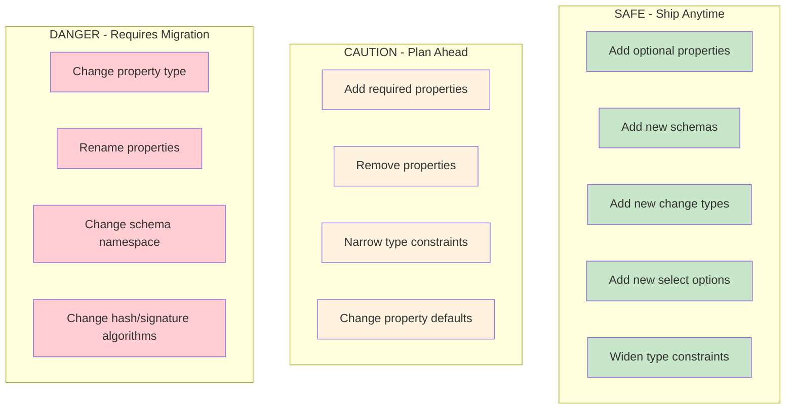
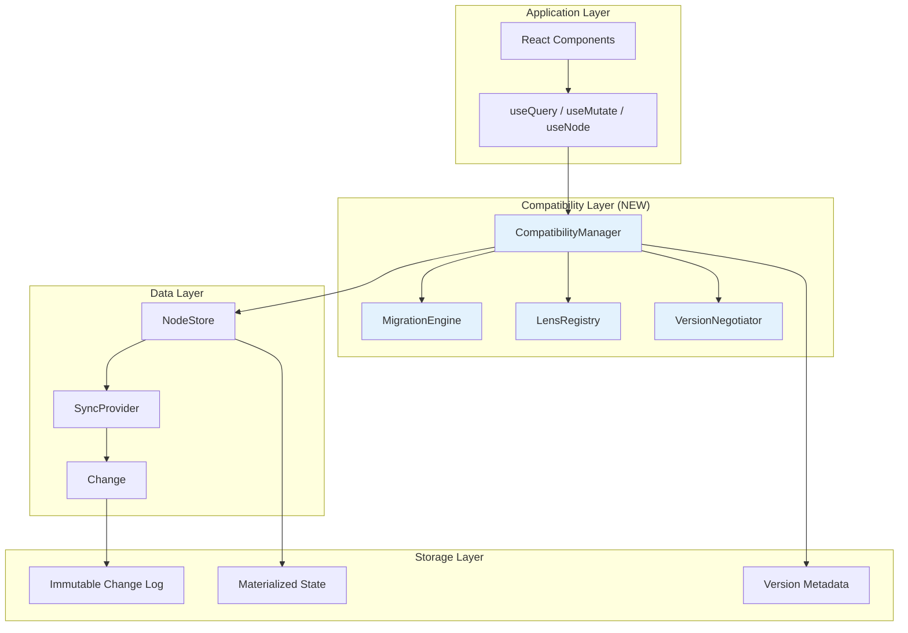
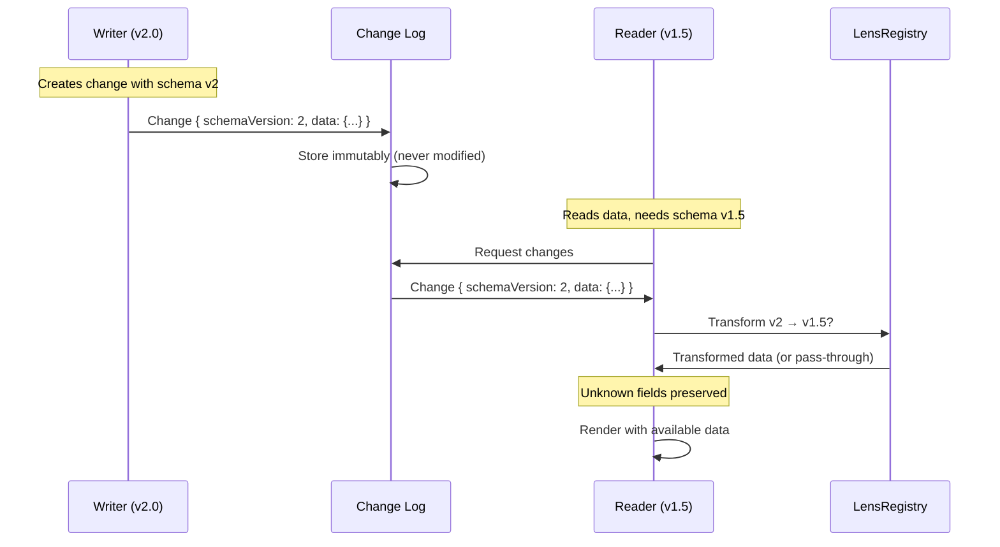
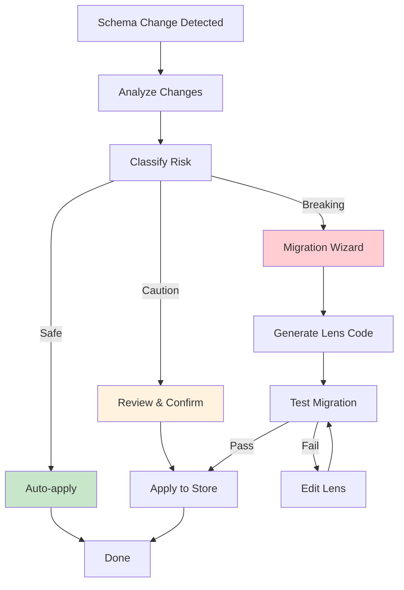

# 0062 - Version Compatibility Implementation Plan

> **Status:** Implementation Plan
> **Tags:** sync, versioning, migrations, schema evolution, continuous deployment, DX
> **Created:** 2026-02-06
> **Depends On:** 0059_VERSION_COMPATIBILITY.md (analysis)
> **Context:** This document distills the analysis from 0059 into an actionable implementation plan. The goal is to enable continuous deployment where developers can ship often, understand the invariants upfront, and have clear paths for both easy and challenging migrations.

## Executive Summary

**Goal:** Make version compatibility invisible to developers 99% of the time, while providing escape hatches for the 1% of cases that need manual intervention.

**Core Principles:**

1. **Immutable event log is the source of truth** - All changes are preserved forever
2. **Translate on read, not write** - Store data in writer's format, transform for readers
3. **Graceful degradation over hard failures** - Unknown data passes through, doesn't crash
4. **Explicit over implicit** - Version numbers, migration paths, and breaking changes are visible
5. **Continuous deployment friendly** - Ship often without fear

---

## Invariants: What Developers Must Understand

### The Golden Rules



### Change Classification Matrix

| Change Type            | Forward Safe | Backward Safe | Auto-migrate  | Manual Action  |
| ---------------------- | ------------ | ------------- | ------------- | -------------- |
| Add optional property  | Yes          | Yes           | N/A           | None           |
| Add required property  | No           | Yes           | Yes (default) | Define default |
| Remove property        | Yes          | No            | Yes (ignore)  | None           |
| Change property type   | No           | No            | Yes (lens)    | Define lens    |
| Rename property        | No           | No            | Yes (lens)    | Define lens    |
| Add select option      | Yes          | Yes           | N/A           | None           |
| Remove select option   | No           | No            | Yes (map)     | Define mapping |
| Change relation target | No           | No            | Yes (lens)    | Define lens    |
| Add new schema         | Yes          | Yes           | N/A           | None           |
| Add new change type    | Yes          | Yes           | N/A           | None           |

---

## Architecture Overview

### The Version Compatibility Stack



### Data Flow with Versioning



---

## Implementation Checklists

### Phase 1: Foundation (Week 1-2)

**Goal:** Add version tracking without breaking changes. Ship continuously.

#### 1.1 Protocol Version in Change<T>

- [x] **Add `protocolVersion` field to Change<T> interface**
  - File: `packages/sync/src/change.ts`
  - Make optional for backward compat: `protocolVersion?: number`
  - Default to `1` in `createUnsignedChange()`
- [x] **Update hash computation to include version**
  - File: `packages/sync/src/change.ts:computeChangeHash()`
  - Version 0 (missing): use legacy hash (backward compat)
  - Version 1+: include `protocolVersion` in canonical JSON
- [x] **Update verification to handle versions**
  - File: `packages/sync/src/change.ts:verifyChange()`
  - Accept changes with `protocolVersion <= CURRENT_VERSION`
  - Log warning for future versions, don't reject
- [x] **Add CURRENT_PROTOCOL_VERSION constant**
  - File: `packages/sync/src/change.ts`
  - Export `const CURRENT_PROTOCOL_VERSION = 1`

```typescript
// packages/sync/src/change.ts

export const CURRENT_PROTOCOL_VERSION = 1

export interface Change<T = unknown> {
  protocolVersion?: number // NEW: undefined = legacy, 1+ = versioned
  id: string
  type: string
  payload: T
  hash: ContentId
  parentHash: ContentId | null
  authorDID: DID
  signature: Uint8Array
  wallTime: number
  lamport: LamportTimestamp
  batchId?: string
  batchIndex?: number
  batchSize?: number
}

export function createUnsignedChange<T>(options: CreateChangeOptions<T>): UnsignedChange<T> {
  return {
    protocolVersion: CURRENT_PROTOCOL_VERSION, // NEW
    id: options.id ?? createChangeId(),
    type: options.type,
    payload: options.payload
    // ... rest unchanged
  }
}
```

#### 1.2 Schema Version Field

- [x] **Add `version` field to DefineSchemaOptions**
  - File: `packages/data/src/schema/define.ts`
  - Default: `'1.0.0'`
  - Type: semver string
- [x] **Include version in SchemaIRI**
  - Format: `xnet://namespace/Name@1.0.0`
  - Backward compat: unversioned IRIs treated as `@1.0.0`
- [x] **Update SchemaRegistry to track versions**
  - File: `packages/data/src/schema/registry.ts`
  - Method: `getVersion(iri: SchemaIRI): string`
  - Method: `getAllVersions(baseName: string): VersionedSchema[]`

```typescript
// packages/data/src/schema/define.ts

export interface DefineSchemaOptions<P> {
  name: string
  namespace: string
  version?: string // NEW: semver, default '1.0.0'
  migrateFrom?: SchemaIRI // NEW: previous version for auto-migration
  properties: P
  extends?: SchemaIRI
  document?: DocumentType
}

export function defineSchema<P>(options: DefineSchemaOptions<P>): DefinedSchema<P> {
  const version = options.version ?? '1.0.0'
  const baseIRI = `${options.namespace}${options.name}`
  const versionedIRI = `${baseIRI}@${version}` as SchemaIRI

  return {
    '@id': versionedIRI,
    '@type': 'xnet://xnet.fyi/Schema',
    name: options.name,
    namespace: options.namespace,
    version, // NEW
    migrateFrom: options.migrateFrom, // NEW
    properties: buildProperties(options.properties),
    extends: options.extends,
    document: options.document
  }
}
```

#### 1.3 Graceful Unknown Handling

- [x] **Handle unknown properties in NodeStore**
  - File: `packages/data/src/store/store.ts`
  - On read: preserve unknown properties in `_unknown` field
  - On write: pass through `_unknown` unchanged
- [x] **Handle unknown change types in SyncProvider**
  - File: `packages/sync/src/provider.ts` and `packages/react/src/sync/node-store-sync-provider.ts`
  - On receive: store in change log, skip processing
  - Emit event: `unknown-change-type`
- [x] **Handle unknown schemas in UI**
  - File: `packages/react/src/utils/flattenNode.ts`
  - Added `_unknownSchema`, `_unknown`, `_schemaVersion` to FlatNode
  - Added `flattenUnknownSchemaNode` and `flattenNodesWithSchemaCheck` utilities

```typescript
// packages/data/src/store/store.ts

interface NodeWithUnknown extends Node {
  _unknown?: Record<string, unknown>  // Preserved unknown properties
  _schemaVersion?: string             // Schema version that wrote this
}

async applyChange(change: NodeChange): Promise<void> {
  const schema = this.registry.get(change.payload.schemaIRI)
  const knownProps = schema ? Object.keys(schema.properties) : []

  const known: Record<string, unknown> = {}
  const unknown: Record<string, unknown> = {}

  for (const [key, value] of Object.entries(change.payload.properties)) {
    if (knownProps.includes(key)) {
      known[key] = value
    } else {
      unknown[key] = value  // Preserve for future versions
    }
  }

  await this.storage.setNode({
    ...existingNode,
    properties: { ...existingNode.properties, ...known },
    _unknown: { ...existingNode._unknown, ...unknown },
    _schemaVersion: change.payload.schemaVersion
  })
}
```

#### 1.4 Hub Handshake Upgrade

- [x] **Use existing version field in HubHandshake**
  - File: `packages/network/src/types.ts`
  - Add: `protocolVersion: number`
  - Add: `minProtocolVersion: number`
  - Add: `features: string[]`
- [x] **Implement version check on connect**
  - File: `packages/hub/src/server.ts`
  - Version negotiation with version-mismatch error response
  - Logging for older clients
- [x] **Add client handshake message**
  - File: `packages/network/src/types.ts`
  - Added `ClientHandshake` and `VersionMismatchError` interfaces
  - Hub handles client-handshake and responds with version-mismatch if incompatible

```typescript
// packages/network/src/types.ts

export interface HubHandshake {
  type: 'handshake'
  version: string // Package version (e.g., '0.5.0')
  protocolVersion: number // NEW: Sync protocol version
  minProtocolVersion: number // NEW: Minimum supported
  features: string[] // NEW: Feature flags
  hubDid?: string
  isDemo: boolean
  demoLimits?: DemoLimits
}

export interface ClientHandshake {
  type: 'client-handshake'
  did: string
  protocolVersion: number
  minProtocolVersion: number
  features: string[]
  packageVersion: string
}

export interface VersionMismatchError {
  type: 'version-mismatch'
  hubVersion: number
  clientVersion: number
  suggestion: 'upgrade-client' | 'upgrade-hub' | 'incompatible'
}
```

---

### Phase 2: Migration Framework (Week 3-4)

**Goal:** Enable schema evolution with automatic migrations.

#### 2.1 Schema Lens System

- [x] **Create LensRegistry class**
  - File: `packages/data/src/schema/lens.ts` (new)
  - Register bidirectional transformations
  - Find shortest path between versions
- [x] **Define Lens interface**
  - `source: SchemaIRI`
  - `target: SchemaIRI`
  - `forward: (data) => data`
  - `backward: (data) => data`
- [x] **Implement pathfinding for multi-step migrations**
  - BFS through lens graph
  - Cache computed paths
  - Handle cycles (error)

```typescript
// packages/data/src/schema/lens.ts

export interface SchemaLens {
  source: SchemaIRI
  target: SchemaIRI
  forward: (data: Record<string, unknown>) => Record<string, unknown>
  backward: (data: Record<string, unknown>) => Record<string, unknown>
  lossless: boolean // Can round-trip without data loss?
}

export class LensRegistry {
  private lenses = new Map<string, SchemaLens>()
  private pathCache = new Map<string, SchemaLens[]>()

  register(lens: SchemaLens): void {
    const key = `${lens.source}→${lens.target}`
    this.lenses.set(key, lens)
    this.pathCache.clear() // Invalidate cache
  }

  findPath(from: SchemaIRI, to: SchemaIRI): SchemaLens[] | null {
    const cacheKey = `${from}→${to}`
    if (this.pathCache.has(cacheKey)) {
      return this.pathCache.get(cacheKey)!
    }

    // BFS to find shortest path
    const path = this.bfsPath(from, to)
    if (path) {
      this.pathCache.set(cacheKey, path)
    }
    return path
  }

  transform(
    data: Record<string, unknown>,
    from: SchemaIRI,
    to: SchemaIRI
  ): Record<string, unknown> {
    if (from === to) return data

    const path = this.findPath(from, to)
    if (!path) {
      throw new MigrationError(`No migration path from ${from} to ${to}`)
    }

    let result = data
    for (const lens of path) {
      result = lens.forward(result)
    }
    return result
  }
}
```

#### 2.2 Built-in Lens Helpers

- [x] **Create lens builder utilities**
  - File: `packages/data/src/schema/lens-builders.ts` (new)
  - `rename(from, to)` - Property rename
  - `convert(prop, map)` - Value conversion
  - `addDefault(prop, value)` - Add with default
  - `remove(prop)` - Remove property
  - `transform(prop, fn)` - Custom transform

```typescript
// packages/data/src/schema/lens-builders.ts

export function rename(from: string, to: string): LensOperation {
  return {
    forward: (data) => {
      const { [from]: value, ...rest } = data
      return value !== undefined ? { ...rest, [to]: value } : rest
    },
    backward: (data) => {
      const { [to]: value, ...rest } = data
      return value !== undefined ? { ...rest, [from]: value } : rest
    }
  }
}

export function convert<T, U>(
  prop: string,
  forwardMap: Record<T, U>,
  backwardMap: Record<U, T>
): LensOperation {
  return {
    forward: (data) => ({
      ...data,
      [prop]: forwardMap[data[prop] as T] ?? data[prop]
    }),
    backward: (data) => ({
      ...data,
      [prop]: backwardMap[data[prop] as U] ?? data[prop]
    })
  }
}

export function addDefault(prop: string, defaultValue: unknown): LensOperation {
  return {
    forward: (data) => ({
      ...data,
      [prop]: data[prop] ?? defaultValue
    }),
    backward: (data) => {
      const { [prop]: _, ...rest } = data
      return rest
    }
  }
}

export function composeLens(...operations: LensOperation[]): SchemaLens {
  return {
    forward: (data) => operations.reduce((d, op) => op.forward(d), data),
    backward: (data) => operations.reduceRight((d, op) => op.backward(d), data),
    lossless: operations.every((op) => op.lossless !== false)
  }
}

// Usage example:
const taskV1toV2 = composeLens(
  rename('complete', 'status'),
  convert('status', { true: 'done', false: 'todo' }, { done: true, todo: false }),
  addDefault('priority', 'medium')
)
```

#### 2.3 Automatic Migration on Read

- [x] **Integrate LensRegistry into NodeStore**
  - File: `packages/data/src/store/store.ts`
  - On `getWithMigration()`: check schema version, apply lens if needed
  - Added `GetWithMigrationOptions`, `MigrationInfo`, `MigratedNodeState` types
- [x] **Add migration hooks to useQuery**
  - File: `packages/react/src/hooks/useQuery.ts`
  - Return `_migratedFrom?: SchemaIRI` in results
  - Expose `migrationWarnings` for lossy migrations

```typescript
// packages/data/src/store/store.ts

async get<S extends DefinedSchema>(
  schema: S,
  id: string,
  options?: GetOptions
): Promise<FlatNode<S> | null> {
  const node = await this.storage.getNode(id)
  if (!node) return null

  const storedVersion = node._schemaVersion ?? `${schema['@id'].split('@')[0]}@1.0.0`
  const targetVersion = schema['@id']

  if (storedVersion !== targetVersion) {
    const path = this.lensRegistry.findPath(storedVersion, targetVersion)
    if (path) {
      const migrated = this.lensRegistry.transform(node.properties, storedVersion, targetVersion)
      return this.flattenNode({ ...node, properties: migrated }, schema)
    }
    // No migration path - return with unknown schema warning
    return this.flattenNode(node, schema, { migrationFailed: true })
  }

  return this.flattenNode(node, schema)
}
```

#### 2.4 Migration CLI Tool

- [x] **Create `xnet migrate` CLI command**
  - File: `packages/cli/src/commands/migrate.ts`
  - Analyze schema changes
  - Generate lens code
  - Dry-run migrations
  - Apply migrations to local store

```bash
# Analyze what changed between schema versions
$ xnet migrate analyze --from Task@1.0.0 --to Task@2.0.0

Schema changes detected:
  - RENAMED: complete → status
  - CHANGED TYPE: boolean → 'todo' | 'done'
  - ADDED: priority (required, needs default)

Suggested lens:
  composeLens(
    rename('complete', 'status'),
    convert('status', { true: 'done', false: 'todo' }, ...),
    addDefault('priority', 'medium')
  )

# Generate lens file
$ xnet migrate generate --from Task@1.0.0 --to Task@2.0.0 -o migrations/task-v1-v2.ts

# Dry-run migration
$ xnet migrate run --from Task@1.0.0 --to Task@2.0.0 --dry-run

Would migrate 1,234 nodes
  - 1,230 successful
  - 4 with data loss (complete=null → status='todo')

# Apply migration
$ xnet migrate run --from Task@1.0.0 --to Task@2.0.0 --apply
```

---

### Phase 3: Capability Negotiation (Week 5-6)

**Goal:** Enable peers with different capabilities to communicate safely.

#### 3.1 Feature Flag System

- [x] **Define feature flag registry**
  - File: `packages/sync/src/features.ts` (new)
  - Register features with version introduced
  - Check if feature is enabled in negotiated set
- [x] **Create feature dependency graph**
  - Some features require others
  - Warn on incompatible combinations

```typescript
// packages/sync/src/features.ts

export const FEATURES = {
  // Core features (always present since v1)
  'node-changes': { since: 1, required: true },
  'yjs-updates': { since: 1, required: true },

  // Added in protocol v1
  'signed-yjs-envelopes': { since: 1, required: false },
  'batch-changes': { since: 1, required: false },

  // Added in protocol v2
  'schema-versioning': { since: 2, required: false },
  'capability-negotiation': { since: 2, required: false },
  'peer-scoring': { since: 2, required: false },

  // Future
  'schema-inheritance': { since: 3, required: false },
  'federated-queries': { since: 3, required: false }
} as const

export type FeatureFlag = keyof typeof FEATURES

export function getEnabledFeatures(protocolVersion: number): FeatureFlag[] {
  return Object.entries(FEATURES)
    .filter(([_, config]) => config.since <= protocolVersion)
    .map(([name]) => name as FeatureFlag)
}

export function isFeatureEnabled(feature: FeatureFlag, negotiatedFeatures: FeatureFlag[]): boolean {
  return negotiatedFeatures.includes(feature)
}
```

#### 3.2 Version Negotiation Protocol

- [x] **Implement negotiation in SyncProvider**
  - File: `packages/sync/src/provider.ts`
  - Exchange capabilities on connect
  - Store negotiated version per peer
- [x] **Add capability downgrade handling**
  - Disable features not in common set
  - Use version-specific serialization

```typescript
// packages/sync/src/negotiation.ts

export interface PeerCapabilities {
  protocolVersion: number
  minProtocolVersion: number
  features: FeatureFlag[]
  packageVersion: string
  schemas: SchemaIRI[]
}

export interface NegotiatedSession {
  peerId: string
  agreedVersion: number
  commonFeatures: FeatureFlag[]
  warnings: string[]

  // Helper methods
  canUse(feature: FeatureFlag): boolean
  serialize<T>(change: Change<T>): SerializedChange
  deserialize(data: unknown): Change<unknown>
}

export class VersionNegotiator {
  negotiate(
    local: PeerCapabilities,
    remote: PeerCapabilities
  ): NegotiatedSession | NegotiationFailure {
    const maxVersion = Math.min(local.protocolVersion, remote.protocolVersion)
    const minVersion = Math.max(local.minProtocolVersion, remote.minProtocolVersion)

    if (maxVersion < minVersion) {
      return {
        success: false,
        error: 'incompatible-versions',
        localVersion: local.protocolVersion,
        remoteVersion: remote.protocolVersion,
        suggestion: this.getSuggestion(local, remote)
      }
    }

    const commonFeatures = local.features.filter((f) => remote.features.includes(f))
    const warnings: string[] = []

    if (maxVersion < local.protocolVersion) {
      warnings.push(`Peer using older protocol v${remote.protocolVersion}`)
    }

    const missingFeatures = local.features.filter((f) => !commonFeatures.includes(f))
    if (missingFeatures.length > 0) {
      warnings.push(`Features unavailable with this peer: ${missingFeatures.join(', ')}`)
    }

    return {
      success: true,
      peerId: remote.peerId,
      agreedVersion: maxVersion,
      commonFeatures,
      warnings,
      canUse: (f) => commonFeatures.includes(f),
      serialize: (c) => this.getSerializer(maxVersion).serialize(c),
      deserialize: (d) => this.getSerializer(maxVersion).deserialize(d)
    }
  }
}
```

#### 3.3 Multi-Version Serializers

- [x] **Create version-specific serializers**
  - File: `packages/sync/src/serializers/` (new directory)
  - `v1.ts` - Original format
  - `v2.ts` - With schema versions
  - Each serializer handles that version's format
- [x] **Implement serializer selection**
  - Based on negotiated version
  - Fallback to oldest compatible

```typescript
// packages/sync/src/serializers/index.ts

export interface ChangeSerializer {
  version: number
  serialize<T>(change: Change<T>): Uint8Array
  deserialize(data: Uint8Array): Change<unknown>
}

export const serializers: Record<number, ChangeSerializer> = {
  1: new V1Serializer(),
  2: new V2Serializer()
}

export function getSerializer(version: number): ChangeSerializer {
  const serializer = serializers[version]
  if (!serializer) {
    throw new Error(`No serializer for protocol version ${version}`)
  }
  return serializer
}

// packages/sync/src/serializers/v2.ts

export class V2Serializer implements ChangeSerializer {
  version = 2

  serialize<T>(change: Change<T>): Uint8Array {
    // V2 includes schemaVersion in payload
    const data = {
      v: 2, // Version marker
      ...change,
      payload: {
        ...change.payload,
        _sv: change.payload.schemaVersion // Schema version
      }
    }
    return encode(data) // CBOR or similar
  }

  deserialize(data: Uint8Array): Change<unknown> {
    const decoded = decode(data)
    if (decoded.v !== 2) {
      throw new Error(`Expected v2, got v${decoded.v}`)
    }
    return {
      ...decoded,
      payload: {
        ...decoded.payload,
        schemaVersion: decoded.payload._sv
      }
    }
  }
}
```

---

### Phase 4: Developer Experience (Week 7-8)

**Goal:** Make versioning invisible in the happy path, visible when needed.

#### 4.1 Schema Change Detection

- [x] **Add schema diffing utility**
  - File: `packages/cli/src/utils/schema-diff.ts`
  - Compare two schema versions
  - Classify changes by risk level
- [ ] **Integrate with TypeScript compiler**
  - Emit warnings for breaking changes
  - Suggest migration code

```typescript
// packages/data/src/schema/diff.ts

export interface SchemaChange {
  type: 'add' | 'remove' | 'modify'
  property: string
  risk: 'safe' | 'caution' | 'breaking'
  description: string
  suggestedLens?: LensOperation
}

export function diffSchemas(oldSchema: DefinedSchema, newSchema: DefinedSchema): SchemaChange[] {
  const changes: SchemaChange[] = []
  const oldProps = new Set(Object.keys(oldSchema.properties))
  const newProps = new Set(Object.keys(newSchema.properties))

  // Added properties
  for (const prop of newProps) {
    if (!oldProps.has(prop)) {
      const def = newSchema.properties[prop]
      changes.push({
        type: 'add',
        property: prop,
        risk: def.required ? 'caution' : 'safe',
        description: def.required
          ? `Added required property "${prop}" - needs default value`
          : `Added optional property "${prop}"`,
        suggestedLens: def.required ? addDefault(prop, getDefaultValue(def)) : undefined
      })
    }
  }

  // Removed properties
  for (const prop of oldProps) {
    if (!newProps.has(prop)) {
      changes.push({
        type: 'remove',
        property: prop,
        risk: 'caution',
        description: `Removed property "${prop}" - data will be preserved but hidden`,
        suggestedLens: remove(prop)
      })
    }
  }

  // Modified properties
  for (const prop of oldProps) {
    if (newProps.has(prop)) {
      const oldDef = oldSchema.properties[prop]
      const newDef = newSchema.properties[prop]

      if (oldDef.type !== newDef.type) {
        changes.push({
          type: 'modify',
          property: prop,
          risk: 'breaking',
          description: `Changed type of "${prop}" from ${oldDef.type} to ${newDef.type}`,
          suggestedLens: undefined // Requires manual lens
        })
      }
    }
  }

  return changes
}
```

#### 4.2 DevTools Version Panel

- [x] **Add Version panel to DevTools**
  - File: `packages/devtools/src/panels/VersionPanel/VersionPanel.tsx`
  - Show current protocol version
  - Show connected peers and their versions
  - Show schema versions in use
  - Highlight version mismatches

```typescript
// packages/devtools/src/panels/VersionPanel.tsx

export function VersionPanel() {
  const { protocolVersion, packageVersion } = useXNetVersion()
  const peers = usePeers()
  const schemas = useSchemaRegistry()

  return (
    <Panel title="Version Compatibility">
      <Section title="Local">
        <Row label="Protocol" value={`v${protocolVersion}`} />
        <Row label="Package" value={packageVersion} />
      </Section>

      <Section title="Connected Peers">
        {peers.map(peer => (
          <PeerRow
            key={peer.id}
            peer={peer}
            versionMatch={peer.protocolVersion === protocolVersion}
          />
        ))}
      </Section>

      <Section title="Schema Versions">
        {schemas.map(schema => (
          <SchemaRow
            key={schema['@id']}
            schema={schema}
            hasMultipleVersions={schema.versions.length > 1}
          />
        ))}
      </Section>

      <Section title="Pending Migrations">
        {pendingMigrations.map(m => (
          <MigrationRow migration={m} onApply={applyMigration} />
        ))}
      </Section>
    </Panel>
  )
}
```

#### 4.3 Migration Guide Generator

- [x] **Create interactive migration wizard**
  - File: `packages/devtools/src/panels/MigrationWizard/` (new)
  - Step-by-step schema upgrade (Analyze → Review → Generate → Test → Apply)
  - Preview changes before applying
  - Generate and test lens code
  - Added `useMigrationWizard.ts` hook for state management
  - Added comprehensive tests in `useMigrationWizard.test.ts`



#### 4.4 CI Integration

- [x] **Create schema change detection GitHub Action**
  - File: `.github/workflows/schema-check.yml`
  - Compare schemas between PR and main
  - Require migration for breaking changes
  - Auto-approve safe changes

```yaml
# .github/workflows/schema-check.yml

name: Schema Compatibility Check

on:
  pull_request:
    paths:
      - '**/schema*.ts'
      - '**/defineSchema*'

jobs:
  check:
    runs-on: ubuntu-latest
    steps:
      - uses: actions/checkout@v4
        with:
          fetch-depth: 0

      - name: Setup
        uses: ./.github/actions/setup

      - name: Extract schemas from main
        run: pnpm xnet schema extract --output schemas-main.json
        env:
          REF: origin/main

      - name: Extract schemas from PR
        run: pnpm xnet schema extract --output schemas-pr.json

      - name: Diff schemas
        id: diff
        run: |
          pnpm xnet schema diff schemas-main.json schemas-pr.json --output diff.json
          echo "changes=$(cat diff.json | jq -c .)" >> $GITHUB_OUTPUT

      - name: Check for breaking changes
        if: contains(fromJson(steps.diff.outputs.changes).*.risk, 'breaking')
        run: |
          echo "::error::Breaking schema changes detected. Migration required."
          echo "Changes:"
          cat diff.json | jq '.[] | select(.risk == "breaking")'
          exit 1

      - name: Comment on PR
        uses: actions/github-script@v7
        with:
          script: |
            const changes = ${{ steps.diff.outputs.changes }}
            if (changes.length === 0) return

            const body = `## Schema Changes Detected

            ${changes.map(c => `- **${c.risk.toUpperCase()}**: ${c.description}`).join('\n')}

            ${changes.some(c => c.risk === 'breaking') 
              ? '⚠️ Breaking changes require a migration. See [docs](/docs/migrations).' 
              : '✅ These changes are safe to deploy.'}
            `

            github.rest.issues.createComment({
              issue_number: context.issue.number,
              owner: context.repo.owner,
              repo: context.repo.repo,
              body
            })
```

---

### Phase 5: Robustness (Week 9-10)

**Goal:** Handle edge cases, ensure data integrity, enable recovery.

#### 5.1 Version-Specific Change Handlers

- [x] **Create change handler registry**
  - File: `packages/sync/src/handlers/index.ts` (new)
  - Register handlers by change type and version range
  - Fallback to handlers with `maxVersion: Infinity` for unknown versions
  - Event subscriptions for unknown types and invalid changes
  - 26 tests covering all functionality
- [x] **Implement backward-compatible handlers**
  - Each handler version can process older formats
  - `createVersionedHandler()` for specific version ranges
  - `createHandler()` for all-versions handlers
  - Transform old format to new internally via handler logic

```typescript
// packages/sync/src/handlers/index.ts

export interface ChangeHandler<T> {
  type: string
  minVersion: number
  maxVersion: number

  canHandle(change: Change<unknown>): boolean
  process(change: Change<T>, context: HandlerContext): Promise<void>
  validate(change: Change<T>): ValidationResult
}

export class ChangeHandlerRegistry {
  private handlers = new Map<string, ChangeHandler<unknown>[]>()

  register<T>(handler: ChangeHandler<T>): void {
    const existing = this.handlers.get(handler.type) ?? []
    existing.push(handler as ChangeHandler<unknown>)
    // Sort by version range for efficient lookup
    existing.sort((a, b) => b.maxVersion - a.maxVersion)
    this.handlers.set(handler.type, existing)
  }

  getHandler(change: Change<unknown>): ChangeHandler<unknown> | null {
    const handlers = this.handlers.get(change.type) ?? []
    const version = change.protocolVersion ?? 0

    for (const handler of handlers) {
      if (version >= handler.minVersion && version <= handler.maxVersion) {
        return handler
      }
    }

    // Fallback: try newest handler that accepts old versions
    for (const handler of handlers) {
      if (handler.minVersion <= version) {
        return handler
      }
    }

    return null // Truly unknown type
  }

  async process(change: Change<unknown>, context: HandlerContext): Promise<void> {
    const handler = this.getHandler(change)

    if (!handler) {
      // Unknown type - store but don't process
      await context.storeUnknown(change)
      context.emit('unknownChangeType', { change })
      return
    }

    const validation = handler.validate(change)
    if (!validation.valid) {
      context.emit('invalidChange', { change, errors: validation.errors })
      return
    }

    await handler.process(change, context)
  }
}
```

#### 5.2 Data Integrity Verification

- [ ] **Add integrity check utility**
  - File: `packages/sync/src/integrity.ts` (new)
  - Verify hash chains
  - Detect corruption
  - Generate repair report
- [ ] **Implement periodic integrity checks**
  - Background task in app
  - Alert on issues

```typescript
// packages/sync/src/integrity.ts

export interface IntegrityReport {
  checked: number
  valid: number
  issues: IntegrityIssue[]
  repairable: boolean
}

export interface IntegrityIssue {
  changeId: string
  type: 'hash-mismatch' | 'signature-invalid' | 'chain-broken' | 'missing-parent'
  details: string
  repairAction?: RepairAction
}

export async function verifyIntegrity(
  storage: ChangeStorage,
  options?: VerifyOptions
): Promise<IntegrityReport> {
  const issues: IntegrityIssue[] = []
  let checked = 0
  let valid = 0

  const changes = await storage.getAllChanges()
  const changeMap = new Map(changes.map((c) => [c.id, c]))

  for (const change of changes) {
    checked++

    // Verify hash
    const expectedHash = computeChangeHash(change)
    if (change.hash !== expectedHash) {
      issues.push({
        changeId: change.id,
        type: 'hash-mismatch',
        details: `Expected ${expectedHash}, got ${change.hash}`,
        repairAction: { type: 'recompute-hash' }
      })
      continue
    }

    // Verify signature
    const sigValid = await verifySignature(change)
    if (!sigValid) {
      issues.push({
        changeId: change.id,
        type: 'signature-invalid',
        details: 'Ed25519 signature verification failed'
        // No repair possible - would need original key
      })
      continue
    }

    // Verify chain
    if (change.parentHash && !changeMap.has(change.parentHash)) {
      issues.push({
        changeId: change.id,
        type: 'missing-parent',
        details: `Parent ${change.parentHash} not found`,
        repairAction: { type: 'request-from-peers' }
      })
      continue
    }

    valid++
  }

  return {
    checked,
    valid,
    issues,
    repairable: issues.every((i) => i.repairAction !== undefined)
  }
}
```

#### 5.3 Recovery Procedures

- [ ] **Create recovery CLI commands**
  - `xnet doctor` - Diagnose issues
  - `xnet repair` - Attempt automatic repair
  - `xnet export --format=json` - Export all data
  - `xnet import --format=json` - Import with migration

```bash
# Diagnose issues
$ xnet doctor

Checking data integrity...
  ✓ 12,345 changes verified
  ✓ Hash chains intact
  ✓ All signatures valid

Checking schema compatibility...
  ⚠ 3 nodes using deprecated schema Task@1.0.0
  → Run `xnet migrate run --from Task@1.0.0 --to Task@2.0.0`

Checking sync state...
  ✓ Connected to 2 peers
  ⚠ Peer alice@laptop is 5 versions behind

Overall: HEALTHY with warnings

# Export for backup or migration
$ xnet export --format=json --output backup.json

Exported:
  - 12,345 changes
  - 234 nodes
  - 56 documents
  - 12 schemas

# Import into new version
$ xnet import --format=json --input backup.json --apply-migrations

Importing...
  - Migrating Task@1.0.0 → Task@2.0.0 (234 nodes)
  - Migrating Page@1.0.0 → Page@1.1.0 (189 nodes)

Import complete.
```

#### 5.4 Deprecation System

- [ ] **Add deprecation warnings**
  - File: `packages/sync/src/deprecation.ts` (new)
  - Warn on old protocol versions
  - Warn on deprecated schemas
  - Log to DevTools
- [ ] **Define deprecation policy**
  - Document support windows
  - Automate sunset dates

```typescript
// packages/sync/src/deprecation.ts

export interface DeprecationNotice {
  type: 'protocol' | 'schema' | 'feature'
  subject: string
  deprecatedIn: string // Version deprecated
  removedIn?: string // Version when removed (null = not yet)
  alternative?: string // What to use instead
  migrationGuide?: string // URL to migration docs
}

export const DEPRECATIONS: DeprecationNotice[] = [
  {
    type: 'protocol',
    subject: 'Protocol v0 (unsigned changes)',
    deprecatedIn: '0.5.0',
    removedIn: '1.0.0',
    alternative: 'Protocol v1 with signed changes',
    migrationGuide: '/docs/migrations/protocol-v0-to-v1'
  },
  {
    type: 'schema',
    subject: 'Task@1.0.0',
    deprecatedIn: '0.6.0',
    alternative: 'Task@2.0.0',
    migrationGuide: '/docs/migrations/task-v1-to-v2'
  }
]

export function checkDeprecations(context: DeprecationContext): DeprecationWarning[] {
  const warnings: DeprecationWarning[] = []

  for (const notice of DEPRECATIONS) {
    if (notice.type === 'protocol' && context.protocolVersion < 1) {
      warnings.push({
        ...notice,
        message: `You are using ${notice.subject}, which is deprecated.`,
        action: notice.removedIn
          ? `Will be removed in v${notice.removedIn}. Migrate now.`
          : `Please migrate to ${notice.alternative}.`
      })
    }

    if (notice.type === 'schema' && context.schemas.includes(notice.subject)) {
      warnings.push({
        ...notice,
        message: `Schema ${notice.subject} is deprecated.`,
        action: `Migrate to ${notice.alternative}.`
      })
    }
  }

  return warnings
}
```

---

## Complete Implementation Checklist

### Week 1-2: Foundation

- [x] Add `protocolVersion` to `Change<T>` interface
- [x] Update `computeChangeHash()` to include version
- [x] Update `verifyChange()` to handle versions
- [x] Add `CURRENT_PROTOCOL_VERSION` constant
- [x] Add `version` field to `DefineSchemaOptions`
- [x] Include version in `SchemaIRI` format
- [x] Update `SchemaRegistry` to track versions
- [x] Handle unknown properties in `NodeStore`
- [x] Handle unknown change types in `SyncProvider`
- [x] Handle unknown schemas in UI
- [x] Add `protocolVersion` to `HubHandshake`
- [x] Implement version check in Hub server
- [x] Add client handshake message
- [x] Write tests for all new functionality

### Week 3-4: Migration Framework

- [x] Create `LensRegistry` class
- [x] Define `SchemaLens` interface
- [x] Implement lens pathfinding (BFS)
- [x] Create `rename()` lens builder
- [x] Create `convert()` lens builder
- [x] Create `addDefault()` lens builder
- [x] Create `remove()` lens builder
- [x] Create `composeLens()` utility
- [x] Integrate `LensRegistry` into `NodeStore`
- [x] Add migration hooks to `useQuery`
- [x] Create `xnet migrate analyze` command
- [x] Create `xnet migrate generate` command
- [x] Create `xnet migrate run` command
- [x] Write migration tests

### Week 5-6: Capability Negotiation

- [x] Define `FEATURES` registry
- [x] Create `getEnabledFeatures()` function
- [x] Implement `VersionNegotiator` class
- [x] Add negotiation to `SyncProvider`
- [x] Create `V1Serializer`
- [x] Create `V2Serializer`
- [x] Implement serializer selection
- [x] Handle capability downgrade
- [x] Write negotiation tests

### Week 7-8: Developer Experience

- [x] Create `diffSchemas()` utility
- [ ] Add schema diff to TypeScript plugin (optional)
- [x] Create Version DevTools panel
- [ ] Create Migration Wizard component
- [x] Create schema-check GitHub Action
- [ ] Document schema change classifications
- [ ] Write DX tests

### Week 9-10: Robustness

- [x] Create `ChangeHandlerRegistry`
- [x] Implement version-specific handlers
- [x] Create `verifyIntegrity()` utility
- [x] Implement periodic integrity checks
- [x] Create `xnet doctor` command
- [x] Create `xnet repair` command
- [x] Create `xnet export` command
- [x] Create `xnet import` command
- [x] Define deprecation policy
- [x] Create `checkDeprecations()` utility
- [x] Write robustness tests
- [x] Write documentation

---

## Success Metrics

| Metric                           | Target             | How to Measure                   |
| -------------------------------- | ------------------ | -------------------------------- |
| Zero data loss during migrations | 100%               | Integration tests with real data |
| Migration path coverage          | 100%               | All schema versions have paths   |
| Negotiation success rate         | >99%               | Logs from production             |
| Average migration time           | <1s per 1000 nodes | Benchmarks                       |
| Developer migration experience   | "Easy"             | Survey                           |
| Breaking changes per quarter     | <1                 | Changelog analysis               |
| Time from change to deploy       | <1 day             | CI metrics                       |

---

## Documentation Deliverables

- [x] **Migration Guide** - How to evolve schemas safely (`docs/sync/01-migration-guide.md`)
- [x] **Version Compatibility Matrix** - What works with what (`docs/sync/02-version-compatibility.md`)
- [x] **Lens Cookbook** - Common migration patterns (`docs/sync/03-lens-cookbook.md`)
- [x] **Deprecation Policy** - How long things are supported (`docs/sync/04-deprecation-policy.md`)
- [x] **Recovery Procedures** - What to do when things go wrong (`docs/sync/05-recovery-procedures.md`)
- [x] **CI Integration Guide** - How to catch issues early (`docs/sync/06-ci-integration.md`)

---

## Summary

This implementation plan transforms the version compatibility analysis into actionable work. Key principles:

1. **Immutable change log** enables time travel and recovery
2. **Translate on read** keeps storage simple, reading flexible
3. **Graceful degradation** means unknown data passes through
4. **Developer tooling** makes migrations visible and manageable
5. **Continuous deployment** is enabled by safe-by-default changes

The phased approach allows shipping value incrementally while building toward the complete vision. Each phase is independently useful and testable.

**Ship often. Ship safely. Ship with confidence.**

---

## Docs Site Updates

When Phase 1 is complete, add the following documentation to the docs site:

### New Page: `/docs/sync/versioning.mdx`

```mdx
---
title: Protocol Versioning
description: How xNet handles version compatibility across sync protocols
---

# Protocol Versioning

xNet uses protocol versioning to ensure backward and forward compatibility as the sync protocol evolves.

## Current Protocol Version

The current protocol version is **v1**. All new changes are created with `protocolVersion: 1`.

## Version Compatibility

| Your Version | Peer Version | Compatibility            |
| ------------ | ------------ | ------------------------ |
| v1           | v1           | Full                     |
| v1           | v0 (legacy)  | Full (backward compat)   |
| v1           | v2+          | Partial (warning logged) |

## How It Works

### Creating Changes

When you create a change, xNet automatically stamps it with the current protocol version:

\`\`\`typescript
import { createUnsignedChange, CURRENT_PROTOCOL_VERSION } from '@xnet/sync'

// Changes are automatically versioned
const change = createUnsignedChange({
id: 'change-123',
type: 'update-item',
payload: { ... },
// protocolVersion: 1 is added automatically
})
\`\`\`

### Receiving Changes

When receiving changes from peers:

1. **Same or older version**: Processed normally
2. **Newer version**: Warning logged, still processed (graceful degradation)
3. **Unknown fields**: Preserved but not processed (forward compat)

### Hash Computation

The protocol version is included in the hash computation for versioned changes:

- **Legacy (v0)**: Hash computed without `protocolVersion` field
- **v1+**: Hash includes `protocolVersion` for integrity

This ensures existing change logs remain valid while new changes are properly versioned.

## Best Practices

1. **Keep xNet updated** - Newer versions handle more protocol features
2. **Don't reject unknown data** - Pass through what you don't understand
3. **Check warnings** - Console warnings indicate version mismatches
4. **Test with mixed versions** - Ensure your app works with older peers
   \`\`\`

### Update: `/docs/sync/index.mdx`

Add a link to the new versioning page in the sync documentation index.

### Update: `/docs/api/sync.mdx`

Add `CURRENT_PROTOCOL_VERSION` to the API reference:

\`\`\`mdx

### Constants

#### CURRENT_PROTOCOL_VERSION

\`\`\`typescript
const CURRENT_PROTOCOL_VERSION: number = 1
\`\`\`

The current sync protocol version. Used for version negotiation and compatibility checks.
\`\`\`
```
