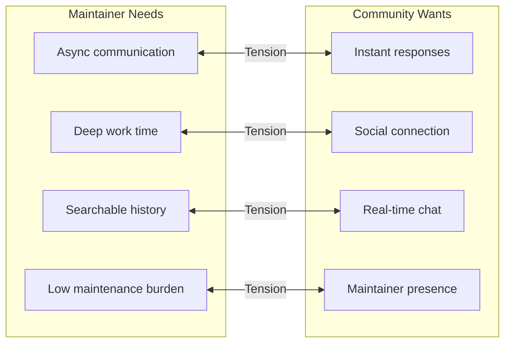
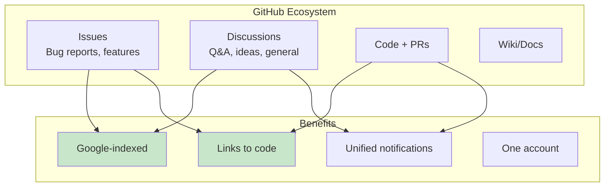
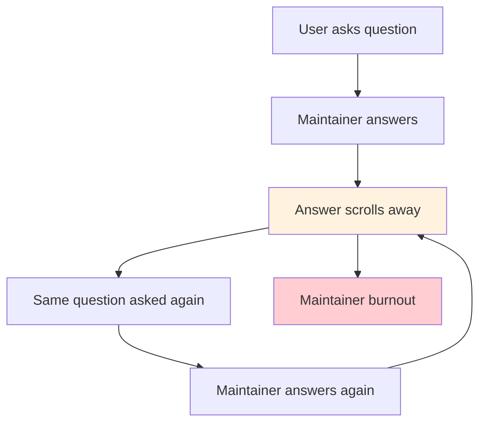
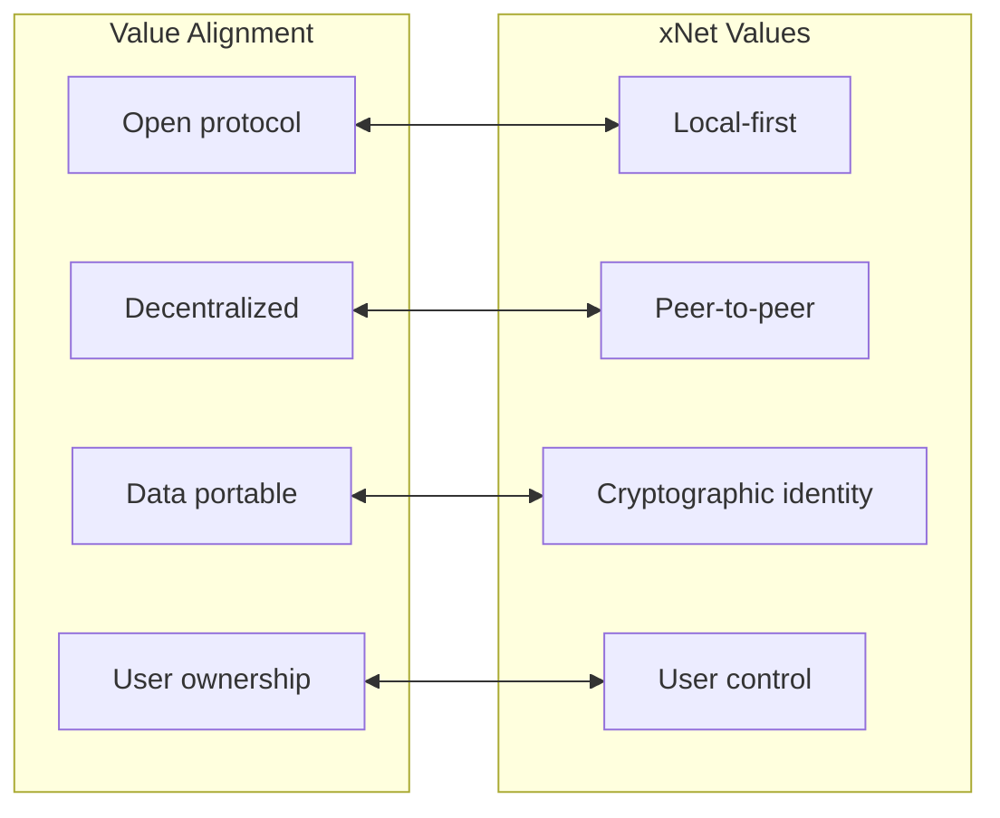
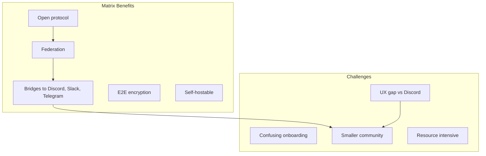
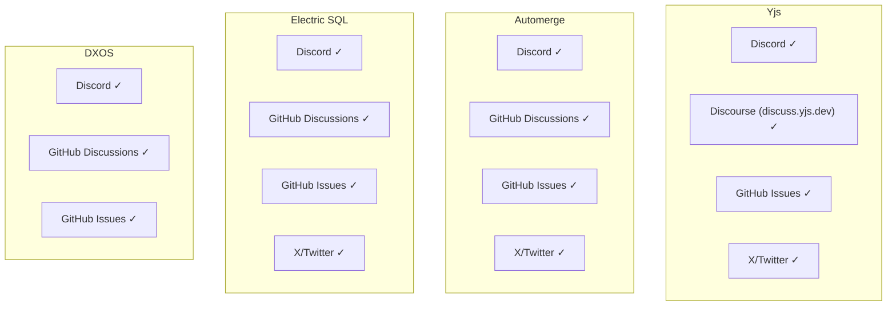
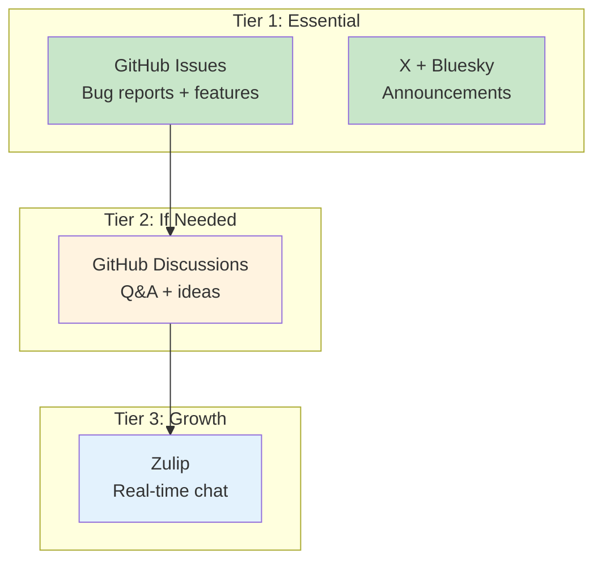

# 0063 - Community Communication Tools

> **Status:** Exploration
> **Tags:** community, Discord, GitHub, X, Bluesky, Reddit, communication, maintainer-experience
> **Created:** 2026-02-06
> **Context:** xNet needs a community presence. The question is: how minimal can we go while still serving developers and users effectively? This exploration analyzes the landscape of community tools, how other local-first/OSS projects use them, and recommends an approach that respects both maintainer sanity and community needs.

## Executive Summary

**My recommendation: GitHub + X + Bluesky. That's it.**

The local-first OSS ecosystem is heavily Discord-dependent, but Discord is a trap for solo/small-team maintainers. It creates unsustainable real-time expectations, loses knowledge to chat entropy, and contradicts local-first values (centralized, closed, ephemeral).

If community demand grows, add **GitHub Discussions** first (async, searchable, integrated), then consider **Zulip** for real-time if truly needed.

---

## The Core Tension



The platforms that are best for community engagement (Discord, Slack) are worst for maintainer wellbeing. The platforms that preserve knowledge (GitHub, Discourse) feel "less alive" to users.

---

## Platform Deep Dive

### GitHub (Issues + Discussions)

**What it is:** Native GitHub features for project communication.

**How local-first projects use it:**
| Project | Issues | Discussions | Notes |
|---------|--------|-------------|-------|
| Automerge | Yes | Yes | Active Q&A, announcements |
| DXOS | Yes | Yes | Support, ideas, show & tell |
| Electric SQL | Yes | Yes | Primary async support |
| Yjs | Yes | No | Uses external Discourse |

**Why it works:**



**Pros:**

- Searchable by Google (answers live forever)
- Integrated with issues/PRs (context stays together)
- No new account for developers
- Async-first (no real-time pressure)
- Free, included with repo

**Cons:**

- Less "community" feeling
- No real-time chat
- Mobile experience is mediocre
- Notification UX blends with code notifications

**Verdict:** Should be the **foundation** regardless of what else you add.

---

### Discord

**What it is:** Real-time chat with channels, voice, and rich media.

**How local-first projects use it:**
| Project | Discord | Members | Primary Use |
|---------|---------|---------|-------------|
| Yjs | Yes | Active | Support, collaboration |
| Automerge | Yes | Active | Primary community hub |
| DXOS | Yes | 800+ | Support, announcements |
| Jazz | Yes | Active | Primary support |
| Electric SQL | Yes | Active | Community + support |

**The Discord Fatigue Problem:**



**What maintainers say:**

> "When we made the switch to Zulip a few months ago for chat, never in my wildest dreams did I imagine it was going to become the beating heart of the community." — Dan Allen, Asciidoctor (on leaving Discord)

> "Zulip's threading model is _fantastic_ and _game-changing_, and you are doing your community a disservice if you choose Slack or Discord over Zulip." — Juan Nunez-Iglesias, napari/scikit-image

**The Discord Trap:**

1. **Real-time expectations** — Users expect instant responses
2. **Knowledge loss** — Answers aren't searchable/findable
3. **FOMO** — Miss a conversation, lose context
4. **Notification fatigue** — Constant pings
5. **Closed platform** — No data export, no federation, no ownership

**Why projects use it anyway:**

- Network effects (developers already there)
- Free for unlimited users
- Rich features (voice, bots, roles)
- "It's where the community is"

**The Irony:**
Discord embodies everything local-first opposes:

- Centralized (Discord Inc. owns everything)
- Cloud-only (no offline, no local-first)
- Ephemeral (messages disappear from practical access)
- Closed (no export, no interop)

**Verdict:** Avoid unless community pressure is overwhelming. If forced, limit scope (announcements only, link to GitHub for support).

---

### X (Twitter)

**What it is:** Microblogging platform, still dominant for tech announcements.

**Current state:**

- Largest reach for developer announcements
- Many OSS maintainers have existing audiences
- Algorithm changes reduced organic reach
- Developer sentiment has declined post-acquisition
- Still monitored by tech journalists

**How to use it well:**

```
DO:
- Announce releases
- Share interesting insights
- Link to blog posts/docs
- Cross-post to Bluesky

DON'T:
- Provide support (link to GitHub)
- Engage in drama
- Expect high engagement on technical content
```

**Verdict:** **Use for announcements**. Cross-post everything to Bluesky. Don't use for support.

---

### Bluesky (AT Protocol)

**What it is:** Decentralized social network built on AT Protocol.

**Why it matters for local-first:**



**Current adoption:**

- 40+ million users (growing)
- Strong developer/early-adopter community
- 330+ apps building on AT Protocol
- Chronological timeline (posts get seen)
- No algorithmic suppression

**Who's there:**

- AT Protocol team (@atproto.com)
- Many OSS maintainers migrated from X
- Local-first/decentralization community
- Tech early adopters

**Verdict:** **Adopt now**. Aligns with values, growing audience, low effort.

---

### Reddit

**What it is:** Forum-style platform with subreddit communities.

**Relevant subreddits:**
| Subreddit | Members | Relevance |
|-----------|---------|-----------|
| r/localfirst | ~2,900 | Direct audience |
| r/selfhosted | 762,000 | Strong overlap |
| r/opensource | Large | General awareness |
| r/programming | Massive | Announcements |

**r/localfirst:**

- Active community, regular posts
- Mix of announcements, questions, articles
- Good discoverability via search
- Low maintainer burden

**r/selfhosted:**

- Massive community (762k)
- Strong privacy/ownership values
- Strict anti-spam rules
- "Vibe Code Friday" for AI-assisted projects
- Good for launch announcements

**How to use it:**

```
DO:
- Post major releases
- Engage authentically in discussions
- Answer questions when relevant
- Use for discoverability

DON'T:
- Spam with every update
- Use as primary support channel
- Self-promote excessively
```

**Verdict:** **Worth occasional engagement**. Post major releases, engage authentically. Not a community to "maintain" — just participate.

---

### GitHub Discussions

**What it is:** Built-in forum feature for GitHub repos.

**Categories available:**

- **Announcements** — Release notes, updates
- **Q&A** — Questions with accepted answers
- **Ideas** — Feature requests
- **Show and Tell** — Community projects
- **General** — Everything else

**Comparison to Discord:**

| Aspect              | GitHub Discussions | Discord |
| ------------------- | ------------------ | ------- |
| Searchable          | Google indexes     | No      |
| Async               | Yes                | No      |
| Threaded            | Yes                | Minimal |
| Code integration    | Native             | None    |
| Real-time           | No                 | Yes     |
| Community feel      | Low                | High    |
| Maintainer burden   | Low                | High    |
| Knowledge retention | High               | Low     |

**Verdict:** **Enable if demand grows**. Better than Discord for Q&A, but don't pre-optimize.

---

### Telegram

**What it is:** Mobile-first chat app, dominant in crypto/Web3.

**Who uses it:**

- Crypto/token communities
- International projects (strong in Asia, Eastern Europe)
- Privacy-focused projects
- Mobile-first projects

**Why crypto likes it:**

- Mobile-first UX
- Large group support (200k members)
- Bot ecosystem (trading, price alerts)
- Privacy features
- Already where crypto natives are

**Why OSS doesn't:**

- Linear chat (no threading)
- Poor search
- Not developer-focused
- Spam/scam problems
- Content moderation challenges

**Verdict:** **Skip** unless targeting crypto audience specifically.

---

### Matrix/Element

**What it is:** Open, federated chat protocol with bridges to other platforms.

**Who uses it:**

- Mozilla (primary platform)
- KDE, GNOME, Fedora
- Privacy-focused projects
- OSS purists

**Value proposition:**



**The bridge ecosystem:**

- Discord (multiple bridges)
- Slack, Telegram, IRC
- WhatsApp, Signal, iMessage

**Verdict:** **Consider for the future**. Great for values alignment, but network effects matter. Could bridge to Discord if forced to have one.

---

### Zulip

**What it is:** Chat with topics-based threading (streams → topics).

**Who uses it:**
| Organization | Size | Why |
|--------------|------|-----|
| Rust Language | Large | Governance, development |
| Lean Prover | Research | Academic community |
| Asciidoctor | OSS | Replaced Discord |
| Recurse Center | 500+ | Developer community |
| Lichess | ~100 | Team communication |

**The threading model:**

```
Stream: #development
├── Topic: RFC: New sync protocol
│   ├── Message 1: Proposal
│   ├── Message 2: Feedback
│   └── Message 3: Resolution
├── Topic: Bug in hash computation
│   └── ...
└── Topic: Release 0.5.0 planning
    └── ...
```

**Why Rust chose Zulip:**

> "Rust development would not be moving at the pace that it has been without Zulip." — Josh Triplett, Rust Language team co-lead

**Key features:**

- **Topics are first-class** — Not afterthought threads
- **Catch up easily** — See all topics, read what matters
- **Searchable** — Full history, good search
- **Free for OSS** — Zulip Cloud Standard
- **Self-hostable** — MIT licensed

**Verdict:** **Best real-time option if needed**. Way better than Discord for async-friendly communities.

---

### Slack

**What it is:** Enterprise chat, once popular in OSS.

**Why OSS abandoned it:**

1. **90-day message limit** on free plan
2. **$7.25+/user/month** for archive
3. **Knowledge loss** — Messages disappear
4. **Closed platform** — No export on free

**Who still uses it:**

- Enterprise-backed OSS (CNCF projects)
- Commercial OSS with paying customers
- Legacy communities

**Verdict:** **Hard no**. Worse than Discord (costs more, same problems).

---

### Discourse (Forum Software)

**What it is:** Modern forum software (self-hosted or hosted).

**Example: Yjs uses discuss.yjs.dev**

- Searchable, permanent archive
- Complex technical discussions
- Email notifications
- Trust levels for moderation
- Better than mailing lists

**Verdict:** **Overkill for now**. Consider if GitHub Discussions isn't enough.

---

## Comparison Matrix

### By Maintainer Impact

| Platform           | Time Required | Burnout Risk | Knowledge Retention |
| ------------------ | ------------- | ------------ | ------------------- |
| GitHub Issues      | Low           | Low          | High                |
| GitHub Discussions | Low           | Low          | High                |
| X/Bluesky          | Low           | Low          | Medium              |
| Reddit             | Low           | Low          | Medium              |
| Discord            | High          | High         | Low                 |
| Telegram           | High          | High         | Low                 |
| Zulip              | Medium        | Low          | High                |
| Matrix             | Medium        | Medium       | High                |
| Discourse          | Medium        | Low          | High                |

### By Community Experience

| Platform           | Real-time | Social Feel | Discovery | Onboarding |
| ------------------ | --------- | ----------- | --------- | ---------- |
| GitHub Issues      | No        | Low         | High      | Easy       |
| GitHub Discussions | No        | Medium      | High      | Easy       |
| X/Bluesky          | Semi      | Medium      | High      | Easy       |
| Reddit             | No        | High        | High      | Easy       |
| Discord            | Yes       | High        | Low       | Easy       |
| Telegram           | Yes       | Medium      | Low       | Easy       |
| Zulip              | Yes       | Medium      | Low       | Medium     |
| Matrix             | Yes       | Medium      | Low       | Hard       |
| Discourse          | No        | Medium      | High      | Medium     |

### By Values Alignment (Local-First)

| Platform | Open | Decentralized | Data Ownership | Offline |
| -------- | ---- | ------------- | -------------- | ------- |
| GitHub   | No   | No            | No             | No      |
| Discord  | No   | No            | No             | No      |
| Telegram | No   | No            | No             | No      |
| Reddit   | No   | No            | No             | No      |
| X        | No   | No            | No             | No      |
| Bluesky  | Yes  | Yes           | Yes            | No      |
| Matrix   | Yes  | Yes           | Yes            | No      |
| Zulip    | Yes  | Self-host     | Yes            | No      |

---

## What Other Local-First Projects Do



**Pattern observed:** Everyone uses Discord + GitHub. Everyone probably wishes they didn't have Discord.

---

## Sentiment Analysis

### Discord

**Positive sentiment:**

- "It's where the community already is"
- "Real-time help is valuable for onboarding"
- "Voice channels are great for pairing"

**Negative sentiment:**

- "I burn out answering the same questions"
- "Knowledge gets lost"
- "I can't keep up with all the channels"
- "It contradicts our local-first values"

### GitHub Discussions

**Positive sentiment:**

- "Answers are searchable forever"
- "Links to code naturally"
- "Lower pressure than real-time chat"

**Negative sentiment:**

- "Feels dead compared to Discord"
- "Slower response times"
- "Less community building"

### Bluesky

**Positive sentiment:**

- "Finally an ethical alternative to Twitter"
- "Growing developer community"
- "AT Protocol aligns with our values"

**Negative sentiment:**

- "Smaller audience than X"
- "Still maturing"

---

## My Recommendations for xNet

### The Minimal Stack (Start Here)



### Why This Stack

| Platform           | Why Include               | Why Not More           |
| ------------------ | ------------------------- | ---------------------- |
| GitHub Issues      | Essential for any OSS     | Already have it        |
| X                  | Reach, discoverability    | Cross-post to Bluesky  |
| Bluesky            | Values alignment, growing | Low effort to maintain |
| GitHub Discussions | If Q&A volume grows       | Don't pre-optimize     |
| Zulip              | If real-time needed       | Only if demand exists  |

### Why NOT Discord

1. **You said it yourself** — "Chaotic and chatty"
2. **Contradicts xNet values** — Centralized, ephemeral, cloud-only
3. **Maintainer burden** — Real-time expectations burn out solo devs
4. **Knowledge loss** — Answers disappear into chat history
5. **Not necessary** — GitHub + X/Bluesky covers most needs

### If Forced to Add Real-Time Chat

**Choose Zulip over Discord because:**

1. Topic-based threading preserves context
2. Async-friendly (catch up easily)
3. Open source, self-hostable
4. Free for OSS projects
5. Searchable history

### Reddit Strategy

- **r/localfirst** — Post major releases, engage authentically
- **r/selfhosted** — Post when relevant, follow community rules
- **Don't** — Make it a "channel to maintain"

---

## Implementation Checklist

### Phase 1: Now

- [x] GitHub Issues (already have)
- [ ] Create X account, link in README
- [ ] Create Bluesky account, link in README
- [ ] Set up cross-posting (X ↔ Bluesky)
- [ ] Add community links to docs site

### Phase 2: When Q&A Volume Grows

- [ ] Enable GitHub Discussions
- [ ] Create categories (Q&A, Ideas, Announcements)
- [ ] Add link to README and docs
- [ ] Create discussion templates

### Phase 3: If Real-Time Demand Exists

- [ ] Evaluate Zulip vs Matrix
- [ ] If Zulip: Apply for OSS plan
- [ ] Create minimal structure (2-3 streams)
- [ ] Bridge to Matrix if desired

### Never

- [ ] ~~Discord~~ (unless overwhelming demand + you have community moderators)
- [ ] ~~Slack~~ (expensive, worse than Discord)
- [ ] ~~Telegram~~ (not developer-focused)

---

## Automation Ideas

### Cross-Posting

```yaml
# GitHub Action to cross-post releases
name: Announce Release

on:
  release:
    types: [published]

jobs:
  announce:
    runs-on: ubuntu-latest
    steps:
      - name: Post to X
        uses: snow-actions/tweet@v1
        with:
          status: |
            🚀 xNet ${{ github.event.release.tag_name }} is out!

            ${{ github.event.release.name }}

            https://github.com/xnet/xnet/releases/tag/${{ github.event.release.tag_name }}

      - name: Post to Bluesky
        uses: myoung34/bluesky-post@v1
        with:
          text: |
            🚀 xNet ${{ github.event.release.tag_name }} is out!

            ${{ github.event.release.name }}

            https://github.com/xnet/xnet/releases/tag/${{ github.event.release.tag_name }}
```

### GitHub Discussions Templates

````markdown
## <!-- .github/DISCUSSION_TEMPLATE/question.md -->

title: "Question: "
labels: ["question"]

---

## What I'm trying to do

<!-- Describe what you're trying to achieve -->

## What I've tried

<!-- What approaches have you attempted? -->

## Relevant code

```typescript
// Paste relevant code here
```
````

## Environment

- xNet version:
- Node version:
- Platform:

````

---

## Final Thoughts

### The Minimalist Argument

Every platform you add is:
- Another notification source
- Another place to monitor
- Another account to manage
- Another place knowledge fragments

GitHub is already the center of gravity for OSS. X/Bluesky are low-effort announcement channels. That's enough to start.

### The Growth Argument

If xNet succeeds, community will grow. When that happens:
1. **First sign:** Issues pile up → Enable Discussions
2. **Second sign:** Same questions repeat → Create FAQ in Discussions
3. **Third sign:** People want real-time → Consider Zulip
4. **Fourth sign:** Community offers to moderate → Maybe then consider Discord

### The Values Argument

xNet is building local-first, decentralized infrastructure. Using Discord as the primary community tool is like a vegan restaurant serving beef — technically possible, but philosophically inconsistent.

Bluesky (AT Protocol) and Zulip (open source) are more aligned. Matrix is the most aligned but has UX friction.

### My Opinion

**Start minimal. Add when needed. Prefer async. Value your time.**

You don't need to be everywhere. You need to be effective somewhere. GitHub + X + Bluesky is plenty for a pre-1.0 project. Add more only when the community demands it — and when you have people willing to help moderate.

The best community tool is one you'll actually use consistently. If Discord stresses you out, it won't serve anyone well.

---

## Appendix: Quick Reference

### If Someone Asks "Why No Discord?"

> "xNet is local-first and async-first. Discord is centralized and real-time-first. We use GitHub Discussions for async Q&A (searchable, permanent) and post updates on Bluesky/X. If real-time chat demand grows, we'll consider Zulip (open source, topic-threaded)."

### If Someone Asks "Where's the Community?"

> "GitHub is our community hub:
> - Issues for bugs and features
> - Discussions for Q&A and ideas
> - PRs for contributions
>
> Follow @xnet on X/Bluesky for announcements."

### Platform Quick Links (Template)

```markdown
## Community

- **Issues & Features**: [GitHub Issues](https://github.com/org/repo/issues)
- **Questions & Ideas**: [GitHub Discussions](https://github.com/org/repo/discussions)
- **Announcements**: [X](https://x.com/xnet) | [Bluesky](https://bsky.app/profile/xnet.fyi)
````
