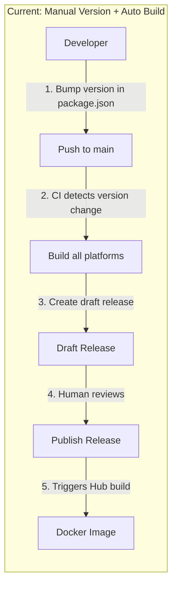
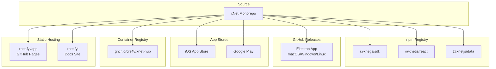
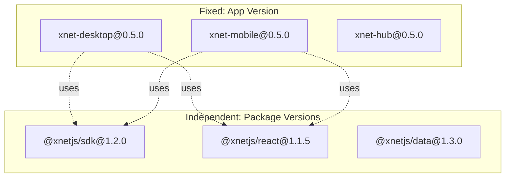
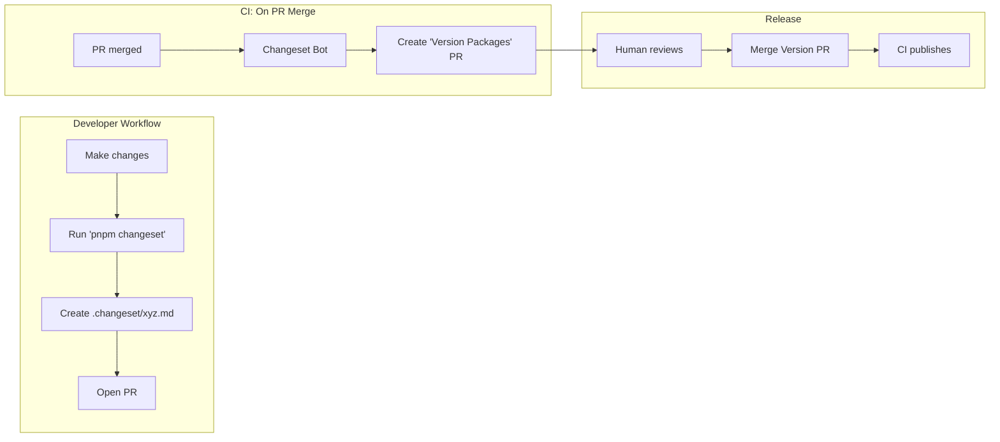
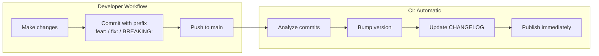
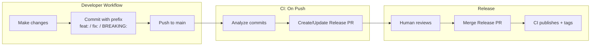
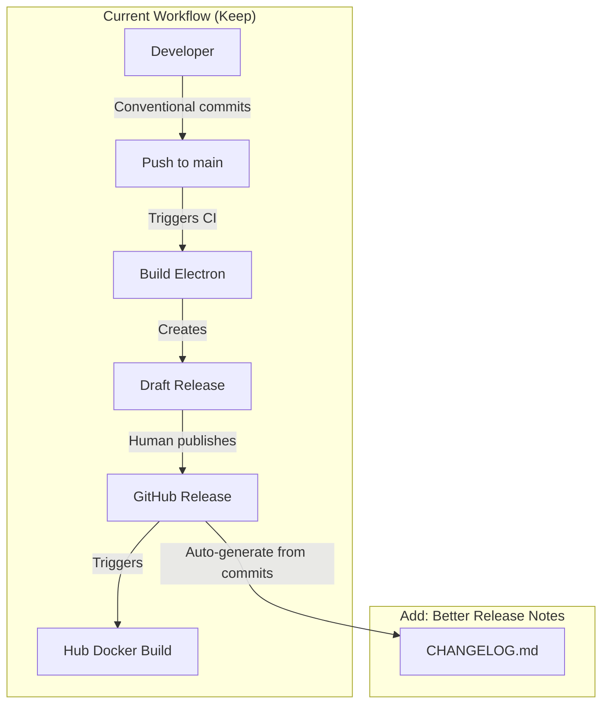
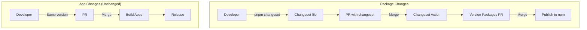
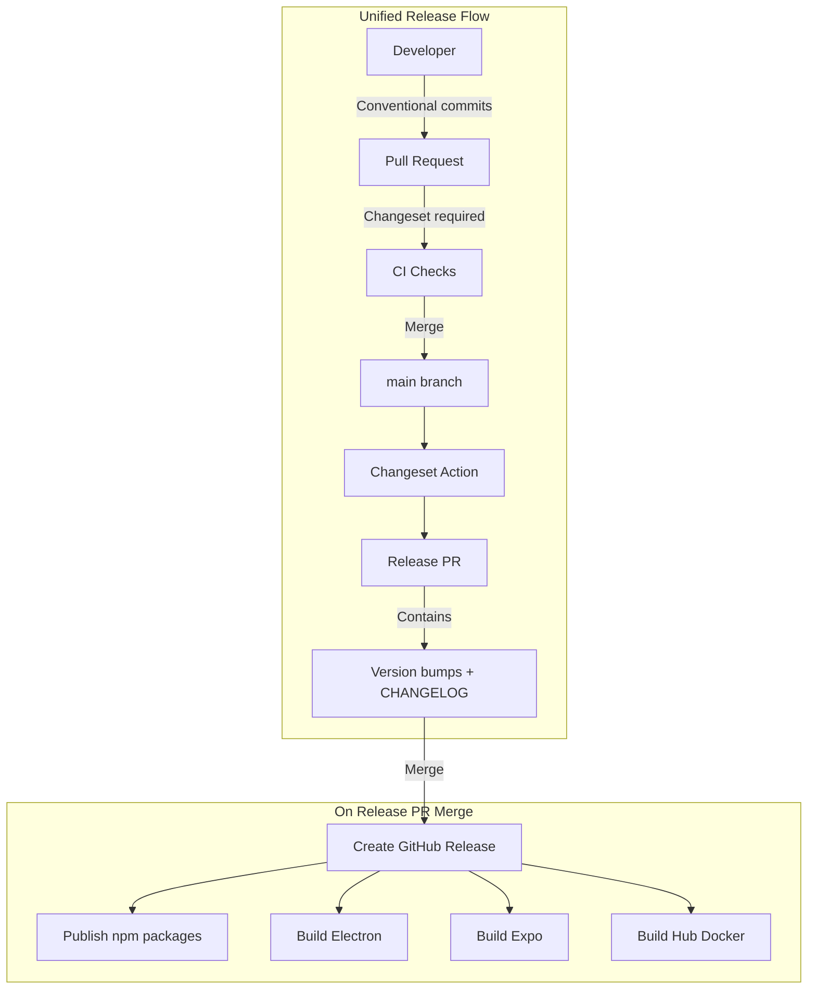

# 0062 - Monorepo Release Automation

> **Status:** Exploration
> **Tags:** CI/CD, releases, versioning, changelog, npm, electron, docker, monorepo
> **Created:** 2026-02-06
> **Context:** xNet is a monorepo that will eventually release multiple artifacts: npm packages, Electron desktop apps, Expo mobile apps, web PWA, and Hub Docker images. This exploration analyzes strategies for automating versioning, changelogs, and releases across all these targets while maintaining version coherence.

## Executive Summary

Monorepo release automation is a solved problem, but the solutions vary significantly based on:

1. **Release targets** - npm packages vs apps vs Docker images
2. **Version coupling** - Should all packages share a version? Or version independently?
3. **Release cadence** - Continuous delivery vs batched releases
4. **Team workflow** - Direct-to-main vs PR-based

**xNet's requirements:**

- Multiple release targets (npm, Electron, Expo, Docker)
- Currently direct-to-main, moving to PR-based at alpha
- Want automated versioning from conventional commits
- Need coherent versioning across targets
- Hybrid approach: CI builds automatically, human publishes

**Recommended approach:** Changesets with fixed versioning for the app release, independent versioning for npm packages once published.

---

## Current State

### What We Have

```
xNet Monorepo
├── packages/           # 21 internal packages (@xnetjs/*)
│   ├── crypto/         # Not published to npm
│   ├── data/           # Not published to npm
│   ├── react/          # Not published to npm (yet)
│   └── ...
├── apps/
│   ├── electron/       # Desktop app (releases to GitHub)
│   ├── web/            # PWA (deploys to GitHub Pages)
│   └── expo/           # Mobile app (not released yet)
└── packages/hub/       # Docker image (releases to GHCR)
```

### Current Release Workflow



### Current Limitations

| Issue                     | Impact                            |
| ------------------------- | --------------------------------- |
| Manual version bumping    | Easy to forget, inconsistent      |
| No CHANGELOG              | Users don't know what changed     |
| Version in one place      | `apps/electron/package.json` only |
| No npm publishing         | Packages are internal-only        |
| Release notes are minimal | Just commit messages              |

---

## Release Targets Analysis

### What Needs to Be Released



### Release Target Characteristics

| Target           | Versioning             | Trigger          | Frequency              | User-Facing  |
| ---------------- | ---------------------- | ---------------- | ---------------------- | ------------ |
| **npm packages** | Semver, independent    | Tag/manual       | On significant changes | Developers   |
| **Electron app** | Semver, single version | Tag/manual       | Weekly/biweekly        | End users    |
| **Expo app**     | Semver + build number  | Tag/manual       | App store review cycle | End users    |
| **Hub Docker**   | Match app version      | On app release   | With app               | Self-hosters |
| **Web PWA**      | Continuous             | On merge to main | Every commit           | End users    |
| **Docs site**    | Continuous             | On merge to main | Every commit           | Developers   |

---

## Versioning Strategies

### Option 1: Fixed Versioning (All Same Version)

All packages and apps share the same version number.

```
v0.5.0
├── @xnetjs/sdk@0.5.0
├── @xnetjs/react@0.5.0
├── @xnetjs/data@0.5.0
├── xnet-desktop@0.5.0
├── xnet-mobile@0.5.0
└── xnet-hub@0.5.0
```

**Pros:**

- Simple mental model
- Easy to communicate ("we're on v0.5")
- No version compatibility matrix

**Cons:**

- Packages bump even if unchanged
- npm downloads show inflated update frequency
- Can't patch one package without releasing all

**Used by:** Babel, Jest, Lerna (default)

### Option 2: Independent Versioning

Each package has its own version, bumped only when it changes.

```
├── @xnetjs/sdk@1.2.0        # Changed this release
├── @xnetjs/react@1.1.5      # No change
├── @xnetjs/data@1.3.0       # Changed this release
├── xnet-desktop@0.5.0     # App version
├── xnet-mobile@0.5.0      # App version (linked to desktop)
└── xnet-hub@0.5.0         # Matches app version
```

**Pros:**

- Accurate change tracking
- Smaller npm updates
- Can patch single packages

**Cons:**

- Complex compatibility matrix
- Harder to communicate
- More cognitive overhead

**Used by:** Changesets default, most mature monorepos

### Option 3: Hybrid (Recommended for xNet)

- **Apps** (Electron, Expo): Fixed version, released together
- **npm packages**: Independent versions
- **Hub**: Matches app version



**Rationale:**

- Users care about "app version" not package versions
- Developers using npm packages need accurate versioning
- Hub must match app for compatibility

---

## Tool Comparison

### Changesets vs Semantic Release vs Release Please

| Feature                  | Changesets                 | Semantic Release    | Release Please     |
| ------------------------ | -------------------------- | ------------------- | ------------------ |
| **Monorepo support**     | Excellent                  | Plugins required    | Good               |
| **Version control**      | Explicit (changeset files) | Implicit (commits)  | Implicit (commits) |
| **Changelog**            | Auto-generated             | Auto-generated      | Auto-generated     |
| **npm publishing**       | Built-in                   | Built-in            | Built-in           |
| **GitHub releases**      | Via action                 | Built-in            | Built-in           |
| **Human review step**    | Yes (Version PR)           | No (auto-releases)  | Yes (Release PR)   |
| **Conventional commits** | Optional                   | Required            | Required           |
| **Learning curve**       | Medium                     | Low                 | Low                |
| **Flexibility**          | High                       | Medium              | Medium             |
| **Used by**              | pnpm, Astro, Remix         | Many small projects | Google projects    |

### Detailed Tool Analysis

#### Changesets



**Changeset file example:**

```markdown
---
'@xnetjs/react': minor
'@xnetjs/data': patch
---

Add useOfflineStatus hook for monitoring connectivity.
Fixes race condition in schema validation.
```

**Pros:**

- Explicit intent for each change
- Batches multiple changes into one release
- Great changelogs
- Human review before release
- Works perfectly with pnpm

**Cons:**

- Extra step for developers (running `changeset`)
- Another concept to learn
- Changeset files can be forgotten

**GitHub Action:** [changesets/action](https://github.com/changesets/action)

#### Semantic Release



**Pros:**

- Zero extra steps
- Conventional commits you already have
- Fully automated

**Cons:**

- Every merge to main releases
- No batching of changes
- Less control over release timing
- Monorepo support requires plugins

#### Release Please



**Pros:**

- Uses conventional commits (already have)
- Human review via Release PR
- Good monorepo support
- Backed by Google

**Cons:**

- Less flexible than Changesets
- Changelog format less customizable
- Newer, less ecosystem

---

## Recommended Architecture

### Phase 1: Alpha (Now → v0.1.0)

Keep it simple. Focus on shipping, not process.



**Actions:**

1. Publish the existing v0.0.1 draft release
2. Improve release note generation in CI
3. Add CHANGELOG.md generation

### Phase 2: Beta (v0.1.0 → v1.0.0)

Add Changesets for npm package publishing.



**Actions:**

1. Initialize Changesets (`pnpm changeset init`)
2. Configure for pnpm workspaces
3. Set up npm publishing for public packages
4. Add Changeset GitHub Action
5. Link app versions to package versions

### Phase 3: Production (v1.0.0+)

Full automation with linked releases.



---

## Implementation Plan

### Immediate (This Week)

- [ ] Publish v0.0.1 draft release
- [ ] Improve release notes template in `electron-release.yml`

### Phase 1: Better Release Notes

Add automatic changelog generation from conventional commits.

**Update `.github/workflows/electron-release.yml`:**

```yaml
- name: Generate release notes
  id: notes
  run: |
    # Get commits since last release
    LAST_TAG=$(git describe --tags --abbrev=0 2>/dev/null || echo "")

    # Group by conventional commit type
    echo "## What's Changed" > release-notes.md
    echo "" >> release-notes.md

    # Features
    FEATURES=$(git log $LAST_TAG..HEAD --pretty=format:"- %s" --grep="^feat" -- apps/electron packages)
    if [ -n "$FEATURES" ]; then
      echo "### Features" >> release-notes.md
      echo "$FEATURES" >> release-notes.md
      echo "" >> release-notes.md
    fi

    # Fixes  
    FIXES=$(git log $LAST_TAG..HEAD --pretty=format:"- %s" --grep="^fix" -- apps/electron packages)
    if [ -n "$FIXES" ]; then
      echo "### Bug Fixes" >> release-notes.md
      echo "$FIXES" >> release-notes.md
      echo "" >> release-notes.md
    fi

    # ... more categories
```

### Phase 2: Changesets Setup

```bash
# Install
pnpm add -Dw @changesets/cli @changesets/changelog-github

# Initialize
pnpm changeset init
```

**`.changeset/config.json`:**

```json
{
  "$schema": "https://unpkg.com/@changesets/config@3.0.0/schema.json",
  "changelog": ["@changesets/changelog-github", { "repo": "crs48/xNet" }],
  "commit": false,
  "fixed": [["xnet-desktop", "xnet-mobile", "@xnetjs/hub"]],
  "linked": [],
  "access": "public",
  "baseBranch": "main",
  "updateInternalDependencies": "patch",
  "ignore": ["@xnetjs/e2e-tests", "@xnetjs/integration-tests"]
}
```

**`.github/workflows/changesets.yml`:**

```yaml
name: Changesets

on:
  push:
    branches: [main]

concurrency:
  group: ${{ github.workflow }}-${{ github.ref }}
  cancel-in-progress: true

jobs:
  release:
    runs-on: ubuntu-latest
    steps:
      - uses: actions/checkout@v4
      - uses: ./.github/actions/setup

      - name: Create Release Pull Request or Publish
        uses: changesets/action@v1
        with:
          publish: pnpm release
          version: pnpm version-packages
          title: 'chore: version packages'
          commit: 'chore: version packages'
        env:
          GITHUB_TOKEN: ${{ secrets.GITHUB_TOKEN }}
          NPM_TOKEN: ${{ secrets.NPM_TOKEN }}
```

### Phase 3: Linked App Releases

Connect Changesets to app build workflows.

**Trigger app builds when Version PR is merged:**

```yaml
on:
  push:
    branches: [main]
    paths:
      - 'apps/electron/package.json'
      - '.changeset/**'
```

---

## Projects Doing This Well

### pnpm

**Repo:** [pnpm/pnpm](https://github.com/pnpm/pnpm)

- Uses Changesets
- Monorepo with CLI + packages
- Excellent CHANGELOG
- Weekly releases

**What to learn:**

- Changeset config for CLI tools
- Release workflow structure

### Astro

**Repo:** [withastro/astro](https://github.com/withastro/astro)

- Uses Changesets
- Multiple packages + main framework
- Great automation

**What to learn:**

- Changeset bot integration
- Package categorization

### Remix

**Repo:** [remix-run/remix](https://github.com/remix-run/remix)

- Uses Changesets
- Framework + multiple adapters
- Stable release process

**What to learn:**

- Linked versioning for related packages
- Release candidate workflow

### Turborepo

**Repo:** [vercel/turborepo](https://github.com/vercel/turbo)

- Uses Changesets
- CLI + packages
- Binary releases (like Electron)

**What to learn:**

- Binary artifact management
- Multi-platform builds

### Tauri

**Repo:** [tauri-apps/tauri](https://github.com/tauri-apps/tauri)

- Similar to xNet (desktop app framework)
- Rust + JS packages
- Complex release matrix

**What to learn:**

- Multi-artifact releases
- Platform-specific builds

---

## Conventional Commits Reference

xNet already enforces conventional commits via commitlint. Here's how they map to version bumps:

| Commit Type                    | Version Bump       | Example                                  |
| ------------------------------ | ------------------ | ---------------------------------------- |
| `fix:`                         | Patch (0.0.X)      | `fix(sync): handle network timeout`      |
| `feat:`                        | Minor (0.X.0)      | `feat(react): add useOfflineStatus hook` |
| `feat!:` or `BREAKING CHANGE:` | Major (X.0.0)      | `feat!: redesign schema API`             |
| `docs:`                        | No bump            | `docs: update README`                    |
| `chore:`                       | No bump            | `chore: update dependencies`             |
| `refactor:`                    | No bump (or patch) | `refactor(data): simplify NodeStore`     |
| `perf:`                        | Patch              | `perf(sync): optimize update batching`   |
| `test:`                        | No bump            | `test: add sync integration tests`       |

### Scopes for xNet

Recommended scopes based on package structure:

```
feat(crypto): ...     # packages/crypto
feat(data): ...       # packages/data
feat(react): ...      # packages/react
feat(sync): ...       # packages/sync
feat(canvas): ...     # packages/canvas
feat(editor): ...     # packages/editor
feat(electron): ...   # apps/electron
feat(hub): ...        # packages/hub
feat(site): ...       # site/
feat(ci): ...         # .github/
```

---

## CHANGELOG Format

### Recommended Format

```markdown
# Changelog

All notable changes to this project will be documented in this file.

## [0.5.0] - 2026-02-15

### Added

- **react:** Add `useOfflineStatus` hook for monitoring connectivity
- **canvas:** Support multi-select with shift+click

### Changed

- **data:** Improve schema validation error messages
- **editor:** Upgrade TipTap to v3

### Fixed

- **sync:** Handle network timeout during initial sync
- **electron:** Fix window restore on macOS

### Breaking Changes

- **data:** `defineSchema` now requires explicit `namespace` parameter

## [0.4.0] - 2026-02-01

...
```

### Auto-Generation

Changesets generates this format automatically from changeset files.

**Input (changeset file):**

```markdown
---
'@xnetjs/react': minor
---

Add `useOfflineStatus` hook for monitoring connectivity.
```

**Output (CHANGELOG.md):**

```markdown
## 0.5.0

### Minor Changes

- @xnetjs/react: Add `useOfflineStatus` hook for monitoring connectivity.
```

---

## Decision Matrix

### When to Use Each Approach

| Scenario                          | Recommended                              |
| --------------------------------- | ---------------------------------------- |
| Early development, fast iteration | Manual versioning + better release notes |
| Publishing npm packages           | Changesets                               |
| Multiple apps with shared version | Changesets with `fixed` config           |
| Pure continuous deployment        | Semantic Release                         |
| Google-style release trains       | Release Please                           |
| Small team, infrequent releases   | Manual with templates                    |

### xNet Recommendation

**Now:** Keep manual, improve release notes
**At npm publish time:** Add Changesets
**At v1.0:** Full automation with linked releases

---

## Open Questions

1. **npm package publishing timeline** - When will `@xnetjs/react`, `@xnetjs/data`, etc. be published? This determines when Changesets is needed.

2. **Expo release cadence** - App store review cycles are slower. Should Expo releases be decoupled from Electron?

3. **Hub versioning** - Should Hub always match app version, or version independently for self-hosters?

4. **Pre-release versions** - How to handle alpha/beta/rc versions? Changesets supports this but needs configuration.

5. **Hotfix process** - How to release urgent fixes without waiting for a full release cycle?

---

## Appendix: Tool Installation Commands

### Changesets

```bash
# Install
pnpm add -Dw @changesets/cli @changesets/changelog-github

# Initialize
pnpm changeset init

# Create a changeset
pnpm changeset

# Version packages (usually done by CI)
pnpm changeset version

# Publish (usually done by CI)
pnpm changeset publish
```

### Semantic Release (for comparison)

```bash
# Install
pnpm add -Dw semantic-release @semantic-release/changelog @semantic-release/git

# Configure in package.json or .releaserc
```

### Release Please (for comparison)

```bash
# No local install needed - GitHub Action only
# Configure via .release-please-manifest.json
```

---

## References

- [Changesets Documentation](https://github.com/changesets/changesets/blob/main/docs/intro-to-using-changesets.md)
- [Semantic Release](https://semantic-release.gitbook.io/)
- [Release Please](https://github.com/googleapis/release-please)
- [Conventional Commits](https://www.conventionalcommits.org/)
- [Keep a Changelog](https://keepachangelog.com/)
- [Semver](https://semver.org/)
- [pnpm Changesets Example](https://github.com/pnpm/pnpm/tree/main/.changeset)
- [Astro Release Workflow](https://github.com/withastro/astro/blob/main/.github/workflows/release.yml)
