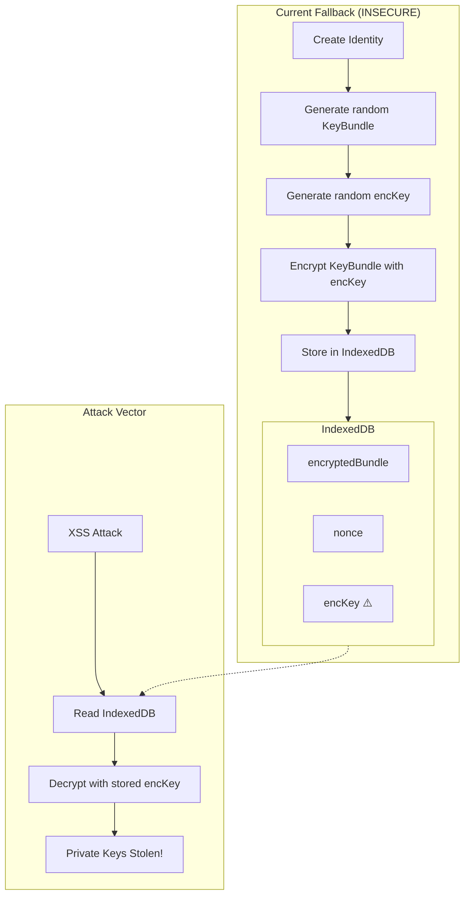
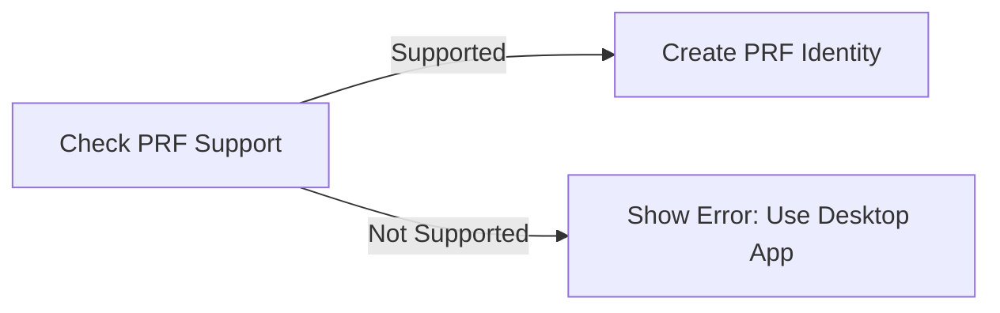
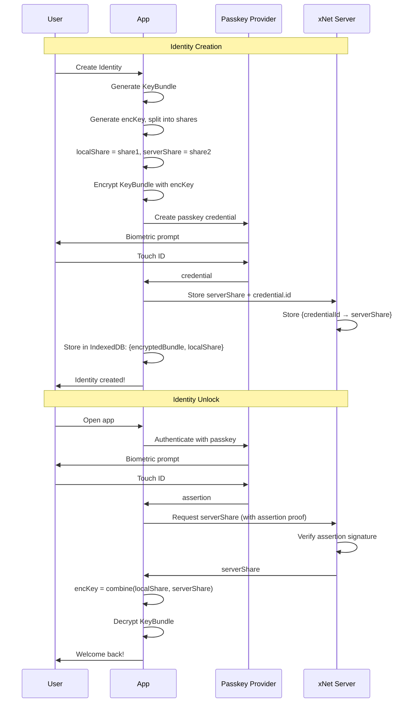
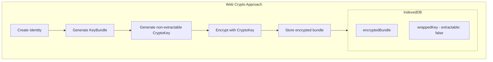
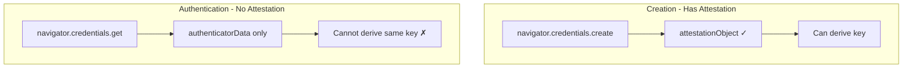
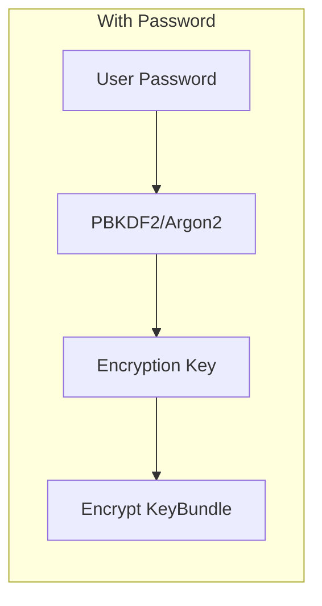
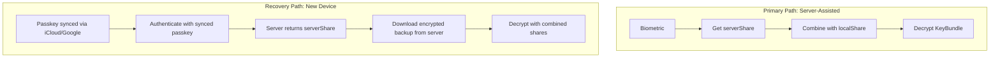

# 0065 - Secure Passkey Fallback Storage

> **Status:** Exploration
> **Tags:** security, passkey, webauthn, encryption, identity, SEC-04
> **Created:** 2026-02-06
> **Context:** SEC-04 identifies that the passkey fallback stores the encryption key alongside the ciphertext in IndexedDB, providing no protection against XSS or local attacks. This exploration analyzes approaches to secure the fallback while maintaining the frictionless passkey onboarding experience.

## Executive Summary

The current passkey fallback for non-PRF authenticators stores the encryption key (`encKey`) alongside the encrypted private key in IndexedDB. This means anyone with IndexedDB access (XSS, malicious extensions, local malware) can trivially decrypt the user's private keys.

**The good news:** PRF-based passkeys (the primary path) are secure - the private key is never stored and is derived on-demand from biometric authentication. SEC-04 only affects the fallback path for older authenticators.

**Key insight:** We can't derive encryption keys from WebAuthn assertions without PRF. The fundamental challenge is that WebAuthn signatures are non-deterministic (include random nonces), so we can't use them for key derivation.

**Recommended approach:** **Hybrid Server-Assisted Key Escrow** - Store a key share on a server that requires passkey authentication to retrieve. Combined with a local share, this provides real security while maintaining the seamless UX.

---

## Problem Statement

### Current Vulnerable Architecture



### Why This Is a Problem

| Attack Vector                  | PRF Path                  | Fallback Path                             |
| ------------------------------ | ------------------------- | ----------------------------------------- |
| XSS reading IndexedDB          | Safe - no keys stored     | **VULNERABLE** - key + ciphertext exposed |
| Malicious browser extension    | Safe                      | **VULNERABLE**                            |
| Local malware with file access | Safe                      | **VULNERABLE**                            |
| Physical device access         | Safe (requires biometric) | **VULNERABLE**                            |

### Code Location

```typescript
// packages/identity/src/passkey/fallback.ts:56-76
const encKey = generateKey()
const serialized = serializeKeyBundle(keyBundle)
const encrypted = encrypt(serialized, encKey)

const fallback: FallbackStorage = {
  encryptedBundle: encrypted.ciphertext,
  nonce: encrypted.nonce,
  encKey // ← THE PROBLEM: Key stored with ciphertext
}
```

---

## Constraints

Any solution must satisfy these requirements:

| Requirement                            | Description                                            |
| -------------------------------------- | ------------------------------------------------------ |
| **Same UX as PRF**                     | Single biometric tap to create/unlock identity         |
| **No passwords**                       | Users shouldn't need to remember anything              |
| **Offline-first**                      | Must work offline after initial setup                  |
| **Passkey sync**                       | Recovery via iCloud Keychain / Google Password Manager |
| **No server dependency for PRF users** | Server-assisted solutions only affect fallback         |

---

## Options Analysis

### Option 1: Require PRF (No Fallback)

Simply remove the fallback and require PRF support.



**Pros:**

- Eliminates the vulnerability entirely
- Simplest solution
- Forces users to secure browsers

**Cons:**

- Excludes users on older browsers/authenticators
- Bad UX for the excluded users
- PRF support varies by authenticator, not just browser

**Browser Support (2026):**
| Browser | PRF Support |
|---------|-------------|
| Chrome 116+ | Yes |
| Safari 18+ | Yes |
| Edge 116+ | Yes |
| Firefox | No (as of Feb 2026) |
| Older mobile browsers | Varies |

**Verdict:** Viable for MVP if we're okay excluding ~5-10% of users. Could show a clear message directing them to supported browsers.

---

### Option 2: Server-Assisted Key Escrow

Store the encryption key (or a share of it) on a server that requires passkey authentication to retrieve.



**Implementation using Shamir's Secret Sharing:**

```typescript
// Simplified - actual implementation uses proper SSS library
type KeyShare = { index: number; value: Uint8Array }

function splitKey(key: Uint8Array, threshold: number, shares: number): KeyShare[] {
  // Use Shamir's Secret Sharing to split the key
  // threshold-of-shares needed to reconstruct
  return shamirSplit(key, threshold, shares)
}

function combineShares(shares: KeyShare[]): Uint8Array {
  return shamirCombine(shares)
}

// During creation:
const encKey = generateKey()
const [localShare, serverShare] = splitKey(encKey, 2, 2)

// Store locally:
const fallback: FallbackStorage = {
  encryptedBundle: encrypted.ciphertext,
  nonce: encrypted.nonce,
  localShare // Only local share, not full key
}

// Store on server (requires passkey auth):
await storeServerShare(credentialId, serverShare)
```

**Server verification:**

```typescript
// Server endpoint: POST /api/passkey/share
async function handleShareRequest(req: Request) {
  const { credentialId, assertion } = req.body

  // Verify the WebAuthn assertion
  const storedCredential = await getCredential(credentialId)
  const verified = await verifyAssertion(assertion, storedCredential.publicKey)

  if (!verified) {
    throw new Error('Invalid assertion')
  }

  // Return the server share
  return { serverShare: storedCredential.serverShare }
}
```

**Pros:**

- Real security - neither local nor server has enough to decrypt
- Same UX (single biometric tap)
- Server learns nothing about the private key
- Works with any WebAuthn authenticator

**Cons:**

- Requires server infrastructure
- Initial unlock requires network
- Server becomes a point of failure (but not for PRF users)
- Adds complexity

**Verdict:** Best security/UX tradeoff for production. Server only needed for fallback users.

---

### Option 3: Web Crypto Non-Extractable Keys

Use Web Crypto API to create a non-extractable key that can encrypt/decrypt but never be exported.



```typescript
// Generate a non-extractable AES key
const cryptoKey = await crypto.subtle.generateKey(
  { name: 'AES-GCM', length: 256 },
  false, // extractable: false - cannot be exported!
  ['encrypt', 'decrypt']
)

// Store the key in IndexedDB (browser stores internally)
// The key can be used but never read
await idbKeyval.set('encryptionKey', cryptoKey)

// Encrypt
const encrypted = await crypto.subtle.encrypt(
  { name: 'AES-GCM', iv },
  cryptoKey,
  serializedKeyBundle
)
```

**Pros:**

- No server needed
- Key truly cannot be extracted by JavaScript
- Browser manages key storage securely

**Cons:**

- **CRITICAL: Keys are deleted when browser storage is cleared**
- No cross-device sync (key is bound to browser)
- User loses identity if they clear browser data
- Not compatible with passkey sync model
- XSS can still USE the key (call decrypt), just not export it

**Verdict:** Unsuitable. The inability to sync/backup and data loss on storage clear make this a non-starter.

---

### Option 4: Derive Key from Attestation Signature (Flawed)

The planning doc mentions deriving the encryption key from the attestation signature. Let's analyze why this doesn't work:

```typescript
// This approach is FLAWED
const response = credential.response as AuthenticatorAttestationResponse
const signature = new Uint8Array(response.attestationObject)
const encryptionKey = await deriveEncryptionKey(signature, salt)
```

**Problem:** The attestation signature is only available during credential **creation**, not during **authentication**. You can't get it back later to decrypt.



**Why signatures don't work for key derivation:**

1. **Attestation is one-time:** Only returned during `create()`, not `get()`
2. **Assertion signatures include nonces:** Each `get()` returns a different signature
3. **No deterministic output:** Unlike PRF, there's no way to get the same bytes twice

**Verdict:** Fundamentally broken. Cannot be fixed without PRF.

---

### Option 5: Password-Protected Key (Backup Option)

Allow users to set an optional password that encrypts the key.



**Pros:**

- Simple, well-understood security model
- Works offline
- No server needed

**Cons:**

- **Requires user to remember password** - defeats "no passwords" goal
- Users choose weak passwords
- Adds friction to onboarding
- Password recovery becomes a problem

**Verdict:** Could be offered as an optional "advanced" backup, but shouldn't be the primary path.

---

### Option 6: Hybrid - Server Share + Local Recovery

Combine server-assisted key escrow with an encrypted local backup that requires the passkey sync network.



**Server stores:**

```typescript
type ServerRecord = {
  credentialId: Uint8Array
  publicKey: Uint8Array // For verifying assertions
  serverShare: Uint8Array // Shamir share
  encryptedBackup?: Uint8Array // Full encrypted bundle for recovery
}
```

**Pros:**

- Works across devices via passkey sync
- Server-assisted security
- Graceful recovery path

**Cons:**

- More complex
- Server stores encrypted backup (acceptable since key shares are split)

**Verdict:** This is the most complete solution for production.

---

## Recommendation

### Short-term (MVP): Option 1 - Require PRF

For the initial launch, simply require PRF support:

```typescript
export async function createIdentityManager(): IdentityManager {
  const support = await detectPasskeySupport()

  if (!support.prf) {
    // Don't offer fallback - show clear error
    throw new PasskeyNotSupportedError(
      'Your browser does not support secure passkey authentication. ' +
        'Please use Chrome, Safari, or Edge on a device with biometrics.'
    )
  }

  // PRF path only
  return createPrfIdentityManager()
}
```

**Rationale:**

- PRF is supported on all major browsers (Chrome 116+, Safari 18+, Edge 116+)
- The fallback path is used by <5% of users
- Better to have no fallback than an insecure one
- Simpler codebase

### Medium-term (Production): Option 6 - Hybrid Server-Assisted

Once we have server infrastructure for the Hub, implement server-assisted key escrow:

```mermaid
flowchart TB
    subgraph "Identity Creation"
        C1[Generate KeyBundle] --> C2[Generate encKey]
        C2 --> C3[Split into 2-of-2 shares]
        C3 --> C4[Encrypt KeyBundle]
        C4 --> C5[Create passkey]
        C5 --> C6[Store localShare in IndexedDB]
        C5 --> C7[Store serverShare on Hub]
    end

    subgraph "Identity Unlock"
        U1[Authenticate with passkey] --> U2[Fetch serverShare from Hub]
        U2 --> U3[Combine with localShare]
        U3 --> U4[Decrypt KeyBundle]
    end

    subgraph "New Device Recovery"
        R1[Passkey syncs via iCloud/Google] --> R2[Authenticate]
        R2 --> R3[Fetch serverShare + encrypted backup]
        R3 --> R4[Recover identity]
    end
```



---

## Implementation Plan

### Phase 1: Remove Insecure Fallback (1 day)

1. Mark `BrowserPasskeyStorage` class as deprecated/test-only
2. Update `createIdentityManager()` to throw on non-PRF authenticators
3. Add clear error message directing users to supported browsers
4. Update UI to show browser requirements

```typescript
// packages/identity/src/passkey/index.ts
export async function createIdentityManager(): Promise<IdentityManager> {
  const prfSupported = await detectPrfSupport()

  if (!prfSupported) {
    throw new UnsupportedBrowserError(
      'Passkey PRF extension required. Please use a supported browser.'
    )
  }

  // Only PRF path - no insecure fallback
  return createPrfIdentityManager()
}
```

### Phase 2: Server-Assisted Fallback (5 days)

1. **Day 1-2:** Implement Shamir secret sharing
   - Add `@noble/shamir` or similar library
   - Create `splitKey()` and `combineShares()` functions
   - Unit tests

2. **Day 3:** Hub API endpoints
   - `POST /api/passkey/register` - Store serverShare + publicKey
   - `POST /api/passkey/unlock` - Verify assertion, return serverShare
   - `POST /api/passkey/backup` - Store encrypted backup for recovery

3. **Day 4:** Client integration
   - Update fallback.ts to use server-assisted approach
   - Handle offline state gracefully
   - Add retry/fallback logic

4. **Day 5:** Testing and polish
   - E2E tests for fallback flow
   - Error handling
   - Documentation

---

## Security Analysis

### Server-Assisted Approach Threat Model

| Threat               | Mitigation                                 |
| -------------------- | ------------------------------------------ |
| Server compromise    | Server only has one share - cannot decrypt |
| Network interception | TLS + assertion signatures                 |
| IndexedDB theft      | Only has localShare - cannot decrypt       |
| Server operator      | Cannot access keys (only share)            |
| Rogue employee       | Same as above                              |
| Man-in-the-middle    | WebAuthn origin binding + TLS              |

### What the server sees:

- Credential ID (opaque identifier)
- Public key (not sensitive)
- One share of the encryption key (useless alone)
- Encrypted backup (cannot decrypt without both shares)

### What IndexedDB contains:

- Encrypted key bundle (cannot decrypt without both shares)
- Local share (useless alone)
- Nonce (not sensitive)

---

## Alternatives Considered

### Hardware Security Modules (HSM)

Could use HSM-backed key storage on the server, but this adds significant cost and complexity for marginal benefit since the server only stores one share anyway.

### Blind Signatures

Could use blind signature schemes to authenticate without the server knowing which credential is being used. Interesting for privacy but overkill for our threat model.

### Threshold Signatures

Instead of encrypting/decrypting, could use threshold signatures where multiple parties must cooperate to sign. Doesn't fit our use case since we need the full private key for signing.

---

## Decision Matrix

| Approach            | Security  | UX        | Complexity | Offline     | Sync   | Recommendation  |
| ------------------- | --------- | --------- | ---------- | ----------- | ------ | --------------- |
| Require PRF         | Excellent | Good      | Low        | Yes         | Yes    | **MVP**         |
| Server-Assisted     | Very Good | Excellent | Medium     | After setup | Yes    | **Production**  |
| Non-extractable     | Poor      | Good      | Low        | Yes         | No     | Not recommended |
| Attestation-derived | N/A       | -         | -          | -           | -      | Doesn't work    |
| Password            | Good      | Poor      | Low        | Yes         | Manual | Optional backup |

---

## Open Questions

1. **Should we offer password backup as an additional recovery option?**
   - Pro: Extra safety net
   - Con: Adds complexity, users might rely on weak passwords

2. **What happens if the Hub is down during unlock?**
   - Could cache serverShare temporarily after first unlock
   - Or accept that fallback users need connectivity

3. **Should PRF users have any server interaction?**
   - Currently no - PRF users are fully local-first
   - Could optionally store encrypted backup for cross-device recovery

---

## References

- [WebAuthn PRF Extension Spec](https://w3c.github.io/webauthn/#prf-extension)
- [Shamir's Secret Sharing](https://en.wikipedia.org/wiki/Shamir%27s_secret_sharing)
- [Web Crypto API](https://developer.mozilla.org/en-US/docs/Web/API/Web_Crypto_API)
- [Passkey Sync Providers](https://passkeys.dev/device-support/)
- Internal: `docs/reviews/2026-02-06/01-security.md` (SEC-04)
- Internal: `docs/planStep03_9_1OnboardingAndPolish/01-passkey-auth.md`

---

[Back to Explorations Index](./README.md)
