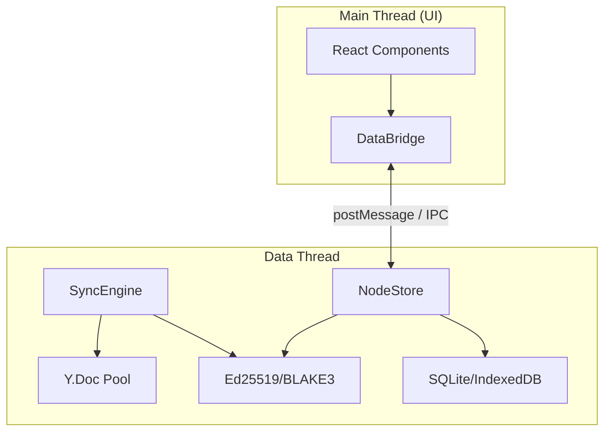
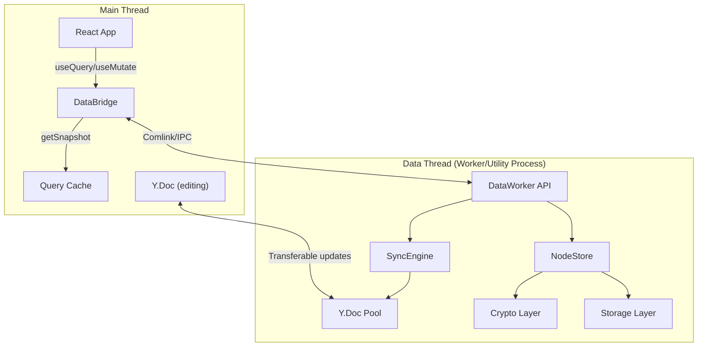
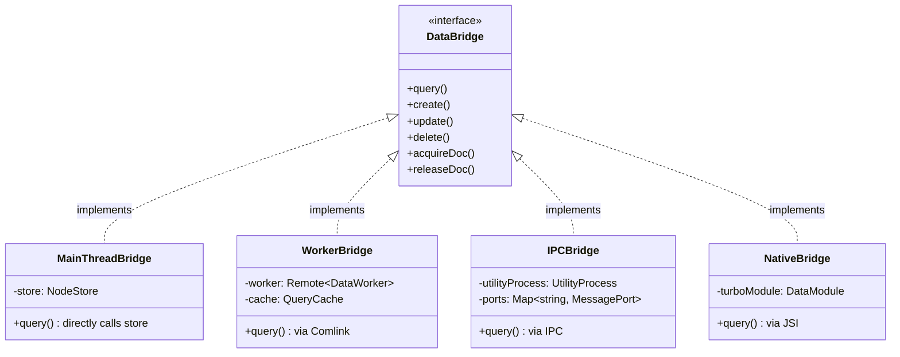
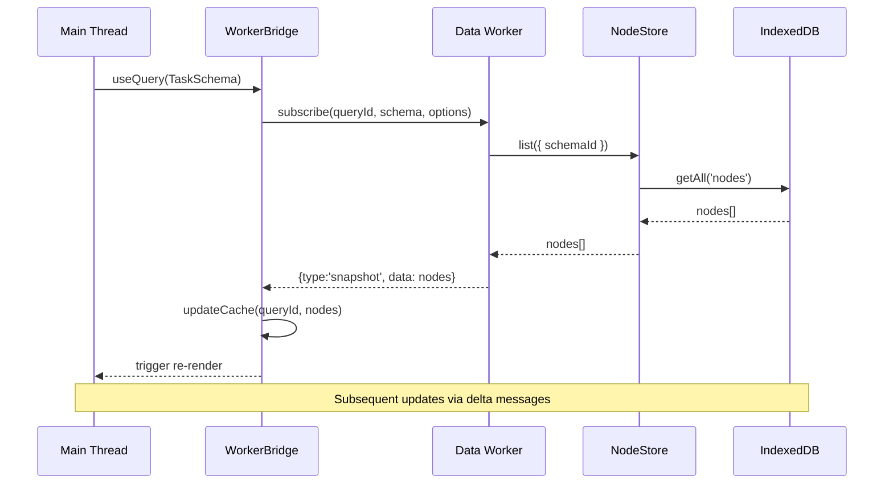
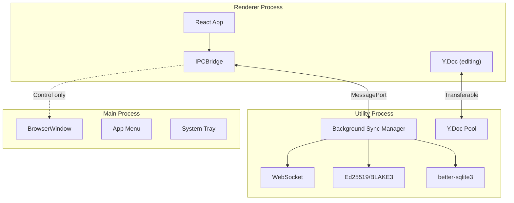
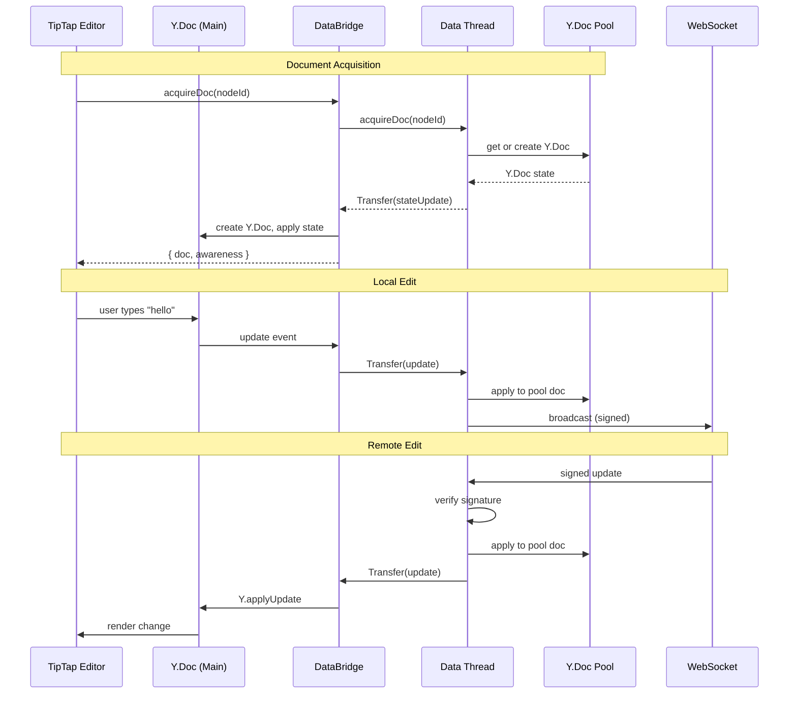
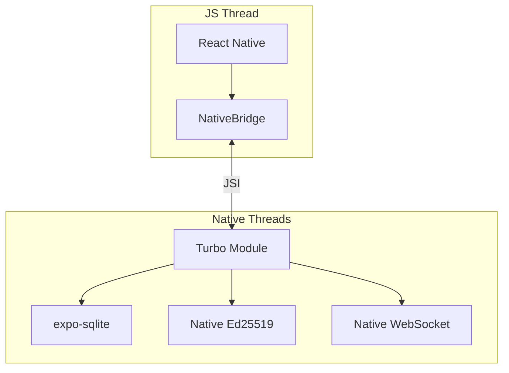

# Off-Main-Thread Architecture: Implementation Guide

> A concrete implementation plan for moving storage, sync, crypto, and queries off the UI thread in xNet, with detailed checklists and code samples.

**References**: This document builds on the architectural exploration in [0043_OFF_MAIN_THREAD_ARCHITECTURE.md](./0043_OFF_MAIN_THREAD_ARCHITECTURE.md). Read that document first for background on why this architecture matters and the theoretical foundations.

**Date**: February 2026
**Status**: Implementation Ready

## Executive Summary

This document provides actionable implementation guidance for the "data thread" architecture across Web and Electron platforms, with forward-compatible design for Expo. The goal: **move all heavy computation off the main thread while keeping the React API unchanged**.

Key outcomes:

- **Web**: All storage, sync, and crypto runs in a dedicated Web Worker
- **Electron**: All storage, sync, and crypto runs in a utility process (not the main process)
- **Expo (future)**: Native modules handle storage/crypto on background threads
- **React hooks**: `useQuery`, `useMutate`, `useNode` work identically across all platforms



## Current State Analysis

### What Runs Where Today

| Component           | Web         | Electron Renderer | Electron Main | Problem                      |
| ------------------- | ----------- | ----------------- | ------------- | ---------------------------- |
| React               | Main thread | Renderer          | -             | Correct                      |
| NodeStore           | Main thread | Renderer          | -             | Blocks UI                    |
| IndexedDB           | Main thread | Renderer          | -             | Blocks UI                    |
| Y.Doc (editing)     | Main thread | Renderer          | -             | Required for TipTap          |
| Y.Doc (pool)        | -           | -                 | Main process  | Blocks window mgmt           |
| Ed25519 sign/verify | Main thread | Renderer          | Main process  | ~2-3ms per op                |
| BLAKE3 hash         | Main thread | Renderer          | Main process  | ~0.1-0.5ms per op            |
| WebSocket sync      | Main thread | -                 | Main process  | Async but processing blocks  |
| SQLite              | -           | -                 | Main process  | **Synchronous**, blocks main |
| ELK.js layout       | Main thread | Renderer          | -             | 10-500ms blocking            |

### Key Files in Current Architecture

```
packages/react/src/
  context.ts                 # XNetProvider - creates NodeStore, SyncManager
  hooks/useQuery.ts          # Direct NodeStore access on main thread
  hooks/useMutate.ts         # Direct NodeStore access on main thread
  hooks/useNode.ts           # Y.Doc + SyncManager on main thread
  sync/sync-manager.ts       # WebSocket sync, Y.Doc pool (web)

apps/electron/src/
  main/bsm.ts               # Background Sync Manager (runs in main process!)
  main/storage.ts           # SQLite via better-sqlite3 (synchronous)
  renderer/lib/ipc-sync-manager.ts  # IPC bridge to BSM
```

## Architecture Design

### Target Architecture



### The DataBridge Interface

The `DataBridge` is the abstraction layer that hides platform-specific implementation details from React hooks.

```typescript
// packages/data-bridge/src/types.ts

export interface DataBridge {
  // ─── Queries ────────────────────────────────────────────

  /**
   * Create a subscription to a query result.
   * Returns an object compatible with useSyncExternalStore.
   */
  query<P extends Record<string, PropertyBuilder>>(
    schema: DefinedSchema<P>,
    options?: QueryOptions<P>
  ): QuerySubscription<P>

  // ─── Mutations ──────────────────────────────────────────

  create<P extends Record<string, PropertyBuilder>>(
    schema: DefinedSchema<P>,
    data: InferCreateProps<P>,
    id?: string
  ): Promise<NodeState>

  update(nodeId: string, changes: Record<string, unknown>): Promise<NodeState>

  delete(nodeId: string): Promise<void>

  // ─── Documents ──────────────────────────────────────────

  /**
   * Acquire a Y.Doc for editing. Returns the doc with current state.
   * The doc receives updates from the worker via Transferable ArrayBuffers.
   */
  acquireDoc(nodeId: string): Promise<AcquiredDoc>

  /**
   * Release a Y.Doc when no longer editing.
   * The worker continues syncing in the background.
   */
  releaseDoc(nodeId: string): void

  // ─── Lifecycle ──────────────────────────────────────────

  initialize(config: DataBridgeConfig): Promise<void>
  destroy(): void

  // ─── Status ─────────────────────────────────────────────

  readonly status: SyncStatus
  on(event: 'status', handler: (status: SyncStatus) => void): () => void
}

export interface QuerySubscription<P> {
  /** Get current snapshot (synchronous - reads from cache) */
  getSnapshot(): NodeState[] | null

  /** Subscribe to updates (React will call this) */
  subscribe(callback: () => void): () => void
}

export interface AcquiredDoc {
  doc: Y.Doc
  awareness: Awareness
}
```

### Platform Implementations



## Implementation Phases

### Phase 0: DataBridge Abstraction (Week 1-2)

**Goal**: Introduce the DataBridge layer and refactor hooks to use it. Since this is prerelease, no backward compatibility or migration is needed.

#### Checklist

- [x] Create `packages/data-bridge/` package
  - [x] `src/types.ts` - DataBridge interface, QuerySubscription, etc.
  - [x] `src/main-thread-bridge.ts` - Direct NodeStore access (current behavior)
  - [x] `src/query-cache.ts` - In-memory cache for query results
  - [x] `src/index.ts` - Exports
- [x] Update `packages/react/`
  - [x] Add `DataBridgeContext` and `useDataBridge()` hook
  - [x] Modify `XNetProvider` to create MainThreadBridge
  - [x] Refactor `useQuery` to use DataBridge
  - [x] Refactor `useMutate` to use DataBridge
  - [x] Keep `useNode` unchanged (Phase 3)
- [x] Tests
  - [x] Unit tests for MainThreadBridge
  - [x] Ensure all existing tests pass

#### Key Code: MainThreadBridge

```typescript
// packages/data-bridge/src/main-thread-bridge.ts

import type { NodeStore, NodeState } from '@xnet/data'
import type { DataBridge, QuerySubscription, QueryOptions } from './types'

export class MainThreadBridge implements DataBridge {
  private store: NodeStore
  private subscriptions = new Map<string, Set<() => void>>()
  private cache = new Map<string, NodeState[]>()

  constructor(store: NodeStore) {
    this.store = store

    // Subscribe to all store changes and update relevant caches
    this.store.subscribe((event) => {
      this.handleStoreChange(event)
    })
  }

  query<P>(schema: DefinedSchema<P>, options?: QueryOptions<P>): QuerySubscription<P> {
    const queryId = this.computeQueryId(schema, options)

    // Load initial data if not cached
    if (!this.cache.has(queryId)) {
      this.loadQuery(queryId, schema, options)
    }

    return {
      getSnapshot: () => this.cache.get(queryId) ?? null,
      subscribe: (callback) => {
        const subs = this.subscriptions.get(queryId) ?? new Set()
        subs.add(callback)
        this.subscriptions.set(queryId, subs)
        return () => {
          subs.delete(callback)
          if (subs.size === 0) {
            this.subscriptions.delete(queryId)
            // Optionally: remove from cache after delay
          }
        }
      }
    }
  }

  private async loadQuery(queryId: string, schema: DefinedSchema, options?: QueryOptions) {
    const nodes = await this.store.list({ schemaId: schema._schemaId, ...options })
    this.cache.set(queryId, nodes)
    this.notifySubscribers(queryId)
  }

  private handleStoreChange(event: NodeChangeEvent) {
    // Re-evaluate all affected queries
    for (const [queryId, _] of this.subscriptions) {
      // Check if this change affects this query
      // If so, re-fetch and update cache
      this.revalidateQuery(queryId)
    }
  }

  private notifySubscribers(queryId: string) {
    const subs = this.subscriptions.get(queryId)
    if (subs) {
      for (const callback of subs) {
        callback()
      }
    }
  }

  // ... create, update, delete implementations (direct pass-through)
}
```

#### Key Code: Updated useQuery

```typescript
// packages/react/src/hooks/useQuery.ts (refactored)

import { useSyncExternalStore, useMemo } from 'react'
import { useDataBridge } from '../context'
import { flattenNodes, type FlatNode } from '../utils/flattenNode'

export function useQuery<P extends Record<string, PropertyBuilder>>(
  schema: DefinedSchema<P>,
  idOrFilter?: string | QueryFilter<P>
): QueryListResult<P> | QuerySingleResult<P> {
  const bridge = useDataBridge()

  // Normalize options and create stable reference
  const options = useMemo(() => normalizeOptions(idOrFilter), [stableHash(idOrFilter)])

  // Create subscription (memoized by query parameters)
  const subscription = useMemo(
    () => bridge.query(schema, options),
    [bridge, schema._schemaId, options]
  )

  // Use React 18's useSyncExternalStore for concurrent-safe subscriptions
  const rawData = useSyncExternalStore(
    subscription.subscribe,
    subscription.getSnapshot,
    subscription.getSnapshot // SSR snapshot
  )

  // Flatten nodes for ergonomic access
  const data = useMemo(() => (rawData ? flattenNodes<P>(rawData) : []), [rawData])

  return {
    data,
    loading: rawData === null,
    error: null,
    reload: () => {
      /* trigger refetch via bridge */
    }
  }
}
```

---

### Phase 1: Web Worker Implementation (Week 3-5)

**Goal**: Move NodeStore, query engine, and crypto to a dedicated Web Worker on the web platform. Since this is prerelease, WorkerBridge replaces MainThreadBridge as the default - no fallback needed.



#### Checklist

- [x] Create worker infrastructure
  - [x] `packages/data-bridge/src/worker/data-worker.ts` - Worker entry point
  - [x] `packages/data-bridge/src/worker/worker-types.ts` - Shared types for worker/main thread
  - [x] Factory functions in `create-bridge.ts` for platform detection
  - [ ] Vite config for worker bundling (built-in via `?worker` imports)
- [x] Create `WorkerBridge` implementation
  - [x] `src/worker-bridge.ts` - Main thread side
  - [x] Comlink integration for type-safe RPC
  - [x] QueryCache with delta updates
  - [ ] Transferable ArrayBuffer handling (future optimization)
- [ ] Move sync engine to worker (deferred to Phase 3)
- [x] Update `XNetProvider`
  - [x] Add `dataBridge` config option for custom bridge injection
  - [ ] Create WorkerBridge as default (blocked by SyncManager integration)
- [x] Refactor hooks to use DataBridge
  - [x] `useQuery` uses `useDataBridge().query()`
  - [x] `useMutate` uses `useDataBridge().create/update/delete()`
- [x] Tests
  - [x] Verify existing tests pass (93 tests in @xnet/react)

#### Key Code: Data Worker

```typescript
// packages/data-bridge/src/worker/data-worker.ts

import { expose } from 'comlink'
import { NodeStore, MemoryNodeStorageAdapter } from '@xnet/data'
import { IndexedDBNodeStorageAdapter } from '@xnet/storage'

class DataWorker {
  private store: NodeStore | null = null
  private subscriptions = new Map<string, QuerySubscription>()

  async initialize(config: WorkerConfig): Promise<void> {
    const storage = new IndexedDBNodeStorageAdapter(config.dbName)
    await storage.open()

    this.store = new NodeStore({
      storage,
      authorDID: config.authorDID,
      signingKey: new Uint8Array(config.signingKey)
    })
    await this.store.initialize()

    // Set up store change listener
    this.store.subscribe((event) => {
      this.handleStoreChange(event)
    })
  }

  async subscribe(
    queryId: string,
    schemaId: string,
    options: QueryOptions,
    onDelta: (delta: QueryDelta) => void
  ): Promise<NodeState[]> {
    const nodes = await this.store!.list({ schemaId, ...options })

    this.subscriptions.set(queryId, {
      schemaId,
      options,
      onDelta,
      lastResult: nodes
    })

    return nodes
  }

  async unsubscribe(queryId: string): Promise<void> {
    this.subscriptions.delete(queryId)
  }

  async create(schemaId: string, data: Record<string, unknown>, id?: string): Promise<NodeState> {
    return this.store!.create({ id, schemaId, properties: data })
  }

  async update(nodeId: string, changes: Record<string, unknown>): Promise<NodeState> {
    return this.store!.update(nodeId, { properties: changes })
  }

  async delete(nodeId: string): Promise<void> {
    await this.store!.delete(nodeId)
  }

  private handleStoreChange(event: NodeChangeEvent) {
    for (const [queryId, sub] of this.subscriptions) {
      if (this.matchesSubscription(event, sub)) {
        const delta = this.computeDelta(event, sub)
        sub.onDelta(delta)
      }
    }
  }

  private computeDelta(event: NodeChangeEvent, sub: QuerySubscription): QueryDelta {
    const { node, change } = event

    if (change.payload.operation === 'create') {
      return { type: 'add', node: node!, index: sub.lastResult.length }
    }

    if (change.payload.operation === 'delete' || node?.deleted) {
      return { type: 'remove', nodeId: change.payload.nodeId }
    }

    return { type: 'update', nodeId: node!.id, changes: node! }
  }
}

expose(new DataWorker())
```

#### Key Code: WorkerBridge

```typescript
// packages/data-bridge/src/worker-bridge.ts

import { wrap, type Remote } from 'comlink'
import type { DataBridge, QuerySubscription } from './types'
import type { DataWorker } from './worker/data-worker'

export class WorkerBridge implements DataBridge {
  private worker: Remote<DataWorker>
  private cache = new Map<string, NodeState[]>()
  private subscriptions = new Map<string, Set<() => void>>()
  private queryCounter = 0

  constructor(workerUrl: string | URL) {
    const rawWorker = new Worker(workerUrl, { type: 'module' })
    this.worker = wrap<DataWorker>(rawWorker)
  }

  async initialize(config: DataBridgeConfig): Promise<void> {
    await this.worker.initialize({
      dbName: config.dbName ?? 'xnet',
      authorDID: config.authorDID,
      signingKey: Array.from(config.signingKey)
    })
  }

  query<P>(schema: DefinedSchema<P>, options?: QueryOptions<P>): QuerySubscription<P> {
    const queryId = `q${this.queryCounter++}`

    // Start subscription in worker
    this.worker
      .subscribe(
        queryId,
        schema._schemaId,
        options ?? {},
        proxy((delta: QueryDelta) => {
          this.applyDelta(queryId, delta)
          this.notifySubscribers(queryId)
        })
      )
      .then((initial) => {
        this.cache.set(queryId, initial)
        this.notifySubscribers(queryId)
      })

    return {
      getSnapshot: () => this.cache.get(queryId) ?? null,
      subscribe: (callback) => {
        const subs = this.subscriptions.get(queryId) ?? new Set()
        subs.add(callback)
        this.subscriptions.set(queryId, subs)

        return () => {
          subs.delete(callback)
          if (subs.size === 0) {
            this.worker.unsubscribe(queryId)
            this.subscriptions.delete(queryId)
            this.cache.delete(queryId)
          }
        }
      }
    }
  }

  private applyDelta(queryId: string, delta: QueryDelta) {
    const current = this.cache.get(queryId) ?? []

    switch (delta.type) {
      case 'add':
        this.cache.set(queryId, [...current, delta.node])
        break
      case 'remove':
        this.cache.set(
          queryId,
          current.filter((n) => n.id !== delta.nodeId)
        )
        break
      case 'update':
        this.cache.set(
          queryId,
          current.map((n) => (n.id === delta.nodeId ? delta.changes : n))
        )
        break
      case 'reset':
        this.cache.set(queryId, delta.data)
        break
    }
  }

  async create<P>(
    schema: DefinedSchema<P>,
    data: InferCreateProps<P>,
    id?: string
  ): Promise<NodeState> {
    // Optimistic update
    const optimisticId = id ?? crypto.randomUUID()
    const optimisticNode = this.createOptimisticNode(schema, data, optimisticId)

    // Add to relevant caches immediately
    this.addToMatchingCaches(optimisticNode)

    try {
      const confirmedNode = await this.worker.create(schema._schemaId, data, id)
      this.confirmOptimistic(optimisticId, confirmedNode)
      return confirmedNode
    } catch (err) {
      this.rollbackOptimistic(optimisticId)
      throw err
    }
  }

  // ... update, delete with similar optimistic patterns
}
```

---

### Phase 2: Electron Utility Process (Week 6-8)

**Goal**: Move BSM from Electron's main process to a utility process, freeing the main process for window management only.



#### Checklist

- [x] Create utility process infrastructure
  - [x] `apps/electron/src/data-process/index.ts` - Utility process entry
  - [x] `apps/electron/src/data-process/data-service.ts` - BSM implementation
  - [x] `apps/electron/src/main/data-process-manager.ts` - Process lifecycle management
  - [ ] MessagePort setup between renderer and utility process
- [x] Migrate BSM to utility process
  - [x] Move `bsm.ts` logic to utility process (data-service.ts)
  - [x] Move SQLite storage to utility process
  - [ ] Update IPC handlers for new architecture (proxy through main)
- [ ] Update IPCSyncManager
  - [ ] Use MessagePort for binary data (not IPC `number[]`)
  - [ ] Handle utility process lifecycle
- [ ] Update main process
  - [ ] Remove SQLite dependency
  - [ ] Remove Yjs dependency
  - [ ] Keep only window management
- [ ] Tests
  - [ ] Utility process crash recovery
  - [ ] Window management unaffected during heavy sync
  - [ ] MessagePort transfer correctness

#### Key Code: Utility Process Setup

```typescript
// apps/electron/src/main/index.ts

import { app, utilityProcess, BrowserWindow } from 'electron'
import path from 'path'

let dataProcess: Electron.UtilityProcess | null = null

async function createDataProcess() {
  // Spawn utility process for data operations
  dataProcess = utilityProcess.fork(path.join(__dirname, '../data-process/index.js'), [], {
    serviceName: 'xnet-data',
    // Sandboxed for security
    sandbox: true
  })

  dataProcess.on('exit', (code) => {
    console.warn('[Main] Data process exited with code:', code)
    // Restart on crash
    if (code !== 0) {
      createDataProcess()
    }
  })

  // Wait for ready signal
  return new Promise<void>((resolve) => {
    dataProcess!.once('message', (msg) => {
      if (msg.type === 'ready') resolve()
    })
  })
}

app.whenReady().then(async () => {
  // Start data process BEFORE creating windows
  await createDataProcess()

  // Now create the main window
  const mainWindow = new BrowserWindow({
    webPreferences: {
      preload: path.join(__dirname, '../preload/index.js')
    }
  })

  // Set up MessagePort between renderer and utility process
  setupDataChannel(mainWindow)
})

function setupDataChannel(window: BrowserWindow) {
  const { port1, port2 } = new MessageChannelMain()

  // Send one port to renderer
  window.webContents.postMessage('data-channel', null, [port1])

  // Send other port to utility process
  dataProcess!.postMessage({ type: 'renderer-port' }, [port2])
}
```

#### Key Code: Utility Process Entry

```typescript
// apps/electron/src/data-process/index.ts

import { createDataService } from './data-service'

const dataService = createDataService()

// Handle messages from main process
process.parentPort?.on('message', async (event) => {
  const { type } = event.data

  if (type === 'renderer-port') {
    // Received MessagePort from renderer
    const [port] = event.ports
    dataService.attachRendererPort(port)
  }
})

// Initialize and signal ready
dataService.initialize().then(() => {
  process.parentPort?.postMessage({ type: 'ready' })
})
```

#### Key Code: Data Service in Utility Process

```typescript
// apps/electron/src/data-process/data-service.ts

import Database from 'better-sqlite3'
import WebSocket from 'ws'
import * as Y from 'yjs'
import { signYjsUpdate, verifyYjsEnvelope } from '@xnet/sync'

export function createDataService() {
  let db: Database.Database | null = null
  let ws: WebSocket | null = null
  const pool = new Map<string, Y.Doc>()
  const rendererPorts = new Map<string, Electron.MessagePortMain>()

  return {
    async initialize() {
      // Open SQLite database
      db = new Database('xnet.db')
      db.pragma('journal_mode = WAL')

      // Create tables if needed
      db.exec(`
        CREATE TABLE IF NOT EXISTS nodes (
          id TEXT PRIMARY KEY,
          schema_id TEXT NOT NULL,
          properties TEXT NOT NULL,
          created_at INTEGER NOT NULL,
          updated_at INTEGER NOT NULL,
          deleted INTEGER DEFAULT 0
        );
        CREATE TABLE IF NOT EXISTS documents (
          id TEXT PRIMARY KEY,
          content BLOB
        );
      `)
    },

    attachRendererPort(port: Electron.MessagePortMain) {
      port.on('message', (event) => {
        this.handleRendererMessage(event.data, port)
      })
      port.start()
    },

    handleRendererMessage(msg: unknown, port: Electron.MessagePortMain) {
      const { type, requestId, ...payload } = msg as Record<string, unknown>

      switch (type) {
        case 'query':
          this.handleQuery(payload, requestId as string, port)
          break
        case 'create':
          this.handleCreate(payload, requestId as string, port)
          break
        case 'acquire-doc':
          this.handleAcquireDoc(payload as { nodeId: string }, port)
          break
        // ... other handlers
      }
    },

    handleQuery(
      payload: { schemaId: string; options?: unknown },
      requestId: string,
      port: Electron.MessagePortMain
    ) {
      const { schemaId, options } = payload

      // Synchronous SQLite query (doesn't block renderer!)
      const stmt = db!.prepare(`
        SELECT * FROM nodes 
        WHERE schema_id = ? AND deleted = 0
        ORDER BY created_at DESC
      `)
      const rows = stmt.all(schemaId)

      const nodes = rows.map((row) => ({
        id: row.id,
        schemaId: row.schema_id,
        properties: JSON.parse(row.properties),
        createdAt: row.created_at,
        updatedAt: row.updated_at,
        deleted: Boolean(row.deleted)
      }))

      port.postMessage({ type: 'query-result', requestId, data: nodes })
    },

    handleAcquireDoc({ nodeId }: { nodeId: string }, port: Electron.MessagePortMain) {
      // Get or create Y.Doc
      let doc = pool.get(nodeId)
      if (!doc) {
        doc = new Y.Doc({ guid: nodeId, gc: false })

        // Load from storage
        const row = db!.prepare('SELECT content FROM documents WHERE id = ?').get(nodeId)
        if (row?.content) {
          Y.applyUpdate(doc, row.content)
        }

        pool.set(nodeId, doc)

        // Set up sync broadcasting
        this.setupDocSync(nodeId, doc)
      }

      // Store port for this doc
      rendererPorts.set(nodeId, port)

      // Send current state as Transferable
      const state = Y.encodeStateAsUpdate(doc)
      const buffer = state.buffer.slice(state.byteOffset, state.byteOffset + state.byteLength)

      port.postMessage(
        { type: 'doc-acquired', nodeId, state: new Uint8Array(buffer) },
        [buffer] // Transfer ownership
      )

      // Listen for updates from renderer
      port.on('message', (event) => {
        const { type, update } = event.data
        if (type === 'doc-update' && update) {
          const u8 = new Uint8Array(update)
          Y.applyUpdate(doc!, u8, 'renderer')

          // Broadcast to network
          this.broadcastUpdate(nodeId, u8)
        }
      })
    },

    setupDocSync(nodeId: string, doc: Y.Doc) {
      // Listen for remote updates
      doc.on('update', (update: Uint8Array, origin: unknown) => {
        if (origin === 'renderer') return // Don't echo back

        // Forward to renderer
        const port = rendererPorts.get(nodeId)
        if (port) {
          const buffer = update.buffer.slice(
            update.byteOffset,
            update.byteOffset + update.byteLength
          )
          port.postMessage({ type: 'doc-update', update: new Uint8Array(buffer) }, [buffer])
        }
      })
    },

    broadcastUpdate(nodeId: string, update: Uint8Array) {
      if (ws?.readyState !== WebSocket.OPEN) return

      // Sign the update (all crypto happens in utility process)
      const envelope = signYjsUpdate(update, authorDID, signingKey, clientId)

      ws.send(
        JSON.stringify({
          type: 'publish',
          topic: `xnet-doc-${nodeId}`,
          data: { type: 'sync-update', envelope: serializeEnvelope(envelope) }
        })
      )
    }
  }
}
```

---

### Phase 3: Y.Doc Split Architecture (Week 9-11)

**Goal**: Allow TipTap to bind to a Y.Doc on the main thread while the "source of truth" Y.Doc lives in the worker/utility process.



#### Checklist

- [ ] Document lifecycle in DataBridge
  - [ ] `acquireDoc()` returns main-thread Y.Doc
  - [ ] Update forwarding via Transferable
  - [ ] `releaseDoc()` cleanup
- [ ] Update `useNode` hook
  - [ ] Use `bridge.acquireDoc()` instead of direct Y.Doc creation
  - [ ] Handle Transferable updates
  - [ ] Maintain awareness sync
- [ ] Crypto in worker only
  - [ ] All signing happens in worker
  - [ ] All verification happens in worker
  - [ ] Main thread never touches keys
- [ ] Tests
  - [ ] TipTap collaborative editing works
  - [ ] Cursor presence works
  - [ ] No signature verification on main thread

#### Key Code: useNode with Split Y.Doc

```typescript
// packages/react/src/hooks/useNode.ts (refactored)

export function useNode<P extends Record<string, PropertyBuilder>>(
  schema: DefinedSchema<P>,
  id: string | null,
  options: UseNodeOptions<P> = {}
): UseNodeResult<P> {
  const bridge = useDataBridge()
  const [doc, setDoc] = useState<Y.Doc | null>(null)
  const [awareness, setAwareness] = useState<Awareness | null>(null)
  const [loading, setLoading] = useState(true)

  // Acquire document from bridge (which manages worker/IPC)
  useEffect(() => {
    if (!id) return

    let cancelled = false

    bridge.acquireDoc(id).then((acquired) => {
      if (cancelled) {
        bridge.releaseDoc(id)
        return
      }

      setDoc(acquired.doc)
      setAwareness(acquired.awareness)
      setLoading(false)
    })

    return () => {
      cancelled = true
      bridge.releaseDoc(id)
    }
  }, [bridge, id])

  // The doc is now kept in sync by the bridge
  // Local edits trigger update events that the bridge forwards to the worker
  // Remote edits arrive via the bridge and are applied to this doc

  return {
    doc,
    awareness,
    loading
    // ... other properties
  }
}
```

---

### Phase 4: Performance Optimizations (Week 12-13)

**Goal**: Optimize the architecture for large datasets and high-frequency updates.

#### Checklist

- [ ] Delta transfer optimization
  - [ ] Implement delta messages for large query results
  - [ ] Binary serialization for node state
- [ ] Batch operations
  - [ ] Batch IndexedDB transactions
  - [ ] Batch SQLite writes
  - [ ] Debounce delta messages
- [ ] Memory management
  - [ ] Query result eviction (LRU)
  - [ ] Y.Doc pool size limits
  - [ ] Weak references for inactive subscriptions
- [ ] Benchmarks
  - [ ] 1000 nodes query latency
  - [ ] 100 concurrent edits throughput
  - [ ] Memory footprint comparison

---

### Phase 5: Expo Native Bridge (Week 14-16)

**Goal**: Implement DataBridge for React Native using Turbo Modules and JSI.



#### Checklist

- [ ] Create Turbo Module
  - [ ] `DataModule.kt` (Android)
  - [ ] `DataModule.swift` (iOS)
  - [ ] Query, mutation, document APIs
- [ ] Implement NativeBridge
  - [ ] `packages/data-bridge/src/native-bridge.ts`
  - [ ] JSI binding generation
  - [ ] Async bridge for queries
- [ ] Native crypto
  - [ ] Use `expo-crypto` for Ed25519
  - [ ] Consider `react-native-quick-crypto`
- [ ] Tests
  - [ ] iOS simulator tests
  - [ ] Android emulator tests
  - [ ] Performance comparison with web

---

## Testing Strategy

### Unit Tests

```typescript
// packages/data-bridge/src/__tests__/worker-bridge.test.ts

describe('WorkerBridge', () => {
  let bridge: WorkerBridge

  beforeAll(async () => {
    bridge = new WorkerBridge(new URL('./test-worker.ts', import.meta.url))
    await bridge.initialize({ dbName: 'test', authorDID: 'did:key:z6Mk...' })
  })

  describe('query', () => {
    it('should return initial snapshot', async () => {
      const sub = bridge.query(TaskSchema)

      // Wait for initial load
      await waitFor(() => sub.getSnapshot() !== null)

      expect(sub.getSnapshot()).toEqual([])
    })

    it('should update on create', async () => {
      const sub = bridge.query(TaskSchema)
      const updates: NodeState[][] = []

      sub.subscribe(() => {
        updates.push(sub.getSnapshot()!)
      })

      await bridge.create(TaskSchema, { title: 'Test', status: 'todo' })

      expect(updates).toHaveLength(1)
      expect(updates[0]).toHaveLength(1)
      expect(updates[0][0].properties.title).toBe('Test')
    })
  })

  describe('documents', () => {
    it('should sync edits between main and worker', async () => {
      const { doc } = await bridge.acquireDoc('test-doc-1')

      // Edit on main thread
      doc.getText('content').insert(0, 'Hello')

      // Verify it reaches the worker (inspect worker state)
      await waitFor(async () => {
        const workerState = await bridge._debug.getWorkerDocState('test-doc-1')
        return workerState.getText('content').toString() === 'Hello'
      })
    })
  })
})
```

### Integration Tests

```typescript
// apps/electron/tests/data-process.test.ts

describe('Electron Data Process', () => {
  let app: ElectronApplication

  beforeAll(async () => {
    app = await electron.launch({ args: ['dist/main/index.js'] })
  })

  it('should keep UI responsive during heavy sync', async () => {
    const page = await app.firstWindow()

    // Simulate heavy sync (1000 updates)
    await page.evaluate(() => {
      window.xnetBSM.simulateHeavySync(1000)
    })

    // Measure frame rate during sync
    const frameDrops = await measureFrameDrops(page, 2000)

    // Should maintain 60fps (allow some drops)
    expect(frameDrops).toBeLessThan(5)
  })

  it('should recover from utility process crash', async () => {
    const page = await app.firstWindow()

    // Create some data
    await page.evaluate(() => {
      return window.xnet.create(TaskSchema, { title: 'Test' })
    })

    // Kill utility process
    await app.evaluate(({ utilityProcess }) => {
      utilityProcess.kill('SIGKILL')
    })

    // Wait for recovery
    await page.waitForFunction(
      () => {
        return window.xnet.status === 'connected'
      },
      { timeout: 5000 }
    )

    // Data should still be accessible
    const tasks = await page.evaluate(() => {
      return window.xnet.query(TaskSchema).getSnapshot()
    })

    expect(tasks).toHaveLength(1)
    expect(tasks[0].properties.title).toBe('Test')
  })
})
```

### Performance Benchmarks

```typescript
// packages/data-bridge/benchmarks/query-performance.bench.ts

import { bench, describe } from 'vitest'

describe('Query Performance', () => {
  bench('main thread: 100 nodes', async () => {
    const bridge = new MainThreadBridge(config)
    await bridge.query(TaskSchema).getSnapshot()
  })

  bench('worker: 100 nodes', async () => {
    const bridge = new WorkerBridge(workerUrl)
    await bridge.query(TaskSchema).getSnapshot()
  })

  bench('main thread: 10000 nodes', async () => {
    const bridge = new MainThreadBridge(config)
    await bridge.query(TaskSchema).getSnapshot()
  })

  bench('worker: 10000 nodes', async () => {
    const bridge = new WorkerBridge(workerUrl)
    await bridge.query(TaskSchema).getSnapshot()
  })
})
```

---

## File Structure

```
packages/
  data-bridge/
    package.json
    tsconfig.json
    src/
      index.ts                    # Public exports
      types.ts                    # DataBridge interface, types
      create-bridge.ts            # Factory function
      query-cache.ts              # In-memory cache with delta updates

      # Implementations
      main-thread-bridge.ts       # Direct NodeStore (fallback)
      worker-bridge.ts            # Web Worker via Comlink
      ipc-bridge.ts               # Electron utility process
      native-bridge.ts            # React Native Turbo Module

      # Worker code
      worker/
        data-worker.ts            # Worker entry point
        worker-api.ts             # Exposed Comlink API
        sync-engine.ts            # WebSocket sync in worker
        yjs-pool.ts               # Y.Doc pool management

      __tests__/
        main-thread-bridge.test.ts
        worker-bridge.test.ts
        query-cache.test.ts

    benchmarks/
      query-performance.bench.ts

apps/electron/
  src/
    main/
      index.ts                    # Main process (window management only)
      create-data-process.ts      # Utility process spawning

    data-process/                 # NEW: Utility process
      index.ts                    # Entry point
      data-service.ts             # BSM implementation
      storage.ts                  # SQLite operations
      sync.ts                     # WebSocket + Yjs

    preload/
      index.ts                    # IPC bridge setup

    renderer/
      lib/
        ipc-bridge.ts             # IPCBridge implementation
```

---

## Risk Mitigation

### Risk: Worker Not Supported

**Mitigation**: MainThreadBridge fallback. The `createDataBridge` factory detects Worker support and falls back gracefully.

### Risk: IPC Latency

**Mitigation**: Use MessagePort with Transferable ArrayBuffers. Benchmarks show <0.1ms for 100KB transfers.

### Risk: Y.Doc State Divergence

**Mitigation**:

1. Single source of truth (worker/utility process)
2. Main thread doc is a mirror that receives authoritative updates
3. Conflict resolution happens in the worker

### Risk: Memory Leaks

**Mitigation**:

1. WeakRef for query subscriptions
2. LRU eviction for query cache
3. Explicit cleanup in DataBridge.destroy()

### Risk: Utility Process Crashes

**Mitigation**:

1. Auto-restart in main process
2. Persist state to SQLite (survives restarts)
3. Offline queue for pending operations

---

## Success Metrics

| Metric                                | Current            | Target        | How to Measure                    |
| ------------------------------------- | ------------------ | ------------- | --------------------------------- |
| Main thread blocking during sync      | 2-50ms per update  | <1ms          | Chrome DevTools Performance       |
| Frame drops during collaborative edit | 5-20 drops/min     | <1 drop/min   | requestAnimationFrame monitoring  |
| Query latency (1000 nodes)            | 50-100ms           | <20ms         | Performance.now() instrumentation |
| Memory footprint                      | N/A                | <50MB worker  | Chrome Task Manager               |
| Electron window responsiveness        | Occasional stutter | Always smooth | Manual testing during heavy sync  |

---

## Timeline Summary

| Phase                             | Duration     | Key Deliverable                          |
| --------------------------------- | ------------ | ---------------------------------------- |
| Phase 0: DataBridge Abstraction   | 2 weeks      | Hooks use DataBridge, behavior unchanged |
| Phase 1: Web Worker               | 3 weeks      | All storage/sync/crypto in worker        |
| Phase 2: Electron Utility Process | 3 weeks      | Main process free, utility handles data  |
| Phase 3: Y.Doc Split              | 3 weeks      | TipTap works with off-thread sync        |
| Phase 4: Performance              | 2 weeks      | Optimized for scale                      |
| Phase 5: Expo Native              | 3 weeks      | React Native support                     |
| **Total**                         | **16 weeks** | Full off-main-thread architecture        |

---

## References

- [0043_OFF_MAIN_THREAD_ARCHITECTURE.md](./0043_OFF_MAIN_THREAD_ARCHITECTURE.md) - Original exploration
- [Comlink](https://github.com/GoogleChromeLabs/comlink) - Worker RPC library
- [Electron Utility Process](https://www.electronjs.org/docs/latest/api/utility-process)
- [React useSyncExternalStore](https://react.dev/reference/react/useSyncExternalStore)
- [Figma's Multiplayer Technology](https://www.figma.com/blog/how-figmas-multiplayer-technology-works/)
