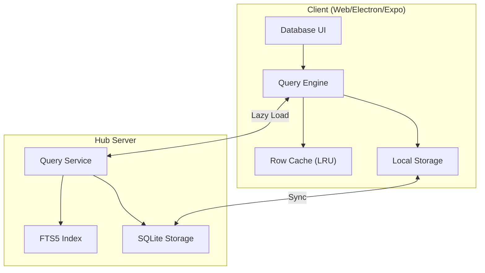
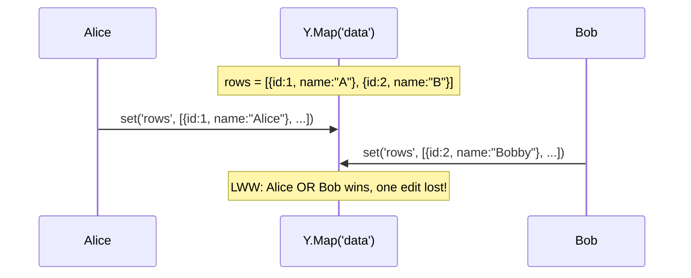
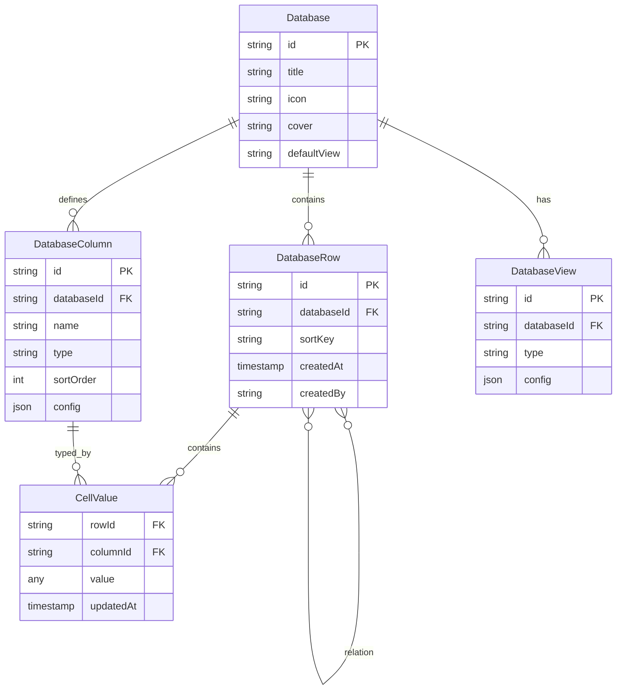
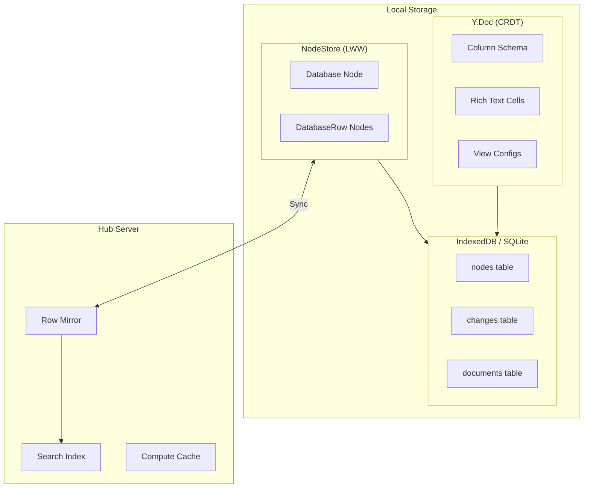
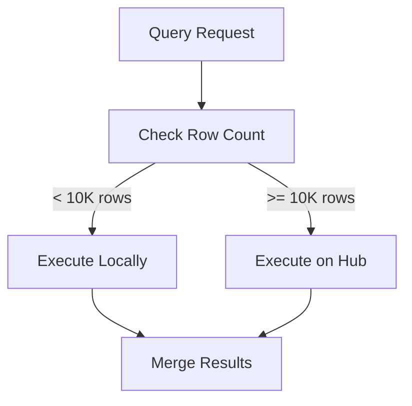
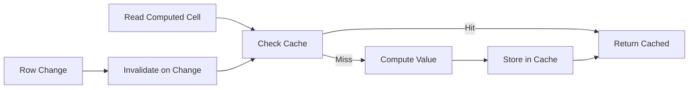
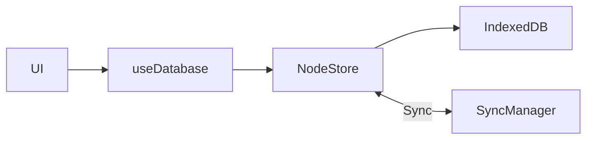
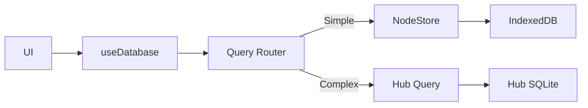
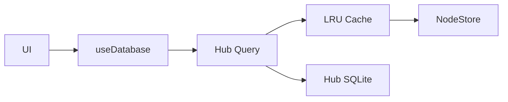
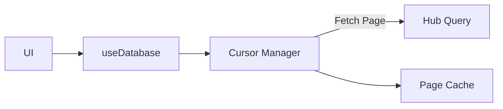

# Database Data Model V2: High-Performance Architecture for Massive Datasets

> A clean-slate design for xNet's database system that achieves full feature parity with Notion and Google Sheets while supporting millions of rows through hybrid local/remote storage, server-side queries, and intelligent lazy loading.

## Implementation Status

Substantial implementation exists in `packages/data/src/database/` (40+ files):

**Core Data Model:**

- [x] DatabaseRow nodes with per-cell LWW conflict resolution
- [x] Cell types and utilities (`cell-types.ts`)
- [x] Fractional indexing for row ordering (`fractional-index.ts`)
- [x] Rich text cell support via Y.Doc (`rich-text-cell.ts`)
- [x] Column definitions in Y.Doc (`column-operations.ts`, `column-types.ts`)

**Query System:**

- [x] Filter engine with all operators (`filter-engine.ts`, `filter-operators.ts`)
- [x] Sort engine (`sort-engine.ts`)
- [x] Group engine (`group-engine.ts`)
- [x] Query pipeline (`query-pipeline.ts`)
- [x] Query router for local/hub routing (`query-router.ts`)
- [x] Row cache with LRU eviction (`row-cache.ts`)

**Computed Columns:**

- [x] Rollup aggregation engine (`rollup-engine.ts`)
- [x] Formula parser and evaluator (`formula/`)
- [x] Formula service with validation (`formula-service.ts`)
- [x] Computed cache with invalidation (`computed-cache.ts`)

**Views:**

- [x] View types and configs (`view-types.ts`)
- [x] View operations (`view-operations.ts`)

**Import/Export:**

- [x] CSV import/export (`import/csv-parser.ts`, `export/csv-export.ts`)
- [x] JSON import/export (`import/json-parser.ts`, `export/json-export.ts`)

**Templates:**

- [x] Built-in templates (`templates/builtin.ts`)
- [x] Template instantiation (`templates/instantiate.ts`)

**React Hooks (in `packages/react/`):**

- [x] `useDatabase` with pagination
- [x] `useDatabaseDoc` for columns/views
- [x] `useDatabaseRow` for single row ops
- [x] `useDatabaseSchema` for database-defined schemas

**Not Yet Implemented:**

- [ ] Hub query integration (Phase 3)
- [ ] SQLite-WASM for large datasets
- [ ] Virtualized table with X+Y virtualization

**References**: This document supersedes the analysis in [0041_DATABASE_DATA_MODEL.md](./0041_DATABASE_DATA_MODEL.md). We're designing from scratch with no migration constraints.

**Date**: February 2026
**Status**: Substantially Implemented

## Executive Summary

This document presents a high-performance database architecture that:

- Supports **1M+ rows** per database with virtualized rendering and lazy loading
- Provides **full feature parity** with Notion (relations, rollups, formulas, views)
- Leverages **hub server queries** for server-side filtering, sorting, and pagination
- Uses **SQLite-WASM** on web for datasets exceeding IndexedDB limits
- Enables **real-time collaboration** at the row level via Yjs CRDTs
- Implements **computed columns** (rollups, formulas) with efficient caching



## Current Problems

### 1. Whole-Array Replacement



**Problem**: Cell edits replace the entire rows array. Concurrent edits to different cells conflict.

### 2. No Server-Side Queries

| Operation                 | Current                    | Target                        |
| ------------------------- | -------------------------- | ----------------------------- |
| Filter 10K rows by status | Load all 10K, filter in JS | Query hub, receive 50 matches |
| Sort by date              | Load all, sort in JS       | Query hub with ORDER BY       |
| Paginate                  | Load all, slice in JS      | Query hub with LIMIT/OFFSET   |
| Full-text search          | Not supported              | Hub FTS5 search               |

### 3. No Computed Columns

Rollup and formula types are defined in the schema system but not implemented. Notion-style computed columns are essential for database parity.

### 4. Memory Limits

A 100K row × 20 column database = 2M cell values in memory. This exceeds practical limits:

| Platform | IndexedDB Limit    | Practical Memory   |
| -------- | ------------------ | ------------------ |
| Chrome   | ~2GB               | ~500MB comfortable |
| Safari   | ~1GB               | ~200MB comfortable |
| Electron | Unlimited (SQLite) | ~1GB comfortable   |

## Design Goals

### Scale Targets

| Tier    | Rows     | Storage          | Query             |
| ------- | -------- | ---------------- | ----------------- |
| Small   | < 10K    | Local only       | In-memory         |
| Medium  | 10K-100K | Local + lazy hub | Hub queries       |
| Large   | 100K-1M  | Hub-primary      | Hub queries       |
| Massive | 1M+      | Hub + pagination | Cursor pagination |

### Feature Parity

| Feature                                | Notion          | Google Sheets | xNet Target |
| -------------------------------------- | --------------- | ------------- | ----------- |
| Basic types (text, number, date, etc.) | Yes             | Yes           | Yes         |
| Select / Multi-select                  | Yes             | Yes           | Yes         |
| Relations between databases            | Yes             | Limited       | Yes         |
| Rollup (aggregate related rows)        | Yes             | No            | Yes         |
| Formula (computed values)              | Yes             | Yes           | Yes         |
| Views (table, board, gallery, etc.)    | Yes             | Limited       | Yes         |
| Filters                                | Yes             | Yes           | Yes         |
| Sorts                                  | Yes             | Yes           | Yes         |
| Groups                                 | Yes             | Yes           | Yes         |
| Real-time collaboration                | Yes             | Yes           | Yes         |
| Row-level permissions                  | No              | Yes           | Future      |
| 1M+ rows                               | No (~10K limit) | Yes           | Yes         |

## Architecture Overview

### Data Model



### Storage Architecture



## Core Design Decisions

### Decision 1: Rows as Nodes

**Every database row is a first-class Node in the NodeStore.**

```typescript
// DatabaseRowSchema
export const DatabaseRowSchema = defineSchema({
  name: 'DatabaseRow',
  namespace: 'xnet://xnet.fyi/',
  properties: {
    database: relation({ target: 'xnet://xnet.fyi/Database', required: true }),
    sortKey: text({ required: true }) // Fractional index for ordering
    // Cell values stored as dynamic properties
  }
})
```

**Benefits:**

- Per-row identity (nanoid, timestamps, author)
- Per-property LWW conflict resolution
- Queryable via NodeStore
- Direct relations to rows (comments, links)
- Row-level sync (only changed rows transmit)

**Trade-offs:**

- More NodeStore operations than Y.Map approach
- Requires schema registry integration for dynamic columns

### Decision 2: Columns in Y.Doc

**Column definitions remain in the Database's Y.Doc for CRDT ordering.**

```typescript
// Database Y.Doc structure
const doc = useNode(DatabaseSchema, databaseId).doc

// Column schema (Y.Array for CRDT ordering)
const columns = doc.getArray<Y.Map>('columns')

// View configurations (Y.Map for per-view settings)
const views = doc.getMap('views')
```

**Why Y.Doc for columns:**

- Column reordering benefits from Yjs CRDT
- Column count is small (rarely > 100)
- Schema changes sync immediately to all peers

### Decision 3: Rich Text Cells in Row Y.Doc

**Rows with rich text columns have their own Y.Doc for collaborative editing.**

```typescript
// Row Y.Doc (only created if row has rich text columns)
const rowDoc = useNode(DatabaseRowSchema, rowId, {
  createIfMissing: { database: databaseId, sortKey: generateSortKey() }
}).doc

// Rich text cell
const notesCell = rowDoc?.getXmlFragment('richtext_notes')
```

**Why separate Y.Docs:**

- Rich text needs character-level CRDT
- Simple cells (text, number, etc.) use NodeStore LWW
- Only rows with rich text incur Y.Doc overhead

### Decision 4: Hub-Assisted Queries

**Large queries delegate to the hub server.**

```typescript
interface DatabaseQuery {
  databaseId: string
  filters?: FilterGroup
  sorts?: SortConfig[]
  search?: string // FTS5 full-text search
  limit?: number // Page size (default 50)
  cursor?: string // Cursor for next page
  includeComputed?: boolean // Include rollup/formula values
}

interface DatabaseQueryResult {
  rows: DatabaseRow[]
  total: number
  cursor?: string // For next page
  computedCache?: Map<string, Map<string, unknown>> // rowId -> columnId -> value
}
```

**Query Routing Logic:**



### Decision 5: Fractional Indexing for Row Order

**Row order uses fractional indexing, not array position.**

```typescript
// Generate sort key between two existing keys
function generateSortKey(before?: string, after?: string): string {
  // Uses lexicographic ordering (e.g., 'a0', 'a0V', 'a1')
  // Insert between 'a0' and 'a1' gives 'a0V'
  return fractionalIndex(before, after)
}

// Reorder: update single row's sortKey
await store.update(rowId, { properties: { sortKey: newKey } })
```

**Benefits:**

- O(1) insert/reorder (single row update)
- No global array to maintain
- Works with NodeStore queries: `sort: [{ property: 'sortKey', direction: 'asc' }]`

### Decision 6: Computed Columns with Caching

**Rollups and formulas compute on read with intelligent caching.**

```typescript
interface ComputedColumnConfig {
  type: 'rollup' | 'formula'

  // Rollup config
  relationColumn?: string // Which relation to aggregate
  targetColumn?: string // Which column on related rows
  aggregation?: 'sum' | 'avg' | 'count' | 'min' | 'max' | 'concat'

  // Formula config
  expression?: string // e.g., "{{price}} * {{quantity}}"
  dependencies?: string[] // Columns this formula depends on
}
```

**Caching Strategy:**



## Detailed Design

### Schema Definitions

```typescript
// packages/data/src/schema/schemas/database.ts

export const DatabaseSchema = defineSchema({
  name: 'Database',
  namespace: 'xnet://xnet.fyi/',
  properties: {
    title: text({ required: true, maxLength: 500 }),
    icon: text({}),
    cover: file({ accept: ['image/*'] }),
    defaultView: select({
      options: [
        { id: 'table', name: 'Table' },
        { id: 'board', name: 'Board' },
        { id: 'list', name: 'List' },
        { id: 'gallery', name: 'Gallery' },
        { id: 'calendar', name: 'Calendar' },
        { id: 'timeline', name: 'Timeline' }
      ],
      default: 'table'
    }),
    rowCount: number({ computed: true }) // Computed from row count
  },
  document: 'yjs' // For columns, views, row order
})

export const DatabaseRowSchema = defineSchema({
  name: 'DatabaseRow',
  namespace: 'xnet://xnet.fyi/',
  properties: {
    database: relation({ target: 'xnet://xnet.fyi/Database', required: true }),
    sortKey: text({ required: true })
    // Additional properties are dynamic (cell values)
  },
  document: 'yjs' // Optional: for rich text cells
})
```

### Column Types

```typescript
// packages/data/src/schema/properties/database-column-types.ts

type ColumnType =
  // Simple types (stored in NodeStore)
  | 'text'
  | 'number'
  | 'checkbox'
  | 'date'
  | 'dateRange'
  | 'select'
  | 'multiSelect'
  | 'person'
  | 'url'
  | 'email'
  | 'phone'
  | 'file'
  // Relation types
  | 'relation' // Link to rows in another database
  // Computed types
  | 'rollup' // Aggregate values from related rows
  | 'formula' // Computed expression
  // Rich types (stored in Y.Doc)
  | 'richText' // Collaborative rich text
  // Auto types
  | 'created' // Auto: creation timestamp
  | 'createdBy' // Auto: creator DID
  | 'updated' // Auto: last update timestamp
  | 'updatedBy' // Auto: last updater DID

interface ColumnDefinition {
  id: string
  name: string
  type: ColumnType
  config: ColumnConfig
  sortOrder: number
}

type ColumnConfig =
  | TextColumnConfig
  | NumberColumnConfig
  | SelectColumnConfig
  | RelationColumnConfig
  | RollupColumnConfig
  | FormulaColumnConfig
  | DateColumnConfig
  | FileColumnConfig

interface SelectColumnConfig {
  options: Array<{ id: string; name: string; color?: string }>
  allowCreate?: boolean
}

interface RelationColumnConfig {
  targetDatabase: string // Database ID
  allowMultiple?: boolean
}

interface RollupColumnConfig {
  relationColumn: string // Column ID of the relation
  targetColumn: string // Column ID on related rows
  aggregation: 'sum' | 'avg' | 'count' | 'min' | 'max' | 'concat' | 'unique'
}

interface FormulaColumnConfig {
  expression: string // e.g., "{{price}} * {{quantity}}"
  resultType: 'text' | 'number' | 'date' | 'checkbox'
}
```

### Query Engine

```typescript
// packages/data/src/database/query-engine.ts

export interface QueryEngine {
  /**
   * Query rows with filters, sorts, and pagination.
   * Automatically routes to local or hub based on dataset size.
   */
  query(databaseId: string, options: QueryOptions): Promise<QueryResult>

  /**
   * Get a single row by ID.
   */
  getRow(rowId: string): Promise<DatabaseRow | null>

  /**
   * Subscribe to query result changes.
   */
  subscribe(
    databaseId: string,
    options: QueryOptions,
    callback: (result: QueryResult) => void
  ): () => void

  /**
   * Get computed value for a cell (rollup/formula).
   */
  getComputedValue(rowId: string, columnId: string): Promise<unknown>

  /**
   * Invalidate computed cache for a row.
   */
  invalidateComputed(rowId: string): void
}

interface QueryOptions {
  filters?: FilterGroup
  sorts?: SortConfig[]
  search?: string
  limit?: number
  cursor?: string
  select?: string[] // Only return specific columns
}

interface QueryResult {
  rows: DatabaseRow[]
  total: number
  hasMore: boolean
  cursor?: string
  source: 'local' | 'hub' | 'hybrid'
}
```

### Hub Query Protocol

```typescript
// packages/hub/src/services/database-query.ts

// Request: query-database
interface DatabaseQueryRequest {
  type: 'query-database'
  id: string // Request ID
  databaseId: string
  filters?: FilterGroup
  sorts?: SortConfig[]
  search?: string
  limit?: number
  cursor?: string
  select?: string[]
}

// Response: database-query-result
interface DatabaseQueryResponse {
  type: 'database-query-result'
  id: string
  rows: SerializedRow[]
  total: number
  cursor?: string
  computedCache?: Record<string, Record<string, unknown>>
}

// Request: subscribe-database
interface DatabaseSubscribeRequest {
  type: 'subscribe-database'
  databaseId: string
  options: QueryOptions
}

// Push: database-change
interface DatabaseChangeNotification {
  type: 'database-change'
  databaseId: string
  changes: Array<{
    type: 'insert' | 'update' | 'delete'
    rowId: string
    row?: SerializedRow
  }>
}
```

### View System

```typescript
// packages/views/src/types.ts

interface ViewConfig {
  id: string
  name: string
  type: ViewType

  // Column visibility and order
  visibleColumns: string[]
  columnWidths?: Record<string, number>

  // Filtering
  filters?: FilterGroup

  // Sorting
  sorts?: SortConfig[]

  // Grouping
  groupBy?: string
  groupSort?: 'asc' | 'desc'
  collapsedGroups?: string[]

  // View-specific
  coverColumn?: string // Gallery: show as cover image
  cardSize?: 'small' | 'medium' | 'large'
  dateColumn?: string // Calendar/Timeline: date field
  endDateColumn?: string // Timeline: end date for ranges
}

interface FilterGroup {
  operator: 'and' | 'or'
  conditions: Array<FilterCondition | FilterGroup>
}

interface FilterCondition {
  columnId: string
  operator: FilterOperator
  value: unknown
}

type FilterOperator =
  | 'equals'
  | 'notEquals'
  | 'contains'
  | 'notContains'
  | 'startsWith'
  | 'endsWith'
  | 'isEmpty'
  | 'isNotEmpty'
  | 'greaterThan'
  | 'lessThan'
  | 'greaterOrEqual'
  | 'lessOrEqual'
  | 'before'
  | 'after'
  | 'between'
  | 'hasAny'
  | 'hasAll'
  | 'hasNone' // For multi-select

type SortConfig = {
  columnId: string
  direction: 'asc' | 'desc'
}
```

### React Hooks

```typescript
// packages/react/src/hooks/useDatabase.ts

export interface UseDatabaseResult {
  // Database metadata
  database: FlatNode<typeof DatabaseSchema> | null
  columns: ColumnDefinition[]
  views: ViewConfig[]

  // Row data (paginated)
  rows: DatabaseRow[]
  total: number
  hasMore: boolean
  loadMore: () => Promise<void>

  // Current view
  activeView: ViewConfig
  setActiveView: (viewId: string) => void

  // Mutations
  createRow: (values?: Record<string, unknown>) => Promise<string>
  updateRow: (rowId: string, values: Record<string, unknown>) => Promise<void>
  deleteRow: (rowId: string) => Promise<void>
  reorderRow: (rowId: string, before?: string, after?: string) => Promise<void>

  // Column mutations
  createColumn: (config: Partial<ColumnDefinition>) => Promise<string>
  updateColumn: (columnId: string, config: Partial<ColumnDefinition>) => Promise<void>
  deleteColumn: (columnId: string) => Promise<void>
  reorderColumn: (columnId: string, newIndex: number) => Promise<void>

  // View mutations
  createView: (config: Partial<ViewConfig>) => Promise<string>
  updateView: (viewId: string, config: Partial<ViewConfig>) => Promise<void>
  deleteView: (viewId: string) => Promise<void>

  // Query state
  loading: boolean
  error: Error | null
  source: 'local' | 'hub' | 'hybrid'
}

export function useDatabase(
  databaseId: string,
  options?: {
    view?: string
    filters?: FilterGroup
    sorts?: SortConfig[]
    search?: string
    pageSize?: number
  }
): UseDatabaseResult
```

```typescript
// packages/react/src/hooks/useDatabaseRow.ts

export interface UseDatabaseRowResult {
  row: DatabaseRow | null
  doc: Y.Doc | null // For rich text cells

  update: (values: Record<string, unknown>) => Promise<void>
  delete: () => Promise<void>

  // Computed values
  getComputed: (columnId: string) => unknown

  loading: boolean
  error: Error | null
}

export function useDatabaseRow(rowId: string): UseDatabaseRowResult
```

### Virtualized Table

```typescript
// packages/views/src/components/VirtualizedTable.tsx

interface VirtualizedTableProps {
  database: UseDatabaseResult
  onRowClick?: (rowId: string) => void
  onCellEdit?: (rowId: string, columnId: string, value: unknown) => void
}

export function VirtualizedTable({ database, onRowClick, onCellEdit }: VirtualizedTableProps) {
  const containerRef = useRef<HTMLDivElement>(null)

  // Row virtualization (Y-axis)
  const rowVirtualizer = useVirtualizer({
    count: database.total,
    getScrollElement: () => containerRef.current,
    estimateSize: () => 36, // Row height
    overscan: 10,
  })

  // Column virtualization (X-axis)
  const columnVirtualizer = useVirtualizer({
    horizontal: true,
    count: database.columns.length,
    getScrollElement: () => containerRef.current,
    estimateSize: (i) => database.activeView.columnWidths?.[database.columns[i].id] ?? 200,
    overscan: 2,
  })

  // Load more rows as user scrolls
  useEffect(() => {
    const lastItem = rowVirtualizer.getVirtualItems().at(-1)
    if (lastItem && lastItem.index >= database.rows.length - 5 && database.hasMore) {
      database.loadMore()
    }
  }, [rowVirtualizer.getVirtualItems()])

  return (
    <div ref={containerRef} className="overflow-auto h-full">
      <div style={{ height: rowVirtualizer.getTotalSize(), width: columnVirtualizer.getTotalSize() }}>
        {rowVirtualizer.getVirtualItems().map(virtualRow => (
          <div
            key={virtualRow.key}
            style={{
              position: 'absolute',
              top: virtualRow.start,
              height: virtualRow.size,
              width: '100%',
            }}
          >
            {columnVirtualizer.getVirtualItems().map(virtualCol => (
              <Cell
                key={virtualCol.key}
                row={database.rows[virtualRow.index]}
                column={database.columns[virtualCol.index]}
                style={{
                  position: 'absolute',
                  left: virtualCol.start,
                  width: virtualCol.size,
                }}
                onEdit={(value) => onCellEdit?.(
                  database.rows[virtualRow.index].id,
                  database.columns[virtualCol.index].id,
                  value
                )}
              />
            ))}
          </div>
        ))}
      </div>
    </div>
  )
}
```

## Storage Tiers

### Tier 1: Small Databases (< 10K rows)

**Storage**: Local NodeStore only
**Queries**: In-memory filtering and sorting
**Sync**: Real-time via SyncManager



### Tier 2: Medium Databases (10K-100K rows)

**Storage**: Local + Hub mirror
**Queries**: Hub-assisted for complex filters
**Sync**: Background sync with hub



### Tier 3: Large Databases (100K-1M rows)

**Storage**: Hub-primary with local cache
**Queries**: Always via hub
**Sync**: Lazy load visible rows only



### Tier 4: Massive Databases (1M+ rows)

**Storage**: Hub-only with cursor pagination
**Queries**: Streaming via cursor
**Sync**: On-demand fetch



## Hub Server Extensions

### Database Query Service

```typescript
// packages/hub/src/services/database-query.ts

export class DatabaseQueryService {
  private storage: HubStorage

  async query(request: DatabaseQueryRequest): Promise<DatabaseQueryResponse> {
    const { databaseId, filters, sorts, search, limit = 50, cursor, select } = request

    // Build SQL query
    let sql = `
      SELECT r.* 
      FROM database_rows r
      WHERE r.database_id = ?
    `
    const params: unknown[] = [databaseId]

    // Apply filters
    if (filters) {
      const { clause, values } = this.buildFilterClause(filters)
      sql += ` AND ${clause}`
      params.push(...values)
    }

    // Full-text search
    if (search) {
      sql += ` AND r.id IN (SELECT rowid FROM database_rows_fts WHERE database_rows_fts MATCH ?)`
      params.push(search)
    }

    // Apply sorts
    if (sorts && sorts.length > 0) {
      const orderBy = sorts.map((s) => `${s.columnId} ${s.direction}`).join(', ')
      sql += ` ORDER BY ${orderBy}`
    } else {
      sql += ` ORDER BY sort_key ASC`
    }

    // Pagination
    sql += ` LIMIT ?`
    params.push(limit + 1) // Fetch one extra to detect hasMore

    if (cursor) {
      const cursorData = this.decodeCursor(cursor)
      sql += ` OFFSET ?`
      params.push(cursorData.offset)
    }

    const rows = await this.storage.query(sql, params)
    const hasMore = rows.length > limit
    const resultRows = hasMore ? rows.slice(0, limit) : rows

    return {
      type: 'database-query-result',
      id: request.id,
      rows: resultRows,
      total: await this.getTotal(databaseId, filters, search),
      cursor: hasMore
        ? this.encodeCursor({ offset: (cursor ? this.decodeCursor(cursor).offset : 0) + limit })
        : undefined
    }
  }

  private buildFilterClause(group: FilterGroup): { clause: string; values: unknown[] } {
    const clauses: string[] = []
    const values: unknown[] = []

    for (const condition of group.conditions) {
      if ('operator' in condition && 'conditions' in condition) {
        // Nested group
        const nested = this.buildFilterClause(condition as FilterGroup)
        clauses.push(`(${nested.clause})`)
        values.push(...nested.values)
      } else {
        // Simple condition
        const { columnId, operator, value } = condition as FilterCondition
        const { clause, params } = this.buildCondition(columnId, operator, value)
        clauses.push(clause)
        values.push(...params)
      }
    }

    const joinOp = group.operator === 'and' ? ' AND ' : ' OR '
    return { clause: clauses.join(joinOp), values }
  }
}
```

### FTS5 Index for Database Rows

```sql
-- packages/hub/src/storage/schema.sql

CREATE TABLE database_rows (
  id TEXT PRIMARY KEY,
  database_id TEXT NOT NULL,
  sort_key TEXT NOT NULL,
  data JSON NOT NULL,
  created_at INTEGER NOT NULL,
  updated_at INTEGER NOT NULL,
  FOREIGN KEY (database_id) REFERENCES databases(id)
);

CREATE INDEX idx_rows_database ON database_rows(database_id);
CREATE INDEX idx_rows_sort ON database_rows(database_id, sort_key);

-- FTS5 for full-text search
CREATE VIRTUAL TABLE database_rows_fts USING fts5(
  content,
  content='database_rows',
  content_rowid='rowid'
);

-- Triggers to keep FTS in sync
CREATE TRIGGER rows_ai AFTER INSERT ON database_rows BEGIN
  INSERT INTO database_rows_fts(rowid, content)
  VALUES (new.rowid, json_extract(new.data, '$.searchable'));
END;

CREATE TRIGGER rows_ad AFTER DELETE ON database_rows BEGIN
  INSERT INTO database_rows_fts(database_rows_fts, rowid, content)
  VALUES('delete', old.rowid, json_extract(old.data, '$.searchable'));
END;

CREATE TRIGGER rows_au AFTER UPDATE ON database_rows BEGIN
  INSERT INTO database_rows_fts(database_rows_fts, rowid, content)
  VALUES('delete', old.rowid, json_extract(old.data, '$.searchable'));
  INSERT INTO database_rows_fts(rowid, content)
  VALUES (new.rowid, json_extract(new.data, '$.searchable'));
END;
```

## Implementation Phases

### Phase 1: Core Data Model (Weeks 1-3)

- [ ] Create `DatabaseRowSchema` with dynamic properties
- [ ] Implement fractional indexing for row ordering
- [ ] Update Database Y.Doc structure for columns
- [ ] Create `useDatabase` hook with local-only queries
- [ ] Implement basic CRUD operations

#### Checklist: Phase 1

- [ ] Schema definitions
  - [ ] `DatabaseRowSchema` in `packages/data/src/schema/schemas/`
  - [ ] Dynamic property support in NodeStore
  - [ ] Fractional index utility in `packages/data/src/utils/`
- [ ] Y.Doc structure
  - [ ] `Y.Array('columns')` for column definitions
  - [ ] `Y.Map('views')` for view configurations
  - [ ] Migration from flat JSON to Yjs types
- [ ] React hooks
  - [ ] `useDatabase` with basic queries
  - [ ] `useDatabaseRow` for single row operations
  - [ ] `useDatabaseColumn` for column mutations
- [ ] Tests
  - [ ] Unit tests for row CRUD
  - [ ] Unit tests for fractional indexing
  - [ ] Integration tests for Y.Doc sync

### Phase 2: View System (Weeks 4-6)

- [ ] Implement all view types (table, board, gallery, calendar, timeline, list)
- [ ] Add filter builder UI
- [ ] Add sort configuration
- [ ] Add group-by support
- [ ] Implement X+Y virtualization for table view

#### Checklist: Phase 2

- [ ] View components
  - [ ] `VirtualizedTable` with X+Y virtualization
  - [ ] `BoardView` with dnd-kit
  - [ ] `GalleryView` with grid layout
  - [ ] `CalendarView` with month/week/day
  - [ ] `TimelineView` with zoom
  - [ ] `ListView` with compact rows
- [ ] Filter system
  - [ ] `FilterBuilder` component
  - [ ] Filter operators for all column types
  - [ ] Filter persistence in ViewConfig
- [ ] Sort system
  - [ ] Multi-column sorting
  - [ ] Sort persistence in ViewConfig
- [ ] Group system
  - [ ] Group-by for all groupable types
  - [ ] Collapsible groups
  - [ ] Group aggregation headers

### Phase 3: Hub Integration (Weeks 7-9)

- [ ] Implement `DatabaseQueryService` on hub
- [ ] Add FTS5 index for database rows
- [ ] Implement query routing logic
- [ ] Add cursor pagination
- [ ] Implement real-time subscriptions

#### Checklist: Phase 3

- [ ] Hub services
  - [ ] `DatabaseQueryService` with filter/sort/pagination
  - [ ] FTS5 schema and triggers
  - [ ] Row sync protocol
  - [ ] Subscription management
- [ ] Client integration
  - [ ] Query router based on row count
  - [ ] Cursor pagination in hooks
  - [ ] LRU cache for rows
  - [ ] Optimistic updates
- [ ] Performance
  - [ ] Benchmark 100K row queries
  - [ ] Benchmark subscription overhead
  - [ ] Memory profiling

### Phase 4: Computed Columns (Weeks 10-11)

- [ ] Implement rollup aggregation
- [ ] Implement formula parsing and evaluation
- [ ] Add computed value caching
- [ ] Add cache invalidation

#### Checklist: Phase 4

- [ ] Rollup implementation
  - [ ] Aggregation functions (sum, avg, count, min, max, concat, unique)
  - [ ] Relation traversal
  - [ ] Cache per row+column
- [ ] Formula implementation
  - [ ] Expression parser
  - [ ] Function library (IF, AND, OR, etc.)
  - [ ] Dependency tracking
  - [ ] Circular reference detection
- [ ] Caching
  - [ ] In-memory cache
  - [ ] Hub-side computation
  - [ ] Invalidation on dependency change

### Phase 5: Advanced Features (Weeks 12-14)

- [ ] Add relation linking UI
- [ ] Add rollup configuration UI
- [ ] Add formula editor
- [ ] Add import/export (CSV, JSON)
- [ ] Add templates

#### Checklist: Phase 5

- [ ] Relation UI
  - [ ] Row picker modal
  - [ ] Inline relation display
  - [ ] Reverse relation view
- [ ] Computed UI
  - [ ] Rollup configuration modal
  - [ ] Formula editor with autocomplete
  - [ ] Computed column indicators
- [ ] Import/Export
  - [ ] CSV import with column mapping
  - [ ] CSV export with all views
  - [ ] JSON export/import
- [ ] Templates
  - [ ] Pre-built database templates
  - [ ] Template creation from existing database

## Performance Considerations

### IndexedDB vs SQLite-WASM

| Metric       | IndexedDB     | SQLite-WASM (OPFS) |
| ------------ | ------------- | ------------------ |
| Max size     | ~2GB          | Unlimited          |
| Query speed  | Slow (no SQL) | Fast (indexed)     |
| Transactions | Async only    | Sync available     |
| FTS support  | No            | Yes (FTS5)         |
| Complexity   | Low           | Medium             |

**Recommendation**: Use SQLite-WASM for databases > 100K rows.

### Memory Budget

| Component      | Small DB | Medium DB | Large DB    |
| -------------- | -------- | --------- | ----------- |
| Row cache      | All rows | 10K rows  | 1K rows     |
| Computed cache | All      | LRU 10K   | LRU 1K      |
| Y.Doc          | Full     | Full      | Schema only |

### Network Optimization

```typescript
// Batch row fetches
const rows = await queryEngine.query(databaseId, {
  filters,
  limit: 100,
  select: ['id', 'sortKey', ...visibleColumns] // Only fetch needed columns
})

// Prefetch next page
useEffect(() => {
  if (scrollPosition > 80% && hasMore) {
    prefetchNextPage()
  }
}, [scrollPosition])
```

## Security Considerations

### Row-Level Access (Future)

```typescript
interface RowPermission {
  rowId: string
  grants: Array<{
    did: string
    permission: 'read' | 'write' | 'admin'
  }>
}
```

### Hub Query Authorization

```typescript
// Hub validates UCAN before executing queries
const token = await getHubAuthToken()
const result = await hubQuery({
  ...query,
  authorization: token
})
```

## Open Questions

1. **SQLite-WASM adoption**: Should we use SQLite-WASM on web for all databases, or only large ones?

2. **Computed column caching**: Should computed values be cached in the hub or client-side?

3. **Offline support**: How do we handle large database queries when offline?

4. **Collaboration on rows**: Should row edits use Y.Doc or NodeStore? What about concurrent cell edits?

5. **Schema evolution**: How do we handle column type changes (e.g., text → number)?

## References

- [0041_DATABASE_DATA_MODEL.md](./0041_DATABASE_DATA_MODEL.md) - Original exploration
- [0043_OFF_MAIN_THREAD_ARCHITECTURE.md](./0043_OFF_MAIN_THREAD_ARCHITECTURE.md) - Off-thread design
- [0066_OFF_MAIN_THREAD_IMPLEMENTATION.md](./0066_OFF_MAIN_THREAD_IMPLEMENTATION.md) - Implementation guide
- [TanStack Virtual](https://tanstack.com/virtual/latest) - Virtualization library
- [Fractional Indexing](https://www.figma.com/blog/realtime-editing-of-ordered-sequences/) - Figma's approach
- [Notion Data Model](https://www.notion.so/blog/data-model-behind-notion) - Inspiration
