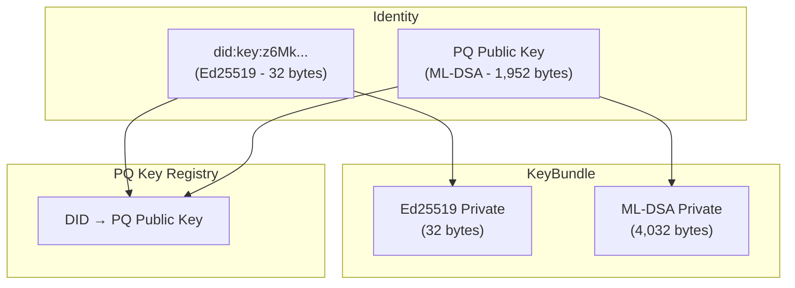
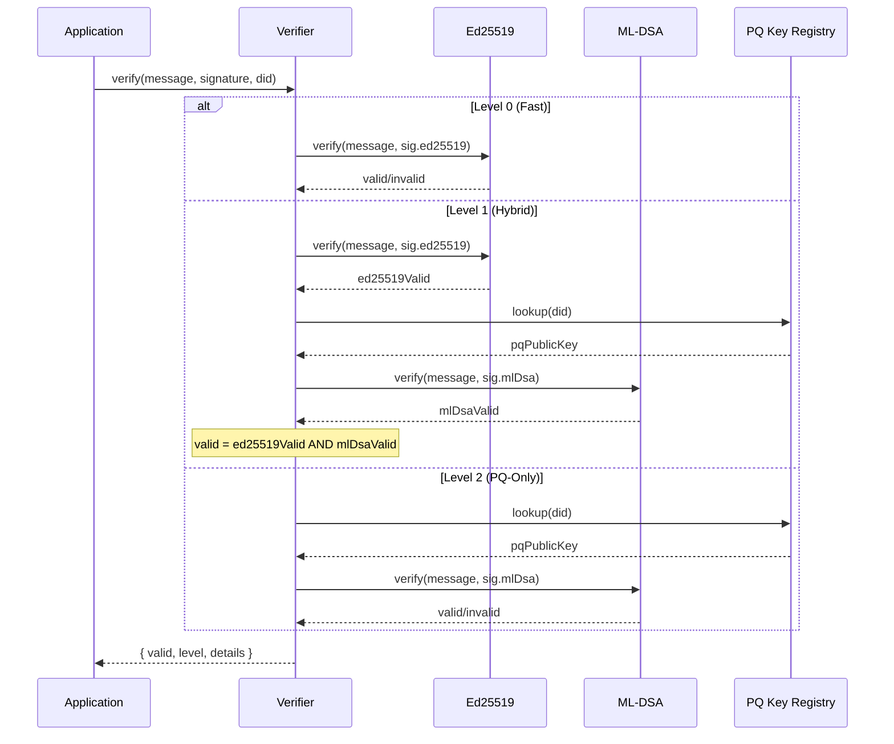
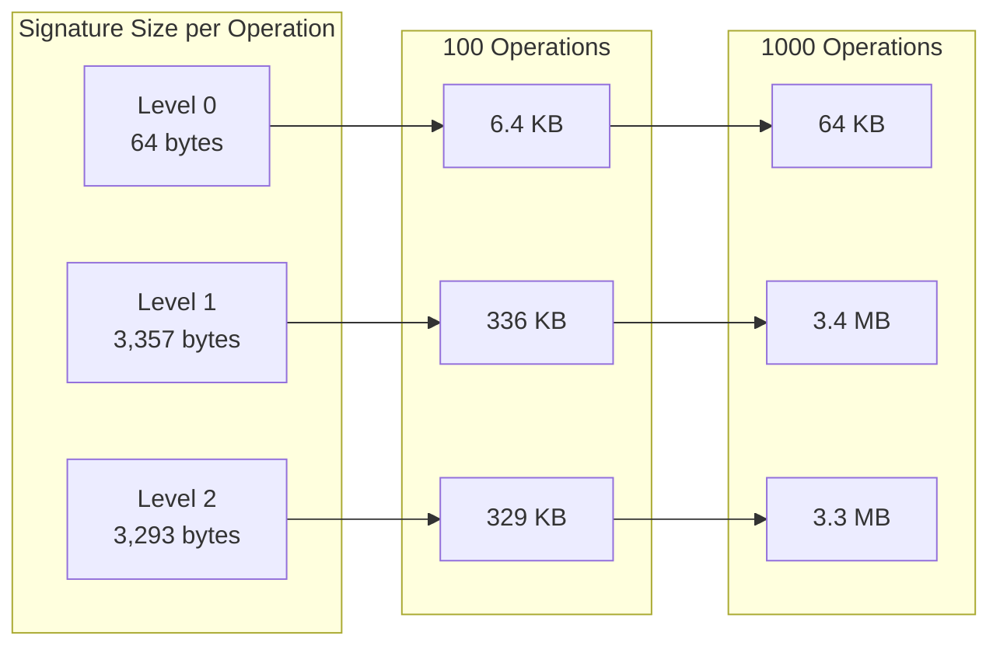

# Multi-Level Cryptography: Hybrid Classical and Post-Quantum Security

> How do we support both fast, compact Ed25519 signatures for everyday operations AND post-quantum security for high-value data, with seamless interoperability and developer-configurable security levels? This exploration designs a hybrid cryptographic architecture that's ready for the quantum future while staying performant today.

**Date**: February 2026
**Status**: Exploration
**Prerequisites**: Understanding of current `@xnet/crypto` and `@xnet/identity` packages

---

## Implementation Status

> **Status: COMPLETE** - Multi-level cryptography is fully implemented across `@xnet/crypto`, `@xnet/identity`, `@xnet/sync`, and `@xnet/react`.

### Phase 1: Core Crypto ✅

- [x] Add @noble/post-quantum dependency (`^0.5.4` in packages/crypto/package.json)
- [x] `SecurityLevel` type and `SECURITY_LEVELS` config (security-level.ts)
- [x] `UnifiedSignature` type with ed25519/mlDsa fields (unified-signature.ts)
- [x] `hybridSign()` - sign at Level 0/1/2 (hybrid-signing.ts)
- [x] `hybridVerify()` - verify with strict/permissive policy (hybrid-signing.ts)
- [x] `generateHybridKeyPair()` - generate Ed25519 + ML-DSA keys (hybrid-keygen.ts)
- [x] `deriveHybridKeyPair()` - deterministic derivation from seed (hybrid-keygen.ts)
- [x] Algorithm size constants (constants.ts)
- [x] Signature codec for wire format (signature-codec.ts)
- [x] Verification cache with LRU eviction (cache/verification-cache.ts)
- [x] Crypto metrics collector (metrics/crypto-metrics.ts)
- [x] Comprehensive unit tests (security.test.ts, benchmark.test.ts, etc.)

### Phase 2: Identity & Keys ✅

- [x] `HybridKeyBundle` type with PQ keys (key-bundle.ts)
- [x] `PQKeyAttestation` type (pq-attestation.ts)
- [x] `createPQKeyAttestation()` - dual-signed attestation (pq-attestation.ts)
- [x] `verifyPQKeyAttestation()` - verify both signatures (pq-attestation.ts)
- [x] `PQKeyRegistry` interface (pq-registry.ts)
- [x] `MemoryPQKeyRegistry` implementation (pq-registry.ts)
- [x] Attestation serialization/deserialization (pq-attestation.ts)
- [x] Key bundle creation with registry integration (key-bundle.ts)

### Phase 3: Sync & Wire Format ✅

- [x] `SignedYjsEnvelope` with multi-level signatures (yjs-envelope.ts)
- [x] `signYjsUpdate()` with security level support (yjs-envelope.ts)
- [x] `verifyYjsEnvelope()` with registry lookup (yjs-envelope.ts)
- [x] ClientID attestation with hybrid signing (clientid-attestation.ts)
- [x] Security policy configuration (security-policy.ts)
- [x] Multi-level integration tests (multi-level-integration.test.ts)

### Phase 4: React Integration ✅

- [x] `SecurityContext` with level/policy/registry (context/security-context.tsx)
- [x] `SecurityProvider` component (context/security-context.tsx)
- [x] `useSecurityContext()` hook (context/security-context.tsx)
- [x] `useSecurity()` hook for signing/verification (hooks/useSecurity.ts)
- [x] XNetProvider security configuration (context.ts)

### Phase 5: Optimization ✅

- [x] `VerificationCache` with configurable TTL and max size
- [x] `hybridVerifyCached()` for cached verification
- [x] `hybridVerifyBatch()` for batch verification
- [x] `hybridVerifyBatchAsync()` for parallel verification
- [x] `CryptoMetricsCollector` for performance tracking
- [x] Performance benchmarks (benchmark.test.ts)

### Key Implementation Files

- `packages/crypto/src/security-level.ts` - Security level types and config
- `packages/crypto/src/unified-signature.ts` - Unified signature type
- `packages/crypto/src/hybrid-signing.ts` - Sign/verify at all levels
- `packages/crypto/src/hybrid-keygen.ts` - Key generation and derivation
- `packages/crypto/src/cache/verification-cache.ts` - LRU verification cache
- `packages/identity/src/pq-attestation.ts` - PQ key attestations
- `packages/identity/src/pq-registry.ts` - PQ key registry
- `packages/react/src/context/security-context.tsx` - React security context

---

> **Note**: xNet is prerelease software. This exploration assumes we can make breaking changes freely - there are no production users to migrate. We should pick the best architecture from the start rather than designing for backward compatibility with the current Ed25519-only implementation.

## Executive Summary

Quantum computers capable of breaking Ed25519 and other elliptic curve cryptography may arrive within a decade. NIST finalized three post-quantum cryptographic standards in August 2024:

- **ML-KEM (FIPS 203)** - Key encapsulation (formerly CRYSTALS-Kyber)
- **ML-DSA (FIPS 204)** - Digital signatures (formerly CRYSTALS-Dilithium)
- **SLH-DSA (FIPS 205)** - Backup signatures (formerly SPHINCS+)

These algorithms have **dramatically larger** key and signature sizes compared to Ed25519:

| Algorithm              | Public Key  | Signature   | Security Level     |
| ---------------------- | ----------- | ----------- | ------------------ |
| Ed25519                | 32 bytes    | 64 bytes    | ~128-bit classical |
| ML-DSA-44 (Dilithium2) | 1,312 bytes | 2,420 bytes | 128-bit quantum    |
| ML-DSA-65 (Dilithium3) | 1,952 bytes | 3,293 bytes | 192-bit quantum    |
| ML-DSA-87 (Dilithium5) | 2,592 bytes | 4,595 bytes | 256-bit quantum    |
| SLH-DSA-128s           | 32 bytes    | 7,856 bytes | 128-bit quantum    |

This exploration proposes a **multi-level hybrid approach** with **hybrid as the default**:

1. **Level 0 (Fast)**: Ed25519 only - for high-frequency, low-value operations (cursor updates, etc.)
2. **Level 1 (Hybrid) - DEFAULT**: Ed25519 + ML-DSA - both signatures required
3. **Level 2 (PQ-Only)**: ML-DSA only - maximum quantum security, no classical fallback

Since xNet is prerelease, we implement this as a **clean replacement** rather than a migration. No backward compatibility with Ed25519-only formats is needed - users simply delete their database and start fresh.

The key insight: **DID:key can remain Ed25519-based** (compact, human-readable) while a separate **PQ Key Registry** associates each DID with its post-quantum public key. This gives us compact, memorable identifiers with full quantum security.

```
┌─────────────────────────────────────────────────────────────────┐
│                    Multi-Level Crypto Architecture               │
├─────────────────────────────────────────────────────────────────┤
│                                                                  │
│  ┌──────────────┐  ┌──────────────┐  ┌──────────────┐          │
│  │   Level 0    │  │   Level 1    │  │   Level 2    │          │
│  │   (Fast)     │  │  (Hybrid)    │  │  (PQ-Only)   │          │
│  ├──────────────┤  ├──────────────┤  ├──────────────┤          │
│  │ Ed25519 only │  │ Ed25519 +    │  │ ML-DSA only  │          │
│  │ 64-byte sig  │  │ ML-DSA       │  │ ~3KB sig     │          │
│  │ Fastest      │  │ ~3.4KB sig   │  │ Slowest      │          │
│  │ Opt-in perf  │  │ **DEFAULT**  │  │ Max security │          │
│  └──────────────┘  └──────────────┘  └──────────────┘          │
│         │                 │                 │                   │
│         ▼                 ▼                 ▼                   │
│  ┌─────────────────────────────────────────────────────────┐   │
│  │                    Unified Signature                     │   │
│  │  {                                                       │   │
│  │    level: 0 | 1 | 2,                                     │   │
│  │    ed25519?: Uint8Array,   // 64 bytes                   │   │
│  │    mlDsa?: Uint8Array      // ~3KB                       │   │
│  │  }                                                       │   │
│  └─────────────────────────────────────────────────────────┘   │
│                              │                                  │
│                              ▼                                  │
│  ┌─────────────────────────────────────────────────────────┐   │
│  │                    DID:key (Ed25519)                     │   │
│  │                    did:key:z6Mk...                        │   │
│  │                         +                                 │   │
│  │              PQ Key Registry (ML-DSA)                    │   │
│  │              did -> pqPublicKey mapping                   │   │
│  └─────────────────────────────────────────────────────────┘   │
│                                                                  │
└─────────────────────────────────────────────────────────────────┘
```

## Part 1: The Quantum Threat and Timeline

### Why Post-Quantum Matters Now

Cryptographically Relevant Quantum Computers (CRQCs) don't exist yet, but:

1. **Harvest Now, Decrypt Later**: Adversaries can store encrypted data today and decrypt it when quantum computers become available
2. **Migration Takes Time**: Updating cryptographic infrastructure is a multi-year effort
3. **NIST Mandate**: US federal agencies must transition to PQC by 2035

### NIST Standardized Algorithms (August 2024)

**For Signatures (our primary concern):**

| Standard           | Algorithm | Based On           | Use Case            |
| ------------------ | --------- | ------------------ | ------------------- |
| FIPS 204           | ML-DSA    | CRYSTALS-Dilithium | Primary signatures  |
| FIPS 205           | SLH-DSA   | SPHINCS+           | Backup (hash-based) |
| FIPS 206 (pending) | FN-DSA    | FALCON             | Compact signatures  |

**For Key Exchange:**

| Standard | Algorithm | Based On       | Use Case          |
| -------- | --------- | -------------- | ----------------- |
| FIPS 203 | ML-KEM    | CRYSTALS-Kyber | Key encapsulation |

### Why ML-DSA (Dilithium)?

We recommend ML-DSA as the primary post-quantum signature algorithm because:

1. **NIST Primary**: It's the main standard for digital signatures
2. **Lattice-based**: Same mathematical foundation as ML-KEM (simpler to reason about)
3. **Reasonable Performance**: ~2-3ms sign, ~0.5ms verify (vs ~0.1/0.2ms for Ed25519)
4. **Stateless**: Unlike SPHINCS+, no state to manage

SLH-DSA (SPHINCS+) uses only hash functions and could serve as a backup if lattice problems prove weaker than expected, but its signatures are **much larger** (7-50KB).

## Part 2: Current xNet Crypto Architecture

### What We Have Today

```
┌─────────────────────────────────────────────────────────────────┐
│                       @xnet/crypto                               │
├─────────────────────────────────────────────────────────────────┤
│                                                                  │
│  Signing: Ed25519 (@noble/curves)                               │
│    - sign(message, privateKey) → 64-byte signature              │
│    - verify(message, signature, publicKey) → boolean            │
│    - generateSigningKeyPair() → { publicKey, privateKey }       │
│                                                                  │
│  Key Exchange: X25519 (@noble/curves)                           │
│    - deriveSharedSecret(privateKey, publicKey) → 32-byte secret │
│                                                                  │
│  Hashing: BLAKE3 + SHA-256 (@noble/hashes)                      │
│    - hash(data, 'blake3') → 32-byte hash                        │
│    - hkdf(ikm, info, length) → derived key                      │
│                                                                  │
│  Symmetric: XChaCha20-Poly1305 (@noble/ciphers)                 │
│    - encrypt(data, key, nonce) → ciphertext                     │
│    - decrypt(ciphertext, key, nonce) → data                     │
│                                                                  │
└─────────────────────────────────────────────────────────────────┘
```

### Key Sizes Summary

| Component           | Current Size | Post-Quantum Size       | Increase |
| ------------------- | ------------ | ----------------------- | -------- |
| Signing Private Key | 32 bytes     | 4,032 bytes (ML-DSA-65) | 126x     |
| Signing Public Key  | 32 bytes     | 1,952 bytes (ML-DSA-65) | 61x      |
| Signature           | 64 bytes     | 3,293 bytes (ML-DSA-65) | 51x      |
| DID:key string      | ~56 chars    | N/A (see below)         | -        |

### Where Signatures Are Used

1. **Change<T>** (`@xnet/sync`): Every NodeStore mutation
2. **SignedYjsEnvelope** (`@xnet/sync`): Every Yjs update batch
3. **UCAN tokens** (`@xnet/identity`): Authorization
4. **ClientID attestations** (`@xnet/sync`): Yjs client binding

### Current Wire Format (Change<T>)

```typescript
// Current V2 format
{
  v: 2,
  i: "abc123",           // id
  t: "create",           // type
  p: { ... },            // payload
  h: "cid:blake3:...",   // hash
  ph: "cid:blake3:...",  // parentHash
  a: "did:key:z6Mk...",  // authorDID (56 chars)
  s: "base64...",        // signature (88 chars base64 for 64 bytes)
  w: 1707123456789,      // wallTime
  l: { c: 42, n: "..." } // lamport
}
```

With hybrid signatures, the signature field would grow significantly.

## Part 3: The Hybrid Architecture

### Core Design Principles

Since we're prerelease with no production users, we can design the ideal architecture without migration concerns:

1. **Hybrid-First by Default**: Level 1 (Ed25519 + ML-DSA) is the new default
2. **Opt-Down for Performance**: Applications can choose Level 0 for high-frequency, low-value operations
3. **DID Stability**: Keep did:key:z6Mk... format for Ed25519 (compact, readable)
4. **PQ Key Association**: Link PQ public keys to DIDs via registry/attestation
5. **Clean Slate**: No need to support old Ed25519-only formats - just delete the DB and start fresh

### Security Levels

```typescript
// packages/crypto/src/types.ts

export type SecurityLevel = 0 | 1 | 2

export interface SecurityLevelConfig {
  level: SecurityLevel
  name: string
  description: string
  algorithms: {
    signing: ('ed25519' | 'ml-dsa-65')[]
    keyExchange: ('x25519' | 'ml-kem-768')[]
  }
  signatureSize: number // bytes
  verificationRequired: 'any' | 'all'
}

export const SECURITY_LEVELS: Record<SecurityLevel, SecurityLevelConfig> = {
  0: {
    level: 0,
    name: 'Fast',
    description: 'Ed25519 only - for high-frequency, low-value operations',
    algorithms: {
      signing: ['ed25519'],
      keyExchange: ['x25519']
    },
    signatureSize: 64,
    verificationRequired: 'all'
  },
  1: {
    level: 1,
    name: 'Hybrid',
    description: 'Ed25519 + ML-DSA - DEFAULT for most operations',
    algorithms: {
      signing: ['ed25519', 'ml-dsa-65'],
      keyExchange: ['x25519', 'ml-kem-768']
    },
    signatureSize: 64 + 3293, // ~3.4KB
    verificationRequired: 'all'
  },
  2: {
    level: 2,
    name: 'Post-Quantum',
    description: 'ML-DSA only - maximum quantum security, no classical fallback',
    algorithms: {
      signing: ['ml-dsa-65'],
      keyExchange: ['ml-kem-768']
    },
    signatureSize: 3293,
    verificationRequired: 'all'
  }
}

// NEW DEFAULT: Hybrid (Level 1) instead of Fast (Level 0)
export const DEFAULT_SECURITY_LEVEL: SecurityLevel = 1
```

### Unified Signature Type

```typescript
// packages/crypto/src/signature.ts

export interface UnifiedSignature {
  /** Security level this signature was created at */
  level: SecurityLevel

  /** Ed25519 signature (64 bytes) - present at Level 0 and 1 */
  ed25519?: Uint8Array

  /** ML-DSA signature (~3KB) - present at Level 1 and 2 */
  mlDsa?: Uint8Array
}

export interface SignatureOptions {
  /** Security level to sign at (default: from context) */
  level?: SecurityLevel

  /** Whether to include optional signatures (for Level 1) */
  includeAll?: boolean
}
```

### DID and PQ Key Association

The key insight is that we **don't need to change DID:key format**. Instead:



#### Option A: PQ Key in KeyBundle (Local Storage)

Store both keys locally, transmit PQ public key when needed:

```typescript
// packages/identity/src/types.ts

export interface HybridKeyBundle {
  // Classical keys (current)
  signingKey: Uint8Array // Ed25519 private (32 bytes)
  encryptionKey: Uint8Array // X25519 private (32 bytes)

  // Post-quantum keys (new)
  pqSigningKey?: Uint8Array // ML-DSA private (4,032 bytes)
  pqEncryptionKey?: Uint8Array // ML-KEM private (TBD)
  pqPublicKey?: Uint8Array // ML-DSA public (1,952 bytes)

  // Identity (DID stays Ed25519-based)
  identity: Identity

  // Security level this bundle supports
  maxSecurityLevel: SecurityLevel
}
```

#### Option B: PQ Key Attestation (On-Chain)

Self-signed attestation binding PQ key to DID:

```typescript
// packages/identity/src/pq-attestation.ts

export interface PQKeyAttestation {
  /** The Ed25519-based DID */
  did: string // did:key:z6Mk...

  /** ML-DSA public key (1,952 bytes) */
  pqPublicKey: Uint8Array

  /** Algorithm identifier */
  algorithm: 'ml-dsa-65'

  /** When this attestation was created */
  timestamp: number

  /** Expiration (optional) */
  expiresAt?: number

  /** Ed25519 signature over (did + pqPublicKey + algorithm + timestamp) */
  ed25519Signature: Uint8Array

  /** Self-signature using the ML-DSA key (proves possession) */
  pqSignature: Uint8Array
}

export function createPQKeyAttestation(keyBundle: HybridKeyBundle): PQKeyAttestation {
  if (!keyBundle.pqSigningKey || !keyBundle.pqPublicKey) {
    throw new Error('KeyBundle must have PQ keys')
  }

  const payload = {
    did: keyBundle.identity.did,
    pqPublicKey: keyBundle.pqPublicKey,
    algorithm: 'ml-dsa-65' as const,
    timestamp: Date.now()
  }

  const payloadBytes = canonicalEncode(payload)
  const payloadHash = hash(payloadBytes, 'blake3')

  return {
    ...payload,
    ed25519Signature: sign(payloadHash, keyBundle.signingKey),
    pqSignature: mlDsaSign(payloadHash, keyBundle.pqSigningKey)
  }
}
```

#### Option C: DID:key with PQ Subkey (Alternative Format)

A new DID format that embeds both keys:

```
did:key:z6Mk...#pq=zML...
        ^^^^^^     ^^^^
        Ed25519    ML-DSA (base58btc with new multicodec)
```

This keeps the base DID short but allows resolving the PQ key from the fragment.

**Recommendation**: Start with **Option A** (local storage) with **Option B** (attestation) for key discovery. This is the most practical for a decentralized system.

## Part 4: Signing and Verification Flow

### Multi-Level Signing

```typescript
// packages/crypto/src/hybrid-signing.ts

import { ed25519 } from '@noble/curves/ed25519'
import { ml_dsa65 } from '@noble/post-quantum/ml-dsa'

export interface HybridSigningKey {
  ed25519: Uint8Array // 32 bytes
  mlDsa?: Uint8Array // 4,032 bytes (optional)
}

export function hybridSign(
  message: Uint8Array,
  keys: HybridSigningKey,
  level: SecurityLevel
): UnifiedSignature {
  const signature: UnifiedSignature = { level }

  switch (level) {
    case 0:
      // Ed25519 only
      signature.ed25519 = ed25519.sign(message, keys.ed25519)
      break

    case 1:
      // Both signatures required
      if (!keys.mlDsa) {
        throw new Error('Level 1 requires ML-DSA key')
      }
      signature.ed25519 = ed25519.sign(message, keys.ed25519)
      signature.mlDsa = ml_dsa65.sign(keys.mlDsa, message)
      break

    case 2:
      // ML-DSA only
      if (!keys.mlDsa) {
        throw new Error('Level 2 requires ML-DSA key')
      }
      signature.mlDsa = ml_dsa65.sign(keys.mlDsa, message)
      break
  }

  return signature
}
```

### Multi-Level Verification

```typescript
// packages/crypto/src/hybrid-signing.ts

export interface HybridPublicKey {
  ed25519: Uint8Array // 32 bytes
  mlDsa?: Uint8Array // 1,952 bytes (optional)
}

export interface VerificationResult {
  valid: boolean
  level: SecurityLevel
  details: {
    ed25519?: { verified: boolean; error?: string }
    mlDsa?: { verified: boolean; error?: string }
  }
}

export function hybridVerify(
  message: Uint8Array,
  signature: UnifiedSignature,
  publicKeys: HybridPublicKey,
  options: {
    /** Minimum acceptable security level */
    minLevel?: SecurityLevel
    /** Verification policy */
    policy?: 'strict' | 'permissive'
  } = {}
): VerificationResult {
  const { minLevel = 0, policy = 'strict' } = options

  // Check minimum level
  if (signature.level < minLevel) {
    return {
      valid: false,
      level: signature.level,
      details: {
        ed25519: { verified: false, error: 'Below minimum security level' }
      }
    }
  }

  const details: VerificationResult['details'] = {}

  // Verify Ed25519 if present
  if (signature.ed25519) {
    try {
      const valid = ed25519.verify(signature.ed25519, message, publicKeys.ed25519)
      details.ed25519 = { verified: valid }
    } catch (err) {
      details.ed25519 = {
        verified: false,
        error: err instanceof Error ? err.message : 'Verification failed'
      }
    }
  }

  // Verify ML-DSA if present
  if (signature.mlDsa) {
    if (!publicKeys.mlDsa) {
      details.mlDsa = { verified: false, error: 'No ML-DSA public key available' }
    } else {
      try {
        const valid = ml_dsa65.verify(publicKeys.mlDsa, message, signature.mlDsa)
        details.mlDsa = { verified: valid }
      } catch (err) {
        details.mlDsa = {
          verified: false,
          error: err instanceof Error ? err.message : 'Verification failed'
        }
      }
    }
  }

  // Determine overall validity based on level and policy
  let valid: boolean

  switch (signature.level) {
    case 0:
      valid = details.ed25519?.verified ?? false
      break

    case 1:
      if (policy === 'strict') {
        // Both must verify
        valid = (details.ed25519?.verified ?? false) && (details.mlDsa?.verified ?? false)
      } else {
        // At least one must verify (permissive during transition)
        valid = (details.ed25519?.verified ?? false) || (details.mlDsa?.verified ?? false)
      }
      break

    case 2:
      valid = details.mlDsa?.verified ?? false
      break
  }

  return { valid, level: signature.level, details }
}
```

### Verification Flow Diagram



## Part 5: Wire Format Changes

Since we're prerelease, we can replace the V2 format entirely rather than adding a V3 format. No migration needed - users just clear their database.

### Change<T> New Format (Replaces V2)

```typescript
// packages/sync/src/serializers/change-serializer.ts
// NOTE: This replaces the old V2 format entirely. No backward compatibility needed.

export interface ChangeWire {
  v: 3 // new version, but we don't need to support V2
  i: string // id
  t: string // type
  p: unknown // payload
  h: string // hash
  ph: string | null // parentHash
  a: string // authorDID

  // Multi-level signature (always present in new format)
  sig: {
    l: SecurityLevel // level (default: 1 for hybrid)
    e?: string // ed25519 signature (base64) - present at Level 0 and 1
    p?: string // pq (ml-dsa) signature (base64) - present at Level 1 and 2
  }

  w: number // wallTime
  l: { c: number; n: string } // lamport
}

export function serializeChange<T>(change: Change<T>): ChangeWire {
  return {
    v: 3,
    i: change.id,
    t: change.type,
    p: change.payload,
    h: change.hash,
    ph: change.parentHash,
    a: change.authorDID,
    sig: {
      l: change.signature.level,
      e: change.signature.ed25519 ? encodeBase64(change.signature.ed25519) : undefined,
      p: change.signature.mlDsa ? encodeBase64(change.signature.mlDsa) : undefined
    },
    w: change.wallTime,
    l: { c: change.lamport.time, n: change.lamport.author }
  }
}

// No deserializeV2() needed - we just delete old databases
```

### Size Impact Analysis

| Scenario                  | V2 Size | V3 Level 0 | V3 Level 1 | V3 Level 2 |
| ------------------------- | ------- | ---------- | ---------- | ---------- |
| Signature bytes           | 64      | 64         | 3,357      | 3,293      |
| Signature base64          | 88      | 88         | ~4,480     | ~4,400     |
| Overhead for 100 changes  | 8.8 KB  | 8.8 KB     | 448 KB     | 440 KB     |
| Overhead for 1000 changes | 88 KB   | 88 KB      | 4.4 MB     | 4.4 MB     |

**Mitigation strategies:**

1. **Compression**: Signatures compress poorly, but payloads compress well
2. **Batching**: Sign batches of updates (already done for Yjs)
3. **Selective PQ**: Only high-value changes get Level 1/2
4. **Lazy verification**: Cache verification results

### UCAN Token Format

```typescript
// packages/identity/src/ucan.ts
// NOTE: New format replaces old EdDSA-only format. No backward compatibility.

export interface UCANHeader {
  alg: 'Hybrid' | 'ML-DSA-65' | 'EdDSA' // Hybrid is new default
  typ: 'JWT'
  lvl: SecurityLevel // Always present in new format
}

// Level 0: Standard JWT with EdDSA (for high-frequency ops)
// header.payload.signature

// Level 1 (DEFAULT): Hybrid - two signatures concatenated
// header.payload.ed25519sig:mldsasig (colon-separated base64url)

// Level 2: ML-DSA only (maximum PQ security)
// header.payload.signature (single ml-dsa signature)
```

## Part 6: Key Management

### Hybrid Key Generation

```typescript
// packages/crypto/src/hybrid-keygen.ts

import { ed25519 } from '@noble/curves/ed25519'
import { x25519 } from '@noble/curves/ed25519'
import { ml_dsa65 } from '@noble/post-quantum/ml-dsa'
import { ml_kem768 } from '@noble/post-quantum/ml-kem'

export interface HybridKeyPair {
  // Classical
  ed25519: {
    publicKey: Uint8Array // 32 bytes
    privateKey: Uint8Array // 32 bytes
  }
  x25519: {
    publicKey: Uint8Array // 32 bytes
    privateKey: Uint8Array // 32 bytes
  }

  // Post-Quantum
  mlDsa?: {
    publicKey: Uint8Array // 1,952 bytes
    privateKey: Uint8Array // 4,032 bytes
  }
  mlKem?: {
    publicKey: Uint8Array // 1,184 bytes
    privateKey: Uint8Array // 2,400 bytes
  }
}

export function generateHybridKeyPair(options: { includePQ?: boolean } = {}): HybridKeyPair {
  // NEW DEFAULT: Always generate PQ keys (we're prerelease, no migration concerns)
  const { includePQ = true } = options

  // Classical keys (always generated for Level 0/1 support)
  const ed25519Private = randomBytes(32)
  const x25519Private = randomBytes(32)

  const keys: HybridKeyPair = {
    ed25519: {
      privateKey: ed25519Private,
      publicKey: ed25519.getPublicKey(ed25519Private)
    },
    x25519: {
      privateKey: x25519Private,
      publicKey: x25519.getPublicKey(x25519Private)
    }
  }

  // Post-Quantum keys (now generated by default)
  if (includePQ) {
    const mlDsaKeys = ml_dsa65.keygen()
    const mlKemKeys = ml_kem768.keygen()

    keys.mlDsa = {
      publicKey: mlDsaKeys.publicKey,
      privateKey: mlDsaKeys.secretKey
    }
    keys.mlKem = {
      publicKey: mlKemKeys.publicKey,
      privateKey: mlKemKeys.secretKey
    }
  }

  return keys
}
```

### Key Derivation from Master Seed

```typescript
// packages/identity/src/hybrid-keys.ts

export function deriveHybridKeyBundle(
  masterSeed: Uint8Array,
  options: { includePQ?: boolean } = {}
): HybridKeyBundle {
  // NEW DEFAULT: Always include PQ keys (prerelease, no migration concerns)
  const { includePQ = true } = options

  // Classical keys (deterministic derivation)
  const ed25519Seed = hkdf(masterSeed, 'xnet-ed25519-v1', 32)
  const x25519Seed = hkdf(masterSeed, 'xnet-x25519-v1', 32)

  const signingKey = ed25519Seed
  const encryptionKey = x25519Seed
  const publicKey = ed25519.getPublicKey(signingKey)

  const bundle: HybridKeyBundle = {
    signingKey,
    encryptionKey,
    identity: {
      did: createDID(publicKey),
      publicKey,
      created: Date.now()
    },
    maxSecurityLevel: includePQ ? 2 : 0
  }

  // Post-Quantum keys (deterministic derivation) - now default
  if (includePQ) {
    // ML-DSA uses a 32-byte seed for key generation
    const mlDsaSeed = hkdf(masterSeed, 'xnet-ml-dsa-65-v1', 32)
    const mlDsaKeys = ml_dsa65.keygen(mlDsaSeed)

    bundle.pqSigningKey = mlDsaKeys.secretKey
    bundle.pqPublicKey = mlDsaKeys.publicKey
  }

  return bundle
}
```

### PQ Key Registry

```typescript
// packages/identity/src/pq-registry.ts

export interface PQKeyRegistry {
  /** Store a PQ key attestation */
  store(attestation: PQKeyAttestation): Promise<void>

  /** Lookup PQ public key for a DID */
  lookup(did: string): Promise<Uint8Array | null>

  /** Get full attestation for verification */
  getAttestation(did: string): Promise<PQKeyAttestation | null>

  /** Subscribe to updates */
  subscribe(callback: (did: string, key: Uint8Array) => void): () => void
}

// In-memory implementation for local use
export class MemoryPQKeyRegistry implements PQKeyRegistry {
  private keys = new Map<string, PQKeyAttestation>()
  private listeners = new Set<(did: string, key: Uint8Array) => void>()

  async store(attestation: PQKeyAttestation): Promise<void> {
    // Verify attestation before storing
    if (!this.verifyAttestation(attestation)) {
      throw new Error('Invalid PQ key attestation')
    }

    this.keys.set(attestation.did, attestation)
    this.listeners.forEach((cb) => cb(attestation.did, attestation.pqPublicKey))
  }

  async lookup(did: string): Promise<Uint8Array | null> {
    const attestation = this.keys.get(did)
    return attestation?.pqPublicKey ?? null
  }

  async getAttestation(did: string): Promise<PQKeyAttestation | null> {
    return this.keys.get(did) ?? null
  }

  private verifyAttestation(attestation: PQKeyAttestation): boolean {
    const payload = {
      did: attestation.did,
      pqPublicKey: attestation.pqPublicKey,
      algorithm: attestation.algorithm,
      timestamp: attestation.timestamp
    }

    const payloadBytes = canonicalEncode(payload)
    const payloadHash = hash(payloadBytes, 'blake3')

    // Verify Ed25519 signature (proves DID ownership)
    const ed25519PubKey = parseDID(attestation.did)
    if (!verify(payloadHash, attestation.ed25519Signature, ed25519PubKey)) {
      return false
    }

    // Verify ML-DSA self-signature (proves PQ key possession)
    if (!ml_dsa65.verify(attestation.pqPublicKey, payloadHash, attestation.pqSignature)) {
      return false
    }

    return true
  }

  subscribe(callback: (did: string, key: Uint8Array) => void): () => void {
    this.listeners.add(callback)
    return () => this.listeners.delete(callback)
  }
}
```

## Part 7: Configuration and API

### Security Context

```typescript
// packages/crypto/src/context.ts

export interface SecurityContext {
  /** Current security level for new signatures */
  level: SecurityLevel

  /** Minimum level to accept during verification */
  minVerificationLevel: SecurityLevel

  /** Verification policy */
  verificationPolicy: 'strict' | 'permissive'

  /** PQ key registry */
  pqRegistry: PQKeyRegistry
}

// Global context (can be overridden per-operation)
// NEW DEFAULT: Level 1 (Hybrid) instead of Level 0
let globalContext: SecurityContext = {
  level: 1, // Hybrid by default
  minVerificationLevel: 0, // Accept any level for verification flexibility
  verificationPolicy: 'strict',
  pqRegistry: new MemoryPQKeyRegistry()
}

export function setSecurityContext(context: Partial<SecurityContext>): void {
  globalContext = { ...globalContext, ...context }
}

export function getSecurityContext(): SecurityContext {
  return globalContext
}
```

### React Hook Integration

```typescript
// packages/react/src/hooks/useSecurity.ts

export interface UseSecurityOptions {
  /** Override default security level */
  level?: SecurityLevel
}

export function useSecurity(options: UseSecurityOptions = {}) {
  const context = useContext(SecurityContext)

  const level = options.level ?? context.level

  return {
    level,

    /** Sign data at current security level */
    sign: useCallback(
      async (data: Uint8Array) => {
        return hybridSign(data, context.keys, level)
      },
      [context.keys, level]
    ),

    /** Verify signature with current policy */
    verify: useCallback(
      async (data: Uint8Array, signature: UnifiedSignature, did: string) => {
        const pqKey = await context.pqRegistry.lookup(did)
        const publicKeys: HybridPublicKey = {
          ed25519: parseDID(did),
          mlDsa: pqKey ?? undefined
        }

        return hybridVerify(data, signature, publicKeys, {
          minLevel: context.minVerificationLevel,
          policy: context.verificationPolicy
        })
      },
      [context]
    ),

    /** Upgrade to higher security level */
    upgrade: useCallback(
      async (targetLevel: SecurityLevel) => {
        if (targetLevel > context.keys.maxSecurityLevel) {
          // Generate and store PQ keys
          const pqKeys = await generatePQKeys()
          await context.upgradeKeys(pqKeys)
        }
        context.setLevel(targetLevel)
      },
      [context]
    )
  }
}
```

### XNetProvider Configuration

```typescript
// packages/react/src/provider.tsx

export interface XNetProviderProps {
  children: React.ReactNode

  /** Security configuration */
  security?: {
    /** Default security level for new signatures */
    level?: SecurityLevel

    /** Minimum acceptable level for verification */
    minVerificationLevel?: SecurityLevel

    /** Whether to generate PQ keys on identity creation */
    generatePQKeys?: boolean

    /** Custom PQ key registry */
    pqRegistry?: PQKeyRegistry
  }
}

export function XNetProvider({ children, security = {} }: XNetProviderProps) {
  // NEW DEFAULTS: Hybrid (Level 1) and always generate PQ keys
  const {
    level = 1, // Hybrid by default
    minVerificationLevel = 0,
    generatePQKeys = true, // Always generate PQ keys by default
    pqRegistry = new MemoryPQKeyRegistry()
  } = security

  // ...
}
```

## Part 8: Performance Considerations

### Benchmark Comparison

Based on @noble/post-quantum benchmarks and our current Ed25519 performance:

| Operation       | Ed25519 | ML-DSA-65 | Ratio      |
| --------------- | ------- | --------- | ---------- |
| Key generation  | ~0.1ms  | ~1.5ms    | 15x slower |
| Sign            | ~0.1ms  | ~2.5ms    | 25x slower |
| Verify          | ~0.2ms  | ~0.8ms    | 4x slower  |
| Public key size | 32 B    | 1,952 B   | 61x larger |
| Signature size  | 64 B    | 3,293 B   | 51x larger |

### Optimization Strategies

#### 1. Lazy PQ Key Generation

Generate PQ keys only when first needed:

```typescript
class LazyHybridKeyBundle {
  private _pqKeys?: { publicKey: Uint8Array; privateKey: Uint8Array }

  get pqSigningKey(): Uint8Array {
    if (!this._pqKeys) {
      this._pqKeys = ml_dsa65.keygen(this.derivePQSeed())
    }
    return this._pqKeys.privateKey
  }
}
```

#### 2. Signature Caching

Cache verification results:

```typescript
const verificationCache = new LRUCache<string, boolean>({ max: 10000 })

function cachedVerify(
  message: Uint8Array,
  signature: UnifiedSignature,
  publicKeys: HybridPublicKey
): boolean {
  const cacheKey = computeCacheKey(message, signature, publicKeys)

  if (verificationCache.has(cacheKey)) {
    return verificationCache.get(cacheKey)!
  }

  const result = hybridVerify(message, signature, publicKeys)
  verificationCache.set(cacheKey, result.valid)
  return result.valid
}
```

#### 3. Batch Verification

Verify multiple signatures in parallel:

```typescript
async function batchVerify(
  items: Array<{ message: Uint8Array; signature: UnifiedSignature; did: string }>
): Promise<boolean[]> {
  // Parallelize verification
  return Promise.all(
    items.map(({ message, signature, did }) => hybridVerify(message, signature, getPublicKeys(did)))
  ).then((results) => results.map((r) => r.valid))
}
```

#### 4. Worker-Based Signing

Move PQ operations to Web Worker:

```typescript
// In worker
self.onmessage = async (e) => {
  const { type, message, key } = e.data

  if (type === 'sign-ml-dsa') {
    const signature = ml_dsa65.sign(key, message)
    self.postMessage({ signature }, [signature.buffer])
  }
}
```

#### 5. Selective Security Levels

Use Level 0 for frequent operations, Level 1/2 for important ones:

```typescript
// High-frequency, low-value: Level 0
store.update(nodeId, { cursorPosition: 42 }, { securityLevel: 0 })

// Low-frequency, high-value: Level 1
store.create({ type: 'contract', data: '...' }, { securityLevel: 1 })

// Critical operations: Level 2
identity.rotate({ securityLevel: 2 })
```

### Bandwidth Impact



## Part 9: Implementation Plan (Clean Slate)

Since we're prerelease, we can implement this as a clean replacement rather than a migration. Users simply delete their database and start fresh with the new hybrid crypto system.

### Phase 1: Core Crypto (Weeks 1-3)

- [ ] **Add @noble/post-quantum dependency**
  - [ ] Add to packages/crypto/package.json
  - [ ] Verify bundle size impact (~200KB gzipped)
  - [ ] Test in all environments (Web, Electron, Expo)

- [ ] **Replace signing primitives**
  - [ ] Replace `SigningKeyPair` with `HybridKeyPair`
  - [ ] Replace `sign()` with `hybridSign()` (default: Level 1)
  - [ ] Replace `verify()` with `hybridVerify()`
  - [ ] Replace `generateSigningKeyPair()` with `generateHybridKeyPair()`
  - [ ] Unit tests for all levels

- [ ] **Update types**
  - [ ] `UnifiedSignature` type
  - [ ] `SecurityLevel` type and constants
  - [ ] Export new types from package

### Phase 2: Identity & Keys (Weeks 4-6)

- [ ] **Replace KeyBundle**
  - [ ] Replace `KeyBundle` with `HybridKeyBundle` (not extend - replace)
  - [ ] Update `deriveKeyBundle()` to generate PQ keys by default
  - [ ] Update passkey derivation to include PQ seeds

- [ ] **Implement PQ Key Registry**
  - [ ] `PQKeyAttestation` type
  - [ ] `MemoryPQKeyRegistry` implementation
  - [ ] Attestation creation and verification
  - [ ] IndexedDB persistence

- [ ] **Update DID handling**
  - [ ] Keep DID:key format (Ed25519-based for compactness)
  - [ ] Add PQ public key association via registry

### Phase 3: Sync & Wire Format (Weeks 7-9)

- [ ] **Replace Change serializer**
  - [ ] New `ChangeWire` format with multi-level signatures
  - [ ] Delete old V2 serializer (no backward compat needed)
  - [ ] Update `signChange()` to use hybrid signing by default

- [ ] **Update Yjs envelope**
  - [ ] `SignedYjsEnvelope` with multi-level signature
  - [ ] Update `signYjsUpdate()` and `verifyYjsEnvelope()`

- [ ] **Update UCAN tokens**
  - [ ] New header format with `lvl` field
  - [ ] Hybrid signature format by default
  - [ ] Delete old EdDSA-only code

### Phase 4: React Integration (Weeks 10-11)

- [ ] **Security Context API**
  - [ ] `SecurityContext` type
  - [ ] Global default: Level 1 (Hybrid)
  - [ ] Per-operation overrides

- [ ] **XNetProvider updates**
  - [ ] `security` prop for configuration
  - [ ] PQ keys generated by default
  - [ ] `useSecurity()` hook

- [ ] **Developer tools**
  - [ ] Security level indicator in devtools
  - [ ] Signature inspection panel

### Phase 5: Optimization (Weeks 12-14)

- [ ] **Performance**
  - [ ] Signature verification caching
  - [ ] Worker-based PQ operations for large batches
  - [ ] Batch verification API

- [ ] **Testing**
  - [ ] Performance benchmarks
  - [ ] Security audit checklist
  - [ ] Update all existing tests

### Database Reset Notice

When this lands, all users will need to:

```bash
# Clear local database (browser)
localStorage.clear()
indexedDB.deleteDatabase('xnet')

# Or in Electron
rm -rf ~/Library/Application\ Support/xnet/*.db
```

This is acceptable for prerelease software.

## Part 10: Security Analysis

### Threat Model

| Threat                    | Level 0    | Level 1   | Level 2   |
| ------------------------- | ---------- | --------- | --------- |
| Classical MITM            | Protected  | Protected | Protected |
| Classical forgery         | Protected  | Protected | Protected |
| Quantum MITM              | Vulnerable | Protected | Protected |
| Quantum forgery           | Vulnerable | Protected | Protected |
| Harvest-now-decrypt-later | Vulnerable | Protected | Protected |

### Hybrid Security Properties

**Level 1 (Hybrid)** provides:

- Security against classical attacks (via Ed25519)
- Security against quantum attacks (via ML-DSA)
- Both signatures must verify for "strict" policy
- Either signature sufficient for "permissive" policy during transition

This is the NIST-recommended approach for the transition period.

### Potential Attacks

1. **Downgrade Attack**: Attacker strips PQ signature
   - Mitigation: Strict policy requires both signatures at Level 1

2. **PQ Key Substitution**: Attacker claims different PQ key for DID
   - Mitigation: PQ attestation requires Ed25519 signature

3. **Timing Attack**: PQ operations have different timing
   - Mitigation: @noble/post-quantum uses constant-time implementations

4. **Side Channel**: PQ key generation leaks information
   - Mitigation: Use CSPRNG, deterministic derivation from secure seed

## Appendix A: Algorithm Comparison

### Signature Algorithms

| Algorithm    | Security          | Public Key | Signature | Sign Speed | Verify Speed |
| ------------ | ----------------- | ---------- | --------- | ---------- | ------------ |
| Ed25519      | 128-bit classical | 32 B       | 64 B      | 0.1ms      | 0.2ms        |
| ML-DSA-44    | 128-bit quantum   | 1,312 B    | 2,420 B   | 1.5ms      | 0.4ms        |
| ML-DSA-65    | 192-bit quantum   | 1,952 B    | 3,293 B   | 2.5ms      | 0.8ms        |
| ML-DSA-87    | 256-bit quantum   | 2,592 B    | 4,595 B   | 3.5ms      | 1.2ms        |
| SLH-DSA-128s | 128-bit quantum   | 32 B       | 7,856 B   | 40ms       | 2ms          |
| SLH-DSA-128f | 128-bit quantum   | 32 B       | 17,088 B  | 3ms        | 1ms          |

### Key Exchange Algorithms

| Algorithm   | Security          | Public Key | Ciphertext | Shared Secret |
| ----------- | ----------------- | ---------- | ---------- | ------------- |
| X25519      | 128-bit classical | 32 B       | 32 B       | 32 B          |
| ML-KEM-512  | 128-bit quantum   | 800 B      | 768 B      | 32 B          |
| ML-KEM-768  | 192-bit quantum   | 1,184 B    | 1,088 B    | 32 B          |
| ML-KEM-1024 | 256-bit quantum   | 1,568 B    | 1,568 B    | 32 B          |

### Recommendation

- **Signatures**: ML-DSA-65 (balanced security/performance)
- **Key Exchange**: ML-KEM-768 (balanced security/performance)
- **Backup Signatures**: SLH-DSA-128s (if lattice assumptions break)

## Appendix B: Library Options

### Post-Quantum Libraries

| Library             | Language   | ML-DSA | ML-KEM | Notes                                          |
| ------------------- | ---------- | ------ | ------ | ---------------------------------------------- |
| @noble/post-quantum | TypeScript | Yes    | Yes    | Pure TS, audited, same author as @noble/curves |
| liboqs              | C          | Yes    | Yes    | Reference implementation, WASM possible        |
| pqcrypto            | Rust       | Yes    | Yes    | WASM via wasm-pack                             |
| crystals-dilithium  | Rust       | Yes    | No     | WASM possible                                  |

### Recommendation

Use **@noble/post-quantum** because:

1. Same API style as existing @noble/curves
2. Pure TypeScript (no WASM complexity)
3. Audited by same team as @noble/curves
4. Already used in crypto ecosystem

```typescript
// packages/crypto/package.json
{
  "dependencies": {
    "@noble/ciphers": "^2.1.1",
    "@noble/curves": "^2.0.1",
    "@noble/hashes": "^2.0.1",
    "@noble/post-quantum": "^0.2.0"  // Add this
  }
}
```

## Appendix C: Future Considerations

### Key Rotation

When quantum computers become practical:

1. Revoke Level 0/1 signatures
2. Require Level 2 for new operations
3. Re-sign historical data (if still relevant)

### Algorithm Agility

The architecture supports future algorithm changes:

1. Add new algorithm to `UnifiedSignature`
2. Increment wire format version
3. Update verification to support new algorithm

### Standardization Timeline

| Milestone                  | Expected Date      |
| -------------------------- | ------------------ |
| FIPS 203/204/205 final     | August 2024 (done) |
| FIPS 206 (FALCON) draft    | Late 2024          |
| FIPS 206 final             | 2025               |
| Widespread library support | 2025-2026          |
| Mandatory federal adoption | 2035               |

## Conclusion

This exploration outlines a comprehensive plan for implementing hybrid post-quantum cryptographic support in xNet from the ground up. Since we're prerelease, we can make the best architectural decisions without migration concerns:

**Key Decisions:**

1. **Hybrid by Default**: Level 1 (Ed25519 + ML-DSA) is the new default, not an upgrade path
2. **PQ Keys Always Generated**: Every new identity gets ML-DSA keys automatically
3. **Clean Replacement**: Old Ed25519-only wire formats are replaced, not extended
4. **Opt-Down for Performance**: Level 0 (Ed25519 only) available for high-frequency, low-value ops

**Benefits:**

1. **Future-Proof from Day One**: All xNet data is quantum-resistant by default
2. **Performance When Needed**: Developers can opt into Level 0 for cursor updates, etc.
3. **Compact DIDs**: DID:key stays Ed25519-based (readable, short) with PQ keys in registry
4. **No Technical Debt**: Clean implementation without backward compatibility cruft

**Timeline**: ~14 weeks to full implementation

The key innovation is separating the compact DID:key format (Ed25519) from PQ key association (registry/attestation), allowing us to maintain human-readable identifiers while adding quantum security by default.

## References

- [NIST Post-Quantum Cryptography Standardization](https://csrc.nist.gov/projects/post-quantum-cryptography)
- [FIPS 203 - ML-KEM](https://csrc.nist.gov/pubs/fips/203/final)
- [FIPS 204 - ML-DSA](https://csrc.nist.gov/pubs/fips/204/final)
- [FIPS 205 - SLH-DSA](https://csrc.nist.gov/pubs/fips/205/final)
- [CRYSTALS-Dilithium](https://pq-crystals.org/dilithium/)
- [@noble/post-quantum](https://github.com/paulmillr/noble-post-quantum)
- [W3C DID:key Method](https://w3c-ccg.github.io/did-method-key/)
