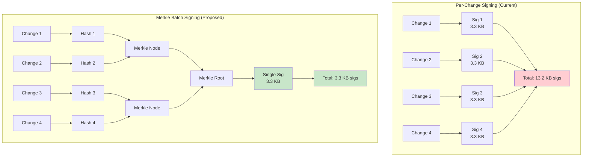
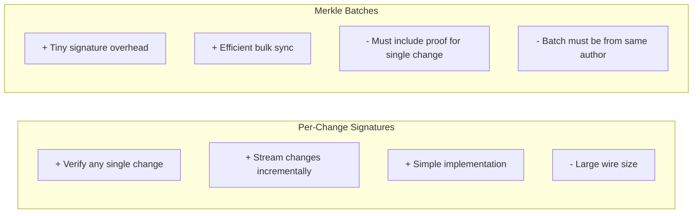
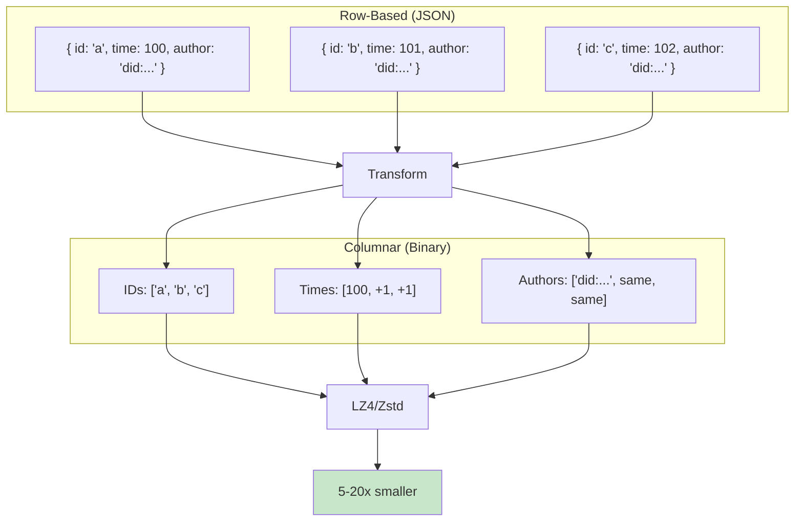
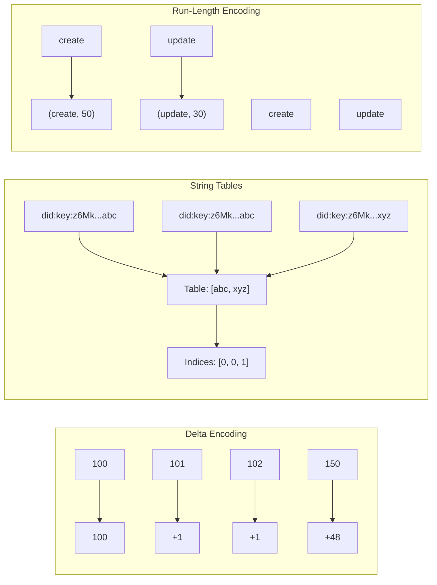
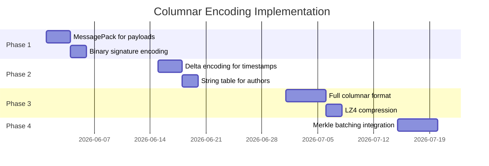
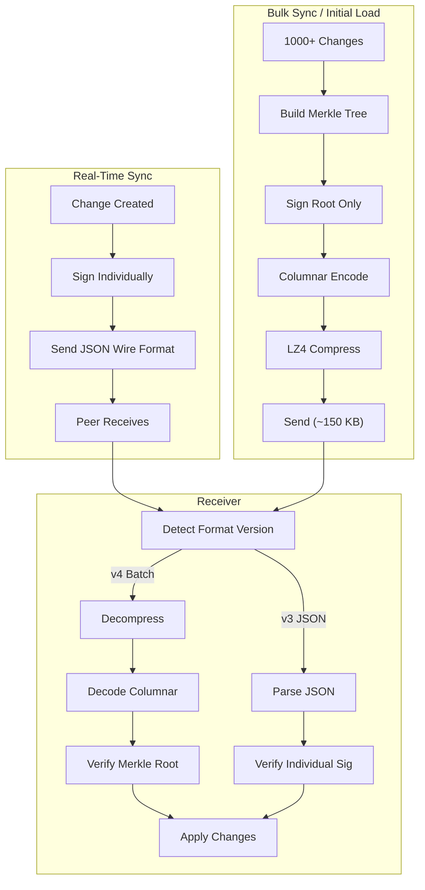

# Compact Wire Format: Binary Encoding for Change Sync

> How do we reduce wire format size for syncing changes, especially with large post-quantum signatures? This exploration examines columnar binary encoding, Merkle batching, and compression strategies inspired by Automerge's approach.

**Date**: February 2026
**Status**: Exploration (Future Enhancement)
**Prerequisites**: Multi-level crypto implementation (0069), understanding of `Change<T>` wire format

## Executive Summary

With ML-DSA hybrid signatures adding ~3.3 KB per change, syncing 1000 changes requires ~3.4 MB just for signatures. This exploration outlines two complementary strategies to reduce sync payload sizes:

1. **Merkle Batch Signing** - Sign a Merkle root instead of individual changes (10-100x signature reduction)
2. **Columnar Binary Encoding** - Automerge-style encoding that compresses 5-20x better than JSON

These are **future enhancements**, not required for the initial multi-level crypto implementation. The current JSON-based wire format is simpler to debug and sufficient for early usage.

## Current Wire Format

The V3 wire format uses JSON with base64-encoded signatures:

```typescript
interface ChangeWireV3 {
  v: 3
  i: string // Change ID (22 chars)
  t: 'create' | 'update' | 'delete' | 'restore'
  p: Record<string, unknown> // Payload
  h: string // Hash (43 chars base64)
  ph: string | null // Parent hash
  a: string // Author DID (~56 chars)
  sig: {
    l: 0 | 1 | 2 // Level
    e?: string // Ed25519 sig (~88 chars base64)
    p?: string // ML-DSA sig (~4400 chars base64)
  }
  w: number // Wall time
  l: { c: number; n: string } // Lamport clock
}
```

### Size Analysis (Level 1 Hybrid)

| Field                     | Size            | Notes                 |
| ------------------------- | --------------- | --------------------- |
| Envelope + keys           | ~150 bytes      | JSON overhead         |
| Change ID                 | 22 bytes        | nanoid                |
| Hashes                    | ~90 bytes       | 2x base64 hashes      |
| Author DID                | ~56 bytes       | did:key:z6Mk...       |
| Ed25519 sig               | 88 bytes        | base64 of 64 bytes    |
| ML-DSA sig                | **4,400 bytes** | base64 of 3,293 bytes |
| Timestamps                | ~30 bytes       | Numbers as text       |
| **Total (empty payload)** | **~4.8 KB**     | Per change            |

For 1000 changes with small payloads: **~5 MB**

## Strategy 1: Merkle Batch Signing

Instead of signing each change individually, sign a Merkle root covering multiple changes.



### Batch Wire Format

```typescript
interface ChangeBatchWireV4 {
  v: 4
  type: 'batch'

  // Merkle tree metadata
  root: string // Merkle root hash
  sig: SignatureWire // Single signature over root

  // Changes (without individual signatures)
  changes: Array<{
    i: string // Change ID
    t: 'create' | 'update' | 'delete' | 'restore'
    p: Record<string, unknown>
    h: string // Change hash (leaf in tree)
    ph: string | null
    a: string
    w: number
    l: { c: number; n: string }
    // No sig field - covered by batch signature

    // Merkle proof for independent verification
    proof: string[] // Sibling hashes to root
  }>
}
```

### Size Comparison

| Scenario     | Per-Change Sigs | Merkle Batch           | Savings |
| ------------ | --------------- | ---------------------- | ------- |
| 10 changes   | 33 KB           | 3.5 KB + 2.2 KB proofs | **83%** |
| 100 changes  | 330 KB          | 3.5 KB + 22 KB proofs  | **92%** |
| 1000 changes | 3.3 MB          | 3.5 KB + 320 KB proofs | **90%** |

### Tradeoffs



**When to use each:**

- **Per-change**: Real-time collaborative editing, streaming updates
- **Merkle batch**: Initial sync, bulk import, hub-to-hub federation

### Implementation Sketch

```typescript
// packages/sync/src/batch/merkle-batch.ts

import { hash } from '@xnet/crypto'

/**
 * Build a Merkle tree from change hashes.
 */
function buildMerkleTree(changeHashes: Uint8Array[]): MerkleTree {
  if (changeHashes.length === 0) {
    throw new Error('Cannot build tree from empty list')
  }

  // Pad to power of 2
  const padded = padToPowerOf2(changeHashes)

  // Build tree bottom-up
  let level = padded
  const levels: Uint8Array[][] = [level]

  while (level.length > 1) {
    const nextLevel: Uint8Array[] = []
    for (let i = 0; i < level.length; i += 2) {
      const combined = new Uint8Array(64)
      combined.set(level[i], 0)
      combined.set(level[i + 1], 32)
      nextLevel.push(hash(combined, 'blake3'))
    }
    levels.push(nextLevel)
    level = nextLevel
  }

  return {
    root: level[0],
    levels,
    leafCount: changeHashes.length
  }
}

/**
 * Generate Merkle proof for a leaf at given index.
 */
function generateProof(tree: MerkleTree, leafIndex: number): Uint8Array[] {
  const proof: Uint8Array[] = []
  let idx = leafIndex

  for (let level = 0; level < tree.levels.length - 1; level++) {
    const siblingIdx = idx % 2 === 0 ? idx + 1 : idx - 1
    proof.push(tree.levels[level][siblingIdx])
    idx = Math.floor(idx / 2)
  }

  return proof
}

/**
 * Verify a leaf belongs to a Merkle root.
 */
function verifyProof(
  leafHash: Uint8Array,
  leafIndex: number,
  proof: Uint8Array[],
  root: Uint8Array
): boolean {
  let current = leafHash
  let idx = leafIndex

  for (const sibling of proof) {
    const combined = new Uint8Array(64)
    if (idx % 2 === 0) {
      combined.set(current, 0)
      combined.set(sibling, 32)
    } else {
      combined.set(sibling, 0)
      combined.set(current, 32)
    }
    current = hash(combined, 'blake3')
    idx = Math.floor(idx / 2)
  }

  return arraysEqual(current, root)
}
```

## Strategy 2: Columnar Binary Encoding

Automerge encodes changes using a columnar format that groups similar data together, enabling much better compression.



### Columnar Format Design

```typescript
// packages/sync/src/encoding/columnar.ts

/**
 * Columnar encoding groups changes by field type.
 * Each column uses type-specific encoding.
 */
interface ColumnarChangeBatch {
  /** Format version */
  version: 4

  /** Number of changes in batch */
  count: number

  /** Columns - each encoded separately */
  columns: {
    /** Change IDs - raw bytes, no compression needed */
    ids: Uint8Array

    /** Change types - 2-bit enum, packed */
    types: Uint8Array

    /** Wall times - delta-encoded int64 */
    wallTimes: Uint8Array

    /** Lamport times - delta-encoded int64 */
    lamportTimes: Uint8Array

    /** Lamport nodes - string table + indices */
    lamportNodes: {
      table: string[] // Unique node IDs
      indices: Uint8Array // Index per change (usually all same)
    }

    /** Author DIDs - string table + indices */
    authors: {
      table: string[]
      indices: Uint8Array
    }

    /** Parent hashes - nullable, deduplicated */
    parentHashes: Uint8Array

    /** Content hashes */
    contentHashes: Uint8Array

    /** Payloads - MessagePack encoded, concatenated */
    payloads: {
      data: Uint8Array
      offsets: Uint32Array // Start offset of each payload
    }

    /** Signatures - binary encoded */
    signatures: Uint8Array
  }
}
```

### Encoding Techniques



### Size Comparison

Encoding 1000 typical changes (small payloads, same author):

| Format                  | Uncompressed | LZ4 Compressed |
| ----------------------- | ------------ | -------------- |
| JSON (current)          | 5.0 MB       | 1.2 MB         |
| MessagePack             | 3.8 MB       | 0.9 MB         |
| Columnar binary         | 3.5 MB       | **0.4 MB**     |
| Columnar + Merkle batch | 0.5 MB       | **0.15 MB**    |

### Implementation Phases



## Combined Architecture



## Decision Matrix

| Use Case         | Format               | Why                   |
| ---------------- | -------------------- | --------------------- |
| Typing in editor | V3 JSON per-change   | Low latency, simple   |
| Cursor updates   | V3 JSON Level 0      | Speed over security   |
| Save document    | V3 JSON Level 1      | Immediate persistence |
| Initial sync     | V4 Columnar + Merkle | Bandwidth efficiency  |
| Hub federation   | V4 Columnar + Merkle | Bulk transfer         |
| Export/backup    | V4 Columnar          | Compact archives      |
| Debug/inspect    | V3 JSON              | Human readable        |

## Migration Path

Since xNet is prerelease, migration is straightforward:

1. **V3 (Current)**: JSON wire format, per-change signatures
2. **V4 (Future)**: Add columnar batch format alongside V3
3. **Detection**: Version field in first byte distinguishes formats
4. **Coexistence**: Both formats supported indefinitely

```typescript
function detectFormat(data: Uint8Array): 'v3-json' | 'v4-columnar' {
  // V4 columnar starts with magic byte 0x04
  if (data[0] === 0x04) {
    return 'v4-columnar'
  }
  // V3 JSON starts with '{' (0x7B)
  if (data[0] === 0x7b) {
    return 'v3-json'
  }
  throw new Error('Unknown format')
}
```

## Appendix: Automerge Reference

Automerge's binary format (for reference):

- Uses **columnar encoding** with LEB128 varints
- **Actor table** deduplicates author IDs
- **Delta-encoded** counters and timestamps
- **Run-length encoded** repeated values
- Achieves **5-20x compression** vs naive JSON

Key insight: Automerge is written in Rust with WASM bindings. For xNet, a pure TypeScript implementation is acceptable initially, with potential Rust/WASM optimization later if needed.

## Conclusion

Two complementary strategies can dramatically reduce sync payload sizes:

1. **Merkle batch signing**: 90%+ reduction in signature overhead for bulk operations
2. **Columnar encoding**: 5-20x better compression for change data

Both can be added **incrementally** without breaking changes:

- Version field enables format detection
- V3 JSON remains supported for real-time and debugging
- V4 binary used opportunistically for bulk sync

**Recommendation**: Implement after multi-level crypto is stable and real-world usage reveals bandwidth bottlenecks. The current JSON format is debuggable and sufficient for early adoption.

---

**Related Documents:**

- [0069_MULTI_LEVEL_CRYPTO.md](./0069_MULTI_LEVEL_CRYPTO.md) - Hybrid signature architecture
- [plan03_9_2MultiLevelCrypto/06-wire-format.md](../plans/plan03_9_2MultiLevelCrypto/06-wire-format.md) - Current V3 format
