# Database-Defined Schemas: User-Created Types via the Database UI

> A design where each database defines its own unique, versioned schema. Column changes automatically create new schema versions, and schemas can be cloned to start new databases. The schema is derived from column metadata stored in the database's Y.Doc.

**References**: Builds on [0067_DATABASE_DATA_MODEL_V2.md](./0067_DATABASE_DATA_MODEL_V2.md) for the underlying data model.

**Date**: February 2026
**Status**: Design Ready

## Executive Summary

This document proposes treating each database as defining its own unique schema:

- **Database = Schema**: Each database's columns define a schema with a unique IRI
- **Auto-versioning**: Column changes automatically bump the schema version
- **Clone, not share**: Schemas can be cloned to new databases but then evolve independently
- **Y.Doc storage**: Schema metadata lives in the database's Y.Doc (no new storage layer)
- **Registry integration**: Database schemas are discoverable via `SchemaRegistry`

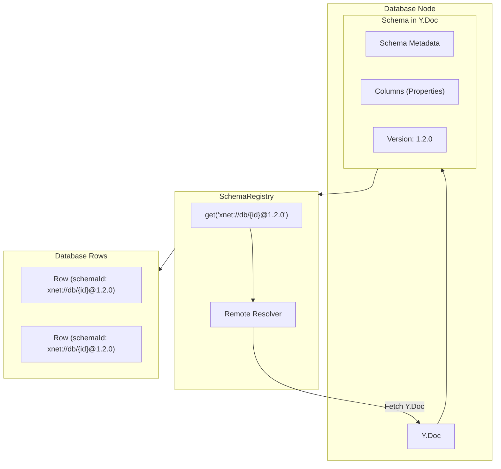

## Current Architecture

### Two Schema Systems

xNet currently has two parallel approaches to schemas:

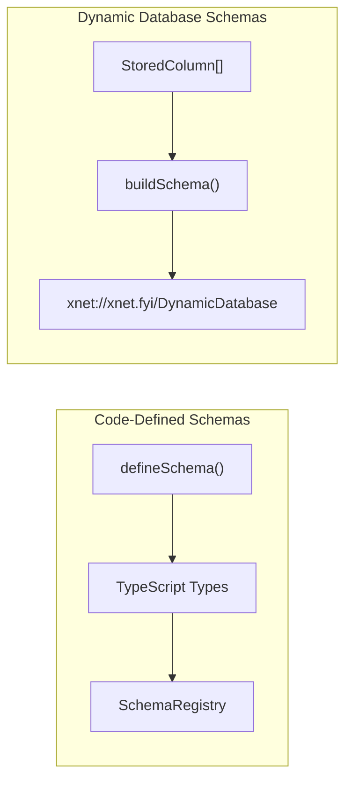

**Code-defined schemas** (`@xnet/data`):

```typescript
// System types like Database, Page, Comment
const TaskSchema = defineSchema({
  name: 'Task',
  namespace: 'xnet://xnet.fyi/',
  version: '1.0.0',
  properties: {
    title: text({ required: true }),
    status: select({ options: ['todo', 'done'] })
  }
})
```

**Dynamic database columns** (current):

```typescript
// Stored in Y.Doc, converted to Schema at runtime
interface StoredColumn {
  id: string
  name: string
  type: PropertyType
  config?: Record<string, unknown>
}

// Creates a fake shared IRI
function buildSchema(columns: StoredColumn[]): Schema {
  return {
    '@id': 'xnet://xnet.fyi/DynamicDatabase' // Same for ALL databases!
    // ...
  }
}
```

### Problems with Current Approach

| Issue                                   | Impact                                               |
| --------------------------------------- | ---------------------------------------------------- |
| All databases share one fake schema IRI | Cannot distinguish row types                         |
| No schema versioning                    | Column changes are invisible to the system           |
| Schemas not discoverable                | Other nodes can't reference database schemas         |
| No schema reuse                         | Can't start a new database from an existing template |

## Proposed Design

### Core Concept: Database = Schema

Each database defines a unique schema. The database's ID becomes part of the schema IRI:

```
xnet://xnet.fyi/db/{databaseId}@{version}
```

Example:

```
xnet://xnet.fyi/db/abc123@1.0.0  # Initial schema
xnet://xnet.fyi/db/abc123@1.0.1  # After adding a column
xnet://xnet.fyi/db/abc123@1.1.0  # After deleting a column
```

### Auto-Versioning Rules

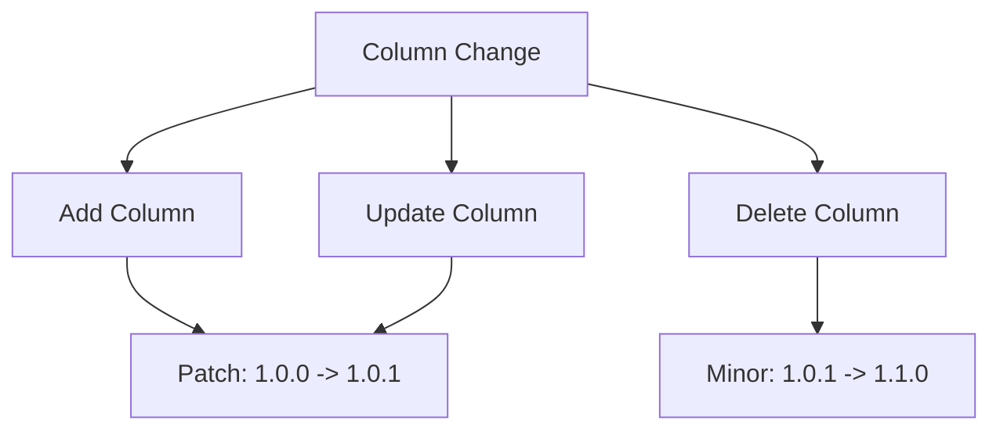

| Change Type          | Version Bump           | Rationale                              |
| -------------------- | ---------------------- | -------------------------------------- |
| Add column           | Patch (1.0.0 -> 1.0.1) | Non-breaking: existing rows unaffected |
| Rename column        | Patch                  | Non-breaking: data preserved           |
| Change column config | Patch                  | Non-breaking: interpretation changes   |
| Delete column        | Minor (1.0.1 -> 1.1.0) | Breaking: data removed                 |
| Change column type   | Minor                  | Breaking: type coercion required       |

### Schema Storage in Y.Doc

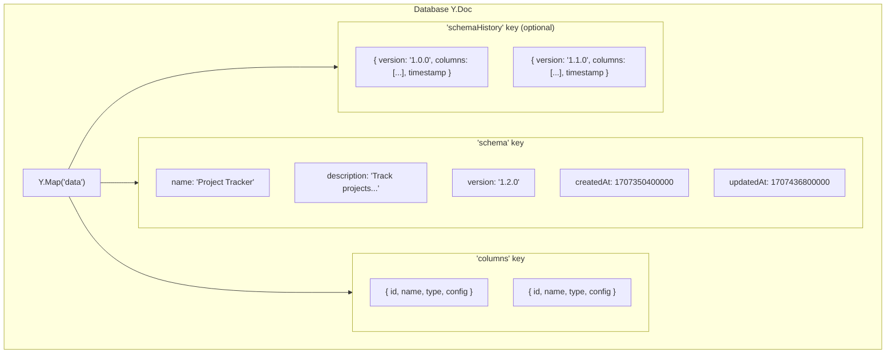

**Schema Metadata Type:**

```typescript
interface DatabaseSchemaMetadata {
  name: string // User-editable schema name
  description?: string // Optional description
  version: string // Semver version (auto-incremented)
  createdAt: number // When database was created
  updatedAt: number // Last column modification time
}
```

### Schema IRI Generation

```typescript
function buildSchemaIRI(databaseId: string, version: string): SchemaIRI {
  return `xnet://xnet.fyi/db/${databaseId}@${version}` as SchemaIRI
}

function buildSchema(
  databaseId: string,
  metadata: DatabaseSchemaMetadata,
  columns: StoredColumn[]
): Schema {
  const schemaIRI = buildSchemaIRI(databaseId, metadata.version)

  const properties: PropertyDefinition[] = columns.map((col) => ({
    '@id': `${schemaIRI}#${col.id}`,
    name: col.name,
    type: col.type,
    required: false,
    config: col.config
  }))

  return {
    '@id': schemaIRI,
    '@type': 'xnet://xnet.fyi/Schema',
    name: metadata.name,
    namespace: 'xnet://xnet.fyi/',
    version: metadata.version,
    properties
  }
}
```

### Registry Integration

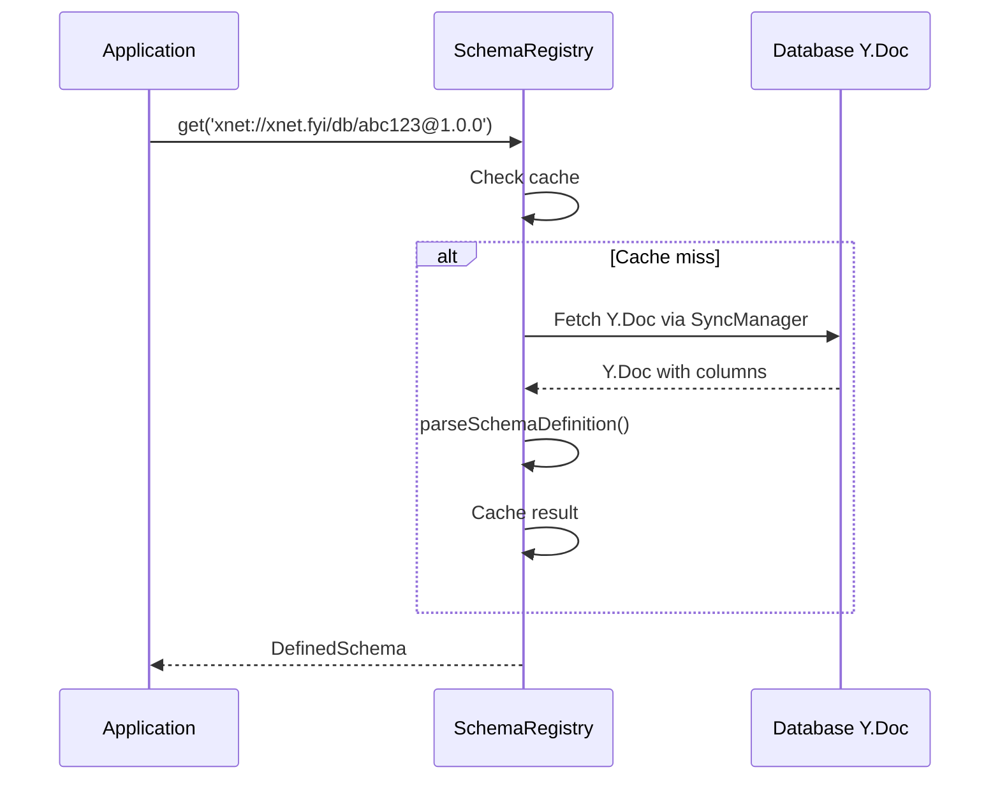

**Remote Resolver Setup:**

```typescript
// In app initialization
schemaRegistry.setRemoteResolver(async (iri: SchemaIRI) => {
  // Parse IRI to extract database ID and version
  const match = iri.match(/xnet:\/\/xnet\.fyi\/db\/([^@]+)@(.+)/)
  if (!match) return null

  const [, databaseId, version] = match

  // Fetch the database's Y.Doc
  const doc = await syncManager.getDoc(databaseId)
  if (!doc) return null

  // Extract schema from Y.Doc
  const dataMap = doc.getMap('data')
  const metadata = dataMap.get('schema') as DatabaseSchemaMetadata
  const columns = dataMap.get('columns') as StoredColumn[]

  // Check version matches (or return latest if not found)
  if (metadata.version !== version) {
    // Could look up in schemaHistory, or return null
    return null
  }

  return buildSchema(databaseId, metadata, columns)
})
```

### Clone Schema Flow

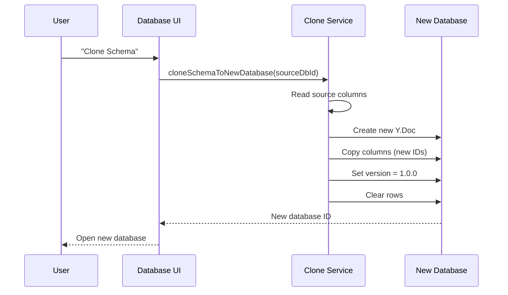

**Clone Implementation:**

```typescript
async function cloneSchemaToNewDatabase(
  sourceDbId: string,
  options?: {
    name?: string
    includeRows?: boolean // Default: false
  }
): Promise<string> {
  // 1. Read source database's Y.Doc
  const sourceDoc = await syncManager.getDoc(sourceDbId)
  const sourceData = sourceDoc.getMap('data')
  const sourceColumns = sourceData.get('columns') as StoredColumn[]
  const sourceMetadata = sourceData.get('schema') as DatabaseSchemaMetadata

  // 2. Create new database
  const newDbId = createNodeId()
  const newDoc = new Y.Doc()
  const newData = newDoc.getMap('data')

  // 3. Copy columns with new IDs
  const columnIdMap = new Map<string, string>()
  const newColumns = sourceColumns.map((col) => {
    const newId = `col_${nanoid()}`
    columnIdMap.set(col.id, newId)
    return { ...col, id: newId }
  })

  // 4. Initialize schema metadata
  const newMetadata: DatabaseSchemaMetadata = {
    name: options?.name ?? `${sourceMetadata.name} (Copy)`,
    description: sourceMetadata.description,
    version: '1.0.0', // Fresh start
    createdAt: Date.now(),
    updatedAt: Date.now()
  }

  newData.set('columns', newColumns)
  newData.set('schema', newMetadata)
  newData.set('rows', []) // Empty unless includeRows

  // 5. Copy views (updating column references)
  const sourceTableView = sourceData.get('tableView') as ViewConfig
  if (sourceTableView) {
    newData.set('tableView', remapViewColumnIds(sourceTableView, columnIdMap))
  }

  // 6. Save and return
  await syncManager.saveDoc(newDbId, newDoc)
  return newDbId
}
```

## Implementation Plan

### Phase 1: Database-Scoped Schema IRIs

**Goal:** Give each database a unique, versioned schema IRI.

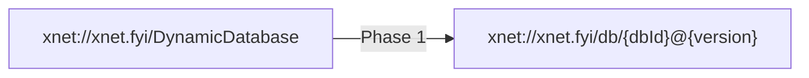

#### Checklist: Phase 1

- [x] Schema IRI generation
  - [x] Create `buildSchemaIRI(databaseId, version)` utility
  - [x] Update `buildSchema()` to use database-scoped IRI
  - [x] Add version parameter to `buildSchema()`

- [x] Version storage in Y.Doc
  - [x] Add `schema` key to data map with `DatabaseSchemaMetadata`
  - [x] Initialize version to `1.0.0` for new databases
  - [x] Migrate existing databases to have schema metadata

- [x] Auto-version on column changes
  - [x] `handleAddColumn` - bump patch version
  - [x] `handleUpdateColumn` - bump patch version (or minor for type change)
  - [x] `handleDeleteColumn` - bump minor version
  - [x] Create `bumpSchemaVersion(type: 'patch' | 'minor')` helper

- [x] Tests
  - [x] Unit test for schema IRI generation
  - [x] Unit test for version bumping logic
  - [ ] Integration test for column change -> version bump

**Files to modify:**

- `apps/electron/src/renderer/components/DatabaseView.tsx`
- `packages/data/src/database/` (new utilities)

---

### Phase 2: Schema Metadata UI

**Goal:** Allow users to view and edit schema name/description.

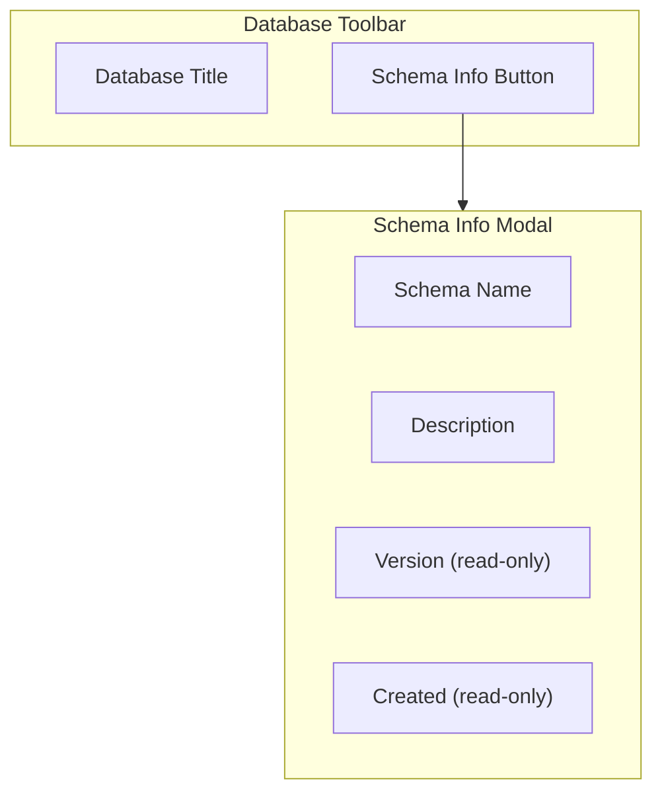

#### Checklist: Phase 2

- [x] Schema metadata storage
  - [x] Define `DatabaseSchemaMetadata` type
  - [x] Store at `doc.getMap('data').get('schema')`
  - [x] Update `updatedAt` on any column change

- [x] Schema info UI
  - [x] Add "Schema Info" button to toolbar (version badge with info icon)
  - [x] Create schema info modal/popover
  - [x] Editable name and description fields
  - [x] Read-only version and timestamps display

- [x] Version badge (optional)
  - [x] Show version in toolbar or header
  - [x] Visual indicator when schema changes (via version number)

**Files to modify:**

- `apps/electron/src/renderer/components/DatabaseView.tsx`
- `packages/views/src/` (new SchemaInfoModal component)

---

### Phase 3: Registry Integration

**Goal:** Make database-defined schemas discoverable via `SchemaRegistry`.

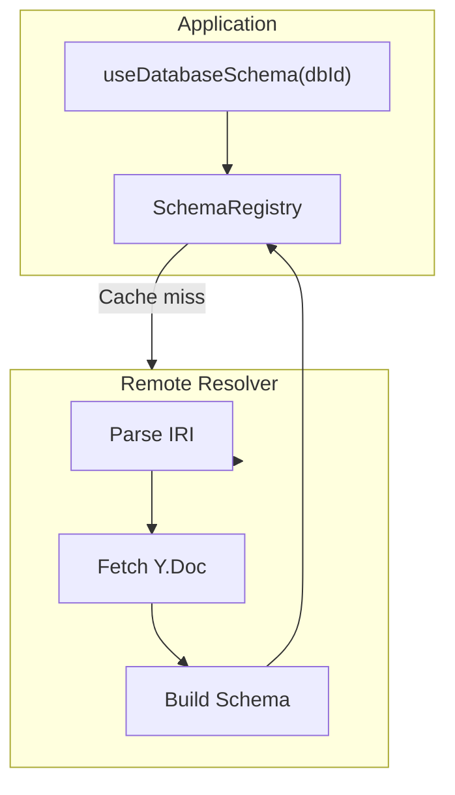

#### Checklist: Phase 3

- [x] Register schema on database load
  - [x] In `DatabaseView`, schema is built using `buildDatabaseSchema` on load
  - [x] Schema metadata stored in Y.Doc and reactive to changes
  - [ ] Handle cleanup on unmount (optional - schemas can stay cached)

- [x] Remote resolver for database schemas
  - [x] Create `createDatabaseSchemaResolver()` factory in `schema-resolver.ts`
  - [x] Parse `xnet://xnet.fyi/db/{id}@{version}` IRIs (in `schema-utils.ts`)
  - [x] Fetch Y.Doc and extract schema via `extractSchemaFromDoc()`
  - [ ] Handle version mismatch (schema history lookup) - TODO in resolver

- [x] Schema lookup hook
  - [x] Create `useDatabaseSchema(databaseId)` hook
  - [x] Returns `{ schema, metadata, schemaIRI, loading, error, refresh }`
  - [x] Auto-updates when schema changes via Y.Doc observer

- [ ] Tests
  - [x] Unit test for schema IRI parsing (in `schema-utils.test.ts`)
  - [ ] Integration test for remote resolution
  - [ ] Test schema registration and lookup

**Note**: Remote resolver wiring (calling `schemaRegistry.setRemoteResolver()` with the sync manager) is deferred to when it's actually needed by a consumer. The `useDatabaseSchema` hook provides direct access without going through the registry.

**Files to modify:**

- `apps/electron/src/renderer/components/DatabaseView.tsx`
- `packages/data/src/schema/registry.ts`
- `packages/data/src/database/schema-resolver.ts` (new file)
- `packages/react/src/hooks/useDatabaseSchema.ts` (new file)

---

### Phase 4: Clone Schema Feature

**Goal:** Allow users to create a new database from an existing database's schema.

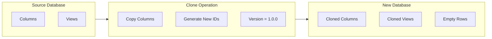

#### Checklist: Phase 4

- [x] Clone schema function
  - [x] Create `cloneSchema(source, options)` in `clone.ts`
  - [x] Copy columns with new IDs via `cloneColumns()`
  - [x] Copy view configs with remapped column IDs
  - [x] Option to include sample rows via `cloneSampleRows()`

- [x] Clone UI
  - [x] Add "Clone" button to database toolbar
  - [x] Create `CloneSchemaModal` confirmation dialog
  - [x] Name input for new database
  - [x] Option to include sample rows with count limit
  - [ ] Navigate to new database after clone (TODO: integrate with app navigation)

- [x] Column ID remapping
  - [x] Create `remapViewColumnIds(view, idMap)` utility
  - [x] Handle all view types (table, board, etc.)
  - [x] Handle filter/sort column references
  - [x] Handle nested filter groups

- [x] Tests
  - [x] Unit test for clone function (26 tests)
  - [x] Test column ID remapping
  - [x] Test filter/sort remapping

**Files to modify:**

- `packages/data/src/database/clone.ts` (new file)
- `apps/electron/src/renderer/components/DatabaseView.tsx`
- Command palette integration

---

### Phase 5: Schema Version History (Optional)

**Goal:** Track schema changes over time for auditing and potential rollback.

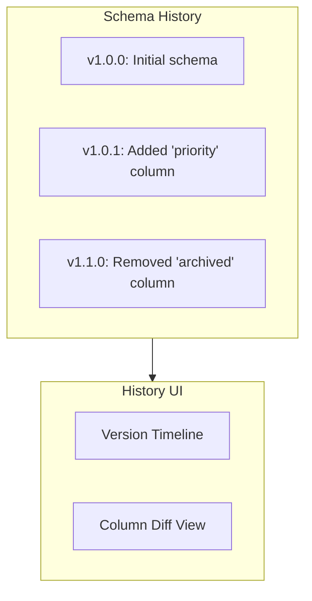

#### Checklist: Phase 5

- [ ] Version history storage
  - [ ] Define `SchemaVersionEntry` type
  - [ ] Store at `doc.getMap('data').get('schemaHistory')`
  - [ ] Append entry on each version bump

- [ ] History entry structure

  ```typescript
  interface SchemaVersionEntry {
    version: string
    timestamp: number
    columns: StoredColumn[] // Snapshot at this version
    changeType: 'initial' | 'add' | 'update' | 'delete'
    changeDescription?: string
  }
  ```

- [ ] History UI (optional)
  - [ ] Version history panel in devtools
  - [ ] Timeline view of changes
  - [ ] Column diff between versions

- [ ] History limits
  - [ ] Cap history to last N versions (e.g., 50)
  - [ ] Or limit by age (e.g., 90 days)

**Files to modify:**

- `apps/electron/src/renderer/components/DatabaseView.tsx`
- `packages/devtools/src/panels/` (new SchemaHistoryPanel)

---

## Data Flow Diagrams

### Column Change Flow

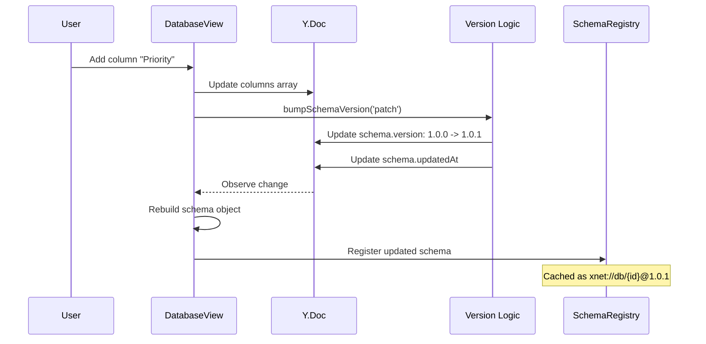

### Row Creation with Schema

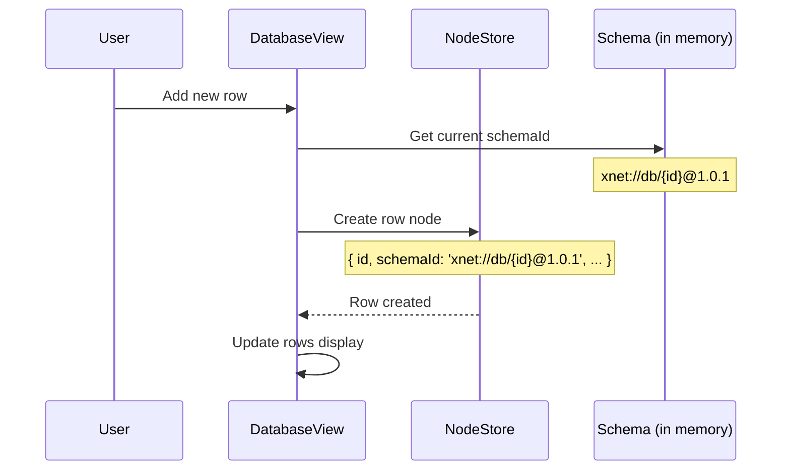

### Schema Resolution Flow

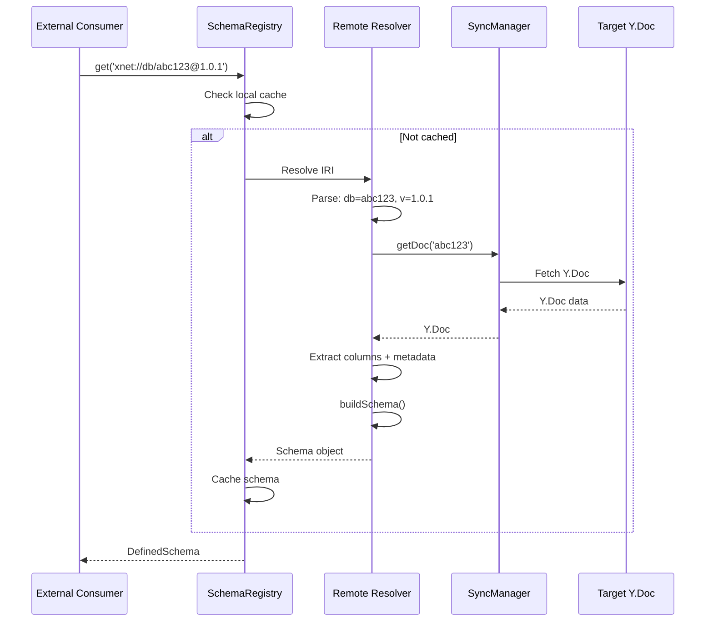

## Migration Strategy

### Existing Databases

Existing databases use the fake `xnet://xnet.fyi/DynamicDatabase` IRI. Migration:

1. **On first load after upgrade:**
   - Check if `schema` metadata exists in Y.Doc
   - If not, create initial metadata with version `1.0.0`
   - Generate proper schema IRI from database ID

2. **Existing rows:**
   - Rows created before this change have `schemaId: undefined` or the fake IRI
   - These continue to work (schema validation is optional)
   - New rows get the proper schema IRI

```typescript
// Migration in DatabaseView
useEffect(() => {
  if (!doc) return

  const dataMap = doc.getMap('data')
  const existingMeta = dataMap.get('schema') as DatabaseSchemaMetadata | undefined

  if (!existingMeta) {
    // Migrate: create initial schema metadata
    const metadata: DatabaseSchemaMetadata = {
      name: database?.title ?? 'Untitled Database',
      version: '1.0.0',
      createdAt: database?.createdAt ?? Date.now(),
      updatedAt: Date.now()
    }
    dataMap.set('schema', metadata)
  }
}, [doc, database])
```

## API Reference

### Types

```typescript
// Schema metadata stored in Y.Doc
interface DatabaseSchemaMetadata {
  name: string
  description?: string
  version: string // Semver: "1.0.0"
  createdAt: number
  updatedAt: number
}

// Schema version history entry
interface SchemaVersionEntry {
  version: string
  timestamp: number
  columns: StoredColumn[]
  changeType: 'initial' | 'add' | 'update' | 'delete'
  changeDescription?: string
}

// Clone options
interface CloneSchemaOptions {
  name?: string
  description?: string
  includeRows?: boolean
  includeSampleData?: number // Include N sample rows
}
```

### Functions

```typescript
// Generate schema IRI from database ID and version
function buildSchemaIRI(databaseId: string, version: string): SchemaIRI

// Build full Schema object from database metadata
function buildSchema(
  databaseId: string,
  metadata: DatabaseSchemaMetadata,
  columns: StoredColumn[]
): Schema

// Bump schema version
function bumpSchemaVersion(current: string, type: 'patch' | 'minor'): string

// Clone schema to new database
function cloneSchemaToNewDatabase(sourceDbId: string, options?: CloneSchemaOptions): Promise<string>

// Create remote resolver for database schemas
function createDatabaseSchemaResolver(
  syncManager: SyncManager
): (iri: SchemaIRI) => Promise<Schema | null>
```

### Hooks

```typescript
// Get schema for a database (reactive)
function useDatabaseSchema(databaseId: string): {
  schema: Schema | null
  metadata: DatabaseSchemaMetadata | null
  loading: boolean
  error: Error | null
}
```

## File Changes Summary

| Phase | File                                                  | Change                                            |
| ----- | ----------------------------------------------------- | ------------------------------------------------- |
| 1     | `DatabaseView.tsx`                                    | Generate database-scoped schema IRI, auto-version |
| 1     | `packages/data/src/database/schema-utils.ts`          | New: IRI generation, version bumping              |
| 2     | `DatabaseView.tsx`                                    | Add schema metadata storage and UI trigger        |
| 2     | `packages/views/src/schema/SchemaInfoModal.tsx`       | New: Schema info modal                            |
| 3     | `packages/data/src/database/schema-resolver.ts`       | New: Remote resolver factory                      |
| 3     | `packages/data/src/schema/registry.ts`                | Support database schema IRIs                      |
| 3     | `packages/react/src/hooks/useDatabaseSchema.ts`       | New: Schema hook                                  |
| 4     | `packages/data/src/database/clone.ts`                 | New: Clone function                               |
| 4     | `DatabaseView.tsx`                                    | Add clone action to menu                          |
| 5     | `DatabaseView.tsx`                                    | Store version history                             |
| 5     | `packages/devtools/src/panels/SchemaHistoryPanel.tsx` | New: History UI                                   |

## Estimated Effort

| Phase                | Scope              | Effort    |
| -------------------- | ------------------ | --------- |
| Phase 1: Schema IRIs | Core functionality | 1-2 days  |
| Phase 2: Metadata UI | Polish             | 0.5-1 day |
| Phase 3: Registry    | Integration        | 1-2 days  |
| Phase 4: Clone       | Feature            | 1 day     |
| Phase 5: History     | Optional           | 1 day     |

**Total: 4-7 days**

## Open Questions

1. **Version display**: Should the schema version be visible in the UI (toolbar badge)?

2. **Breaking changes**: When a column type changes (e.g., text -> number), should we require explicit user confirmation?

3. **Schema sharing**: Future consideration - could databases "link" to a shared schema rather than clone?

4. **Row migration**: When schema version changes, should existing rows be updated to the new schemaId?

5. **Conflict resolution**: If two users simultaneously modify columns, how do version numbers resolve?

## References

- [0067_DATABASE_DATA_MODEL_V2.md](./0067_DATABASE_DATA_MODEL_V2.md) - Database architecture
- [0041_DATABASE_DATA_MODEL.md](./0041_DATABASE_DATA_MODEL.md) - Original exploration
- `packages/data/src/schema/types.ts` - Schema type definitions
- `packages/data/src/schema/registry.ts` - SchemaRegistry implementation
- `packages/data/src/database/column-types.ts` - Column type definitions
- `apps/electron/src/renderer/components/DatabaseView.tsx` - Current database UI
