# SQLite Storage: Unified Storage for xNet

> **Status**: ✅ IMPLEMENTED - The `@xnet/sqlite` package provides unified SQLite storage

## Implementation Status

The SQLite storage layer has been implemented at `packages/sqlite/`:

- [x] **Electron Adapter** - `adapters/electron.ts` using better-sqlite3
- [x] **Web Adapter** - `adapters/web.ts` using sql.js with OPFS
- [x] **Web Worker** - `adapters/web-worker.ts` for off-main-thread
- [x] **Expo Adapter** - `adapters/expo.ts` for React Native
- [x] **Memory Adapter** - `adapters/memory.ts` for testing
- [x] **FTS5 Support** - `fts.ts` for full-text search
- [x] **Query Builder** - `query-builder.ts` for type-safe queries
- [x] **Schema Management** - `schema.ts` for migrations
- [x] **Unified Interface** - `adapter.ts` with common API

The storage layer in `@xnet/storage` uses these adapters.

---

> A clean-slate design for xNet's storage layer using SQLite across all platforms: better-sqlite3 in Electron, SQLite-WASM with OPFS in web browsers, and expo-sqlite on mobile.

**References**:

- [0016_PERSISTENCE_ARCHITECTURE.md](./0016_PERSISTENCE_ARCHITECTURE.md) - Previous durability analysis
- [0043_OFF_MAIN_THREAD_ARCHITECTURE.md](./0043_OFF_MAIN_THREAD_ARCHITECTURE.md) - Off-thread design
- [0067_DATABASE_DATA_MODEL_V2.md](./0067_DATABASE_DATA_MODEL_V2.md) - Database architecture

**Date**: February 2026

## Executive Summary

This exploration designs a **SQLite-first storage layer** for xNet across all platforms:

| Platform      | Implementation     | Benefit                            |
| ------------- | ------------------ | ---------------------------------- |
| Electron      | better-sqlite3     | 10-100x faster queries, ACID, FTS5 |
| Web           | SQLite-WASM + OPFS | Durable storage, SQL queries       |
| Mobile (Expo) | expo-sqlite        | Native performance                 |

**Key points:**

- **No migration needed** - this is prerelease, we drop existing IndexedDB data
- SQLite-WASM with OPFS is production-ready (Chrome 102+, Safari 15.2+, Firefox 111+)
- Bundle size impact: ~300-500KB WASM (acceptable for local-first app)
- Unified SQL schema across all platforms

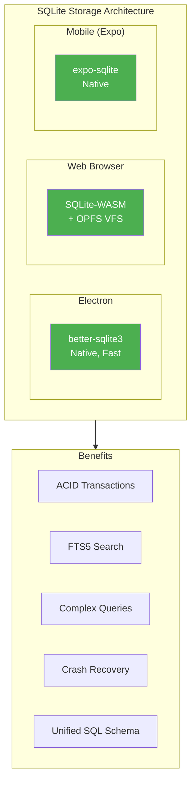

## Why SQLite Over IndexedDB

### IndexedDB Pain Points

#### 1. Performance Issues

| Operation          | IndexedDB | SQLite | Improvement |
| ------------------ | --------- | ------ | ----------- |
| List 10K nodes     | ~500ms    | ~5ms   | **100x**    |
| Complex filter     | ~200ms    | ~2ms   | **100x**    |
| Full-text search   | N/A       | ~10ms  | **Enabled** |
| Bulk insert (1K)   | ~1000ms   | ~50ms  | **20x**     |
| Transaction commit | ~5-20ms   | ~1ms   | **5-20x**   |

#### 2. Durability Problems

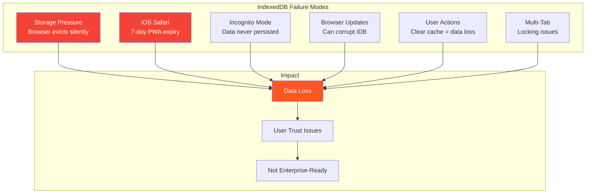

#### 3. Query Limitations

IndexedDB only supports:

- Get by primary key
- Range queries on indexed fields
- Cursor iteration

IndexedDB **cannot** do:

- JOINs (relations)
- Aggregations (COUNT, SUM, AVG)
- Full-text search
- Complex WHERE clauses
- ORDER BY on non-indexed fields

---

## SQLite-WASM Library Comparison

### Option 1: Official SQLite WASM (sqlite.org)

**Source**: https://sqlite.org/wasm/doc/trunk/index.md

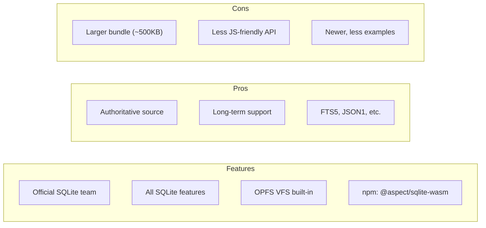

| Metric         | Value                 |
| -------------- | --------------------- |
| Bundle Size    | ~500KB gzipped        |
| SQLite Version | Latest (3.45+)        |
| OPFS Support   | Yes (built-in VFS)    |
| FTS5           | Yes                   |
| Maintenance    | SQLite core team      |
| npm            | `@aspect/sqlite-wasm` |

### Option 2: wa-sqlite (Roy Hashimoto)

**Source**: https://github.com/rhashimoto/wa-sqlite

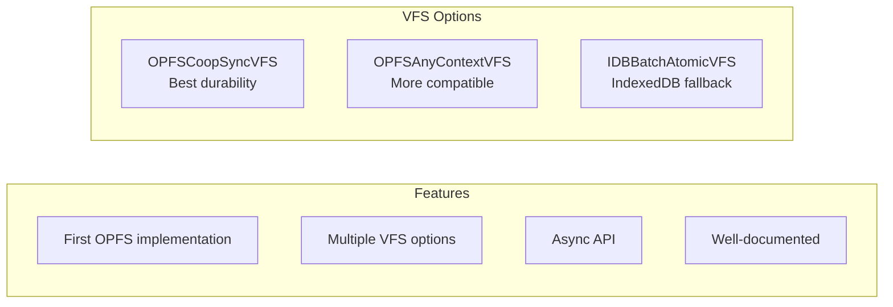

| Metric         | Value              |
| -------------- | ------------------ |
| Bundle Size    | ~300KB gzipped     |
| SQLite Version | 3.44+              |
| OPFS Support   | Yes (multiple VFS) |
| FTS5           | Optional build     |
| Maintenance    | Active community   |
| npm            | `wa-sqlite`        |

### Option 3: sql.js

**Source**: https://github.com/sql-js/sql.js

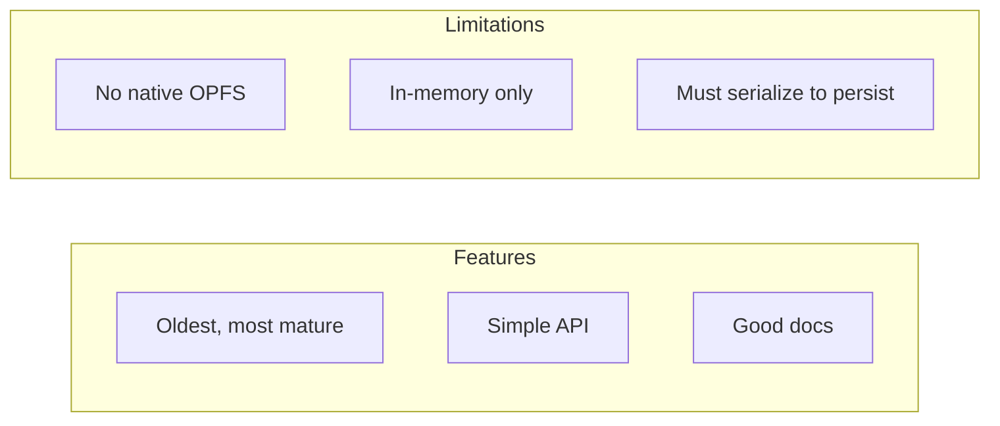

| Metric         | Value              |
| -------------- | ------------------ |
| Bundle Size    | ~500KB gzipped     |
| SQLite Version | 3.42               |
| OPFS Support   | No (needs wrapper) |
| FTS5           | Yes                |
| Maintenance    | Less active        |
| npm            | `sql.js`           |

### Option 4: CR-SQLite (vlcn.io)

**Source**: https://github.com/vlcn-io/cr-sqlite

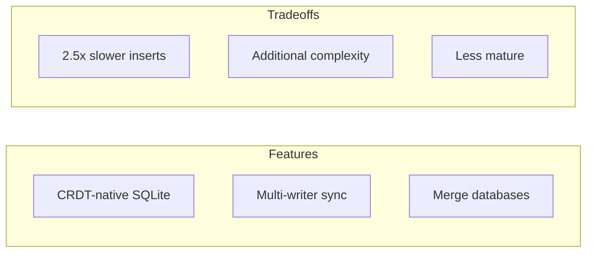

| Metric        | Value                           |
| ------------- | ------------------------------- |
| Bundle Size   | ~400KB gzipped                  |
| CRDT Support  | Built-in                        |
| Use Case      | Native SQLite sync              |
| Consideration | Could replace Yjs for some data |

### Recommendation: wa-sqlite + Official SQLite WASM

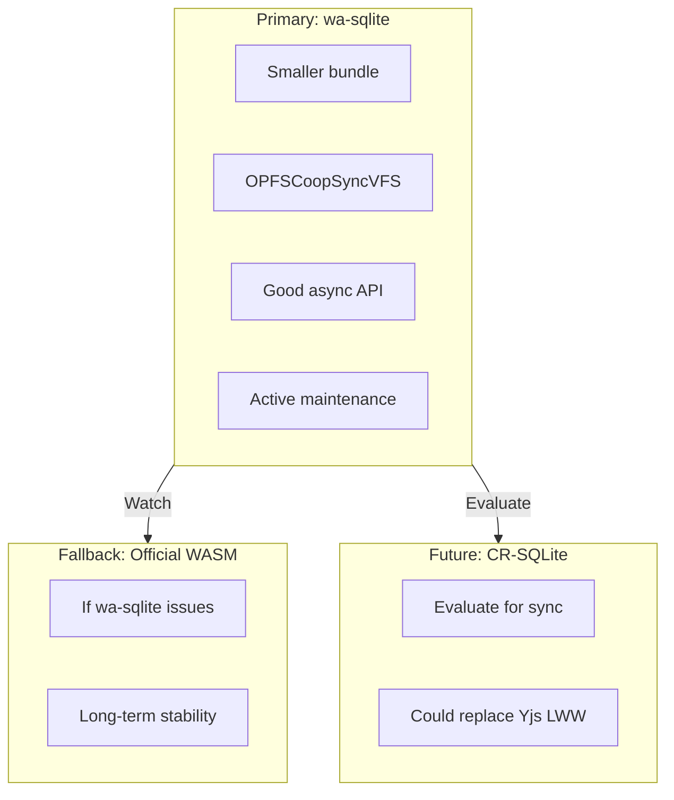

**Rationale:**

1. **wa-sqlite** has the best OPFS implementation and smaller bundle
2. **Official SQLite WASM** is the safety net with long-term support
3. **CR-SQLite** is interesting for future sync architecture but adds complexity now

---

## OPFS Browser Support

### Current Support Matrix

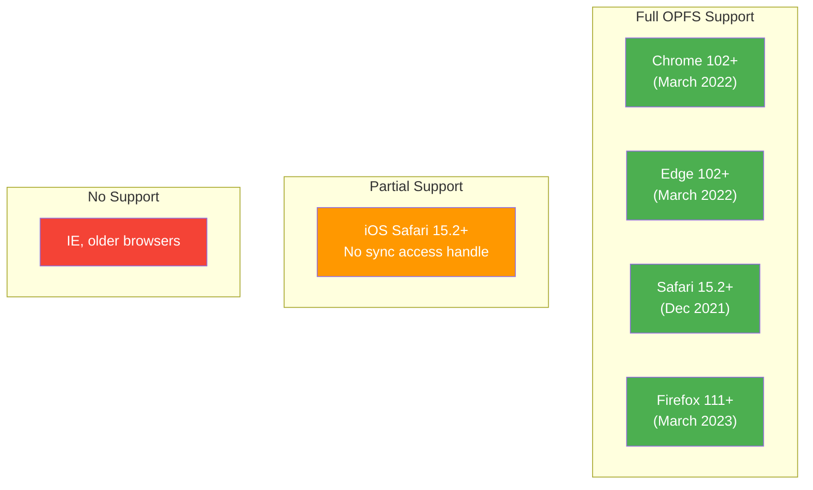

### OPFS vs IndexedDB Comparison

| Feature           | IndexedDB          | OPFS              |
| ----------------- | ------------------ | ----------------- |
| Storage Type      | Key-value          | File system       |
| Eviction          | Browser-controlled | Less aggressive   |
| Sync API          | No                 | Yes (in Worker)   |
| Durability        | Low                | Medium-High       |
| iOS Safari Expiry | 7 days             | Same origin rules |
| Cross-tab         | Complex locking    | File locking      |
| SQLite Compatible | Hacks only         | Native support    |

### No Fallback Strategy

We require OPFS support. No IndexedDB fallback.

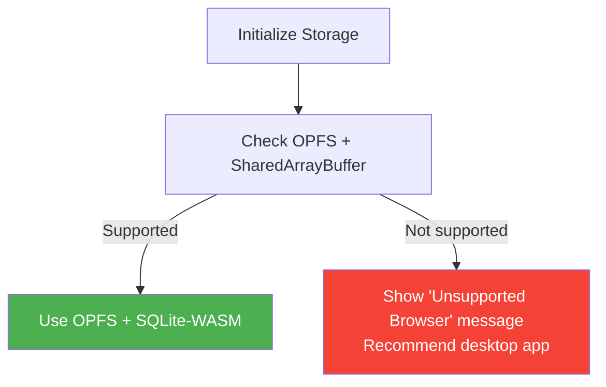

**Rationale**: OPFS is supported in all modern browsers (Chrome 102+, Safari 15.2+, Firefox 111+) - all released 3+ years ago. Users on older browsers should use the Electron desktop app.

---

## Unified SQLite Schema

### Proposed Schema

```sql
-- Unified schema for all platforms
-- Works with better-sqlite3, wa-sqlite, and expo-sqlite

-- ============================================
-- Core Tables
-- ============================================

-- All nodes (Pages, Databases, Rows, Comments, etc.)
CREATE TABLE nodes (
    id TEXT PRIMARY KEY,
    schema_id TEXT NOT NULL,           -- Schema IRI
    created_at INTEGER NOT NULL,
    updated_at INTEGER NOT NULL,
    created_by TEXT NOT NULL,          -- DID
    deleted_at INTEGER
);

-- Node properties (LWW per-property)
CREATE TABLE node_properties (
    node_id TEXT NOT NULL,
    property_key TEXT NOT NULL,
    value BLOB,                        -- MessagePack encoded
    lamport_time INTEGER NOT NULL,
    updated_by TEXT NOT NULL,          -- DID
    updated_at INTEGER NOT NULL,

    PRIMARY KEY (node_id, property_key),
    FOREIGN KEY (node_id) REFERENCES nodes(id)
);

-- Change log (event sourcing)
CREATE TABLE changes (
    id INTEGER PRIMARY KEY AUTOINCREMENT,
    node_id TEXT NOT NULL,
    property_key TEXT,
    old_value BLOB,
    new_value BLOB,
    lamport_time INTEGER NOT NULL,
    wall_time INTEGER NOT NULL,
    author TEXT NOT NULL,              -- DID
    signature BLOB NOT NULL,           -- Ed25519

    FOREIGN KEY (node_id) REFERENCES nodes(id)
);

-- Y.Doc binary state (for nodes with collaborative content)
CREATE TABLE yjs_state (
    node_id TEXT PRIMARY KEY,
    state BLOB NOT NULL,               -- Y.encodeStateAsUpdate()
    updated_at INTEGER NOT NULL,

    FOREIGN KEY (node_id) REFERENCES nodes(id)
);

-- Y.Doc incremental updates
CREATE TABLE yjs_updates (
    id INTEGER PRIMARY KEY AUTOINCREMENT,
    node_id TEXT NOT NULL,
    update_data BLOB NOT NULL,
    timestamp INTEGER NOT NULL,
    origin TEXT,                       -- Peer ID

    FOREIGN KEY (node_id) REFERENCES nodes(id)
);

-- Blobs (content-addressed)
CREATE TABLE blobs (
    cid TEXT PRIMARY KEY,              -- Content ID (BLAKE3)
    data BLOB NOT NULL,
    mime_type TEXT,
    size INTEGER NOT NULL,
    created_at INTEGER NOT NULL,
    reference_count INTEGER DEFAULT 1
);

-- Note: Sync state is stored as a node with SyncStateSchema, not a separate table

-- ============================================
-- Indexes
-- ============================================

CREATE INDEX idx_nodes_schema ON nodes(schema_id);
CREATE INDEX idx_nodes_updated ON nodes(updated_at);
CREATE INDEX idx_nodes_created_by ON nodes(created_by);

CREATE INDEX idx_properties_node ON node_properties(node_id);
CREATE INDEX idx_properties_lamport ON node_properties(lamport_time);

CREATE INDEX idx_changes_node ON changes(node_id);
CREATE INDEX idx_changes_lamport ON changes(lamport_time);
CREATE INDEX idx_changes_wall_time ON changes(wall_time);

CREATE INDEX idx_yjs_updates_node ON yjs_updates(node_id);

-- ============================================
-- Full-Text Search (FTS5)
-- ============================================

-- FTS index for searchable node content
CREATE VIRTUAL TABLE nodes_fts USING fts5(
    node_id,
    content,
    tokenize='porter unicode61'
);

-- Note: FTS triggers should be managed by the application layer
-- to extract searchable text from node properties
```

### Platform-Specific Implementations

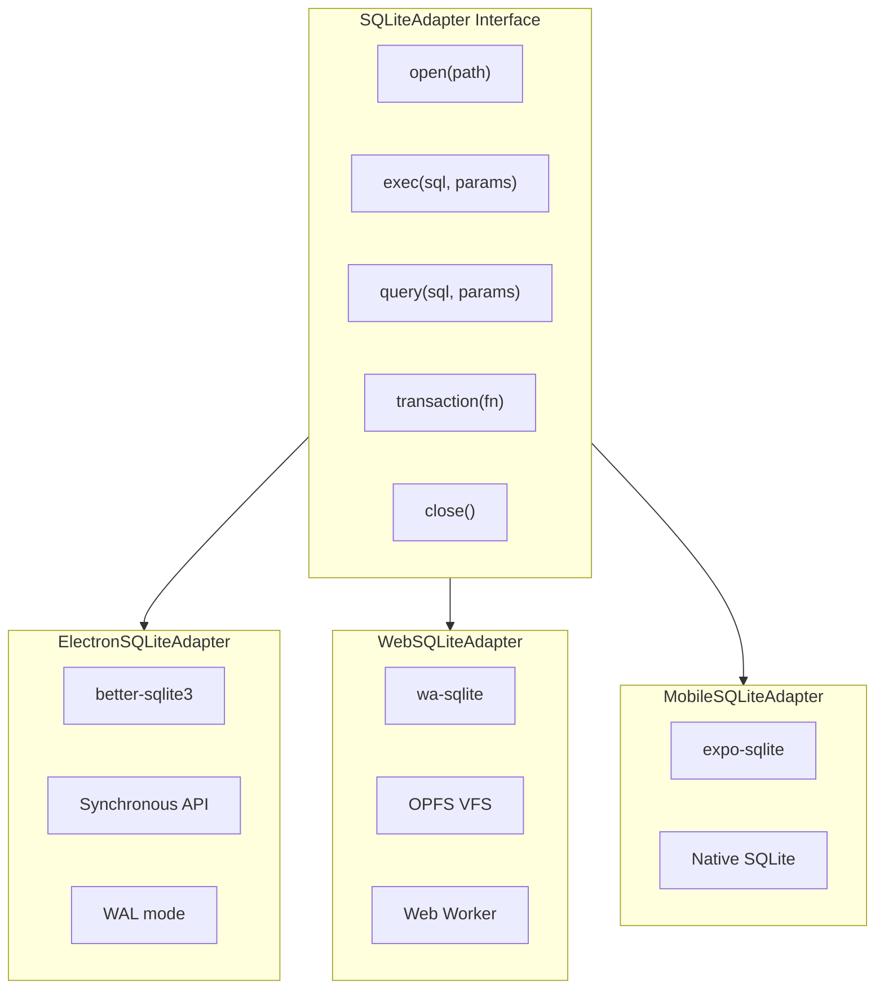

---

## Implementation Plan

Since this is prerelease, we implement SQLite directly with no migration from IndexedDB. Existing data can be dropped.

### Phase 1: Electron (better-sqlite3)

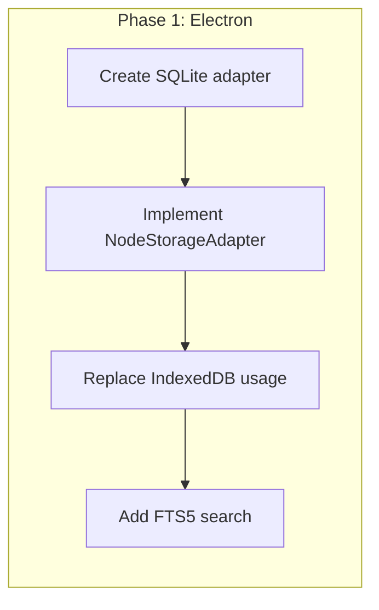

#### Checklist: Phase 1 - Electron

- [ ] Create `SQLiteNodeStorageAdapter`
  - [ ] Implement `NodeStorageAdapter` interface
  - [ ] Use `better-sqlite3` via utility process
  - [ ] WAL mode for durability
  - [ ] Prepared statements for performance

- [ ] Replace IndexedDB
  - [ ] Remove `IndexedDBNodeStorageAdapter` usage
  - [ ] Remove `idb` dependency from Electron
  - [ ] Update storage initialization

- [ ] Performance validation
  - [ ] Benchmark listNodes queries
  - [ ] Benchmark write throughput
  - [ ] Test with large datasets (100K+ nodes)

**Files to create/modify:**

- `packages/data/src/store/sqlite-adapter.ts` (new)
- `apps/electron/src/data-process/storage.ts`

---

### Phase 2: Web (wa-sqlite + OPFS)

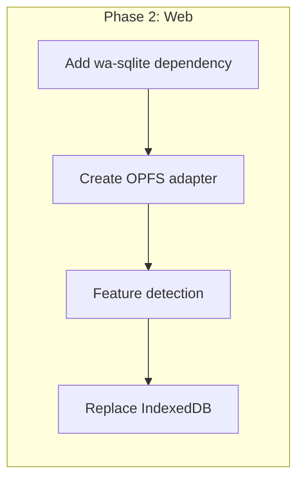

#### Checklist: Phase 2 - Web

- [ ] Add wa-sqlite dependency
  - [ ] `pnpm add wa-sqlite`
  - [ ] Configure Vite for WASM
  - [ ] Add COOP/COEP headers for SharedArrayBuffer
  - [ ] Test in all target browsers

- [ ] Create OPFS adapter
  - [ ] Implement `SQLiteAdapter` interface
  - [ ] Use `OPFSCoopSyncVFS` for durability
  - [ ] Run in Web Worker (required for sync access)
  - [ ] Comlink wrapper for main thread

- [ ] Browser compatibility
  - [ ] Check OPFS support on init
  - [ ] Check SharedArrayBuffer support
  - [ ] Show "unsupported browser" message if missing (no fallback)
  - [ ] Recommend desktop app for unsupported browsers

- [ ] Browser-specific testing
  - [ ] Chrome (baseline)
  - [ ] Firefox (OPFS differences)
  - [ ] Safari (iOS limitations)
  - [ ] Edge

**Files to create/modify:**

- `packages/data/src/store/sqlite-wasm-adapter.ts` (new)
- `packages/data/src/store/opfs-vfs.ts` (new)
- `apps/web/src/workers/sqlite-worker.ts` (new)
- `apps/web/vite.config.ts` (WASM config)

---

### Phase 3: Unified Storage Package

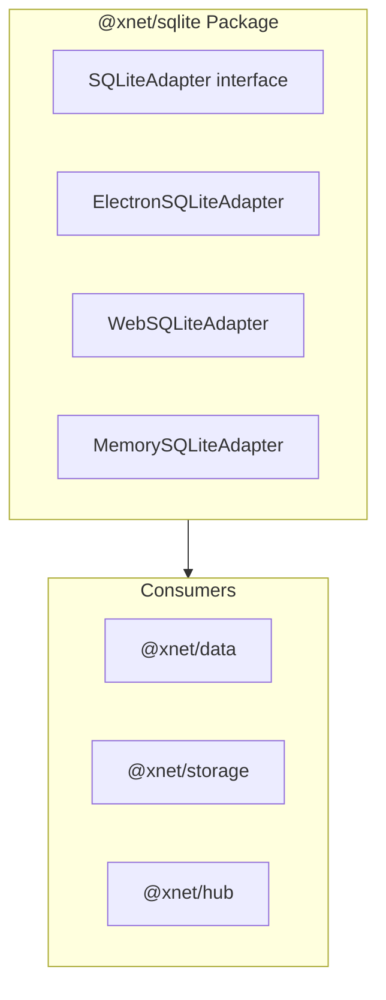

#### Checklist: Phase 3 - Unified Package

- [ ] Create `@xnet/sqlite` package
  - [ ] Define `SQLiteAdapter` interface
  - [ ] Platform detection utilities
  - [ ] Shared schema definitions

- [ ] Consolidate storage
  - [ ] `@xnet/data` uses `@xnet/sqlite`
  - [ ] `@xnet/storage` uses `@xnet/sqlite`
  - [ ] `@xnet/hub` aligned schema

- [ ] Documentation
  - [ ] Storage architecture docs
  - [ ] Performance tuning guide

---

### Phase 4: Mobile Support (Future)

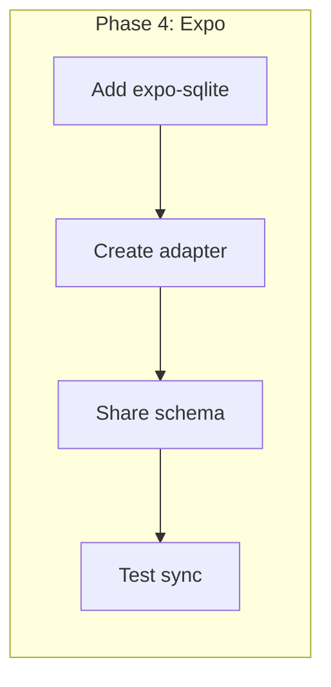

#### Checklist: Phase 4 - Mobile

- [ ] Expo SQLite integration
  - [ ] Add `expo-sqlite` dependency
  - [ ] Create `ExpoSQLiteAdapter`
  - [ ] Share schema with web/electron

- [ ] Sync testing
  - [ ] Test mobile-to-desktop sync
  - [ ] Test mobile-to-web sync
  - [ ] Conflict resolution verification

---

## Bundle Size Impact

### Current State

| Package           | Size (gzipped) |
| ----------------- | -------------- |
| `idb`             | ~8KB           |
| `pako`            | ~47KB          |
| Total IDB-related | ~55KB          |

### After Migration

| Package               | Size (gzipped) |
| --------------------- | -------------- |
| `wa-sqlite` (WASM)    | ~300KB         |
| `wa-sqlite` (JS glue) | ~20KB          |
| Total SQLite-WASM     | ~320KB         |

**Net increase: ~265KB** (acceptable for local-first app)

### Mitigation Strategies

1. **Lazy load WASM** - Load SQLite only when first needed
2. **Code splitting** - Keep WASM in separate chunk
3. **CDN caching** - WASM file caches well

---

## Performance Benchmarks

### Expected Improvements

```mermaid
xychart-beta
    title "Query Performance: IndexedDB vs SQLite"
    x-axis ["List 1K", "List 10K", "Filter", "Search", "Bulk Insert"]
    y-axis "Time (ms)" 0 --> 1000
    bar [50, 500, 200, 0, 1000]
    bar [5, 50, 20, 10, 50]
```

| Operation        | IndexedDB | SQLite | Speedup |
| ---------------- | --------- | ------ | ------- |
| List 1K nodes    | 50ms      | 5ms    | 10x     |
| List 10K nodes   | 500ms     | 50ms   | 10x     |
| Filter by schema | 200ms     | 20ms   | 10x     |
| Full-text search | N/A       | 10ms   | Enabled |
| Bulk insert 1K   | 1000ms    | 50ms   | 20x     |
| Complex JOIN     | N/A       | 5ms    | Enabled |

### Considerations

1. **Cold start**: WASM initialization adds ~100-200ms on first load
2. **Memory**: SQLite uses more memory for large result sets
3. **Worker overhead**: Cross-thread communication adds latency
4. **Batching**: Batch operations see the biggest improvements

---

## Risk Assessment

### Technical Risks

| Risk                   | Probability | Impact | Mitigation                                    |
| ---------------------- | ----------- | ------ | --------------------------------------------- |
| WASM bundle size       | Low         | Medium | Lazy loading, CDN                             |
| Browser compatibility  | Low         | Medium | Require OPFS, show unsupported browser screen |
| Performance regression | Low         | Medium | Benchmarking                                  |
| OPFS quota limits      | Low         | Medium | Monitor usage, warn users                     |

**Note**: No fallback to IndexedDB. Unsupported browsers show a message recommending the desktop app.

---

## Implementation Timeline

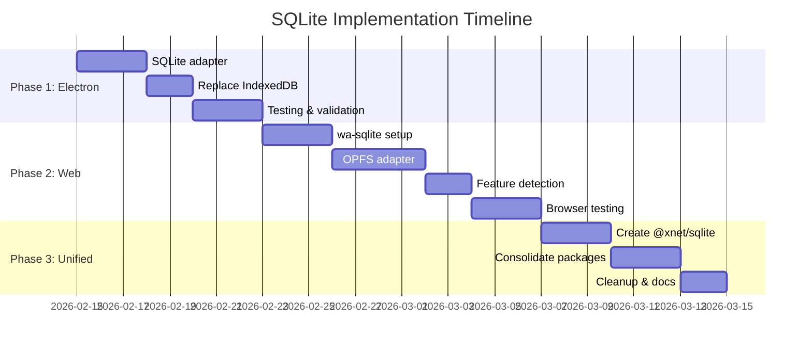

**Estimated total: 4-5 weeks** (no migration overhead)

---

## Decision Matrix

### SQLite vs IndexedDB

| Factor                | IndexedDB        | SQLite      | Winner    |
| --------------------- | ---------------- | ----------- | --------- |
| Query performance     | Poor             | Excellent   | SQLite    |
| Durability            | Low              | High        | SQLite    |
| Full-text search      | No               | Yes (FTS5)  | SQLite    |
| Complex queries       | No               | Yes (SQL)   | SQLite    |
| Bundle size           | Small            | +300KB      | IndexedDB |
| Browser support       | Universal        | Modern only | IndexedDB |
| Long-term maintenance | Complex          | Simple      | SQLite    |
| Hub compatibility     | Different schema | Same schema | SQLite    |

**Decision: SQLite**

The performance and durability benefits clearly outweigh the bundle size cost. Since this is prerelease, we implement SQLite directly with no migration overhead.

---

## Open Questions

1. **CR-SQLite evaluation**: Should we evaluate CR-SQLite for replacing Yjs LWW?
   - Could unify sync model
   - But adds complexity and is less mature

2. **Encryption**: Should we add SQLCipher for at-rest encryption?
   - Higher bundle size
   - Platform-specific builds
   - Consider for enterprise tier

3. **Shared Worker**: Should we use a Shared Worker for cross-tab SQLite access?
   - Better multi-tab support
   - More complex implementation

4. **WAL checkpoint strategy**: When to checkpoint the WAL file?
   - On app close
   - Periodic (every N minutes)
   - On idle

---

## References

- [SQLite WASM Documentation](https://sqlite.org/wasm/doc/trunk/index.md)
- [wa-sqlite GitHub](https://github.com/rhashimoto/wa-sqlite)
- [CR-SQLite GitHub](https://github.com/vlcn-io/cr-sqlite)
- [OPFS Specification](https://fs.spec.whatwg.org/)
- [Chrome OPFS Blog Post](https://developer.chrome.com/blog/from-web-sql-to-sqlite-wasm/)
- [0016_PERSISTENCE_ARCHITECTURE.md](./0016_PERSISTENCE_ARCHITECTURE.md)
