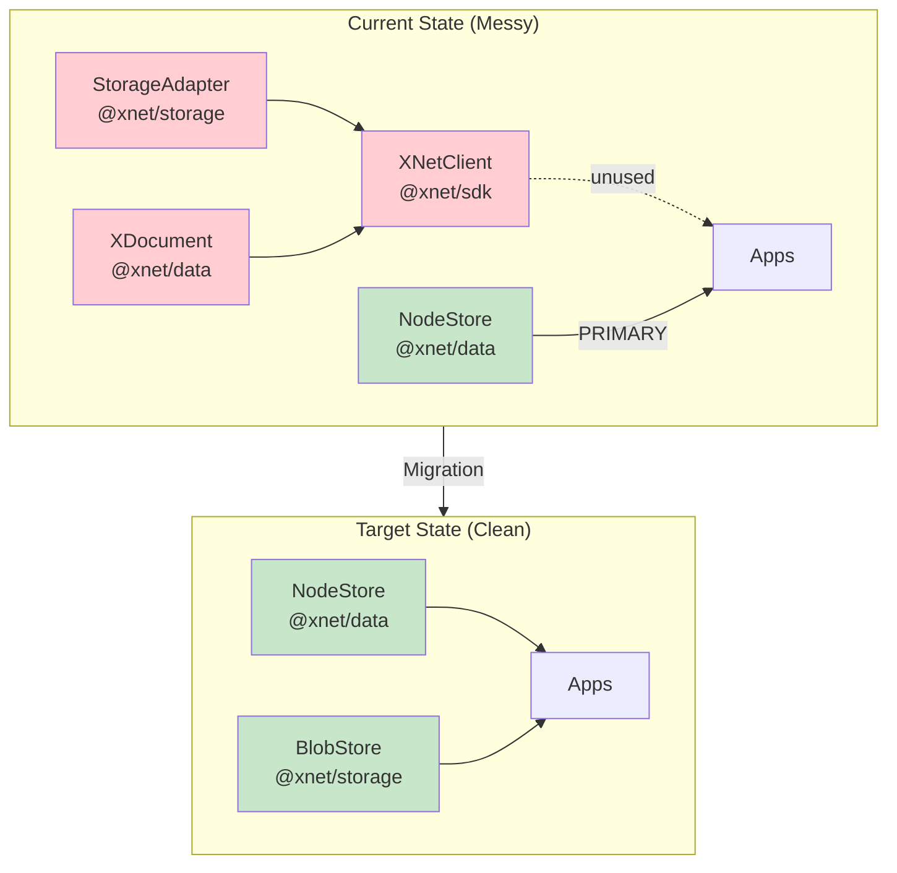
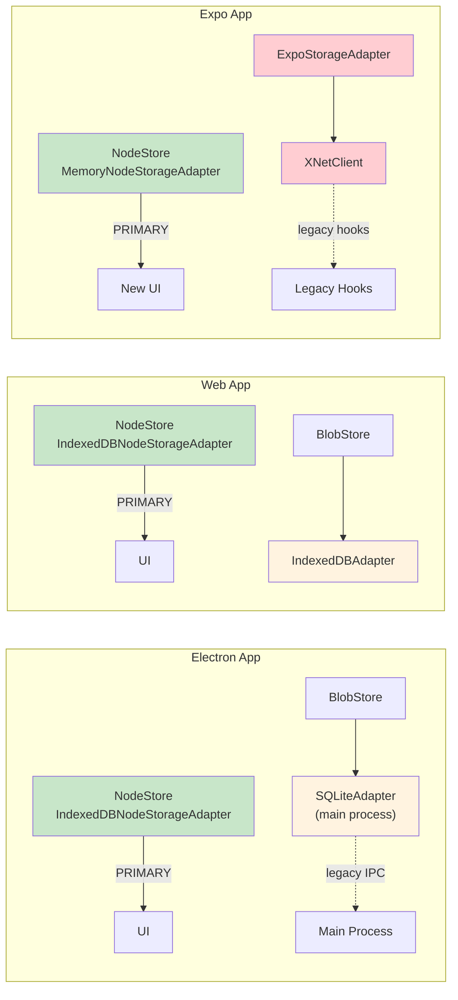
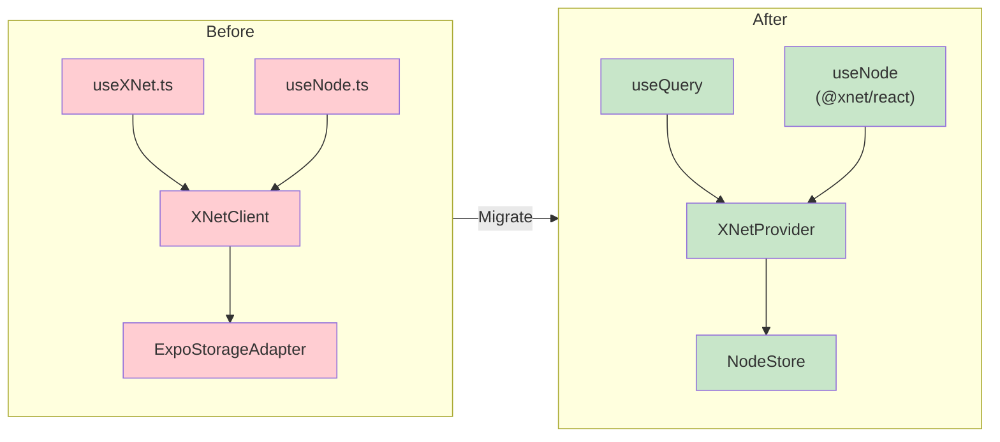
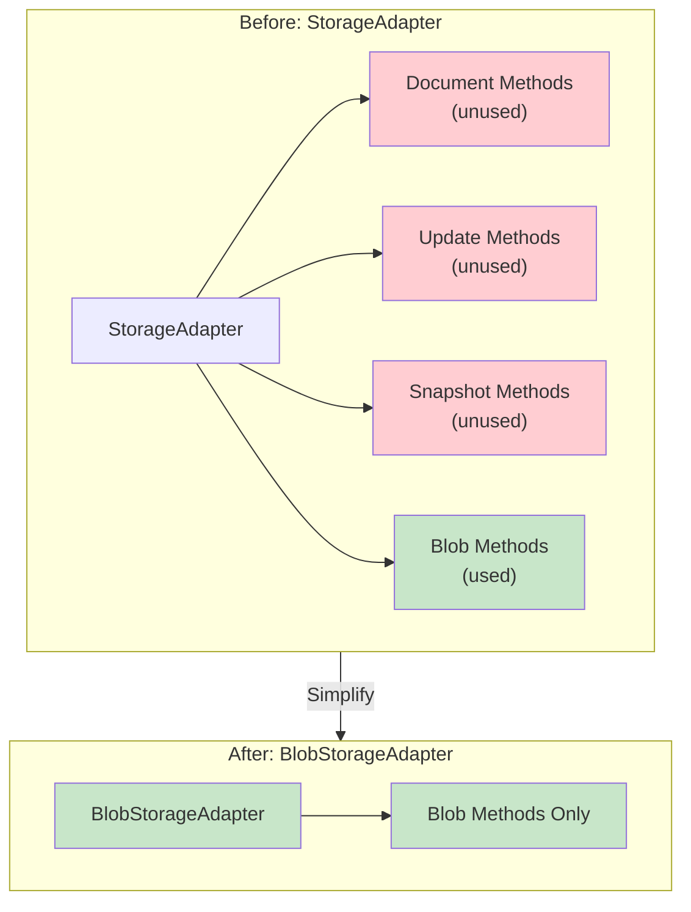
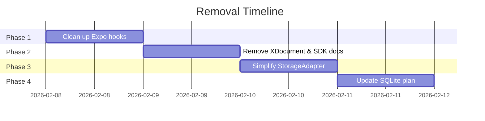

# StorageAdapter and XDocument Removal

> Analysis of removing the legacy StorageAdapter interface and XDocument type in favor of the NodeStore-centric architecture.

**Date**: February 2026
**Status**: Recommended

## Executive Summary

The `StorageAdapter` interface (from `@xnet/storage`) and `XDocument` type (from `@xnet/data`) are **legacy code that can be safely removed**. The NodeStore architecture has replaced their functionality across all apps:

| Component          | Status                           | Recommendation             |
| ------------------ | -------------------------------- | -------------------------- |
| `StorageAdapter`   | Legacy, partially used for blobs | Remove after blob refactor |
| `XDocument`        | Dead code in apps                | Remove immediately         |
| `XNetClient` (SDK) | Unused by Electron/Web           | Deprecate and remove       |



## Background

### What Are These Components?

**StorageAdapter** (`packages/storage/src/types.ts`):

```typescript
export interface StorageAdapter {
  // Document operations (UNUSED)
  getDocument(id: string): Promise<DocumentData | null>
  setDocument(id: string, data: DocumentData): Promise<void>
  deleteDocument(id: string): Promise<void>
  listDocuments(prefix?: string): Promise<string[]>

  // Update log (UNUSED)
  appendUpdate(docId: string, update: SignedUpdate): Promise<void>
  getUpdates(docId: string, since?: string): Promise<SignedUpdate[]>

  // Blobs (STILL USED)
  getBlob(cid: ContentId): Promise<Uint8Array | null>
  setBlob(cid: ContentId, data: Uint8Array): Promise<void>
  hasBlob(cid: ContentId): Promise<boolean>
}
```

**XDocument** (`packages/data/src/types.ts`):

```typescript
export interface XDocument {
  id: string
  ydoc: Y.Doc
  workspace: string
  type: DocumentType
  metadata: DocumentMetadata
}
```

**XNetClient** (`packages/sdk/src/client.ts`):

- Wraps StorageAdapter + optional NetworkNode
- Creates XDocument instances via `createDocument`/`loadDocument`
- **Not used by Electron or Web apps**

### What Replaced Them?

**NodeStore** (`packages/data/src/store/store.ts`):

- Event-sourced storage with LWW conflict resolution
- Lamport clocks for distributed ordering
- Schema-based nodes with typed properties
- Transactions with atomic batch operations
- Rich text content stored as `documentContent: Uint8Array` (serialized Y.Doc)

## Current Usage Analysis

### App-by-App Breakdown



### Electron App

| Component        | Uses                           | Notes                                                    |
| ---------------- | ------------------------------ | -------------------------------------------------------- |
| **Renderer**     | `IndexedDBNodeStorageAdapter`  | NodeStore is primary data layer                          |
| **Main Process** | `SQLiteAdapter`                | Legacy IPC handlers, mostly unused                       |
| **Blobs**        | `BlobStore` → `StorageAdapter` | Only blob methods used                                   |
| **XNetClient**   | Created but barely used        | Legacy IPC handlers exist but renderer doesn't call them |

**Verdict**: NodeStore is primary. StorageAdapter only used for blob storage.

### Web App

| Component      | Uses                             | Notes                          |
| -------------- | -------------------------------- | ------------------------------ |
| **Main**       | `IndexedDBNodeStorageAdapter`    | NodeStore is primary           |
| **Blobs**      | `IndexedDBAdapter` → `BlobStore` | StorageAdapter for blobs only  |
| **XNetClient** | **Not imported**                 | Web app doesn't use SDK at all |

**Verdict**: NodeStore is primary. StorageAdapter for blobs only. No XDocument usage.

### Expo App

| Component        | Uses                                | Notes                                    |
| ---------------- | ----------------------------------- | ---------------------------------------- |
| **XNetProvider** | `MemoryNodeStorageAdapter`          | Modern path uses NodeStore               |
| **Legacy hooks** | `ExpoStorageAdapter` → `XNetClient` | `useXNet.ts`, `useNode.ts` still use SDK |
| **XDocument**    | Used by legacy hooks                | Only place XDocument is actually used    |

**Verdict**: Dual systems exist. Legacy hooks should be migrated to NodeStore.

## What's Actually Legacy?

### Definitely Legacy (Remove)

| Component                       | Location                         | Reason                                             |
| ------------------------------- | -------------------------------- | -------------------------------------------------- |
| `XDocument`                     | `packages/data/src/types.ts`     | Not used in Electron/Web, Expo should migrate      |
| `createDocument()`              | `packages/data/src/document.ts`  | Only used by XNetClient                            |
| `loadDocument()`                | `packages/data/src/document.ts`  | Only used by XNetClient                            |
| `XNetClient`                    | `packages/sdk/src/client.ts`     | Not used by Electron/Web apps                      |
| `useXNet.ts`                    | `apps/expo/src/hooks/useXNet.ts` | Legacy hook, should use XNetProvider               |
| `useNode.ts` (Expo)             | `apps/expo/src/hooks/useNode.ts` | Legacy, different from `@xnet/react` useNode       |
| StorageAdapter document methods | `packages/storage/src/types.ts`  | `getDocument`, `setDocument`, `appendUpdate`, etc. |

### Still Needed (Keep or Refactor)

| Component                   | Location                                     | Reason                                  |
| --------------------------- | -------------------------------------------- | --------------------------------------- |
| `BlobStore`                 | `packages/storage/src/blob-store.ts`         | Used for content-addressed blob storage |
| StorageAdapter blob methods | `packages/storage/src/types.ts`              | `getBlob`, `setBlob`, `hasBlob`         |
| `IndexedDBAdapter`          | `packages/storage/src/adapters/indexeddb.ts` | Implements blob storage                 |

## Migration Plan

### Phase 1: Clean Up Expo (Low Risk)



**Tasks**:

- [ ] Delete `apps/expo/src/hooks/useXNet.ts`
- [ ] Delete `apps/expo/src/hooks/useNode.ts` (uses XDocument)
- [ ] Update Expo screens to use `@xnet/react` hooks instead
- [ ] Delete `apps/expo/src/storage/ExpoStorageAdapter.ts`
- [ ] Delete `apps/expo/src/storage/ExpoSQLiteAdapter.ts`

### Phase 2: Remove XDocument and SDK Document Features

**Tasks**:

- [ ] Delete `packages/data/src/document.ts` (createDocument, loadDocument)
- [ ] Delete `XDocument` type from `packages/data/src/types.ts`
- [ ] Delete `DocumentType`, `DocumentMetadata` from types
- [ ] Remove XDocument exports from `packages/data/src/index.ts`
- [ ] Delete or refactor `packages/sdk/src/client.ts` (XNetClient)
- [ ] Remove document-related IPC handlers from Electron main process

### Phase 3: Simplify StorageAdapter to BlobStorageAdapter



**Tasks**:

- [ ] Create new `BlobStorageAdapter` interface with only blob methods
- [ ] Migrate `BlobStore` to use `BlobStorageAdapter`
- [ ] Migrate `IndexedDBAdapter` to implement `BlobStorageAdapter`
- [ ] Delete document/update/snapshot methods from adapters
- [ ] Rename or deprecate `StorageAdapter`

### Phase 4: Clean Up SQLite Plan

The SQLite migration plan (`docs/plans/plan03_9_5IndexedDBToSQLite/`) includes tables for StorageAdapter compatibility:

```sql
-- These tables can be removed:
CREATE TABLE IF NOT EXISTS documents (...)  -- Legacy
CREATE TABLE IF NOT EXISTS updates (...)    -- Legacy
CREATE TABLE IF NOT EXISTS snapshots (...)  -- Legacy

-- These tables are still needed:
CREATE TABLE IF NOT EXISTS blobs (...)      -- BlobStore
CREATE TABLE IF NOT EXISTS nodes (...)      -- NodeStore
CREATE TABLE IF NOT EXISTS changes (...)    -- NodeStore
CREATE TABLE IF NOT EXISTS yjs_state (...)  -- Rich text content
```

**Tasks**:

- [ ] Update SQLite schema to remove `documents`, `updates`, `snapshots` tables
- [ ] Keep `blobs` table for BlobStore
- [ ] Keep NodeStore tables (`nodes`, `node_properties`, `changes`)
- [ ] Keep `yjs_state` for Y.Doc content (stored via NodeStore.documentContent)

## Detailed File Removal Checklist

### Files to Delete

```
apps/expo/src/hooks/useXNet.ts                    # Legacy hook
apps/expo/src/hooks/useNode.ts                    # Legacy hook (XDocument)
apps/expo/src/storage/ExpoStorageAdapter.ts       # Legacy adapter
apps/expo/src/storage/ExpoSQLiteAdapter.ts        # Legacy adapter

packages/data/src/document.ts                     # XDocument operations
packages/data/src/updates.ts                      # SignedUpdate (if unused)

packages/sdk/src/client.ts                        # XNetClient (maybe keep types)
```

### Files to Modify

```
packages/storage/src/types.ts                     # Remove document methods
packages/storage/src/adapters/indexeddb.ts        # Remove document methods
packages/storage/src/adapters/memory.ts           # Remove document methods

packages/data/src/types.ts                        # Remove XDocument, DocumentType
packages/data/src/index.ts                        # Remove document exports

apps/electron/src/main/ipc.ts                     # Remove document IPC handlers
apps/electron/src/preload/index.ts                # Remove document IPC types
apps/electron/src/main/storage.ts                 # Remove document methods
```

### Exports to Remove from `@xnet/data`

```typescript
// Remove these exports:
export { createDocument, loadDocument, getDocumentState, ... } from './document'
export type { XDocument, DocumentType, DocumentMetadata, Block } from './types'
```

### Exports to Remove from `@xnet/storage`

```typescript
// Remove from StorageAdapter interface:
;(getDocument, setDocument, deleteDocument, listDocuments)
;(appendUpdate, getUpdates, getUpdateCount)
;(getSnapshot, setSnapshot)
```

## Risk Assessment

| Risk                   | Likelihood | Impact | Mitigation                           |
| ---------------------- | ---------- | ------ | ------------------------------------ |
| Expo app breaks        | Medium     | Medium | Test Expo after migration            |
| Hidden XDocument usage | Low        | Low    | Grep confirms limited usage          |
| Blob storage breaks    | Low        | High   | Keep BlobStorageAdapter interface    |
| Network sync breaks    | Low        | Medium | Sync uses SyncManager, not XDocument |

## Decision Matrix

| Question                                  | Answer                                 |
| ----------------------------------------- | -------------------------------------- |
| Is StorageAdapter used for documents?     | **No** - Only blob methods used        |
| Is XDocument used in production apps?     | **No** - Only Expo legacy hooks        |
| Does NodeStore replace XDocument?         | **Yes** - Properties + documentContent |
| Can we remove without migration?          | **Yes** - Pre-release, no user data    |
| Does BlobStore still need StorageAdapter? | **Partially** - Only blob methods      |

## Conclusion

**Recommendation: Proceed with removal.**

The StorageAdapter (document methods) and XDocument are legacy code that NodeStore has replaced. The removal is safe because:

1. **Pre-release** - No need for data migration
2. **Electron/Web don't use XDocument** - Only NodeStore
3. **Expo legacy hooks are isolated** - Easy to migrate
4. **Blob storage is separate** - Can create BlobStorageAdapter

The main work is:

1. Migrate Expo's legacy hooks to use `@xnet/react` hooks
2. Create a simpler `BlobStorageAdapter` interface
3. Delete the legacy code

**Estimated effort**: 2-3 days


