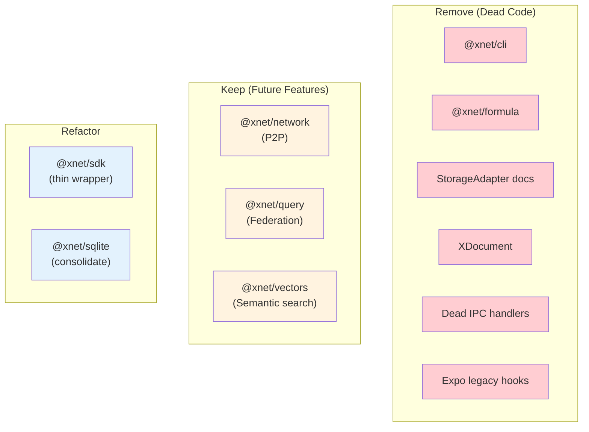
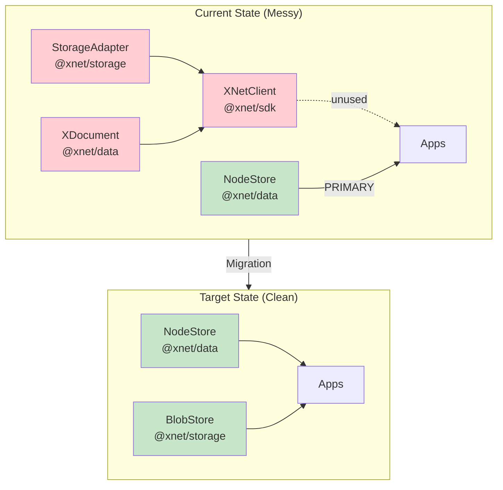
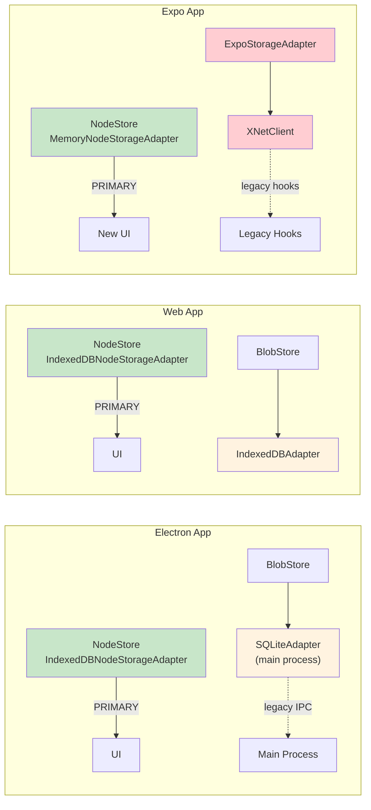
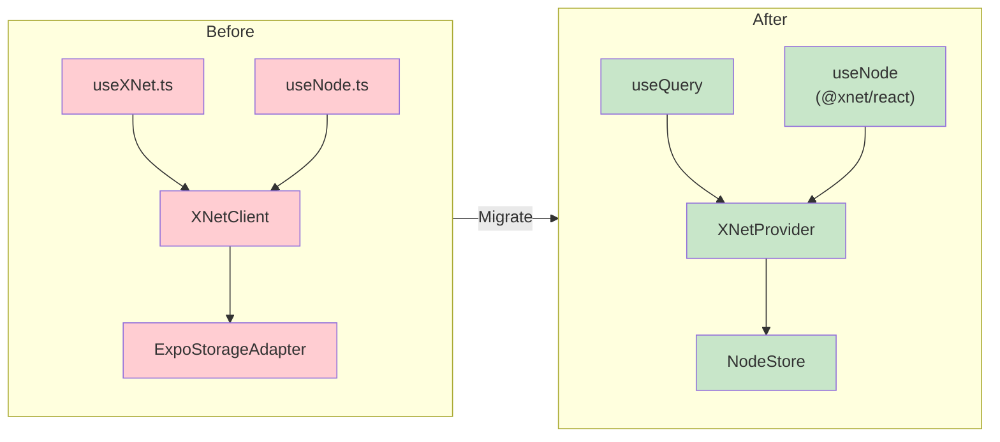
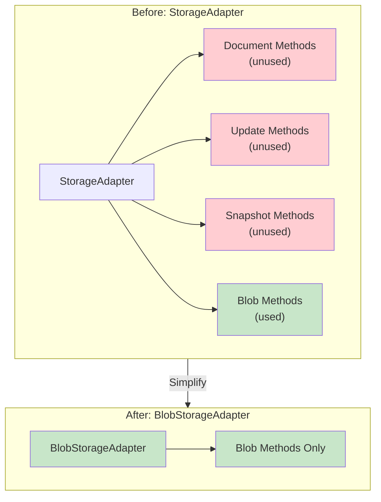
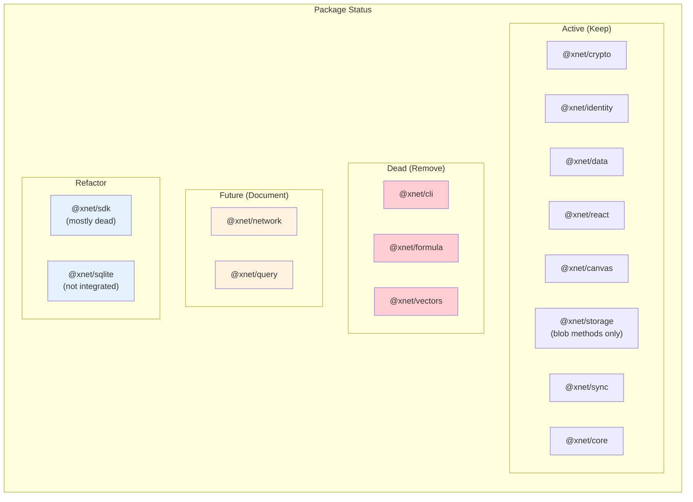
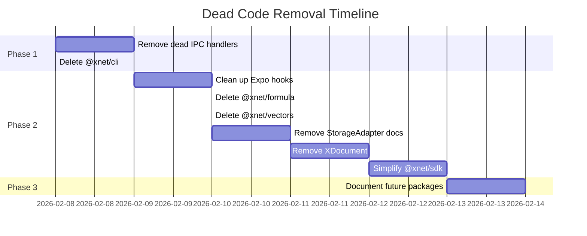

# Dead Code Removal: StorageAdapter, XDocument, and Beyond

> Comprehensive analysis of legacy and dead code that can be safely removed from the xNet codebase.

**Date**: February 2026
**Status**: Recommended

## Executive Summary

This exploration identifies **significant dead code** across the xNet codebase. The NodeStore architecture has replaced older patterns, and several packages/features were built but never integrated.

### High-Level Summary

| Category                                           | Items                            | Est. Lines | Priority     |
| -------------------------------------------------- | -------------------------------- | ---------- | ------------ |
| Legacy storage (StorageAdapter, XDocument)         | 7 files                          | ~500       | High         |
| Unused packages (@xnet/cli, @xnet/formula)         | 2 packages                       | ~1500      | Medium       |
| Unintegrated packages (@xnet/network, @xnet/query) | 2 packages                       | ~2000      | Low (future) |
| Dead IPC handlers (Electron)                       | 9+ handlers                      | ~200       | High         |
| Expo legacy hooks                                  | 2 local hooks (useXNet, useNode) | ~130       | Medium       |
| Deprecated sync exports                            | V1 envelope/attestation          | ~400       | Low          |



---

## Part 1: StorageAdapter and XDocument

The `StorageAdapter` interface (from `@xnet/storage`) and `XDocument` type (from `@xnet/data`) are **legacy code that can be safely removed**. The NodeStore architecture has replaced their functionality across all apps:

| Component          | Status                           | Recommendation             |
| ------------------ | -------------------------------- | -------------------------- |
| `StorageAdapter`   | Legacy, partially used for blobs | Remove after blob refactor |
| `XDocument`        | Dead code in apps                | Remove immediately         |
| `XNetClient` (SDK) | Unused by Electron/Web           | Deprecate and remove       |



## Background

### What Are These Components?

**StorageAdapter** (`packages/storage/src/types.ts`):

```typescript
export interface StorageAdapter {
  // Document operations (UNUSED)
  getDocument(id: string): Promise<DocumentData | null>
  setDocument(id: string, data: DocumentData): Promise<void>
  deleteDocument(id: string): Promise<void>
  listDocuments(prefix?: string): Promise<string[]>

  // Update log (UNUSED)
  appendUpdate(docId: string, update: SignedUpdate): Promise<void>
  getUpdates(docId: string, since?: string): Promise<SignedUpdate[]>

  // Blobs (STILL USED)
  getBlob(cid: ContentId): Promise<Uint8Array | null>
  setBlob(cid: ContentId, data: Uint8Array): Promise<void>
  hasBlob(cid: ContentId): Promise<boolean>
}
```

**XDocument** (`packages/data/src/types.ts`):

```typescript
export interface XDocument {
  id: string
  ydoc: Y.Doc
  workspace: string
  type: DocumentType
  metadata: DocumentMetadata
}
```

**XNetClient** (`packages/sdk/src/client.ts`):

- Wraps StorageAdapter + optional NetworkNode
- Creates XDocument instances via `createDocument`/`loadDocument`
- **Not used by Electron or Web apps**

### What Replaced Them?

**NodeStore** (`packages/data/src/store/store.ts`):

- Event-sourced storage with LWW conflict resolution
- Lamport clocks for distributed ordering
- Schema-based nodes with typed properties
- Transactions with atomic batch operations
- Rich text content stored as `documentContent: Uint8Array` (serialized Y.Doc)

## Current Usage Analysis

### App-by-App Breakdown



### Electron App

| Component        | Uses                           | Notes                                                    |
| ---------------- | ------------------------------ | -------------------------------------------------------- |
| **Renderer**     | `IndexedDBNodeStorageAdapter`  | NodeStore is primary data layer                          |
| **Main Process** | `SQLiteAdapter`                | Legacy IPC handlers, mostly unused                       |
| **Blobs**        | `BlobStore` → `StorageAdapter` | Only blob methods used                                   |
| **XNetClient**   | Created but barely used        | Legacy IPC handlers exist but renderer doesn't call them |

**Verdict**: NodeStore is primary. StorageAdapter only used for blob storage.

### Web App

| Component      | Uses                             | Notes                          |
| -------------- | -------------------------------- | ------------------------------ |
| **Main**       | `IndexedDBNodeStorageAdapter`    | NodeStore is primary           |
| **Blobs**      | `IndexedDBAdapter` → `BlobStore` | StorageAdapter for blobs only  |
| **XNetClient** | **Not imported**                 | Web app doesn't use SDK at all |

**Verdict**: NodeStore is primary. StorageAdapter for blobs only. No XDocument usage.

### Expo App

| Component        | Uses                                | Notes                                    |
| ---------------- | ----------------------------------- | ---------------------------------------- |
| **XNetProvider** | `MemoryNodeStorageAdapter`          | Modern path uses NodeStore               |
| **Legacy hooks** | `ExpoStorageAdapter` → `XNetClient` | `useXNet.ts`, `useNode.ts` still use SDK |
| **XDocument**    | Used by legacy hooks                | Only place XDocument is actually used    |

**Verdict**: Dual systems exist. Legacy hooks should be migrated to NodeStore.

## What's Actually Legacy?

### Definitely Legacy (Remove)

| Component                       | Location                         | Reason                                                                  |
| ------------------------------- | -------------------------------- | ----------------------------------------------------------------------- |
| `XDocument`                     | `packages/data/src/types.ts`     | Not used in Electron/Web, Expo should migrate                           |
| `createDocument()`              | `packages/data/src/document.ts`  | Only used by XNetClient                                                 |
| `loadDocument()`                | `packages/data/src/document.ts`  | Only used by XNetClient                                                 |
| `XNetClient`                    | `packages/sdk/src/client.ts`     | Not used by Electron/Web apps                                           |
| `useXNet.ts` (Expo)             | `apps/expo/src/hooks/useXNet.ts` | Legacy hook wrapping XNetClient                                         |
| `useNode.ts` (Expo local)       | `apps/expo/src/hooks/useNode.ts` | Expo's local hook wrapping legacy useXNet (not `@xnet/react`'s useNode) |
| StorageAdapter document methods | `packages/storage/src/types.ts`  | `getDocument`, `setDocument`, `appendUpdate`, etc.                      |

### Still Needed (Keep or Refactor)

| Component                   | Location                                     | Reason                                  |
| --------------------------- | -------------------------------------------- | --------------------------------------- |
| `BlobStore`                 | `packages/storage/src/blob-store.ts`         | Used for content-addressed blob storage |
| StorageAdapter blob methods | `packages/storage/src/types.ts`              | `getBlob`, `setBlob`, `hasBlob`         |
| `IndexedDBAdapter`          | `packages/storage/src/adapters/indexeddb.ts` | Implements blob storage                 |

## Migration Plan

### Phase 1: Clean Up Expo (Low Risk)



**Tasks**:

- [x] Delete `apps/expo/src/hooks/useXNet.ts` (legacy XNetClient wrapper)
- [x] Delete `apps/expo/src/hooks/useNode.ts` (Expo's local hook that wraps legacy useXNet)
- [ ] Update Expo screens to use `@xnet/react` hooks (useNode, useQuery, etc.)
- [ ] Delete `apps/expo/src/storage/ExpoStorageAdapter.ts`
- [ ] Delete `apps/expo/src/storage/ExpoSQLiteAdapter.ts`

### Phase 2: Remove XDocument and SDK Document Features

**Tasks**:

- [x] Delete `packages/data/src/document.ts` (createDocument, loadDocument)
- [x] Delete `XDocument` type from `packages/data/src/types.ts`
- [x] Delete `DocumentType`, `DocumentMetadata` from types
- [x] Remove XDocument exports from `packages/data/src/index.ts`
- [x] Delete or refactor `packages/sdk/src/client.ts` (XNetClient)
- [x] Remove document-related IPC handlers from Electron main process

### Phase 3: Simplify StorageAdapter to BlobStorageAdapter



**Tasks**:

- [ ] Create new `BlobStorageAdapter` interface with only blob methods
- [ ] Migrate `BlobStore` to use `BlobStorageAdapter`
- [ ] Migrate `IndexedDBAdapter` to implement `BlobStorageAdapter`
- [x] Delete document/update/snapshot methods from adapters
- [ ] Rename or deprecate `StorageAdapter`

### Phase 4: Clean Up SQLite Plan

The SQLite migration plan (`docs/plans/plan03_9_5IndexedDBToSQLite/`) includes tables for StorageAdapter compatibility:

```sql
-- These tables can be removed:
CREATE TABLE IF NOT EXISTS documents (...)  -- Legacy
CREATE TABLE IF NOT EXISTS updates (...)    -- Legacy
CREATE TABLE IF NOT EXISTS snapshots (...)  -- Legacy

-- These tables are still needed:
CREATE TABLE IF NOT EXISTS blobs (...)      -- BlobStore
CREATE TABLE IF NOT EXISTS nodes (...)      -- NodeStore
CREATE TABLE IF NOT EXISTS changes (...)    -- NodeStore
CREATE TABLE IF NOT EXISTS yjs_state (...)  -- Rich text content
```

**Tasks**:

- [x] Update SQLite schema to remove `documents`, `updates`, `snapshots` tables
- [ ] Keep `blobs` table for BlobStore
- [ ] Keep NodeStore tables (`nodes`, `node_properties`, `changes`)
- [ ] Keep `yjs_state` for Y.Doc content (stored via NodeStore.documentContent)

## Detailed File Removal Checklist

### Files to Delete

```
apps/expo/src/hooks/useXNet.ts                    # Legacy hook
apps/expo/src/hooks/useNode.ts                    # Legacy hook (XDocument)
apps/expo/src/storage/ExpoStorageAdapter.ts       # Legacy adapter
apps/expo/src/storage/ExpoSQLiteAdapter.ts        # Legacy adapter

packages/data/src/document.ts                     # XDocument operations
packages/data/src/updates.ts                      # SignedUpdate (if unused)

packages/sdk/src/client.ts                        # XNetClient (maybe keep types)
```

### Files to Modify

```
packages/storage/src/types.ts                     # Remove document methods
packages/storage/src/adapters/indexeddb.ts        # Remove document methods
packages/storage/src/adapters/memory.ts           # Remove document methods

packages/data/src/types.ts                        # Remove XDocument, DocumentType
packages/data/src/index.ts                        # Remove document exports

apps/electron/src/main/ipc.ts                     # Remove document IPC handlers
apps/electron/src/preload/index.ts                # Remove document IPC types
apps/electron/src/main/storage.ts                 # Remove document methods
```

### Exports to Remove from `@xnet/data`

```typescript
// Remove these exports:
export { createDocument, loadDocument, getDocumentState, ... } from './document'
export type { XDocument, DocumentType, DocumentMetadata, Block } from './types'
```

### Exports to Remove from `@xnet/storage`

```typescript
// Remove from StorageAdapter interface:
;(getDocument, setDocument, deleteDocument, listDocuments)
;(appendUpdate, getUpdates, getUpdateCount)
;(getSnapshot, setSnapshot)
```

## Risk Assessment

| Risk                   | Likelihood | Impact | Mitigation                           |
| ---------------------- | ---------- | ------ | ------------------------------------ |
| Expo app breaks        | Medium     | Medium | Test Expo after migration            |
| Hidden XDocument usage | Low        | Low    | Grep confirms limited usage          |
| Blob storage breaks    | Low        | High   | Keep BlobStorageAdapter interface    |
| Network sync breaks    | Low        | Medium | Sync uses SyncManager, not XDocument |

## Decision Matrix

| Question                                  | Answer                                 |
| ----------------------------------------- | -------------------------------------- |
| Is StorageAdapter used for documents?     | **No** - Only blob methods used        |
| Is XDocument used in production apps?     | **No** - Only Expo legacy hooks        |
| Does NodeStore replace XDocument?         | **Yes** - Properties + documentContent |
| Can we remove without migration?          | **Yes** - Pre-release, no user data    |
| Does BlobStore still need StorageAdapter? | **Partially** - Only blob methods      |

## Conclusion

**Recommendation: Proceed with removal.**

The StorageAdapter (document methods) and XDocument are legacy code that NodeStore has replaced. The removal is safe because:

1. **Pre-release** - No need for data migration
2. **Electron/Web don't use XDocument** - Only NodeStore
3. **Expo legacy hooks are isolated** - Easy to migrate
4. **Blob storage is separate** - Can create BlobStorageAdapter

The main work is:

1. Migrate Expo's legacy hooks to use `@xnet/react` hooks
2. Create a simpler `BlobStorageAdapter` interface
3. Delete the legacy code

**Estimated effort**: 2-3 days

---

## Part 2: Unused Packages

### @xnet/cli - COMPLETELY UNUSED

**Path:** `packages/cli/`

**Evidence:**

- Not listed in any app's `package.json` dependencies
- No imports found anywhere in the codebase outside its own files
- Exports `diffSchemas`, `generateLensCode` but these are never imported

**Exports:**

```typescript
// Never used anywhere
export { diffSchemas } from './diff'
export { generateLensCode } from './codegen'
```

**Recommendation:** Delete entire package

---

### @xnet/formula - COMPLETELY UNUSED

**Path:** `packages/formula/`

**Evidence:**

- Not listed in any app's `package.json` dependencies
- No imports of `@xnet/formula` found anywhere
- Complete formula engine (lexer, parser, evaluator) never used

**What it contains:**

- Formula parser for computed properties
- Expression evaluator
- ~267+ lines of implementation

**Recommendation:** Delete or integrate into @xnet/data when computed properties are needed

---

### @xnet/vectors - UNUSED

**Path:** `packages/vectors/`

**Evidence:**

- Listed as dependency in @xnet/canvas `package.json`
- No actual imports of `@xnet/vectors` in any `.ts` files
- Complete HNSW/semantic search implementation never used

**Recommendation:** Remove until canvas needs semantic search

---

### @xnet/sqlite - NOT INTEGRATED

**Path:** `packages/sqlite/`

**Evidence:**

- Not imported by any app
- Apps have their own SQLite adapters:
  - Electron: uses `better-sqlite3` directly in `apps/electron/src/main/storage.ts`
  - Expo: uses `expo-sqlite` directly in `apps/expo/src/storage/`
  - Web: would use `@sqlite.org/sqlite-wasm` but this package not imported

**Recommendation:** Either consolidate all apps to use this package, or remove

---

## Part 3: Unintegrated Packages (Keep for Future)

### @xnet/network - P2P NOT INTEGRATED

**Path:** `packages/network/`

**Status:** Complete libp2p WebRTC implementation, but not wired into any app.

**Evidence:**

- Only imported by `@xnet/sdk/client.ts` (behind `enableNetwork: false` flag)
- Only imported by `@xnet/query/federation/router.ts` (which itself is unused)
- All apps explicitly set `enableNetwork: false`

**Code path:**

```typescript
// packages/sdk/src/client.ts
if (config.enableNetwork === true) {
  // Always false
  const { createNode } = await import('@xnet/network')
}
```

**Recommendation:** Keep for future P2P feature, document as unintegrated

---

### @xnet/query - EFFECTIVELY UNUSED

**Path:** `packages/query/`

**Evidence:**

- Only imported by @xnet/sdk (which is barely used)
- `LocalQueryEngine` created in SDK client but client's query methods never called
- `FederatedQueryRouter` requires `@xnet/network` which isn't integrated
- Apps use `NodeStore.query()` directly, not `sdk.query()`

**Recommendation:** Keep for future federated queries, or consolidate into @xnet/data

---

## Part 4: Dead IPC Handlers (Electron)

### Unused handlers in preload exposed via `window.xnet`:

| Handler                 | Status   | Evidence                   |
| ----------------------- | -------- | -------------------------- |
| `xnet:init`             | UNUSED   | Never called from renderer |
| `xnet:createDocument`   | UNUSED   | Never called from renderer |
| `xnet:getDocument`      | UNUSED   | Never called from renderer |
| `xnet:listDocuments`    | UNUSED   | Never called from renderer |
| `xnet:deleteDocument`   | UNUSED   | Never called from renderer |
| `xnet:query`            | UNUSED   | Never called from renderer |
| `xnet:search`           | UNUSED   | Never called from renderer |
| `xnet:getSyncStatus`    | UNUSED   | Never called from renderer |
| `xnet:stop`             | UNUSED   | Never called from renderer |
| `xnet:getProfile`       | **USED** | Called from renderer       |
| `xnet:onDevToolsToggle` | **USED** | Called from renderer       |

### Unused service IPC channels in `ALLOWED_SERVICE_CHANNELS`:

These are in the preload allowlist but have no `ipcMain.handle()` implementation:

```typescript
;('xnet:node:create',
  'xnet:node:get',
  'xnet:node:update',
  'xnet:node:delete',
  'xnet:node:list',
  'xnet:schema:get',
  'xnet:schema:list',
  'xnet:query:execute')
```

**Files to modify:**

- `apps/electron/src/main/ipc.ts` - Remove unused handlers
- `apps/electron/src/preload/index.ts` - Remove unused window.xnet methods

---

## Part 5: Deprecated Sync Exports

### V1 Envelope/Attestation (Deprecated)

**Path:** `packages/sync/src/`

**Files with deprecated exports:**

```
packages/sync/src/yjs-envelope.ts:
  - signYjsUpdate (deprecated)
  - verifyYjsEnvelope (deprecated)
  - SignedYjsEnvelopeV1 (deprecated)

packages/sync/src/clientid-attestation.ts:
  - createClientIdAttestation (deprecated)
  - verifyClientIdAttestation (deprecated)
  - ClientIdAttestationV1 (deprecated)
```

**Recommendation:** Remove after confirming V2 is fully adopted

---

### Legacy Identity Exports

**Path:** `packages/identity/src/index.ts`

```typescript
// Line 20: Key management (legacy - use key-bundle.ts for new code)
// Line 63: Legacy passkey storage (deprecated — use @xnet/identity/passkey instead)
```

---

## Part 6: Complete Removal Checklist

### Phase 1: High Priority (Remove Now)

- [x] **Dead IPC handlers** - `apps/electron/src/main/ipc.ts`
  - Remove: `xnet:init`, `xnet:createDocument`, `xnet:getDocument`, etc.
  - Keep: `xnet:getProfile`, `xnet:onDevToolsToggle`
- [x] **Preload window.xnet** - `apps/electron/src/preload/index.ts`
  - Remove unused methods matching IPC handlers above

- [ ] **@xnet/cli package** - `packages/cli/`
  - Delete entire directory
  - Remove from `pnpm-workspace.yaml` if listed

### Phase 2: Medium Priority (Refactor First)

- [ ] **Expo legacy hooks** - Migrate screens first
  - Delete: `apps/expo/src/hooks/useXNet.ts` (legacy XNetClient wrapper)
  - Delete: `apps/expo/src/hooks/useNode.ts` (Expo's local hook, NOT `@xnet/react`'s useNode)
  - Delete: `apps/expo/src/storage/ExpoStorageAdapter.ts`
  - Delete: `apps/expo/src/storage/ExpoSQLiteAdapter.ts`
  - Update screens to use `@xnet/react` hooks (useNode, useQuery, useMutate)

- [ ] **@xnet/formula package** - `packages/formula/`
  - Delete entire directory (or integrate when needed)

- [ ] **@xnet/vectors package** - `packages/vectors/`
  - Delete entire directory (or integrate when canvas needs it)

- [x] **StorageAdapter + XDocument** (see Part 1 above)

### Phase 3: Low Priority (Document as Future)

- [ ] **@xnet/network** - Add README noting it's for future P2P
- [ ] **@xnet/query** - Add README noting it's for future federation
- [ ] **@xnet/sqlite** - Decide: consolidate apps to use it, or remove
- [ ] **Deprecated V1 sync code** - Remove after V2 migration complete

---

## Summary Diagram



---

## Estimated Total Effort

| Phase                    | Items                                        | Effort       |
| ------------------------ | -------------------------------------------- | ------------ |
| Phase 1: High Priority   | IPC handlers, @xnet/cli                      | 0.5 days     |
| Phase 2: Medium Priority | Expo hooks, formula, vectors, StorageAdapter | 2-3 days     |
| Phase 3: Low Priority    | Documentation, deprecation                   | 0.5 days     |
| **Total**                |                                              | **3-4 days** |


