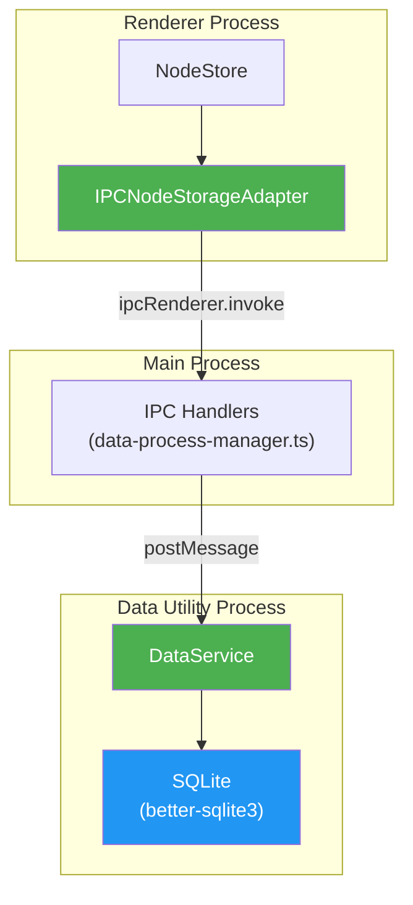
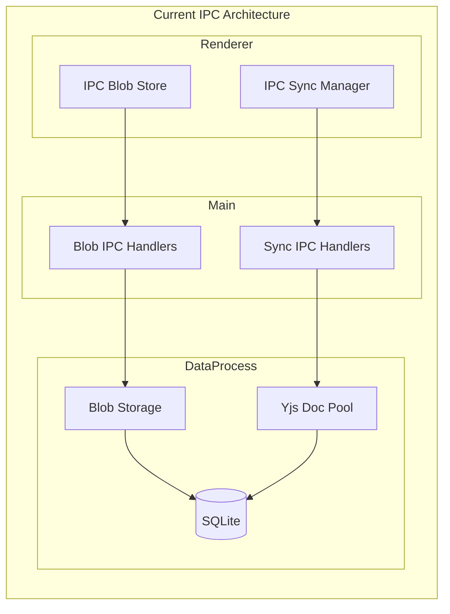
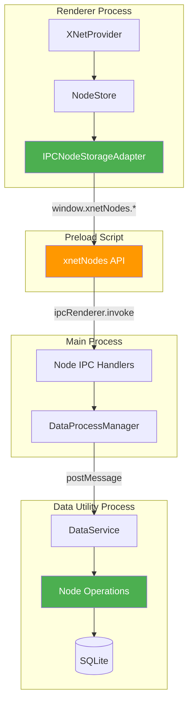
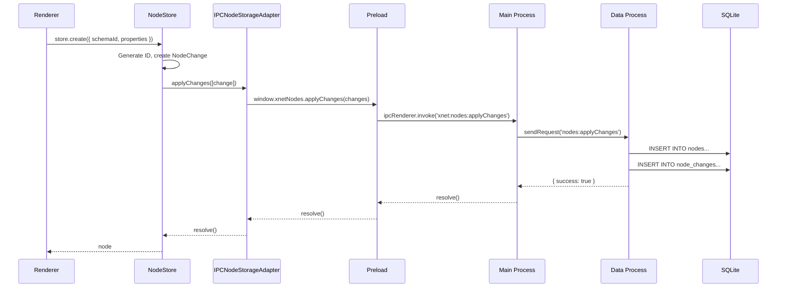
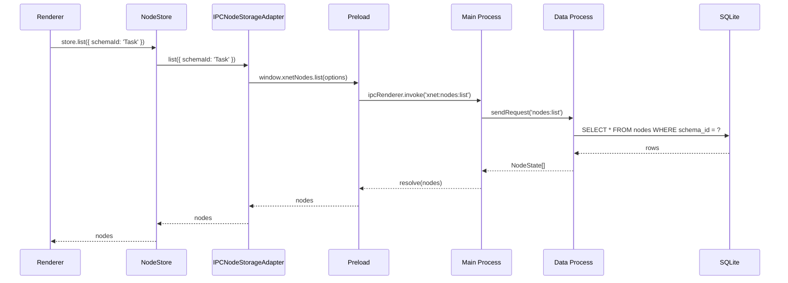
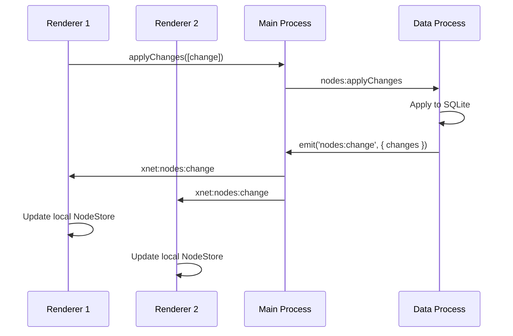

# Electron IPC Node Storage Adapter

> Design for routing NodeStore operations from the Electron renderer to the data process's SQLite database via IPC, completing the SQLite migration for the Electron app.

**References**:

- [0072_INDEXEDDB_TO_SQLITE_MIGRATION.md](./0072_INDEXEDDB_TO_SQLITE_MIGRATION.md) - SQLite migration plan
- [0073_STORAGEADAPTER_REMOVAL.md](./0073_STORAGEADAPTER_REMOVAL.md) - IndexedDB removal
- [0043_OFF_MAIN_THREAD_ARCHITECTURE.md](./0043_OFF_MAIN_THREAD_ARCHITECTURE.md) - Off-thread design

**Date**: February 2026
**Status**: Implemented

## Executive Summary

The SQLite migration removed `IndexedDBNodeStorageAdapter` from `@xnet/data`, but the Electron renderer still needs node storage. Currently using `MemoryNodeStorageAdapter` as a temporary fix, which means **nodes don't persist locally** if the app closes before sync completes.

This exploration designs an **IPC-based node storage adapter** that routes all NodeStore operations from the renderer to the data process's SQLite database.



## Current State

### Problem

After the SQLite migration (commit `c05c9a7`), the Electron app uses `MemoryNodeStorageAdapter`:

```typescript
// apps/electron/src/renderer/main.tsx (current)
const nodeStorage = new MemoryNodeStorageAdapter()
```

This means:

- Nodes are only in memory
- Nodes sync via the data process (Yjs updates work)
- **Nodes are lost if app closes before sync completes**
- No local persistence for offline-first experience

### Existing Architecture

The Electron app already has a robust IPC architecture for blobs and Yjs sync:



We need to add a similar path for node operations.

## Proposed Solution

### Architecture



### Components to Implement

#### 1. IPCNodeStorageAdapter (Renderer)

A `NodeStorageAdapter` implementation that routes all operations via IPC:

```typescript
// apps/electron/src/renderer/lib/ipc-node-storage.ts
import type { NodeStorageAdapter, NodeState, NodeChange, ListNodesOptions } from '@xnet/data'

export class IPCNodeStorageAdapter implements NodeStorageAdapter {
  async get(id: string): Promise<NodeState | null> {
    return window.xnetNodes.get(id)
  }

  async getMany(ids: string[]): Promise<Map<string, NodeState>> {
    const results = await window.xnetNodes.getMany(ids)
    return new Map(Object.entries(results))
  }

  async list(options?: ListNodesOptions): Promise<NodeState[]> {
    return window.xnetNodes.list(options)
  }

  async count(options?: { schemaId?: string }): Promise<number> {
    return window.xnetNodes.count(options)
  }

  async applyChanges(changes: NodeChange[]): Promise<void> {
    return window.xnetNodes.applyChanges(changes)
  }

  async getChanges(since?: number): Promise<NodeChange[]> {
    return window.xnetNodes.getChanges(since)
  }

  async clear(): Promise<void> {
    return window.xnetNodes.clear()
  }
}
```

#### 2. Preload API (Preload)

Expose node operations to the renderer:

```typescript
// apps/electron/src/preload/index.ts (additions)
contextBridge.exposeInMainWorld('xnetNodes', {
  get: (id: string) => ipcRenderer.invoke('xnet:nodes:get', { id }),
  getMany: (ids: string[]) => ipcRenderer.invoke('xnet:nodes:getMany', { ids }),
  list: (options?: ListNodesOptions) => ipcRenderer.invoke('xnet:nodes:list', options),
  count: (options?: { schemaId?: string }) => ipcRenderer.invoke('xnet:nodes:count', options),
  applyChanges: (changes: NodeChange[]) =>
    ipcRenderer.invoke('xnet:nodes:applyChanges', { changes }),
  getChanges: (since?: number) => ipcRenderer.invoke('xnet:nodes:getChanges', { since }),
  clear: () => ipcRenderer.invoke('xnet:nodes:clear'),

  // Change subscription
  onChange: (callback: (event: NodeChangeEvent) => void) => {
    const handler = (_: unknown, event: NodeChangeEvent) => callback(event)
    ipcRenderer.on('xnet:nodes:change', handler)
    return () => ipcRenderer.removeListener('xnet:nodes:change', handler)
  }
})
```

#### 3. IPC Handlers (Main Process)

Route node operations to the data process:

```typescript
// apps/electron/src/main/data-process-manager.ts (additions)

// Node IPC Handlers
ipcMain.handle('xnet:nodes:get', async (_event, opts: { id: string }) => {
  return sendRequest('nodes:get', opts)
})

ipcMain.handle('xnet:nodes:getMany', async (_event, opts: { ids: string[] }) => {
  return sendRequest('nodes:getMany', opts)
})

ipcMain.handle('xnet:nodes:list', async (_event, opts?: ListNodesOptions) => {
  return sendRequest('nodes:list', opts ?? {})
})

ipcMain.handle('xnet:nodes:count', async (_event, opts?: { schemaId?: string }) => {
  return sendRequest('nodes:count', opts ?? {})
})

ipcMain.handle('xnet:nodes:applyChanges', async (_event, opts: { changes: NodeChange[] }) => {
  return sendRequest('nodes:applyChanges', opts)
})

ipcMain.handle('xnet:nodes:getChanges', async (_event, opts: { since?: number }) => {
  return sendRequest('nodes:getChanges', opts)
})

ipcMain.handle('xnet:nodes:clear', async () => {
  return sendRequest('nodes:clear', {})
})

// Forward node change events to renderer
onEvent('nodes:change', (data) => {
  const win = getMainWindow()
  if (win && !win.isDestroyed()) {
    win.webContents.send('xnet:nodes:change', data)
  }
})
```

#### 4. DataService Node Operations (Data Process)

Add node storage operations to the data service:

```typescript
// apps/electron/src/data-process/data-service.ts (additions)

// Node storage using SQLite
async function getNode(id: string): Promise<NodeState | null> {
  if (!adapter) return null
  const row = await adapter.queryOne<NodeRow>('SELECT * FROM nodes WHERE id = ?', [id])
  return row ? rowToNodeState(row) : null
}

async function getManyNodes(ids: string[]): Promise<Record<string, NodeState>> {
  if (!adapter || ids.length === 0) return {}
  const placeholders = ids.map(() => '?').join(',')
  const rows = await adapter.query<NodeRow>(
    `SELECT * FROM nodes WHERE id IN (${placeholders})`,
    ids
  )
  const result: Record<string, NodeState> = {}
  for (const row of rows) {
    result[row.id] = rowToNodeState(row)
  }
  return result
}

async function listNodes(options?: ListNodesOptions): Promise<NodeState[]> {
  if (!adapter) return []
  let sql = 'SELECT * FROM nodes WHERE deleted = 0'
  const params: SQLValue[] = []

  if (options?.schemaId) {
    sql += ' AND schema_id = ?'
    params.push(options.schemaId)
  }

  sql += ' ORDER BY updated_at DESC'

  if (options?.limit) {
    sql += ' LIMIT ?'
    params.push(options.limit)
  }
  if (options?.offset) {
    sql += ' OFFSET ?'
    params.push(options.offset)
  }

  const rows = await adapter.query<NodeRow>(sql, params)
  return rows.map(rowToNodeState)
}

async function countNodes(options?: { schemaId?: string }): Promise<number> {
  if (!adapter) return 0
  let sql = 'SELECT COUNT(*) as count FROM nodes WHERE deleted = 0'
  const params: SQLValue[] = []

  if (options?.schemaId) {
    sql += ' AND schema_id = ?'
    params.push(options.schemaId)
  }

  const row = await adapter.queryOne<{ count: number }>(sql, params)
  return row?.count ?? 0
}

async function applyNodeChanges(changes: NodeChange[]): Promise<void> {
  if (!adapter || changes.length === 0) return

  await adapter.transaction(async () => {
    for (const change of changes) {
      await applyChange(change)
    }
  })

  // Emit change event
  sendEvent('nodes:change', { changes })
}

async function getNodeChanges(since?: number): Promise<NodeChange[]> {
  if (!adapter) return []

  let sql = 'SELECT * FROM node_changes'
  const params: SQLValue[] = []

  if (since !== undefined) {
    sql += ' WHERE timestamp > ?'
    params.push(since)
  }

  sql += ' ORDER BY timestamp ASC'

  const rows = await adapter.query<ChangeRow>(sql, params)
  return rows.map(rowToNodeChange)
}

async function clearNodes(): Promise<void> {
  if (!adapter) return
  await adapter.exec('DELETE FROM nodes')
  await adapter.exec('DELETE FROM node_changes')
}
```

#### 5. Message Handler Updates (Data Process)

Handle node operation messages:

```typescript
// apps/electron/src/data-process/index.ts (additions)

case 'nodes:get':
  result = await dataService.getNode(payload.id)
  break

case 'nodes:getMany':
  result = await dataService.getManyNodes(payload.ids)
  break

case 'nodes:list':
  result = await dataService.listNodes(payload)
  break

case 'nodes:count':
  result = await dataService.countNodes(payload)
  break

case 'nodes:applyChanges':
  await dataService.applyNodeChanges(payload.changes)
  result = {}
  break

case 'nodes:getChanges':
  result = await dataService.getNodeChanges(payload.since)
  break

case 'nodes:clear':
  await dataService.clearNodes()
  result = {}
  break
```

### SQLite Schema

The data process already has the unified SQLite schema from the migration. The relevant tables:

```sql
-- Nodes table (already exists)
CREATE TABLE IF NOT EXISTS nodes (
  id TEXT PRIMARY KEY,
  schema_id TEXT NOT NULL,
  properties TEXT NOT NULL,  -- JSON
  deleted INTEGER DEFAULT 0,
  created_at INTEGER NOT NULL,
  updated_at INTEGER NOT NULL,
  created_by TEXT
);

CREATE INDEX IF NOT EXISTS idx_nodes_schema ON nodes(schema_id);
CREATE INDEX IF NOT EXISTS idx_nodes_updated ON nodes(updated_at);

-- Node changes for sync (already exists)
CREATE TABLE IF NOT EXISTS node_changes (
  id INTEGER PRIMARY KEY AUTOINCREMENT,
  node_id TEXT NOT NULL,
  property_key TEXT NOT NULL,
  value TEXT,  -- JSON
  timestamp INTEGER NOT NULL,
  author_did TEXT NOT NULL,
  FOREIGN KEY (node_id) REFERENCES nodes(id)
);

CREATE INDEX IF NOT EXISTS idx_changes_node ON node_changes(node_id);
CREATE INDEX IF NOT EXISTS idx_changes_timestamp ON node_changes(timestamp);
```

## Implementation Checklist

### Phase 1: Core IPC Infrastructure

- [x] **1.1** Create `IPCNodeStorageAdapter` class
  - File: `apps/electron/src/renderer/lib/ipc-node-storage.ts`
  - Implements `NodeStorageAdapter` interface
  - Routes all operations via `window.xnetNodes`

- [x] **1.2** Add `xnetNodes` API to preload
  - File: `apps/electron/src/preload/index.ts`
  - Expose all node operations via `contextBridge`
  - Add TypeScript types for the API

- [x] **1.3** Add node IPC handlers to main process
  - File: `apps/electron/src/main/data-process-manager.ts`
  - Handle all `xnet:nodes:*` IPC channels
  - Forward to data process via `sendRequest`

### Phase 2: Data Process Implementation

- [x] **2.1** Add node storage methods to DataService
  - File: `apps/electron/src/data-process/data-service.ts`
  - Implement `getNode`, `getManyNodes`, `listNodes`, `countNodes`
  - Implement `applyNodeChanges`, `getNodeChanges`, `clearNodes`
  - Add helper functions for row conversion

- [x] **2.2** Add message handlers for node operations
  - File: `apps/electron/src/data-process/index.ts`
  - Handle `nodes:get`, `nodes:getMany`, `nodes:list`, etc.
  - Emit `nodes:change` events for subscriptions

- [x] **2.3** Verify SQLite schema includes node tables
  - File: `packages/sqlite/src/schema.ts`
  - Ensure `nodes` and `node_changes` tables exist
  - Add any missing indexes

### Phase 3: Renderer Integration

- [x] **3.1** Update renderer to use IPCNodeStorageAdapter
  - File: `apps/electron/src/renderer/main.tsx`
  - Replace `MemoryNodeStorageAdapter` with `IPCNodeStorageAdapter`
  - Remove unused imports

- [x] **3.2** Add change subscription support
  - Forward `nodes:change` events to NodeStore listeners
  - Ensure real-time updates work across windows

### Phase 4: Testing & Verification

- [x] **4.1** Add unit tests for IPCNodeStorageAdapter
  - Mock IPC calls
  - Verify all operations work correctly

- [x] **4.2** Add integration tests
  - Test round-trip through IPC
  - Verify persistence across app restarts

- [x] **4.3** Manual testing with Playwright
  - Create nodes, close app, reopen
  - Verify nodes persist
  - Test multi-window scenarios

### Phase 5: Cleanup

- [x] **5.1** Remove temporary MemoryNodeStorageAdapter usage
- [x] **5.2** Update documentation
- [x] **5.3** Remove any IndexedDB-related code remnants

## Sequence Diagrams

### Node Create Flow



### Node Query Flow



### Change Subscription Flow



## Performance Considerations

### IPC Overhead

Each node operation requires:

1. Renderer -> Main (IPC)
2. Main -> Data Process (MessagePort)
3. Data Process -> SQLite (sync)
4. Return path

Expected latency: **1-5ms per operation**

### Batching

For bulk operations, use `applyChanges` with multiple changes:

```typescript
// Good: Single IPC call
await store.transaction([
  { type: 'create', ... },
  { type: 'create', ... },
  { type: 'update', ... }
])

// Bad: Multiple IPC calls
await store.create(...)
await store.create(...)
await store.update(...)
```

### Caching

The NodeStore already has in-memory caching. The IPC adapter should:

- Not add additional caching (avoid stale data)
- Rely on NodeStore's cache for reads
- Always write through to SQLite

## Security Considerations

### IPC Channel Validation

All node IPC channels should be added to the allowed list:

```typescript
const ALLOWED_NODE_CHANNELS = new Set([
  'xnet:nodes:get',
  'xnet:nodes:getMany',
  'xnet:nodes:list',
  'xnet:nodes:count',
  'xnet:nodes:applyChanges',
  'xnet:nodes:getChanges',
  'xnet:nodes:clear'
])
```

### Input Validation

The data process should validate:

- Node IDs are valid format
- Schema IDs exist in registry
- Properties match schema
- Changes have valid timestamps

## Migration Path

Since we're using `MemoryNodeStorageAdapter` temporarily:

1. **No data to migrate** - memory adapter loses data on restart
2. **Seamless switch** - just change the adapter in `main.tsx`
3. **Backward compatible** - NodeStore API unchanged

## Future Enhancements

### 1. Optimistic Updates

Return immediately from `applyChanges`, confirm async:

```typescript
async applyChanges(changes: NodeChange[]): Promise<void> {
  // Fire and forget to IPC
  window.xnetNodes.applyChanges(changes).catch(console.error)
  // Return immediately for optimistic UI
}
```

### 2. Batch Queries

Add `query` method for complex filters:

```typescript
async query(sql: string, params: unknown[]): Promise<NodeState[]> {
  return window.xnetNodes.query({ sql, params })
}
```

### 3. Change Streaming

Use MessagePort for real-time change streaming instead of IPC events:

```typescript
// More efficient for high-frequency updates
dataChannel.onmessage = (event) => {
  if (event.data.type === 'node-change') {
    nodeStore.handleRemoteChange(event.data.change)
  }
}
```

## Conclusion

This design completes the SQLite migration for Electron by routing NodeStore operations through IPC to the data process. The implementation follows existing patterns (blob store, sync manager) and integrates cleanly with the current architecture.

**Key benefits:**

- Nodes persist in SQLite (crash-safe, durable)
- Unified storage layer across all platforms
- No changes to NodeStore API
- Follows established IPC patterns

**Estimated effort:** 2-3 days
