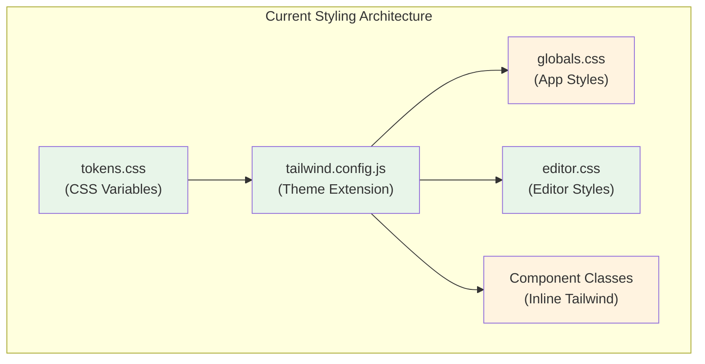
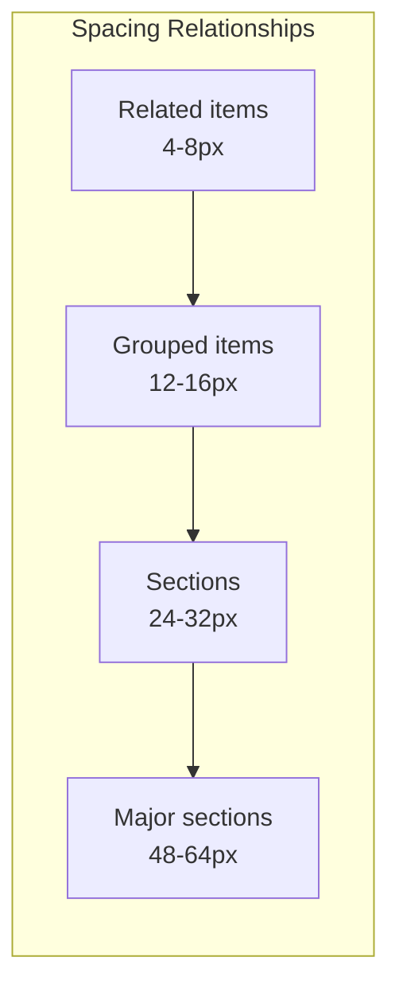
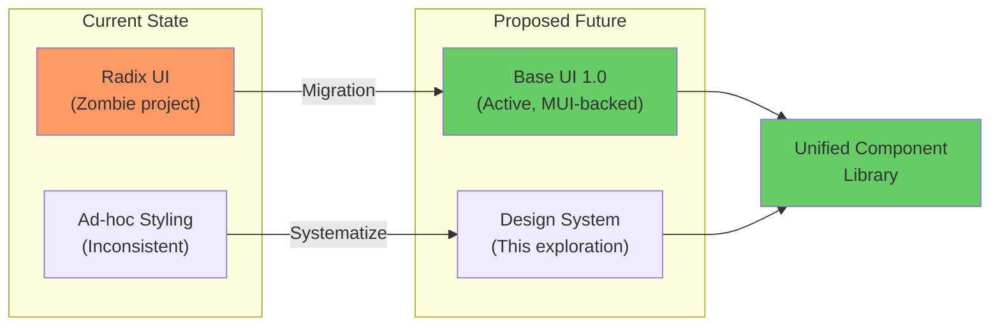
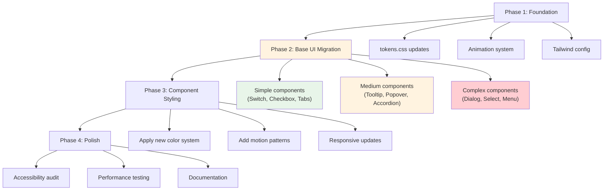

# UI Styling System: Clean, Minimal, Timeless Design

> **Date**: February 2026
> **Status**: Exploration
> **Goal**: Define a comprehensive styling system for xNet that feels timeless, minimal, and beautiful in both light and dark modes, with a focus on interaction quality, animations, and responsive design.

---

## Executive Summary

xNet's UI should feel like a precision instrument — every interaction deliberate, every transition smooth, every pixel intentional. This exploration defines a styling philosophy and concrete implementation plan that prioritizes:

1. **Interaction over decoration** — animations that communicate, not distract
2. **Timeless minimalism** — clean lines, generous whitespace, restrained color
3. **Performance as a feature** — 60fps animations, instant feedback, no jank
4. **Adaptive beauty** — equally stunning in light and dark modes
5. **Mobile-first responsiveness** — touch-friendly, thumb-reachable, gesture-aware

The goal is to create a UI that feels like Linear meets Notion meets Apple Notes — professional, calm, and effortlessly usable.

---

## Table of Contents

1. [Design Philosophy](#1-design-philosophy)
2. [Current State Analysis](#2-current-state-analysis)
3. [Color System](#3-color-system)
4. [Typography](#4-typography)
5. [Spacing & Layout](#5-spacing--layout)
6. [Animation & Motion](#6-animation--motion)
7. [Component Patterns](#7-component-patterns)
8. [Responsive Design](#8-responsive-design)
9. [Accessibility](#9-accessibility)
10. [Component Library Migration](#10-component-library-migration)
11. [Implementation Plan](#11-implementation-plan)
12. [Inspiration & References](#12-inspiration--references)

---

## 1. Design Philosophy

### Core Principles

```
┌─────────────────────────────────────────────────────────────────────────┐
│                         DESIGN PRINCIPLES                                │
├─────────────────────────────────────────────────────────────────────────┤
│                                                                          │
│   1. INVISIBLE DESIGN                                                    │
│      The best UI is one you don't notice.                               │
│      Content is the hero, not chrome.                                   │
│                                                                          │
│   2. MEANINGFUL MOTION                                                   │
│      Every animation serves a purpose:                                  │
│      - Confirms an action                                               │
│      - Guides attention                                                 │
│      - Maintains spatial context                                        │
│                                                                          │
│   3. RESTRAINED PALETTE                                                  │
│      Color is used sparingly:                                           │
│      - Primary action (one accent color)                                │
│      - Status (success/warning/error)                                   │
│      - Everything else is grayscale                                     │
│                                                                          │
│   4. GENEROUS WHITESPACE                                                 │
│      Breathing room is not wasted space.                                │
│      Density is a feature, not a goal.                                  │
│                                                                          │
│   5. INSTANT FEEDBACK                                                    │
│      Every interaction responds in <100ms.                              │
│      Optimistic updates, not loading spinners.                          │
│                                                                          │
└─────────────────────────────────────────────────────────────────────────┘
```

### What We're NOT Building

- **Not a dashboard** — no charts, metrics, or data-dense displays
- **Not a marketing site** — no hero sections, gradients, or flashy effects
- **Not a game** — no gamification, badges, or dopamine hooks
- **Not a social app** — no feeds, likes, or engagement metrics

### What We ARE Building

A **professional creative tool** for knowledge work:

- Writing and editing documents
- Organizing structured data
- Collaborating in real-time
- Building personal knowledge systems

Think: Ulysses, iA Writer, Bear, Things 3, Linear, Notion (at its best).

---

## 2. Current State Analysis

### What's Working

| Aspect                | Current State                 | Assessment      |
| --------------------- | ----------------------------- | --------------- |
| **Token system**      | CSS variables in `tokens.css` | Good foundation |
| **Dark mode**         | `.dark` class toggle          | Works well      |
| **Tailwind config**   | Shared base config            | Consistent      |
| **Component library** | `@xnet/ui` primitives         | Solid patterns  |
| **Editor styling**    | Dedicated `editor.css`        | Well-structured |

### What Needs Improvement

| Aspect                     | Issue                                 | Impact                    |
| -------------------------- | ------------------------------------- | ------------------------- |
| **Animation system**       | Only accordion animations defined     | Interactions feel static  |
| **Transition consistency** | Ad-hoc `transition-colors` everywhere | Inconsistent feel         |
| **Spacing scale**          | Default Tailwind scale                | Not optimized for our use |
| **Focus states**           | Basic ring styles                     | Could be more refined     |
| **Loading states**         | Spinner only                          | Need skeleton, shimmer    |
| **Mobile optimization**    | Desktop-first patterns                | Touch targets too small   |
| **Color harmony**          | Functional but not beautiful          | Needs refinement          |

### Architecture Diagram



---

## 3. Color System

### Philosophy: Monochrome + One Accent

The most timeless interfaces use minimal color. Our palette should be:

- **90% grayscale** — backgrounds, text, borders
- **8% primary accent** — interactive elements, links, focus
- **2% semantic colors** — success, warning, error (used sparingly)

### Proposed Light Mode Palette

```css
:root {
  /* ─── Backgrounds ─────────────────────────────────────────── */
  --background: 0 0% 100%; /* Pure white */
  --background-subtle: 0 0% 98%; /* Off-white for cards */
  --background-muted: 0 0% 96%; /* Hover states */
  --background-emphasis: 0 0% 94%; /* Active states */

  /* ─── Foregrounds ─────────────────────────────────────────── */
  --foreground: 0 0% 9%; /* Primary text */
  --foreground-muted: 0 0% 45%; /* Secondary text */
  --foreground-subtle: 0 0% 64%; /* Tertiary text */
  --foreground-faint: 0 0% 78%; /* Placeholder text */

  /* ─── Borders ─────────────────────────────────────────────── */
  --border: 0 0% 90%; /* Default borders */
  --border-muted: 0 0% 94%; /* Subtle borders */
  --border-emphasis: 0 0% 82%; /* Emphasized borders */

  /* ─── Primary (Blue) ──────────────────────────────────────── */
  --primary: 221 83% 53%; /* Interactive elements */
  --primary-hover: 221 83% 47%; /* Hover state */
  --primary-active: 221 83% 42%; /* Active/pressed state */
  --primary-muted: 221 83% 96%; /* Subtle backgrounds */
  --primary-foreground: 0 0% 100%; /* Text on primary */

  /* ─── Semantic ────────────────────────────────────────────── */
  --success: 142 71% 45%;
  --warning: 38 92% 50%;
  --destructive: 0 72% 51%;
}
```

### Proposed Dark Mode Palette

```css
.dark {
  /* ─── Backgrounds ─────────────────────────────────────────── */
  --background: 0 0% 7%; /* Near-black */
  --background-subtle: 0 0% 10%; /* Cards */
  --background-muted: 0 0% 13%; /* Hover states */
  --background-emphasis: 0 0% 16%; /* Active states */

  /* ─── Foregrounds ─────────────────────────────────────────── */
  --foreground: 0 0% 95%; /* Primary text */
  --foreground-muted: 0 0% 65%; /* Secondary text */
  --foreground-subtle: 0 0% 50%; /* Tertiary text */
  --foreground-faint: 0 0% 35%; /* Placeholder text */

  /* ─── Borders ─────────────────────────────────────────────── */
  --border: 0 0% 18%; /* Default borders */
  --border-muted: 0 0% 14%; /* Subtle borders */
  --border-emphasis: 0 0% 25%; /* Emphasized borders */

  /* ─── Primary (Blue - slightly brighter for dark mode) ───── */
  --primary: 217 91% 60%;
  --primary-hover: 217 91% 65%;
  --primary-active: 217 91% 55%;
  --primary-muted: 217 91% 15%;
  --primary-foreground: 0 0% 100%;
}
```

### Color Usage Guidelines

```
┌─────────────────────────────────────────────────────────────────────────┐
│                         COLOR USAGE RULES                                │
├─────────────────────────────────────────────────────────────────────────┤
│                                                                          │
│   PRIMARY (Blue)                                                         │
│   ├── Buttons (primary action only)                                     │
│   ├── Links                                                              │
│   ├── Focus rings                                                        │
│   ├── Selected states                                                    │
│   └── Progress indicators                                                │
│                                                                          │
│   GRAYSCALE                                                              │
│   ├── All text                                                           │
│   ├── All backgrounds                                                    │
│   ├── All borders                                                        │
│   ├── Icons (unless interactive)                                         │
│   └── Dividers                                                           │
│                                                                          │
│   SEMANTIC (Use sparingly)                                               │
│   ├── Success: Completed actions, saved states                          │
│   ├── Warning: Caution, pending actions                                 │
│   └── Destructive: Delete, errors, destructive actions                  │
│                                                                          │
│   NEVER                                                                  │
│   ├── Gradients (except very subtle background effects)                 │
│   ├── Multiple accent colors                                            │
│   ├── Color as the only indicator (accessibility)                       │
│   └── Saturated backgrounds                                             │
│                                                                          │
└─────────────────────────────────────────────────────────────────────────┘
```

---

## 4. Typography

### Font Stack

```css
:root {
  /* System font stack - fast, native, familiar */
  --font-sans:
    ui-sans-serif, system-ui, -apple-system, BlinkMacSystemFont, 'Segoe UI', Roboto,
    'Helvetica Neue', Arial, sans-serif;

  /* Monospace for code */
  --font-mono:
    ui-monospace, SFMono-Regular, 'SF Mono', Menlo, Monaco, Consolas, 'Liberation Mono',
    'Courier New', monospace;
}
```

### Type Scale

A harmonious scale based on a 1.25 ratio (major third):

| Name        | Size | Line Height | Weight | Use Case               |
| ----------- | ---- | ----------- | ------ | ---------------------- |
| `text-xs`   | 11px | 1.5         | 400    | Captions, badges       |
| `text-sm`   | 13px | 1.5         | 400    | Secondary text, labels |
| `text-base` | 15px | 1.6         | 400    | Body text              |
| `text-lg`   | 17px | 1.5         | 500    | Subheadings            |
| `text-xl`   | 20px | 1.4         | 600    | Section headings       |
| `text-2xl`  | 24px | 1.3         | 600    | Page titles            |
| `text-3xl`  | 30px | 1.2         | 700    | Hero text              |

### Typography Rules

```
┌─────────────────────────────────────────────────────────────────────────┐
│                         TYPOGRAPHY RULES                                 │
├─────────────────────────────────────────────────────────────────────────┤
│                                                                          │
│   LINE LENGTH                                                            │
│   └── Max 65-75 characters for body text (max-w-prose)                  │
│                                                                          │
│   HIERARCHY                                                              │
│   ├── Size difference between levels: at least 2px                      │
│   ├── Weight difference: 100-200 (e.g., 400 → 600)                      │
│   └── Color difference: foreground → foreground-muted                   │
│                                                                          │
│   SPACING                                                                │
│   ├── Headings: margin-top > margin-bottom (pull content up)            │
│   ├── Paragraphs: 1.5em margin-bottom                                   │
│   └── Lists: 0.5em between items                                        │
│                                                                          │
│   ALIGNMENT                                                              │
│   ├── Left-align everything (no justified text)                         │
│   ├── Center only for short UI labels                                   │
│   └── Right-align only for numbers in tables                            │
│                                                                          │
└─────────────────────────────────────────────────────────────────────────┘
```

---

## 5. Spacing & Layout

### Spacing Scale

A custom scale optimized for UI density:

```css
@theme {
  --spacing-0: 0;
  --spacing-px: 1px;
  --spacing-0.5: 2px;
  --spacing-1: 4px;
  --spacing-1.5: 6px;
  --spacing-2: 8px;
  --spacing-2.5: 10px;
  --spacing-3: 12px;
  --spacing-4: 16px;
  --spacing-5: 20px;
  --spacing-6: 24px;
  --spacing-8: 32px;
  --spacing-10: 40px;
  --spacing-12: 48px;
  --spacing-16: 64px;
  --spacing-20: 80px;
  --spacing-24: 96px;
}
```

### Layout Principles



### Component Spacing

| Component    | Internal Padding | Gap Between Items | Margin |
| ------------ | ---------------- | ----------------- | ------ |
| Button       | 8px 16px         | 8px               | 0      |
| Input        | 8px 12px         | -                 | 0      |
| Card         | 16px             | 12px              | 0      |
| Modal        | 24px             | 16px              | -      |
| Sidebar item | 8px 12px         | 2px               | 0      |
| Table cell   | 8px 12px         | -                 | 0      |
| List item    | 8px 0            | 0                 | 0      |

### Border Radius Scale

```css
@theme {
  --radius-none: 0;
  --radius-sm: 4px; /* Buttons, inputs, badges */
  --radius-md: 6px; /* Cards, dropdowns */
  --radius-lg: 8px; /* Modals, large cards */
  --radius-xl: 12px; /* Panels, sheets */
  --radius-full: 9999px; /* Pills, avatars */
}
```

---

## 6. Animation & Motion

### Animation Philosophy

```
┌─────────────────────────────────────────────────────────────────────────┐
│                         MOTION PRINCIPLES                                │
├─────────────────────────────────────────────────────────────────────────┤
│                                                                          │
│   1. FAST BY DEFAULT                                                     │
│      ├── Micro-interactions: 100-150ms                                  │
│      ├── State changes: 150-200ms                                       │
│      ├── Page transitions: 200-300ms                                    │
│      └── Complex animations: 300-400ms max                              │
│                                                                          │
│   2. PURPOSEFUL                                                          │
│      ├── Confirm: "Your action was received"                            │
│      ├── Guide: "Look here next"                                        │
│      ├── Connect: "These things are related"                            │
│      └── Delight: Sparingly, for moments of joy                         │
│                                                                          │
│   3. PHYSICS-BASED                                                       │
│      ├── Use ease-out for entrances (decelerating)                      │
│      ├── Use ease-in for exits (accelerating away)                      │
│      ├── Use ease-in-out for state changes                              │
│      └── Never use linear (feels robotic)                               │
│                                                                          │
│   4. RESPECT PREFERENCES                                                 │
│      └── Honor prefers-reduced-motion                                   │
│                                                                          │
└─────────────────────────────────────────────────────────────────────────┘
```

### Easing Functions

```css
@theme {
  /* Standard easings */
  --ease-in: cubic-bezier(0.4, 0, 1, 1);
  --ease-out: cubic-bezier(0, 0, 0.2, 1);
  --ease-in-out: cubic-bezier(0.4, 0, 0.2, 1);

  /* Spring-like easings for more natural feel */
  --ease-spring: cubic-bezier(0.34, 1.56, 0.64, 1);
  --ease-bounce: cubic-bezier(0.68, -0.55, 0.265, 1.55);

  /* Subtle easing for micro-interactions */
  --ease-subtle: cubic-bezier(0.25, 0.1, 0.25, 1);
}
```

### Duration Scale

```css
@theme {
  --duration-instant: 0ms;
  --duration-fast: 100ms;
  --duration-normal: 150ms;
  --duration-slow: 200ms;
  --duration-slower: 300ms;
  --duration-slowest: 400ms;
}
```

### Animation Keyframes

```css
@theme {
  /* Fade in */
  @keyframes fade-in {
    from {
      opacity: 0;
    }
    to {
      opacity: 1;
    }
  }
  --animate-fade-in: fade-in 150ms var(--ease-out);

  /* Fade out */
  @keyframes fade-out {
    from {
      opacity: 1;
    }
    to {
      opacity: 0;
    }
  }
  --animate-fade-out: fade-out 100ms var(--ease-in);

  /* Scale in (for modals, popovers) */
  @keyframes scale-in {
    from {
      opacity: 0;
      transform: scale(0.95);
    }
    to {
      opacity: 1;
      transform: scale(1);
    }
  }
  --animate-scale-in: scale-in 150ms var(--ease-out);

  /* Slide in from bottom (for sheets, toasts) */
  @keyframes slide-in-bottom {
    from {
      opacity: 0;
      transform: translateY(8px);
    }
    to {
      opacity: 1;
      transform: translateY(0);
    }
  }
  --animate-slide-in-bottom: slide-in-bottom 200ms var(--ease-out);

  /* Slide in from right (for sidebars) */
  @keyframes slide-in-right {
    from {
      opacity: 0;
      transform: translateX(16px);
    }
    to {
      opacity: 1;
      transform: translateX(0);
    }
  }
  --animate-slide-in-right: slide-in-right 200ms var(--ease-out);

  /* Subtle pulse (for focus, attention) */
  @keyframes pulse-subtle {
    0%,
    100% {
      opacity: 1;
    }
    50% {
      opacity: 0.7;
    }
  }
  --animate-pulse-subtle: pulse-subtle 2s var(--ease-in-out) infinite;

  /* Skeleton shimmer */
  @keyframes shimmer {
    0% {
      background-position: -200% 0;
    }
    100% {
      background-position: 200% 0;
    }
  }
  --animate-shimmer: shimmer 1.5s linear infinite;
}
```

### Transition Utilities

```css
/* Base transition class */
.transition-base {
  transition-property: color, background-color, border-color, opacity, box-shadow, transform;
  transition-duration: var(--duration-normal);
  transition-timing-function: var(--ease-out);
}

/* Fast transitions for micro-interactions */
.transition-fast {
  transition-duration: var(--duration-fast);
}

/* Slow transitions for emphasis */
.transition-slow {
  transition-duration: var(--duration-slow);
}

/* Transform-only transitions (GPU accelerated) */
.transition-transform {
  transition-property: transform, opacity;
  transition-duration: var(--duration-normal);
  transition-timing-function: var(--ease-out);
}
```

### Reduced Motion Support

```css
@media (prefers-reduced-motion: reduce) {
  *,
  *::before,
  *::after {
    animation-duration: 0.01ms !important;
    animation-iteration-count: 1 !important;
    transition-duration: 0.01ms !important;
    scroll-behavior: auto !important;
  }
}
```

---

## 7. Component Patterns

### Button States

```mermaid
stateDiagram-v2
    [*] --> Default
    Default --> Hover: mouse enter
    Hover --> Default: mouse leave
    Hover --> Active: mouse down
    Active --> Hover: mouse up
    Default --> Focus: tab
    Focus --> Default: blur
    Focus --> Active: enter/space
    Default --> Disabled: disabled prop
    Disabled --> [*]
```

### Button Styling

```tsx
const buttonVariants = cva(
  // Base styles
  `inline-flex items-center justify-center gap-2 
   rounded-md text-sm font-medium
   transition-base
   focus-visible:outline-none focus-visible:ring-2 
   focus-visible:ring-primary focus-visible:ring-offset-2
   disabled:pointer-events-none disabled:opacity-50`,
  {
    variants: {
      variant: {
        // Primary: solid blue
        default: `bg-primary text-primary-foreground 
                  hover:bg-primary-hover active:bg-primary-active
                  shadow-sm`,

        // Secondary: subtle gray
        secondary: `bg-background-muted text-foreground
                    hover:bg-background-emphasis active:bg-border
                    border border-border`,

        // Ghost: transparent until hover
        ghost: `text-foreground-muted
                hover:bg-background-muted hover:text-foreground
                active:bg-background-emphasis`,

        // Destructive: red for dangerous actions
        destructive: `bg-destructive text-white
                      hover:bg-destructive/90 active:bg-destructive/80
                      shadow-sm`,

        // Link: text-only with underline
        link: `text-primary underline-offset-4
               hover:underline active:text-primary-active`
      },
      size: {
        sm: 'h-8 px-3 text-xs',
        default: 'h-9 px-4',
        lg: 'h-10 px-6',
        icon: 'h-9 w-9'
      }
    }
  }
)
```

### Input Styling

```tsx
const inputStyles = `
  flex h-9 w-full rounded-md 
  border border-border bg-transparent 
  px-3 py-1 text-sm
  transition-base
  placeholder:text-foreground-faint
  focus-visible:outline-none 
  focus-visible:ring-2 focus-visible:ring-primary 
  focus-visible:border-primary
  disabled:cursor-not-allowed disabled:opacity-50
`
```

### Card Styling

```tsx
const cardStyles = `
  rounded-lg border border-border 
  bg-background-subtle
  shadow-sm
  transition-base
  hover:shadow-md hover:border-border-emphasis
`
```

### Sidebar Item Styling

```tsx
const sidebarItemStyles = `
  flex items-center gap-2 
  px-3 py-2 rounded-md
  text-sm text-foreground-muted
  transition-base
  hover:bg-background-muted hover:text-foreground
  
  /* Active state */
  data-[active=true]:bg-primary-muted 
  data-[active=true]:text-primary
  data-[active=true]:font-medium
`
```

### Table Styling

```tsx
const tableStyles = {
  table: 'w-full border-collapse text-sm',
  header: `
    sticky top-0 z-10
    bg-background-subtle
    border-b border-border
  `,
  headerCell: `
    px-3 py-2 text-left
    text-xs font-medium text-foreground-muted
    uppercase tracking-wider
  `,
  row: `
    border-b border-border-muted
    transition-base
    hover:bg-background-muted
  `,
  cell: `
    px-3 py-2
    text-foreground
  `
}
```

---

## 8. Responsive Design

### Breakpoint System

```css
@theme {
  --breakpoint-sm: 640px; /* Large phones */
  --breakpoint-md: 768px; /* Tablets */
  --breakpoint-lg: 1024px; /* Laptops */
  --breakpoint-xl: 1280px; /* Desktops */
  --breakpoint-2xl: 1536px; /* Large desktops */
}
```

### Mobile-First Patterns

```
┌─────────────────────────────────────────────────────────────────────────┐
│                         RESPONSIVE PATTERNS                              │
├─────────────────────────────────────────────────────────────────────────┤
│                                                                          │
│   TOUCH TARGETS                                                          │
│   ├── Minimum: 44x44px (Apple HIG)                                      │
│   ├── Comfortable: 48x48px                                              │
│   └── Generous: 56x56px (for primary actions)                           │
│                                                                          │
│   SIDEBAR                                                                │
│   ├── Mobile: Hidden, slide-in sheet                                    │
│   ├── Tablet: Collapsible (icons only)                                  │
│   └── Desktop: Always visible                                           │
│                                                                          │
│   NAVIGATION                                                             │
│   ├── Mobile: Bottom tab bar                                            │
│   ├── Tablet: Top header + hamburger                                    │
│   └── Desktop: Top header + sidebar                                     │
│                                                                          │
│   TABLES                                                                 │
│   ├── Mobile: Card layout or horizontal scroll                          │
│   ├── Tablet: Condensed columns                                         │
│   └── Desktop: Full table                                               │
│                                                                          │
│   MODALS                                                                 │
│   ├── Mobile: Full-screen sheet                                         │
│   ├── Tablet: Centered modal (80% width)                                │
│   └── Desktop: Centered modal (max-width)                               │
│                                                                          │
└─────────────────────────────────────────────────────────────────────────┘
```

### Responsive Component Example

```tsx
// Sidebar responsive behavior
function Sidebar() {
  return (
    <>
      {/* Mobile: Sheet triggered by hamburger */}
      <Sheet className="md:hidden">
        <SheetTrigger asChild>
          <Button variant="ghost" size="icon">
            <Menu />
          </Button>
        </SheetTrigger>
        <SheetContent side="left">
          <SidebarContent />
        </SheetContent>
      </Sheet>

      {/* Tablet: Collapsible sidebar */}
      <aside className="hidden md:flex lg:hidden w-16 flex-col">
        <CollapsedSidebarContent />
      </aside>

      {/* Desktop: Full sidebar */}
      <aside className="hidden lg:flex w-64 flex-col">
        <SidebarContent />
      </aside>
    </>
  )
}
```

### Container Widths

```css
.container {
  width: 100%;
  margin-left: auto;
  margin-right: auto;
  padding-left: 1rem;
  padding-right: 1rem;
}

@media (min-width: 640px) {
  .container {
    max-width: 640px;
    padding: 0 1.5rem;
  }
}

@media (min-width: 768px) {
  .container {
    max-width: 768px;
  }
}

@media (min-width: 1024px) {
  .container {
    max-width: 1024px;
    padding: 0 2rem;
  }
}

@media (min-width: 1280px) {
  .container {
    max-width: 1280px;
  }
}
```

---

## 9. Accessibility

### Focus Management

```css
/* Visible focus for keyboard users */
:focus-visible {
  outline: 2px solid hsl(var(--primary));
  outline-offset: 2px;
}

/* Remove focus ring for mouse users */
:focus:not(:focus-visible) {
  outline: none;
}

/* Skip link for keyboard navigation */
.skip-link {
  position: absolute;
  top: -40px;
  left: 0;
  padding: 8px 16px;
  background: hsl(var(--primary));
  color: white;
  z-index: 100;
  transition: top 0.2s;
}

.skip-link:focus {
  top: 0;
}
```

### Color Contrast

| Element            | Minimum Ratio | Target Ratio |
| ------------------ | ------------- | ------------ |
| Body text          | 4.5:1         | 7:1          |
| Large text (18px+) | 3:1           | 4.5:1        |
| UI components      | 3:1           | 4.5:1        |
| Decorative         | N/A           | N/A          |

### ARIA Patterns

```tsx
// Loading state
<Button disabled aria-busy="true">
  <Spinner aria-hidden="true" />
  <span>Saving...</span>
</Button>

// Error state
<Input
  aria-invalid="true"
  aria-describedby="email-error"
/>
<span id="email-error" role="alert">
  Please enter a valid email
</span>

// Live regions for updates
<div aria-live="polite" aria-atomic="true">
  {notification}
</div>
```

### High Contrast Mode

```css
@media (prefers-contrast: high) {
  :root {
    --border: 0 0% 0%;
    --foreground-muted: 0 0% 20%;
  }

  .dark {
    --border: 0 0% 100%;
    --foreground-muted: 0 0% 80%;
  }

  button,
  input,
  select {
    border-width: 2px;
  }
}
```

---

## 10. Component Library Migration

### Related Exploration

See **[0034_RADIX_TO_BASE_UI_MIGRATION.md](./0034_RADIX_TO_BASE_UI_MIGRATION.md)** for a detailed analysis of our current Radix UI dependency and the case for migrating to Base UI.

### The Opportunity: Combine Styling Refresh with Base UI Migration

The timing is right to consider migrating from Radix UI to Base UI as part of this styling overhaul. Here's why:



### Why Migrate Now?

| Factor          | Radix UI                              | Base UI                                  | Impact                       |
| --------------- | ------------------------------------- | ---------------------------------------- | ---------------------------- |
| **Maintenance** | Near-zero commits, 600+ open issues   | Active development, MUI-backed           | Critical                     |
| **Animation**   | Basic, manual state tracking          | Built-in transition data attributes      | Aligns with our motion goals |
| **API**         | `asChild` + deprecated `cloneElement` | Modern `render` prop pattern             | Cleaner code                 |
| **React 19**    | Partial support                       | Full support                             | Future-proof                 |
| **Team**        | Original team left                    | Radix co-creator (Colm Tuite) now at MUI | Continuity                   |

### Migration Synergies

Doing both the styling refresh and Base UI migration together offers several advantages:

1. **Single disruption** — Touch each component once, not twice
2. **Animation alignment** — Base UI's built-in transition support matches our motion system
3. **Cleaner abstractions** — Build our design tokens directly into Base UI components
4. **Fresh start** — No legacy Radix workarounds to maintain

### Recommended Approach



### Component Migration Priority

Based on the analysis in exploration 0034, here's the recommended migration order:

| Priority           | Components                        | Risk   | Notes                     |
| ------------------ | --------------------------------- | ------ | ------------------------- |
| **1. Quick wins**  | Separator, Switch, Checkbox       | Low    | Similar APIs, easy swap   |
| **2. Low risk**    | Tabs, Accordion, Collapsible      | Low    | Minor API differences     |
| **3. Medium risk** | Tooltip, Popover, ScrollArea      | Medium | Some behavior differences |
| **4. High risk**   | Dialog/Modal, Select, Menu, Sheet | High   | Significant API changes   |
| **5. Special**     | Command (cmdk)                    | Medium | May need alternative      |

### Base UI Animation Benefits

Base UI provides built-in data attributes for animation states, which aligns perfectly with our motion system:

```tsx
// Base UI provides these data attributes automatically:
// [data-starting] - Element is entering
// [data-ending] - Element is exiting
// [data-open] - Element is open
// [data-closed] - Element is closed

// Our CSS can hook into these:
.dialog-content {
  &[data-starting] {
    animation: var(--animate-scale-in);
  }

  &[data-ending] {
    animation: var(--animate-fade-out);
  }
}
```

### Decision: Proceed with Migration?

**Recommendation: Yes, proceed with combined migration.**

The original exploration (0034) recommended waiting 6 months (until Q3 2026). However, given that:

1. We're already planning a comprehensive styling overhaul
2. Base UI 1.0 has been stable since December 2025
3. shadcn/ui is actively adding Base UI support
4. The animation benefits directly support our motion goals

...it makes sense to **combine the efforts** rather than touch every component twice.

### Updated Timeline

| Week  | Focus           | Deliverables                               |
| ----- | --------------- | ------------------------------------------ |
| **1** | Foundation      | Tokens, animations, Tailwind config        |
| **2** | Base UI Setup   | Install Base UI, migrate simple components |
| **3** | Base UI Core    | Migrate medium-risk components             |
| **4** | Base UI Complex | Migrate Dialog, Select, Menu               |
| **5** | Styling         | Apply new design system to all components  |
| **6** | Polish          | Accessibility, performance, documentation  |

---

## 11. Implementation Plan

### Phase 1: Foundation (Week 1)

- [ ] Update `tokens.css` with new color system
- [ ] Add animation keyframes and easing functions
- [ ] Update `tailwind.config.js` with custom theme
- [ ] Create `motion.css` for animation utilities
- [ ] Add reduced motion support
- [ ] Install `@base-ui-components/react` alongside Radix

### Phase 2: Base UI Migration - Simple (Week 2)

- [ ] Migrate Separator (or replace with native `<hr>`)
- [ ] Migrate Switch component
- [ ] Migrate Checkbox component
- [ ] Migrate Tabs component
- [ ] Apply new styling to migrated components
- [ ] Update Button component with new variants (no Radix dependency)
- [ ] Update Input component with refined focus states

### Phase 3: Base UI Migration - Medium (Week 3)

- [ ] Migrate Accordion component
- [ ] Migrate Collapsible component
- [ ] Migrate Tooltip component
- [ ] Migrate Popover component
- [ ] Migrate ScrollArea component
- [ ] Add Skeleton component for loading states

### Phase 4: Base UI Migration - Complex (Week 4)

- [ ] Migrate Dialog/Modal component
- [ ] Migrate Sheet component
- [ ] Migrate Select component
- [ ] Migrate DropdownMenu → Menu component
- [ ] Evaluate Command palette (cmdk) alternatives or keep as-is

### Phase 5: Layout & Responsive (Week 5)

- [ ] Refactor Sidebar with responsive behavior
- [ ] Add mobile navigation (bottom tabs)
- [ ] Update table views for mobile
- [ ] Add container utilities
- [ ] Test on real devices

### Phase 6: Polish (Week 6)

- [ ] Remove all Radix UI dependencies
- [ ] Audit all components for consistency
- [ ] Add micro-interactions (hover, focus, active)
- [ ] Performance testing (60fps animations)
- [ ] Accessibility audit (WCAG 2.1 AA)
- [ ] Documentation

### Checklist: Component Audit

| Component | Colors | Typography | Spacing | Animation | Mobile | A11y |
| --------- | ------ | ---------- | ------- | --------- | ------ | ---- |
| Button    | [ ]    | [ ]        | [ ]     | [ ]       | [ ]    | [ ]  |
| Input     | [ ]    | [ ]        | [ ]     | [ ]       | [ ]    | [ ]  |
| Select    | [ ]    | [ ]        | [ ]     | [ ]       | [ ]    | [ ]  |
| Checkbox  | [ ]    | [ ]        | [ ]     | [ ]       | [ ]    | [ ]  |
| Switch    | [ ]    | [ ]        | [ ]     | [ ]       | [ ]    | [ ]  |
| Modal     | [ ]    | [ ]        | [ ]     | [ ]       | [ ]    | [ ]  |
| Sheet     | [ ]    | [ ]        | [ ]     | [ ]       | [ ]    | [ ]  |
| Popover   | [ ]    | [ ]        | [ ]     | [ ]       | [ ]    | [ ]  |
| Tooltip   | [ ]    | [ ]        | [ ]     | [ ]       | [ ]    | [ ]  |
| Tabs      | [ ]    | [ ]        | [ ]     | [ ]       | [ ]    | [ ]  |
| Accordion | [ ]    | [ ]        | [ ]     | [ ]       | [ ]    | [ ]  |
| Table     | [ ]    | [ ]        | [ ]     | [ ]       | [ ]    | [ ]  |
| Card      | [ ]    | [ ]        | [ ]     | [ ]       | [ ]    | [ ]  |
| Badge     | [ ]    | [ ]        | [ ]     | [ ]       | [ ]    | [ ]  |
| Sidebar   | [ ]    | [ ]        | [ ]     | [ ]       | [ ]    | [ ]  |
| Command   | [ ]    | [ ]        | [ ]     | [ ]       | [ ]    | [ ]  |

---

## 12. Inspiration & References

### Apps to Study

| App             | What to Learn                                         |
| --------------- | ----------------------------------------------------- |
| **Linear**      | Animation timing, keyboard shortcuts, command palette |
| **Notion**      | Block-based editing, database views, sidebar          |
| **Things 3**    | Minimalism, focus states, gesture interactions        |
| **Bear**        | Typography, markdown rendering, tag system            |
| **iA Writer**   | Focus mode, typography, distraction-free              |
| **Figma**       | Canvas interactions, collaboration cursors, panels    |
| **Raycast**     | Command palette, keyboard-first, speed                |
| **Arc**         | Sidebar, spaces, innovative navigation                |
| **Apple Notes** | Simplicity, native feel, quick capture                |
| **Craft**       | Block editing, beautiful typography, cards            |

### Design Systems to Reference

| System        | URL                        | What to Learn                    |
| ------------- | -------------------------- | -------------------------------- |
| Radix Themes  | radix-ui.com/themes        | Color scales, component patterns |
| Shadcn/ui     | ui.shadcn.com              | Tailwind patterns, accessibility |
| Vercel Design | vercel.com/design          | Minimalism, dark mode            |
| Linear Design | linear.app/design          | Motion, keyboard UX              |
| Apple HIG     | developer.apple.com/design | Touch targets, gestures          |

### Key Metrics to Track

| Metric                  | Target      | How to Measure              |
| ----------------------- | ----------- | --------------------------- |
| Animation FPS           | 60fps       | Chrome DevTools Performance |
| First Input Delay       | <100ms      | Lighthouse                  |
| Cumulative Layout Shift | <0.1        | Lighthouse                  |
| Touch target size       | 44x44px min | Manual audit                |
| Color contrast          | 4.5:1 min   | axe DevTools                |
| Focus visible           | 100%        | Manual keyboard testing     |

---

## Summary

This exploration defines a comprehensive styling system for xNet that prioritizes:

1. **Timeless aesthetics** — monochrome + one accent, generous whitespace
2. **Meaningful motion** — fast, purposeful animations that communicate
3. **Mobile-first** — touch-friendly, responsive, gesture-aware
4. **Accessibility** — WCAG 2.1 AA, reduced motion, high contrast
5. **Performance** — 60fps animations, instant feedback
6. **Modern foundations** — Base UI migration for active maintenance and better animation support

The implementation is phased over **6 weeks**, combining the styling refresh with a migration from Radix UI to Base UI:

- **Weeks 1-4**: Foundation + Base UI migration (simple → complex components)
- **Week 5**: Layout and responsive design
- **Week 6**: Polish, accessibility audit, and documentation

This combined approach ensures we touch each component only once, resulting in a cohesive, maintainable design system built on actively-maintained primitives.

The goal is a UI that feels like a precision instrument — invisible when you're working, delightful when you notice it.

---

## Next Steps

1. **Review this exploration** with stakeholders
2. **Decide on Base UI migration** — proceed now or defer (recommendation: proceed)
3. **Create a Figma prototype** of key components with new styling
4. **Implement Phase 1** (tokens, animations, Tailwind config, Base UI setup)
5. **Prototype one Base UI component** (Switch or Checkbox) to validate approach
6. **Test on real devices** before proceeding to Phase 2
7. **Document patterns** in a living style guide

### Related Documents

- **[0034_RADIX_TO_BASE_UI_MIGRATION.md](./0034_RADIX_TO_BASE_UI_MIGRATION.md)** — Detailed analysis of Radix vs Base UI
- **[0045_LANDING_PAGE_REDESIGN.md](./0045_LANDING_PAGE_REDESIGN.md)** — Landing page design direction (shares visual philosophy)
