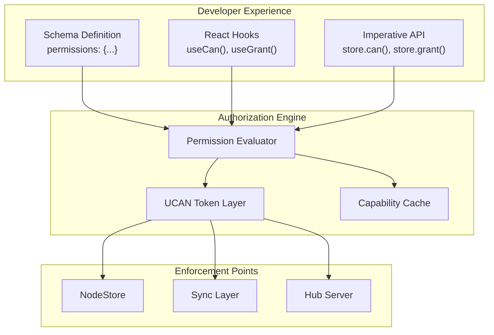
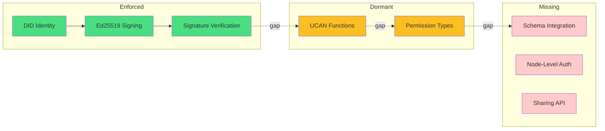
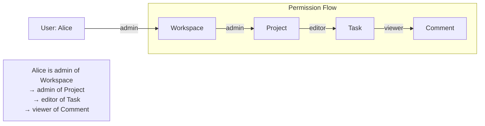
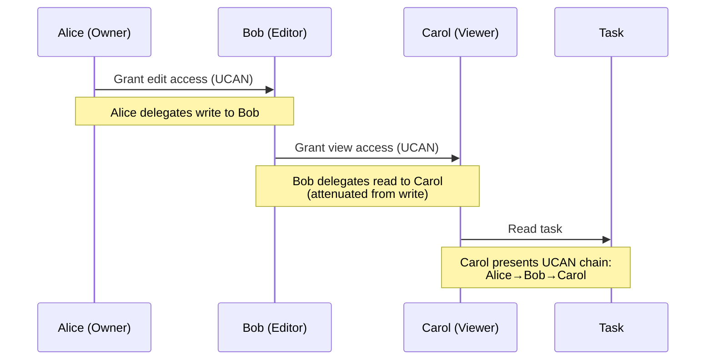
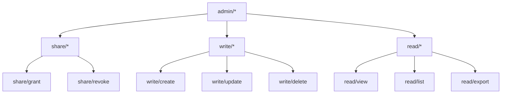
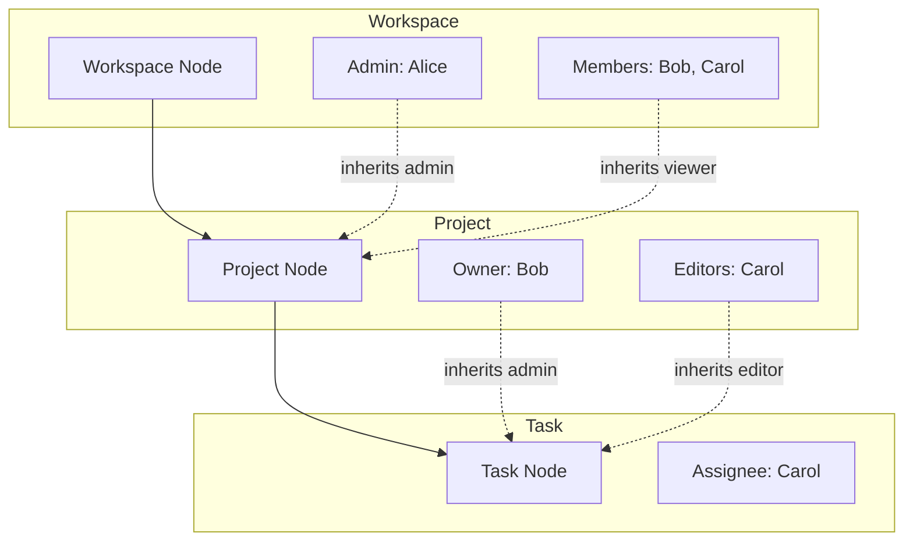
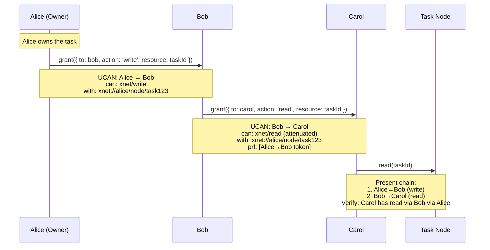
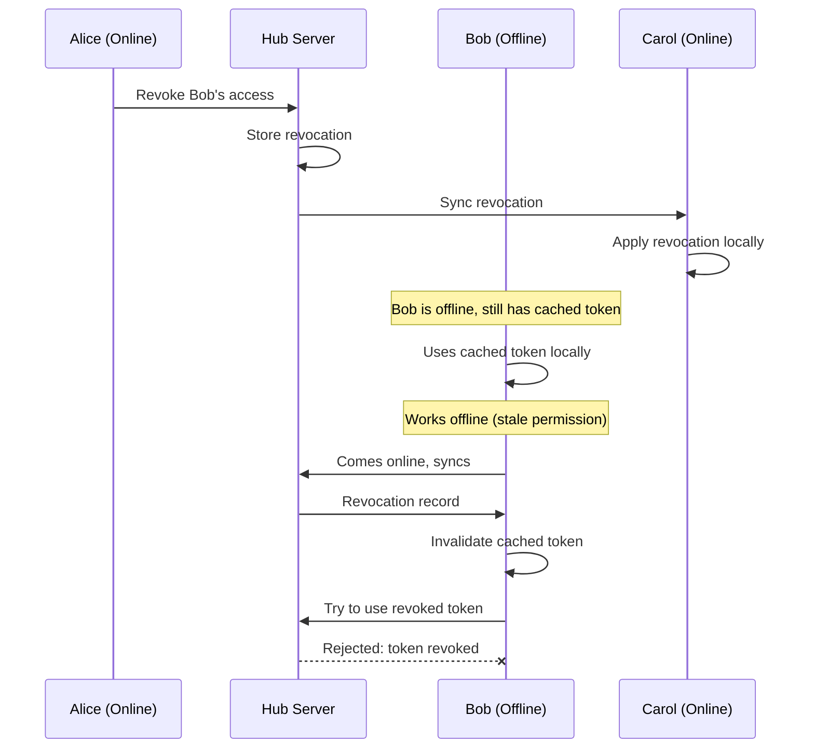

# Authorization API Design: A Unified, Schema-Integrated Permission System

> Deep exploration of how to transform xNet's dormant UCAN infrastructure into a powerful, developer-friendly authorization API that integrates naturally with schemas, nodes, and relationships.

**Date**: February 2026
**Status**: Exploration

## Executive Summary

xNet has UCAN token functions that work but are never called. This exploration designs a **unified authorization API** that:

- Integrates permissions directly into the **schema system** (declarative, type-safe)
- Enforces authorization at the **node and relationship level** (not just hub access)
- Provides a **simple, intuitive API** for developers (no UCAN knowledge required)
- Supports **delegation chains** for sharing and collaboration
- Works **offline-first** with eventual consistency
- Draws inspiration from **ElectricSQL**, **SpiceDB/Zanzibar**, and **UCAN best practices**



## Current State Analysis

### What Exists Today

**Layer 1: DID:key Identity (Fully Implemented, Enforced)**

- Every user has an Ed25519 keypair → `did:key:z6Mk...` identity
- Every `Change<NodePayload>` is signed and verified
- Every Yjs update is wrapped in a signed envelope
- **This layer works and is enforced at runtime**

**Layer 2: UCAN Token Functions (Implemented, Never Called)**

```typescript
// These functions exist in @xnet/identity
createUCAN({ issuer, issuerKey, audience, capabilities, expiration })
verifyUCAN(token)
hasCapability(token, resource, action)

// But NO code path ever calls them at runtime
```

**Layer 3: Permission Types (Defined, No Implementation)**

```typescript
// Types exist in @xnet/core but have zero consumers
interface PermissionEvaluator {
  hasCapability(did: DID, action: string, resource: string): boolean
  resolveGroups(did: DID): Group[]
  getPermissions(resource: string): PermissionGrant[]
}
```

### Current Reality



## Landscape Analysis

### ElectricSQL Approach

ElectricSQL uses **HTTP-level authorization** with proxy patterns:

```typescript
// ElectricSQL: Shapes are resources, auth is HTTP middleware
const stream = new ShapeStream({
  url: '/api/shapes/users',
  headers: { Authorization: `Bearer ${token}` }
})

// Server-side proxy sets WHERE clauses based on auth
originUrl.searchParams.set('where', `org_id = '${user.org_id}'`)
```

**Strengths:**

- Simple mental model (HTTP auth)
- Works with existing auth systems (Auth0, etc.)
- Server-side enforcement

**Weaknesses:**

- Requires online server for auth
- No delegation/sharing model
- No schema integration

### SpiceDB/Zanzibar Approach

SpiceDB uses a **relationship-based access control** (ReBAC) model:

```
// SpiceDB schema language
definition document {
  relation owner: user
  relation reader: user | group#member

  permission edit = owner
  permission view = reader + owner
}

// Relationships are tuples
document:budget#owner@user:alice
document:budget#reader@group:finance#member
```

**Strengths:**

- Powerful relationship-based model
- Composable permissions
- Centralized policy management

**Weaknesses:**

- Requires central SpiceDB server
- Separate schema language
- Not local-first

### UCAN Approach

UCAN provides **decentralized, delegable capabilities**:

```typescript
// UCAN capability
{ with: 'xnet://did:key:z.../page/123', can: 'xnet/write' }

// Delegation chain
Alice → Bob → Carol (each attenuating capabilities)
```

**Strengths:**

- Fully decentralized
- Offline-capable
- Cryptographically verifiable
- Supports delegation

**Weaknesses:**

- Complex mental model
- No built-in schema integration
- Revocation requires coordination

## Design Principles

### 1. Schema-First Authorization

Permissions should be declared in schemas, not scattered across code:

```typescript
// BAD: Imperative checks everywhere
if (user.role === 'admin' || node.createdBy === user.did) {
  // allow edit
}

// GOOD: Declarative in schema
const TaskSchema = defineSchema({
  name: 'Task',
  permissions: {
    read: 'anyone',
    write: 'owner | assignee | parent.admin',
    delete: 'owner | parent.admin'
  }
})
```

### 2. Relationship-Aware

Permissions should flow through the graph:



### 3. Delegation-Native

Sharing should create UCAN delegation chains:



### 4. Offline-First

Authorization must work without network:

- Cached capability tokens
- Local permission evaluation
- Eventual consistency for revocations

### 5. Developer-Friendly

Simple API that hides UCAN complexity:

```typescript
// Check permission
const canEdit = await store.can('write', taskId)

// Grant access
await store.grant(bobDid, 'write', taskId, { expiresIn: '7d' })

// React hook
const { canEdit, canDelete } = useCan(taskId)
```

## Proposed Architecture

### Schema-Level Permissions

```typescript
const TaskSchema = defineSchema({
  name: 'Task',
  namespace: 'xnet://xnet.fyi/',
  properties: {
    title: text({ required: true }),
    status: select({ options: ['todo', 'doing', 'done'] }),
    assignee: person(),
    project: relation({ target: 'xnet://xnet.fyi/Project' })
  },

  // NEW: Permission declarations
  permissions: {
    // Built-in roles
    read: 'viewer | editor | admin | owner',
    write: 'editor | admin | owner',
    delete: 'admin | owner',
    share: 'admin | owner',

    // Custom permissions
    assign: 'editor | admin | owner',
    complete: 'assignee | editor | admin | owner'
  },

  // NEW: Role definitions (who has each role)
  roles: {
    owner: 'createdBy', // Node creator
    assignee: 'properties.assignee', // Person property
    editor: 'project->editor', // Inherited from relation
    admin: 'project->admin', // Inherited from relation
    viewer: 'project->viewer | public' // Inherited or public
  }
})
```

### Permission Expression Language

A simple DSL for expressing permission rules:

```
// Literals
'owner'                     // Has owner role
'public'                    // Anyone (no auth required)
'authenticated'             // Any authenticated user

// Operators
'owner | editor'            // OR: owner or editor
'editor & verified'         // AND: editor and verified
'!banned'                   // NOT: not banned

// Property references
'createdBy'                 // Node's createdBy field
'properties.assignee'       // Person property value
'properties.team[]'         // Multi-person property (any match)

// Relation traversal
'project->admin'            // Admin of related project
'parent->owner'             // Owner of parent node
'workspace->members[]'      // Any member of workspace

// Wildcards
'*->admin'                  // Admin of any related node
```

### Permission Evaluation Flow

```mermaid
flowchart TD
    REQ[Permission Request<br/>can(did, action, nodeId)] --> CACHE{In cache?}

    CACHE -->|Hit| RESULT[Return cached result]
    CACHE -->|Miss| LOAD[Load node + schema]

    LOAD --> PERM[Get permission rule<br/>schema.permissions[action]]
    PERM --> PARSE[Parse expression]

    PARSE --> EVAL[Evaluate expression]

    subgraph "Expression Evaluation"
        EVAL --> ROLE{Check roles}
        ROLE -->|owner| OWNER[did === node.createdBy?]
        ROLE -->|assignee| ASSIGN[did in node.properties.assignee?]
        ROLE -->|relation| REL[Traverse relation, recurse]
        ROLE -->|public| PUB[Always true]
    end

    OWNER --> COMBINE[Combine with OR/AND/NOT]
    ASSIGN --> COMBINE
    REL --> COMBINE
    PUB --> COMBINE

    COMBINE --> STORE[Cache result]
    STORE --> RESULT
```

### UCAN Integration

The permission system generates and validates UCANs under the hood:

```mermaid
flowchart LR
    subgraph "High-Level API"
        GRANT[store.grant()]
        CAN[store.can()]
        REVOKE[store.revoke()]
    end

    subgraph "UCAN Layer"
        CREATE[createUCAN()]
        VERIFY[verifyUCAN()]
        CHAIN[Delegation Chain]
    end

    subgraph "Storage"
        LOCAL[Local Token Store]
        SYNC[Synced Revocations]
    end

    GRANT --> CREATE --> LOCAL
    CAN --> VERIFY --> CHAIN
    REVOKE --> SYNC
    LOCAL --> CHAIN
```

### Capability URIs

Resources are identified by URIs that map to nodes:

```
// Node-level capability
xnet://did:key:z6Mk.../node/abc123

// Schema-level capability (all nodes of type)
xnet://did:key:z6Mk.../schema/Task

// Namespace-level capability (all schemas in namespace)
xnet://did:key:z6Mk.../namespace/xnet.fyi

// Property-level capability (specific field)
xnet://did:key:z6Mk.../node/abc123#status

// Relation-level capability
xnet://did:key:z6Mk.../node/abc123/children
```

### Action Hierarchy

Actions form a hierarchy where broader actions include narrower ones:



## API Design

### Core Permission API

```typescript
// @xnet/data - Permission checking
interface NodeStore {
  // Check if current user can perform action
  can(action: string, nodeId: NodeId): Promise<boolean>

  // Check with specific DID
  canAs(did: DID, action: string, nodeId: NodeId): Promise<boolean>

  // Get all permissions for a node
  getPermissions(nodeId: NodeId): Promise<PermissionSet>

  // Grant permission (creates UCAN)
  grant(options: GrantOptions): Promise<GrantResult>

  // Revoke permission
  revoke(grantId: string): Promise<void>

  // List grants for a node
  listGrants(nodeId: NodeId): Promise<Grant[]>
}

interface GrantOptions {
  to: DID // Recipient
  action: string | string[] // Actions to grant
  resource: NodeId | SchemaIRI // Node or schema
  expiresIn?: string | number // Duration or timestamp
  attenuations?: Attenuation[] // Further restrictions
}

interface Grant {
  id: string // Grant ID (for revocation)
  token: string // UCAN token
  from: DID // Grantor
  to: DID // Grantee
  actions: string[] // Granted actions
  resource: string // Resource URI
  expiresAt: number // Expiration timestamp
  createdAt: number // Creation timestamp
  revoked?: boolean // Revocation status
}
```

### React Hooks

```typescript
// @xnet/react - Permission hooks

// Check permissions for a node
function useCan(nodeId: NodeId): {
  canRead: boolean
  canWrite: boolean
  canDelete: boolean
  canShare: boolean
  loading: boolean
}

// Check specific permission
function usePermission(action: string, nodeId: NodeId): {
  allowed: boolean
  loading: boolean
  error?: Error
}

// Get grants for a node
function useGrants(nodeId: NodeId): {
  grants: Grant[]
  loading: boolean
  grant: (options: GrantOptions) => Promise<Grant>
  revoke: (grantId: string) => Promise<void>
}

// Permission-aware query
function useQuery<S extends DefinedSchema>(
  schema: S,
  options?: QueryOptions & { requirePermission?: string }
): QueryResult<S>

// Usage examples
function TaskCard({ taskId }: { taskId: NodeId }) {
  const task = useNode(TaskSchema, taskId)
  const { canWrite, canDelete, canShare } = useCan(taskId)

  return (
    <div>
      <h3>{task.title}</h3>
      {canWrite && <EditButton />}
      {canDelete && <DeleteButton />}
      {canShare && <ShareButton />}
    </div>
  )
}

function ShareDialog({ nodeId }: { nodeId: NodeId }) {
  const { grants, grant, revoke } = useGrants(nodeId)

  const handleShare = async (email: string, permission: string) => {
    const did = await resolveDID(email)
    await grant({ to: did, action: permission, resource: nodeId })
  }

  return (
    <div>
      <h4>Shared with</h4>
      {grants.map(g => (
        <GrantRow key={g.id} grant={g} onRevoke={() => revoke(g.id)} />
      ))}
      <ShareForm onShare={handleShare} />
    </div>
  )
}
```

### Schema Permission Helpers

```typescript
// @xnet/data - Schema definition helpers

// Define permissions inline
const TaskSchema = defineSchema({
  name: 'Task',
  permissions: {
    read: 'viewer | editor | admin | owner',
    write: 'editor | admin | owner',
    delete: 'admin | owner'
  }
})

// Or use permission presets
const TaskSchema = defineSchema({
  name: 'Task',
  permissions: permissions.collaborative({
    // Inherits from parent relation
    inherit: 'project',
    // Additional role mappings
    roles: {
      assignee: 'properties.assignee'
    },
    // Custom permissions
    custom: {
      complete: 'assignee | editor | admin | owner'
    }
  })
})

// Permission presets
const permissions = {
  // Private: only owner can access
  private: () => ({
    read: 'owner',
    write: 'owner',
    delete: 'owner',
    share: 'owner'
  }),

  // Public read, owner write
  publicRead: () => ({
    read: 'public',
    write: 'owner',
    delete: 'owner',
    share: 'owner'
  }),

  // Collaborative with inheritance
  collaborative: (options: CollaborativeOptions) => ({
    read: `viewer | editor | admin | owner | ${options.inherit}->viewer`,
    write: `editor | admin | owner | ${options.inherit}->editor`,
    delete: `admin | owner | ${options.inherit}->admin`,
    share: `admin | owner | ${options.inherit}->admin`,
    ...options.custom
  }),

  // Open: anyone can read/write
  open: () => ({
    read: 'public',
    write: 'authenticated',
    delete: 'owner',
    share: 'owner'
  })
}
```

## Relationship-Based Permissions

### Permission Inheritance Through Relations



### Schema Definition for Inheritance

```typescript
const WorkspaceSchema = defineSchema({
  name: 'Workspace',
  properties: {
    name: text({ required: true }),
    admins: person({ multiple: true }),
    members: person({ multiple: true })
  },
  permissions: {
    read: 'member | admin | owner',
    write: 'admin | owner',
    delete: 'owner',
    share: 'admin | owner'
  },
  roles: {
    owner: 'createdBy',
    admin: 'properties.admins[]',
    member: 'properties.members[]'
  }
})

const ProjectSchema = defineSchema({
  name: 'Project',
  properties: {
    name: text({ required: true }),
    workspace: relation({ target: WorkspaceSchema }),
    editors: person({ multiple: true })
  },
  permissions: {
    read: 'viewer | editor | admin | owner',
    write: 'editor | admin | owner',
    delete: 'admin | owner',
    share: 'admin | owner'
  },
  roles: {
    owner: 'createdBy',
    admin: 'workspace->admin', // Inherit from workspace
    editor: 'properties.editors[] | workspace->admin',
    viewer: 'workspace->member' // Workspace members can view
  }
})

const TaskSchema = defineSchema({
  name: 'Task',
  properties: {
    title: text({ required: true }),
    project: relation({ target: ProjectSchema }),
    assignee: person()
  },
  permissions: {
    read: 'viewer | editor | admin | owner',
    write: 'editor | admin | owner | assignee',
    delete: 'admin | owner',
    complete: 'assignee | editor | admin | owner'
  },
  roles: {
    owner: 'createdBy',
    admin: 'project->admin',
    editor: 'project->editor',
    viewer: 'project->viewer',
    assignee: 'properties.assignee'
  }
})
```

### Relation-Level Permissions

Control who can create/modify relationships:

```typescript
const ProjectSchema = defineSchema({
  name: 'Project',
  properties: {
    workspace: relation({
      target: WorkspaceSchema,
      // Only workspace admins can move projects between workspaces
      permission: 'workspace->admin'
    }),
    tasks: relation({
      target: TaskSchema,
      multiple: true,
      // Project editors can add/remove tasks
      permission: 'editor | admin | owner'
    })
  }
})
```

## Enforcement Points

### 1. NodeStore Enforcement

```typescript
class NodeStore {
  private permissionEvaluator: PermissionEvaluator

  async create(options: CreateNodeOptions): Promise<NodeState> {
    // Check create permission on parent or schema
    const canCreate = await this.permissionEvaluator.can(
      this.authorDID,
      'write/create',
      options.schemaId
    )

    if (!canCreate) {
      throw new PermissionError('Cannot create node of this type')
    }

    // ... existing create logic
  }

  async update(id: NodeId, options: UpdateNodeOptions): Promise<NodeState> {
    // Check write permission on node
    const canWrite = await this.permissionEvaluator.can(this.authorDID, 'write/update', id)

    if (!canWrite) {
      throw new PermissionError('Cannot update this node')
    }

    // ... existing update logic
  }

  async applyRemoteChange(change: NodeChange): Promise<void> {
    // Verify the change author has permission
    const canWrite = await this.permissionEvaluator.can(
      change.authorDID,
      'write/update',
      change.payload.nodeId
    )

    if (!canWrite) {
      // Log but don't apply - author lacks permission
      console.warn(`Rejected change from ${change.authorDID}: no permission`)
      return
    }

    // ... existing apply logic
  }
}
```

### 2. Sync Layer Enforcement

```typescript
// Connection manager checks UCAN before joining sync room
async function joinSyncRoom(roomId: string, token?: string): Promise<void> {
  if (this.config.requireAuth) {
    if (!token) {
      throw new AuthError('UCAN token required')
    }

    const result = verifyUCAN(token)
    if (!result.valid) {
      throw new AuthError(`Invalid UCAN: ${result.error}`)
    }

    // Check capability for this room
    if (!hasCapability(result.payload!, roomId, 'sync/join')) {
      throw new AuthError('No permission to join this sync room')
    }
  }

  // ... join room
}
```

### 3. Hub Server Enforcement

```typescript
// Hub authenticates WebSocket connections
export const authenticateConnection = async (
  ws: WebSocket,
  req: IncomingMessage,
  config: HubConfig
): Promise<AuthSession | null> => {
  const token = getTokenFromRequest(req)

  if (!token && config.auth) {
    ws.close(4401, 'Missing UCAN token')
    return null
  }

  const result = verifyUCAN(token)
  if (!result.valid) {
    ws.close(4401, `Invalid UCAN: ${result.error}`)
    return null
  }

  // Verify audience matches this hub
  if (config.hubDid && result.payload.aud !== config.hubDid) {
    ws.close(4401, 'UCAN audience mismatch')
    return null
  }

  return {
    did: result.payload.iss,
    capabilities: getCapabilities(result.payload),
    token: result.payload
  }
}
```

## Sharing and Delegation

### Share Link Generation

```typescript
// Create a shareable link with embedded UCAN
async function createShareLink(options: ShareLinkOptions): Promise<string> {
  const { nodeId, permission, expiresIn, baseUrl } = options

  // Create UCAN token
  const token = createUCAN({
    issuer: this.authorDID,
    issuerKey: this.signingKey,
    audience: 'did:web:xnet.fyi', // Public audience for links
    capabilities: [{ with: `xnet://${this.authorDID}/node/${nodeId}`, can: `xnet/${permission}` }],
    expiration: Math.floor((Date.now() + expiresIn) / 1000)
  })

  // Encode into shareable URL
  const shareData = {
    v: 1,
    n: nodeId,
    t: token
  }

  return `${baseUrl}/s/${base64url(JSON.stringify(shareData))}`
}
```

### Delegation Chain



### Revocation

```typescript
// Revoke a grant
async function revoke(grantId: string): Promise<void> {
  const grant = await this.storage.getGrant(grantId)
  if (!grant) throw new Error('Grant not found')

  // Verify caller can revoke (must be grantor or upstream in chain)
  const canRevoke = await this.canRevoke(this.authorDID, grant)
  if (!canRevoke) throw new PermissionError('Cannot revoke this grant')

  // Create revocation record
  const revocation: Revocation = {
    tokenHash: hash(grant.token),
    issuer: this.authorDID,
    revokedAt: Date.now(),
    signature: sign(/* revocation payload */, this.signingKey)
  }

  // Store locally
  await this.storage.addRevocation(revocation)

  // Sync to hub for propagation
  await this.syncRevocation(revocation)
}

// Check revocation during verification
function verifyUCANWithRevocation(token: string): VerifyResult {
  const result = verifyUCAN(token)
  if (!result.valid) return result

  // Check if any token in the chain is revoked
  const tokenHash = hash(token)
  if (this.revocations.has(tokenHash)) {
    return { valid: false, error: 'Token revoked' }
  }

  // Check proof chain
  for (const proof of result.payload.prf) {
    const proofResult = verifyUCANWithRevocation(proof)
    if (!proofResult.valid) {
      return { valid: false, error: `Proof revoked: ${proofResult.error}` }
    }
  }

  return result
}
```

## Offline-First Considerations

### Capability Caching

```typescript
interface CapabilityCache {
  // Cache permission check results
  set(did: DID, action: string, resource: string, result: boolean, ttl: number): void
  get(did: DID, action: string, resource: string): boolean | undefined

  // Cache UCAN tokens
  storeToken(token: string, metadata: TokenMetadata): void
  getTokensFor(resource: string): string[]

  // Invalidation
  invalidate(resource: string): void
  invalidateAll(): void
}

// Permission evaluator with caching
class CachedPermissionEvaluator implements PermissionEvaluator {
  private cache: CapabilityCache

  async can(did: DID, action: string, resource: string): Promise<boolean> {
    // Check cache first
    const cached = this.cache.get(did, action, resource)
    if (cached !== undefined) return cached

    // Evaluate permission
    const result = await this.evaluate(did, action, resource)

    // Cache with TTL based on token expiration
    const ttl = this.getMinTokenTTL(resource)
    this.cache.set(did, action, resource, result, ttl)

    return result
  }
}
```

### Eventual Consistency for Revocations



### Conflict Resolution

When permissions conflict (e.g., grant and revoke arrive out of order):

```typescript
// Revocations always win (conservative approach)
function resolvePermissionConflict(grant: Grant, revocation: Revocation): 'grant' | 'revoke' {
  // If revocation exists for this grant, it's revoked
  if (revocation.tokenHash === hash(grant.token)) {
    return 'revoke'
  }

  // If revocation is for an upstream token, grant is invalid
  for (const proof of parseProofChain(grant.token)) {
    if (revocation.tokenHash === hash(proof)) {
      return 'revoke'
    }
  }

  return 'grant'
}
```

## Implementation Roadmap

### Phase 1: Fix UCAN Foundation (1-2 weeks)

- [ ] Fix UCAN signature format (JWT spec compliance)
- [ ] Implement proof chain validation
- [ ] Add attenuation checking
- [ ] Comprehensive UCAN test suite

### Phase 2: Permission Evaluator (2-3 weeks)

- [ ] Implement `PermissionEvaluator` class
- [ ] Permission expression parser
- [ ] Role resolution (property refs, relation traversal)
- [ ] Capability caching

### Phase 3: Schema Integration (2-3 weeks)

- [ ] Add `permissions` and `roles` to schema definition
- [ ] Permission presets (private, public, collaborative)
- [ ] Relation-level permissions
- [ ] Schema validation for permission expressions

### Phase 4: NodeStore Enforcement (2-3 weeks)

- [ ] Integrate permission checks in CRUD operations
- [ ] Remote change authorization
- [ ] Batch operation permissions
- [ ] Permission error handling

### Phase 5: React Hooks (1-2 weeks)

- [ ] `useCan()` hook
- [ ] `usePermission()` hook
- [ ] `useGrants()` hook
- [ ] Permission-aware `useQuery()`

### Phase 6: Sharing API (2-3 weeks)

- [ ] `store.grant()` implementation
- [ ] `store.revoke()` implementation
- [ ] Share link generation
- [ ] Revocation sync

### Phase 7: Hub Integration (2-3 weeks)

- [ ] UCAN authentication for WebSocket
- [ ] Room-level access control
- [ ] Revocation propagation
- [ ] Admin capabilities

## Comparison with Alternatives

| Feature            | xNet (Proposed) | ElectricSQL   | SpiceDB   | Firebase   |
| ------------------ | --------------- | ------------- | --------- | ---------- |
| Schema integration | Native          | None          | Separate  | Rules file |
| Offline support    | Full            | Limited       | None      | Limited    |
| Delegation         | UCAN chains     | None          | None      | None       |
| Decentralized      | Yes             | No            | No        | No         |
| Relation-aware     | Yes             | WHERE clauses | Yes       | Limited    |
| Revocation         | Eventual        | Immediate     | Immediate | Immediate  |
| Developer UX       | Hooks + API     | HTTP headers  | gRPC      | SDK        |

## Open Questions

1. **Permission expression complexity**: How complex should the DSL be? Should we support arbitrary boolean logic, or keep it simple with predefined patterns?

2. **Performance at scale**: With deep relation chains, permission evaluation could be expensive. Should we limit traversal depth? Pre-compute permissions?

3. **Revocation propagation**: How quickly must revocations propagate? Is eventual consistency acceptable for all use cases?

4. **Public sharing**: How do we handle truly public nodes (no auth required)? Special `public` role? Separate sync mechanism?

5. **Group management**: Should groups be first-class nodes with their own schemas? How do group memberships sync?

6. **Audit logging**: Should we log all permission checks? All grants/revokes? How do we handle audit in a decentralized system?

7. **Migration path**: How do we migrate existing nodes that have no permission metadata? Default to owner-only? Public?

## Conclusion

This design transforms xNet's dormant UCAN infrastructure into a powerful, developer-friendly authorization system. By integrating permissions directly into schemas and leveraging the existing relation system for inheritance, we create an authorization model that is:

- **Intuitive**: Developers declare permissions in schemas, not scattered code
- **Powerful**: Relationship-based permissions with delegation chains
- **Decentralized**: Works offline with UCAN tokens
- **Type-safe**: Permission expressions validated at schema definition time

The implementation is incremental: each phase delivers standalone value while building toward the complete vision. Phase 1 (UCAN fixes) is a prerequisite, but Phases 2-7 can be parallelized to some degree.

## References

- [UCAN Specification](https://ucan.xyz/specification/)
- [ElectricSQL Auth Guide](https://electric-sql.com/docs/guides/auth)
- [SpiceDB Schema Language](https://authzed.com/docs/spicedb/concepts/schema)
- [Google Zanzibar Paper](https://research.google/pubs/pub48190/)
- [Exploration 0040: First-Class Relations](./0040_FIRST_CLASS_RELATIONS.md)
- [Exploration 0025: Yjs Security Analysis](./0025_YJS_SECURITY_ANALYSIS.md)
