# Authorization API Design: A Unified, Schema-Integrated Permission System

> Deep exploration of how to transform xNet's dormant UCAN infrastructure into a powerful, developer-friendly authorization API that integrates naturally with schemas, nodes, and relationships.

**Date**: February 2026
**Status**: Exploration

## Executive Summary

xNet has UCAN token functions that work but are never called. This exploration designs a **unified authorization API** that:

- Integrates permissions directly into the **schema system** (declarative, type-safe)
- Enforces authorization at the **node and relationship level** (not just hub access)
- Provides a **simple, intuitive API** for developers (no UCAN knowledge required)
- Supports **delegation chains** for sharing and collaboration
- Works **offline-first** with eventual consistency
- Draws inspiration from **ElectricSQL**, **SpiceDB/Zanzibar**, and **UCAN best practices**

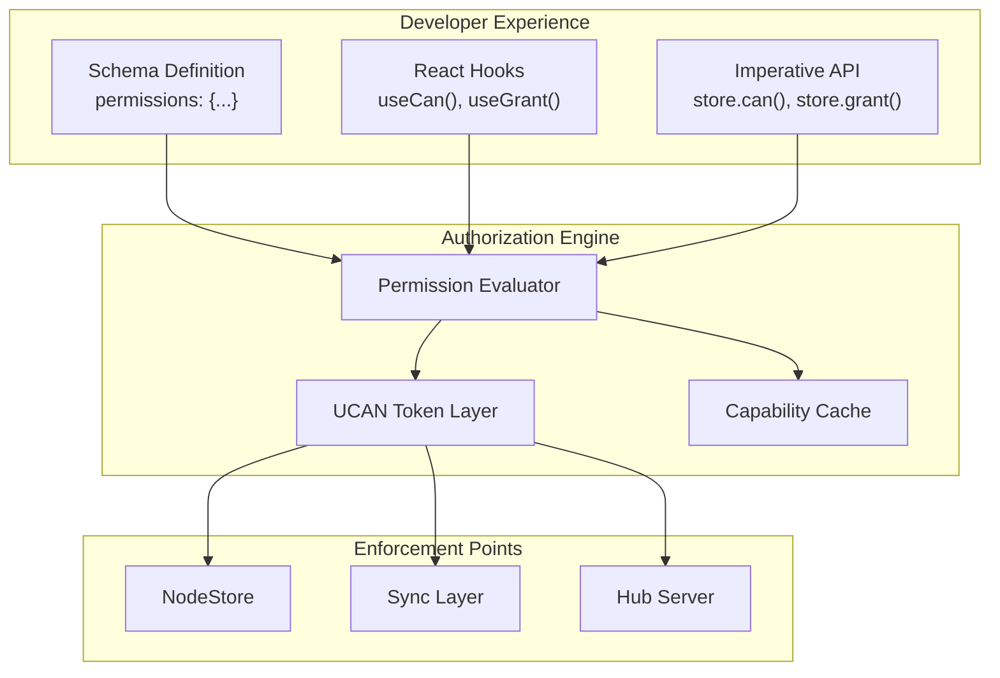

## Current State Analysis

### What Exists Today

**Layer 1: DID:key Identity (Fully Implemented, Enforced)**

- Every user has an Ed25519 keypair → `did:key:z6Mk...` identity
- Every `Change<NodePayload>` is signed and verified
- Every Yjs update is wrapped in a signed envelope
- **This layer works and is enforced at runtime**

**Layer 2: UCAN Token Functions (Implemented, Never Called)**

```typescript
// These functions exist in @xnet/identity
createUCAN({ issuer, issuerKey, audience, capabilities, expiration })
verifyUCAN(token)
hasCapability(token, resource, action)

// But NO code path ever calls them at runtime
```

**Layer 3: Permission Types (Defined, No Implementation)**

```typescript
// Types exist in @xnet/core but have zero consumers
interface PermissionEvaluator {
  hasCapability(did: DID, action: string, resource: string): boolean
  resolveGroups(did: DID): Group[]
  getPermissions(resource: string): PermissionGrant[]
}
```

### Current Reality

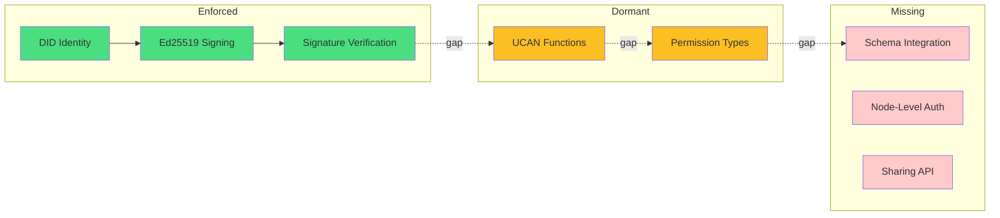

## Landscape Analysis

### ElectricSQL Approach

ElectricSQL uses **Shapes** as the core sync primitive with **HTTP-level authorization** via proxy patterns. Shapes define subsets of data to sync using table + WHERE clause + columns:

```typescript
// ElectricSQL: Shapes define what data to sync
const stream = new ShapeStream({
  url: 'http://localhost:3000/v1/shape',
  params: {
    table: 'todos',
    where: `user_id = $1`, // Row-level filtering
    columns: 'id,title,status', // Column-level filtering
    params: { '1': userId }
  }
})

// Auth is handled via proxy that validates tokens and sets WHERE clauses
// Server-side proxy example:
if (!user.roles.includes('admin')) {
  originUrl.searchParams.set('where', `org_id = '${user.org_id}'`)
}
```

ElectricSQL supports **subqueries** for cross-table filtering (experimental):

```typescript
// Sync users who belong to a specific organization
params: {
  table: 'users',
  where: `id IN (SELECT user_id FROM memberships WHERE org_id = $1)`,
  params: { '1': 'org_123' }
}
```

**Strengths:**

- Simple mental model (Shapes = resources, HTTP auth)
- Row-level and column-level filtering via WHERE/columns
- Works with existing auth systems (Auth0, Supabase, etc.)
- Server-side enforcement with proxy pattern
- Subqueries enable relationship-based filtering

**Weaknesses:**

- Requires online server for auth decisions
- No built-in delegation/sharing model
- Authorization logic lives in proxy code, not schema
- No offline capability verification

### Supabase Approach

Supabase uses **Postgres Row Level Security (RLS)** with policies defined directly in SQL:

```sql
-- Enable RLS on table
ALTER TABLE profiles ENABLE ROW LEVEL SECURITY;

-- Policy: Users can only see their own profile
CREATE POLICY "Users can view own profile"
ON profiles FOR SELECT
TO authenticated
USING ( (SELECT auth.uid()) = user_id );

-- Policy: Users can update their own profile
CREATE POLICY "Users can update own profile"
ON profiles FOR UPDATE
TO authenticated
USING ( (SELECT auth.uid()) = user_id )
WITH CHECK ( (SELECT auth.uid()) = user_id );
```

Supabase also supports **Custom Claims & RBAC** via Auth Hooks:

```sql
-- Create role-based permission check
CREATE FUNCTION public.authorize(requested_permission app_permission)
RETURNS boolean AS $$
DECLARE
  user_role public.app_role;
BEGIN
  SELECT (auth.jwt() ->> 'user_role')::public.app_role INTO user_role;
  RETURN EXISTS (
    SELECT 1 FROM role_permissions
    WHERE permission = requested_permission AND role = user_role
  );
END;
$$ LANGUAGE plpgsql;

-- Use in RLS policy
CREATE POLICY "Allow authorized delete"
ON messages FOR DELETE
TO authenticated
USING ( (SELECT authorize('messages.delete')) );
```

**Strengths:**

- Database-native security (RLS is battle-tested)
- Policies are declarative SQL
- Works with any Postgres client
- Custom claims enable flexible RBAC
- Column-level security also available
- Performance optimizations well-documented

**Weaknesses:**

- Requires Postgres (not portable)
- Policies are separate from application schema
- No offline capability (requires database connection)
- No delegation/sharing model
- Complex policies can impact query performance

### Convex Approach

Convex takes a **code-first authorization** approach where auth checks are written directly in server functions:

```typescript
// Convex: Authorization via code in mutations/queries
export const publish = mutation({
  args: { messageId: v.id('messages') },
  handler: async (ctx, args) => {
    const identity = await ctx.auth.getUserIdentity()
    if (!identity) {
      throw new Error('Must be authenticated')
    }

    const message = await ctx.db.get(args.messageId)
    if (message.author !== identity.tokenIdentifier) {
      throw new Error('Not authorized to publish this message')
    }

    await ctx.db.patch(args.messageId, { published: true })
  }
})
```

Convex also supports **Row-Level Security** via a helper library that wraps database access:

```typescript
// convex-helpers RLS pattern
const rules: Rules<QueryCtx, DataModel> = {
  messages: {
    read: async ({ auth }, message) => {
      const identity = await auth.getUserIdentity()
      if (identity === null) {
        return message.published // Anonymous can only see published
      }
      return true // Authenticated can see all
    },
    modify: async ({ auth }, message) => {
      const identity = await auth.getUserIdentity()
      if (identity === null) return false
      return message.author === identity.tokenIdentifier
    }
  }
}

// Wrap db with RLS
export const queryWithRLS = customQuery(
  query,
  customCtx(async (ctx) => ({
    db: wrapDatabaseReader(ctx, ctx.db, await rlsRules(ctx))
  }))
)
```

**Strengths:**

- Full flexibility of code-based auth
- RLS abstraction available via convex-helpers
- Server-side execution (secure)
- Works with any auth provider (Clerk, Auth0, etc.)
- TypeScript-native, type-safe

**Weaknesses:**

- Requires online server (not local-first)
- No built-in delegation model
- RLS is opt-in library, not native
- Authorization scattered across functions without discipline

### SpiceDB/Zanzibar Approach

SpiceDB uses a **relationship-based access control** (ReBAC) model:

```
// SpiceDB schema language
definition document {
  relation owner: user
  relation reader: user | group#member

  permission edit = owner
  permission view = reader + owner
}

// Relationships are tuples
document:budget#owner@user:alice
document:budget#reader@group:finance#member
```

**Strengths:**

- Powerful relationship-based model
- Composable permissions
- Centralized policy management

**Weaknesses:**

- Requires central SpiceDB server
- Separate schema language
- Not local-first

### UCAN Approach

UCAN provides **decentralized, delegable capabilities**:

```typescript
// UCAN capability
{ with: 'xnet://did:key:z.../page/123', can: 'xnet/write' }

// Delegation chain
Alice → Bob → Carol (each attenuating capabilities)
```

**Strengths:**

- Fully decentralized
- Offline-capable
- Cryptographically verifiable
- Supports delegation

**Weaknesses:**

- Complex mental model
- No built-in schema integration
- Revocation requires coordination

## Design Principles

### 1. Schema-First Authorization

Permissions should be declared in schemas, not scattered across code:

```typescript
// BAD: Imperative checks everywhere
if (user.role === 'admin' || node.createdBy === user.did) {
  // allow edit
}

// GOOD: Declarative in schema
const TaskSchema = defineSchema({
  name: 'Task',
  permissions: {
    read: 'anyone',
    write: 'owner | assignee | parent.admin',
    delete: 'owner | parent.admin'
  }
})
```

### 2. Relationship-Aware

Permissions should flow through the graph:

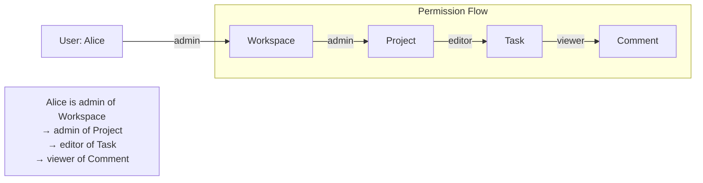

### 3. Delegation-Native

Sharing should create UCAN delegation chains:

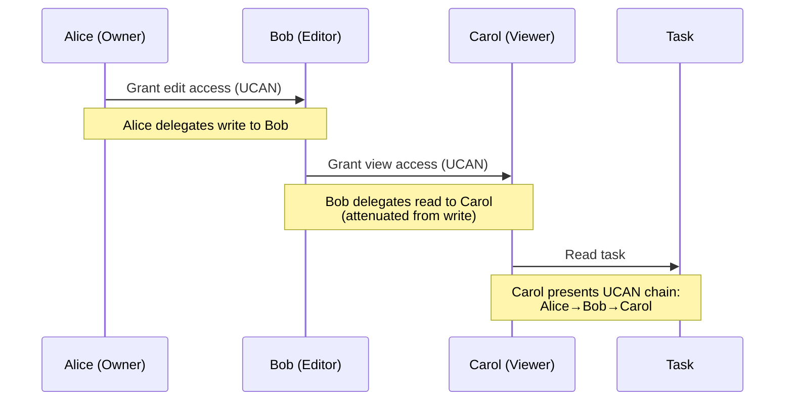

### 4. Offline-First

Authorization must work without network:

- Cached capability tokens
- Local permission evaluation
- Eventual consistency for revocations

### 5. Developer-Friendly

Simple API that hides UCAN complexity:

```typescript
// Check permission
const canEdit = await store.can('write', taskId)

// Grant access
await store.grant(bobDid, 'write', taskId, { expiresIn: '7d' })

// React hook
const { canEdit, canDelete } = useCan(taskId)
```

## Proposed Architecture

### Two-Layer Permission Model

A critical design question: **How do users modify permissions on a specific node if permissions are defined in the schema?**

The answer is a **two-layer model** that separates policy from grants:

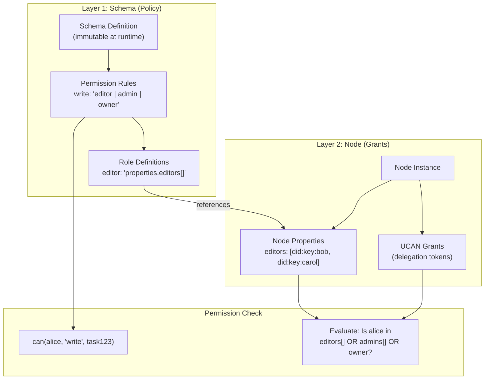

**Layer 1: Schema-Level Policy (Developer-Defined)**

- Defined by developers in code via `defineSchema()`
- Specifies **what roles can do** (e.g., "editors can write")
- Specifies **how roles are determined** (e.g., "editors come from `properties.editors`")
- **Immutable at runtime** — users cannot change the schema
- Applies to ALL nodes of that schema type

**Layer 2: Node-Level Grants (User-Controlled)**

- Controlled by users with appropriate permissions (typically `share` permission)
- Modifies **who has each role** on a specific node
- Two mechanisms for granting access:
  1. **Property-based**: Add a DID to a `person()` property (e.g., add Bob to `editors`)
  2. **UCAN-based**: Create a delegation token granting specific capabilities

#### Example: Granting Edit Access to a Task

```typescript
// Schema defines: editors can write, editors come from properties.editors
const TaskSchema = defineSchema({
  properties: {
    title: text({ required: true }),
    editors: person({ multiple: true }) // <-- Users can modify this
  },
  permissions: {
    write: 'editor | admin | owner',
    share: 'admin | owner' // <-- Who can grant access
  },
  roles: {
    editor: 'properties.editors[]' // <-- Role derived from property
  }
})

// User grants access by EITHER:

// Option 1: Add to editors property (if they have write permission)
await store.update(taskId, {
  editors: [...currentEditors, bobDid]
})
// Now Bob is an editor because he's in properties.editors

// Option 2: Create UCAN delegation (if they have share permission)
await store.grant({
  to: bobDid,
  action: 'write',
  resource: taskId,
  expiresIn: '7d'
})
// Now Bob has write access via UCAN token (doesn't modify node properties)
```

#### Property-Based vs UCAN-Based Grants

| Aspect         | Property-Based                   | UCAN-Based                         |
| -------------- | -------------------------------- | ---------------------------------- |
| **Storage**    | In node properties               | Separate token store               |
| **Visibility** | Visible to all who can read node | Private between grantor/grantee    |
| **Expiration** | Permanent until removed          | Built-in expiration support        |
| **Delegation** | Cannot be re-delegated           | Can be attenuated and re-delegated |
| **Revocation** | Remove from property             | Publish revocation record          |
| **Offline**    | Requires node sync               | Token works offline                |
| **Use case**   | Team membership, assignees       | Temporary access, external sharing |

#### Who Can Grant Access?

The `share` permission controls who can modify access:

```typescript
permissions: {
  share: 'admin | owner' // Only admins and owners can grant access
}
```

Users with `share` permission can:

- Add/remove DIDs from role-granting properties (e.g., `editors`, `viewers`)
- Create UCAN delegation tokens for others
- Revoke grants they previously issued

Users **cannot**:

- Modify the schema's permission rules
- Grant permissions they don't have (UCAN attenuation enforces this)
- Bypass the schema's role definitions

#### Inheritance and Cascading

When access is granted at a parent level, it cascades to children:

```typescript
// Workspace schema
const WorkspaceSchema = defineSchema({
  properties: {
    members: person({ multiple: true })
  },
  roles: {
    member: 'properties.members[]'
  }
})

// Project schema inherits from workspace
const ProjectSchema = defineSchema({
  properties: {
    workspace: relation({ target: WorkspaceSchema })
  },
  roles: {
    viewer: 'workspace->member' // Workspace members can view projects
  }
})

// Adding someone to workspace.members automatically grants them
// viewer access to all projects in that workspace
await store.update(workspaceId, {
  members: [...currentMembers, carolDid]
})
// Carol can now view all projects in this workspace
```

### Schema-Level Permissions

```typescript
const TaskSchema = defineSchema({
  name: 'Task',
  namespace: 'xnet://xnet.fyi/',
  properties: {
    title: text({ required: true }),
    status: select({ options: ['todo', 'doing', 'done'] }),
    assignee: person(),
    project: relation({ target: 'xnet://xnet.fyi/Project' })
  },

  // NEW: Permission declarations
  permissions: {
    // Built-in roles
    read: 'viewer | editor | admin | owner',
    write: 'editor | admin | owner',
    delete: 'admin | owner',
    share: 'admin | owner',

    // Custom permissions
    assign: 'editor | admin | owner',
    complete: 'assignee | editor | admin | owner'
  },

  // NEW: Role definitions (who has each role)
  roles: {
    owner: 'createdBy', // Node creator
    assignee: 'properties.assignee', // Person property
    editor: 'project->editor', // Inherited from relation
    admin: 'project->admin', // Inherited from relation
    viewer: 'project->viewer | public' // Inherited or public
  }
})
```

### Permission Expression Language

A simple DSL for expressing permission rules:

```
// Literals
'owner'                     // Has owner role
'public'                    // Anyone (no auth required)
'authenticated'             // Any authenticated user

// Operators
'owner | editor'            // OR: owner or editor
'editor & verified'         // AND: editor and verified
'!banned'                   // NOT: not banned

// Property references
'createdBy'                 // Node's createdBy field
'properties.assignee'       // Person property value
'properties.team[]'         // Multi-person property (any match)

// Relation traversal
'project->admin'            // Admin of related project
'parent->owner'             // Owner of parent node
'workspace->members[]'      // Any member of workspace

// Wildcards
'*->admin'                  // Admin of any related node
```

### Permission Evaluation Flow

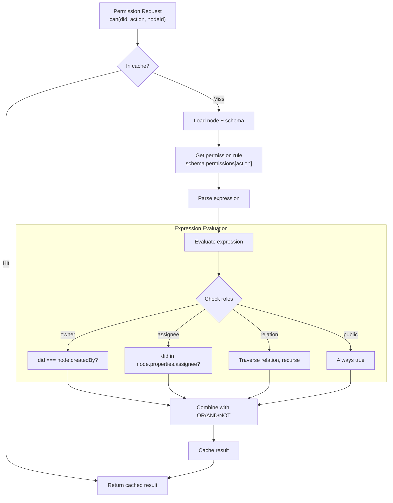

### UCAN Integration

The permission system generates and validates UCANs under the hood:

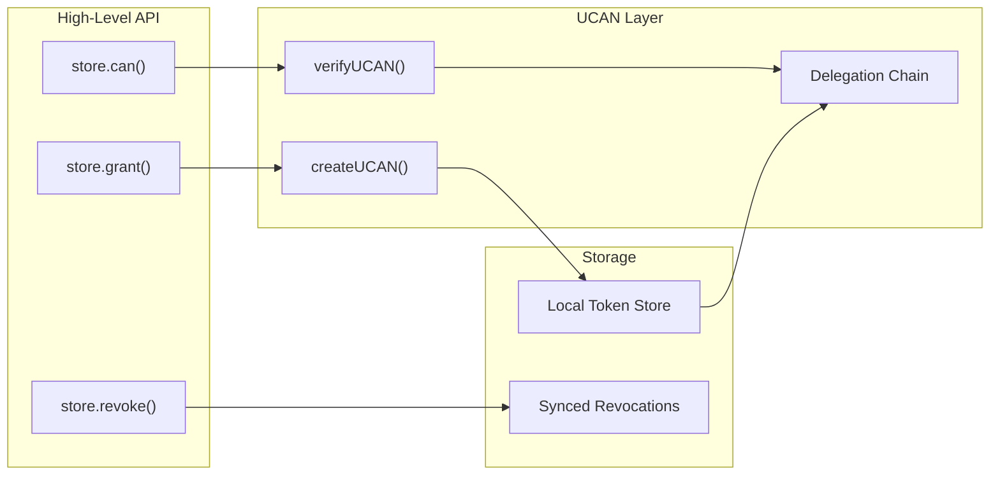

### Capability URIs

Resources are identified by URIs that map to nodes:

```
// Node-level capability
xnet://did:key:z6Mk.../node/abc123

// Schema-level capability (all nodes of type)
xnet://did:key:z6Mk.../schema/Task

// Namespace-level capability (all schemas in namespace)
xnet://did:key:z6Mk.../namespace/xnet.fyi

// Property-level capability (specific field)
xnet://did:key:z6Mk.../node/abc123#status

// Relation-level capability
xnet://did:key:z6Mk.../node/abc123/children
```

### Action Hierarchy

Actions form a hierarchy where broader actions include narrower ones:

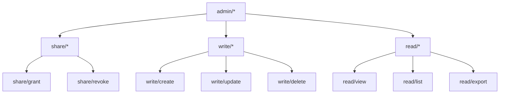

## API Design

### Core Permission API

```typescript
// @xnet/data - Permission checking
interface NodeStore {
  // Check if current user can perform action
  can(action: string, nodeId: NodeId): Promise<boolean>

  // Check with specific DID
  canAs(did: DID, action: string, nodeId: NodeId): Promise<boolean>

  // Get all permissions for a node
  getPermissions(nodeId: NodeId): Promise<PermissionSet>

  // Grant permission (creates UCAN)
  grant(options: GrantOptions): Promise<GrantResult>

  // Revoke permission
  revoke(grantId: string): Promise<void>

  // List grants for a node
  listGrants(nodeId: NodeId): Promise<Grant[]>
}

interface GrantOptions {
  to: DID // Recipient
  action: string | string[] // Actions to grant
  resource: NodeId | SchemaIRI // Node or schema
  expiresIn?: string | number // Duration or timestamp
  attenuations?: Attenuation[] // Further restrictions
}

interface Grant {
  id: string // Grant ID (for revocation)
  token: string // UCAN token
  from: DID // Grantor
  to: DID // Grantee
  actions: string[] // Granted actions
  resource: string // Resource URI
  expiresAt: number // Expiration timestamp
  createdAt: number // Creation timestamp
  revoked?: boolean // Revocation status
}
```

### React Hooks

```typescript
// @xnet/react - Permission hooks

// Check permissions for a node
function useCan(nodeId: NodeId): {
  canRead: boolean
  canWrite: boolean
  canDelete: boolean
  canShare: boolean
  loading: boolean
}

// Check specific permission
function usePermission(action: string, nodeId: NodeId): {
  allowed: boolean
  loading: boolean
  error?: Error
}

// Get grants for a node
function useGrants(nodeId: NodeId): {
  grants: Grant[]
  loading: boolean
  grant: (options: GrantOptions) => Promise<Grant>
  revoke: (grantId: string) => Promise<void>
}

// Permission-aware query
function useQuery<S extends DefinedSchema>(
  schema: S,
  options?: QueryOptions & { requirePermission?: string }
): QueryResult<S>

// Usage examples
function TaskCard({ taskId }: { taskId: NodeId }) {
  const task = useNode(TaskSchema, taskId)
  const { canWrite, canDelete, canShare } = useCan(taskId)

  return (
    <div>
      <h3>{task.title}</h3>
      {canWrite && <EditButton />}
      {canDelete && <DeleteButton />}
      {canShare && <ShareButton />}
    </div>
  )
}

function ShareDialog({ nodeId }: { nodeId: NodeId }) {
  const { grants, grant, revoke } = useGrants(nodeId)

  const handleShare = async (email: string, permission: string) => {
    const did = await resolveDID(email)
    await grant({ to: did, action: permission, resource: nodeId })
  }

  return (
    <div>
      <h4>Shared with</h4>
      {grants.map(g => (
        <GrantRow key={g.id} grant={g} onRevoke={() => revoke(g.id)} />
      ))}
      <ShareForm onShare={handleShare} />
    </div>
  )
}
```

### Schema Permission Helpers

```typescript
// @xnet/data - Schema definition helpers

// Define permissions inline
const TaskSchema = defineSchema({
  name: 'Task',
  permissions: {
    read: 'viewer | editor | admin | owner',
    write: 'editor | admin | owner',
    delete: 'admin | owner'
  }
})

// Or use permission presets
const TaskSchema = defineSchema({
  name: 'Task',
  permissions: permissions.collaborative({
    // Inherits from parent relation
    inherit: 'project',
    // Additional role mappings
    roles: {
      assignee: 'properties.assignee'
    },
    // Custom permissions
    custom: {
      complete: 'assignee | editor | admin | owner'
    }
  })
})

// Permission presets
const permissions = {
  // Private: only owner can access
  private: () => ({
    read: 'owner',
    write: 'owner',
    delete: 'owner',
    share: 'owner'
  }),

  // Public read, owner write
  publicRead: () => ({
    read: 'public',
    write: 'owner',
    delete: 'owner',
    share: 'owner'
  }),

  // Collaborative with inheritance
  collaborative: (options: CollaborativeOptions) => ({
    read: `viewer | editor | admin | owner | ${options.inherit}->viewer`,
    write: `editor | admin | owner | ${options.inherit}->editor`,
    delete: `admin | owner | ${options.inherit}->admin`,
    share: `admin | owner | ${options.inherit}->admin`,
    ...options.custom
  }),

  // Open: anyone can read/write
  open: () => ({
    read: 'public',
    write: 'authenticated',
    delete: 'owner',
    share: 'owner'
  })
}
```

## Relationship-Based Permissions

### Permission Inheritance Through Relations

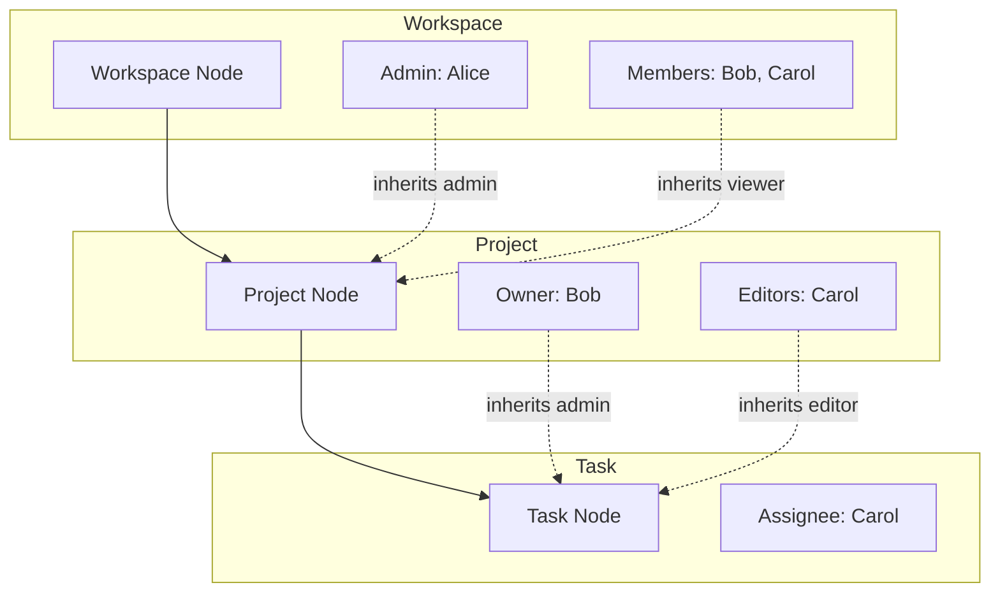

### Schema Definition for Inheritance

```typescript
const WorkspaceSchema = defineSchema({
  name: 'Workspace',
  properties: {
    name: text({ required: true }),
    admins: person({ multiple: true }),
    members: person({ multiple: true })
  },
  permissions: {
    read: 'member | admin | owner',
    write: 'admin | owner',
    delete: 'owner',
    share: 'admin | owner'
  },
  roles: {
    owner: 'createdBy',
    admin: 'properties.admins[]',
    member: 'properties.members[]'
  }
})

const ProjectSchema = defineSchema({
  name: 'Project',
  properties: {
    name: text({ required: true }),
    workspace: relation({ target: WorkspaceSchema }),
    editors: person({ multiple: true })
  },
  permissions: {
    read: 'viewer | editor | admin | owner',
    write: 'editor | admin | owner',
    delete: 'admin | owner',
    share: 'admin | owner'
  },
  roles: {
    owner: 'createdBy',
    admin: 'workspace->admin', // Inherit from workspace
    editor: 'properties.editors[] | workspace->admin',
    viewer: 'workspace->member' // Workspace members can view
  }
})

const TaskSchema = defineSchema({
  name: 'Task',
  properties: {
    title: text({ required: true }),
    project: relation({ target: ProjectSchema }),
    assignee: person()
  },
  permissions: {
    read: 'viewer | editor | admin | owner',
    write: 'editor | admin | owner | assignee',
    delete: 'admin | owner',
    complete: 'assignee | editor | admin | owner'
  },
  roles: {
    owner: 'createdBy',
    admin: 'project->admin',
    editor: 'project->editor',
    viewer: 'project->viewer',
    assignee: 'properties.assignee'
  }
})
```

### Relation-Level Permissions

Control who can create/modify relationships:

```typescript
const ProjectSchema = defineSchema({
  name: 'Project',
  properties: {
    workspace: relation({
      target: WorkspaceSchema,
      // Only workspace admins can move projects between workspaces
      permission: 'workspace->admin'
    }),
    tasks: relation({
      target: TaskSchema,
      multiple: true,
      // Project editors can add/remove tasks
      permission: 'editor | admin | owner'
    })
  }
})
```

## Enforcement Points

### 1. NodeStore Enforcement

```typescript
class NodeStore {
  private permissionEvaluator: PermissionEvaluator

  async create(options: CreateNodeOptions): Promise<NodeState> {
    // Check create permission on parent or schema
    const canCreate = await this.permissionEvaluator.can(
      this.authorDID,
      'write/create',
      options.schemaId
    )

    if (!canCreate) {
      throw new PermissionError('Cannot create node of this type')
    }

    // ... existing create logic
  }

  async update(id: NodeId, options: UpdateNodeOptions): Promise<NodeState> {
    // Check write permission on node
    const canWrite = await this.permissionEvaluator.can(this.authorDID, 'write/update', id)

    if (!canWrite) {
      throw new PermissionError('Cannot update this node')
    }

    // ... existing update logic
  }

  async applyRemoteChange(change: NodeChange): Promise<void> {
    // Verify the change author has permission
    const canWrite = await this.permissionEvaluator.can(
      change.authorDID,
      'write/update',
      change.payload.nodeId
    )

    if (!canWrite) {
      // Log but don't apply - author lacks permission
      console.warn(`Rejected change from ${change.authorDID}: no permission`)
      return
    }

    // ... existing apply logic
  }
}
```

### 2. Sync Layer Enforcement

```typescript
// Connection manager checks UCAN before joining sync room
async function joinSyncRoom(roomId: string, token?: string): Promise<void> {
  if (this.config.requireAuth) {
    if (!token) {
      throw new AuthError('UCAN token required')
    }

    const result = verifyUCAN(token)
    if (!result.valid) {
      throw new AuthError(`Invalid UCAN: ${result.error}`)
    }

    // Check capability for this room
    if (!hasCapability(result.payload!, roomId, 'sync/join')) {
      throw new AuthError('No permission to join this sync room')
    }
  }

  // ... join room
}
```

### 3. Hub Server Enforcement

```typescript
// Hub authenticates WebSocket connections
export const authenticateConnection = async (
  ws: WebSocket,
  req: IncomingMessage,
  config: HubConfig
): Promise<AuthSession | null> => {
  const token = getTokenFromRequest(req)

  if (!token && config.auth) {
    ws.close(4401, 'Missing UCAN token')
    return null
  }

  const result = verifyUCAN(token)
  if (!result.valid) {
    ws.close(4401, `Invalid UCAN: ${result.error}`)
    return null
  }

  // Verify audience matches this hub
  if (config.hubDid && result.payload.aud !== config.hubDid) {
    ws.close(4401, 'UCAN audience mismatch')
    return null
  }

  return {
    did: result.payload.iss,
    capabilities: getCapabilities(result.payload),
    token: result.payload
  }
}
```

## Sharing and Delegation

### Share Link Generation

```typescript
// Create a shareable link with embedded UCAN
async function createShareLink(options: ShareLinkOptions): Promise<string> {
  const { nodeId, permission, expiresIn, baseUrl } = options

  // Create UCAN token
  const token = createUCAN({
    issuer: this.authorDID,
    issuerKey: this.signingKey,
    audience: 'did:web:xnet.fyi', // Public audience for links
    capabilities: [{ with: `xnet://${this.authorDID}/node/${nodeId}`, can: `xnet/${permission}` }],
    expiration: Math.floor((Date.now() + expiresIn) / 1000)
  })

  // Encode into shareable URL
  const shareData = {
    v: 1,
    n: nodeId,
    t: token
  }

  return `${baseUrl}/s/${base64url(JSON.stringify(shareData))}`
}
```

### Delegation Chain

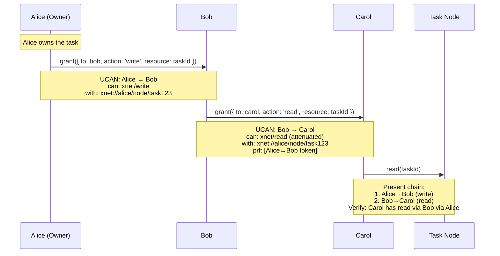

### Revocation

```typescript
// Revoke a grant
async function revoke(grantId: string): Promise<void> {
  const grant = await this.storage.getGrant(grantId)
  if (!grant) throw new Error('Grant not found')

  // Verify caller can revoke (must be grantor or upstream in chain)
  const canRevoke = await this.canRevoke(this.authorDID, grant)
  if (!canRevoke) throw new PermissionError('Cannot revoke this grant')

  // Create revocation record
  const revocation: Revocation = {
    tokenHash: hash(grant.token),
    issuer: this.authorDID,
    revokedAt: Date.now(),
    signature: sign(/* revocation payload */, this.signingKey)
  }

  // Store locally
  await this.storage.addRevocation(revocation)

  // Sync to hub for propagation
  await this.syncRevocation(revocation)
}

// Check revocation during verification
function verifyUCANWithRevocation(token: string): VerifyResult {
  const result = verifyUCAN(token)
  if (!result.valid) return result

  // Check if any token in the chain is revoked
  const tokenHash = hash(token)
  if (this.revocations.has(tokenHash)) {
    return { valid: false, error: 'Token revoked' }
  }

  // Check proof chain
  for (const proof of result.payload.prf) {
    const proofResult = verifyUCANWithRevocation(proof)
    if (!proofResult.valid) {
      return { valid: false, error: `Proof revoked: ${proofResult.error}` }
    }
  }

  return result
}
```

## Offline-First Considerations

### Capability Caching

```typescript
interface CapabilityCache {
  // Cache permission check results
  set(did: DID, action: string, resource: string, result: boolean, ttl: number): void
  get(did: DID, action: string, resource: string): boolean | undefined

  // Cache UCAN tokens
  storeToken(token: string, metadata: TokenMetadata): void
  getTokensFor(resource: string): string[]

  // Invalidation
  invalidate(resource: string): void
  invalidateAll(): void
}

// Permission evaluator with caching
class CachedPermissionEvaluator implements PermissionEvaluator {
  private cache: CapabilityCache

  async can(did: DID, action: string, resource: string): Promise<boolean> {
    // Check cache first
    const cached = this.cache.get(did, action, resource)
    if (cached !== undefined) return cached

    // Evaluate permission
    const result = await this.evaluate(did, action, resource)

    // Cache with TTL based on token expiration
    const ttl = this.getMinTokenTTL(resource)
    this.cache.set(did, action, resource, result, ttl)

    return result
  }
}
```

### Eventual Consistency for Revocations

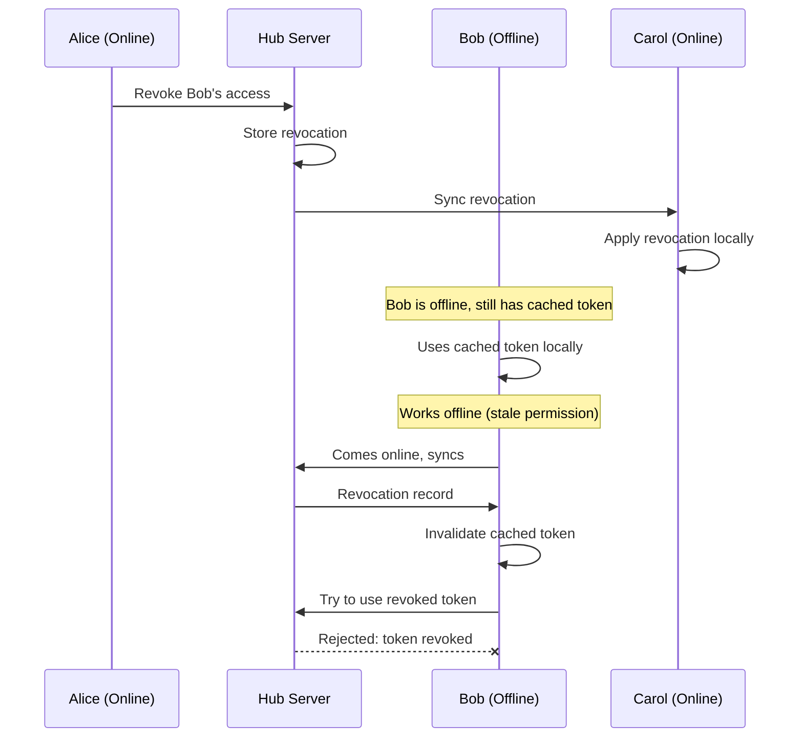

### Conflict Resolution

When permissions conflict (e.g., grant and revoke arrive out of order):

```typescript
// Revocations always win (conservative approach)
function resolvePermissionConflict(grant: Grant, revocation: Revocation): 'grant' | 'revoke' {
  // If revocation exists for this grant, it's revoked
  if (revocation.tokenHash === hash(grant.token)) {
    return 'revoke'
  }

  // If revocation is for an upstream token, grant is invalid
  for (const proof of parseProofChain(grant.token)) {
    if (revocation.tokenHash === hash(proof)) {
      return 'revoke'
    }
  }

  return 'grant'
}
```

## Implementation Roadmap

### Phase 1: Fix UCAN Foundation (1-2 weeks)

- [ ] Fix UCAN signature format (JWT spec compliance)
- [ ] Implement proof chain validation
- [ ] Add attenuation checking
- [ ] Comprehensive UCAN test suite

### Phase 2: Permission Evaluator (2-3 weeks)

- [ ] Implement `PermissionEvaluator` class
- [ ] Permission expression parser
- [ ] Role resolution (property refs, relation traversal)
- [ ] Capability caching

### Phase 3: Schema Integration (2-3 weeks)

- [ ] Add `permissions` and `roles` to schema definition
- [ ] Permission presets (private, public, collaborative)
- [ ] Relation-level permissions
- [ ] Schema validation for permission expressions

### Phase 4: NodeStore Enforcement (2-3 weeks)

- [ ] Integrate permission checks in CRUD operations
- [ ] Remote change authorization
- [ ] Batch operation permissions
- [ ] Permission error handling

### Phase 5: React Hooks (1-2 weeks)

- [ ] `useCan()` hook
- [ ] `usePermission()` hook
- [ ] `useGrants()` hook
- [ ] Permission-aware `useQuery()`

### Phase 6: Sharing API (2-3 weeks)

- [ ] `store.grant()` implementation
- [ ] `store.revoke()` implementation
- [ ] Share link generation
- [ ] Revocation sync

### Phase 7: Hub Integration (2-3 weeks)

- [ ] UCAN authentication for WebSocket
- [ ] Room-level access control
- [ ] Revocation propagation
- [ ] Admin capabilities

## Comparison with Alternatives

| Feature                 | xNet (Proposed)       | ElectricSQL        | Supabase        | Convex             | SpiceDB         | Firebase       |
| ----------------------- | --------------------- | ------------------ | --------------- | ------------------ | --------------- | -------------- |
| **Auth Model**          | UCAN capabilities     | HTTP proxy + WHERE | Postgres RLS    | Code + RLS wrapper | Zanzibar ReBAC  | Security Rules |
| **Schema integration**  | Native (defineSchema) | None (proxy)       | SQL policies    | Code-based         | Separate DSL    | JSON rules     |
| **Row-level filtering** | Yes (expressions)     | Yes (WHERE)        | Yes (RLS)       | Yes (code/RLS)     | Yes (relations) | Yes (rules)    |
| **Column-level**        | Yes (properties)      | Yes (columns)      | Yes (Column LS) | Manual             | No              | Limited        |
| **Offline support**     | Full (cached UCANs)   | None               | None            | None               | None            | Limited        |
| **Delegation**          | UCAN chains           | None               | None            | None               | None            | None           |
| **Decentralized**       | Yes                   | No                 | No              | No                 | No              | No             |
| **Relation-aware**      | Yes (graph)           | Yes (subqueries)   | Yes (JOINs)     | Manual             | Yes (native)    | Limited        |
| **Revocation**          | Eventual              | Immediate          | Immediate       | Immediate          | Immediate       | Immediate      |
| **Performance**         | Cached eval           | Server-side        | DB-native       | Server-side        | Distributed     | Edge-cached    |
| **Developer UX**        | Hooks + schema        | HTTP headers       | SQL policies    | TypeScript         | gRPC API        | SDK + rules    |
| **Learning curve**      | Medium (DSL)          | Low (HTTP)         | Medium (SQL)    | Low (code)         | High (Zanzibar) | Medium         |

### Key Insights from Each System

**ElectricSQL**: Shapes provide elegant row/column filtering, but auth is external. The subquery feature for cross-table filtering is powerful and could inspire our relation-based permissions.

**Supabase**: RLS policies are battle-tested and performant. The `auth.uid()` and `auth.jwt()` helper functions are a good model for our permission expressions. Their RBAC pattern with custom claims shows how to extend basic auth.

**Convex**: The code-first approach with optional RLS wrapper is flexible but requires discipline. Their insight that "most apps don't need RLS" because server functions can apply auth directly is valid—but xNet's local-first nature means we can't rely on server-side checks alone. The `convex-helpers` RLS pattern of wrapping `ctx.db` is a good model for our NodeStore integration.

**SpiceDB**: The relationship-based model (`user:alice#member@group:engineering`) is the gold standard for ReBAC. Our `relation()` type already provides the graph structure needed for similar patterns.

**Firebase**: Security Rules show that declarative auth can work at scale, but the JSON format is limiting. Our TypeScript-native approach should be more ergonomic.

## TypeScript Static Validation Analysis

A key question for this design: **Can TypeScript statically validate permission expressions at compile time?** This section explores what's possible and what tradeoffs exist.

### What We Want to Validate

1. **Role references in permissions**: If `permissions.write` references `'assignee'`, that role must exist in `roles`
2. **Property references in roles**: If `roles.assignee` is `'properties.assignee'`, that property must exist and be a `person()` type
3. **Relation traversal**: If `roles.editor` is `'project->editor'`, the `project` property must be a `relation()` type
4. **Built-in roles**: `'owner'`, `'public'`, `'authenticated'` should always be valid
5. **Operators**: `|`, `&`, `!` should only combine valid role/property references

### TypeScript Capabilities

**Template Literal Types** can parse and validate string patterns:

```typescript
// TypeScript CAN validate literal string patterns
type ValidRole<Roles extends string> = Roles | 'owner' | 'public' | 'authenticated'

// This works for simple cases
type PermissionExpr<R extends string> =
  | ValidRole<R>
  | `${ValidRole<R>} | ${ValidRole<R>}`
  | `${ValidRole<R>} & ${ValidRole<R>}`
```

**Mapped Types** can extract property names and validate references:

```typescript
// TypeScript CAN infer property names from the schema
type PropertyNames<P> = keyof P & string

// And validate that a reference points to an existing property
type ValidPropertyRef<P> = `properties.${PropertyNames<P>}`
```

**Conditional Types** can check property types:

```typescript
// TypeScript CAN check if a property is a specific type
type IsPersonProperty<P, K extends keyof P> =
  P[K] extends PropertyBuilder<DID | DID[]> ? true : false

type IsRelationProperty<P, K extends keyof P> = P[K] extends { definition: { type: 'relation' } }
  ? true
  : false
```

### What TypeScript CAN Validate Statically

| Validation                                    | Feasibility | Technique                     |
| --------------------------------------------- | ----------- | ----------------------------- |
| Role name exists in `roles`                   | ✅ Yes      | Template literal + keyof      |
| Property name exists                          | ✅ Yes      | Mapped types + keyof          |
| Property is correct type (person vs relation) | ✅ Yes      | Conditional types             |
| Simple expressions (`'owner \| editor'`)      | ✅ Yes      | Template literal unions       |
| Built-in roles (`owner`, `public`)            | ✅ Yes      | Literal type unions           |
| Relation target schema has role               | ⚠️ Partial  | Requires schema registry type |

### What TypeScript CANNOT Validate (or is impractical)

| Validation                        | Feasibility | Reason                                                |
| --------------------------------- | ----------- | ----------------------------------------------------- |
| Arbitrary-depth expressions       | ❌ No       | Recursive template literals hit depth limits          |
| Runtime-defined schemas           | ❌ No       | Database-defined schemas aren't known at compile time |
| Cross-schema role inheritance     | ⚠️ Hard     | Requires global schema type registry                  |
| Circular role definitions         | ❌ No       | Type system can't detect runtime cycles               |
| Wildcard expressions (`*->admin`) | ❌ No       | Can't enumerate all possible relations                |

### Practical Approach: Hybrid Validation

Given TypeScript's limitations, a **hybrid approach** is recommended:

**Compile-time (TypeScript):**

- Validate that referenced property names exist
- Validate that property types match usage (person for role, relation for traversal)
- Validate that role names used in permissions are defined
- Provide autocomplete for valid role/property names

**Runtime (Schema Registration):**

- Parse and validate complex expressions
- Detect circular role definitions
- Validate cross-schema references
- Cache parsed permission ASTs

### Type-Safe API Design

To maximize static validation, the API should use **structured objects** rather than string DSL for complex cases:

```typescript
// String DSL: Limited static validation
permissions: {
  write: 'editor | admin | owner'  // TS can't fully parse this
}

// Structured API: Full static validation
permissions: {
  write: or('editor', 'admin', 'owner')  // TS validates each role exists
}

// Hybrid: Simple cases use strings, complex use builders
permissions: {
  read: 'public',                           // Simple literal - validated
  write: role('editor', 'admin', 'owner'),  // Builder - fully typed
  delete: inherit('project', 'admin')       // Relation traversal - typed
}
```

### Recommended Type Definitions

The following type structure enables maximum static validation:

```typescript
// 1. Extract role names from roles definition
type RoleNames<R extends Record<string, string>> = keyof R & string

// 2. Built-in roles that are always valid
type BuiltinRole = 'owner' | 'public' | 'authenticated' | 'createdBy'

// 3. Valid role reference is either builtin or defined
type ValidRole<R extends Record<string, string>> = BuiltinRole | RoleNames<R>

// 4. Permission value can be a single role or use builders
type PermissionValue<R extends Record<string, string>> =
  | ValidRole<R>
  | { or: ValidRole<R>[] }
  | { and: ValidRole<R>[] }
  | { inherit: [PropertyName, ValidRole<R>] }

// 5. Schema definition with validated permissions
interface DefineSchemaOptions<
  P extends Record<string, PropertyBuilder>,
  R extends Record<string, string>
> {
  properties: P
  roles: R & ValidRoleDefinitions<P, R> // Validate role definitions
  permissions: Record<string, PermissionValue<R>> // Validate permission refs
}
```

### Tradeoffs

| Approach               | DX (Autocomplete) | Validation Depth   | Complexity |
| ---------------------- | ----------------- | ------------------ | ---------- |
| Pure string DSL        | ❌ None           | Runtime only       | Low        |
| Template literal types | ⚠️ Limited        | Simple expressions | Medium     |
| Structured builders    | ✅ Full           | Most cases         | Medium     |
| Hybrid (recommended)   | ✅ Good           | Good coverage      | Medium     |

### Conclusion

TypeScript **can** provide meaningful static validation for permission expressions, but with limits:

1. **Simple role references** (`'owner'`, `'editor'`) can be fully validated
2. **Property references** (`'properties.assignee'`) can validate property existence and type
3. **Complex expressions** with operators require either structured builders or runtime validation
4. **Cross-schema references** need a type-level schema registry (complex but possible)

The recommended approach is a **hybrid API** that uses:

- String literals for simple, common cases (validated via template literal types)
- Builder functions for complex expressions (fully typed)
- Runtime validation as a safety net for edge cases

This provides good developer experience (autocomplete, error messages) while maintaining the flexibility of the DSL.

## Performance Impact Analysis

Authorization checks are in the critical path of every request. This section analyzes performance implications for both local (client-side) and hub (server-side) enforcement, drawing on lessons from Google Zanzibar, SpiceDB, and ElectricSQL.

### Performance Characteristics of Authorization Systems

Google's Zanzibar paper establishes the gold standard for authorization performance at scale:

| Metric       | Zanzibar (Google) | Target for xNet            |
| ------------ | ----------------- | -------------------------- |
| P50 latency  | 3ms               | <10ms local, <50ms hub     |
| P99 latency  | 20ms              | <50ms local, <100ms hub    |
| Throughput   | 10M+ requests/sec | N/A (distributed)          |
| Availability | 99.999%           | Offline-first (100% local) |

Key insight: Zanzibar achieves these numbers through **aggressive caching** at multiple layers and **request deduplication** via consistent hashing. xNet's local-first architecture gives us an inherent advantage—we can cache everything locally.

### Local (Client-Side) Performance

#### Permission Check Cost

Each permission check involves:

1. **Schema lookup**: O(1) from in-memory registry
2. **Role resolution**: O(R) where R = number of roles in expression
3. **Property access**: O(1) per property reference
4. **Relation traversal**: O(D × N) where D = depth, N = avg relations per node

```
Estimated local check latency:
- Simple role check (owner | editor): <1ms
- Property-based role (properties.assignee): <1ms
- Single relation traversal (project->admin): 1-5ms
- Deep traversal (workspace->project->task): 5-20ms
```

#### Caching Strategy

Local caching is critical for performance. Based on SpiceDB's architecture:

| Cache Layer       | What's Cached                             | TTL               | Invalidation              |
| ----------------- | ----------------------------------------- | ----------------- | ------------------------- |
| Permission result | `can(did, action, nodeId) → boolean`      | 5-60s             | On node/grant change      |
| Role membership   | `hasRole(did, role, nodeId) → boolean`    | 30-300s           | On role definition change |
| Relation graph    | `getRelated(nodeId, relation) → NodeId[]` | Until node change | On relation change        |
| UCAN tokens       | Parsed/verified tokens                    | Until expiration  | On revocation             |

**Cache hit rates** (estimated based on Zanzibar patterns):

- Permission checks on same node: 80-95% hit rate
- Role membership: 70-90% hit rate
- Relation traversal: 50-80% hit rate

#### Memory Overhead

| Component        | Memory per 1K nodes | Notes                           |
| ---------------- | ------------------- | ------------------------------- |
| Permission cache | ~50KB               | Assuming 50 cached results/node |
| Role cache       | ~20KB               | Assuming 20 role checks/node    |
| UCAN token cache | ~100KB              | Assuming 100 tokens, 1KB each   |
| Parsed schemas   | ~10KB               | One-time cost per schema        |

For a typical workspace with 10K nodes: **~2MB** additional memory for authorization caching.

#### Offline Performance

UCAN's key advantage is **offline capability**:

- All permission checks work offline using cached tokens
- No network round-trips for authorization
- Revocations are eventually consistent (see tradeoffs below)

### Hub (Server-Side) Performance

#### Request Processing Cost

Hub servers must verify authorization for every sync operation:

1. **UCAN verification**: ~0.5-2ms (Ed25519 signature check)
2. **Proof chain validation**: O(P × V) where P = proof depth, V = verification cost
3. **Capability matching**: O(C) where C = capabilities in token
4. **Room-level access check**: O(1) with proper indexing

```
Estimated hub verification latency:
- Simple UCAN (no proofs): 1-3ms
- UCAN with 1-2 proofs: 3-8ms
- UCAN with deep chain (5+): 10-25ms
```

#### Throughput Considerations

Based on ElectricSQL's benchmarks for shape-based sync:

| Scenario                    | Throughput Impact                          |
| --------------------------- | ------------------------------------------ |
| No auth (baseline)          | 5,000 changes/sec                          |
| Simple token verification   | 4,000-4,500 changes/sec (~10-20% overhead) |
| Per-change permission check | 1,000-2,000 changes/sec (~60-80% overhead) |
| Optimized (batch + cache)   | 3,500-4,000 changes/sec (~20-30% overhead) |

**Recommendation**: Verify UCAN at connection time, not per-change. Use room-level access control rather than per-node checks on the hub.

#### Scaling Strategies

From SpiceDB's operational guidance:

1. **Dispatch/Sharding**: Distribute permission checks across nodes using consistent hashing
2. **Materialize**: Pre-compute common permission patterns (e.g., "all admins of workspace X")
3. **Schema caching**: Cache parsed schemas to avoid repeated parsing
4. **Request hedging**: Send duplicate requests to reduce tail latency

### Relation Traversal Depth

Deep relation chains are the primary performance concern:

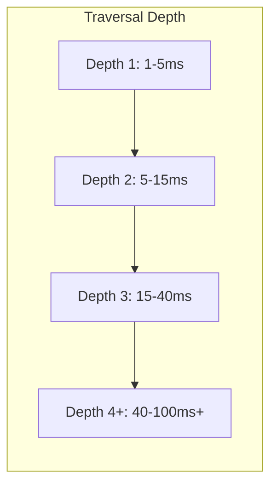

**Mitigation strategies**:

1. **Depth limits**: Cap traversal at 3-4 levels (configurable per schema)
2. **Denormalization**: Store flattened group memberships (like Zanzibar's Leopard system)
3. **Eager evaluation**: Pre-compute inherited roles on grant/revoke
4. **Parallel traversal**: Traverse multiple relations concurrently

### Revocation Propagation

Revocation creates a tradeoff between **consistency** and **performance**:

| Approach         | Propagation Time | Performance Impact       | Use Case              |
| ---------------- | ---------------- | ------------------------ | --------------------- |
| Immediate (sync) | <1s              | High (blocks on network) | Financial, healthcare |
| Near-real-time   | 1-30s            | Medium (background sync) | Collaboration tools   |
| Eventual         | 1-60min          | Low (batch sync)         | Content sharing       |

**xNet recommendation**: Default to near-real-time (30s) with option for immediate revocation on sensitive schemas.

### Benchmarking Targets

Before implementation, establish baseline benchmarks:

| Operation              | Target P50 | Target P99 | Measurement Point   |
| ---------------------- | ---------- | ---------- | ------------------- |
| `store.can()` (cached) | <1ms       | <5ms       | Local, warm cache   |
| `store.can()` (cold)   | <10ms      | <50ms      | Local, cache miss   |
| `store.grant()`        | <20ms      | <100ms     | Local + hub sync    |
| `store.revoke()`       | <20ms      | <100ms     | Local + hub sync    |
| Hub UCAN verify        | <5ms       | <20ms      | Hub connection      |
| Hub change auth        | <1ms       | <5ms       | Per-change (cached) |

### Performance vs. Security Tradeoffs

| Decision                                  | Performance        | Security              | Recommendation                          |
| ----------------------------------------- | ------------------ | --------------------- | --------------------------------------- |
| Cache permission results                  | ✅ Faster          | ⚠️ Stale results      | Cache with short TTL (5-30s)            |
| Verify UCAN per-connection vs per-request | ✅ Much faster     | ⚠️ Delayed revocation | Per-connection + periodic recheck       |
| Limit traversal depth                     | ✅ Bounded latency | ⚠️ Less expressive    | Limit to 4, allow override              |
| Pre-compute group membership              | ✅ O(1) lookup     | ⚠️ Storage overhead   | Yes, for groups >100 members            |
| Batch permission checks                   | ✅ Amortized cost  | ✅ Same security      | Yes, use `CheckBulkPermissions` pattern |

### Implementation Priorities

Based on performance analysis, prioritize:

1. **Phase 1**: Local permission cache with TTL-based invalidation
2. **Phase 2**: UCAN verification cache (avoid re-verifying same token)
3. **Phase 3**: Relation traversal with depth limits
4. **Phase 4**: Hub-side connection-level auth (not per-change)
5. **Phase 5**: Denormalized group membership for large groups
6. **Phase 6**: Pre-computed permission materialization (optional, for scale)

### Monitoring & Observability

Track these metrics to identify performance issues:

```typescript
// Key metrics to instrument
interface AuthMetrics {
  // Latency histograms
  permissionCheckLatency: Histogram // P50, P95, P99
  ucanVerificationLatency: Histogram
  relationTraversalLatency: Histogram

  // Cache effectiveness
  permissionCacheHitRate: Gauge // Target: >80%
  ucanCacheHitRate: Gauge // Target: >90%

  // Throughput
  permissionChecksPerSecond: Counter
  grantsPerSecond: Counter
  revocationsPerSecond: Counter

  // Errors
  permissionDenials: Counter // Track for abuse detection
  ucanVerificationFailures: Counter
  traversalDepthExceeded: Counter
}
```

## Open Questions

1. **Permission expression complexity**: How complex should the DSL be? Should we support arbitrary boolean logic, or keep it simple with predefined patterns?

2. **Performance at scale**: With deep relation chains, permission evaluation could be expensive. Should we limit traversal depth? Pre-compute permissions?

3. **Revocation propagation**: How quickly must revocations propagate? Is eventual consistency acceptable for all use cases?

4. **Public sharing**: How do we handle truly public nodes (no auth required)? Special `public` role? Separate sync mechanism?

5. **Group management**: Should groups be first-class nodes with their own schemas? How do group memberships sync?

6. **Audit logging**: Should we log all permission checks? All grants/revokes? How do we handle audit in a decentralized system?

7. **Migration path**: How do we migrate existing nodes that have no permission metadata? Default to owner-only? Public?

## Conclusion

This design transforms xNet's dormant UCAN infrastructure into a powerful, developer-friendly authorization system. By integrating permissions directly into schemas and leveraging the existing relation system for inheritance, we create an authorization model that is:

- **Intuitive**: Developers declare permissions in schemas, not scattered code
- **Powerful**: Relationship-based permissions with delegation chains
- **Decentralized**: Works offline with UCAN tokens
- **Type-safe**: Permission expressions validated at schema definition time

The implementation is incremental: each phase delivers standalone value while building toward the complete vision. Phase 1 (UCAN fixes) is a prerequisite, but Phases 2-7 can be parallelized to some degree.

## References

- [UCAN Specification](https://ucan.xyz/specification/)
- [ElectricSQL Auth Guide](https://electric-sql.com/docs/guides/auth)
- [ElectricSQL Shapes Guide](https://electric-sql.com/docs/guides/shapes)
- [Supabase Row Level Security](https://supabase.com/docs/guides/database/postgres/row-level-security)
- [Supabase Custom Claims & RBAC](https://supabase.com/docs/guides/database/postgres/custom-claims-and-role-based-access-control-rbac)
- [Convex Authentication](https://docs.convex.dev/auth)
- [Convex Row Level Security](https://stack.convex.dev/row-level-security)
- [SpiceDB Schema Language](https://authzed.com/docs/spicedb/concepts/schema)
- [Google Zanzibar Paper](https://research.google/pubs/pub48190/)
- [Exploration 0040: First-Class Relations](./0040_FIRST_CLASS_RELATIONS.md)
- [Exploration 0025: Yjs Security Analysis](./0025_YJS_SECURITY_ANALYSIS.md)
