# Authorization API Design V2: Schema-Integrated Permissions for Local-First Apps

> A unified authorization system that integrates permissions into xNet's schema layer, enforces access at the node level, and works offline-first with UCAN delegation chains.

**Date**: February 2026  
**Status**: Exploration  
**Supersedes**: [0076_AUTHORIZATION_API_DESIGN.md](./0076_[_]_AUTHORIZATION_API_DESIGN.md)

---

## Executive Summary

xNet has working UCAN token functions that are never called at runtime. This exploration designs a **unified authorization API** that activates this dormant infrastructure through:

1. **Schema-integrated permissions** — Declare who can do what directly in `defineSchema()`
2. **Two-layer access control** — Schemas define policy; nodes store grants
3. **Relationship-aware inheritance** — Permissions flow through the graph
4. **UCAN delegation chains** — Cryptographic, offline-capable sharing
5. **Simple developer API** — `store.can()`, `store.grant()`, `useCan()` hooks

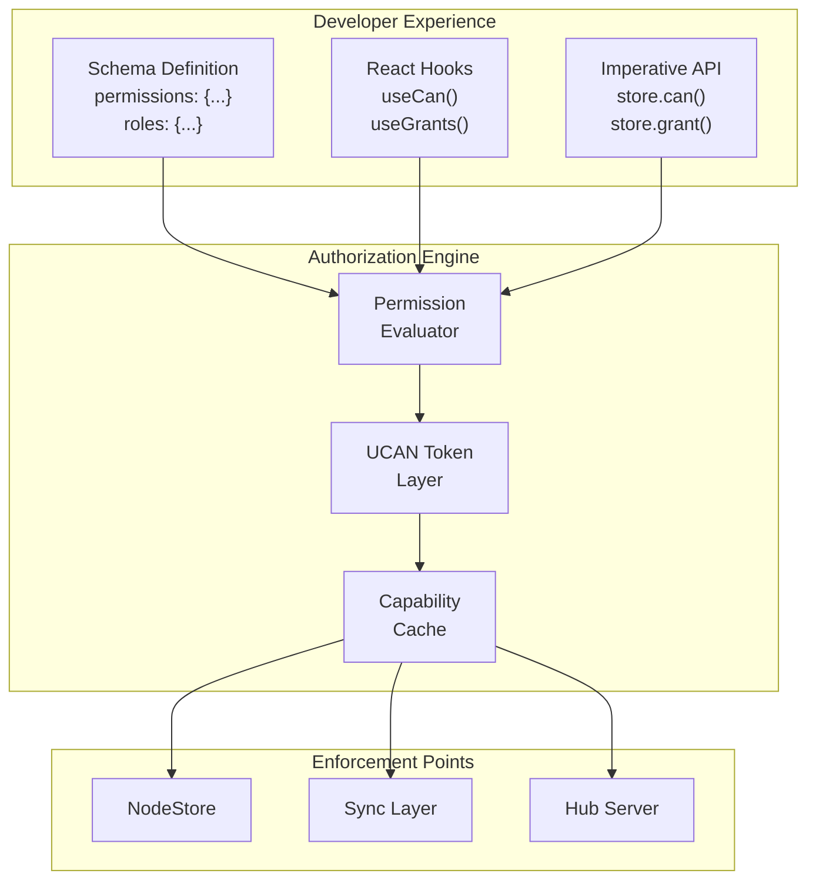

---

## Part 1: Current State

### What Works Today

**Identity & Signing (Fully Enforced)**

- Every user has an Ed25519 keypair → `did:key:z6Mk...` identity
- Every `Change<NodePayload>` is signed and verified
- Every Yjs update is wrapped in a signed envelope

**UCAN Functions (Implemented, Never Called)**

```typescript
// These exist in @xnet/identity but nothing invokes them
createUCAN({ issuer, issuerKey, audience, capabilities, expiration })
verifyUCAN(token)
hasCapability(token, resource, action)
```

**Permission Types (Defined, No Implementation)**

```typescript
// Types exist in @xnet/core with zero consumers
interface PermissionEvaluator {
  hasCapability(did: DID, action: string, resource: string): boolean
}
```

### The Gap

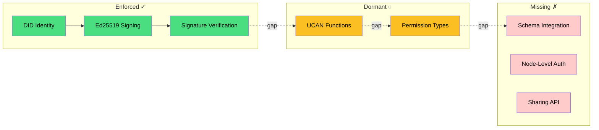

The gap: signatures prove _who_ made a change, but nothing checks _whether they're allowed to_.

---

## Part 2: Core Design

### The Two-Layer Model

A critical insight: **schemas define policy, nodes store grants**. This separation enables developers to define permission rules while users control access to specific resources.

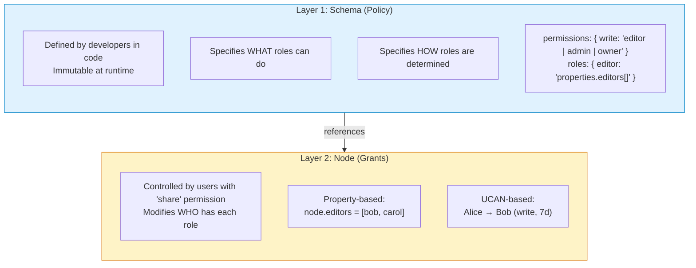

**Layer 1 (Schema)** — Developer-defined, immutable at runtime:

- Specifies WHAT roles can do: `permissions: { write: 'editor | admin | owner' }`
- Specifies HOW roles are determined: `roles: { editor: 'properties.editors[]' }`

**Layer 2 (Node)** — User-controlled via `share` permission:

- Property-based: `node.editors = [did:key:bob, did:key:carol]`
- UCAN-based: `Alice → Bob (write, expires 7d)`

### Schema-Level Permissions

Permissions are declared directly in schema definitions:

```typescript
const TaskSchema = defineSchema({
  name: 'Task',
  namespace: 'xnet://xnet.fyi/',

  properties: {
    title: text({ required: true }),
    status: select({ options: ['todo', 'doing', 'done'] }),
    assignee: person(),
    project: relation({ target: 'xnet://xnet.fyi/Project' }),
    editors: person({ multiple: true })
  },

  // WHO can perform each action
  permissions: {
    read: 'viewer | editor | admin | owner',
    write: 'editor | admin | owner',
    delete: 'admin | owner',
    share: 'admin | owner',
    complete: 'assignee | editor | admin | owner' // Custom action
  },

  // HOW each role is determined
  roles: {
    owner: 'createdBy', // Node creator
    assignee: 'properties.assignee', // Person property
    editor: 'properties.editors[] | project->editor', // Property OR inherited
    admin: 'project->admin', // Inherited from relation
    viewer: 'project->viewer | public' // Inherited OR public
  }
})
```

### Permission Expression Language

A simple DSL for expressing permission rules:

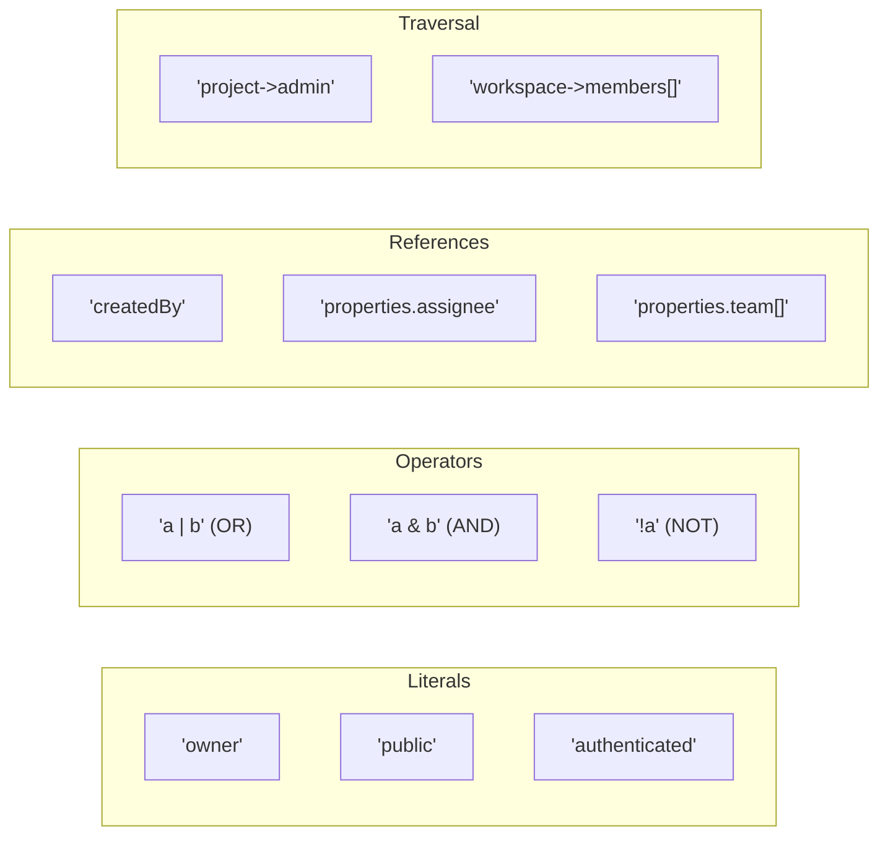

| Expression               | Meaning                            |
| ------------------------ | ---------------------------------- |
| `'owner'`                | Has the owner role                 |
| `'public'`               | Anyone (no auth required)          |
| `'authenticated'`        | Any authenticated user             |
| `'owner \| editor'`      | Owner OR editor                    |
| `'editor & verified'`    | Editor AND verified                |
| `'!banned'`              | NOT banned                         |
| `'createdBy'`            | Node's createdBy field             |
| `'properties.assignee'`  | Person property value              |
| `'properties.team[]'`    | Any match in multi-person property |
| `'project->admin'`       | Admin of related project           |
| `'workspace->members[]'` | Any member of related workspace    |

### Action Hierarchy

Actions form a hierarchy where broader actions include narrower ones:

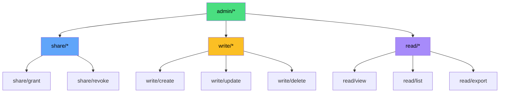

### Granting Access

Users with `share` permission can grant access via two mechanisms:

**Option 1: Property-Based Grants**

```typescript
// Add Bob to the editors property
await store.update(taskId, {
  editors: [...currentEditors, bobDid]
})
// Bob is now an editor because he's in properties.editors
```

**Option 2: UCAN-Based Grants**

```typescript
// Create a delegation token
await store.grant({
  to: bobDid,
  action: 'write',
  resource: taskId,
  expiresIn: '7d'
})
// Bob has write access via UCAN (doesn't modify node properties)
```

| Aspect         | Property-Based          | UCAN-Based                      |
| -------------- | ----------------------- | ------------------------------- |
| **Storage**    | In node properties      | Separate token store            |
| **Visibility** | Visible to readers      | Private to grantor/grantee      |
| **Expiration** | Permanent until removed | Built-in expiration             |
| **Delegation** | Cannot be re-delegated  | Can be attenuated and passed on |
| **Revocation** | Remove from property    | Publish revocation record       |
| **Use case**   | Team membership         | Temporary/external sharing      |

### Complete Sharing Flow

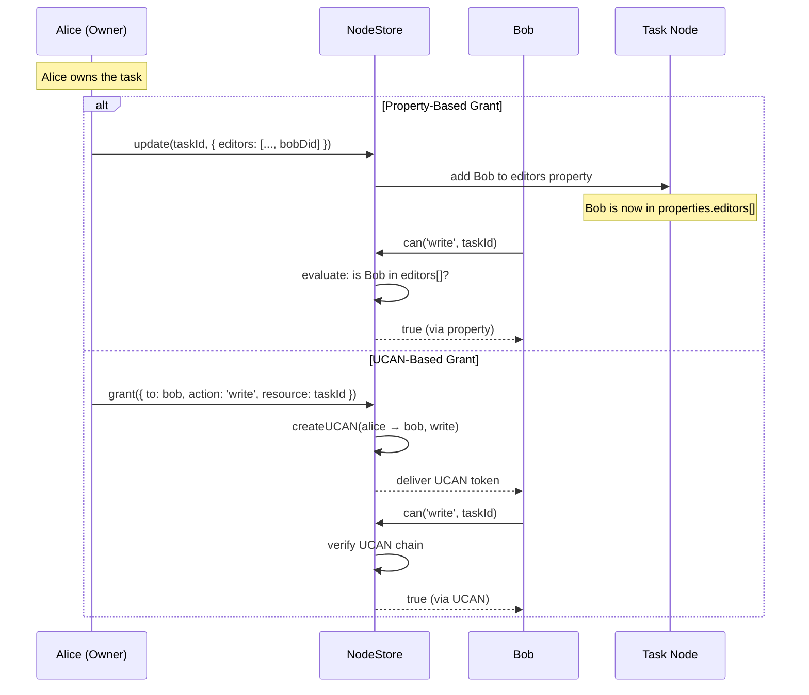

### Relationship-Based Inheritance

Permissions flow through the graph via relations:

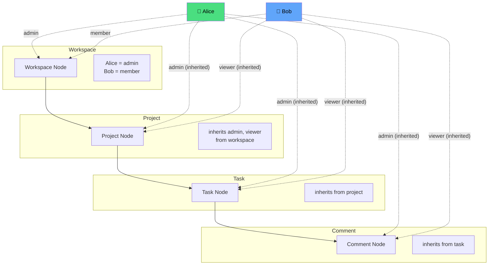

**Result:**

- Alice is admin of everything (inherited through the chain)
- Bob can view projects, tasks, comments (member → viewer inheritance)

Schema definition for inheritance:

```typescript
const ProjectSchema = defineSchema({
  properties: {
    workspace: relation({ target: WorkspaceSchema }),
    editors: person({ multiple: true })
  },
  roles: {
    admin: 'workspace->admin', // Inherit admin from workspace
    editor: 'properties.editors[] | workspace->admin',
    viewer: 'workspace->member' // Workspace members can view
  }
})
```

---

## Part 3: Developer API

### Core Permission API

```typescript
interface NodeStore {
  // Check if current user can perform action
  can(action: string, nodeId: NodeId): Promise<boolean>

  // Check with specific DID
  canAs(did: DID, action: string, nodeId: NodeId): Promise<boolean>

  // Grant permission (creates UCAN)
  grant(options: GrantOptions): Promise<Grant>

  // Revoke permission
  revoke(grantId: string): Promise<void>

  // List grants for a node
  listGrants(nodeId: NodeId): Promise<Grant[]>
}

interface GrantOptions {
  to: DID
  action: string | string[]
  resource: NodeId | SchemaIRI
  expiresIn?: string | number // '7d', '1h', or timestamp
}
```

### React Hooks

```typescript
// Check permissions for a node
const { canRead, canWrite, canDelete, canShare } = useCan(taskId)

// Check specific permission
const { allowed, loading } = usePermission('complete', taskId)

// Manage grants
const { grants, grant, revoke } = useGrants(taskId)
```

**Usage Example:**

```tsx
function TaskCard({ taskId }: { taskId: NodeId }) {
  const task = useNode(TaskSchema, taskId)
  const { canWrite, canDelete, canShare } = useCan(taskId)

  return (
    <div>
      <h3>{task.title}</h3>
      {canWrite && <EditButton />}
      {canDelete && <DeleteButton />}
      {canShare && <ShareButton />}
    </div>
  )
}

function ShareDialog({ nodeId }: { nodeId: NodeId }) {
  const { grants, grant, revoke } = useGrants(nodeId)

  const handleShare = async (did: DID, permission: string) => {
    await grant({ to: did, action: permission, resource: nodeId })
  }

  return (
    <div>
      <h4>Shared with</h4>
      {grants.map((g) => (
        <GrantRow key={g.id} grant={g} onRevoke={() => revoke(g.id)} />
      ))}
      <ShareForm onShare={handleShare} />
    </div>
  )
}
```

### Permission Presets

Common patterns as reusable presets:

```typescript
const TaskSchema = defineSchema({
  name: 'Task',
  permissions: permissions.collaborative({
    inherit: 'project',
    roles: { assignee: 'properties.assignee' },
    custom: { complete: 'assignee | editor | admin | owner' }
  })
})

// Available presets
permissions.private() // Only owner can access
permissions.publicRead() // Anyone can read, owner can write
permissions.collaborative({ inherit, roles, custom })
permissions.open() // Anyone can read/write, owner can delete
```

---

## Part 4: Enforcement

### Where Permissions Are Checked

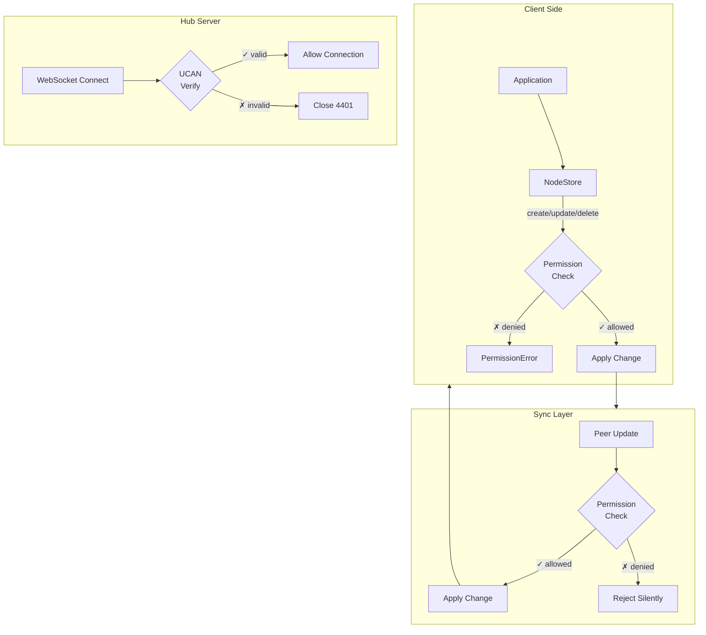

| Layer          | What's Checked  | When                         |
| -------------- | --------------- | ---------------------------- |
| **NodeStore**  | CRUD operations | Every create/update/delete   |
| **Sync Layer** | Remote changes  | Before applying peer updates |
| **Hub Server** | Connection auth | WebSocket handshake          |

### NodeStore Enforcement

```typescript
class NodeStore {
  async update(id: NodeId, options: UpdateNodeOptions): Promise<NodeState> {
    const canWrite = await this.permissionEvaluator.can(this.authorDID, 'write/update', id)
    if (!canWrite) {
      throw new PermissionError('Cannot update this node')
    }
    // ... proceed with update
  }

  async applyRemoteChange(change: NodeChange): Promise<void> {
    const canWrite = await this.permissionEvaluator.can(
      change.authorDID,
      'write/update',
      change.payload.nodeId
    )
    if (!canWrite) {
      console.warn(`Rejected change from ${change.authorDID}: no permission`)
      return // Silently reject unauthorized changes
    }
    // ... apply change
  }
}
```

### Hub Server Enforcement

```typescript
const authenticateConnection = async (ws: WebSocket, req: Request) => {
  const token = getTokenFromRequest(req)

  const result = verifyUCAN(token)
  if (!result.valid) {
    ws.close(4401, `Invalid UCAN: ${result.error}`)
    return null
  }

  // Verify audience matches this hub
  if (result.payload.aud !== hubDid) {
    ws.close(4401, 'UCAN audience mismatch')
    return null
  }

  return {
    did: result.payload.iss,
    capabilities: getCapabilities(result.payload)
  }
}
```

---

## Part 5: UCAN Integration

### How It Works Under the Hood

The high-level API (`store.grant()`, `store.can()`) generates and validates UCANs transparently:

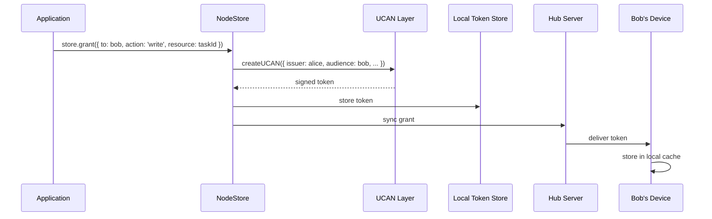

### Delegation Chains

UCAN enables transitive sharing with automatic attenuation:

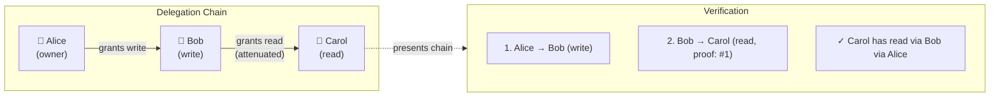

**Attenuation rule:** Bob can write, but when delegating to Carol, can only grant permissions ≤ write. Carol receives read access (attenuated from write).

When Carol reads the task, she presents the full chain:

1. Alice → Bob (write)
2. Bob → Carol (read, proof: #1)

The system verifies: Carol has read via Bob via Alice.

### Revocation

```typescript
// Revoke a grant
await store.revoke(grantId)
```

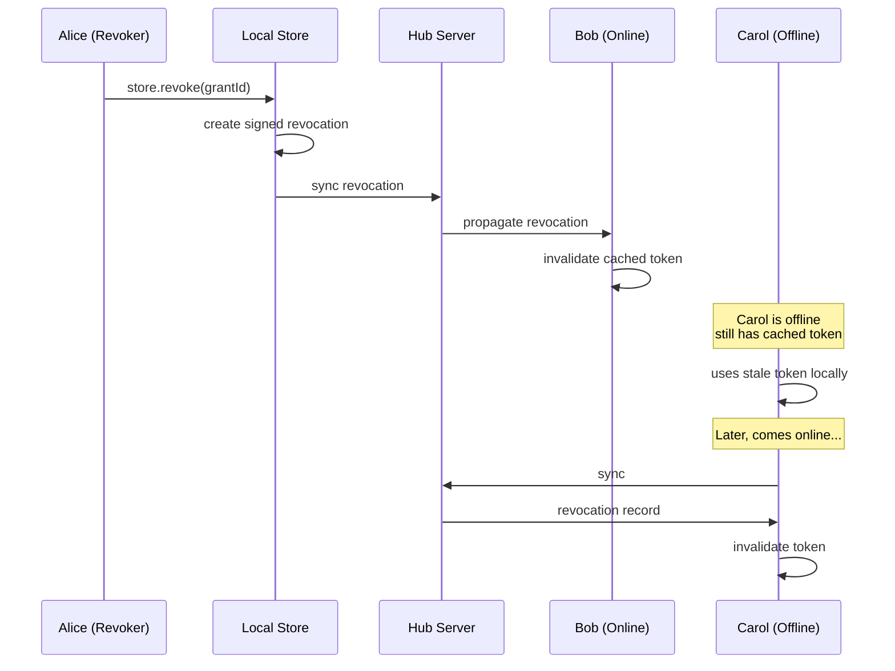

Revocation is **eventually consistent** — offline peers may use stale tokens until they sync.

---

## Part 6: Offline-First Considerations

### Capability Caching

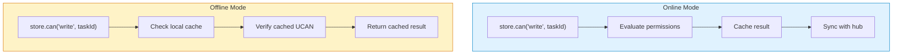

All permission checks work offline using cached data:

| Cache Layer        | Contents                               | TTL              |
| ------------------ | -------------------------------------- | ---------------- |
| Permission results | `can(did, action, nodeId) → boolean`   | 5-60s            |
| Role membership    | `hasRole(did, role, nodeId) → boolean` | 30-300s          |
| UCAN tokens        | Parsed/verified tokens                 | Until expiration |
| Revocations        | Token hashes that are revoked          | Until sync       |

### Eventual Consistency Tradeoffs

| Scenario                      | Behavior                                       |
| ----------------------------- | ---------------------------------------------- |
| **Grant while offline**       | Works locally; syncs when online               |
| **Revoke while offline**      | Works locally; peers see revocation after sync |
| **Use revoked token offline** | Works until peer syncs revocation              |
| **Conflict: grant + revoke**  | Revocation wins (conservative)                 |

**Recommendation:** Default to 30-second revocation propagation. Sensitive schemas can opt into immediate revocation (blocks on network).

---

## Part 7: Performance

### Permission Check Flow

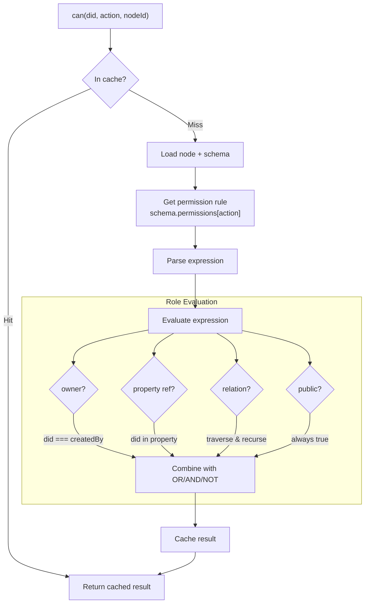

### Latency Targets

| Operation              | Target P50 | Target P99 |
| ---------------------- | ---------- | ---------- |
| `store.can()` (cached) | <1ms       | <5ms       |
| `store.can()` (cold)   | <10ms      | <50ms      |
| `store.grant()`        | <20ms      | <100ms     |
| Hub UCAN verify        | <5ms       | <20ms      |

### Relation Traversal Depth

Deep inheritance chains are the primary performance concern:

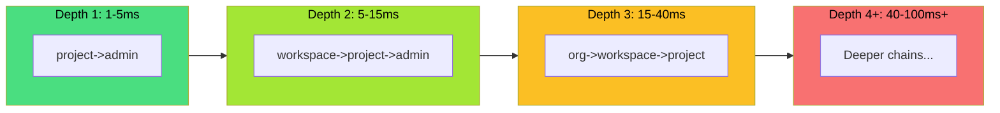

| Depth | Latency   | Example                          |
| ----- | --------- | -------------------------------- |
| 1     | 1-5ms     | `project->admin`                 |
| 2     | 5-15ms    | `workspace->project->admin`      |
| 3     | 15-40ms   | `org->workspace->project->admin` |
| 4+    | 40-100ms+ | Deeper chains                    |

**Mitigations:**

- Cap traversal at 3-4 levels (configurable)
- Pre-compute inherited roles on grant/revoke
- Parallel traversal of multiple relations

### Caching Strategy

Based on Google Zanzibar patterns:

- **Permission cache hit rate target:** >80%
- **UCAN verification cache hit rate target:** >90%
- **Memory overhead:** ~2MB per 10K nodes

---

## Part 8: Type Safety

### What TypeScript Can Validate

| Validation                               | Feasibility | Technique                |
| ---------------------------------------- | ----------- | ------------------------ |
| Role name exists in `roles`              | Yes         | Template literal + keyof |
| Property name exists                     | Yes         | Mapped types + keyof     |
| Property is correct type                 | Yes         | Conditional types        |
| Simple expressions (`'owner \| editor'`) | Yes         | Template literal unions  |
| Cross-schema role inheritance            | Partial     | Requires schema registry |
| Arbitrary-depth expressions              | No          | Recursive limits         |

### Recommended Approach: Hybrid Validation

**Compile-time (TypeScript):**

- Validate property/role names exist
- Validate property types match usage
- Provide autocomplete

**Runtime (Schema Registration):**

- Parse complex expressions
- Detect circular definitions
- Validate cross-schema references

**API Design for Maximum Type Safety:**

```typescript
// Simple cases: string literals (validated via template types)
permissions: {
  read: 'public',
  delete: 'owner',
}

// Complex cases: builder functions (fully typed)
permissions: {
  write: or('editor', 'admin', 'owner'),
  share: inherit('project', 'admin'),
}
```

---

## Part 9: Comparison with Alternatives

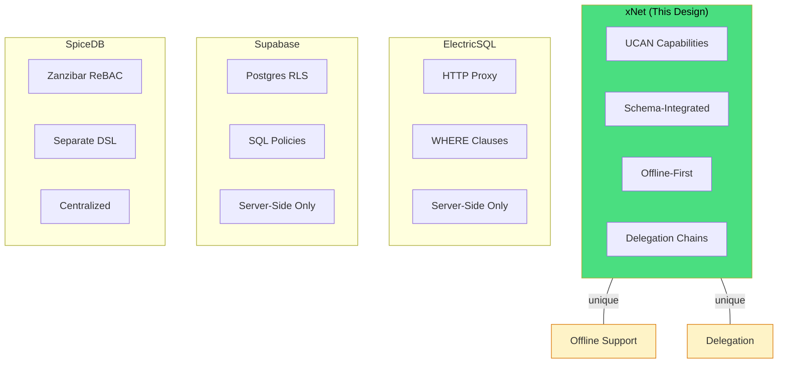

| Feature                | xNet              | ElectricSQL      | Supabase     | Convex     | SpiceDB        |
| ---------------------- | ----------------- | ---------------- | ------------ | ---------- | -------------- |
| **Auth model**         | UCAN capabilities | HTTP proxy       | Postgres RLS | Code-based | Zanzibar ReBAC |
| **Schema integration** | Native            | None             | SQL policies | Manual     | Separate DSL   |
| **Offline support**    | Full              | None             | None         | None       | None           |
| **Delegation**         | UCAN chains       | None             | None         | None       | None           |
| **Relation-aware**     | Yes (graph)       | Yes (subqueries) | Yes (JOINs)  | Manual     | Yes (native)   |
| **Revocation**         | Eventual          | Immediate        | Immediate    | Immediate  | Immediate      |

### Key Insights from Each System

- **ElectricSQL:** Shapes + WHERE clauses are elegant for row filtering
- **Supabase:** RLS policies are battle-tested; `auth.uid()` helpers are a good model
- **Convex:** Code-first is flexible but requires discipline; xNet can't rely on server-side checks alone
- **SpiceDB:** Relationship-based model (`user:alice#member@group:eng`) is the gold standard for ReBAC

---

## Part 10: Implementation Roadmap

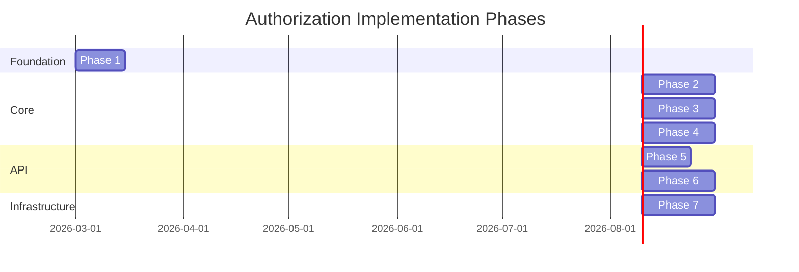

### Phase 1: UCAN Foundation (1-2 weeks)

- [ ] Fix UCAN signature format (JWT spec compliance)
- [ ] Implement proof chain validation
- [ ] Add attenuation checking
- [ ] Comprehensive test suite

### Phase 2: Permission Evaluator (2-3 weeks)

- [ ] Implement `PermissionEvaluator` class
- [ ] Permission expression parser
- [ ] Role resolution (property refs, relation traversal)
- [ ] Capability caching

### Phase 3: Schema Integration (2-3 weeks)

- [ ] Add `permissions` and `roles` to `defineSchema()`
- [ ] Permission presets
- [ ] Relation-level permissions
- [ ] Schema validation

### Phase 4: NodeStore Enforcement (2-3 weeks)

- [ ] Integrate permission checks in CRUD
- [ ] Remote change authorization
- [ ] Permission error handling

### Phase 5: React Hooks (1-2 weeks)

- [ ] `useCan()` hook
- [ ] `usePermission()` hook
- [ ] `useGrants()` hook

### Phase 6: Sharing API (2-3 weeks)

- [ ] `store.grant()` / `store.revoke()`
- [ ] Share link generation
- [ ] Revocation sync

### Phase 7: Hub Integration (2-3 weeks)

- [ ] UCAN authentication for WebSocket
- [ ] Room-level access control
- [ ] Revocation propagation

---

## Open Questions

1. **Expression complexity:** How complex should the DSL be? Arbitrary boolean logic or predefined patterns only?

2. **Public sharing:** How do truly public nodes work? Special `public` role? Separate sync mechanism?

3. **Group management:** Should groups be first-class nodes with their own schemas?

4. **Audit logging:** Should we log all permission checks? How in a decentralized system?

5. **Migration:** How do existing nodes without permission metadata behave? Default to owner-only?

---

## Conclusion

This design activates xNet's dormant UCAN infrastructure through schema-integrated permissions. The two-layer model (schema policy + node grants) provides both developer control and user flexibility. Relationship-based inheritance leverages the existing graph structure. UCAN delegation enables offline-capable, cryptographically-verified sharing.

The result is an authorization system that is:

- **Intuitive** — Permissions declared in schemas, not scattered code
- **Powerful** — Relationship-based with delegation chains
- **Decentralized** — Works offline with UCAN tokens
- **Type-safe** — Validated at schema definition time

---

## References

- [UCAN Specification](https://ucan.xyz/specification/)
- [ElectricSQL Auth Guide](https://electric-sql.com/docs/guides/auth)
- [Supabase Row Level Security](https://supabase.com/docs/guides/database/postgres/row-level-security)
- [Convex Authentication](https://docs.convex.dev/auth)
- [SpiceDB Schema Language](https://authzed.com/docs/spicedb/concepts/schema)
- [Google Zanzibar Paper](https://research.google/pubs/pub48190/)
- [Exploration 0040: First-Class Relations](./0040_[_]_FIRST_CLASS_RELATIONS.md)
- [Exploration 0025: Yjs Security Analysis](./0025_[x]_YJS_SECURITY_ANALYSIS.md)
