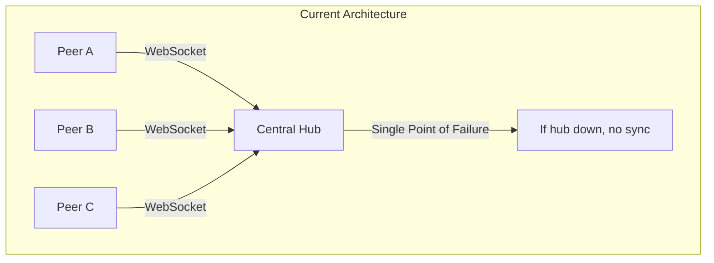
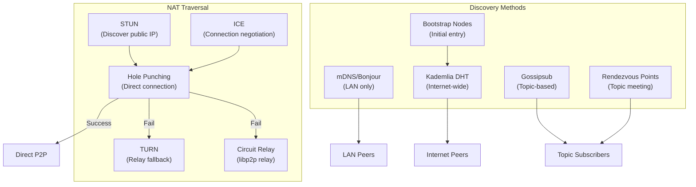
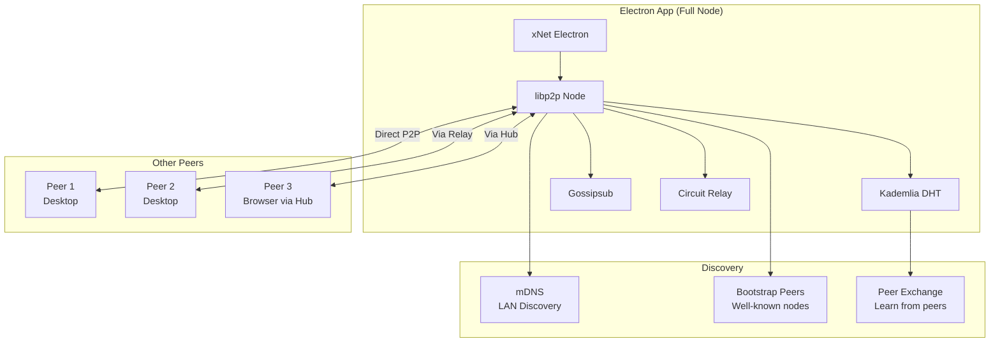
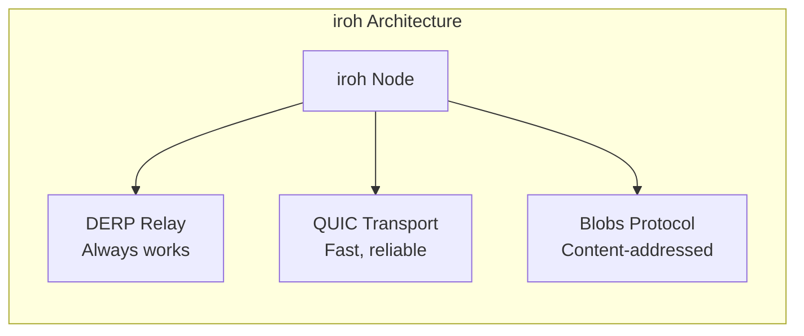
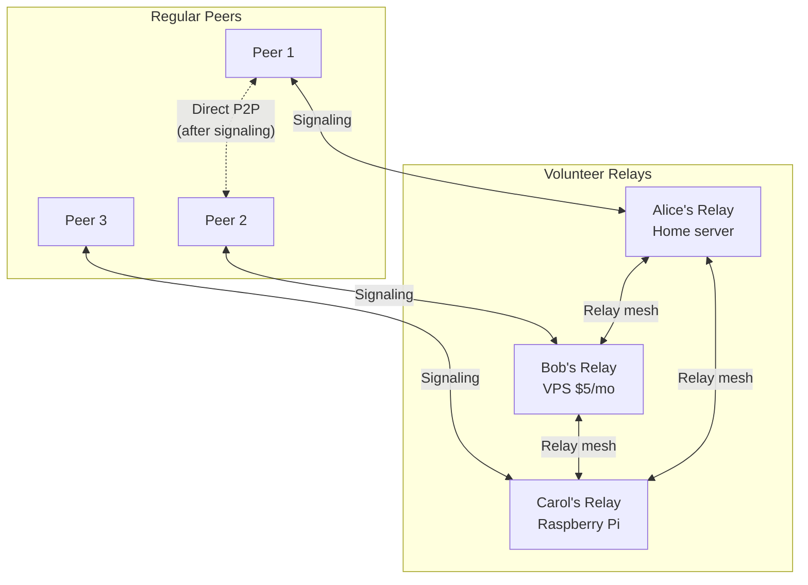
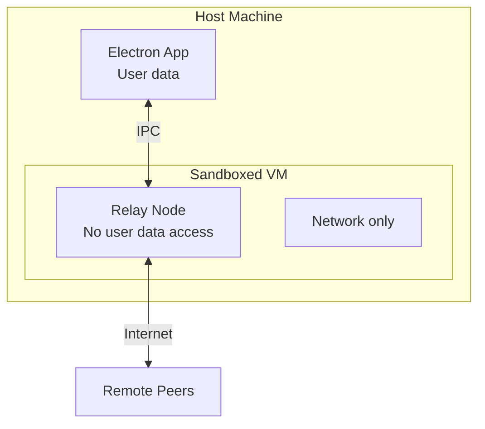
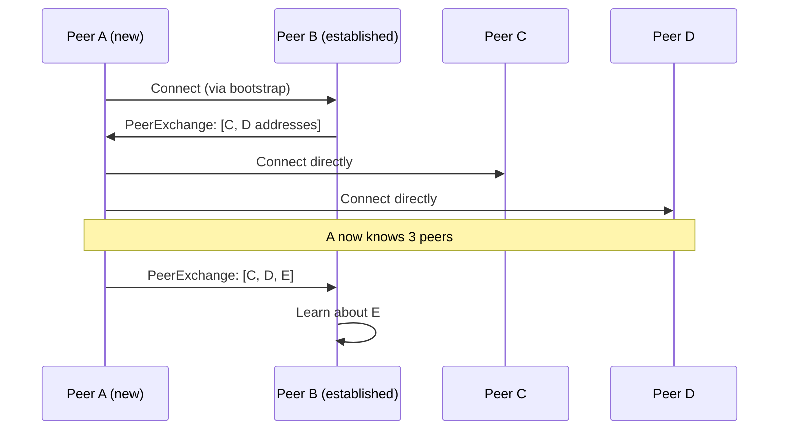
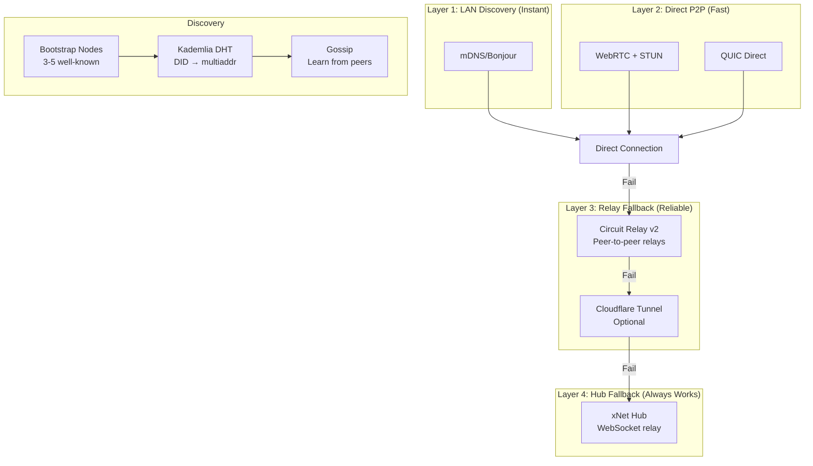
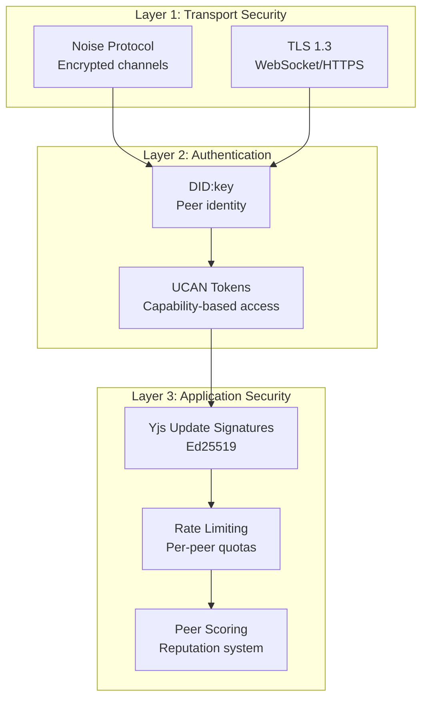

# 0078 - Truly P2P Discovery and Routing

> **Status:** Exploration
> **Tags:** P2P, libp2p, WebRTC, DHT, gossip, NAT traversal, decentralization, Electron
> **Created:** 2026-02-08
> **Context:** xNet currently relies on a central hub for signaling and sync relay. This exploration investigates how to make the system truly peer-to-peer, where Electron desktop apps can act as discoverable nodes on the public internet, route peers to one another, and operate without any central infrastructure.

## Executive Summary

This exploration examines multiple approaches to achieving truly decentralized peer discovery and routing in xNet. The goal is to enable Electron desktop apps to:

1. **Be discoverable** on the public internet without a central signaling server
2. **Route peers** to one another (act as relay nodes)
3. **Operate securely** without compromising user machines
4. **Work without domains** or complex infrastructure setup

We analyze options ranging from fully decentralized (DHT + gossip) to hybrid approaches (user-run relays, Cloudflare tunnels) and provide concrete recommendations for implementation.

---

## The Problem



**Current limitations:**

| Issue                          | Impact                                   |
| ------------------------------ | ---------------------------------------- |
| Hub is single point of failure | No sync when hub is offline              |
| Hub sees all traffic           | Privacy concern for sensitive data       |
| Hub requires infrastructure    | Cost, maintenance, centralization        |
| No LAN discovery               | Same-office peers route through internet |
| No peer-to-peer routing        | All traffic flows through hub            |

**Goal:** Enable xNet to work like BitTorrent or IPFS — peers can find each other and communicate without any central server.

---

## Landscape Analysis

### Existing P2P Discovery Mechanisms



### What xNet Already Has

From the codebase analysis:

| Component            | Location                                    | Status             |
| -------------------- | ------------------------------------------- | ------------------ |
| libp2p node factory  | `packages/network/src/node.ts`              | Dormant (not used) |
| WebRTC transport     | `@libp2p/webrtc` in deps                    | Installed, unused  |
| Kademlia DHT         | `@libp2p/kad-dht` in deps                   | Installed, unused  |
| Circuit relay        | `@libp2p/circuit-relay-v2` in deps          | Installed, unused  |
| y-webrtc provider    | `packages/network/src/providers/ywebrtc.ts` | Dormant            |
| Custom sync protocol | `packages/network/src/protocols/sync.ts`    | Dormant            |
| WebSocket signaling  | `packages/hub/src/services/signaling.ts`    | Active             |

**Key insight:** The infrastructure for P2P is already scaffolded in `@xnet/network`. It just needs to be activated and integrated.

---

## Option 1: Full libp2p Stack (Recommended for Desktop)

### Architecture



### How It Works

1. **Bootstrap:** On startup, connect to well-known bootstrap nodes (could be community-run or xNet-operated)
2. **DHT Join:** Participate in Kademlia DHT to discover peers by topic/DID
3. **mDNS:** Simultaneously discover LAN peers without internet
4. **Gossipsub:** Subscribe to workspace topics for real-time updates
5. **Hole Punching:** Attempt direct connections using STUN/ICE
6. **Circuit Relay:** Fall back to relay through other peers if direct fails

### Implementation

```typescript
// packages/network/src/node.ts (enhanced)
import { noise } from '@chainsafe/libp2p-noise'
import { yamux } from '@chainsafe/libp2p-yamux'
import { bootstrap } from '@libp2p/bootstrap'
import { circuitRelayTransport, circuitRelayServer } from '@libp2p/circuit-relay-v2'
import { dcutr } from '@libp2p/dcutr' // Direct Connection Upgrade through Relay
import { identify } from '@libp2p/identify'
import { kadDHT } from '@libp2p/kad-dht'
import { mdns } from '@libp2p/mdns'
import { gossipsub } from '@chainsafe/libp2p-gossipsub'
import { webRTC, webRTCDirect } from '@libp2p/webrtc'
import { webSockets } from '@libp2p/websockets'
import { tcp } from '@libp2p/tcp' // Electron can use TCP
import { createLibp2p } from 'libp2p'

export interface P2PNodeConfig {
  did: string
  privateKey: Uint8Array
  bootstrapPeers: string[]
  enableRelay: boolean // Act as relay for others
  enableDHT: boolean
  listenAddresses: string[]
}

export async function createP2PNode(config: P2PNodeConfig) {
  const node = await createLibp2p({
    addresses: {
      listen: config.listenAddresses
    },
    transports: [
      tcp(), // Direct TCP (Electron only)
      webSockets(), // WebSocket for browser compat
      webRTC(), // WebRTC for NAT traversal
      webRTCDirect(), // Direct WebRTC without signaling
      circuitRelayTransport({
        discoverRelays: 1 // Find relay nodes
      })
    ],
    connectionEncrypters: [noise()],
    streamMuxers: [yamux()],
    peerDiscovery: [
      mdns(), // LAN discovery
      bootstrap({ list: config.bootstrapPeers })
    ],
    services: {
      identify: identify(),
      dht: kadDHT({
        clientMode: false // Full DHT participant
      }),
      pubsub: gossipsub({
        emitSelf: false,
        gossipIncoming: true,
        fallbackToFloodsub: true
      }),
      relay: config.enableRelay
        ? circuitRelayServer({
            reservations: {
              maxReservations: 128,
              reservationTtl: 60 * 60 * 1000 // 1 hour
            }
          })
        : undefined,
      dcutr: dcutr() // Hole punching
    }
  })

  await node.start()
  return node
}
```

### Pros & Cons

| Pros                             | Cons                            |
| -------------------------------- | ------------------------------- |
| Truly decentralized              | Heavy bundle (~500KB)           |
| Battle-tested (IPFS uses it)     | Complex to debug                |
| Works offline (LAN)              | Browser support limited         |
| Peers can relay for each other   | Requires bootstrap nodes        |
| No central infrastructure needed | NAT traversal not 100% reliable |

### Security Considerations

- **Sandboxing:** libp2p runs in Electron's main process with full Node.js access
- **Resource limits:** Configure max connections, bandwidth limits
- **Peer scoring:** Use gossipsub peer scoring to penalize misbehaving peers
- **UCAN authentication:** Require valid UCAN tokens for workspace access

---

## Option 2: iroh (Rust-based Alternative)

### What is iroh?

[iroh](https://iroh.computer/) is a modern alternative to libp2p, built in Rust with a focus on simplicity and reliability.



### Key Differences from libp2p

| Aspect             | libp2p                       | iroh                      |
| ------------------ | ---------------------------- | ------------------------- |
| Language           | JS-native + Rust bindings    | Rust + WASM/NAPI bindings |
| Transport          | WebRTC, TCP, WebSocket, QUIC | QUIC only                 |
| NAT traversal      | ICE + STUN + TURN            | DERP relay (always works) |
| Content addressing | CID (multihash)              | BLAKE3 (matches xNet!)    |
| Browser support    | Limited WebRTC               | Not yet (planned)         |
| Bundle size        | ~500KB                       | ~200KB (WASM)             |
| Complexity         | High (many abstractions)     | Low (focused API)         |

### Why iroh is Interesting for xNet

1. **BLAKE3 alignment:** xNet already uses BLAKE3 everywhere; iroh does too
2. **DERP relay:** iroh's relay protocol is simpler and more reliable than TURN
3. **QUIC transport:** Faster and more reliable than WebRTC
4. **Simpler API:** Fewer abstractions to understand

### The Catch

**No browser support yet.** iroh is Electron/Node.js only for now. This means:

- Desktop apps: iroh works great
- Web app: Still needs hub or WebSocket bridge
- Mobile (Expo): Would need native module

### Recommendation

**Wait for iroh browser support.** Keep libp2p for now since it's already scaffolded. Revisit iroh when it can run in browsers (expected 2026-2027).

---

## Option 3: Hybrid - User-Run Relay Nodes

### Concept

Instead of a central hub, users can opt-in to run relay nodes that help other peers connect. Think of it like BitTorrent seeders.



### Implementation

```typescript
// packages/hub/src/modes/relay-only.ts
export interface RelayConfig {
  mode: 'relay-only'
  maxConnections: number
  maxBandwidthMbps: number
  allowedWorkspaces: string[] | '*'
  announceToBootstrap: boolean
}

export async function startRelayNode(config: RelayConfig) {
  const node = await createP2PNode({
    enableRelay: true,
    enableDHT: true,
    listenAddresses: ['/ip4/0.0.0.0/tcp/4001', '/ip4/0.0.0.0/udp/4001/quic-v1']
  })

  // Announce ourselves to bootstrap nodes
  if (config.announceToBootstrap) {
    await announceRelay(node)
  }

  // Rate limiting
  node.connectionManager.addEventListener('peer:connect', (evt) => {
    if (node.getConnections().length > config.maxConnections) {
      evt.detail.close()
    }
  })

  return node
}
```

### Incentive Model

Why would users run relays?

| Incentive         | Description                              |
| ----------------- | ---------------------------------------- |
| **Reciprocity**   | "I relay for you, you relay for me"      |
| **Community**     | Help your workspace/community            |
| **Reputation**    | DID-based reputation for reliable relays |
| **Self-interest** | Better connectivity for your own devices |

### Pros & Cons

| Pros                      | Cons                         |
| ------------------------- | ---------------------------- |
| No central infrastructure | Relies on volunteer goodwill |
| Community-driven          | Cold start problem           |
| Scales with users         | Variable reliability         |
| Low cost                  | Needs incentive mechanism    |

---

## Option 4: Cloudflare Tunnel (Zero-Config Public Endpoint)

### Concept

Users can expose their Electron app to the internet via Cloudflare Tunnel without opening ports or having a domain.

```mermaid
sequenceDiagram
    participant App as Electron App
    participant CF as Cloudflare Edge
    participant Peer as Remote Peer

    App->>CF: cloudflared tunnel (outbound only)
    CF-->>App: Assigns URL: abc123.cfargotunnel.com
    App->>App: Publish URL to DHT/bootstrap

    Peer->>CF: Connect to abc123.cfargotunnel.com
    CF->>App: Forward connection
    App<-->Peer: P2P sync via tunnel
```

### Implementation

```typescript
// packages/network/src/tunnel/cloudflare.ts
import { spawn } from 'child_process'

export interface TunnelConfig {
  localPort: number
  protocol: 'http' | 'tcp' | 'quic'
}

export async function startCloudflareTunnel(config: TunnelConfig): Promise<string> {
  // cloudflared must be installed
  const tunnel = spawn('cloudflared', [
    'tunnel',
    '--url',
    `${config.protocol}://localhost:${config.localPort}`,
    '--no-autoupdate'
  ])

  return new Promise((resolve, reject) => {
    tunnel.stderr.on('data', (data) => {
      const output = data.toString()
      // Parse the assigned URL
      const match = output.match(/https:\/\/[a-z0-9-]+\.trycloudflare\.com/)
      if (match) {
        resolve(match[0])
      }
    })

    tunnel.on('error', reject)
  })
}
```

### Pros & Cons

| Pros                 | Cons                        |
| -------------------- | --------------------------- |
| Zero config          | Depends on Cloudflare       |
| No port forwarding   | Adds latency                |
| Works behind any NAT | Free tier has limits        |
| HTTPS by default     | Not truly decentralized     |
| No domain needed     | cloudflared binary required |

### When to Use

- **Good for:** Users who want to be reachable but can't open ports
- **Not for:** Users who want full decentralization
- **Hybrid:** Use as fallback when direct P2P fails

---

## Option 5: Sandboxed VM Relay (Maximum Security)

### Concept

Run the relay node in an isolated VM/container to protect the host machine.



### Implementation Options

| Option                  | Isolation Level   | Complexity | Performance |
| ----------------------- | ----------------- | ---------- | ----------- |
| **Docker container**    | Process isolation | Low        | High        |
| **Firecracker microVM** | VM isolation      | Medium     | High        |
| **gVisor**              | Kernel isolation  | Medium     | Medium      |
| **WASM sandbox**        | Memory isolation  | Low        | Medium      |
| **Separate process**    | Minimal           | Very low   | High        |

### Docker-based Relay

```dockerfile
# Dockerfile.relay
FROM node:20-alpine

# Minimal attack surface
RUN apk add --no-cache dumb-init

# Non-root user
RUN adduser -D relay
USER relay

WORKDIR /app
COPY --chown=relay:relay packages/network/dist ./

# Only expose relay port
EXPOSE 4001

# Resource limits applied via docker run
CMD ["dumb-init", "node", "relay.js"]
```

```typescript
// Start sandboxed relay
import Docker from 'dockerode'

async function startSandboxedRelay() {
  const docker = new Docker()

  const container = await docker.createContainer({
    Image: 'xnet-relay:latest',
    ExposedPorts: { '4001/tcp': {} },
    HostConfig: {
      PortBindings: { '4001/tcp': [{ HostPort: '4001' }] },
      Memory: 256 * 1024 * 1024, // 256MB limit
      CpuQuota: 50000, // 50% CPU
      NetworkMode: 'bridge',
      ReadonlyRootfs: true,
      CapDrop: ['ALL'], // Drop all capabilities
      SecurityOpt: ['no-new-privileges']
    }
  })

  await container.start()
  return container
}
```

### Pros & Cons

| Pros                | Cons                  |
| ------------------- | --------------------- |
| Strong isolation    | Complex setup         |
| Limits blast radius | Requires Docker/VM    |
| Resource controlled | Overhead              |
| Auditable           | Not all users can run |

---

## Option 6: Gossip-Based Peer Exchange

### Concept

Peers share information about other peers they know, creating a self-organizing network.



### Implementation

```typescript
// packages/network/src/protocols/peer-exchange.ts
import { pipe } from 'it-pipe'
import * as lp from 'it-length-prefixed'

const PEER_EXCHANGE_PROTOCOL = '/xnet/peer-exchange/1.0.0'

interface PeerInfo {
  peerId: string
  multiaddrs: string[]
  lastSeen: number
  capabilities: ('relay' | 'dht' | 'sync')[]
}

export function createPeerExchange(node: Libp2p) {
  const knownPeers = new Map<string, PeerInfo>()

  // Handle incoming peer exchange requests
  node.handle(PEER_EXCHANGE_PROTOCOL, async ({ stream }) => {
    const peers = Array.from(knownPeers.values())
      .filter((p) => Date.now() - p.lastSeen < 5 * 60 * 1000) // Last 5 min
      .slice(0, 20) // Max 20 peers

    await pipe([encode(peers)], lp.encode, stream.sink)
  })

  // Periodically exchange peers with connected nodes
  setInterval(async () => {
    for (const conn of node.getConnections()) {
      try {
        const stream = await node.dialProtocol(conn.remotePeer, PEER_EXCHANGE_PROTOCOL)
        const response = await pipe(stream.source, lp.decode, async (source) => {
          for await (const msg of source) {
            return decode(msg) as PeerInfo[]
          }
        })

        for (const peer of response || []) {
          if (!knownPeers.has(peer.peerId)) {
            knownPeers.set(peer.peerId, peer)
            // Try to connect
            node.dial(peer.multiaddrs[0]).catch(() => {})
          }
        }
      } catch {
        // Peer doesn't support exchange
      }
    }
  }, 60_000) // Every minute

  return { knownPeers }
}
```

### Pros & Cons

| Pros                | Cons                              |
| ------------------- | --------------------------------- |
| Self-organizing     | Slow initial discovery            |
| No central registry | Can be poisoned (Sybil)           |
| Scales naturally    | Needs bootstrap                   |
| Low overhead        | Privacy concerns (who knows whom) |

---

## Recommended Architecture

Based on the analysis, here's the recommended layered approach:



### Connection Priority

```typescript
// packages/network/src/connection-strategy.ts
export const CONNECTION_PRIORITY = [
  {
    name: 'mDNS',
    timeout: 1000,
    condition: 'same-lan',
    transport: 'tcp'
  },
  {
    name: 'Direct WebRTC',
    timeout: 5000,
    condition: 'easy-nat',
    transport: 'webrtc'
  },
  {
    name: 'Direct QUIC',
    timeout: 5000,
    condition: 'public-ip',
    transport: 'quic'
  },
  {
    name: 'Circuit Relay',
    timeout: 10000,
    condition: 'relay-available',
    transport: 'circuit-relay'
  },
  {
    name: 'Cloudflare Tunnel',
    timeout: 15000,
    condition: 'cloudflared-installed',
    transport: 'https'
  },
  {
    name: 'Hub WebSocket',
    timeout: 30000,
    condition: 'always',
    transport: 'websocket'
  }
]
```

---

## Security Model

### Threat Model

| Threat                  | Mitigation                              |
| ----------------------- | --------------------------------------- |
| **Malicious relay**     | E2E encryption (Yjs updates are signed) |
| **Sybil attack**        | UCAN-based workspace access control     |
| **DoS via relay**       | Rate limiting, peer scoring             |
| **Traffic analysis**    | Padding, mixing (future)                |
| **Eclipse attack**      | Multiple bootstrap sources              |
| **Resource exhaustion** | Connection limits, bandwidth caps       |

### Defense in Depth



### Sandboxing Recommendations

For users running relay nodes:

1. **Minimal privileges:** Run as non-root, drop capabilities
2. **Resource limits:** CPU, memory, bandwidth caps
3. **Network isolation:** Separate network namespace
4. **Read-only filesystem:** Prevent persistence attacks
5. **Audit logging:** Log all connections for review

---

## Implementation Phases

### Phase 1: Activate Existing libp2p (2-3 weeks)

- [ ] Reactivate `packages/network/src/node.ts`
- [ ] Add mDNS discovery for LAN
- [ ] Integrate with Electron main process
- [ ] Add connection status to devtools
- [ ] Test LAN-only sync (no internet)

### Phase 2: DHT + Bootstrap (2-3 weeks)

- [ ] Deploy 3-5 bootstrap nodes (can be existing hub)
- [ ] Enable Kademlia DHT
- [ ] Publish DID → multiaddr mappings
- [ ] Implement peer exchange protocol
- [ ] Test internet-wide discovery

### Phase 3: Circuit Relay (2 weeks)

- [ ] Enable circuit relay server on willing peers
- [ ] Add relay discovery via DHT
- [ ] Implement relay selection (latency-based)
- [ ] Add relay mode to hub (opt-in)
- [ ] Test NAT traversal scenarios

### Phase 4: Gossipsub for Sync (2 weeks)

- [ ] Replace WebSocket pub/sub with gossipsub
- [ ] Map workspace topics to gossipsub topics
- [ ] Implement Yjs sync over gossipsub
- [ ] Add peer scoring for spam resistance
- [ ] Test multi-peer sync

### Phase 5: Optional Enhancements (ongoing)

- [ ] Cloudflare Tunnel integration
- [ ] Sandboxed relay mode (Docker)
- [ ] iroh evaluation (when browser support lands)
- [ ] Incentive mechanism for relays

---

## Comparison Matrix

| Approach              | Decentralization | Reliability | Complexity | Security  | Browser Support |
| --------------------- | ---------------- | ----------- | ---------- | --------- | --------------- |
| **Full libp2p**       | High             | Medium      | High       | High      | Limited         |
| **iroh**              | High             | High        | Medium     | High      | None (yet)      |
| **User relays**       | High             | Variable    | Medium     | Medium    | Via relay       |
| **Cloudflare Tunnel** | Low              | High        | Low        | High      | Yes             |
| **Sandboxed VM**      | High             | High        | Very High  | Very High | Via relay       |
| **Gossip exchange**   | High             | Medium      | Medium     | Medium    | Limited         |
| **Current hub**       | None             | High        | Low        | High      | Yes             |

---

## Recommendations

### For Desktop (Electron)

1. **Immediate:** Enable mDNS for LAN discovery
2. **Short-term:** Activate libp2p with DHT + circuit relay
3. **Medium-term:** Add gossipsub for sync
4. **Long-term:** Evaluate iroh when browser support lands

### For Web (Browser)

1. **Keep hub as primary:** Browsers can't run full libp2p
2. **Add WebRTC direct:** Use hub for signaling only
3. **Future:** iroh WASM when available

### For Mobile (Expo)

1. **Hub-based:** Mobile can't run background services
2. **WebRTC when foreground:** Direct P2P when app is active
3. **Push notifications:** Wake app for sync

### Bootstrap Strategy

Run 3-5 bootstrap nodes in different regions:

```
/dns4/bootstrap-us.xnet.dev/tcp/4001/p2p/12D3KooW...
/dns4/bootstrap-eu.xnet.dev/tcp/4001/p2p/12D3KooW...
/dns4/bootstrap-asia.xnet.dev/tcp/4001/p2p/12D3KooW...
```

These can be the same VPS instances running the hub, just with libp2p enabled.

---

## Open Questions

1. **Incentives:** How do we encourage users to run relays?
   - Reputation system?
   - Reciprocity ("I relay for you, you relay for me")?
   - Token economics (probably overkill)?

2. **Bootstrap trust:** How do we prevent bootstrap node compromise?
   - Multiple independent operators?
   - Signed peer lists?
   - Hardcoded fallbacks?

3. **Browser limitations:** Can we do better than hub-only for web?
   - WebTransport (QUIC in browser)?
   - Service worker relay?
   - WASM libp2p improvements?

4. **Privacy:** How do we prevent traffic analysis?
   - Onion routing (heavy)?
   - Mixnets (complex)?
   - Accept the tradeoff?

---

## Conclusion

Truly decentralized P2P is achievable for xNet desktop apps using the existing libp2p scaffolding. The recommended approach is:

1. **Layer discovery:** mDNS → DHT → Peer Exchange
2. **Layer transport:** Direct → Circuit Relay → Hub fallback
3. **Gradual rollout:** Start with LAN, expand to internet
4. **Keep hub as safety net:** Always works, even when P2P fails

The key insight is that **P2P and hub are not mutually exclusive**. The hub can serve as:

- Bootstrap node for DHT
- Circuit relay for NAT-challenged peers
- Fallback for browsers and mobile
- Persistence layer for offline peers

This hybrid approach gives us the best of both worlds: decentralization when possible, reliability always.

---

## References

- [Exploration 0052: libp2p Reintegration](./0052_LIBP2P_REINTEGRATION.md)
- [Exploration 0035: Minimal Signaling-Only Hub](./0035_MINIMAL_SIGNALING_ONLY_HUB.md)
- [Exploration 0023: Decentralized Search](./0023_DECENTRALIZED_SEARCH.md)
- [Tailscale: How NAT Traversal Works](https://tailscale.com/blog/how-nat-traversal-works)
- [libp2p Circuit Relay v2 Spec](https://github.com/libp2p/specs/blob/master/relay/circuit-v2.md)
- [iroh Documentation](https://iroh.computer/docs)
- [Cloudflare Tunnel](https://developers.cloudflare.com/cloudflare-one/connections/connect-networks/)
- [packages/network/src/node.ts](../../packages/network/src/node.ts)
