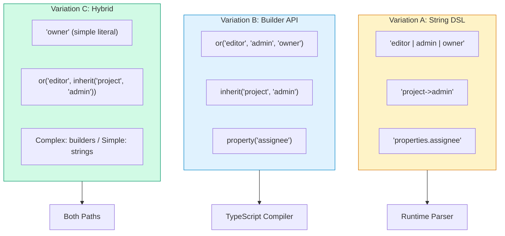
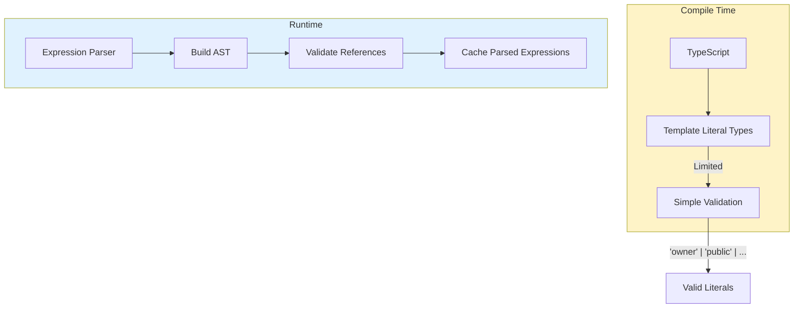
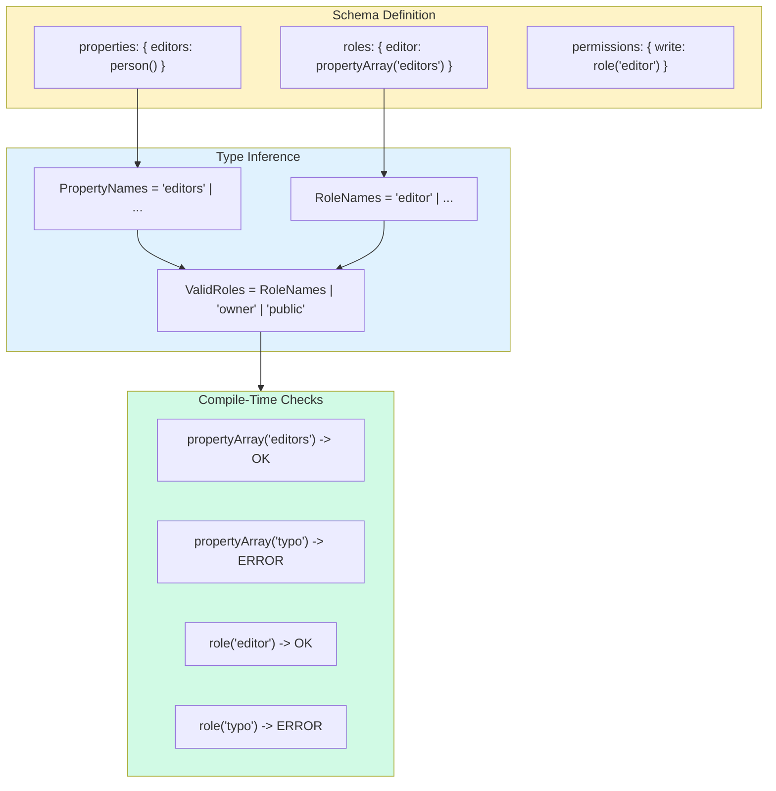
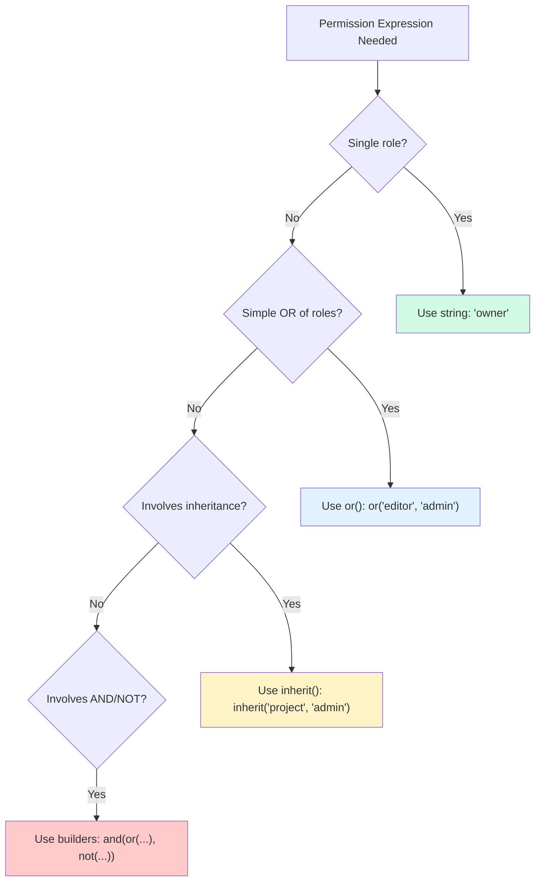
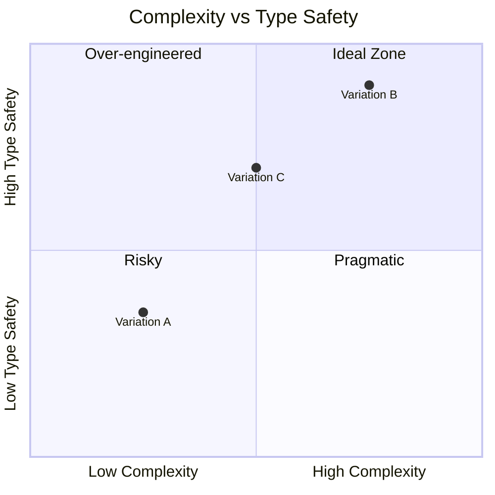
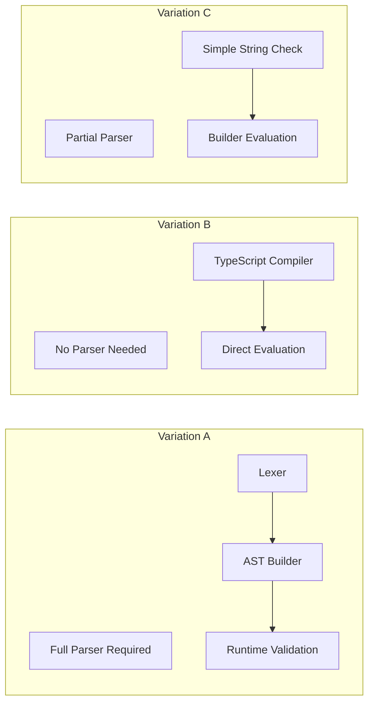
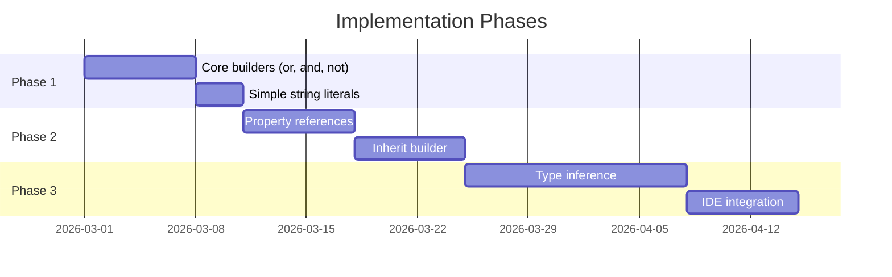

# Authorization Schema DSL Variations: Three Approaches to Permission Expression

> Exploring alternative designs for xNet's permission expression language, comparing string-based DSL, builder-based API, and hybrid approaches with their tradeoffs.

**Date**: February 2026  
**Status**: Exploration  
**Related**: [0077_AUTHORIZATION_API_DESIGN_V2.md](./0077_[_]_AUTHORIZATION_API_DESIGN_V2.md)

---

## Executive Summary

The authorization API design in exploration 0077 proposes a string-based DSL for expressing permissions in schemas. This exploration examines **three alternative approaches** to the permission expression language:

1. **Variation A: String DSL** — Concise string expressions with operators (`'editor | admin | owner'`)
2. **Variation B: Builder API** — Fully typed function builders (`or(role('editor'), role('admin'))`)
3. **Variation C: Hybrid Approach** — Simple strings for common cases, builders for complex logic

Each variation is evaluated against criteria including type safety, developer experience, expressiveness, and implementation complexity.



---

## Context: The Permission Expression Problem

The authorization system needs a way to express:

1. **Who has each role** — `roles: { editor: ??? }`
2. **What roles can do what** — `permissions: { write: ??? }`

The challenge is designing an expression language that is:

- **Expressive** — Can represent complex authorization logic
- **Type-safe** — Catches errors at compile time where possible
- **Ergonomic** — Easy to read, write, and maintain
- **Performant** — Efficient to parse and evaluate at runtime

### Current Proposal (from 0077)

```typescript
const TaskSchema = defineSchema({
  permissions: {
    read: 'viewer | editor | admin | owner',
    write: 'editor | admin | owner',
    delete: 'admin | owner',
    complete: 'assignee | editor | admin | owner'
  },
  roles: {
    owner: 'createdBy',
    assignee: 'properties.assignee',
    editor: 'properties.editors[] | project->editor',
    admin: 'project->admin',
    viewer: 'project->viewer | public'
  }
})
```

---

## Variation A: String-Based DSL

### Design Philosophy

A concise, readable string DSL inspired by:

- **SpiceDB's schema language** — Relation-based expressions with operators
- **SQL WHERE clauses** — Familiar boolean logic
- **CSS selectors** — Compact, expressive syntax

### Syntax Specification

```
// Grammar (EBNF-like)
permission_expr := term (('|' | '&') term)*
term            := '!' term | atom
atom            := role_ref | property_ref | relation_ref | literal
role_ref        := identifier
property_ref    := 'properties.' identifier ('[]')?
relation_ref    := identifier '->' identifier
literal         := 'public' | 'authenticated' | 'createdBy'
identifier      := [a-zA-Z_][a-zA-Z0-9_]*
```

### Complete Example

```typescript
const WorkspaceSchema = defineSchema({
  name: 'Workspace',
  namespace: 'xnet://xnet.fyi/',
  properties: {
    name: text({ required: true }),
    admins: person({ multiple: true }),
    members: person({ multiple: true })
  },
  permissions: {
    read: 'member | admin | owner',
    write: 'admin | owner',
    delete: 'owner',
    share: 'admin | owner',
    invite: 'admin | owner & !suspended' // AND + NOT operators
  },
  roles: {
    owner: 'createdBy',
    admin: 'properties.admins[]',
    member: 'properties.members[]',
    suspended: 'properties.suspendedMembers[]'
  }
})

const ProjectSchema = defineSchema({
  name: 'Project',
  namespace: 'xnet://xnet.fyi/',
  properties: {
    name: text({ required: true }),
    workspace: relation({ target: WorkspaceSchema }),
    editors: person({ multiple: true })
  },
  permissions: {
    read: 'viewer | editor | admin | owner',
    write: 'editor | admin | owner',
    delete: 'admin | owner',
    archive: 'admin | owner'
  },
  roles: {
    owner: 'createdBy',
    admin: 'workspace->admin', // Inherit from relation
    editor: 'properties.editors[] | workspace->admin',
    viewer: 'workspace->member'
  }
})

const TaskSchema = defineSchema({
  name: 'Task',
  namespace: 'xnet://xnet.fyi/',
  properties: {
    title: text({ required: true }),
    project: relation({ target: ProjectSchema }),
    assignee: person(),
    watchers: person({ multiple: true })
  },
  permissions: {
    read: 'viewer | editor | admin | owner | watcher',
    write: 'editor | admin | owner | assignee',
    delete: 'admin | owner',
    complete: 'assignee | editor | admin | owner',
    reassign: 'admin | owner'
  },
  roles: {
    owner: 'createdBy',
    admin: 'project->admin',
    editor: 'project->editor',
    viewer: 'project->viewer | public',
    assignee: 'properties.assignee',
    watcher: 'properties.watchers[]'
  }
})
```

### Expression Reference

| Expression         | Meaning                   | Example                                  |
| ------------------ | ------------------------- | ---------------------------------------- |
| `'owner'`          | Has the owner role        | `permissions: { delete: 'owner' }`       |
| `'public'`         | Anyone (no auth required) | `permissions: { read: 'public' }`        |
| `'authenticated'`  | Any authenticated user    | `permissions: { read: 'authenticated' }` |
| `'createdBy'`      | Node's creator            | `roles: { owner: 'createdBy' }`          |
| `'a \| b'`         | a OR b                    | `'editor \| admin'`                      |
| `'a & b'`          | a AND b                   | `'editor & verified'`                    |
| `'!a'`             | NOT a                     | `'!banned'`                              |
| `'properties.x'`   | Person property value     | `'properties.assignee'`                  |
| `'properties.x[]'` | Multi-person property     | `'properties.editors[]'`                 |
| `'rel->role'`      | Role from related node    | `'project->admin'`                       |

### Operator Precedence

```
1. ! (NOT)     - highest
2. & (AND)
3. | (OR)      - lowest
```

Parentheses can override: `'(editor | viewer) & verified'`

### Type Safety Analysis



**What TypeScript CAN validate:**

- Simple role literals via template literal types
- Property names exist (with mapped types)

**What requires runtime validation:**

- Complex expressions with operators
- Relation traversal targets
- Circular role definitions

### Implementation Sketch

```typescript
// Parser implementation
interface PermissionAST {
  type: 'or' | 'and' | 'not' | 'role' | 'property' | 'relation' | 'literal'
  children?: PermissionAST[]
  value?: string
  target?: string
}

function parsePermissionExpr(expr: string): PermissionAST {
  const tokens = tokenize(expr)
  return parseOr(tokens)
}

function parseOr(tokens: Token[]): PermissionAST {
  const left = parseAnd(tokens)
  if (peek(tokens) === '|') {
    consume(tokens, '|')
    return { type: 'or', children: [left, parseOr(tokens)] }
  }
  return left
}

// Evaluator
async function evaluatePermission(
  ast: PermissionAST,
  did: DID,
  node: Node,
  context: EvalContext
): Promise<boolean> {
  switch (ast.type) {
    case 'or':
      return (
        (await evaluatePermission(ast.children![0], did, node, context)) ||
        (await evaluatePermission(ast.children![1], did, node, context))
      )
    case 'and':
      return (
        (await evaluatePermission(ast.children![0], did, node, context)) &&
        (await evaluatePermission(ast.children![1], did, node, context))
      )
    case 'not':
      return !(await evaluatePermission(ast.children![0], did, node, context))
    case 'role':
      return await hasRole(did, ast.value!, node, context)
    case 'property':
      return isInProperty(did, ast.value!, node)
    case 'relation':
      return await checkRelationRole(did, ast.value!, ast.target!, node, context)
    case 'literal':
      return evaluateLiteral(ast.value!, did)
  }
}
```

### Pros and Cons

| Pros                       | Cons                            |
| -------------------------- | ------------------------------- |
| Concise and readable       | Limited compile-time validation |
| Familiar syntax (SQL-like) | Requires runtime parser         |
| Easy to serialize/store    | Error messages less helpful     |
| Low learning curve         | IDE support limited             |
| Matches SpiceDB patterns   | Typos caught at runtime         |

---

## Variation B: Builder-Based API

### Design Philosophy

A fully typed API using function builders, inspired by:

- **Drizzle ORM's query builder** — Type-safe SQL construction
- **Zod's schema builder** — Composable validation
- **tRPC's procedure builder** — Chained type inference

### Core Builder Functions

```typescript
// Permission expression builders
function or(...exprs: PermissionExpr[]): PermissionExpr
function and(...exprs: PermissionExpr[]): PermissionExpr
function not(expr: PermissionExpr): PermissionExpr

// Role references
function role<R extends string>(name: R): RoleRef<R>
function roles<R extends string>(...names: R[]): PermissionExpr

// Property references
function property<P extends string>(name: P): PropertyRef<P>
function propertyArray<P extends string>(name: P): PropertyArrayRef<P>

// Relation traversal
function inherit<R extends string, Role extends string>(
  relation: R,
  role: Role
): InheritRef<R, Role>

// Literals
const PUBLIC: PermissionExpr
const AUTHENTICATED: PermissionExpr
const CREATED_BY: PermissionExpr
```

### Complete Example

```typescript
import {
  or,
  and,
  not,
  role,
  roles,
  property,
  propertyArray,
  inherit,
  PUBLIC,
  AUTHENTICATED,
  CREATED_BY
} from '@xnetjs/data/permissions'

const WorkspaceSchema = defineSchema({
  name: 'Workspace',
  namespace: 'xnet://xnet.fyi/',
  properties: {
    name: text({ required: true }),
    admins: person({ multiple: true }),
    members: person({ multiple: true }),
    suspended: person({ multiple: true })
  },
  permissions: {
    read: or(role('member'), role('admin'), role('owner')),
    write: or(role('admin'), role('owner')),
    delete: role('owner'),
    share: or(role('admin'), role('owner')),
    invite: and(or(role('admin'), role('owner')), not(role('suspended')))
  },
  roles: {
    owner: CREATED_BY,
    admin: propertyArray('admins'),
    member: propertyArray('members'),
    suspended: propertyArray('suspended')
  }
})

const ProjectSchema = defineSchema({
  name: 'Project',
  namespace: 'xnet://xnet.fyi/',
  properties: {
    name: text({ required: true }),
    workspace: relation({ target: WorkspaceSchema }),
    editors: person({ multiple: true })
  },
  permissions: {
    read: roles('viewer', 'editor', 'admin', 'owner'),
    write: roles('editor', 'admin', 'owner'),
    delete: roles('admin', 'owner'),
    archive: roles('admin', 'owner')
  },
  roles: {
    owner: CREATED_BY,
    admin: inherit('workspace', 'admin'),
    editor: or(propertyArray('editors'), inherit('workspace', 'admin')),
    viewer: inherit('workspace', 'member')
  }
})

const TaskSchema = defineSchema({
  name: 'Task',
  namespace: 'xnet://xnet.fyi/',
  properties: {
    title: text({ required: true }),
    project: relation({ target: ProjectSchema }),
    assignee: person(),
    watchers: person({ multiple: true })
  },
  permissions: {
    read: or(roles('viewer', 'editor', 'admin', 'owner'), role('watcher')),
    write: roles('editor', 'admin', 'owner', 'assignee'),
    delete: roles('admin', 'owner'),
    complete: roles('assignee', 'editor', 'admin', 'owner'),
    reassign: roles('admin', 'owner')
  },
  roles: {
    owner: CREATED_BY,
    admin: inherit('project', 'admin'),
    editor: inherit('project', 'editor'),
    viewer: or(inherit('project', 'viewer'), PUBLIC),
    assignee: property('assignee'),
    watcher: propertyArray('watchers')
  }
})
```

### Type Definitions

```typescript
// Core expression types
type PermissionExpr =
  | OrExpr
  | AndExpr
  | NotExpr
  | RoleRef<string>
  | PropertyRef<string>
  | PropertyArrayRef<string>
  | InheritRef<string, string>
  | LiteralExpr

interface OrExpr {
  readonly _tag: 'or'
  readonly exprs: readonly PermissionExpr[]
}

interface AndExpr {
  readonly _tag: 'and'
  readonly exprs: readonly PermissionExpr[]
}

interface NotExpr {
  readonly _tag: 'not'
  readonly expr: PermissionExpr
}

interface RoleRef<R extends string> {
  readonly _tag: 'role'
  readonly name: R
}

interface PropertyRef<P extends string> {
  readonly _tag: 'property'
  readonly name: P
  readonly multiple: false
}

interface PropertyArrayRef<P extends string> {
  readonly _tag: 'propertyArray'
  readonly name: P
  readonly multiple: true
}

interface InheritRef<R extends string, Role extends string> {
  readonly _tag: 'inherit'
  readonly relation: R
  readonly role: Role
}

interface LiteralExpr {
  readonly _tag: 'literal'
  readonly value: 'public' | 'authenticated' | 'createdBy'
}

// Type-safe schema definition
interface DefineSchemaOptions<
  P extends Record<string, PropertyBuilder>,
  R extends Record<string, RoleDefinition<P>>
> {
  name: string
  namespace: `xnet://${string}/`
  properties: P
  roles: R
  permissions: Record<string, PermissionExpr<keyof R & string>>
}

// Validate role references at compile time
type PermissionExpr<ValidRoles extends string> =
  | OrExpr<ValidRoles>
  | AndExpr<ValidRoles>
  | NotExpr<ValidRoles>
  | RoleRef<ValidRoles>
  | LiteralExpr
```

### Type Safety Flow



### Advanced Type Safety

```typescript
// Validate that property references point to person() properties
type PersonPropertyNames<P extends Record<string, PropertyBuilder>> = {
  [K in keyof P]: P[K] extends PropertyBuilder<DID | DID[]> ? K : never
}[keyof P]

// Validate that relation references point to relation() properties
type RelationPropertyNames<P extends Record<string, PropertyBuilder>> = {
  [K in keyof P]: P[K]['definition']['type'] extends 'relation' ? K : never
}[keyof P]

// Type-safe property reference
function property<P extends Record<string, PropertyBuilder>, K extends PersonPropertyNames<P>>(
  name: K
): PropertyRef<K & string>

// Type-safe inherit
function inherit<
  P extends Record<string, PropertyBuilder>,
  R extends RelationPropertyNames<P>,
  Role extends string
>(relation: R, role: Role): InheritRef<R & string, Role>
```

### Pros and Cons

| Pros                          | Cons                  |
| ----------------------------- | --------------------- |
| Full compile-time type safety | More verbose          |
| Excellent IDE autocomplete    | Higher learning curve |
| Refactoring support           | More imports required |
| Clear error messages          | Harder to serialize   |
| No runtime parser needed      | Less familiar syntax  |

---

## Variation C: Hybrid Approach

### Design Philosophy

Combine the best of both worlds:

- **Simple cases use strings** — `'owner'`, `'public'`, `'authenticated'`
- **Complex cases use builders** — `or(role('editor'), inherit('project', 'admin'))`

Inspired by:

- **Tailwind CSS** — Simple utilities as strings, complex via config
- **React's className** — Strings for simple, objects for conditional
- **Prisma's where clause** — Simple equality as strings, complex as objects

### Syntax

```typescript
// Simple literals (strings)
permissions: {
  delete: 'owner',           // Simple role
  read: 'public',            // Literal
}

// Complex expressions (builders)
permissions: {
  write: or('editor', 'admin', 'owner'),
  share: and('admin', not('suspended')),
  view: or('viewer', inherit('project', 'viewer'))
}

// Role definitions (both)
roles: {
  owner: 'createdBy',                              // Simple literal
  admin: 'properties.admins[]',                    // Property reference string
  editor: or(
    property('editors'),
    inherit('workspace', 'admin')
  )                                                // Complex builder
}
```

### Complete Example

```typescript
import { or, and, not, property, inherit, PUBLIC } from '@xnetjs/data/permissions'

const WorkspaceSchema = defineSchema({
  name: 'Workspace',
  namespace: 'xnet://xnet.fyi/',
  properties: {
    name: text({ required: true }),
    admins: person({ multiple: true }),
    members: person({ multiple: true }),
    suspended: person({ multiple: true })
  },
  permissions: {
    // Simple cases: strings
    delete: 'owner',

    // Medium complexity: or() with role strings
    read: or('member', 'admin', 'owner'),
    write: or('admin', 'owner'),
    share: or('admin', 'owner'),

    // Complex: nested builders
    invite: and(or('admin', 'owner'), not('suspended'))
  },
  roles: {
    // Simple: string literals
    owner: 'createdBy',

    // Property references: strings with special syntax
    admin: 'properties.admins[]',
    member: 'properties.members[]',
    suspended: 'properties.suspended[]'
  }
})

const ProjectSchema = defineSchema({
  name: 'Project',
  namespace: 'xnet://xnet.fyi/',
  properties: {
    name: text({ required: true }),
    workspace: relation({ target: WorkspaceSchema }),
    editors: person({ multiple: true })
  },
  permissions: {
    read: or('viewer', 'editor', 'admin', 'owner'),
    write: or('editor', 'admin', 'owner'),
    delete: or('admin', 'owner'),
    archive: or('admin', 'owner')
  },
  roles: {
    owner: 'createdBy',

    // Relation traversal: use inherit() builder
    admin: inherit('workspace', 'admin'),

    // Complex: combine property and inheritance
    editor: or(property('editors'), inherit('workspace', 'admin')),

    viewer: inherit('workspace', 'member')
  }
})

const TaskSchema = defineSchema({
  name: 'Task',
  namespace: 'xnet://xnet.fyi/',
  properties: {
    title: text({ required: true }),
    project: relation({ target: ProjectSchema }),
    assignee: person(),
    watchers: person({ multiple: true })
  },
  permissions: {
    read: or('viewer', 'editor', 'admin', 'owner', 'watcher'),
    write: or('editor', 'admin', 'owner', 'assignee'),
    delete: or('admin', 'owner'),
    complete: or('assignee', 'editor', 'admin', 'owner'),
    reassign: or('admin', 'owner')
  },
  roles: {
    owner: 'createdBy',
    admin: inherit('project', 'admin'),
    editor: inherit('project', 'editor'),

    // Complex: inheritance OR public
    viewer: or(inherit('project', 'viewer'), PUBLIC),

    assignee: 'properties.assignee',
    watcher: 'properties.watchers[]'
  }
})
```

### Type System

```typescript
// Permission value can be string OR builder expression
type PermissionValue<ValidRoles extends string> =
  | ValidRoles // Simple role reference
  | 'public' // Literal
  | 'authenticated' // Literal
  | PermissionExpr<ValidRoles> // Builder expression

// Role definition can be string OR builder
type RoleDefinition<P extends Record<string, PropertyBuilder>> =
  | 'createdBy' // Literal
  | `properties.${string}` // Property reference
  | `properties.${string}[]` // Array property reference
  | RoleExpr<P> // Builder expression

// Overloaded or() function
function or<R extends string>(...roles: R[]): OrExpr<R>
function or<R extends string>(...exprs: PermissionExpr<R>[]): OrExpr<R>
function or(...args: (string | PermissionExpr<string>)[]): OrExpr<string> {
  return {
    _tag: 'or',
    exprs: args.map((arg) => (typeof arg === 'string' ? { _tag: 'role', name: arg } : arg))
  }
}
```

### Decision Flow



### Pros and Cons

| Pros                        | Cons                    |
| --------------------------- | ----------------------- |
| Best of both worlds         | Two syntaxes to learn   |
| Simple cases stay simple    | Inconsistent appearance |
| Complex cases are type-safe | Harder to document      |
| Gradual complexity          | Mixed serialization     |
| Familiar patterns           | Edge case confusion     |

---

## Comparison Matrix

### Feature Comparison

| Feature            | Variation A (String) | Variation B (Builder) | Variation C (Hybrid) |
| ------------------ | -------------------- | --------------------- | -------------------- |
| **Conciseness**    | Excellent            | Good                  | Very Good            |
| **Type Safety**    | Limited              | Excellent             | Good                 |
| **IDE Support**    | Limited              | Excellent             | Good                 |
| **Learning Curve** | Low                  | Medium                | Low-Medium           |
| **Serialization**  | Easy                 | Hard                  | Medium               |
| **Error Messages** | Runtime              | Compile-time          | Mixed                |
| **Refactoring**    | Manual               | Automatic             | Partial              |
| **Familiarity**    | SQL/SpiceDB          | Zod/Drizzle           | React/Tailwind       |

### Complexity vs Type Safety



### Use Case Fit

| Use Case               | Best Variation | Reason                   |
| ---------------------- | -------------- | ------------------------ |
| Rapid prototyping      | A (String)     | Fastest to write         |
| Large team             | B (Builder)    | Best refactoring support |
| Mixed experience       | C (Hybrid)     | Gradual complexity       |
| Schema serialization   | A (String)     | Easy to store/transmit   |
| Complex policies       | B (Builder)    | Full expressiveness      |
| Migration from SpiceDB | A (String)     | Similar syntax           |

---

## Implementation Considerations

### Parser Requirements by Variation



### Performance Characteristics

| Aspect           | Variation A          | Variation B        | Variation C       |
| ---------------- | -------------------- | ------------------ | ----------------- |
| **Parse Time**   | ~1-5ms first, cached | 0ms (pre-compiled) | ~0.5-2ms          |
| **Eval Time**    | ~0.1ms               | ~0.1ms             | ~0.1ms            |
| **Memory (AST)** | ~1KB per schema      | ~0.5KB per schema  | ~0.7KB per schema |
| **Bundle Size**  | +5KB (parser)        | +2KB (builders)    | +6KB (both)       |

### Migration Path

If starting with Variation A and later wanting more type safety:

```typescript
// Phase 1: String DSL
permissions: {
  write: 'editor | admin | owner'
}

// Phase 2: Hybrid (gradual migration)
permissions: {
  write: or('editor', 'admin', 'owner') // Same semantics, more type-safe
}

// Phase 3: Full Builder (if needed)
permissions: {
  write: or(role('editor'), role('admin'), role('owner'))
}
```

---

## Recommendation

### Primary Recommendation: Variation C (Hybrid)

The hybrid approach provides the best balance for xNet's use case:

1. **Simple cases stay simple** — Most permissions are straightforward role checks
2. **Complex cases are type-safe** — Inheritance and boolean logic get full IDE support
3. **Gradual adoption** — Teams can start simple and add complexity as needed
4. **Familiar patterns** — Similar to React's className or Tailwind's approach

### Implementation Priority



### Fallback: Variation A (String DSL)

If implementation complexity is a concern, the string DSL is a solid fallback:

- Faster to implement
- Easier to serialize for database-defined schemas
- Matches SpiceDB patterns for familiarity

---

## Checklist: Next Steps

### Research

- [ ] Review SpiceDB schema language for additional patterns
- [ ] Analyze Drizzle ORM's type inference approach
- [ ] Study Zod's builder pattern implementation
- [ ] Benchmark parser performance for string DSL

### Design

- [ ] Finalize operator precedence rules
- [ ] Define error message format for each variation
- [ ] Design serialization format for database storage
- [ ] Plan migration path from current schema system

### Implementation

- [ ] Implement core builder functions
- [ ] Add TypeScript type definitions
- [ ] Create expression parser (if using string DSL)
- [ ] Build evaluation engine
- [ ] Add caching layer for parsed expressions

### Testing

- [ ] Unit tests for each expression type
- [ ] Type inference tests
- [ ] Performance benchmarks
- [ ] Integration tests with NodeStore

### Documentation

- [ ] API reference for builders
- [ ] Expression syntax guide
- [ ] Migration guide from current system
- [ ] Common patterns cookbook

---

## References

- [SpiceDB Schema Language](https://authzed.com/docs/spicedb/concepts/schema)
- [UCAN Specification](https://ucan.xyz/specification/)
- [Google Zanzibar Paper](https://research.google/pubs/pub48190/)
- [Drizzle ORM Query Builder](https://orm.drizzle.team/docs/select)
- [Zod Schema Builder](https://zod.dev/)
- [Exploration 0077: Authorization API Design V2](./0077\_[ ]\_AUTHORIZATION_API_DESIGN_V2.md)
- [Exploration 0076: Authorization API Design](./0076\_[ ]\_AUTHORIZATION_API_DESIGN.md)
