# UCAN Integration into the Hybrid Authorization Model: Bridging Capabilities with Schema-Based Permissions

> A comprehensive exploration of integrating UCAN (User Controlled Authorization Networks) capabilities with xNet's hybrid authorization model, enabling cryptographic, delegable permissions that work offline-first while maintaining the ergonomic schema-based permission DSL.

**Date**: February 2026  
**Status**: Exploration  
**Related**: [0079_AUTH_SCHEMA_DSL_VARIATIONS.md](./0079_[_]_AUTH_SCHEMA_DSL_VARIATIONS.md), [0077_AUTHORIZATION_API_DESIGN_V2.md](./0077_[_]_AUTHORIZATION_API_DESIGN_V2.md)

---

## Executive Summary

xNet's authorization system stands at a crossroads between two powerful paradigms:

1. **Schema-Based Permissions** (from 0079) — A developer-friendly DSL for declaring who can do what, using string expressions (`'editor | admin'`) or builder functions (`or('editor', 'admin')`)
2. **UCAN Capabilities** (existing implementation) — Cryptographic, delegable, offline-capable bearer tokens that enable transitive authority chains

This exploration examines **how to unify these two models** into a cohesive authorization system that:

- Preserves the ergonomic DX of schema-based permissions
- Leverages UCAN's cryptographic verification and delegation chains
- Works seamlessly offline through local capability caching
- Supports both property-based grants (team membership) and UCAN-based grants (temporary sharing)

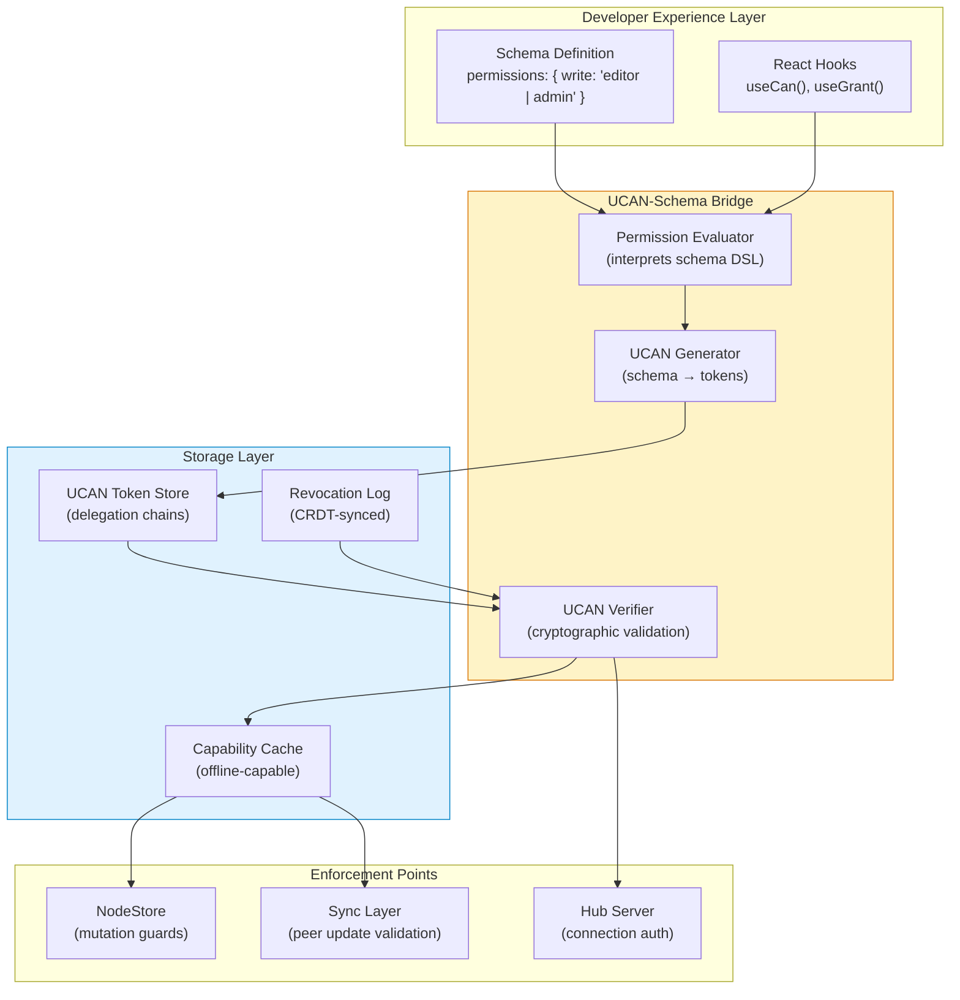

---

## Table of Contents

1. [The Core Tension: Flexibility vs. Cryptography](#part-1-the-core-tension-flexibility-vs-cryptography)
2. [Current State Analysis](#part-2-current-state-analysis)
3. [Integration Architecture](#part-3-integration-architecture)
4. [Mapping Schema Permissions to UCAN Capabilities](#part-4-mapping-schema-permissions-to-ucan-capabilities)
5. [Delegation Chain Construction](#part-5-delegation-chain-construction)
6. [Attenuation Strategies](#part-6-attenuation-strategies)
7. [Offline-First Capability Management](#part-7-offline-first-capability-management)
8. [Revocation in a Hybrid Model](#part-8-revocation-in-a-hybrid-model)
9. [Implementation Approaches](#part-9-implementation-approaches)
10. [Recommendations & Next Steps](#part-10-recommendations--next-steps)

---

## Part 1: The Core Tension: Flexibility vs. Cryptography

### Two Worlds, One Authorization System

The fundamental challenge in integrating UCAN with schema-based permissions is reconciling their different philosophies:

| Aspect             | Schema-Based Permissions    | UCAN Capabilities            |
| ------------------ | --------------------------- | ---------------------------- |
| **Mental Model**   | "Who has what role"         | "What actions are permitted" |
| **Evaluation**     | Runtime interpretation      | Cryptographic verification   |
| **Delegation**     | Indirect (via role changes) | Direct (signed tokens)       |
| **Offline**        | Requires role data cache    | Self-contained tokens        |
| **Expressiveness** | Arbitrary boolean logic     | Capability attenuation       |
| **Auditability**   | Query role assignments      | Cryptographic proof chains   |

### The Integration Challenge

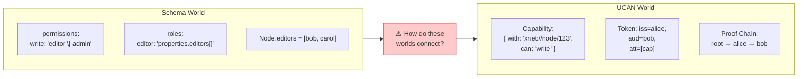

The question is: **How do we generate UCAN tokens from schema-defined permissions, and how do we verify UCANs against schema-defined roles?**

### Key Insight: The Dual-Layer Model

Rather than choosing one model over the other, we can use a **dual-layer approach**:

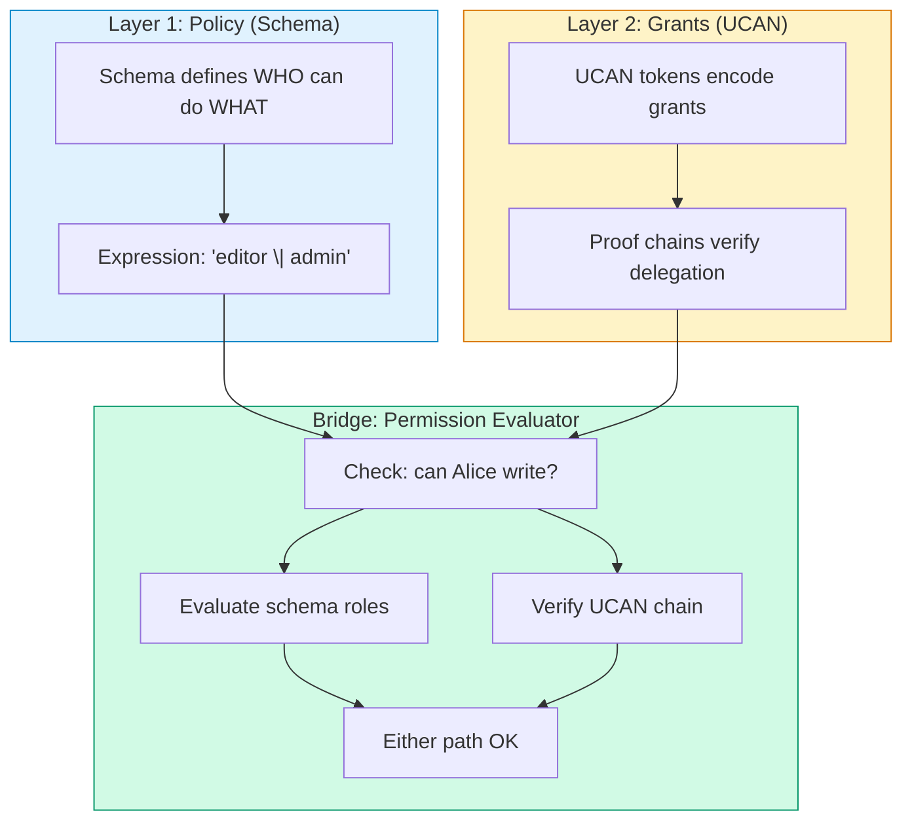

**Layer 1 (Policy)** — Declarative, schema-defined rules about roles and permissions  
**Layer 2 (Grants)** — Cryptographic UCAN tokens that encode delegated authority  
**Bridge** — The permission evaluator that checks both paths

---

## Part 2: Current State Analysis

### What's Already Implemented

From the codebase analysis, xNet has a solid foundation:

#### 1. UCAN Implementation (`@xnet/identity/ucan.ts`)

```typescript
// Create UCAN with proof chain support
export function createUCAN(options: CreateUCANOptions): string

// Verify with recursive proof validation
export function verifyUCAN(token: string): VerifyResult

// Check specific capability
export function hasCapability(token: UCANToken, resource: string, action: string): boolean

// Proof chain validation with attenuation checking
function validateProofChain(payload: UCANPayload, proofs: UCANToken[]): ValidationResult
```

**Key capabilities:**

- ✅ EdDSA signatures over base64url-encoded header.payload
- ✅ Proof chain validation (recursive verification)
- ✅ Attenuation checking (child capabilities ≤ parent capabilities)
- ✅ Cycle detection in proof chains
- ✅ Expiration validation with proof constraints

#### 2. Sharing Layer (`@xnet/identity/sharing/`)

```typescript
// Create share with UCAN
export async function createShare(identity: Identity, options: ShareOptions): Promise<ShareToken>

// Share token structure
interface ShareToken {
  token: string // The UCAN JWT
  resource: string // xnet:// URI
  permission: 'read' | 'write' | 'admin'
  expiresAt: number
  shareLink: string // URL with embedded token
}
```

#### 3. Schema DSL (from 0079)

```typescript
const TaskSchema = defineSchema({
  permissions: {
    read: 'viewer | editor | admin | owner',
    write: 'editor | admin | owner',
    delete: 'admin | owner',
    share: 'admin | owner'
  },
  roles: {
    owner: 'createdBy',
    editor: 'properties.editors[] | project->editor',
    admin: 'project->admin',
    viewer: 'project->viewer | public'
  }
})
```

### The Integration Gap

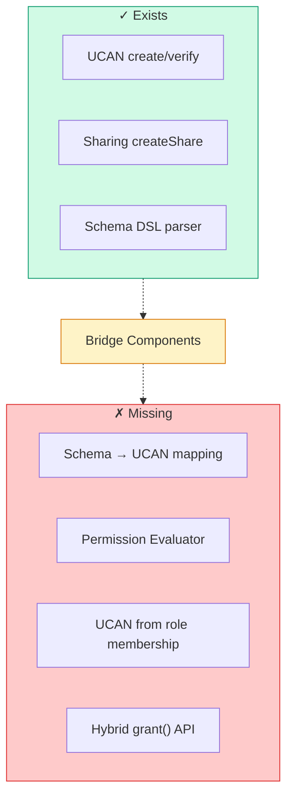

---

## Part 3: Integration Architecture

### System Overview

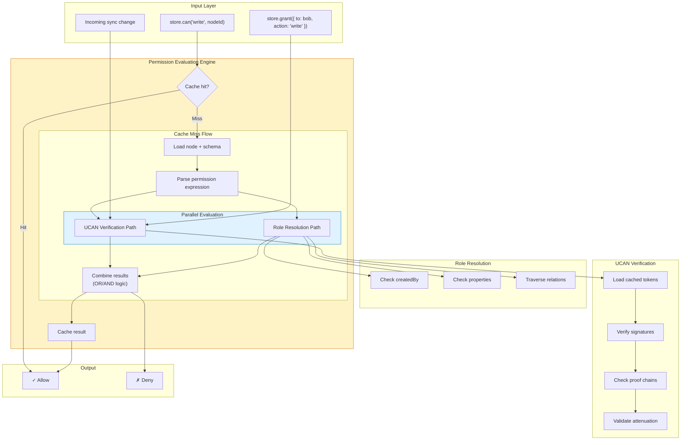

### Component Breakdown

#### 1. PermissionEvaluator Class

```typescript
interface PermissionEvaluator {
  // Check if DID can perform action on resource
  can(did: DID, action: string, resource: string): Promise<boolean>

  // Grant capability (creates UCAN)
  grant(options: GrantOptions): Promise<UCANToken>

  // Revoke capability
  revoke(tokenHash: string): Promise<void>

  // List capabilities for resource
  listCapabilities(resource: string): Promise<Capability[]>
}

interface GrantOptions {
  issuer: DID
  issuerKey: Uint8Array
  audience: DID
  resource: string
  action: string
  expiresIn?: number
  proofs?: string[] // Parent UCANs for delegation
}
```

#### 2. UCAN-Schema Bridge

```typescript
interface UCANSchemaBridge {
  // Convert schema permission to UCAN capability
  permissionToCapability(schema: Schema, action: string): UCANCapability

  // Check if UCAN capability satisfies schema permission
  capabilitySatisfiesPermission(
    capability: UCANCapability,
    permission: PermissionExpr,
    context: EvalContext
  ): boolean

  // Generate root UCAN from ownership
  createOwnershipUCAN(owner: DID, resource: string, schema: Schema): string
}
```

#### 3. Capability Cache

```typescript
interface CapabilityCache {
  // Get cached capability check
  get(did: DID, action: string, resource: string): CacheEntry | null

  // Store capability check result
  set(did: DID, action: string, resource: string, result: boolean, ttl: number): void

  // Invalidate cached entries for resource
  invalidate(resource: string): void

  // Store verified UCAN token
  storeUCAN(token: UCANToken): void

  // Get UCANs for resource
  getUCANs(resource: string): UCANToken[]
}
```

---

## Part 4: Mapping Schema Permissions to UCAN Capabilities

### The Mapping Problem

Schema permissions use a DSL like `'editor | admin | owner'`. UCAN uses capabilities like `{ with: 'xnet://node/123', can: 'write' }`. How do we bridge these?

### Approach 1: Capability-as-Role Model

Treat each role as a capability namespace:

```typescript
// Schema defines roles
roles: {
  editor: 'properties.editors[]',
  admin: 'project->admin',
  owner: 'createdBy'
}

// Map to UCAN capabilities
// A user with 'editor' role gets:
{ with: 'xnet://node/123', can: 'xnet/role/editor' }

// A user with 'admin' role gets:
{ with: 'xnet://node/123', can: 'xnet/role/admin' }

// Permission expression 'editor | admin' becomes:
// Check for either xnet/role/editor OR xnet/role/admin capability
```

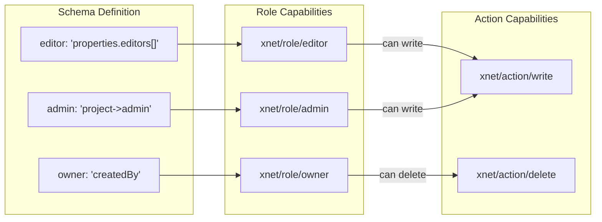

### Approach 2: Direct Action Capabilities

Map schema permissions directly to action capabilities:

```typescript
// Schema permission
permissions: {
  write: 'editor | admin | owner'
}

// When granting 'editor' role, issue UCAN with:
{ with: 'xnet://node/123', can: 'xnet/write' }

// The UCAN directly encodes the action, not the role
// Role resolution happens at grant time, not check time
```

**Comparison:**

| Aspect                     | Capability-as-Role   | Direct Action         |
| -------------------------- | -------------------- | --------------------- |
| **UCAN size**              | Smaller (role count) | Larger (action count) |
| **Permission changes**     | Requires new UCANs   | Requires new UCANs    |
| **Role inheritance**       | Explicit in UCAN     | Resolved at grant     |
| **Revocation granularity** | By role              | By action             |
| **Attenuation**            | Role-based           | Action-based          |

### Recommended: Hybrid Capability Model

Combine both approaches for maximum flexibility:

```typescript
// UCAN capability structure
interface XNetCapability {
  with: string        // Resource URI: xnet://{did}/node/{id}
  can: string         // Action: xnet/{action} or xnet/role/{role}
  nb?: {              // Optional constraints (attenuation)
    paths?: string[]  // Allowed property paths
    expires?: number  // Earlier expiration than token
  }
}

// Examples:
// Full write access
{ with: 'xnet://did:alice/node/123', can: 'xnet/write' }

// Editor role (implies write permission per schema)
{ with: 'xnet://did:alice/node/123', can: 'xnet/role/editor' }

// Attenuated write (only specific fields)
{
  with: 'xnet://did:alice/node/123',
  can: 'xnet/write',
  nb: { paths: ['title', 'description'] }
}
```

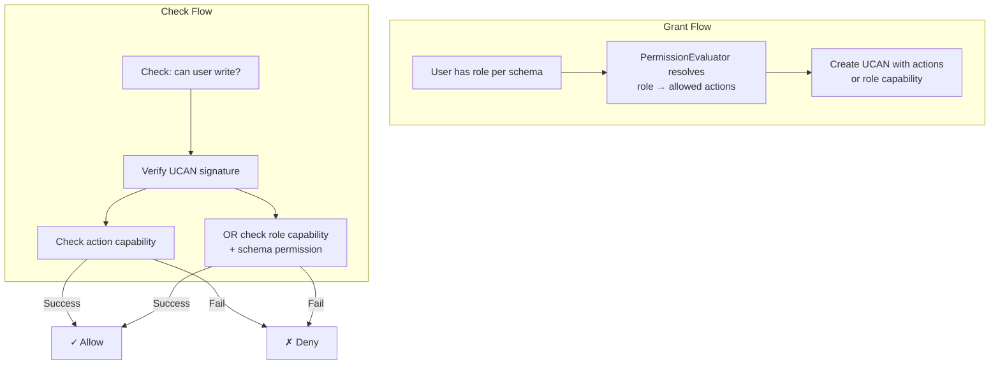

---

## Part 5: Delegation Chain Construction

### The Delegation Lifecycle

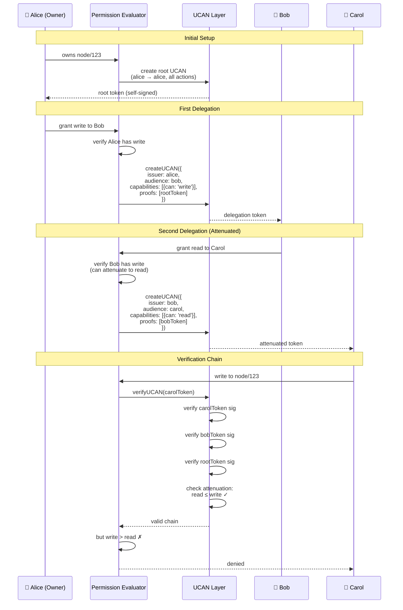

### Chain Construction Algorithm

```typescript
async function constructDelegationChain(
  grantor: DID,
  grantee: DID,
  action: string,
  resource: string,
  store: TokenStore
): Promise<string> {
  // 1. Find the shortest valid proof chain for this action
  const proofChain = await findProofChain(grantor, action, resource, store)

  if (!proofChain) {
    throw new PermissionError(`Grantor ${grantor} lacks ${action} permission`)
  }

  // 2. Verify attenuation (grantee's action ≤ grantor's capability)
  const grantorCapability = proofChain.capabilities.find((cap) =>
    capabilityAllows(cap, { with: resource, can: action })
  )

  if (!grantorCapability) {
    throw new PermissionError(
      `Cannot delegate ${action}, grantor only has ${grantorCapability?.can}`
    )
  }

  // 3. Create new UCAN with proof chain
  const token = await createUCAN({
    issuer: grantor,
    audience: grantee,
    capabilities: [{ with: resource, can: action }],
    proofs: proofChain.tokens.map((t) => t.raw)
  })

  return token
}

async function findProofChain(
  grantor: DID,
  action: string,
  resource: string,
  store: TokenStore
): Promise<ProofChain | null> {
  // BFS through delegation graph
  const queue: ProofChain[] = [{ did: grantor, capabilities: [], tokens: [], depth: 0 }]

  while (queue.length > 0) {
    const current = queue.shift()!

    // Check if this DID has the capability directly (via role)
    const hasDirect = await checkRolePermission(current.did, action, resource)
    if (hasDirect) {
      return current
    }

    // Otherwise, look for UCANs delegating to this DID
    const tokens = await store.getUCANsForAudience(current.did, resource)

    for (const token of tokens) {
      if (current.depth < MAX_PROOF_DEPTH) {
        queue.push({
          did: token.payload.iss,
          capabilities: [...current.capabilities, ...token.payload.att],
          tokens: [...current.tokens, token],
          depth: current.depth + 1
        })
      }
    }
  }

  return null
}
```

---

## Part 6: Attenuation Strategies

### Understanding Attenuation

UCAN's key feature is **attenuation** — delegated tokens can only narrow (never widen) capabilities.

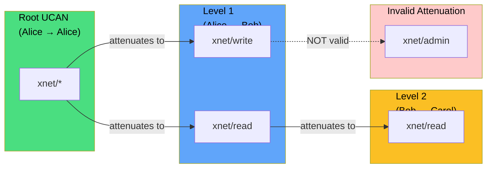

### Attenuation Rules for xNet

```typescript
// Hierarchical action structure
const actionHierarchy = {
  'xnet/*': ['xnet/admin', 'xnet/write', 'xnet/read'],
  'xnet/admin': ['xnet/write', 'xnet/read'],
  'xnet/write': ['xnet/read'],
  'xnet/read': []
}

// Check if child action is valid attenuation of parent
function canAttenuate(parent: string, child: string): boolean {
  if (parent === child) return true
  if (parent === 'xnet/*') return child.startsWith('xnet/')

  const descendants = actionHierarchy[parent] || []
  return descendants.includes(child) || descendants.some((d) => canAttenuate(d, child))
}

// Resource attenuation (namespace narrowing)
function canAttenuateResource(parent: string, child: string): boolean {
  // xnet://did/node/* can attenuate to xnet://did/node/123
  if (parent.endsWith('/*')) {
    const prefix = parent.slice(0, -1)
    return child.startsWith(prefix)
  }
  return parent === child
}
```

### Field-Level Attenuation

For fine-grained control, use capability constraints:

```typescript
// Parent capability (Bob has this from Alice)
const parentCap = {
  with: 'xnet://did:alice/node/task123',
  can: 'xnet/write'
}

// Child capability (Bob delegates to Carol, attenuated)
const childCap = {
  with: 'xnet://did:alice/node/task123',
  can: 'xnet/write',
  nb: {
    fields: ['status', 'assignee'], // Can only edit these fields
    exclude: ['title', 'description'] // Cannot edit these
  }
}

// Validation
function validateAttenuation(parent: Capability, child: Capability): boolean {
  // 1. Check action attenuation
  if (!canAttenuate(parent.can, child.can)) {
    return false
  }

  // 2. Check resource attenuation
  if (!canAttenuateResource(parent.with, child.with)) {
    return false
  }

  // 3. Check constraints (child constraints must be subset of parent)
  if (child.nb && parent.nb) {
    // Child fields must be subset of parent fields
    if (child.nb.fields && parent.nb.fields) {
      const isSubset = child.nb.fields.every((f) => parent.nb!.fields!.includes(f))
      if (!isSubset) return false
    }
  }

  return true
}
```

---

## Part 7: Offline-First Capability Management

### The Offline Challenge

In an offline-first system, users need to:

1. Verify permissions without network access
2. Create grants that work offline
3. Sync capability changes when reconnected

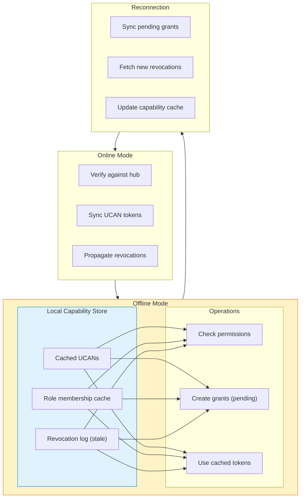

### Capability Cache Design

```typescript
interface CapabilityCache {
  // UCAN tokens indexed by resource
  tokens: Map<string, CachedUCAN[]>

  // Role membership cache (from property-based grants)
  roles: Map<string, RoleMembership>

  // Revocation list (grows unbounded, needs pruning)
  revocations: Set<string> // token hashes

  // Pending grants (created while offline)
  pending: PendingGrant[]
}

interface CachedUCAN {
  token: string
  payload: UCANToken
  cachedAt: number
  expiresAt: number
  verified: boolean // Pre-verified signature
}

interface RoleMembership {
  did: DID
  role: string
  resource: string
  source: 'property' | 'relation' | 'ucan'
  cachedAt: number
  ttl: number
}

class OfflineCapabilityManager {
  async can(did: DID, action: string, resource: string): Promise<boolean> {
    // 1. Check local UCAN cache
    const cachedUCANs = await this.cache.getUCANs(resource)
    for (const cached of cachedUCANs) {
      if (cached.expiresAt < Date.now()) continue
      if (cached.payload.aud !== did) continue

      const hasCap = hasCapability(cached.payload, resource, action)
      if (hasCap) return true
    }

    // 2. Check role membership cache
    const roles = await this.cache.getRoles(did, resource)
    for (const role of roles) {
      const hasPermission = await this.checkRolePermission(role, action, resource)
      if (hasPermission) return true
    }

    return false
  }

  async grant(options: GrantOptions): Promise<PendingGrant> {
    // Create UCAN locally
    const token = await createUCAN(options)

    // Queue for sync
    const pending: PendingGrant = {
      id: generateId(),
      token,
      createdAt: Date.now(),
      status: 'pending'
    }

    await this.cache.addPending(pending)

    // Optimistically add to local cache
    await this.cache.addUCAN(token)

    return pending
  }

  async sync(): Promise<void> {
    // 1. Upload pending grants
    const pending = await this.cache.getPending()
    for (const grant of pending) {
      try {
        await this.hub.uploadUCAN(grant.token)
        await this.cache.markSynced(grant.id)
      } catch (err) {
        console.error('Failed to sync grant:', err)
      }
    }

    // 2. Download new revocations
    const since = await this.cache.getLastSyncTime()
    const revocations = await this.hub.fetchRevocations(since)
    for (const revocation of revocations) {
      await this.cache.addRevocation(revocation.tokenHash)
      await this.cache.removeUCAN(revocation.tokenHash)
    }

    // 3. Update last sync time
    await this.cache.setLastSyncTime(Date.now())
  }
}
```

### Eventual Consistency Tradeoffs

| Scenario                      | Online Behavior       | Offline Behavior | Resolution         |
| ----------------------------- | --------------------- | ---------------- | ------------------ |
| **Grant while offline**       | Immediate sync        | Queued locally   | Sync on reconnect  |
| **Revoke while offline**      | Immediate propagation | Local marking    | Reconciled on sync |
| **Use revoked token offline** | Blocked               | Allowed (stale)  | Acceptable risk    |
| **Conflict: grant + revoke**  | Last writer wins      | Local wins       | Revocation wins    |

---

## Part 8: Revocation in a Hybrid Model

### Revocation Challenges

Revocation is the Achilles' heel of capability systems. Unlike ACLs where you remove an entry, UCANs are bearer tokens that can't be "called back."

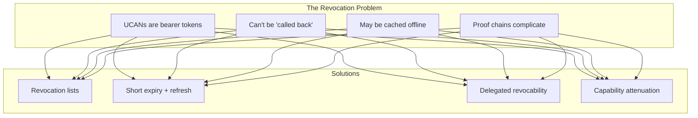

### Revocation Strategies

#### Strategy 1: Revocation Lists (Primary)

Maintain a CRDT-synced list of revoked token hashes:

```typescript
interface RevocationRecord {
  tokenHash: string // SHA-256 of the UCAN
  revokedBy: DID // Issuer who revoked
  revokedAt: number // Timestamp
  reason?: string // Optional reason
  signature: Uint8Array // Issuer's signature
}

class RevocationManager {
  private revocations: Map<string, RevocationRecord>

  async revoke(token: UCANToken, identity: Identity): Promise<void> {
    // Only issuer can revoke
    if (token.iss !== identity.did) {
      throw new Error('Only issuer can revoke')
    }

    const tokenHash = await hashToken(token)

    const record: RevocationRecord = {
      tokenHash,
      revokedBy: identity.did,
      revokedAt: Date.now(),
      signature: await identity.sign(tokenHash)
    }

    // Add to local store
    this.revocations.set(tokenHash, record)

    // Sync via CRDT
    await this.syncRevocation(record)
  }

  isRevoked(token: UCANToken): boolean {
    const tokenHash = hashTokenSync(token)
    return this.revocations.has(tokenHash)
  }

  // Verify revocation is valid
  async verifyRevocation(record: RevocationRecord): Promise<boolean> {
    const issuerKey = parseDID(record.revokedBy)
    return verify(record.tokenHash, record.signature, issuerKey)
  }
}
```

#### Strategy 2: Short Expiry + Refresh

Minimize revocation window through short-lived tokens:

```typescript
// Default token lifetime: 7 days
const DEFAULT_EXPIRY = 7 * 24 * 60 * 60 * 1000

// Short-lived tokens for sensitive operations
const SHORT_EXPIRY = 24 * 60 * 60 * 1000 // 1 day

// Refresh window: tokens can be refreshed when 50% expired
const REFRESH_THRESHOLD = 0.5

class TokenRefreshManager {
  async maybeRefresh(token: UCANToken): Promise<string | null> {
    const now = Date.now()
    const issuedAt = token.iat || now
    const expiresAt = token.exp
    const lifetime = expiresAt - issuedAt
    const elapsed = now - issuedAt

    // Refresh if past threshold
    if (elapsed > lifetime * REFRESH_THRESHOLD) {
      return this.refresh(token)
    }

    return null
  }

  async refresh(token: UCANToken): Promise<string> {
    // Create new token with same capabilities
    return createUCAN({
      issuer: token.iss,
      audience: token.aud,
      capabilities: token.att,
      expiration: Date.now() + DEFAULT_EXPIRY,
      proofs: token.prf
    })
  }
}
```

#### Strategy 3: Delegated Revocability

Include revocability information in UCANs:

```typescript
interface RevocableCapability extends UCANCapability {
  // Anyone with this capability can revoke
  revocableBy?: string[] // DIDs that can revoke

  // One-time use (consumable capability)
  nonce?: string
}

// When creating a share, set revocability
const shareCap: RevocableCapability = {
  with: 'xnet://did:alice/node/123',
  can: 'xnet/read',
  revocableBy: ['did:key:alice', 'did:key:bob'] // Both can revoke
}
```

### Revocation Flow

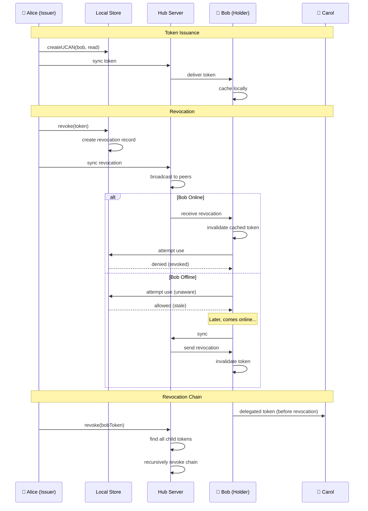

---

## Part 9: Implementation Approaches

### Approach A: Lazy UCAN Generation

Generate UCANs on-demand when needed for sync/external sharing:

```typescript
class LazyUCANIntegration {
  // Property-based grants are the source of truth
  async can(did: DID, action: string, resource: string): Promise<boolean> {
    // 1. Check property-based roles (fast path)
    const hasRole = await this.checkRolePermission(did, action, resource)
    if (hasRole) return true

    // 2. Check cached UCANs
    const cached = await this.cache.getUCANs(resource, did)
    for (const token of cached) {
      if (!this.revocationManager.isRevoked(token) && hasCapability(token, resource, action)) {
        return true
      }
    }

    return false
  }

  // Generate UCAN only when explicitly granting/sharing
  async grant(options: GrantOptions): Promise<string> {
    // Verify grantor has permission
    const canGrant = await this.can(options.issuer, 'share', options.resource)
    if (!canGrant) throw new PermissionError()

    // Generate UCAN
    const token = await createUCAN({
      issuer: options.issuer,
      audience: options.to,
      capabilities: [{ with: options.resource, can: `xnet/${options.action}` }],
      expiration: Date.now() + (options.expiresIn || DEFAULT_EXPIRY)
    })

    // Cache and sync
    await this.cache.addUCAN(token)
    await this.sync.uploadUCAN(token)

    return token
  }
}
```

**Pros:**

- Minimal UCAN generation (only for external sharing)
- Simple mental model (property-based is primary)
- Low token count

**Cons:**

- UCAN verification is secondary path
- Offline peers need role data cache
- Complex revocation (role changes don't revoke UCANs)

### Approach B: Eager UCAN Generation

Generate UCANs for all grants, use as primary authority:

```typescript
class EagerUCANIntegration {
  // UCANs are the source of truth
  async can(did: DID, action: string, resource: string): Promise<boolean> {
    // 1. Check UCAN cache
    const tokens = await this.cache.getUCANs(resource, did)
    for (const token of tokens) {
      if (this.revocationManager.isRevoked(token)) continue

      const result = verifyUCAN(token.raw)
      if (result.valid && hasCapability(result.payload!, resource, action)) {
        return true
      }
    }

    // 2. Check property-based (for nodes without explicit UCAN grants)
    const hasRole = await this.checkRolePermission(did, action, resource)
    if (hasRole) {
      // Generate implicit UCAN for caching
      const implicitToken = await this.generateImplicitUCAN(did, action, resource)
      await this.cache.addUCAN(implicitToken)
      return true
    }

    return false
  }

  // Property changes trigger UCAN generation
  async onPropertyChange(node: Node, property: string, value: unknown): Promise<void> {
    const schema = await this.getSchema(node.schemaId)

    // Check if property affects roles
    for (const [roleName, roleDef] of Object.entries(schema.roles)) {
      if (roleDef.includes(`properties.${property}`)) {
        // Generate UCANs for new role holders
        const holders = extractDIDs(value)
        for (const holder of holders) {
          await this.generateImplicitUCAN(holder, roleName, node.id)
        }
      }
    }
  }
}
```

**Pros:**

- UCAN is primary authority (consistent model)
- Self-contained offline verification
- Cryptographic audit trail

**Cons:**

- Many UCANs generated (one per role holder)
- Token management overhead
- Property changes trigger UCAN updates

### Approach C: Hybrid with UCAN-as-Roles

UCANs encode role membership, permissions evaluated from schema:

```typescript
class HybridUCANRoles {
  // UCANs grant roles, schema defines what roles can do
  async can(did: DID, action: string, resource: string): Promise<boolean> {
    // 1. Get roles this DID holds (from UCANs or properties)
    const roles = await this.getRoles(did, resource)

    // 2. Check if any role permits the action
    const schema = await this.getSchemaForResource(resource)
    const permissionExpr = schema.permissions[action]

    return this.evaluatePermission(roles, permissionExpr)
  }

  async getRoles(did: DID, resource: string): Promise<string[]> {
    const roles: string[] = []

    // From UCAN tokens
    const tokens = await this.cache.getUCANs(resource, did)
    for (const token of tokens) {
      if (this.revocationManager.isRevoked(token)) continue

      const result = verifyUCAN(token.raw)
      if (result.valid) {
        for (const cap of result.payload!.att) {
          if (cap.can.startsWith('xnet/role/')) {
            roles.push(cap.can.replace('xnet/role/', ''))
          }
        }
      }
    }

    // From property-based grants
    const node = await this.store.get(resource)
    if (node.createdBy === did) roles.push('owner')
    // ... check editors, etc.

    return [...new Set(roles)] // Deduplicate
  }

  evaluatePermission(roles: string[], expr: PermissionExpr): boolean {
    // Parse and evaluate: 'editor | admin | owner'
    // Returns true if roles satisfy expression
    return this.permissionParser.evaluate(roles, expr)
  }
}
```

**Pros:**

- Clean separation: UCANs = who, Schema = what
- Role changes don't invalidate UCANs
- Schema changes apply retroactively

**Cons:**

- Requires UCAN verification + expression evaluation
- Slightly more complex
- Caching is more nuanced

---

## Part 10: Recommendations & Next Steps

### Recommendation: Approach C (Hybrid with UCAN-as-Roles)

After analyzing all three approaches, **Approach C** provides the best balance:

| Criteria            | Approach A (Lazy) | Approach B (Eager) | Approach C (Hybrid) |
| ------------------- | ----------------- | ------------------ | ------------------- |
| **Simplicity**      | ⭐⭐⭐            | ⭐⭐               | ⭐⭐⭐              |
| **Offline Support** | ⭐⭐              | ⭐⭐⭐             | ⭐⭐⭐              |
| **Flexibility**     | ⭐⭐              | ⭐⭐               | ⭐⭐⭐              |
| **Auditability**    | ⭐⭐              | ⭐⭐⭐             | ⭐⭐⭐              |
| **Performance**     | ⭐⭐⭐            | ⭐⭐               | ⭐⭐⭐              |

**Why Approach C wins:**

1. **Clear mental model** — UCANs encode role membership, schema defines permissions
2. **Schema flexibility** — Change permissions without invalidating tokens
3. **Offline capable** — Self-contained role verification via UCAN
4. **Audit trail** — Cryptographic proof of role assignment
5. **Extensible** — Easy to add new roles or permission patterns

### Implementation Roadmap

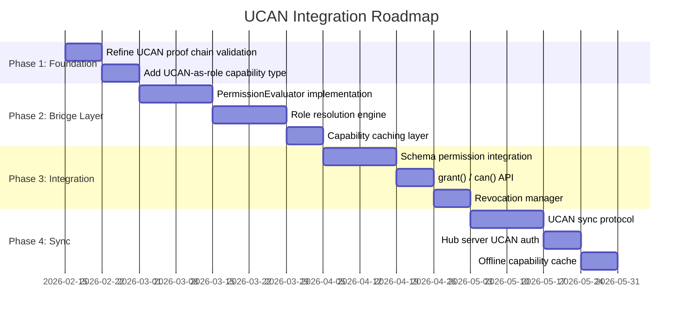

### Component Priority

#### P0 (Critical Path)

- [ ] **UCAN-as-role capability format** — Define `{ with, can: 'xnet/role/{role}' }` standard
- [ ] **PermissionEvaluator** — Core evaluation engine that checks both UCAN and property-based roles
- [ ] **Role resolution** — Map schema role expressions to actual DIDs

#### P1 (High Priority)

- [ ] **Capability cache** — Offline-capable UCAN and role cache
- [ ] **Revocation manager** — CRDT-based revocation list
- [ ] **grant() API** — User-facing method to create UCAN delegations

#### P2 (Medium Priority)

- [ ] **Attenuation constraints** — Field-level permission restrictions
- [ ] **Token refresh** — Automatic renewal of expiring tokens
- [ ] **Hub UCAN auth** — WebSocket authentication with UCAN

### Open Questions

1. **Role vs. Action UCANs** — Should UCANs encode roles or actions? (Leaning toward roles for flexibility)

2. **Token lifetime** — Default expiry of 7 days? 30 days? Configurable per schema?

3. **Revocation propagation** — How long to wait for propagation before assuming revoked?

4. **Nested role inheritance** — How many levels of `project->workspace->org` should be supported?

5. **Anonymous access** — How to handle public/shared-with-link access via UCAN?

### Research Tasks

- [ ] **Benchmark UCAN verification** — Measure impact of proof chain validation
- [ ] **Analyze SpiceDB patterns** — Study how Zanzibar handles similar problems
- [ ] **Review Local-First Auth** — Learn from their CRDT-based group membership
- [ ] **Prototype field attenuation** — Build proof-of-concept for field-level permissions

### Migration Path

For existing xNet nodes without authorization:

```typescript
// Migration: existing nodes get implicit owner
async function migrateNode(node: Node): Promise<void> {
  if (!node.permissions) {
    // Create owner UCAN for creator
    const ownerToken = await createUCAN({
      issuer: node.createdBy,
      audience: node.createdBy,
      capabilities: [
        {
          with: `xnet://${node.createdBy}/node/${node.id}`,
          can: 'xnet/*' // All actions
        }
      ]
    })

    await cache.addUCAN(ownerToken)
  }
}
```

---

## Conclusion

Integrating UCAN into xNet's hybrid authorization model is not just about adding cryptographic tokens — it's about **unifying two powerful paradigms**:

1. **Schema-based permissions** provide the developer experience and flexibility needed for complex applications
2. **UCAN capabilities** provide the cryptographic verification, delegation chains, and offline capability required for a truly decentralized system

The key insight is that these models aren't competitors — they're complementary. UCANs encode **who has what role**, schemas define **what roles can do**. This separation allows each layer to evolve independently while maintaining strong security guarantees.

By adopting the **UCAN-as-Roles** approach, xNet can:

- Maintain its ergonomic schema-based permission DSL
- Enable offline-first capability verification
- Support transitive delegation with cryptographic proof
- Provide audit trails for all access grants
- Scale from personal notes to enterprise collaboration

The result is an authorization system that is **both developer-friendly and cryptographically secure**, achieving the best of both worlds.

---

## References

- [UCAN Specification](https://ucan.xyz/specification/)
- [UCAN Delegation Spec](https://github.com/ucan-wg/delegation)
- [UCAN Invocation Spec](https://github.com/ucan-wg/invocation)
- [UCAN Revocation Spec](https://github.com/ucan-wg/revocation)
- [SpiceDB Schema Language](https://authzed.com/docs/spicedb/concepts/schema)
- [Google Zanzibar Paper](https://research.google/pubs/pub48190/)
- [Local-First Auth](https://github.com/local-first-web/auth)
- [Capability Myths Demolished](https://srl.cs.jhu.edu/pubs/SRL2003-02.pdf)
- [Exploration 0079: Authorization Schema DSL Variations](./0079_[_]_AUTH_SCHEMA_DSL_VARIATIONS.md)
- [Exploration 0077: Authorization API Design V2](./0077_[_]_AUTHORIZATION_API_DESIGN_V2.md)
- [Exploration 0076: Authorization API Design](./0076_[_]_AUTHORIZATION_API_DESIGN.md)
- [Exploration 0040: First-Class Relations](./0040_[_]_FIRST_CLASS_RELATIONS.md)
