# Node-Level Permissions & Decentralized Authorization Evaluation: Is UCAN Right for xNet?

> A critical examination of node-level permission customization requirements and a comprehensive evaluation of decentralized authorization approaches, comparing UCAN against alternatives like Local-First Auth, Access Control CRDTs, ReBAC, and hybrid models.

**Date**: February 2026  
**Status**: Exploration  
**Related**: [0080_UCAN_HYBRID_AUTHORIZATION_INTEGRATION.md](./0080_[_]_UCAN_HYBRID_AUTHORIZATION_INTEGRATION.md), [0079_AUTH_SCHEMA_DSL_VARIATIONS.md](./0079_[_]_AUTH_SCHEMA_DSL_VARIATIONS.md), [0077_AUTHORIZATION_API_DESIGN_V2.md](./0077_[_]_AUTHORIZATION_API_DESIGN_V2.md)

---

## Executive Summary

This exploration addresses two critical questions raised after reviewing UCAN integration proposals:

1. **Node-Level Permission Customization**: Can individual nodes override schema-defined permissions? How do we support field-level access, conditional permissions, and varying access levels?

2. **Is UCAN the Right Choice?**: UCAN has been the assumed solution for xNet's decentralized authorization, but is it the best fit? What alternatives exist in the local-first ecosystem, and how do they compare?

After analyzing requirements and evaluating 7 distinct authorization approaches, this exploration reveals that **a hybrid Access Control CRDT model** may better serve xNet's needs than pure UCAN, while still supporting UCAN-compatible delegation for external sharing.

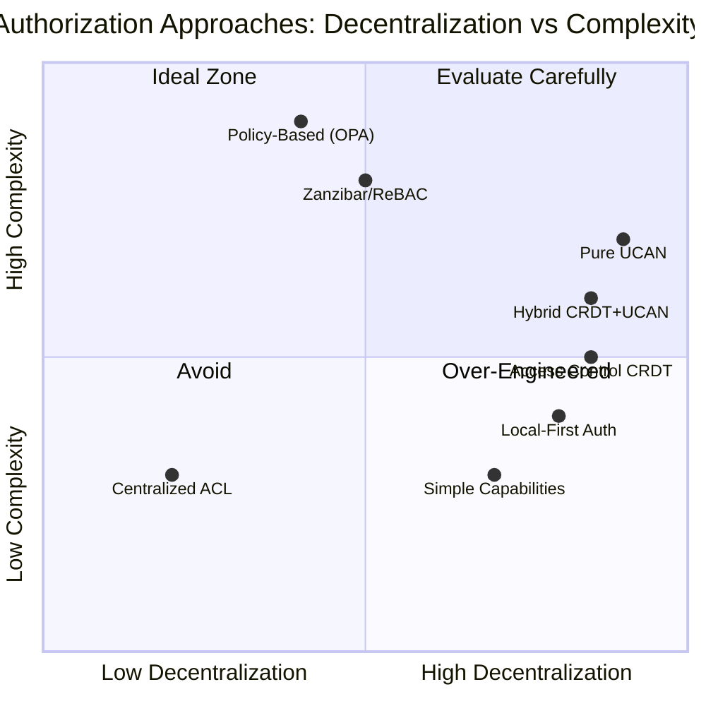

---

## Table of Contents

1. [The Node-Level Permission Problem](#part-1-the-node-level-permission-problem)
2. [Requirements Analysis](#part-2-requirements-analysis)
3. [Authorization Approaches Comparison](#part-3-authorization-approaches-comparison)
4. [Deep Dive: UCAN vs Alternatives](#part-4-deep-dive-ucan-vs-alternatives)
5. [Recommended Architecture: Hybrid CRDT Model](#part-5-recommended-architecture-hybrid-crdt-model)
6. [Implementation Considerations](#part-6-implementation-considerations)
7. [Recommendations & Decision Framework](#part-7-recommendations--decision-framework)

---

## Part 1: The Node-Level Permission Problem

### The Core Question: Schema vs Node Authority

When we say "schemas define policy, nodes store grants" (from 0077), we imply a clean separation:

- **Schema**: Immutable rules about what roles can do
- **Node**: Mutable data about who has each role

But real-world requirements blur this line:

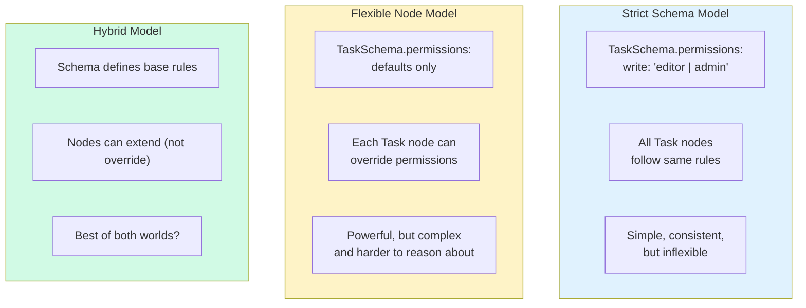

### Use Cases That Challenge the Simple Model

#### Use Case 1: Field-Level Permissions

```typescript
// Schema defines general write permission
const DocumentSchema = defineSchema({
  permissions: {
    write: 'editor | admin | owner'
  }
})

// But THIS specific document has field restrictions:
const sensitiveDoc = {
  title: 'Q4 Financial Results',
  content: '...',
  // Node-level override:
  permissions: {
    write: {
      allowed: 'editor | admin | owner',
      restrictedFields: ['executiveSummary'], // Only admin/owner
      readOnlyFields: ['createdDate'] // No one can edit
    }
  }
}
```

#### Use Case 2: Conditional Permissions Based on State

```typescript
// Can only edit if status is 'draft'
const article = {
  title: 'My Article',
  status: 'draft', // or "published", "archived"
  // Node-level conditional permission
  permissions: {
    write: {
      if: "status === 'draft'",
      then: 'editor | owner',
      else: 'owner' // Published = owner only
    }
  }
}
```

#### Use Case 3: Time-Based Access

```typescript
// Contract that becomes editable only after effective date
const contract = {
  terms: '...',
  effectiveDate: '2026-03-01',
  // Time-based permission
  permissions: {
    write: {
      before: 'effectiveDate',
      allowed: 'legal_team | owner'
    }
  }
}
```

#### Use Case 4: Dynamic Permission Inheritance

```typescript
// Folder with custom inheritance rules
const projectFolder = {
  name: 'Secret Project',
  // Override how child documents inherit
  permissions: {
    inherit: {
      from: 'parent',
      except: ['viewer'], // Don't inherit viewer role
      add: ['security_team'] // Always grant security team access
    }
  }
}
```

#### Use Case 5: Exception-Based Access

```typescript
// Generally private document, but THIS person has access
const privateNote = {
  content: '...',
  // Exception to schema rules
  permissions: {
    read: {
      default: 'owner',
      exceptions: ['did:key:bob'] // Bob can read despite not having role
    }
  }
}
```

### The Permission Override Spectrum

```mermaid
flowchart LR
    subgraph L0["Level 0: Schema-Only"]
        L0_DESC["All nodes follow<br/>schema exactly"]
        L0_PROS["Simple, predictable,<br/>cache-friendly"]
        L0_CONS["No customization,<br/>can't handle edge cases"]
    end

    subgraph L1["Level 1: Role Assignment"]
        L1_DESC["Nodes customize<br/>WHO has roles"]
        L1_PROS["Flexible membership,<br/>still simple"]
        L1_CONS["Can't customize<br/>WHAT roles can do"]
    end

    subgraph L2["Level 2: Permission Extension"]
        L2_DESC["Nodes ADD permissions<br/>(don't override)"]
        L2_PROS["More sharing options,<br/>backward compatible"]
        L2_CONS["Can't restrict,<br/>only expand"]
    end

    subgraph L3["Level 3: Full Override"]
        L3_DESC["Nodes completely redefine<br/>permissions"]
        L3_PROS["Maximum flexibility,<br/>handles all cases"]
        L3_CONS["Complex, hard to cache,<br/>security risks"]
    end

    subgraph L4["Level 4: Dynamic Rules"]
        L4_DESC["Permissions depend on<br/>state, time, conditions"]
        L4_PROS["Expressive, powerful,<br/>realistic workflows"]
        L4_CONS["Hard to reason about,<br/>testing challenges"]
    end

    L0 --> L1 --> L2 --> L3 --> L4

    style L0 fill:#4ade80
    style L1 fill:#a3e635
    style L2 fill:#fbbf24
    style L3 fill:#f87171
    style L4 fill:#dc2626
```

**Where should xNet land on this spectrum?**

---

## Part 2: Requirements Analysis

### Permission Granularity Requirements

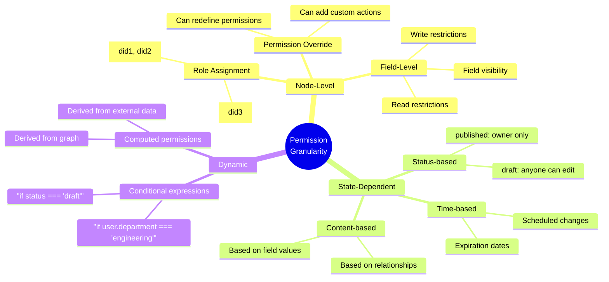

### Access Level Matrix

| Level                     | Description                          | Example                            | Complexity |
| ------------------------- | ------------------------------------ | ---------------------------------- | ---------- |
| **0. Global**             | All nodes of type follow same rules  | Schema-only permissions            | Low        |
| **1. Role Membership**    | Different people have roles per node | doc.editors = [alice, bob]         | Low        |
| **2. Action Variation**   | Nodes can enable/disable actions     | doc.permissions.archive = false    | Medium     |
| **3. Field Restriction**  | Different access per field           | doc.fields.salary.write = 'admin'  | High       |
| **4. Conditional Logic**  | Rules depend on state                | doc.canWrite if status === 'draft' | Very High  |
| **5. Dynamic Evaluation** | Rules evaluated at runtime           | doc.canWrite if user.isManager()   | Extreme    |

### Key Questions for xNet

1. **How much flexibility do users actually need?**
   - Are schema-defined roles sufficient for 80% of use cases?
   - Do we need field-level permissions, or is node-level enough?

2. **What is the performance budget?**
   - Dynamic permissions require evaluation on every access
   - Caching becomes harder with node-level overrides

3. **What is the complexity budget?**
   - More flexibility = harder to understand, test, secure
   - Simple mental models have value

4. **How does this affect sync?**
   - Permission changes need to sync like any other data
   - Conflict resolution for permission changes?

5. **What is the migration story?**
   - Can we start simple and add complexity later?
   - Will early decisions constrain future options?

---

## Part 3: Authorization Approaches Comparison

### The Landscape of Decentralized Authorization

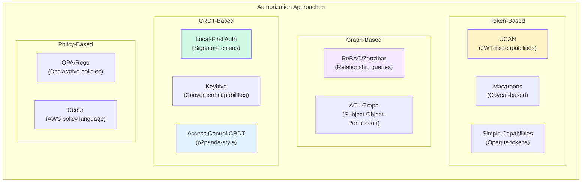

### Comparison Matrix

| Approach                | Decentralized | Offline-First | Granularity | Complexity | Sync Model        | xNet Fit  |
| ----------------------- | ------------- | ------------- | ----------- | ---------- | ----------------- | --------- |
| **UCAN**                | ✅ Excellent  | ✅ Yes        | Medium      | Medium     | Token propagation | Good      |
| **Local-First Auth**    | ✅ Excellent  | ✅ Yes        | Medium      | Low        | CRDT chain        | Very Good |
| **Access Control CRDT** | ✅ Excellent  | ✅ Yes        | High        | Medium     | CRDT merge        | Excellent |
| **Zanzibar/ReBAC**      | ⚠️ Partial    | ❌ No         | High        | High       | Centralized query | Poor      |
| **ACL CRDT**            | ✅ Good       | ✅ Yes        | Medium      | Low        | Set merge         | Good      |
| **Policy-Based**        | ❌ No         | ❌ No         | Very High   | Very High  | Centralized eval  | Poor      |
| **Macaroons**           | ⚠️ Partial    | ⚠️ Partial    | High        | High       | Token chain       | Fair      |

### Detailed Analysis by Approach

#### Approach 1: UCAN (Current Direction)

**How it works**: Cryptographic JWT-like tokens encode capabilities. Delegation creates chains. Verification checks signatures and attenuation.

```typescript
// UCAN token structure
{
  iss: "did:key:alice",
  aud: "did:key:bob",
  exp: 1234567890,
  att: [{ with: "xnet://node/123", can: "write" }],
  prf: ["parentToken..."] // Delegation chain
}
```

**Pros**:

- ✅ Cryptographically verifiable
- ✅ Self-contained (works offline)
- ✅ Supports delegation chains
- ✅ Good for external sharing
- ✅ Industry standard (IPFS, Fission use it)

**Cons**:

- ❌ Hard to revoke (bearer token problem)
- ❌ Doesn't natively support node-level overrides
- ❌ Token management complexity
- ❌ Attenuation is one-way (can't expand permissions)
- ❌ No built-in CRDT semantics

**Node-Level Override Support**: **Poor**

- UCANs encode specific capabilities
- To change permissions, issue new tokens
- Doesn't map well to "this node has custom rules"

---

#### Approach 2: Local-First Auth (Signature Chains)

**How it works**: Team membership and permissions stored in a signed, hash-chained CRDT. Every change is a signed action on the chain.

```typescript
// Signature chain structure
;[
  { type: 'CREATE_TEAM', author: 'alice', sig: '...' },
  { type: 'INVITE_MEMBER', member: 'bob', role: 'editor', author: 'alice', sig: '...' },
  { type: 'ACCEPT_INVITE', author: 'bob', sig: '...' },
  { type: 'CHANGE_ROLE', member: 'bob', newRole: 'admin', author: 'alice', sig: '...' }
]
```

**Pros**:

- ✅ True CRDT (convergent, conflict-free)
- ✅ Every change auditable
- ✅ No central authority needed
- ✅ Designed for local-first
- ✅ Handles team membership naturally

**Cons**:

- ❌ Permission evaluation requires walking chain
- ❌ Chain can grow large
- ❌ Not designed for fine-grained resource permissions
- ❌ Team-focused, not resource-focused

**Node-Level Override Support**: **Good**

- Each node could have its own chain
- Or chain entries could reference specific nodes
- More natural for team-wide permissions than per-node

---

#### Approach 3: Access Control CRDT (p2panda-style)

**How it works**: Permissions are operations in a CRDT. Group membership, role assignments, and permission grants are all convergent operations.

```typescript
// Access Control CRDT operations
type AccessOp =
  | { type: 'CREATE_GROUP'; groupId: string; creator: DID }
  | { type: 'ADD_MEMBER'; groupId: string; member: DID; role: string }
  | { type: 'REMOVE_MEMBER'; groupId: string; member: DID }
  | { type: 'GRANT_ACCESS'; resource: string; subject: DID; action: string }
  | { type: 'REVOKE_ACCESS'; resource: string; subject: DID; action: string }
  | { type: 'SET_POLICY'; resource: string; policy: Policy }
```

**Pros**:

- ✅ Native CRDT semantics
- ✅ Convergent, works offline
- ✅ Supports node-level policies
- ✅ Flexible permission model
- ✅ Designed for p2p

**Cons**:

- ❌ More complex than simple capabilities
- ❌ Policy evaluation can be expensive
- ❌ Still need to handle revocation carefully

**Node-Level Override Support**: **Excellent**

- `SET_POLICY` operation can define custom rules per node
- Policies are part of the CRDT, so they sync
- Can support field-level, conditional permissions

---

#### Approach 4: Zanzibar/ReBAC (Relationship-Based)

**How it works**: Store subject-object-relationship tuples. Query whether subject has relation to object. Compute implied relations.

```typescript
// ReBAC tuples
;[
  { user: 'alice', relation: 'owner', object: 'doc:123' },
  { user: 'bob', relation: 'editor', object: 'doc:123' },
  { user: 'doc:123', relation: 'parent', object: 'folder:456' }
  // Rewrites: folder:owner implies doc:owner
]

// Query: Check(user:alice, relation:write, object:doc:123)
// Returns: true (alice is owner)
```

**Pros**:

- ✅ Very expressive
- ✅ Handles complex inheritance
- ✅ Google-scale proven
- ✅ Clear mental model

**Cons**:

- ❌ Requires query service (not offline-first)
- ❌ Complex to implement correctly
- ❌ High latency for checks
- ❌ Not designed for local-first

**Node-Level Override Support**: **Excellent**

- ReBAC is designed for granular permissions
- Each node can have arbitrary relation tuples
- But... requires centralized query service

---

#### Approach 5: ACL CRDT (Simple Set-Based)

**How it works**: Access Control Lists stored as CRDTs. Each resource has a set of (subject, permission) pairs.

```typescript
// ACL CRDT structure
type ResourceACL = {
  resource: string
  entries: AWSet<ACLEntry> // Add-wins set
}

type ACLEntry = {
  subject: DID
  permission: string // 'read', 'write', etc.
  grantedBy: DID
  grantedAt: number
}
```

**Pros**:

- ✅ Very simple
- ✅ CRDT semantics
- ✅ Easy to understand
- ✅ Fast lookups (subject × resource)

**Cons**:

- ❌ No role concept (flat permissions)
- ❌ No inheritance
- ❌ Limited expressiveness
- ❌ Redundancy (no roles = repeated entries)

**Node-Level Override Support**: **Good**

- Each resource has its own ACL
- But limited to simple permission grants
- No conditional or field-level support

---

#### Approach 6: Policy-Based (OPA/Cedar)

**How it works**: Define authorization logic in a policy language (Rego, Cedar). Evaluate policies against context.

```cedar
// Cedar policy
permit (
  principal,
  action == Action::"write",
  resource
)
when {
  resource.owner == principal ||
  principal in resource.editors
}
unless {
  resource.status == "published" &&
  principal != resource.owner
};
```

**Pros**:

- ✅ Extremely expressive
- ✅ Can handle any logic
- ✅ Industry standards

**Cons**:

- ❌ Requires evaluation engine
- ❌ Not offline-first
- ❌ Complex to implement
- ❌ Overkill for most apps

**Node-Level Override Support**: **Excellent**

- Policies can be per-resource
- Can handle any conditional logic
- But requires policy evaluation at runtime

---

#### Approach 7: Macaroons

**How it works**: Tokens with caveats (restrictions). Each caveat attenuates the capability. Third parties can add caveats without issuer involvement.

```typescript
// Macaroon structure
{
  location: "https://example.com",
  identifier: "key-id",
  caveats: [
    "action = read",
    "resource = doc:123",
    "time < 2026-03-01",
    "third_party_caveat: needs_auth_from_auth_server"
  ],
  signature: "..."
}
```

**Pros**:

- ✅ Supports attenuation by third parties
- ✅ Can encode arbitrary caveats
- ✅ More flexible than UCAN in some ways

**Cons**:

- ❌ Complex verification
- ❌ Third-party caveats require online verification
- ❌ Less adoption than UCAN
- ❌ Not designed for local-first

**Node-Level Override Support**: **Fair**

- Caveats can express restrictions
- But adding permissions (not just restricting) is hard

---

## Part 4: Deep Dive: UCAN vs Alternatives

### UCAN's Limitations for Node-Level Permissions

Let's examine why UCAN struggles with the requirements identified in Part 1:

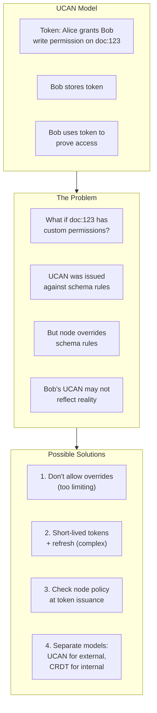

**Solution 4** is the most promising: Use UCAN for external delegation (Alice shares with Bob outside her org), but use a CRDT-based model for internal permissions.

### Where UCAN Shines vs Where It Struggles

| Scenario                                         | UCAN Fit         | Better Alternative  |
| ------------------------------------------------ | ---------------- | ------------------- |
| External sharing (invite external collaborator)  | ⭐⭐⭐ Excellent | -                   |
| Temporary access (expiring link)                 | ⭐⭐⭐ Excellent | -                   |
| Transitive delegation (Alice→Bob→Carol)          | ⭐⭐⭐ Excellent | -                   |
| Team membership (who is in the engineering team) | ⭐ Poor          | Local-First Auth    |
| Node-level permission overrides                  | ⭐ Poor          | Access Control CRDT |
| Field-level permissions                          | ⭐ Poor          | ReBAC / Policy      |
| Conditional permissions (if status === 'draft')  | ⭐ Poor          | Policy-Based        |
| Dynamic role calculation                         | ⭐ Poor          | CRDT-based          |

### The Hybrid Model: UCAN + CRDT

Rather than choosing one approach, xNet could use different mechanisms for different use cases:

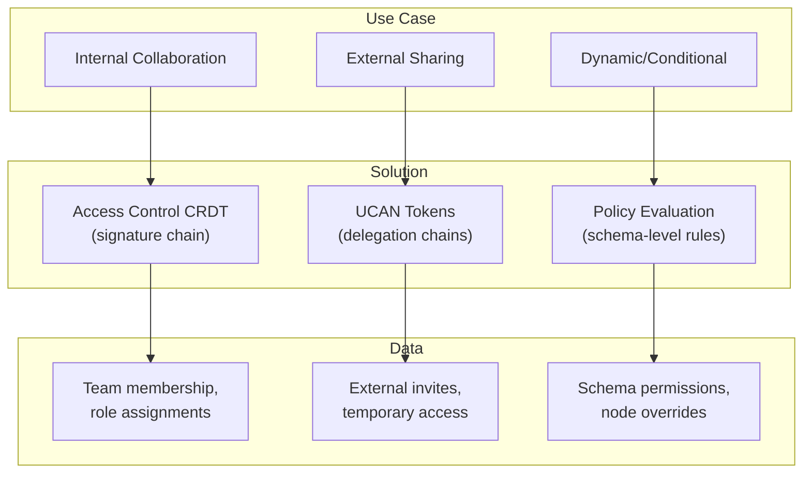

**Why this works**:

- **Internal collaboration** is CRDT-native (team membership changes frequently)
- **External sharing** benefits from UCAN's self-contained delegation
- **Dynamic permissions** evaluated at runtime from schema/node rules

---

## Part 5: Recommended Architecture: Hybrid CRDT Model

### The Proposal: Tiered Authorization

After evaluating all options, I recommend a **three-tier authorization model**:

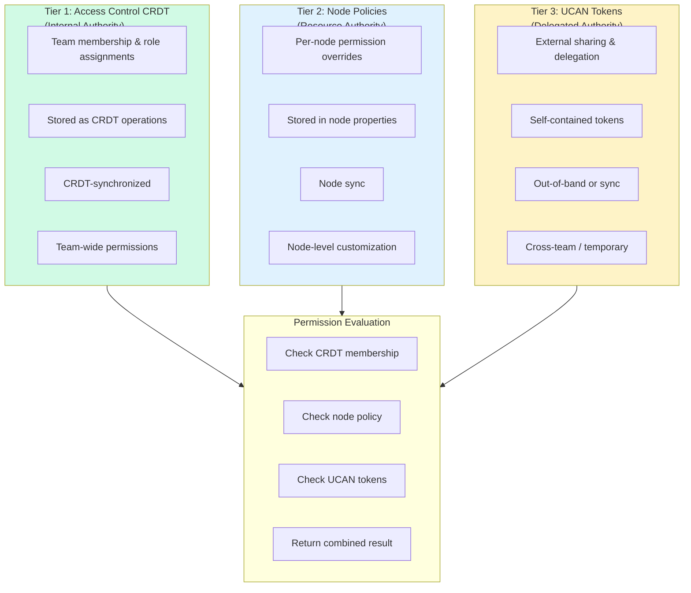

### Tier 1: Access Control CRDT (Internal Authority)

**Purpose**: Manage team membership and role assignments

```typescript
// Access Control CRDT operations
interface AccessControlCRDT {
  // Team creation
  createTeam(teamId: string, creator: DID): Operation

  // Member management
  inviteMember(teamId: string, invitee: DID, role: string, inviter: DID): Operation
  acceptInvite(teamId: string, invitee: DID): Operation
  changeRole(teamId: string, member: DID, newRole: string, changer: DID): Operation
  removeMember(teamId: string, member: DID, remover: DID): Operation

  // Permission grants (team-wide)
  grantPermission(teamId: string, member: DID, permission: string, granter: DID): Operation
  revokePermission(teamId: string, member: DID, permission: string, revoker: DID): Operation
}

// The CRDT is a signature chain
interface SignatureChain {
  teamId: string
  operations: SignedOperation[]
  // CRDT merge semantics for concurrent operations
}

interface SignedOperation {
  op: Operation
  author: DID
  signature: Uint8Array
  previousHash: string // Links operations in a chain
}
```

**Why CRDT?**

- Team membership changes are frequent and concurrent
- Multiple admins might invite people simultaneously
- Need offline capability and eventual consistency
- Every change is auditable

### Tier 2: Node Policies (Resource Authority)

**Purpose**: Per-node permission customization

```typescript
// Node policy structure
interface NodePolicy {
  // Extends (not overrides) schema permissions
  extends: boolean // true = schema permissions still apply

  // Custom permissions for this node
  permissions?: {
    [action: string]: PermissionRule
  }

  // Field-level permissions
  fields?: {
    [fieldName: string]: FieldPermissions
  }

  // Conditional rules
  conditions?: ConditionalRule[]
}

interface PermissionRule {
  // Who can perform this action
  allow: string | string[] // Role expressions

  // Additional constraints
  constraints?: {
    // Time-based
    notBefore?: number
    notAfter?: number

    // State-based
    when?: string // Expression like "status === 'draft'"

    // Field-based (for write)
    allowFields?: string[]
    denyFields?: string[]
  }
}

interface FieldPermissions {
  read: string | string[]
  write: string | string[]
  // Visibility
  hidden?: boolean // Completely hidden from some users
}

interface ConditionalRule {
  condition: string // Expression
  effect: 'allow' | 'deny'
  action: string
  target: string | string[]
}

// Example: Node with custom permissions
const taskNode = {
  id: 'task-123',
  title: 'My Task',
  status: 'draft',

  // Node-level policy
  policy: {
    extends: true, // Schema permissions still apply

    permissions: {
      write: {
        allow: 'editor | owner',
        constraints: {
          when: "status === 'draft'" // Can only edit drafts
        }
      },
      archive: {
        allow: 'owner' // Custom action
      }
    },

    fields: {
      status: {
        read: 'viewer | editor | owner',
        write: 'editor | owner'
      },
      internalNotes: {
        read: 'owner',
        write: 'owner',
        hidden: true // Hidden from non-owners entirely
      }
    }
  }
}
```

**Storage**: Node policy stored as part of the node, synced like any other property

### Tier 3: UCAN Tokens (Delegated Authority)

**Purpose**: External sharing and delegation outside the team

```typescript
// UCAN for external sharing
interface ExternalShare {
  // UCAN token
  token: string

  // Metadata
  resource: string
  grantedTo: DID
  grantedBy: DID
  permissions: string[]
  expiresAt: number

  // Sync status
  status: 'pending' | 'synced' | 'revoked'
}

// UCAN issuance (for external users)
async function createExternalShare(
  resource: string,
  grantee: DID,
  permissions: string[],
  expiresIn: number,
  identity: Identity
): Promise<ExternalShare> {
  // Verify grantor has permission
  const canShare = await checkPermission(identity.did, 'share', resource)
  if (!canShare) throw new PermissionError()

  // Create UCAN
  const token = createUCAN({
    issuer: identity.did,
    audience: grantee,
    capabilities: permissions.map((p) => ({
      with: resource,
      can: `xnet/${p}`
    })),
    expiration: Date.now() + expiresIn
  })

  return {
    token,
    resource,
    grantedTo: grantee,
    grantedBy: identity.did,
    permissions,
    expiresAt: Date.now() + expiresIn,
    status: 'pending'
  }
}
```

### Permission Evaluation Flow

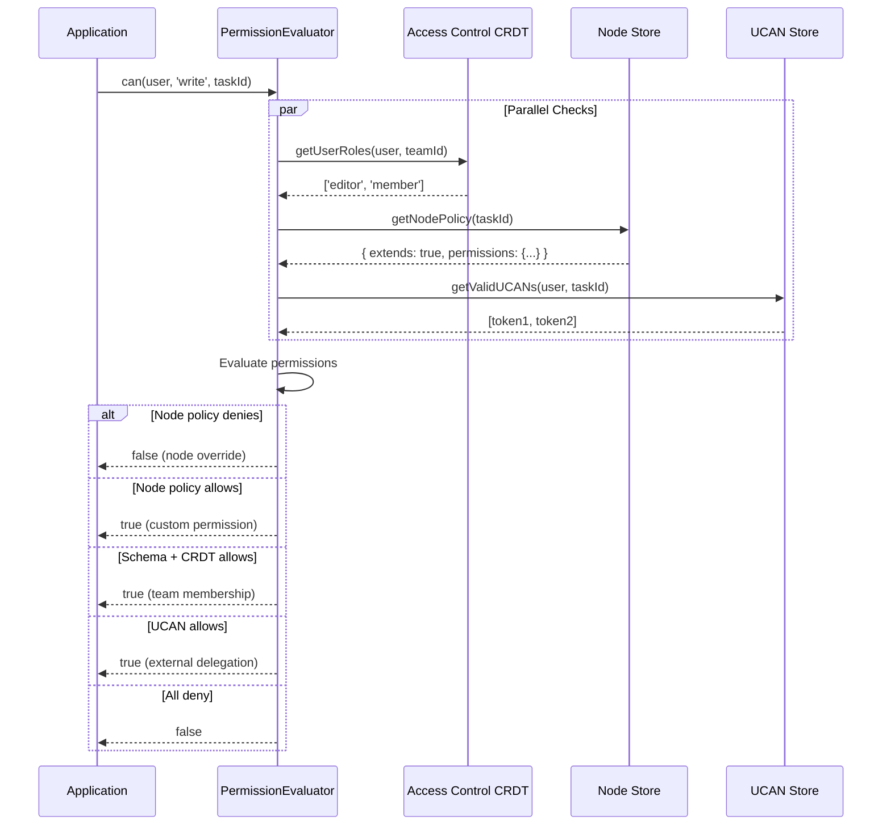

### Evaluation Priority

```typescript
enum PermissionSource {
  DENY = 0, // Explicit deny (highest priority)
  NODE_POLICY = 1, // Node-level override
  UCAN = 2, // External delegation
  CRDT = 3, // Team membership
  SCHEMA = 4, // Schema defaults
  PUBLIC = 5 // Public access (lowest priority)
}

async function evaluatePermission(
  user: DID,
  action: string,
  resource: string
): Promise<{ allowed: boolean; source: PermissionSource }> {
  // 1. Check node policy (can deny or allow)
  const nodePolicy = await getNodePolicy(resource)
  if (nodePolicy) {
    const result = evaluateNodePolicy(nodePolicy, user, action)
    if (result === 'deny') return { allowed: false, source: PermissionSource.DENY }
    if (result === 'allow') return { allowed: true, source: PermissionSource.NODE_POLICY }
  }

  // 2. Check UCAN tokens
  const ucans = await getValidUCANs(user, resource)
  for (const ucan of ucans) {
    if (hasCapability(ucan, resource, action)) {
      return { allowed: true, source: PermissionSource.UCAN }
    }
  }

  // 3. Check CRDT team membership
  const crdtResult = await checkCRDTPermission(user, action, resource)
  if (crdtResult.allowed) {
    return { allowed: true, source: PermissionSource.CRDT }
  }

  // 4. Check schema defaults
  const schemaResult = await checkSchemaPermission(user, action, resource)
  if (schemaResult.allowed) {
    return { allowed: true, source: PermissionSource.SCHEMA }
  }

  return { allowed: false, source: PermissionSource.DENY }
}
```

---

## Part 6: Implementation Considerations

### Data Storage

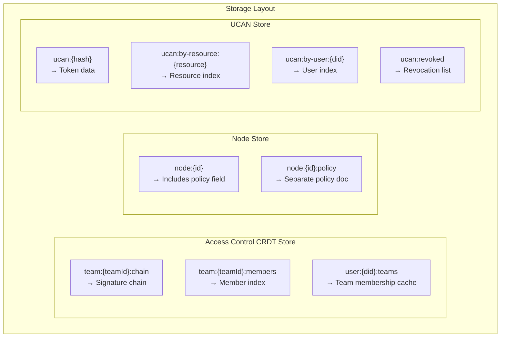

### Sync Strategy

| Tier                | Sync Mechanism | Conflict Resolution         |
| ------------------- | -------------- | --------------------------- |
| Access Control CRDT | CRDT merge     | Automatic (add-wins or LWW) |
| Node Policy         | Node sync      | Last writer wins            |
| UCAN Tokens         | Separate sync  | Revocation wins             |

### Performance Considerations

```typescript
// Caching strategy
interface PermissionCache {
  // Tier 1: CRDT results (medium TTL)
  crdt: Map<string, { roles: string[]; expires: number }>

  // Tier 2: Node policies (long TTL, invalidated on policy change)
  policies: Map<string, { policy: NodePolicy; version: number }>

  // Tier 3: UCAN verification (short TTL)
  ucans: Map<string, { valid: boolean; expires: number }>

  // Tier 4: Combined results (short TTL)
  results: Map<string, { allowed: boolean; expires: number }>
}

// Invalidation
function invalidateCache(resource: string): void {
  // Invalidate all cached results for this resource
  cache.results.delete(resource)
  cache.policies.delete(resource)
  // UCAN and CRDT caches don't need invalidation (they have TTL)
}
```

### Security Considerations

1. **Privilege Escalation**: Node policies cannot grant permissions the creator doesn't have
2. **Circular References**: Prevent permission inheritance loops
3. **Revocation**: UCANs check revocation list; CRDT operations can be reversed
4. **Audit Trail**: All permission changes logged in CRDT or node history

---

## Part 7: Recommendations & Decision Framework

### The Recommendation

**Adopt a Hybrid CRDT + UCAN Model**:

1. **Use Access Control CRDT for internal team management**
   - Team membership, role assignments
   - Convergent, offline-capable, auditable

2. **Use Node Policies for per-resource customization**
   - Stored in node properties
   - Support field-level and conditional permissions
   - Extend (don't override) schema defaults

3. **Use UCAN only for external delegation**
   - Sharing with users outside the team
   - Temporary access links
   - Cross-organization collaboration

### Decision Framework

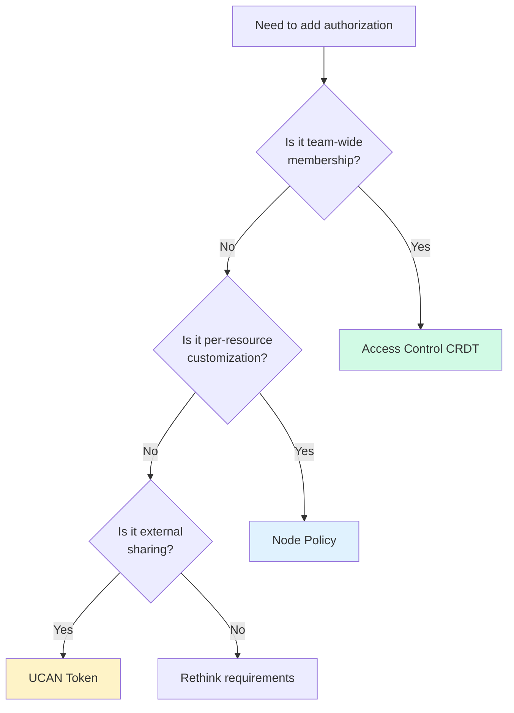

### Migration Path from Pure UCAN

```typescript
// Phase 1: Add CRDT layer
// - Implement Access Control CRDT
// - Migrate existing team membership

// Phase 2: Add Node Policies
// - Add policy field to nodes
// - Support schema-level permissions as default

// Phase 3: Reduce UCAN usage
// - UCAN only for external sharing
// - Internal permissions use CRDT + Node Policies

// Phase 4: Deprecate internal UCANs (optional)
// - Eventually consistent migration
// - Keep UCAN support for external sharing
```

### When to Use Each Approach

| Scenario                                        | Use                 |
| ----------------------------------------------- | ------------------- |
| Adding/removing team members                    | Access Control CRDT |
| Changing someone's role                         | Access Control CRDT |
| Per-node field restrictions                     | Node Policy         |
| Conditional permissions (if status === 'draft') | Node Policy         |
| Sharing with external user                      | UCAN Token          |
| Temporary access link                           | UCAN Token          |
| Cross-organization collaboration                | UCAN Token          |
| Team-wide permission grants                     | Access Control CRDT |

### Open Questions

1. **Should we support full permission override, or only extension?**
   - Extension is safer (can't accidentally lock out owner)
   - Override is more flexible
   - **Recommendation**: Start with extension only

2. **How complex should node policy expressions be?**
   - Simple: Just role lists per action
   - Medium: Role lists + field restrictions
   - Complex: Full conditional logic
   - **Recommendation**: Start simple, add complexity as needed

3. **Should UCANs be "blessed" by the Access Control CRDT?**
   - Option A: UCANs are standalone (current model)
   - Option B: UCANs reference CRDT state
   - **Recommendation**: Keep standalone for simplicity

4. **How do we handle permission conflicts?**
   - CRDT operations might conflict
   - Node policy vs Schema vs UCAN
   - **Recommendation**: Deny wins, explicit over implicit

### Final Thoughts

UCAN is a powerful tool, but it's not the right hammer for every nail. By using:

- **CRDTs** for internal team state (convergent, auditable)
- **Node Policies** for resource customization (flexible, synced)
- **UCANs** for external delegation (self-contained, delegable)

xNet can build an authorization system that is:

- ✅ Offline-first and local-first native
- ✅ Supports fine-grained node-level permissions
- ✅ Handles team membership naturally
- ✅ Still supports UCAN's excellent external sharing
- ✅ More maintainable than pure UCAN

The key insight: **Different authorization problems need different solutions**. Don't force everything into a single model.

---

## References

- [Local-First Auth](https://github.com/local-first-web/auth) - Herb Caudill's signature chain approach
- [Keyhive](https://www.inkandswitch.com/keyhive/notebook/) - Ink & Switch's convergent capabilities
- [p2panda Access Control CRDT](https://p2panda.org/2025/08/27/notes-convergent-access-control-crdt.html) - CRDT-based authorization
- [UCAN Specification](https://ucan.xyz/specification/) - User Controlled Authorization Networks
- [Google Zanzibar Paper](https://research.google/pubs/pub48190/) - Relationship-based access control
- [SpiceDB](https://authzed.com/docs/spicedb/concepts/schema) - Open source Zanzibar implementation
- [Open Policy Agent](https://www.openpolicyagent.org/) - Policy-based authorization
- [Cedar](https://www.cedarpolicy.com/) - AWS policy language
- [Macaroons](https://research.google/pubs/pub41892/) - Caveat-based authorization
- [Exploration 0080: UCAN Hybrid Integration](./0080_[_]_UCAN_HYBRID_AUTHORIZATION_INTEGRATION.md)
- [Exploration 0079: Authorization Schema DSL Variations](./0079_[_]_AUTH_SCHEMA_DSL_VARIATIONS.md)
- [Exploration 0077: Authorization API Design V2](./0077_[_]_AUTHORIZATION_API_DESIGN_V2.md)

---

## Checklist: Next Steps

### Research

- [ ] Benchmark Access Control CRDT performance
- [ ] Analyze Local-First Auth implementation details
- [ ] Study p2panda's access control patterns
- [ ] Evaluate conflict resolution strategies

### Design

- [ ] Design Access Control CRDT operation schema
- [ ] Define Node Policy expression language
- [ ] Design permission evaluation order
- [ ] Plan migration from pure UCAN

### Prototype

- [ ] Implement Access Control CRDT
- [ ] Implement Node Policy evaluator
- [ ] Integrate with existing UCAN layer
- [ ] Build permission check caching

### Testing

- [ ] Test CRDT convergence
- [ ] Test permission override scenarios
- [ ] Test offline/online transitions
- [ ] Test revocation scenarios

### Documentation

- [ ] Document three-tier model
- [ ] Create decision flowchart for developers
- [ ] Write migration guide
- [ ] Document security considerations
