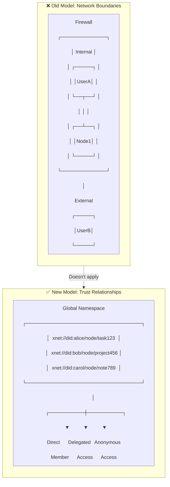
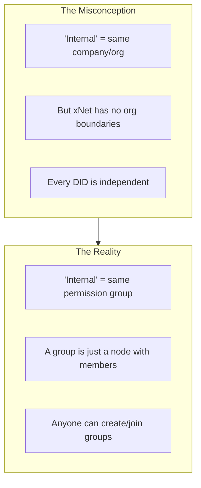
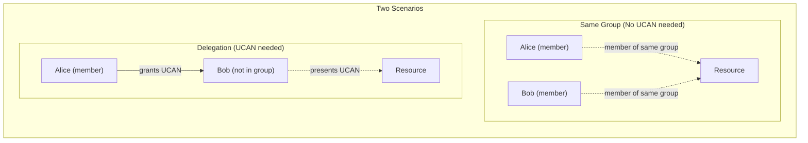
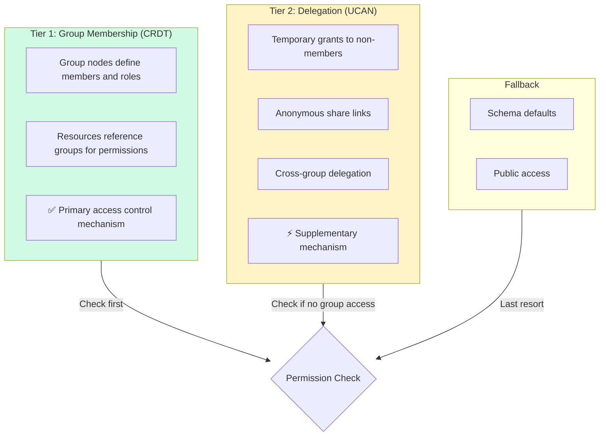
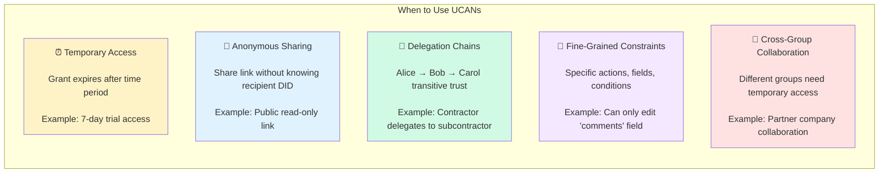
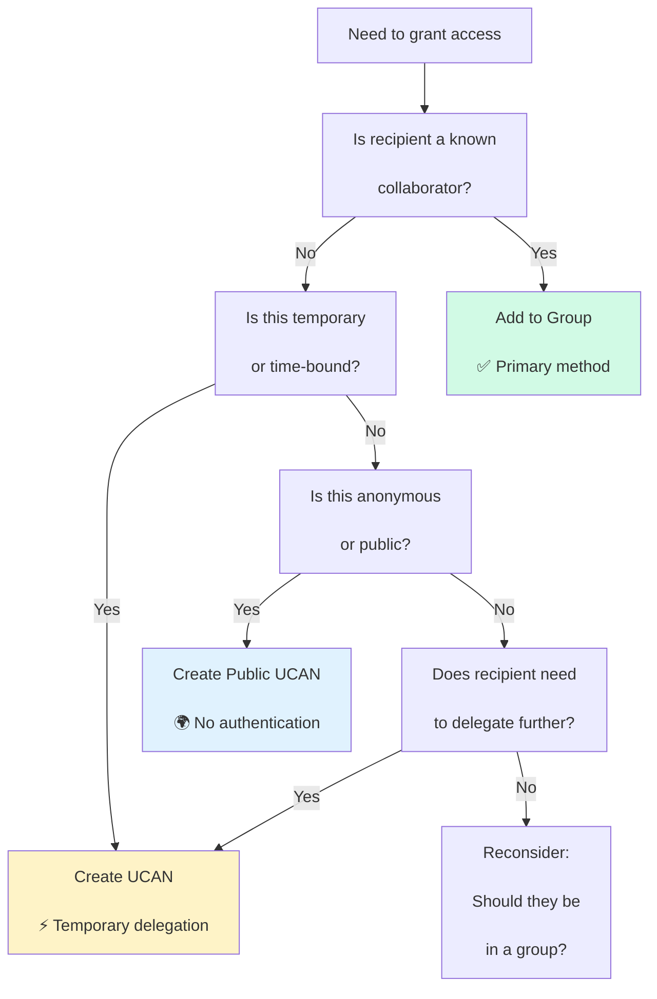

# Authorization in a Global Namespace: Rethinking Internal vs External

> A critical re-examination of the three-tier authorization model in light of xNet's global namespace design. When everything is addressable and there are no organizational walls, what do "internal" and "external" even mean?

**Date**: February 2026  
**Status**: Exploration  
**Related**: [0081_NODE_PERMISSIONS_UCAN_EVALUATION.md](./0081_[_]_NODE_PERMISSIONS_UCAN_EVALUATION.md), [0080_UCAN_HYBRID_AUTHORIZATION_INTEGRATION.md](./0080_[_]_UCAN_HYBRID_AUTHORIZATION_INTEGRATION.md)

---

## The Core Paradox

In exploration 0081, I proposed a three-tier model:

```
Tier 1: Access Control CRDT → "Internal" team management
Tier 2: Node Policies → Per-resource customization
Tier 3: UCAN Tokens → "External" delegation
```

**But here's the problem**: xNet is designed as a **global namespace**. Every node is addressable via `xnet://{did}/node/{id}`. There are no firewalls, no VPNs, no organizational boundaries. In a truly global namespace:

- Every DID is a peer
- Every node is potentially accessible
- "Inside" and "outside" are meaningless concepts

So what do we actually need to distinguish?

---

## Reframing: Trust Boundaries, Not Network Boundaries

In a global namespace, the distinction isn't about **where** someone is (internal/external), but about **relationships**:



### The Real Distinctions

Instead of "internal vs external", we should think about:

| Old Concept | New Concept               | Meaning                                            |
| ----------- | ------------------------- | -------------------------------------------------- |
| "Internal"  | **Direct Member**         | Part of the Access Control CRDT (mutual agreement) |
| "External"  | **Delegated**             | Received UCAN from a member (transitive trust)     |
| "Public"    | **Anonymous**             | No authentication required                         |
| "Team"      | **Group**                 | A node that manages membership relationships       |
| "Org"       | **Administrative Domain** | Who controls the permission CRDT                   |

---

## What "Internal" Really Means

"Internal" in 0081 actually meant: **"Part of the same Access Control CRDT"**



### Access Control CRDT = Permission Group

An "Access Control CRDT" isn't tied to an organization—it's tied to a **group**. Groups are:

- First-class nodes in the namespace
- Have members (DIDs)
- Have permission rules
- Can be nested (groups can be members of other groups)

```typescript
// A group is just a node
const engineeringTeam = {
  id: 'xnet://did:alice/node/eng-team',
  type: 'Group',
  members: [
    { did: 'did:key:bob', role: 'admin', joinedAt: 1234567890 },
    { did: 'did:key:carol', role: 'member', joinedAt: 1234567900 },
    { did: 'did:key:dave', role: 'member', joinedAt: 1234567910 }
  ],
  // Permission rules for resources owned by this group
  permissions: {
    'xnet://did:alice/node/doc-1': { read: 'member', write: 'admin' },
    'xnet://did:alice/node/doc-2': { read: 'member', write: 'member' }
  }
}
```

### Key Insight: Multiple Group Membership

A single DID can be in multiple groups:

```typescript
// Bob is in multiple groups
const bobsMemberships = {
  groups: [
    'xnet://did:alice/node/eng-team', // Engineering team
    'xnet://did:carol/node/design-team', // Design team
    'xnet://did:dave/node/secret-project', // Secret project
    'xnet://did:company/node/employees' // Company-wide
  ]
}
```

When checking permissions for `xnet://did:alice/node/doc-1`, we check if the requesting DID is in any group that has access—not whether they're "internal" or "external".

---

## What "External" Really Means

"External" in 0081 actually meant: **"Not in the Access Control CRDT, but has a UCAN"**

But here's the thing: **UCANs aren't about crossing boundaries—they're about delegation chains.**



### UCAN = Temporary/Conditional Delegation

UCANs make sense when:

1. **Temporary access**: Grant expires after 7 days
2. **Conditional access**: Only valid for specific actions
3. **Anonymous access**: Share link without knowing recipient's DID
4. **Cross-group delegation**: Alice's group member wants to share with Bob (not in group)

```typescript
// Scenario 1: Same group - no UCAN needed
// Alice and Bob are both in eng-team
// eng-team grants members read access to doc-1
// Bob reads directly (checked against group membership)

// Scenario 2: Delegation - UCAN needed
// Alice is in eng-team, Bob is not
// Alice creates UCAN granting Bob temporary access
const ucan = createUCAN({
  issuer: 'did:key:alice',
  audience: 'did:key:bob',
  capabilities: [
    {
      with: 'xnet://did:alice/node/doc-1',
      can: 'read'
    }
  ],
  expiration: Date.now() + 7 * 24 * 60 * 60 * 1000 // 7 days
})
```

---

## Simplified Two-Tier Model

Without the internal/external distinction, the model simplifies:



### Permission Evaluation Flow (Revised)

```typescript
async function checkPermission(
  subject: DID,
  action: string,
  resource: string
): Promise<PermissionResult> {
  // 1. Check resource's node policy (if any)
  const nodePolicy = await getNodePolicy(resource)
  if (nodePolicy) {
    const result = evaluateNodePolicy(nodePolicy, subject, action)
    if (result.decision === 'deny') return { allowed: false, reason: 'policy' }
    if (result.decision === 'allow') return { allowed: true, reason: 'policy' }
    // 'default' = fall through to next check
  }

  // 2. Check group membership
  const resourceOwner = parseDIDFromURI(resource)
  const groups = await getGroupsForResource(resourceOwner, resource)

  for (const group of groups) {
    const membership = await getMembership(group, subject)
    if (membership && hasPermission(group, membership.role, action)) {
      return { allowed: true, reason: 'group', group: group.id }
    }
  }

  // 3. Check UCAN tokens (delegation)
  const ucans = await getValidUCANs(subject, resource)
  for (const ucan of ucans) {
    if (hasCapability(ucan, resource, action)) {
      return { allowed: true, reason: 'delegation', ucan }
    }
  }

  // 4. Check schema defaults
  const schema = await getSchema(resource)
  if (schema.permissions[action]?.includes('public')) {
    return { allowed: true, reason: 'public' }
  }

  return { allowed: false, reason: 'no-access' }
}
```

---

## Groups as First-Class Citizens

### Group Node Schema

```typescript
const GroupSchema = defineSchema({
  name: 'Group',
  namespace: 'xnet://xnet.fyi/',

  properties: {
    name: text({ required: true }),
    description: text(),

    // Members stored as a map property
    members: map({
      key: 'did',
      value: object({
        role: enum(['owner', 'admin', 'member', 'guest']),
        joinedAt: timestamp(),
        invitedBy: did()
      })
    }),

    // Parent groups (for nested hierarchies)
    parentGroups: relation({
      target: 'xnet://xnet.fyi/Group',
      multiple: true
    }),

    // Permission templates for resources owned by this group
    permissionTemplates: object({
      default: permissionExpr(),
      byRole: map({
        key: 'role',
        value: permissionExpr()
      })
    })
  },

  permissions: {
    read: 'member | parentGroup->member',
    write: 'admin | owner',
    manage: 'owner',
    invite: 'admin | owner'
  },

  roles: {
    owner: 'properties.members[?role===owner]',
    admin: 'properties.members[?role===admin]',
    member: 'properties.members[?role===member]',
    guest: 'properties.members[?role===guest]'
  }
})
```

### Resource Referencing Groups

```typescript
// A document that uses group-based permissions
const projectDoc = {
  id: 'xnet://did:alice/node/project-spec',
  title: 'Project Specification',

  // Instead of listing individual editors, reference groups
  acl: {
    // Primary group - full control
    'xnet://did:alice/node/eng-team': {
      read: 'member',
      write: 'admin',
      delete: 'owner'
    },

    // Secondary group - read only
    'xnet://did:company/node/managers': {
      read: 'member'
    },

    // Individual exceptions (rare)
    'did:key:consultant123': {
      read: true,
      write: false
    }
  },

  // Fallback if no group matches
  defaultAccess: 'none' // or 'read' for public docs
}
```

---

## Addressing the Original Use Cases

Let's revisit the use cases from 0081 with this new model:

### Use Case 1: Field-Level Permissions

```typescript
// Node policy still works, but group can also define field permissions
const sensitiveDoc = {
  id: 'xnet://did:alice/node/financial-report',

  // Group-based permissions
  acl: {
    'xnet://did:alice/node/finance-team': {
      fields: {
        '*': { read: 'member', write: 'admin' },
        executiveSummary: { read: 'admin', write: 'owner' }
      }
    }
  }
}
```

### Use Case 2: Conditional Permissions

```typescript
// State-based permissions can be evaluated by the group or node policy
const article = {
  id: 'xnet://did:alice/node/blog-post',
  status: 'draft',

  acl: {
    'xnet://did:alice/node/writers': {
      // Conditional based on node state
      write: {
        condition: "status === 'draft'",
        role: 'member'
      }
    }
  }
}
```

### Use Case 3: Time-Based Access

```typescript
// UCAN makes sense here (temporary delegation)
const contract = {
  id: 'xnet://did:alice/node/contract',
  effectiveDate: '2026-03-01',

  // Permanent access via group
  acl: {
    'xnet://did:alice/node/legal-team': {
      read: 'member'
    }
  }

  // Temporary access via UCAN (issued by legal team member)
  // UCAN: legal-team-member → external-counsel (expires after review period)
}
```

### Use Case 4: External Consultant Access

```typescript
// Consultant not in any group → needs UCAN
// Group member issues UCAN to consultant
const designDoc = {
  id: 'xnet://did:alice/node/design',

  acl: {
    'xnet://did:alice/node/design-team': {
      read: 'member',
      write: 'member'
    }
  }

  // Consultant (not in design-team) gets UCAN from team member
  // Check order: 1) Group membership (no), 2) UCAN (yes)
}
```

---

## When UCANs Still Make Sense

Even in a global namespace with groups, UCANs are valuable for:



---

## Revised Recommendation

### The Two-Tier Model

```typescript
// Tier 1: Groups (primary mechanism)
interface Group {
  id: string
  members: Map<DID, MemberInfo>
  permissionTemplates: PermissionTemplates
}

// Tier 2: UCANs (supplementary)
interface Delegation {
  token: string
  issuer: DID
  audience: DID
  capabilities: Capability[]
  expiration: number
}

// Resources reference groups
interface Resource {
  id: string
  groupACL: Map<GroupID, GroupPermissions>
  individualACL?: Map<DID, IndividualPermissions> // Rare
  defaultAccess: 'none' | 'read' | 'write'
}
```

### Permission Priority

1. **Node Policy** (if explicitly denies)
2. **Group Membership** (check all groups in ACL)
3. **UCAN Delegation** (temporary grants)
4. **Schema Defaults**

### Decision Framework



---

## Conclusion

The "internal vs external" framing from 0081 was a carryover from traditional network-based security models. In xNet's global namespace, it doesn't apply.

**The real distinctions are:**

1. **Group Member** → Part of a permission group (Access Control CRDT)
2. **Delegated** → Has UCAN from a member (temporary/conditional access)
3. **Anonymous** → Public access (UCAN with no specific audience)

**Groups are first-class nodes** in the global namespace, not organizational boundaries. Anyone can create groups, join groups (with invitation), and assign permissions based on group membership.

**UCANs are for exceptions**: temporary access, anonymous sharing, and delegation chains—not for crossing imaginary boundaries.

This simplifies the model while maintaining all the expressiveness. The key insight: **in a global namespace, trust relationships replace network boundaries.**

---

## References

- [Exploration 0081: Node Permissions & UCAN Evaluation](./0081_[_]_NODE_PERMISSIONS_UCAN_EVALUATION.md)
- [Exploration 0080: UCAN Hybrid Authorization Integration](./0080_[_]_UCAN_HYBRID_AUTHORIZATION_INTEGRATION.md)
- [UCAN Specification](https://ucan.xyz/specification/)
- [Local-First Auth](https://github.com/local-first-web/auth) - Signature chains for group membership
- [Keyhive](https://www.inkandswitch.com/keyhive/notebook/) - Convergent capabilities in global namespace

---

## Checklist: Revising Implementation

### Remove

- [ ] References to "internal" vs "external"
- [ ] Assumptions about organizational boundaries
- [ ] Network-based security model assumptions

### Add

- [ ] Group as first-class node type
- [ ] Multi-group membership support
- [ ] Cross-group permission resolution
- [ ] Clear UCAN use case documentation

### Update

- [ ] Permission evaluation flow
- [ ] Developer documentation
- [ ] API naming (remove internal/external terminology)
