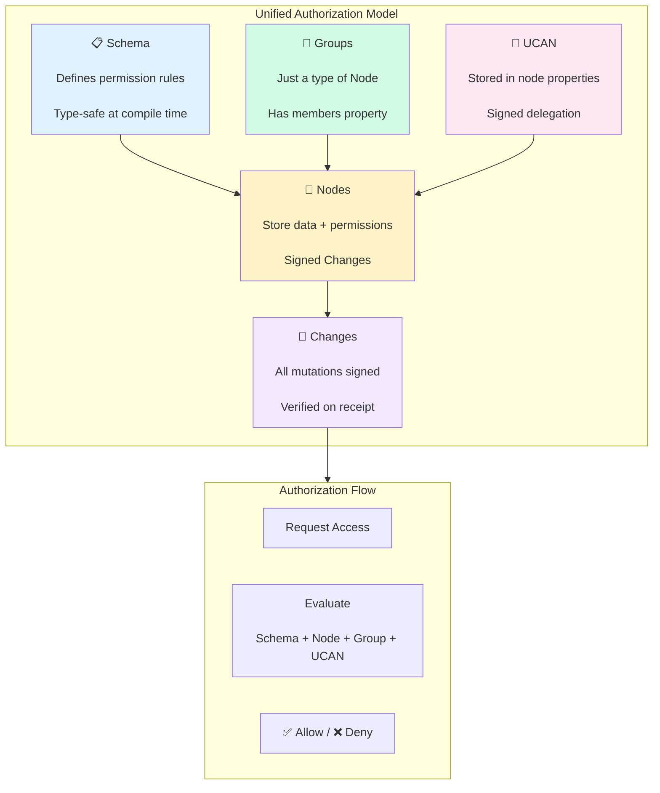
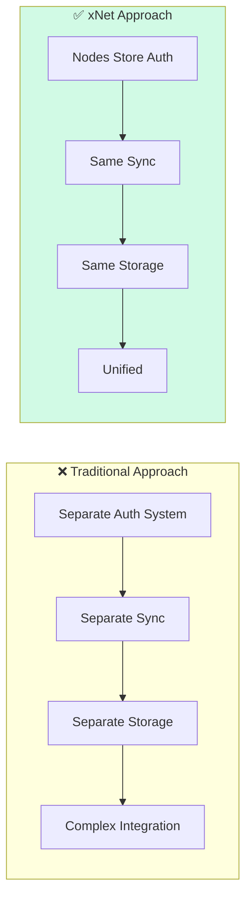
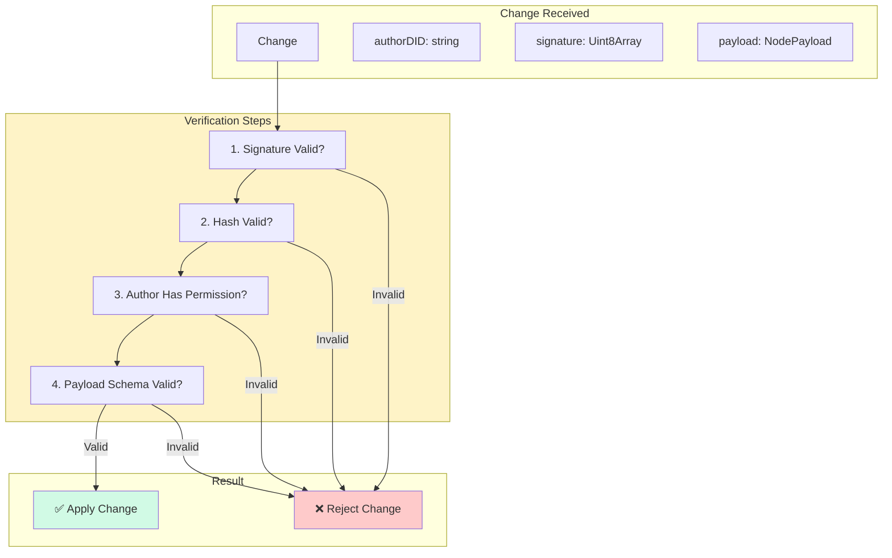
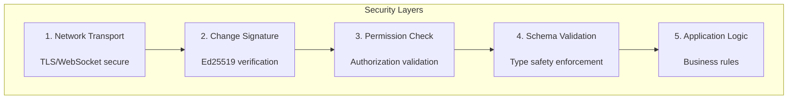

# Unified Authorization Architecture: A Type-Safe, Elegant API for xNet

> Bringing together schema permissions, node-level policies, groups, and UCANs into a cohesive, type-safe, and performant authorization system that feels elegant to developers while maintaining security and auditability.

**Date**: February 2026  
**Status**: Exploration  
**Related**: [0082_GLOBAL_NAMESPACE_AUTHORIZATION.md](./0082_[_]_GLOBAL_NAMESPACE_AUTHORIZATION.md), [0081_NODE_PERMISSIONS_UCAN_EVALUATION.md](./0081_[_]_NODE_PERMISSIONS_UCAN_EVALUATION.md), [0080_UCAN_HYBRID_AUTHORIZATION_INTEGRATION.md](./0080_[_]_UCAN_HYBRID_AUTHORIZATION_INTEGRATION.md), [0079_AUTH_SCHEMA_DSL_VARIATIONS.md](./0079_[_]_AUTH_SCHEMA_DSL_VARIATIONS.md)

---

## Executive Summary

This exploration synthesizes concepts from 0079-0082 into a unified, type-safe authorization architecture. The key insight: **Everything is a Node**.

- **Schemas** define permission rules (as code)
- **Nodes** store data and permission grants (as data)
- **Groups** are just nodes with member properties
- **UCANs** are signed delegation tokens stored as node properties
- **Changes** to permissions are signed and verified like any other change

The result is a system where:

- ✅ Everything is type-safe and TypeScript-checkable
- ✅ All authorization state is CRDT-synced
- ✅ All changes are signed, hashed, and auditable
- ✅ The DX is clean and elegant
- ✅ Performance is maintained through intelligent caching



---

## Part 1: The Philosophy - Everything is a Node

### Why Nodes Are the Foundation

In xNet, we already have:

- **Nodes** with signed, CRDT-synced changes
- **Change<T>** with Ed25519 signatures
- **NodeStore** with conflict resolution

Instead of building a parallel permission system, we leverage this foundation:



### The Node-Centric Authorization Model

```typescript
// Every authorization concept maps to a node
interface AuthorizationModel {
  // 1. Regular data nodes
  task: Node<TaskData>
  document: Node<DocumentData>

  // 2. Group nodes (just nodes with member properties)
  team: Node<GroupData>

  // 3. UCAN delegations (stored as node properties)
  delegation: UCANToken // Signed, stored in node

  // 4. Permission changes (just changes to nodes)
  grant: Change<NodePayload> // Signed, sync'd
}
```

---

## Part 2: Type-Safe Schema Definition

### Defining Schemas with Permissions

```typescript
// @xnet/data - Schema definition with permissions
import { defineSchema, text, person, relation, group } from '@xnet/data'

// Permission expression type (type-safe!)
type PermissionExpr =
  | 'owner'
  | 'public'
  | 'authenticated'
  | `group:${string}`
  | `group:${string}:${string}` // group:role
  | `${PermissionExpr} | ${PermissionExpr}`
  | `${PermissionExpr} & ${PermissionExpr}`

// Define schema with permissions
const TaskSchema = defineSchema({
  name: 'Task',
  namespace: 'xnet://xnet.fyi/',

  properties: {
    title: text({ required: true }),
    assignee: person(),
    // Group references stored as relations
    team: group({ required: true })
  },

  // Permission rules (type-safe!)
  permissions: {
    // Who can read this node
    read: 'group:team:member | owner' as const,

    // Who can write
    write: 'group:team:member | owner' as const,

    // Who can delete
    delete: 'owner' as const,

    // Custom actions
    archive: 'group:team:admin | owner' as const,
    assign: 'group:team:admin | owner' as const
  },

  // How roles are determined (can be overridden per node)
  roles: {
    owner: 'createdBy',
    member: 'properties.team:member', // Reference to group
    admin: 'properties.team:admin'
  }
})

// Type inference
type Task = InferSchema<typeof TaskSchema>
// Task.permissions.read = 'group:team:member | owner'
// Task.permissions.write = 'group:team:member | owner'

// Compile-time validation!
const invalidSchema = defineSchema({
  permissions: {
    // ❌ Type error: 'invalid-role' not in PermissionExpr
    read: 'invalid-role' as const
  }
})
```

### Field-Level Permissions

```typescript
const DocumentSchema = defineSchema({
  name: 'Document',
  namespace: 'xnet://xnet.fyi/',

  properties: {
    title: text({ required: true }),
    content: text(),
    metadata: {
      classification: select({
        options: ['public', 'internal', 'confidential'] as const
      })
    }
  },

  // Field-level permissions
  fields: {
    title: {
      read: 'public' as const,
      write: 'owner | group:editors' as const
    },
    content: {
      read: 'group:readers | owner' as const,
      write: 'group:editors | owner' as const
    },
    'metadata.classification': {
      read: 'group:readers | owner' as const,
      write: 'group:admins | owner' as const
    }
  },

  permissions: {
    read: 'public' as const, // Default for unspecified fields
    write: 'owner' as const
  }
})
```

### Conditional Permissions

```typescript
const ContractSchema = defineSchema({
  name: 'Contract',
  namespace: 'xnet://xnet.fyi/',

  properties: {
    status: select({
      options: ['draft', 'review', 'signed', 'expired'] as const
    }),
    parties: relation({ target: 'xnet://xnet.fyi/Party', multiple: true }),
    expiresAt: date()
  },

  permissions: {
    // Conditional based on node state
    write: {
      condition: "status === 'draft'",
      allow: 'group:legal | owner',
      else: 'owner' // After signing, only owner can edit
    },

    // Time-based
    sign: {
      condition: 'Date.now() < expiresAt',
      allow: 'properties.parties:member'
    }
  }
})
```

---

## Part 3: Groups as First-Class Nodes

### Group Schema Definition

```typescript
// Groups are just schemas with member properties
const GroupSchema = defineSchema({
  name: 'Group',
  namespace: 'xnet://xnet.fyi/',

  properties: {
    name: text({ required: true }),
    description: text(),

    // Members stored as a map: DID -> MemberInfo
    members: map({
      key: 'did',
      value: object({
        role: enum(['owner', 'admin', 'member', 'guest'] as const),
        joinedAt: timestamp(),
        invitedBy: did(),
      })
    }),

    // Parent groups (for nested hierarchies)
    parentGroups: relation({
      target: 'xnet://xnet.fyi/Group',
      multiple: true
    }),
  },

  permissions: {
    read: 'member | parentGroups:member' as const,
    write: 'admin | owner' as const,
    invite: 'admin | owner' as const,
    manage: 'owner' as const,
  },

  roles: {
    owner: "properties.members[?role === 'owner']",
    admin: "properties.members[?role === 'admin']",
    member: "properties.members[?role === 'member' || role === 'admin' || role === 'owner']",
    guest: "properties.members[?role === 'guest']",
  }
})

// Create a group (just creating a node)
const engineeringTeam = await store.createNode(GroupSchema, {
  name: 'Engineering Team',
  members: {
    'did:key:alice': { role: 'owner', joinedAt: Date.now() },
    'did:key:bob': { role: 'admin', joinedAt: Date.now() },
    'did:key:carol': { role: 'member', joinedAt: Date.now() },
  }
})
```

### Multi-Group Membership

```typescript
// Users can be in multiple groups
const userMemberships = {
  'did:key:bob': [
    'xnet://did:alice/node/eng-team',
    'xnet://did:carol/node/design-team',
    'xnet://did:dave/node/secret-project'
  ]
}

// Check permission across all groups
async function checkPermission(user: DID, action: string, resource: Node): Promise<boolean> {
  // Get all groups referenced by the resource
  const groups = extractGroupReferences(resource)

  for (const groupId of groups) {
    const group = await store.getNode(groupId)
    const memberInfo = group.properties.members[user]

    if (memberInfo && hasRolePermission(group, memberInfo.role, action)) {
      return true
    }
  }

  return false
}
```

---

## Part 4: UCAN as Node Properties

### UCAN Storage Model

UCANs are signed tokens stored as node properties. They sync just like any other data:

```typescript
// UCAN stored in node properties
interface DelegationNode {
  id: string
  type: 'Delegation'

  properties: {
    // The UCAN token (JWT format)
    token: string

    // Parsed for querying
    issuer: DID
    audience: DID
    capabilities: UCANCapability[]
    expiresAt: number

    // Token hash for revocation lookup
    tokenHash: string

    // Status
    status: 'active' | 'revoked' | 'expired'

    // Revocation info (if revoked)
    revokedAt?: number
    revokedBy?: DID
  }
}

// Create a delegation (creates a node)
async function createDelegation(
  resource: string,
  grantee: DID,
  permissions: string[],
  expiresIn: number
): Promise<DelegationNode> {
  // Create UCAN token
  const token = createUCAN({
    issuer: identity.did,
    audience: grantee,
    capabilities: permissions.map((p) => ({
      with: resource,
      can: `xnet/${p}`
    })),
    expiration: Date.now() + expiresIn
  })

  // Create delegation node
  return store.createNode(DelegationSchema, {
    token,
    issuer: identity.did,
    audience: grantee,
    capabilities: permissions,
    expiresAt: Date.now() + expiresIn,
    tokenHash: await hashToken(token),
    status: 'active'
  })
}
```

### UCAN Schema Definition

```typescript
const DelegationSchema = defineSchema({
  name: 'Delegation',
  namespace: 'xnet://xnet.fyi/',

  properties: {
    token: text({ required: true }),
    issuer: did({ required: true }),
    audience: did({ required: true }),
    capabilities: array(object({
      with: text(),
      can: text()
    })),
    expiresAt: timestamp({ required: true }),
    tokenHash: text({ required: true }),
    status: enum(['active', 'revoked', 'expired'] as const),
    revokedAt: timestamp(),
    revokedBy: did(),
  },

  permissions: {
    // Only issuer and audience can read
    read: 'owner | properties.audience' as const,
    write: 'owner' as const,
    revoke: 'properties.issuer | owner' as const,
  }
})
```

### Revocation as Node Update

```typescript
// Revoke a delegation (just update the node)
async function revokeDelegation(delegationId: string): Promise<void> {
  const delegation = await store.getNode(delegationId)

  // Verify we have permission to revoke
  if (delegation.properties.issuer !== identity.did) {
    throw new PermissionError('Only issuer can revoke')
  }

  // Update node (creates a signed change)
  await store.updateNode(delegationId, {
    status: 'revoked',
    revokedAt: Date.now(),
    revokedBy: identity.did
  })

  // Sync the revocation
  await sync.sync()
}
```

---

## Part 5: The Verification Pipeline

### How Authorization Changes Are Verified

All changes go through the same verification pipeline:



### Permission Check Middleware

```typescript
// NodeStore with permission middleware
class PermissionAwareNodeStore {
  constructor(
    private storage: NodeStorageAdapter,
    private identity: Identity,
    private permissionEvaluator: PermissionEvaluator
  ) {}

  async updateNode(nodeId: string, updates: Partial<NodeData>): Promise<Change<NodePayload>> {
    // 1. Check write permission
    const canWrite = await this.permissionEvaluator.can({
      subject: this.identity.did,
      action: 'write',
      resource: nodeId
    })

    if (!canWrite) {
      throw new PermissionError(`Cannot write to ${nodeId}`)
    }

    // 2. Check field-level permissions
    for (const [field, value] of Object.entries(updates)) {
      const canWriteField = await this.permissionEvaluator.can({
        subject: this.identity.did,
        action: `write:${field}`,
        resource: nodeId
      })

      if (!canWriteField) {
        throw new PermissionError(`Cannot write field ${field}`)
      }
    }

    // 3. Create and sign change
    const change = await this.createChange(nodeId, updates)

    // 4. Store and sync
    await this.storage.appendChange(change)

    return change
  }

  // Incoming changes from sync
  async applyRemoteChange(change: Change<NodePayload>): Promise<void> {
    // 1. Verify signature
    if (!verifyChangeSignature(change)) {
      console.warn('Invalid signature, rejecting change')
      return
    }

    // 2. Verify author has permission
    const canWrite = await this.permissionEvaluator.can({
      subject: change.authorDID,
      action: 'write',
      resource: change.payload.nodeId
    })

    if (!canWrite) {
      console.warn(`Author ${change.authorDID} not authorized for ${change.payload.nodeId}`)
      return
    }

    // 3. Apply change
    await this.storage.appendChange(change)
  }
}
```

### PermissionEvaluator Implementation

```typescript
interface PermissionEvaluator {
  can(request: PermissionRequest): Promise<boolean>
  explain(request: PermissionRequest): Promise<PermissionExplanation>
}

interface PermissionRequest {
  subject: DID
  action: string
  resource: string
}

interface PermissionExplanation {
  allowed: boolean
  reason: string
  source: 'schema' | 'node' | 'group' | 'ucan' | 'deny'
  details: Record<string, unknown>
}

class UnifiedPermissionEvaluator implements PermissionEvaluator {
  constructor(
    private store: NodeStore,
    private schemaRegistry: SchemaRegistry,
    private delegationStore: DelegationStore
  ) {}

  async can(request: PermissionRequest): Promise<boolean> {
    const explanation = await this.explain(request)
    return explanation.allowed
  }

  async explain(request: PermissionRequest): Promise<PermissionExplanation> {
    const { subject, action, resource } = request

    // 1. Get node and schema
    const node = await this.store.getNode(resource)
    if (!node) {
      return { allowed: false, reason: 'Node not found', source: 'deny', details: {} }
    }

    const schema = this.schemaRegistry.get(node.schemaId)

    // 2. Check node policy override (if denies)
    if (node.policy?.permissions?.[action] === false) {
      return {
        allowed: false,
        reason: 'Explicitly denied by node policy',
        source: 'deny',
        details: { nodeId: resource }
      }
    }

    // 3. Check group membership
    const groupResult = await this.checkGroupPermissions(subject, action, node, schema)
    if (groupResult.allowed) {
      return groupResult
    }

    // 4. Check UCAN delegations
    const ucanResult = await this.checkUCANPermissions(subject, action, resource)
    if (ucanResult.allowed) {
      return ucanResult
    }

    // 5. Check schema defaults
    if (schema.permissions[action]?.includes('public')) {
      return {
        allowed: true,
        reason: 'Public access allowed by schema',
        source: 'schema',
        details: { schemaId: schema.id }
      }
    }

    // 6. Check owner
    if (node.createdBy === subject && schema.permissions[action]?.includes('owner')) {
      return {
        allowed: true,
        reason: 'User is owner',
        source: 'node',
        details: { owner: node.createdBy }
      }
    }

    return {
      allowed: false,
      reason: 'No permission source allows this action',
      source: 'deny',
      details: { checked: ['node', 'group', 'ucan', 'schema'] }
    }
  }

  private async checkGroupPermissions(
    subject: DID,
    action: string,
    node: Node,
    schema: Schema
  ): Promise<PermissionExplanation> {
    // Extract group references from node
    const groupRefs = this.extractGroupReferences(node, schema)

    for (const groupId of groupRefs) {
      const group = await this.store.getNode(groupId)
      if (!group || group.type !== 'Group') continue

      const memberInfo = group.properties.members[subject]
      if (!memberInfo) continue

      // Check if role has permission
      const role = memberInfo.role
      const permissionExpr = schema.permissions[action]

      if (this.roleSatisfies(role, permissionExpr, groupId)) {
        return {
          allowed: true,
          reason: `Member of group ${groupId} with role ${role}`,
          source: 'group',
          details: { groupId, role, memberSince: memberInfo.joinedAt }
        }
      }
    }

    return { allowed: false, reason: 'Not in any authorized group', source: 'deny', details: {} }
  }

  private async checkUCANPermissions(
    subject: DID,
    action: string,
    resource: string
  ): Promise<PermissionExplanation> {
    // Query delegation store for valid UCANs
    const delegations = await this.delegationStore.findByAudience(subject)

    for (const delegation of delegations) {
      if (delegation.properties.status !== 'active') continue
      if (delegation.properties.expiresAt < Date.now()) continue

      // Verify UCAN signature
      const result = verifyUCAN(delegation.properties.token)
      if (!result.valid) continue

      // Check capability
      const hasCap = result.payload.att.some(
        (cap) => cap.with === resource && (cap.can === `xnet/${action}` || cap.can === 'xnet/*')
      )

      if (hasCap) {
        return {
          allowed: true,
          reason: 'Valid UCAN delegation',
          source: 'ucan',
          details: {
            issuer: delegation.properties.issuer,
            expiresAt: delegation.properties.expiresAt
          }
        }
      }
    }

    return { allowed: false, reason: 'No valid UCAN found', source: 'deny', details: {} }
  }

  private extractGroupReferences(node: Node, schema: Schema): string[] {
    // Extract group IDs from node properties based on schema
    const refs: string[] = []

    for (const [key, value] of Object.entries(node.properties)) {
      if (schema.properties[key]?.type === 'group') {
        refs.push(value as string)
      }
    }

    return refs
  }

  private roleSatisfies(role: string, permissionExpr: string, groupId: string): boolean {
    // Simple permission expression evaluation
    // 'group:team:admin' matches role 'admin' in group 'team'
    const expr = permissionExpr.replace(/group:(\w+):(\w+)/g, (_, group, requiredRole) => {
      return groupId.includes(group) && role === requiredRole ? 'true' : 'false'
    })

    return expr.includes('true') || expr.includes(role)
  }
}
```

---

## Part 6: Developer API - Clean and Elegant

### The Complete Developer Experience

```typescript
// @xnet/react - React hooks
import { useNode, usePermission, useGroup, useShare } from '@xnet/react'

function TaskCard({ taskId }: { taskId: string }) {
  // Get node data
  const task = useNode(TaskSchema, taskId)

  // Check permissions (reactive!)
  const { canRead, canWrite, canDelete, canArchive } = usePermission(taskId)

  // Get group info
  const team = useGroup(task.properties.team)

  return (
    <div>
      <h3>{task.properties.title}</h3>
      <p>Team: {team?.properties.name}</p>

      {canWrite && <EditButton task={task} />}
      {canDelete && <DeleteButton taskId={taskId} />}
      {canArchive && <ArchiveButton taskId={taskId} />}

      <ShareDialog taskId={taskId} />
    </div>
  )
}

function ShareDialog({ taskId }: { taskId: string }) {
  const { canShare } = usePermission(taskId)
  const { share, revoke, listGrants } = useShare(taskId)

  if (!canShare) return null

  return (
    <Dialog>
      <GrantList grants={listGrants()} />
      <ShareForm onShare={(did, permission) => share(did, permission)} />
    </Dialog>
  )
}
```

### Imperative API

```typescript
// @xnet/data - NodeStore API
import { createStore } from '@xnet/data'

const store = createStore({
  storage: new SQLiteAdapter('./data.db'),
  identity: await loadIdentity()
})

// Create a task (permissions enforced)
const task = await store.create(TaskSchema, {
  title: 'My Task',
  team: 'xnet://did:alice/node/eng-team'
})

// Update (checks write permission automatically)
await store.update(task.id, {
  title: 'Updated Title'
})

// Share via group membership
const team = await store.get('xnet://did:alice/node/eng-team')
await store.update(team.id, {
  members: {
    ...team.members,
    'did:key:bob': { role: 'member', joinedAt: Date.now() }
  }
})

// Share via UCAN (temporary)
await store.share(task.id, {
  to: 'did:key:consultant',
  permissions: ['read'],
  expiresIn: 7 * 24 * 60 * 60 * 1000 // 7 days
})
```

### Type-Safe Queries

```typescript
// Query with permission filtering (automatic!)
const myTasks = await store
  .query(TaskSchema)
  .where('status', 'eq', 'todo')
  .where('team', 'in', myTeamIds)
  .toArray() // Only returns tasks I can read

// Type-safe!
myTasks[0].properties.title // string
myTasks[0].properties.team // string (group reference)
```

---

## Part 7: Performance and Caching

### Caching Strategy

```typescript
interface PermissionCache {
  // L1: In-memory, short TTL (5s)
  memory: Map<string, CacheEntry>

  // L2: IndexedDB, medium TTL (60s)
  persistent: Map<string, CacheEntry>

  // L3: Pre-computed group membership
  groupMembership: Map<DID, Map<GroupID, MemberInfo>>

  // L4: Valid UCAN index
  validUCANs: Map<DID, UCANEntry[]>
}

class CachedPermissionEvaluator implements PermissionEvaluator {
  constructor(
    private evaluator: PermissionEvaluator,
    private cache: PermissionCache
  ) {}

  async can(request: PermissionRequest): Promise<boolean> {
    const cacheKey = `${request.subject}:${request.action}:${request.resource}`

    // Check L1 cache
    const cached = this.cache.memory.get(cacheKey)
    if (cached && cached.expiresAt > Date.now()) {
      return cached.allowed
    }

    // Evaluate
    const allowed = await this.evaluator.can(request)

    // Cache result
    this.cache.memory.set(cacheKey, {
      allowed,
      expiresAt: Date.now() + 5000 // 5 seconds
    })

    return allowed
  }

  // Invalidate cache on permission changes
  invalidate(resource: string): void {
    for (const [key, entry] of this.cache.memory) {
      if (key.includes(resource)) {
        this.cache.memory.delete(key)
      }
    }
  }
}
```

### Lazy Loading

```typescript
// Don't load all group memberships upfront
class LazyPermissionEvaluator {
  async can(request: PermissionRequest): Promise<boolean> {
    // 1. Check cheap things first (UCAN cache)
    if (await this.checkUCANCache(request)) return true

    // 2. Load only necessary groups
    const relevantGroups = await this.getRelevantGroups(request.resource)

    // 3. Check membership in those groups only
    for (const group of relevantGroups) {
      if (await this.isMember(request.subject, group)) {
        return true
      }
    }

    return false
  }
}
```

---

## Part 8: Security Considerations

### Signature Verification at Every Layer



### Preventing Privilege Escalation

```typescript
// Cannot grant permissions you don't have
async function shareResource(
  resourceId: string,
  grantee: DID,
  permissions: string[]
): Promise<void> {
  // Verify granter has all permissions they're trying to grant
  for (const permission of permissions) {
    const hasPermission = await evaluator.can({
      subject: identity.did,
      action: permission,
      resource: resourceId
    })

    if (!hasPermission) {
      throw new PermissionError(`Cannot grant ${permission}: you don't have it`)
    }
  }

  // Also check 'share' permission
  const canShare = await evaluator.can({
    subject: identity.did,
    action: 'share',
    resource: resourceId
  })

  if (!canShare) {
    throw new PermissionError('Cannot share this resource')
  }

  // Create delegation
  await createDelegation(resourceId, grantee, permissions)
}
```

### Audit Trail

All authorization changes are Changes with signatures:

```typescript
// Adding a member = signed change
const addMemberChange: Change<GroupPayload> = {
  id: 'change-123',
  type: 'node-update',
  payload: {
    nodeId: 'xnet://did:alice/node/eng-team',
    properties: {
      members: { 'did:key:bob': { role: 'member', joinedAt: 1234567890 } }
    }
  },
  authorDID: 'did:key:alice',
  signature: new Uint8Array([...]), // Signed by Alice
  wallTime: 1234567890,
  lamport: { time: 5, author: 'did:key:alice' },
  hash: 'cid:blake3:abc...'
}

// Query audit log
const auditLog = await store.getChanges('xnet://did:alice/node/eng-team')
// Returns all changes with signatures for verification
```

---

## Part 9: Migration from Current State

### Phase 1: Add Permission Support to Schemas

```typescript
// Add permissions field to Schema type
interface Schema {
  // ... existing fields
  permissions?: PermissionRules
  roles?: RoleDefinitions
}

// Update existing schemas
const TaskSchema = defineSchema({
  ...existingDefinition,
  permissions: {
    read: 'owner | group:member',
    write: 'owner | group:member'
  }
})
```

### Phase 2: Implement PermissionEvaluator

```typescript
// Create evaluator that checks schema defaults
const evaluator = new UnifiedPermissionEvaluator(store, registry, delegationStore)

// Wrap NodeStore
const permissionAwareStore = new PermissionAwareNodeStore(storage, identity, evaluator)
```

### Phase 3: Add Group Schema

```typescript
// Register Group schema
registry.register(GroupSchema)

// Migrate existing "teams" to Group nodes
// (One-time migration script)
```

### Phase 4: UCAN Integration

```typescript
// Store existing UCANs as Delegation nodes
// Update sharing API to create Delegation nodes
```

---

## Recommendations

### 1. ✅ Everything is a Node

Use nodes for groups, delegations, and all authorization state. Leverage existing CRDT sync and signing infrastructure.

### 2. ✅ Type-Safe by Default

Use TypeScript's type system to make permission expressions type-safe. Catch errors at compile time.

### 3. ✅ Simple Mental Model

Three concepts: Schema (rules), Node (data + permissions), Change (signed mutations).

### 4. ✅ Performance Through Caching

Cache permission checks aggressively. Invalidate on change receipt.

### 5. ✅ Explicit Over Implicit

Permission denials are explicit. No "secure by obscurity".

### Next Steps

- [ ] Implement `PermissionAwareNodeStore`
- [ ] Add `GroupSchema` to core schemas
- [ ] Create `DelegationSchema` for UCAN storage
- [ ] Build `UnifiedPermissionEvaluator`
- [ ] Add permission hooks to React
- [ ] Write migration guide
- [ ] Performance benchmark caching strategies
