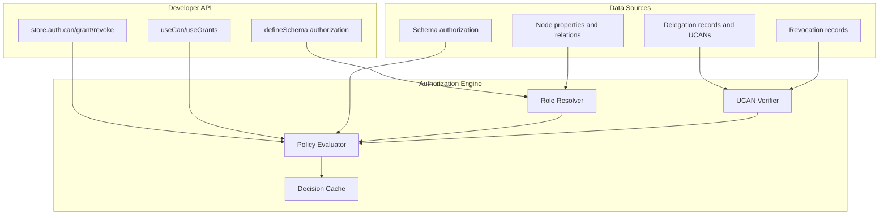
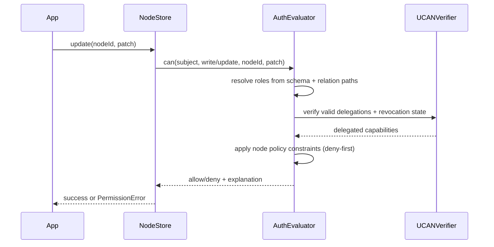
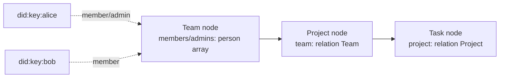
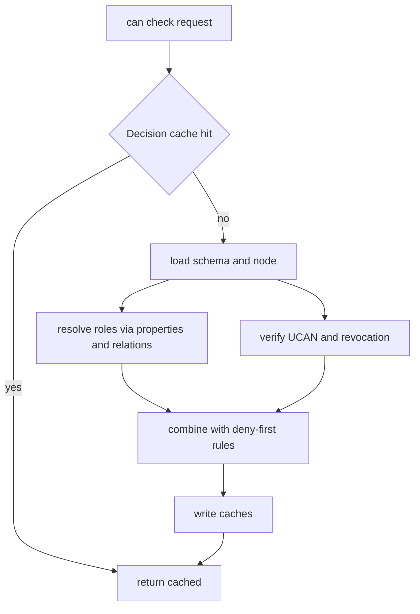

# Unified Authorization API V3: One API, Local-First, Delegable

> Synthesis of explorations 0077, 0079, 0080, 0081, 0082, 0083, and 0084 into a single authorization architecture and developer API for xNet.

**Date**: February 2026  
**Status**: Exploration  
**Supersedes**: Conceptual direction in 0077-0084 (design consolidation)

---

## Executive Summary

This document defines one coherent authorization model for xNet with a single developer-facing API, optimized for DX and local-first performance.

Core decisions:

1. **One evaluation engine**: schema policy + relation membership + UCAN delegation.
2. **No special `group()` primitive**: groups are regular nodes referenced via `relation()`.
3. **Schema policy is default authority**; node-level policy can **extend and explicitly deny**, not unrestricted override.
4. **UCAN is for delegation and portability**, not the sole source of truth.
5. **Single API surface**: `store.auth.can()`, `store.auth.grant()`, `store.auth.revoke()`, `useCan()`.



---

## What We Keep from 0077-0084

- From `0077`: schema-integrated permissions, runtime enforcement in NodeStore/sync/hub, ergonomic app API.
- From `0079`: hybrid DSL direction (simple literals + typed builders for complex expressions).
- From `0080`: UCAN-as-role/action bridge and proof-chain validation.
- From `0081`: need for node-level flexibility and deny-first safety.
- From `0082`: global namespace framing; replace internal/external language with trust/delegation.
- From `0083`: unified model with auditable signed changes.
- From `0084`: relation-centric modeling; groups are conventional schemas, not platform primitives.

---

## Reality Check Against Current Codebase

Observed current state in repository:

- `@xnetjs/identity` already has working `createUCAN`, `verifyUCAN`, proof-chain checks, and attenuation checks.
- `@xnetjs/hub` already enforces UCAN on websocket/http authentication.
- `@xnetjs/data` `defineSchema()` currently has no native authorization fields.
- `@xnetjs/core` has permission types but they are not integrated with `NodeStore` runtime enforcement.

Design implication: we should add authorization first in `@xnetjs/data` schema/store and wire into existing UCAN + hub auth, rather than replacing UCAN infrastructure.

---

## Unified Conceptual Model

### 1) Policy Layer (schema)

Defines what actions require which role expressions.

### 2) Membership Layer (nodes + relations)

Defines who has which roles via properties and relation traversal.

### 3) Delegation Layer (UCAN)

Adds portable delegated authority, expiration, and attenuation.

### 4) Node Policy Layer (optional)

Allows per-node constraints and explicit deny rules; cannot silently expand beyond grantor authority.



---

## The One Clean API

### Schema API

```ts
const TaskSchema = defineSchema({
  name: 'Task',
  namespace: 'xnet://xnet.fyi/',
  properties: {
    title: text({ required: true }),
    project: relation({ target: 'xnet://xnet.fyi/Project' }),
    assignee: person(),
    editors: person({ multiple: true })
  },
  authorization: {
    actions: {
      read: 'viewer | editor | admin | owner',
      write: 'editor | admin | owner',
      delete: 'admin | owner',
      share: 'admin | owner',
      complete: or('assignee', 'editor', 'admin', 'owner')
    },
    roles: {
      owner: 'createdBy',
      assignee: 'properties.assignee',
      editor: 'properties.editors[] | relation.project.editors',
      admin: 'relation.project.admins',
      viewer: 'relation.project.members | public'
    },
    nodePolicy: {
      allow: ['deny', 'fieldRules', 'conditions'],
      mode: 'extend' // no full override
    }
  }
})
```

### Store API

```ts
const allowed = await store.auth.can({
  action: 'write',
  nodeId,
  subject: myDid
})

await store.auth.grant({
  nodeId,
  to: bobDid,
  actions: ['read', 'write'],
  expiresIn: '7d',
  constraints: { fields: ['title', 'status'] }
})

await store.auth.revoke({ grantId })

const grants = await store.auth.listGrants({ nodeId })
```

### React API

```ts
const { canRead, canWrite, canShare } = useCan(nodeId)
const { grants, grant, revoke } = useGrants(nodeId)
```

---

## Expression Language Recommendation

Adopt **Hybrid DSL**:

- **Strings** for common cases (`'owner'`, `'public'`, `'editor | admin'`).
- **Builders** for complex boolean/typed paths (`or()`, `and()`, `not()`, `relation()` helpers).

Why this is the best DX/perf tradeoff:

- Keeps common schema definitions short and readable.
- Preserves type safety where errors are most expensive (relation paths, complex expressions).
- Limits runtime parser burden by precompiling builder expressions and caching parsed strings.

---

## Groups and Relations (Final Decision)

Use relation + person properties instead of a platform-level group primitive:

- A "group" is any node schema with member-like person fields.
- Permissions traverse explicit relation paths (`relation.team.members`).
- This aligns with existing `defineSchema` and property primitives.



---

## Evaluation Order and Conflict Rules

Deterministic decision order:

1. **Explicit deny** from node policy (highest priority).
2. **Schema + relation membership** role evaluation.
3. **Valid UCAN delegation** evaluation.
4. **Public/default action** fallback.
5. Deny.

Rules:

- **Deny wins** over allow.
- **Attenuation required** for delegated UCAN chains.
- **Grantor cannot delegate what they do not have**.
- **Revocation propagates eventually; online checks consult revocation set first**.

---

## Performance Design

Target budgets:

- `can()` warm cache: p50 < 1ms, p99 < 5ms.
- `can()` cold path: p50 < 10ms, p99 < 50ms.
- `grant()` local issue: p50 < 20ms.

Key optimizations:

- Multi-layer cache: decision cache, role membership cache, UCAN verification cache.
- Max relation traversal depth: default 3.
- Precompiled expression AST per schema version.
- Event-driven cache invalidation on membership/policy/grant updates.
- Memoized proof-chain verification keyed by token hash + revocation watermark.



---

## Security and Correctness Requirements

- All local and remote mutations pass through authorization checks before apply.
- Sync layer rejects unauthorized remote changes deterministically.
- Hub validates UCAN audience and capability for connection-scoped actions.
- Replay protection: nonce/jti + seen-token index (or token hash tracking).
- Auditability: all grants/revokes and policy edits are signed changes.

---

## Recommended Implementation Plan (Pre-Release, No Migration Constraints)

### Phase 1: Schema + Evaluator Foundation

- [ ] Add `authorization` to `defineSchema` in `@xnetjs/data`.
- [ ] Implement expression parsing/builders + schema-time validation.
- [ ] Implement `AuthEvaluator` with relation traversal and explanation output.

### Phase 2: NodeStore Enforcement

- [ ] Gate create/update/delete through `store.auth.can()`.
- [ ] Add field-level check path for partial updates.
- [ ] Enforce authorization on remote sync apply path.

### Phase 3: UCAN Bridge

- [ ] Implement `store.auth.grant/revoke/listGrants` on top of `@xnetjs/identity` UCAN.
- [ ] Add revocation record storage + sync propagation.
- [ ] Merge membership and UCAN checks in evaluator.

### Phase 4: React and Hub Integration

- [ ] Add `useCan`, `usePermission`, `useGrants` hooks.
- [ ] Align hub auth capability naming with store actions.
- [ ] Add diagnostics surface (`explain()` output, devtools panel).

### Phase 5: Hardening + Benchmarks

- [ ] Benchmark hot/cold permission checks and proof-chain validation.
- [ ] Fuzz expression parser and relation traversal loop detection.
- [ ] Add conformance tests for deny precedence and attenuation.

---

## Open Decisions to Lock Immediately

- [ ] Final action namespace (`read/view` vs `read`, `write/update` vs `write`).
- [ ] Default token expiry (recommend 7d) and max proof depth (recommend 4).
- [ ] Node policy condition language scope (recommend minimal expression subset first).
- [ ] Revocation consistency mode per schema (`eventual` default, `strict` optional).

---

## Final Recommendation

Ship this as **Authorization API V3** with:

1. **Schema-first policy + relation-first membership** as the default model.
2. **UCAN delegation integrated, not separate**, for temporary and portable grants.
3. **Single store/react API** that hides model complexity from app developers.
4. **Deny-first semantics and bounded traversal** for safety and predictable performance.

This gives xNet a clean, local-first authorization platform that is easier to teach, faster to execute, and aligned with the code that already exists.

---

## References

- `docs/explorations/0077_[_]_AUTHORIZATION_API_DESIGN_V2.md`
- `docs/explorations/0079_[_]_AUTH_SCHEMA_DSL_VARIATIONS.md`
- `docs/explorations/0080_[_]_UCAN_HYBRID_AUTHORIZATION_INTEGRATION.md`
- `docs/explorations/0081_[_]_NODE_PERMISSIONS_UCAN_EVALUATION.md`
- `docs/explorations/0082_[_]_GLOBAL_NAMESPACE_AUTHORIZATION.md`
- `docs/explorations/0083_[_]_UNIFIED_AUTHORIZATION_ARCHITECTURE.md`
- `docs/explorations/0084_[_]_GROUPS_AS_RELATIONS.md`
- https://ucan.xyz/specification/
- https://research.google/pubs/pub48190/
- https://authzed.com/docs/spicedb/concepts/schema
- https://github.com/local-first-web/auth
- https://p2panda.org/2025/08/27/notes-convergent-access-control-crdt.html
- https://www.inkandswitch.com/keyhive/notebook/
