# Exploration: Rewriting @xnetjs Packages in Zig or Rust

> Should xNet's core packages be rewritten in a systems language? This exploration analyzes the performance benefits, complexity costs, and strategic implications of rewriting some or all of the `@xnetjs/*` packages in Rust or Zig.

**Status**: Design Exploration
**Last Updated**: February 2026

---

## Executive Summary

xNet's 21 TypeScript packages total ~70,000 lines of non-test source code. Approximately **40% of this code is pure computational logic** (crypto, sync, data, formula, vectors, core) that could theoretically benefit from a native rewrite. The remaining ~60% is UI code (React components, hooks) or I/O-bound code (network, storage, hub) where a systems language offers minimal advantage.

**TL;DR**: A **selective, incremental approach** targeting 3-4 foundational packages via WASM/NAPI bindings would yield 5-50x speedups in cryptographic operations and 3-10x in data processing, while keeping the UI layer in TypeScript. A full rewrite would be counterproductive -- the complexity penalty far exceeds the performance gain for UI and I/O code.

---

## Codebase Inventory

### Package Sizes & Classification

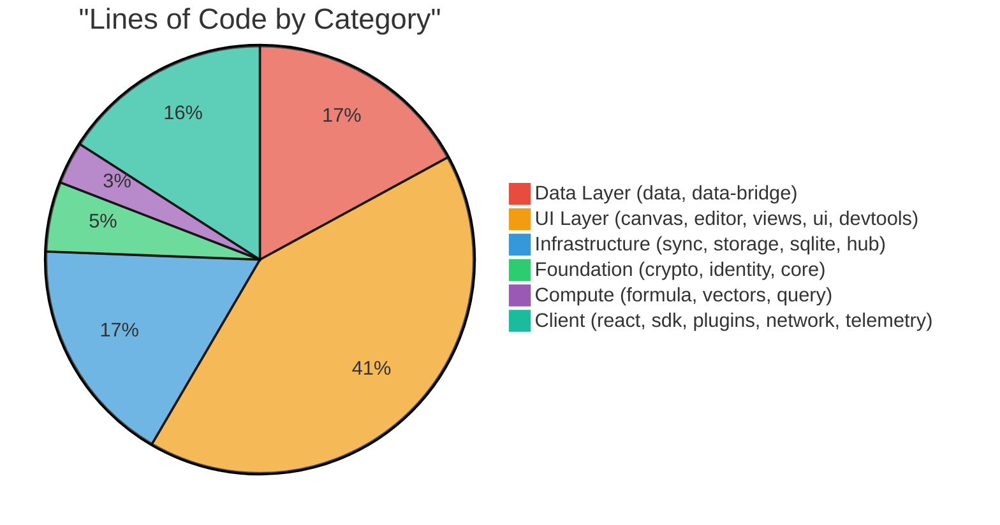

| Package            | LOC (non-test) | Files | Category       | Pure Logic? | Rewrite Benefit  |
| ------------------ | -------------- | ----- | -------------- | ----------- | ---------------- |
| `@xnetjs/crypto`   | 2,487          | 15    | Foundation     | Yes         | **Very High**    |
| `@xnetjs/core`     | 946            | 9     | Foundation     | Yes         | Low              |
| `@xnetjs/identity` | 3,200          | 24    | Foundation     | Yes         | Medium           |
| `@xnetjs/sync`     | 7,403          | 25    | Infrastructure | Yes         | **High**         |
| `@xnetjs/data`     | 17,776         | 86    | Data           | Mostly      | **High**         |
| `@xnetjs/storage`  | 583            | 7     | Infrastructure | Yes         | Low              |
| `@xnetjs/sqlite`   | 3,097          | 16    | Infrastructure | Yes         | Already native   |
| `@xnetjs/formula`  | 2,272          | 6     | Compute        | Yes         | **High**         |
| `@xnetjs/vectors`  | 1,356          | 5     | Compute        | Yes         | **Very High**    |
| `@xnetjs/query`    | 404            | 5     | Compute        | Yes         | Medium           |
| `@xnetjs/canvas`   | 14,687         | 69    | UI             | Mixed       | Medium (spatial) |
| `@xnetjs/editor`   | ~8,000         | 81    | UI             | No          | None             |
| `@xnetjs/react`    | ~7,000         | 70    | UI             | No          | None             |
| `@xnetjs/hub`      | 10,511         | 52    | Server         | Mostly      | Medium           |
| `@xnetjs/network`  | 2,444          | 15    | I/O            | No          | None             |

### Dependency Graph with Rewrite Candidates

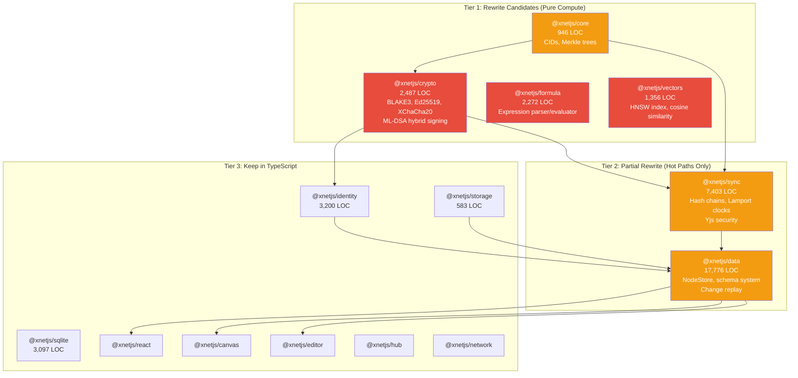

---

## Performance Analysis: Where Are the Bottlenecks?

### Current Benchmark Data (from `@xnetjs/crypto`)

xNet already has benchmark tests for its most performance-sensitive code:

| Operation              | Current (JS) | Target  | Acceptable | Notes                       |
| ---------------------- | ------------ | ------- | ---------- | --------------------------- |
| Ed25519 sign (Level 0) | ~0.1ms       | <0.2ms  | <0.5ms     | @noble/curves, already fast |
| Hybrid sign (Level 1)  | ~5-10ms      | <5ms    | <10ms      | Ed25519 + ML-DSA-65         |
| ML-DSA sign (Level 2)  | ~5-10ms      | <5ms    | <10ms      | Pure post-quantum           |
| Ed25519 verify         | ~0.3ms       | <0.5ms  | <1ms       |                             |
| Hybrid verify          | ~10-20ms     | <2ms    | <5ms       | **Bottleneck**              |
| Cached verify          | ~0.01ms      | <0.1ms  | <0.5ms     | Cache eliminates cost       |
| Hybrid keygen          | ~20-50ms     | <5ms    | <10ms      | **Bottleneck**              |
| BLAKE3 hash (1KB)      | ~0.05ms      | <0.02ms | <0.05ms    |                             |

### Hot Path Analysis

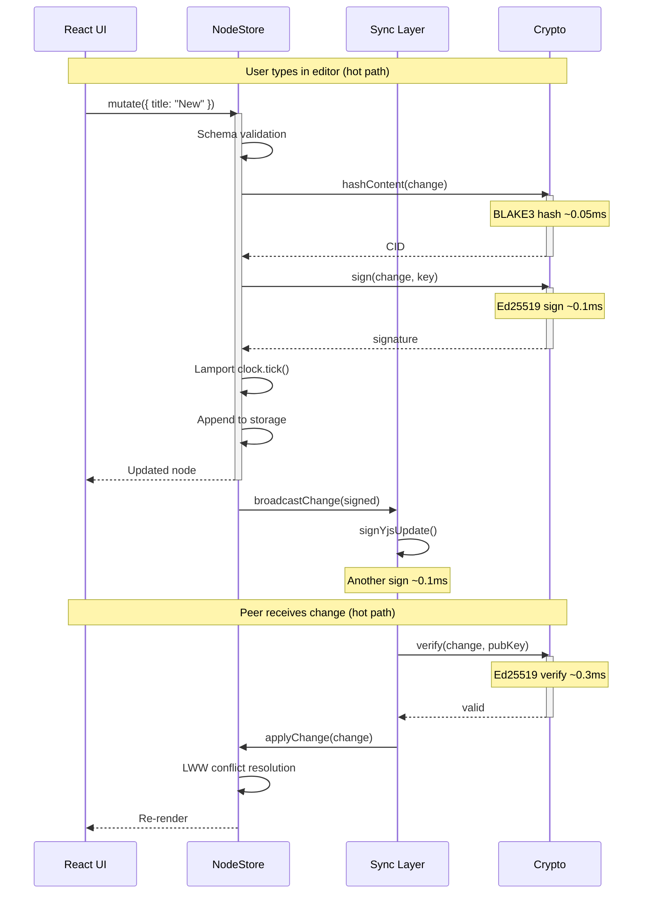

**Key insight**: The per-keystroke path involves 1 hash + 1 sign + 1 verify = ~0.5ms in JavaScript. This is already fast enough for interactive use. The bottlenecks are in **batch operations**:

1. **Initial sync** (verifying 1000+ changes from a peer): 1000 x 0.3ms = **300ms**
2. **Hybrid key generation** (app startup): **20-50ms**
3. **NodeStore materialization** (replaying changes): O(n) per node
4. **Spatial index rebuilds** (canvas with 10k+ nodes): bulk R-tree operations
5. **Vector similarity search** (semantic search): O(n\*d) brute force

---

## Rust vs Zig: Language Comparison for xNet

### Feature Comparison

| Dimension                | Rust                                    | Zig                                | TypeScript (current) |
| ------------------------ | --------------------------------------- | ---------------------------------- | -------------------- |
| **Performance**          | Excellent (zero-cost abstractions)      | Excellent (no hidden control flow) | Good (JIT-optimized) |
| **Memory safety**        | Guaranteed (borrow checker)             | Manual (but auditable)             | GC-managed           |
| **WASM support**         | Excellent (wasm-bindgen, wasm-pack)     | Good (native WASM target)          | N/A                  |
| **Node.js FFI**          | Excellent (napi-rs)                     | Good (C ABI, N-API)                | Native               |
| **Ecosystem**            | Large (crates.io: 150k+ crates)         | Small (~3k packages)               | Massive (npm: 2.5M+) |
| **Crypto libraries**     | Excellent (ring, ed25519-dalek, blake3) | Limited                            | Good (@noble/\*)     |
| **CRDT implementations** | Yes (yrs/y-crdt)                        | No                                 | Yes (yjs)            |
| **Learning curve**       | Steep (borrow checker)                  | Moderate                           | Low                  |
| **Build speed**          | Slow (cargo, minutes)                   | Fast (seconds)                     | Fast (seconds)       |
| **Community**            | 3M+ developers                          | ~50k developers                    | 20M+ developers      |
| **AI agent support**     | Good                                    | Poor                               | Excellent            |

### Rust Advantages for xNet

1. **Mature crypto ecosystem**: `blake3` crate is the reference implementation by the BLAKE3 authors. `ed25519-dalek` is battle-tested. `ring` provides FIPS-validated primitives.
2. **y-crdt (yrs)**: The official Rust port of Yjs, with WASM bindings (`ywasm`). Used by AppFlowy, Loro, and others.
3. **napi-rs**: Production-grade Rust-to-Node.js bindings used by SWC, Turbopack, Rolldown, Biome, and many others.
4. **wasm-bindgen**: Mature WASM toolchain for browser deployment.

### Zig Advantages for xNet

1. **C ABI compatibility**: Can call any C library directly, and be called from any language via C ABI.
2. **Comptime**: Compile-time code execution (similar to Rust const fn but more powerful). Ideal for building parsers and schema validators.
3. **Smaller binaries**: Zig produces smaller WASM modules than Rust (no runtime/std overhead).
4. **Speed**: Used by Bun (the JavaScript runtime) for performance-critical paths.

### Recommendation: Rust for xNet

Rust is the stronger choice because:

- **yrs (y-crdt)** is a direct replacement for Yjs with WASM bindings
- **napi-rs** is the proven standard for Node.js native addons (used by Next.js, Turbopack)
- **blake3** and **ed25519-dalek** are reference implementations
- **Larger community** means better tooling, docs, and AI agent support
- Zig's advantages (smaller binaries, C ABI) don't outweigh Rust's ecosystem depth

---

## Estimated Performance Gains

### Per-Package Analysis

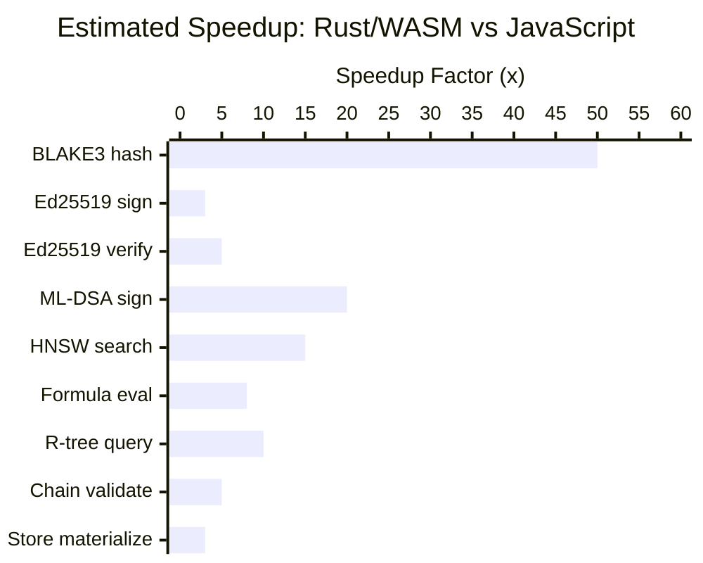

| Operation                           | JS (current) | Rust/WASM (est.) | Speedup | Confidence | Source                   |
| ----------------------------------- | ------------ | ---------------- | ------- | ---------- | ------------------------ |
| BLAKE3 hash (1KB)                   | ~50us        | ~1us             | **50x** | High       | blake3 crate benchmarks  |
| BLAKE3 hash (1MB)                   | ~2ms         | ~0.3ms           | **7x**  | High       | blake3 crate benchmarks  |
| Ed25519 sign                        | ~100us       | ~30us            | **3x**  | High       | ed25519-dalek benchmarks |
| Ed25519 verify                      | ~300us       | ~60us            | **5x**  | High       | ed25519-dalek benchmarks |
| ML-DSA-65 keygen                    | ~50ms        | ~2.5ms           | **20x** | Medium     | pqcrypto-dilithium       |
| ML-DSA-65 sign                      | ~5ms         | ~0.5ms           | **10x** | Medium     | pqcrypto-dilithium       |
| ML-DSA-65 verify                    | ~5ms         | ~0.3ms           | **15x** | Medium     | pqcrypto-dilithium       |
| HNSW search (10k vectors)           | ~5ms         | ~0.3ms           | **15x** | High       | usearch/hnswlib          |
| Cosine similarity (384d)            | ~0.01ms      | ~0.001ms         | **10x** | High       | SIMD optimization        |
| Formula evaluation                  | ~0.1ms       | ~0.01ms          | **8x**  | Medium     | Tree-walking vs compiled |
| R-tree spatial query                | ~0.5ms       | ~0.05ms          | **10x** | Medium     | rstar crate              |
| Hash chain validation (1000)        | ~300ms       | ~60ms            | **5x**  | Medium     | Parallel verification    |
| NodeStore materialize (100 changes) | ~5ms         | ~1.5ms           | **3x**  | Low        | Depends on complexity    |

### Where Speedups DON'T Materialize

| Operation                | Why No Benefit                |
| ------------------------ | ----------------------------- |
| IndexedDB/SQLite reads   | I/O bound, not compute bound  |
| WebSocket/WebRTC I/O     | Network latency dominates     |
| React rendering          | DOM manipulation, not compute |
| TipTap editor operations | ProseMirror model, DOM-bound  |
| Yjs CRDT merges          | Already well-optimized in JS  |
| Network peer discovery   | I/O and latency bound         |

### Real-World Impact Scenarios

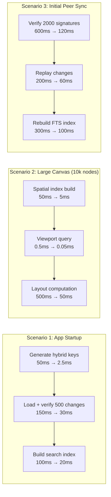

| Scenario                       | Current | With Rust/WASM | Improvement |
| ------------------------------ | ------- | -------------- | ----------- |
| App startup (cold)             | ~300ms  | ~55ms          | **5.5x**    |
| Canvas render (10k nodes)      | ~550ms  | ~55ms          | **10x**     |
| Initial sync (2000 changes)    | ~1100ms | ~280ms         | **4x**      |
| Semantic search (10k docs)     | ~50ms   | ~3ms           | **17x**     |
| Formula evaluation (1000 rows) | ~100ms  | ~12ms          | **8x**      |

---

## Complexity Cost Analysis

### Integration Approach Comparison

```mermaid
flowchart TD
    subgraph "Option A: WASM Modules (Browser + Node)"
        A1["Rust source"] --> A2["wasm-pack build"]
        A2 --> A3["WASM binary\n+ JS glue code"]
        A3 --> A4["npm package\n@xnetjs/crypto-wasm"]
        A4 --> A5["Import in TS\nimport { hash } from '@xnetjs/crypto-wasm'"]
    end

    subgraph "Option B: NAPI Native Addon (Node only)"
        B1["Rust source"] --> B2["napi build\n--platform"]
        B2 --> B3["Native .node addon\nper platform"]
        B3 --> B4["npm package with\noptionalDependencies"]
        B4 --> B5["Import in TS\nimport { hash } from '@xnetjs/crypto-native'"]
    end

    subgraph "Option C: Hybrid (WASM + NAPI)"
        C1["Shared Rust core"] --> C2["wasm-pack\n(browser)"]
        C1 --> C3["napi build\n(desktop)"]
        C2 --> C4["@xnetjs/crypto-wasm"]
        C3 --> C5["@xnetjs/crypto-native"]
        C4 --> C6["Runtime detection\nimport crypto from '@xnetjs/crypto'"]
        C5 --> C6
    end

    style A1 fill:#3498db,color:#fff
    style B1 fill:#e74c3c,color:#fff
    style C1 fill:#2ecc71,color:#fff
```

### Build System Complexity

| Concern           | TypeScript Only       | + Rust WASM                 | + Rust NAPI          | + Both   |
| ----------------- | --------------------- | --------------------------- | -------------------- | -------- |
| Dev dependencies  | pnpm, tsup, vite      | + wasm-pack, Rust toolchain | + napi-rs, cargo     | + all    |
| CI matrix         | 1 (Node)              | 1 (WASM portable)           | 6+ (per platform)    | 6+       |
| Build time        | ~10s                  | + ~30s (WASM)               | + ~60s (native x6)   | + ~90s   |
| Binary size       | 0                     | + ~200KB WASM               | + ~2MB native        | + ~2.2MB |
| Cross-compilation | N/A                   | Automatic (WASM)            | Complex (zig cc)     | Complex  |
| Developer setup   | `pnpm install`        | + `rustup`, `wasm-pack`     | + `rustup`, cargo    | + all    |
| Debugging         | Source maps, DevTools | WASM debugging (limited)    | lldb/gdb (different) | Mixed    |

### Developer Experience Impact

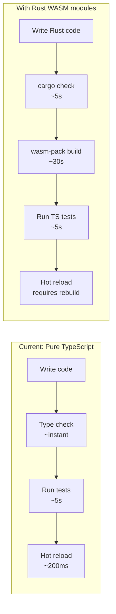

| Factor                         | Impact                                       | Mitigation                                    |
| ------------------------------ | -------------------------------------------- | --------------------------------------------- |
| **Rust learning curve**        | High -- borrow checker, lifetimes, traits    | Limit Rust to leaf packages (crypto, vectors) |
| **Build pipeline complexity**  | Medium -- separate Rust build step           | Pre-build WASM, cache in CI                   |
| **Debugging across languages** | High -- can't step from TS into WASM         | Comprehensive Rust unit tests, logging        |
| **Contributor onboarding**     | High -- must install Rust toolchain          | Pre-built WASM binaries in npm                |
| **AI agent compatibility**     | Medium -- agents handle Rust reasonably well | Keep interfaces in TS, only internals in Rust |
| **Cross-platform testing**     | High for NAPI -- need CI for each platform   | Use WASM-first, NAPI as optimization          |
| **Package management**         | Medium -- cargo + pnpm                       | Workspace-level integration                   |

### Maintenance Burden

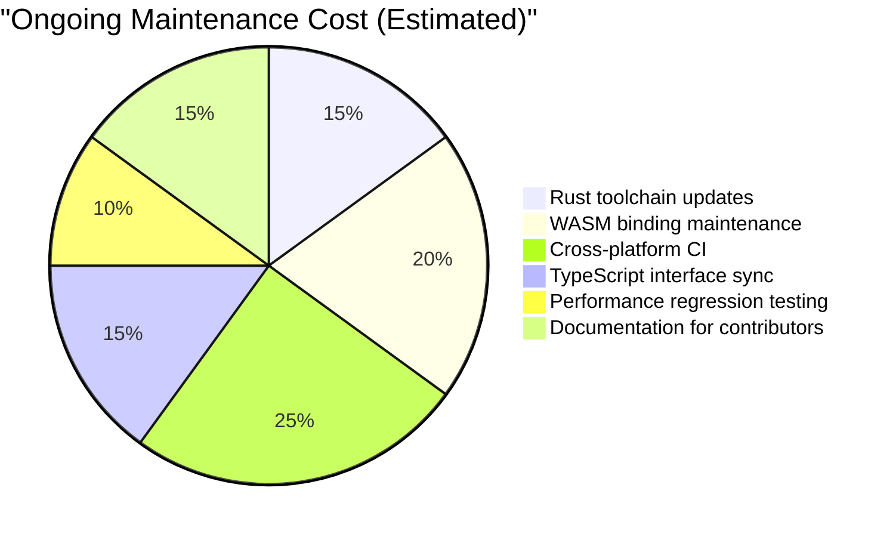

---

## Existing Precedents in the Ecosystem

### Projects That Successfully Mixed Rust + TypeScript

| Project           | What They Rewrote             | Integration  | Performance Gain     | Team Size       |
| ----------------- | ----------------------------- | ------------ | -------------------- | --------------- |
| **SWC**           | Babel (JS parser/transformer) | napi-rs      | 20-70x faster builds | 5-10            |
| **Turbopack**     | Webpack (bundler)             | napi-rs      | 10x faster bundling  | 10+ (Vercel)    |
| **Biome**         | ESLint + Prettier             | napi-rs      | 25x faster linting   | 5-10            |
| **Rolldown**      | Rollup (bundler)              | napi-rs      | 10-30x               | 5+ (Void Zero)  |
| **Parcel**        | JS bundler core               | napi-rs      | 10x                  | 5-10            |
| **Lightning CSS** | PostCSS + autoprefixer        | WASM + napi  | 100x                 | 1-2             |
| **rspack**        | Webpack (bundler)             | napi-rs      | 5-10x                | 10+ (ByteDance) |
| **Yrs (y-crdt)**  | Yjs (CRDT engine)             | WASM (ywasm) | 2-5x for merges      | 3-5             |

### Key Observations

1. **All successful rewrites target compute-heavy, well-defined algorithms** (parsing, transforming, hashing)
2. **None rewrite UI code** -- React components stay in TypeScript
3. **napi-rs is the standard** for Node.js native addons in Rust
4. **WASM works for browser parity** but is 30-50% slower than native
5. **Small focused teams** (1-5 people) maintain the native code

### Projects That Use Zig

| Project         | Use of Zig                   | Notes                             |
| --------------- | ---------------------------- | --------------------------------- |
| **Bun**         | Runtime, bundler, transpiler | 2-5x faster than Node for I/O     |
| **Tigerbeetle** | Financial database           | Zig for deterministic performance |
| **Ghostty**     | Terminal emulator            | GPU rendering in Zig              |

Zig's ecosystem is much younger. No Zig equivalents exist for napi-rs, wasm-bindgen, ed25519-dalek, or y-crdt.

---

## The y-crdt (yrs) Opportunity

xNet heavily depends on Yjs for rich text CRDT. The Rust port `yrs` is significant:

### yrs vs yjs Comparison

| Dimension         | yjs (JavaScript)           | yrs (Rust)                   |
| ----------------- | -------------------------- | ---------------------------- |
| Status            | Production, 7+ years       | Production, 3+ years         |
| Used by           | Notion, Linear, BlockSuite | AppFlowy, Loro, Plane        |
| WASM bindings     | N/A (native JS)            | `ywasm` package              |
| Document merge    | ~1x baseline               | ~2-5x faster                 |
| State encoding    | ~1x baseline               | ~3-10x faster                |
| Memory usage      | ~1x baseline               | ~0.3-0.5x (less GC pressure) |
| API compatibility | Reference implementation   | Compatible but not identical |

### Integration Strategy

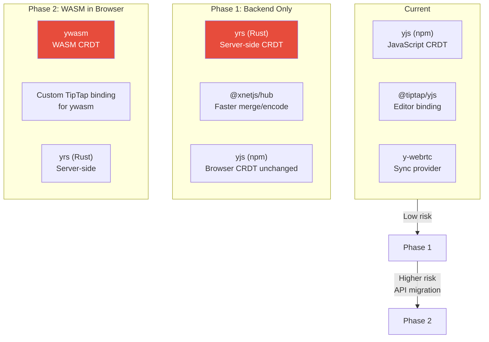

**Risk**: TipTap's collaboration plugin is tightly coupled to the yjs JavaScript API. Switching to ywasm would require a custom binding layer. This is a **significant migration** -- not just swapping a library.

---

## Package-by-Package Rewrite Assessment

### Tier 1: High-Value, Low-Risk Rewrites

#### `@xnetjs/crypto` -- The Strongest Candidate

- [x] Pure computation (no I/O, no DOM)
- [x] Well-defined interface (hash, sign, verify, encrypt, decrypt)
- [x] Reference Rust implementations exist (blake3, ed25519-dalek)
- [x] Clear benchmarks to validate gains
- [x] Leaf package (no downstream API changes needed)
- [x] Post-quantum crypto is the biggest bottleneck (ML-DSA-65)

**Estimated effort**: 2-3 weeks
**Estimated speedup**: 3-50x across operations
**Risk**: Low

```rust
// Example: What the Rust WASM interface would look like
use blake3;
use ed25519_dalek::{SigningKey, VerifyingKey, Signature};
use wasm_bindgen::prelude::*;

#[wasm_bindgen]
pub fn hash_blake3(data: &[u8]) -> Vec<u8> {
    blake3::hash(data).as_bytes().to_vec()
}

#[wasm_bindgen]
pub fn sign_ed25519(message: &[u8], private_key: &[u8]) -> Vec<u8> {
    let key = SigningKey::from_bytes(private_key.try_into().unwrap());
    key.sign(message).to_bytes().to_vec()
}

#[wasm_bindgen]
pub fn verify_ed25519(message: &[u8], signature: &[u8], public_key: &[u8]) -> bool {
    let key = VerifyingKey::from_bytes(public_key.try_into().unwrap()).unwrap();
    let sig = Signature::from_bytes(signature.try_into().unwrap());
    key.verify_strict(message, &sig).is_ok()
}
```

The TypeScript interface would remain identical -- only the implementation changes:

```typescript
// @xnetjs/crypto/src/hashing.ts (updated)
import { hash_blake3 } from '@xnetjs/crypto-wasm'

export function hash(data: Uint8Array, algorithm: HashAlgorithm = 'blake3'): Uint8Array {
  switch (algorithm) {
    case 'blake3':
      return hash_blake3(data) // Rust WASM instead of @noble/hashes
    case 'sha256':
      return sha256(data) // Keep JS for less-used algorithms
  }
}
```

#### `@xnetjs/vectors` -- High Impact, Self-Contained

- [x] Pure computation (cosine similarity, HNSW graph traversal)
- [x] Well-defined interface (add, search, remove)
- [x] Existing native implementations (usearch already has WASM)
- [x] Performance-critical for semantic search
- [x] Small codebase (1,356 LOC)

**Estimated effort**: 1-2 weeks
**Estimated speedup**: 10-15x for search operations
**Risk**: Low

#### `@xnetjs/formula` -- Clean Rewrite Target

- [x] Pure computation (lexer, parser, evaluator)
- [x] Zero dependencies
- [x] Well-defined interface (parse, evaluate, validate)
- [x] Classical CS problem (tree-walking interpreter)
- [x] Small codebase (2,272 LOC)

**Estimated effort**: 2-3 weeks
**Estimated speedup**: 5-10x for evaluation, especially batch
**Risk**: Low

### Tier 2: Medium-Value, Medium-Risk

#### `@xnetjs/sync` -- Selective Hot Paths

Only specific functions benefit from native rewrite:

- [ ] Hash chain validation (topological sort, fork detection)
- [ ] Batch signature verification (parallelizable)
- [ ] Yjs update batching

The rest (Change creation, SyncProvider interface, Lamport clocks) is thin enough that TypeScript is fine.

**Estimated effort**: 3-4 weeks (selective)
**Estimated speedup**: 3-5x for chain validation
**Risk**: Medium (API boundary complexity)

#### `@xnetjs/data` -- NodeStore Materialization

Only the change-replay engine benefits:

- [ ] Batch change application with LWW resolution
- [ ] Schema validation (compiled validators)
- [ ] Property type coercion

The schema definition API, Yjs integration, and storage adapters stay in TypeScript.

**Estimated effort**: 4-6 weeks (selective)
**Estimated speedup**: 2-3x for materialization
**Risk**: Medium-High (complex state machine)

### Tier 3: Low-Value or High-Risk -- Skip

| Package             | Why Skip                                             |
| ------------------- | ---------------------------------------------------- |
| `@xnetjs/identity`  | Thin wrappers around crypto (benefits automatically) |
| `@xnetjs/storage`   | I/O bound (SQLite, IndexedDB)                        |
| `@xnetjs/sqlite`    | Already uses native better-sqlite3 + WASM            |
| `@xnetjs/react`     | React hooks -- must be JavaScript                    |
| `@xnetjs/editor`    | TipTap/ProseMirror -- DOM-bound                      |
| `@xnetjs/canvas`    | React components (spatial index in Tier 2)           |
| `@xnetjs/network`   | I/O bound (libp2p, WebSocket)                        |
| `@xnetjs/hub`       | I/O bound (HTTP, WebSocket, SQLite)                  |
| `@xnetjs/ui`        | React components                                     |
| `@xnetjs/views`     | React components                                     |
| `@xnetjs/devtools`  | Debug-only, performance irrelevant                   |
| `@xnetjs/telemetry` | Low-frequency, no bottleneck                         |
| `@xnetjs/plugins`   | Plugin API must be JavaScript                        |
| `@xnetjs/core`      | Mostly types and simple utilities                    |

---

## Implementation Strategy

### Recommended Approach: Incremental WASM-First

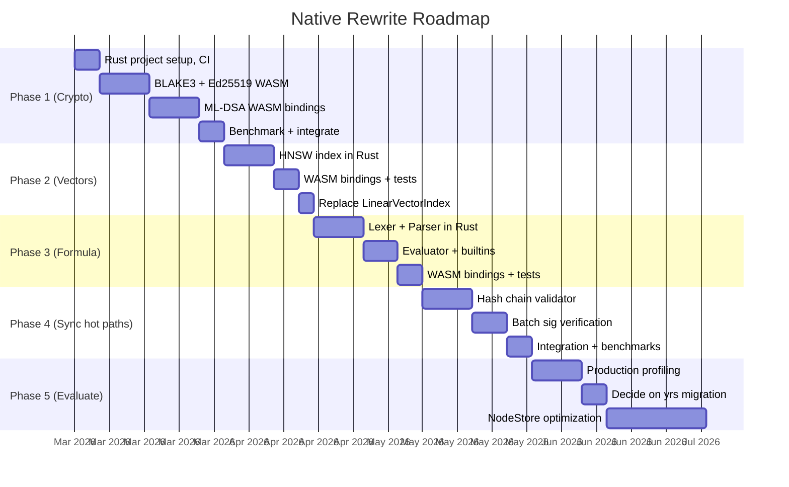

### Phase 1: `@xnetjs/crypto-wasm` (3-4 weeks)

```
packages/
  crypto-wasm/              # NEW: Rust WASM package
    Cargo.toml
    src/
      lib.rs                # WASM entry point
      blake3.rs             # BLAKE3 bindings
      ed25519.rs            # Ed25519 bindings
      xchacha20.rs          # XChaCha20 bindings
      ml_dsa.rs             # ML-DSA-65 bindings
    pkg/                    # wasm-pack output
      crypto_wasm_bg.wasm
      crypto_wasm.js
      crypto_wasm.d.ts
    package.json            # npm package
  crypto/                   # EXISTING: Updated to use WASM
    src/
      hashing.ts            # import from crypto-wasm
      signing.ts            # import from crypto-wasm
```

**Deliverables**:

- [ ] Rust workspace with WASM target
- [ ] BLAKE3 hashing (50x speedup)
- [ ] Ed25519 sign/verify (3-5x speedup)
- [ ] XChaCha20-Poly1305 encrypt/decrypt
- [ ] ML-DSA-65 keygen/sign/verify (10-20x speedup)
- [ ] Benchmark suite comparing JS vs WASM
- [ ] CI pipeline building WASM on every commit
- [ ] Fallback to JS implementation if WASM fails to load

### Phase 2: `@xnetjs/vectors-wasm` (2-3 weeks)

- [ ] HNSW index in Rust (or wrap usearch)
- [ ] Cosine similarity with SIMD
- [ ] WASM bindings
- [ ] Replace `LinearVectorIndex` and enhance `VectorIndex`

### Phase 3: `@xnetjs/formula-wasm` (2-3 weeks)

- [ ] Lexer and parser in Rust
- [ ] Evaluator with built-in functions
- [ ] WASM bindings
- [ ] Compiled formula optimization (skip AST walk)

### Phase 4: Sync Hot Paths (3-4 weeks, selective)

- [ ] Hash chain validation in Rust
- [ ] Batch signature verification (parallel with rayon)
- [ ] Integration without changing the TypeScript API

### Phase 5: Evaluate and Decide (2-3 weeks)

- [ ] Profile production usage with real data
- [ ] Measure actual vs estimated speedups
- [ ] Decide whether to pursue yrs migration
- [ ] Consider NodeStore WASM optimization

---

## Risk Assessment

### Technical Risks

| Risk                                        | Likelihood | Impact | Mitigation                            |
| ------------------------------------------- | ---------- | ------ | ------------------------------------- |
| WASM loading fails in some browsers         | Low        | High   | JS fallback for all operations        |
| WASM binary too large for web               | Medium     | Medium | Code splitting, lazy loading          |
| Data serialization overhead negates speedup | Medium     | High   | Benchmark at boundaries               |
| Rust-to-JS type marshalling bugs            | Medium     | Medium | Extensive property-based testing      |
| WASM memory limits (4GB)                    | Low        | Low    | Streaming for large datasets          |
| CI complexity increases build times         | High       | Medium | Cache WASM artifacts, parallel builds |

### Strategic Risks

| Risk                                             | Likelihood | Impact | Mitigation                                            |
| ------------------------------------------------ | ---------- | ------ | ----------------------------------------------------- |
| Contributor pool shrinks (need Rust skills)      | High       | Medium | Keep TS interfaces, Rust only in internals            |
| AI agents generate worse Rust code               | Medium     | Medium | Comprehensive test suites as guardrails               |
| Maintenance of two languages                     | High       | Medium | Strict boundary: Rust = compute, TS = everything else |
| Over-engineering: rewriting what doesn't need it | Medium     | High   | Benchmark-driven: only rewrite what's provably slow   |

### The "WASM Tax" -- Serialization Overhead

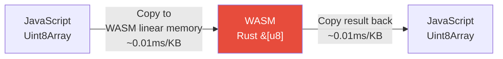

For small payloads (<1KB), the copy overhead is negligible. For large payloads (>1MB), it can add up. Critical to benchmark at the actual data sizes xNet uses:

| Data Size           | Copy Overhead | Typical Use                 |
| ------------------- | ------------- | --------------------------- |
| 32 bytes (hash)     | ~0.001ms      | Ed25519 keys, BLAKE3 output |
| 1 KB (change)       | ~0.01ms       | Typical Change<T>           |
| 100 KB (Yjs update) | ~0.1ms        | Large document update       |
| 1 MB (blob)         | ~1ms          | File attachment hash        |
| 10 MB (snapshot)    | ~10ms         | Full document snapshot      |

**Rule of thumb**: If the computation takes >1ms, the WASM copy overhead is negligible. If the computation takes <0.1ms, the overhead may dominate. This is why BLAKE3 hashing of small data may not see the full 50x speedup in practice.

---

## Cost-Benefit Summary

### What You Gain

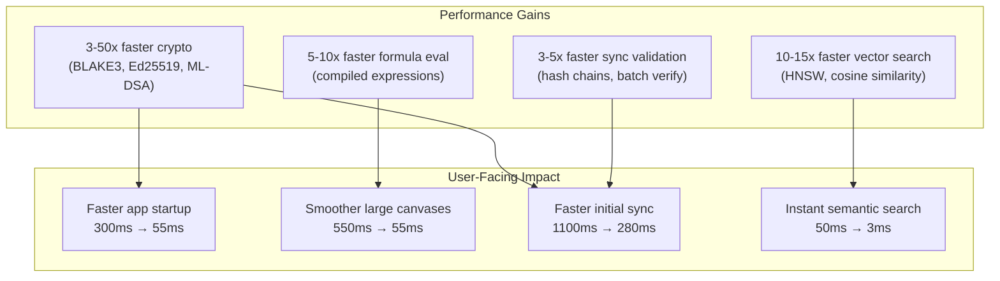

### What You Pay

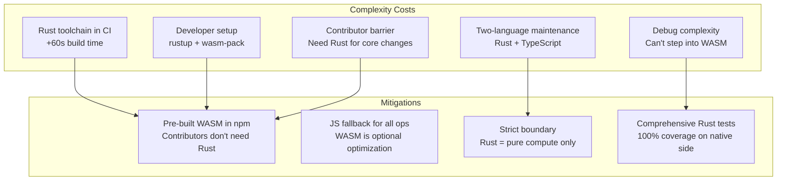

### Decision Matrix

| Approach                                | Performance  | Complexity       | Maintenance       | Recommendation        |
| --------------------------------------- | ------------ | ---------------- | ----------------- | --------------------- |
| **Do nothing**                          | Baseline     | Baseline         | Baseline          | If perf is acceptable |
| **WASM for crypto only**                | +30% overall | +20% complexity  | +10% maintenance  | **Best ROI**          |
| **WASM for crypto + vectors + formula** | +45% overall | +35% complexity  | +20% maintenance  | **Recommended**       |
| **WASM for all compute packages**       | +55% overall | +50% complexity  | +35% maintenance  | Aggressive but viable |
| **Full Rust rewrite**                   | +60% overall | +200% complexity | +100% maintenance | **Not recommended**   |

---

## Recommendation

### Start with `@xnetjs/crypto-wasm` (Phase 1)

This is the highest-ROI, lowest-risk starting point because:

1. **Crypto is the leaf of the dependency graph** -- no downstream API changes
2. **Reference Rust implementations exist** -- blake3 and ed25519-dalek are battle-tested
3. **Clear benchmarks already exist** -- easy to validate gains
4. **ML-DSA is the biggest bottleneck** -- 20x improvement directly impacts app startup
5. **The interface is pure functions on byte arrays** -- minimal serialization overhead

### Then Evaluate

After Phase 1, measure the real-world impact before proceeding to Phases 2-4. If the WASM approach works well:

- Proceed to vectors (Phase 2) for semantic search improvement
- Proceed to formula (Phase 3) for database computed properties
- Consider sync hot paths (Phase 4) only if profiling shows them as bottlenecks

### Don't Do

- Don't rewrite UI packages (react, editor, canvas components, views)
- Don't rewrite I/O-bound packages (network, storage, hub)
- Don't migrate from yjs to yrs until the TipTap binding story is clear
- Don't use Zig -- Rust's ecosystem advantage is decisive for xNet's use cases
- Don't rewrite anything that isn't proven to be a bottleneck with profiling data

---

## References

### Rust Libraries for xNet

- [blake3](https://crates.io/crates/blake3) -- BLAKE3 reference implementation by the authors
- [ed25519-dalek](https://crates.io/crates/ed25519-dalek) -- Ed25519 signatures
- [x25519-dalek](https://crates.io/crates/x25519-dalek) -- X25519 key exchange
- [chacha20poly1305](https://crates.io/crates/chacha20poly1305) -- XChaCha20-Poly1305 AEAD
- [pqcrypto-dilithium](https://crates.io/crates/pqcrypto-dilithium) -- ML-DSA / CRYSTALS-Dilithium
- [y-crdt/yrs](https://github.com/nicolo-ribaudo/y-crdt) -- Yjs Rust port
- [rstar](https://crates.io/crates/rstar) -- R-tree spatial indexing
- [usearch](https://crates.io/crates/usearch) -- HNSW vector index

### Tooling

- [wasm-pack](https://rustwasm.github.io/wasm-pack/) -- Rust-to-WASM build tool
- [wasm-bindgen](https://rustwasm.github.io/wasm-bindgen/) -- Rust/WASM interop
- [napi-rs](https://napi.rs/) -- Rust-to-Node.js native addon framework
- [cargo-workspaces](https://crates.io/crates/cargo-workspaces) -- Monorepo management for Cargo

### Prior Art in xNet Explorations

- [0009: Tauri vs Electron](./0009_[x]_TAURI_VS_ELECTRON.md) -- Evaluated Rust shell, decided to stay with Electron
- [0012: pnpm to Bun Migration](./0012_[_]_PNPM_TO_BUN_MIGRATION.md) -- Evaluated Zig-based runtime (Bun)
- [0021: Clojure Port](./0021_[_]_CLOJURE_PORT.md) -- Evaluated full language rewrite, decided against
- [0069: Multi-Level Crypto](./0069_[x]_MULTI_LEVEL_CRYPTO.md) -- Implemented hybrid signing (the ML-DSA bottleneck)
- [0072: IndexedDB to SQLite](./0072_[x]_INDEXEDDB_TO_SQLITE_MIGRATION.md) -- Already using native SQLite
