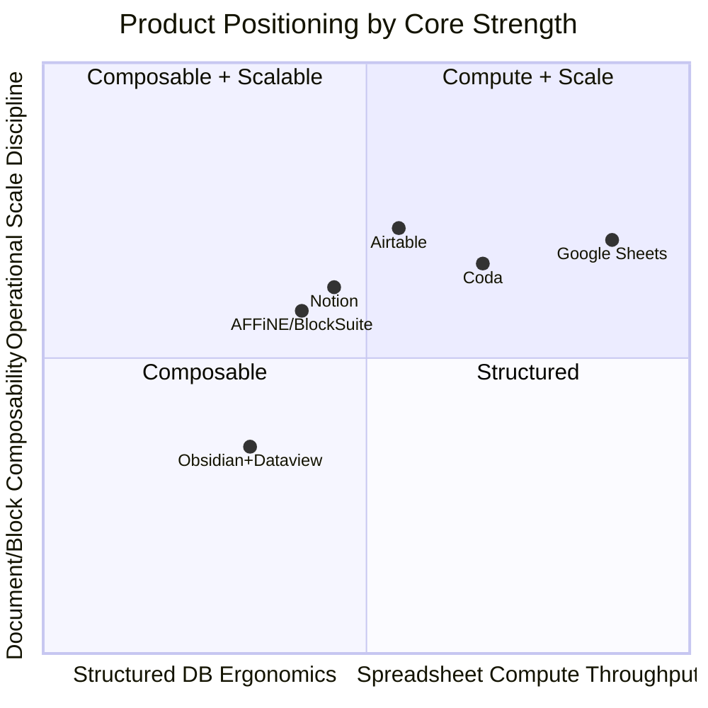
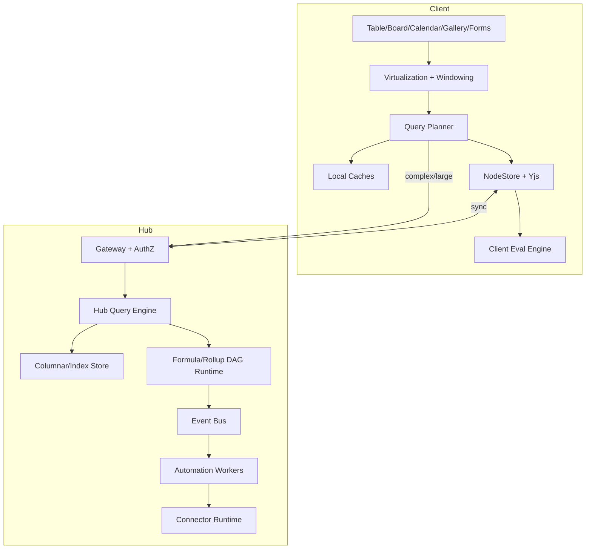
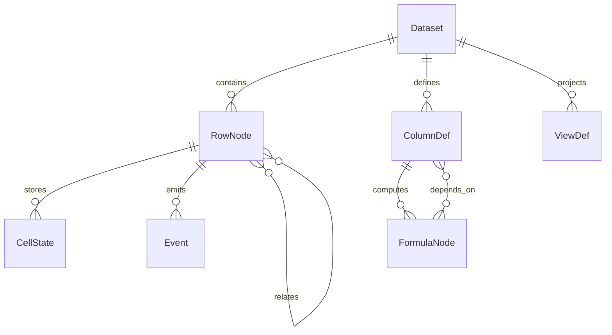
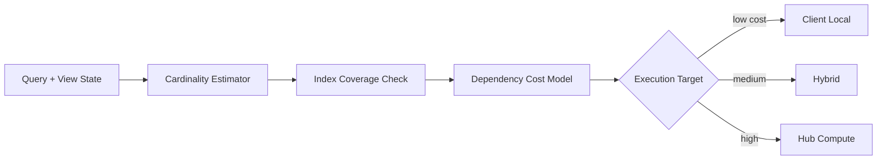
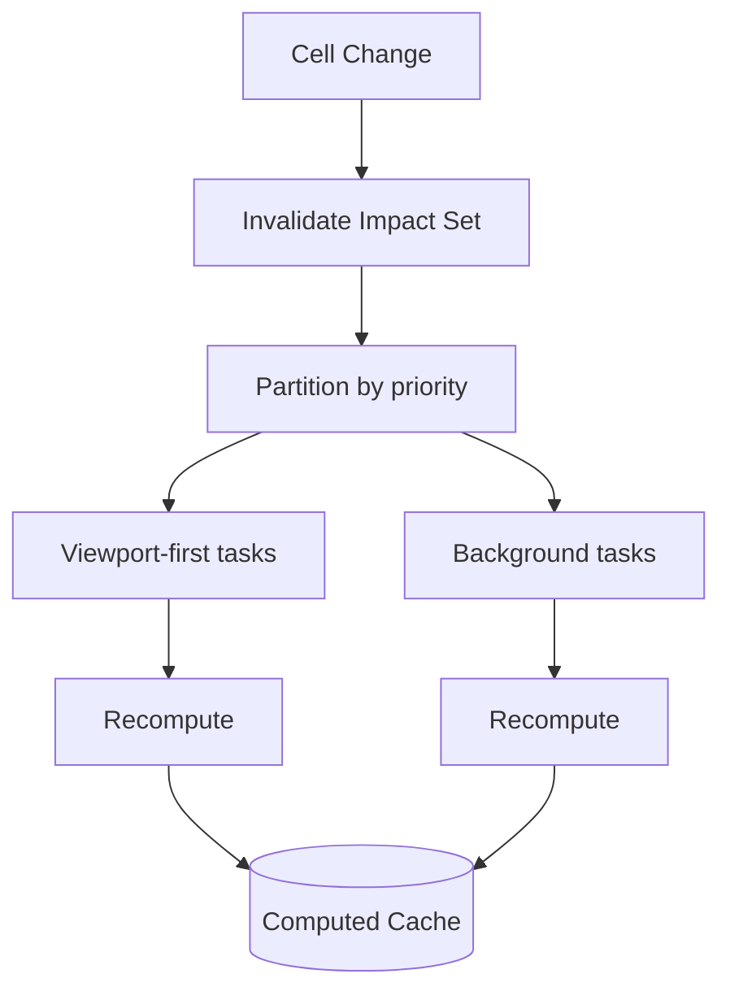
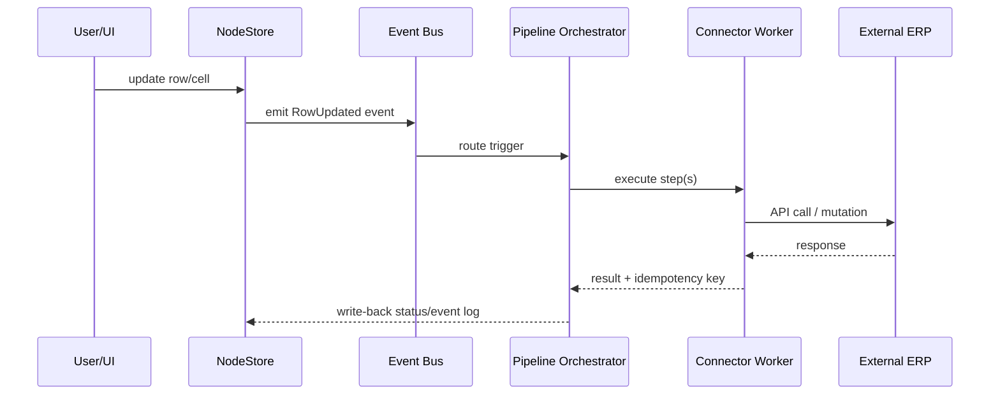

# Database UI Landscape: Data Models, Performance, and xNet V3 Direction

> Deep exploration of how Notion, Obsidian (+ Dataview), AFFiNE/BlockSuite, Airtable, Google Sheets, and Coda-style integrations shape database UX, scale behavior, and backend architecture choices. Includes a concrete migration path for xNet's node-based architecture.

**Date**: February 2026  
**Status**: Research + Architecture Proposal  
**Related**: [0067\_[-]\_DATABASE_DATA_MODEL_V2.md](./0067_[-]_DATABASE_DATA_MODEL_V2.md)

---

## Executive Takeaways

1. **No single product has both extremes** (Google Sheets-scale compute + Notion-level composable UX + Airtable relational ergonomics + local-first CRDT collaboration).
2. **Notion/AFFiNE style block-graph models** maximize flexibility and composability, but require heavy indexing and careful cache design to avoid perceived slowness at scale.
3. **Airtable-style relational tables** are very strong for structured workflows, but schema dependency chains (links/lookups/rollups/formulas) can become a backend request-amplification hotspot.
4. **Google Sheets performance comes from a calc-first engine and aggressive dependency graph optimization**, not from rich relational modeling.
5. **xNet can combine both worlds** by splitting concerns into:
   - NodeStore + Yjs for local-first source-of-truth and collaboration.
   - Hub query and compute plane for large datasets, formula graphs, and automations.
   - View-layer virtualization + progressive loading for “fast-feel” UX.
6. **ERP-grade future requires evented automation architecture** (triggers/pipelines/connectors) that is strongly typed, idempotent, observable, and permission-aware.

---

## Scope and Method

This exploration combines:

- xNet codebase review (`packages/data/src/database`, `packages/react/src/hooks/useDatabase.ts`, `query-router.ts`).
- Prior xNet architecture docs, especially [0067\_[-]\_DATABASE_DATA_MODEL_V2.md](./0067_[-]_DATABASE_DATA_MODEL_V2.md).
- Public materials from:
  - Notion engineering blogs (block model; SQLite performance migration).
  - Obsidian docs + Dataview docs/README.
  - BlockSuite docs + AFFiNE/BlockSuite repos.
  - Airtable support docs (performance troubleshooting; API limits).
  - Google Sheets help docs (10M-cell cap; performance guidance).
  - Coda API docs + Packs page.

Confidence is highest where vendors explicitly describe internals; lower where architecture is inferred from product behavior + public statements.

---

## Current xNet Baseline (from code + 0067)

### What is already strong

- Row-as-node model with per-cell semantics (`DatabaseRow` node + dynamic properties).
- CRDT/Yjs for column/view structure and rich text cells.
- Query pipeline for filter/sort/group.
- Query router with dataset thresholds (`local` <10k, `hybrid` <100k, otherwise `hub`).
- Computed column engines (rollup + formula) and caching primitives.

### What still limits sheet-scale behavior

- `useDatabase` still performs substantial client-side filter/sort after over-fetching (`limit: pageSize * 10`).
- Hub query integration is not complete end-to-end.
- Virtualized table implementation is still pending in shipped UI path.
- Compute scheduling model is still mostly request-time, not a fully managed dependency DAG runtime.

---

## Comparative Analysis by Product

## 1) Notion

### Backend data model

- Core primitive is a **block graph**: block id, type, properties, content children, parent pointer.
- Records/operations batched as transactions; local cache + queue model for optimistic UX.
- Uses message-based real-time update service; server persists and pushes record version updates.
- Notion has publicly documented migration toward stronger local persistence with SQLite in desktop apps.

### Performance tradeoffs

- Pros:
  - Flexible composability (documents, databases, pages all become block forms).
  - Transactional local queue makes UI feel immediate.
  - Cache-first page load path can hide network latency.
- Cons:
  - Graph traversal and dependency fanout can make load/index/search expensive.
  - Rich flexibility can increase query complexity vs rigid tabular storage.

### UIs enabled by model

- Unified page+database embedding.
- Rich transformability (“turn into” block types).
- Deeply nested content trees.
- Multi-view databases as alternate projections over common records.

### Key lesson for xNet

**Graph-native representation unlocks product magic**, but requires disciplined indexing tiers and carefully bounded read paths.

---

## 2) Obsidian + Dataview

### Backend data model

- Source of truth is local Markdown files in a vault (plain-text, file-system native).
- Metadata cache/index maintained locally (including IndexedDB-backed state for app metadata/sync cache).
- Dataview builds a live index over frontmatter/inline fields and queries it with DQL/JS.

### Performance tradeoffs

- Pros:
  - Extremely strong local ownership/portability.
  - Great read/query flexibility for personal knowledge workflows.
  - Dataview reports scaling to very large vaults in read scenarios.
- Cons:
  - No native strongly-consistent relational transaction layer.
  - Write semantics are file mutation, not row-level transactional ops.
  - Collaboration and high-frequency concurrent edit scenarios are not the primary strength.

### UIs enabled by model

- Document-native dashboards over metadata.
- Ad-hoc read models, tables, and task views from notes.
- Lightweight, user-scriptable data views.

### Key lesson for xNet

**Keep source data open and user-legible where possible**, but do not force ERP-grade structured workflows onto file-only semantics.

---

## 3) AFFiNE + BlockSuite

### Backend/data model direction

- BlockSuite is CRDT-native (Yjs-based store), designed for collaborative document state.
- Supports snapshot API and binary CRDT document streaming.
- Affords multi-document state management with pluggable providers (IndexedDB/WebSocket/etc.).
- AFFiNE positions itself as local-first and collaboration-ready; ecosystem references include a dedicated DB engine (OctoBase) direction.

### Performance tradeoffs

- Pros:
  - Native collaboration model and consistent state flow.
  - Strong for multimodal editors (doc + whiteboard + block embeddings).
  - Binary CRDT streaming can reduce impedance with collaboration.
- Cons:
  - CRDT-over-everything can be overkill for pure scalar-cell compute workloads.
  - Query and aggregate workloads still need index/compute planes beyond raw doc state.

### UIs enabled by model

- Doc + whiteboard fusion.
- Rich editor extensibility via block specs/services/commands.
- High composability for multi-modal workflows.

### Key lesson for xNet

**Use CRDT where collaboration semantics matter most** (text, structure, shared cursors), and use indexed/query-friendly data planes for heavy analytics-like table operations.

---

## 4) Airtable

### Backend data model (observable)

- Relational table model: records, fields, linked records.
- Derived fields (lookups, rollups, formulas) create dependency chains.
- Heavy integration usage (API/automations/syncs) materially impacts backend request queues.

### Performance tradeoffs

- Pros:
  - Very strong CRUD + relational workflow ergonomics.
  - Excellent business-ops affordances for structured teams.
  - Mature integration surface.
- Cons:
  - Dependency-heavy schemas amplify recomputation and queue pressure.
  - Integrations can overwhelm base responsiveness.
  - Not intended as a generic high-frequency realtime backend substitute.

### UIs enabled by model

- Grid-first operations with practical business views.
- Powerful linked-record workflows.
- App-like operational tooling for non-engineering teams.

### Key lesson for xNet

**Design for dependency-aware compute budgets**: relation-rich schemas are useful, but require throttling, scheduling, and backpressure controls to stay responsive.

---

## 5) Google Sheets

### Backend/calc model (inferred + published constraints)

- Spreadsheet-first calculation engine with dependency graph recalc semantics.
- Documented max size: up to **10 million cells**.
- Performance guidance emphasizes avoiding open ranges, minimizing volatile functions, and reducing chained dependencies.

### Performance tradeoffs

- Pros:
  - Best-in-class interactive formula recalculation for tabular analytics workflows.
  - Mature optimization behavior around dependency graphs.
  - Handles large cell surfaces with familiar model.
- Cons:
  - Relational semantics are weaker than dedicated database UIs.
  - Rich object/page composition is limited relative to Notion/AFFiNE.

### UIs enabled by model

- High-throughput grid manipulation.
- Formula-centric exploratory analysis.
- Pivoting/charting flows that assume tabular-first data.

### Key lesson for xNet

**To approach Sheets-like performance, you need calc-engine discipline**, not only virtualization and pagination.

---

## 6) Coda (for integrations + automation model)

### Relevant architecture signals

- Docs + tables + formulas + controls, with API exposing docs/pages/tables/rows/formulas and automation triggers.
- Explicit API rate limits and async mutation processing model.
- Packs ecosystem emphasizes connector-driven extensibility and secure integration boundaries.

### Key lesson for xNet

**Automation/integration is a first-class runtime**, not an afterthought. It needs quotas, queueing, retries, and policy controls from day one.

---

## Synthesis: Why no one does all of it perfectly

Interpretation:

- Notion/AFFiNE optimize composability and collaborative document primitives.
- Airtable/Coda optimize operational workflows and integrations.
- Google Sheets optimizes calc throughput and large tabular interaction.
- xNet opportunity is to fuse these by explicit multi-plane architecture.

---

## Can any of them perform like Google Sheets?

Short answer:

- **Sheets-like on large grid compute**: strongest in Google Sheets.
- **Notion/AFFiNE/Airtable-like UI flexibility**: strongest in block/relational systems.
- **Single product doing both equally**: not really, especially under high dependency + high collaboration + high integration load simultaneously.

Why:

- High-performance spreadsheet engines optimize for dense dependency graphs + vectorized calc paths.
- General-purpose block/relational UIs optimize for composability, permissions, references, rich objects, and workflow logic.
- These optimizations conflict unless architecture is explicitly split.

---

## Proposed xNet V3: “Dual-Core Database Engine”

### Principle

Use one logical data model, but two optimized execution cores:

1. **Node/CRDT Core** (collaboration + source of truth)
2. **Tabular Compute Core** (query + formula + rollup + analytics)

### High-level architecture

### Why this fits xNet’s node-based architecture

- NodeStore remains canonical identity and conflict domain.
- Query/compute core is derived, indexable, and replaceable without invalidating canonical node history.
- CRDT remains scoped where its benefits are highest (text/structure/presence), avoiding CRDT overhead for scalar math-heavy paths.

---

## Data Modeling Strategy for xNet ERP-grade Future

### Core entities

### Canonical + Derived split

- **Canonical plane**
  - Node identity, LWW/CRDT conflict metadata, permissions, event log pointers.
- **Derived plane**
  - Filter/sort indexes, formula DAG snapshots, relation adjacency indexes, full-text indexes.
- **Invariant**
  - Derived plane can be rebuilt from canonical + event history.

### Schema dependency classes

1. **Local scalar** (cheap): text/number/date/select.
2. **Local computed** (medium): same-row formulas.
3. **Relation computed** (expensive): lookups/rollups over related rows.
4. **External computed** (very expensive): connector-dependent fields.

This classification should drive scheduler QoS and UI expectations.

---

## Performance Strategy (How to get closer to Sheets without losing Notion-like UX)

## 1) Query planning and routing

- Keep existing threshold-based router, but extend with cost-based heuristics:
  - estimated rows touched
  - dependency depth
  - volatile function count
  - relation fanout cardinality
  - index coverage score

## 2) Formula/rollup DAG engine

- Build explicit dependency graph per dataset version.
- Topological scheduler with incremental invalidation.
- Separate **interactive lane** (visible viewport) vs **background lane** (offscreen recompute).

## 3) View-layer speed architecture

- Full X+Y virtualization (rows + columns).
- Column projection pushdown (`select` visible columns only).
- Background prefetch for near-future viewport.
- “Fast skeleton + stale-safe update” rendering policy.

## 4) Relation and rollup containment

- Denormalized relation adjacency indexes.
- Bounded fanout policies (warn users when relation explosion thresholds exceeded).
- Materialized rollup windows for expensive aggregations.

## 5) Offline resilience model

- Tiered capability when disconnected:
  - Tier A: cached rows + local formulas
  - Tier B: limited relation rollups using stale snapshots
  - Tier C: explicit “requires hub compute” states for heavy queries

---

## UI Capabilities Unlocked by Better Data Planes

If xNet implements the above split well, we can support:

1. **Notion-like composable views**: table/board/calendar/timeline/gallery all from same canonical rows.
2. **Sheets-like analytical interactions**: large-grid formulas, fast recalc in visible windows, performant sorting/filtering.
3. **Airtable-like operational systems**: relation-heavy workflows with managed dependency budgets.
4. **Coda-like automation workflows**: buttons, triggers, packs/connectors, doc-native applications.

---

## Integrations, Triggers, Pipelines, ERP Readiness

### Evented automation reference architecture

### Required controls

- Idempotency keys on all side-effecting automation steps.
- Retry with exponential backoff + dead-letter queues.
- Per-workspace and per-integration quotas.
- Deterministic trigger replay from event log.
- Policy engine for data access and field-level scoping.

### Minimal integration contract

- Trigger types: row created/updated/deleted, formula threshold crossed, scheduled trigger.
- Action types: upsert external record, call webhook, send notification, enqueue internal job.
- Secure credentials: encrypted secrets vault + short-lived execution tokens.

---

## xNet Recommended Roadmap (Pragmatic)

## Phase A: Complete scale baseline

- Finalize hub query service and cursor pagination.
- Ship table X+Y virtualization path in production views.
- Move filter/sort/group pushdown to hub for large datasets.

## Phase B: Compute-runtime maturity

- Introduce formula/rollup DAG planner + scheduler.
- Add viewport-priority recompute lane.
- Add dependency fanout diagnostics and schema complexity warnings.

## Phase C: Automation + integrations

- Introduce event bus and trigger runtime.
- Build first-party connectors (Slack, email, webhook, ERP sandbox).
- Add execution observability (logs, trace IDs, failure explorer).

## Phase D: ERP-grade hardening

- Multi-tenant quotas, backpressure, and SLO policies.
- Consistency contracts (read-after-write modes per endpoint).
- Migration tooling for schema evolution and computed-field backfills.

---

## Implementation Checklist

## Engine and storage

- [ ] Implement hub query pushdown for filters/sorts/groups/search.
- [ ] Add cursor-based pagination by stable sort keys (not offset-only).
- [ ] Materialize relation adjacency index for rollup acceleration.
- [ ] Add hub-side computed cache with dependency-version keys.
- [ ] Add rebuild tooling for derived indexes from canonical events.

## Compute and formulas

- [ ] Build formula parser dependency extraction into explicit DAG nodes.
- [ ] Implement incremental invalidation propagation.
- [ ] Add cycle detection with user-facing diagnostics.
- [ ] Introduce volatile function policy (`NOW`, `TODAY`, external functions).
- [ ] Add per-dataset compute budget guards (ms, memory, row touch).

## UI and interaction performance

- [ ] Ship X+Y virtualization for table view.
- [ ] Add selective column fetch based on visible/probable columns.
- [ ] Add predictive prefetch for near-viewport rows.
- [ ] Add optimistic render states for formula recompute pending.
- [ ] Add view-level performance telemetry overlays in devtools.

## Integrations and automation

- [ ] Introduce trigger/event registry.
- [ ] Implement pipeline orchestrator with retries and DLQ.
- [ ] Add connector SDK contract (auth, scopes, backoff, tracing).
- [ ] Add secrets vault integration and rotation support.
- [ ] Add admin controls for quotas, approvals, and connector allowlists.

## Security and governance

- [ ] Enforce authorization checks in query and automation runtime.
- [ ] Add row/field-level policy hooks for enterprise scenarios.
- [ ] Add audit log for trigger executions and external actions.
- [ ] Add signed execution provenance for high-trust workflows.

---

## Validation Checklist

## Functional correctness

- [ ] Formula DAG recomputes exact expected values after batch edits.
- [ ] Rollup values stay correct under concurrent relation changes.
- [ ] Cursor pagination remains stable under insertions/deletions.
- [ ] Offline fallback behavior is explicit and deterministic.

## Performance targets

- [ ] 100k rows: filter+sort response p95 under agreed SLO.
- [ ] 1M rows (hub-primary): first viewport load under agreed SLO.
- [ ] Formula recompute: viewport-first updates visibly prioritized.
- [ ] Memory: cache stays within defined budget per platform.

## Reliability and operations

- [ ] Automation retries succeed idempotently under transient failures.
- [ ] DLQ captures permanent failures with actionable diagnostics.
- [ ] Backpressure triggers when connector/API quotas are exceeded.
- [ ] Disaster test: rebuild derived indexes from canonical history passes.

## Security and compliance

- [ ] Unauthorized query paths rejected with audit records.
- [ ] Secret values never appear in logs/traces.
- [ ] Connector scope checks enforced at execution boundary.

---

## Decision Matrix for xNet Design Choices

| Decision                   | Recommended Default                          | Why                                               |
| -------------------------- | -------------------------------------------- | ------------------------------------------------- |
| Canonical row storage      | NodeStore row nodes                          | Fits existing model, identity, sync semantics     |
| Rich text storage          | Per-row Y.Doc for rich cells                 | CRDT where needed, avoid CRDT overhead everywhere |
| Query execution            | Cost-based local/hybrid/hub                  | Better than static thresholds alone               |
| Computed values            | DAG-based incremental runtime                | Needed for Sheets-like responsiveness             |
| Integration architecture   | Event bus + orchestrator + connectors        | Required for ERP-grade workflows                  |
| Large dataset client store | Cache + projection, not full materialization | Keeps memory predictable                          |

---

## Open Questions (Highest Leverage)

1. Should xNet support a dedicated vectorized compute engine (WASM/Rust) for heavy formula paths?
2. Which formula language subset should be spreadsheet-compatible vs xNet-native?
3. What are the first ERP connectors to prioritize for real user value (e.g., accounting, inventory, procurement)?
4. How should policy and permissions compose across row-level access + automation action scopes?
5. What SLOs define “good enough” parity versus Sheets/Airtable/Notion for our target workloads?

---

## Sources

- Notion: “The data model behind Notion’s flexibility”  
  https://www.notion.so/blog/data-model-behind-notion
- Notion: “page load and navigation times got faster” (SQLite migration details)  
  https://www.notion.so/blog/faster-page-load-navigation
- Obsidian: “How Obsidian stores data” (vault/plain text/local storage model)  
  https://raw.githubusercontent.com/obsidianmd/obsidian-help/master/en/Files%20and%20folders/How%20Obsidian%20stores%20data.md
- Obsidian Dataview docs/README (index/query model and scaling claims)  
  https://blacksmithgu.github.io/obsidian-dataview/  
  https://raw.githubusercontent.com/blacksmithgu/obsidian-dataview/master/README.md
- BlockSuite docs (CRDT-native store, snapshot vs streaming, providers)  
  https://blocksuite.io/guide/data-synchronization.html
- AFFiNE repo README (local-first/collaborative positioning and ecosystem)  
  https://raw.githubusercontent.com/toeverything/AFFiNE/canary/README.md
- Airtable support: base performance troubleshooting and schema dependency behavior  
  https://support.airtable.com/docs/en/troubleshooting-airtable-performance
- Airtable API troubleshooting (rate limits and operational constraints)  
  https://support.airtable.com/docs/airtable-api-common-troubleshooting
- Google Sheets file/cell limits  
  https://support.google.com/docs/answer/37603
- Google Sheets performance guidance (ranges/volatile functions/chains)  
  https://support.google.com/docs/answer/12159115
- Coda Packs overview  
  https://coda.io/packs
- Coda API reference (rate limits, consistency model, automations endpoint)  
  https://coda.io/developers/apis/v1
