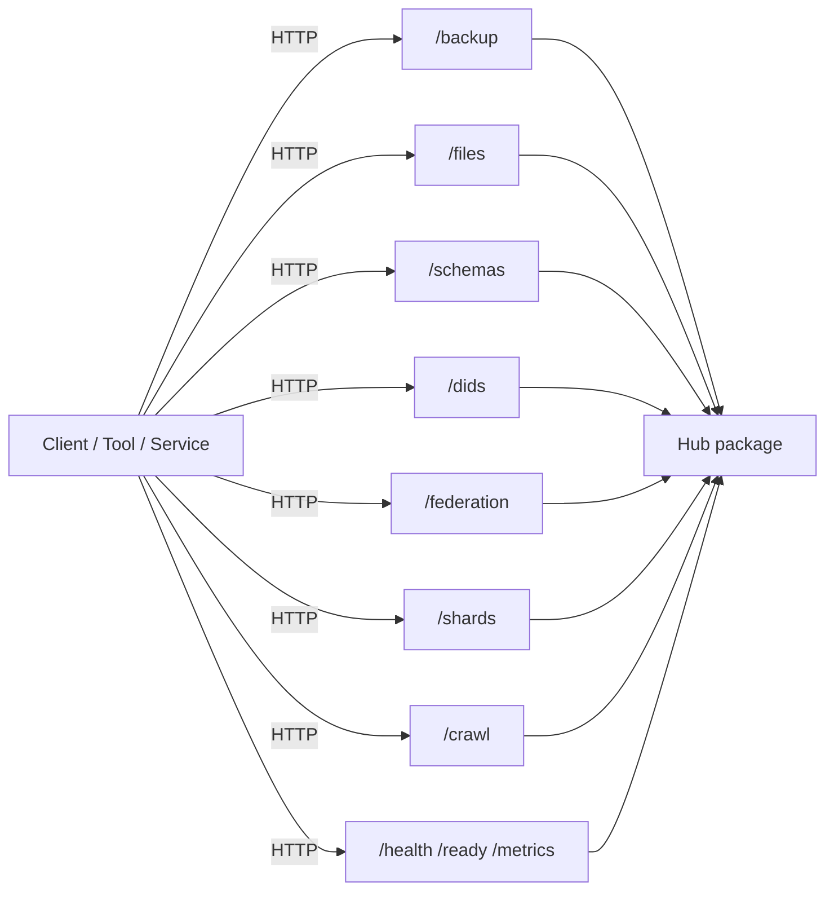
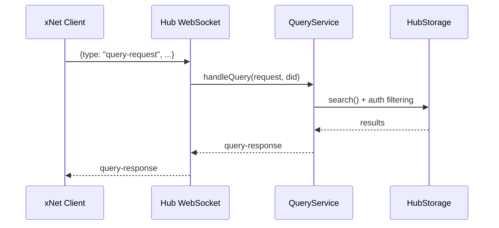
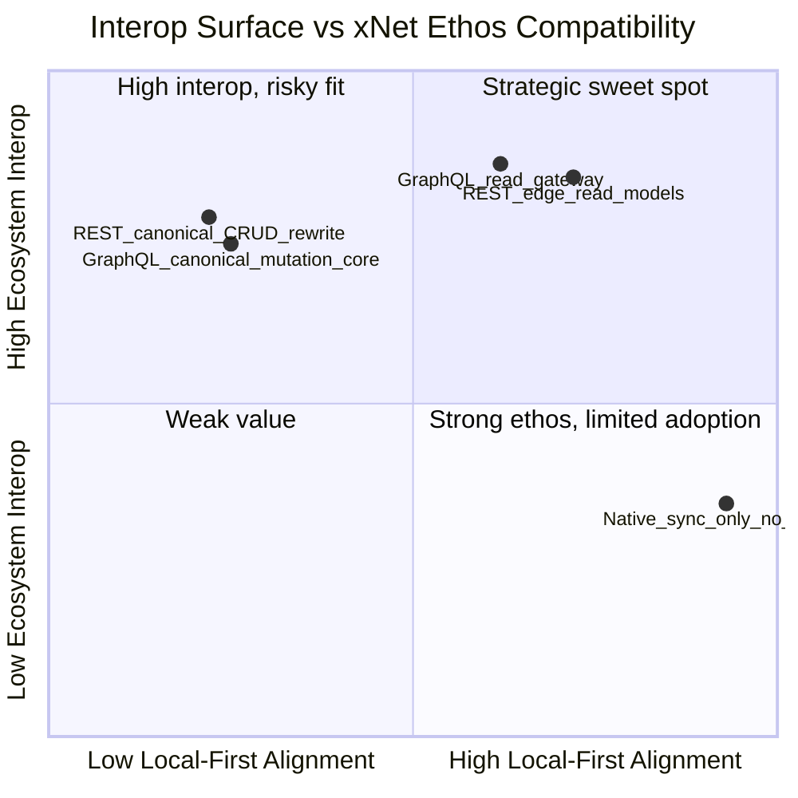
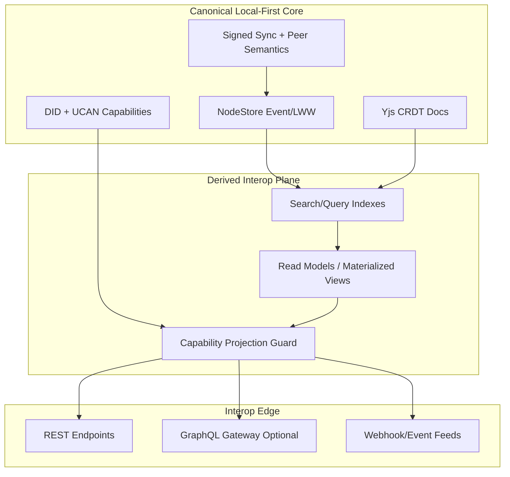
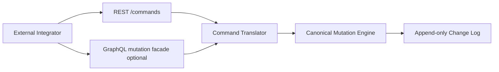
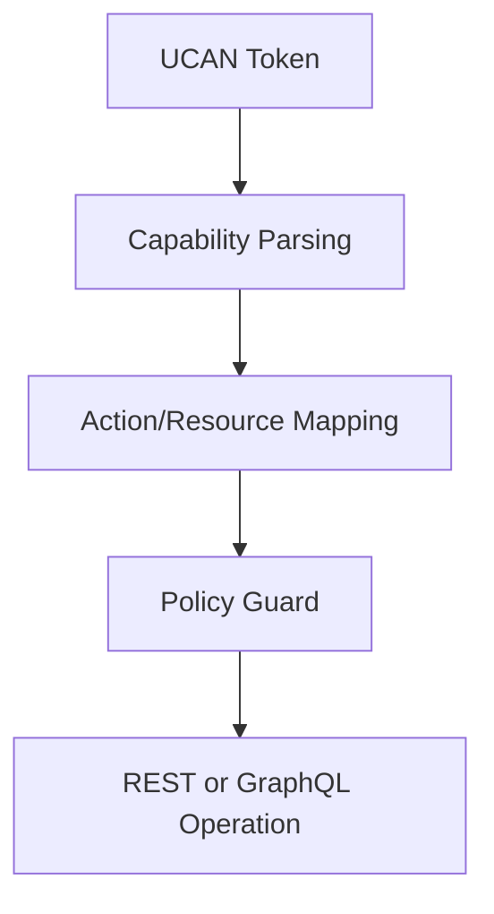
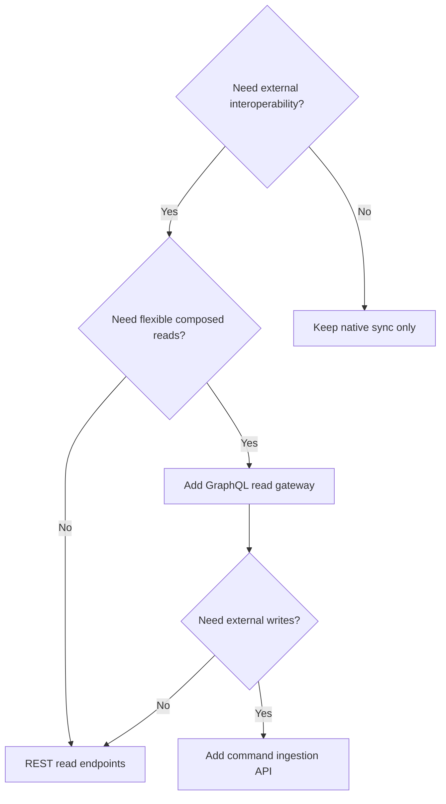

# xNet Exploration: Should We Expose Data Over REST or GraphQL?

> Deep exploration of whether REST and/or GraphQL exposure makes sense in a decentralized, local-first, CRDT + event-log architecture, with concrete interoperability patterns that do not compromise xNet's core ethos.

**Date**: February 2026  
**Status**: Research + Recommendation  
**Related**: `0048_[x]_LOCAL_FIRST_ENERGY_SAVINGS.md`, `0052_[_]_LIBP2P_REINTEGRATION.md`, `0078_[_]_TRULY_P2P_DISCOVERY_AND_ROUTING.md`, `0088_[_]_DATABASE_UI_COMPETITIVE_ARCHITECTURE.md`

---

## Executive Take

Yes, exposing data via REST or GraphQL can make sense for interoperability, but only if treated as an **edge projection**, not the canonical protocol.

1. xNet is fundamentally **local-first + sync-native**, not request/response-native.
2. A full "xNet-as-REST-backend" or "xNet-as-GraphQL-backend" core pivot would likely dilute core strengths (offline behavior, peer semantics, capability-style auth, signed sync).
3. A **narrow interoperability layer** is practical and high leverage:
   - REST for durable, cacheable, operational endpoints (already partly true in `@xnet/hub`).
   - Optional GraphQL for external consumers that need typed composition over read models.
4. The right model is: **canonical local state + sync log** -> **derived interop views**.
5. Recommendation: implement a staged **Interop Gateway** with explicit boundaries, quotas, and "no canonical writes bypassing NodeStore semantics".

---

## Why This Question Is Tricky

At first glance, "expose data over REST/GraphQL" sounds obvious. But xNet is not a conventional centralized API backend.

From repo docs and code:

- xNet centers on **NodeStore + Yjs + Lamport/event semantics**, not ORM entities behind HTTP CRUD.
- Identity and authorization are **DID + UCAN capability-oriented**, not session-centric role checks.
- Sync is primarily **P2P/WebSocket messaging + signed updates**, with hub support as relay/backup/query services.

This creates a mismatch:

- REST/GraphQL expect request/response truth at server boundary.
- xNet treats device-local state as first-class truth and network as replication/coordination.

---

## Exploration Method

This exploration combines:

- Codebase review of xNet hub, query, sync, identity, vision/tradeoff docs.
- Architectural analysis of current protocol surface (HTTP routes + WebSocket messages).
- Web research on local-first and interoperability standards.

### Key codebase evidence reviewed

- `README.md` (monorepo architecture, hybrid sync model)
- `docs/VISION.md` (user-owned, global namespace, local-first principles)
- `docs/TRADEOFFS.md` (explicit architecture decisions)
- `packages/hub/src/server.ts` (HTTP + WebSocket protocol handling)
- `packages/hub/src/routes/*.ts` (existing REST-style endpoints)
- `packages/hub/src/client/query-client.ts` (WS query protocol)
- `packages/hub/src/services/query.ts` (index/search service)
- `packages/hub/src/auth/capabilities.ts` (capability model)
- `packages/query/src/*` and `packages/core/src/federation.ts` (federated query direction)

---

## Current Reality in xNet

### 1) xNet already has HTTP APIs (REST-like)

`@xnet/hub` currently exposes multiple HTTP endpoints for backup/files/schema/discovery/federation/shards/crawl and health/metrics. This is already an interoperability surface.

### 2) Query/search and realtime control use WebSocket message protocols

Hub currently handles messages like `query-request`, `index-update`, `node-change`, `subscribe/publish`, and awareness payloads.

### 3) There is no GraphQL implementation today

Search across `packages/**/*.ts` shows no GraphQL server/client implementation. So GraphQL would be net-new surface area, not a refactor of existing primitives.

### 4) Capability model is action/resource-centric

Hub permissions map to actions like `hub/query`, `hub/relay`, `hub/admin`, resource wildcards, and UCAN-derived capabilities. This maps naturally to operation-level guards, but must be carefully translated to REST scopes or GraphQL field authorization.

---

## Ethos Fit Analysis

From `docs/VISION.md` and `docs/TRADEOFFS.md`, xNet has strong non-negotiables:

- Local-first operation even when offline.
- User-owned, namespace-addressed data.
- Sync semantics tailored by data kind (Yjs for rich text, event/LWW for structured).
- Capability-driven decentralized authorization.
- Avoiding centralized lock-in and protocol dependence.

### Ethos compatibility matrix

Interpretation:

- **Best fit**: additive edge projections (REST first, optional GraphQL).
- **Worst fit**: replacing canonical sync/state model with request/response canonical writes.

---

## REST vs GraphQL Through a Local-First Lens

## REST strengths for xNet interop

- Works well for durable resource retrieval and operational endpoints.
- Fits existing hub route style and HTTP infra (cache, auth middleware, observability).
- Easier for external services/webhooks/automation tools.
- Strong ecosystem for OpenAPI codegen, SDK generation, governance.

## REST weaknesses

- Over/under-fetch risk for highly connected graph reads.
- Can tempt team into server-centric CRUD semantics that bypass local-first sync model.

## GraphQL strengths for xNet interop

- Excellent for flexible read composition over derived indexes.
- Good for cross-schema federation and external analytics/BI consumers.
- Can represent node relationships naturally.

## GraphQL weaknesses

- Adds resolver complexity, N+1/perf pitfalls, and field-level auth burden.
- Easy to accidentally expose canonical internals as if they were stable server objects.
- Subscriptions are not a replacement for xNet's signed sync channels.

---

## A Better Framing: "Interop Boundary", Not "Primary API"

The key architectural move:

- Keep **canonical state transitions** in NodeStore/Yjs/sync paths.
- Expose **derived, policy-filtered projections** over REST/GraphQL for interoperability.

This avoids semantic drift while still enabling integration.

---

## Interoperability Scenarios That Actually Make Sense

### Scenario A: External analytics/read integrations

- BI tools, internal dashboards, partner systems need queryable snapshots.
- Safe fit for REST pagination/filtering and/or GraphQL read graph.

### Scenario B: Inbound enterprise workflows

- External systems trigger updates (ERP, CRM, support tools).
- Best path: **ingest commands/events** that are translated into NodeStore mutations, not direct table writes.

### Scenario C: Public/shared namespace consumption

- Read-only schema and selected datasets for ecosystem interoperability.
- Could expose stable schema endpoints and typed read contracts.

### Scenario D: Search federation across hubs

- Existing federation/search direction can be made easier for non-xNet participants via REST query interfaces.

---

## What Would Be Ridiculous (and Why)

It _would_ be risky/reductive to do any of the following:

1. Rebuild xNet as classic centralized REST CRUD where hub is source of truth.
2. Make GraphQL mutations the canonical write path bypassing sync signatures and local event semantics.
3. Promise "GraphQL subscriptions = xNet realtime" while ignoring peer scoring, signed envelopes, and room/topic semantics.

That would trade xNet's differentiated architecture for generic API patterns.

---

## Recommended Architecture: Interop Gateway (Phased)

## Phase 0: Formalize interop contract boundaries

- Canonical writes only via xNet mutation/sync semantics.
- Interop layer exposes:
  - Read models.
  - Command ingestion endpoints.
  - Event/webhook outputs.

## Phase 1: REST-first interop hardening

- Consolidate and document hub HTTP surfaces with OpenAPI.
- Add uniform error model (`application/problem+json`, RFC 9457 style).
- Add stable pagination/filter/sort conventions.

## Phase 2: Optional GraphQL read gateway

- Read-only to start.
- Resolver sources: materialized query/index layer, never raw canonical internals.
- Capability-aware schema filtering (field/resource-level).

## Phase 3: Command API for writes

- REST command envelope (or GraphQL mutation facade) that emits canonical NodeStore operations.
- Idempotency keys + audit traces + replay safety.

---

## Security and Authorization Implications

REST/GraphQL interop must preserve UCAN capability intent.

Key requirements:

- Never downgrade from capability auth to coarse API-key-only model for sensitive operations.
- Ensure action/resource wildcard semantics remain consistent.
- Enforce least privilege per operation/field.
- Preserve auditability from external request -> canonical mutation/event.

---

## Data Contract Strategy

### Recommended contract layers

1. **Canonical internal**: Node/Change/Yjs models (not public stable contracts).
2. **Interop read model**: stable DTOs for REST/GraphQL reads.
3. **Interop command model**: explicit intent objects, idempotent, versioned.

### Versioning approach

- REST: URI or media-type versioning + OpenAPI changelog.
- GraphQL: additive schema evolution + deprecations + capability-aware schema views.
- Commands: strict envelope version and semantic compatibility tests.

---

## Performance and Cost Considerations

Major risks:

- N+1 and fanout in GraphQL relation-heavy queries.
- Expensive ad-hoc filtering/sorting if interop endpoints hit canonical store directly.
- Security checks per field/object causing latency spikes.

Mitigation:

- Route interop reads through indexed query service (`QueryService`-style plane).
- Pre-compute common projections and cache bounded views.
- Add query complexity budgets and per-token quotas.

---

## Decision Tree

---

## Concrete Recommendations

1. **Adopt "Interop Boundary" ADR**: explicitly state REST/GraphQL are projections, not canonical protocol.
2. **REST-first now**: strengthen current hub HTTP interfaces and formal contracts.
3. **GraphQL later, read-only first**: only after query/index plane and auth projection are mature.
4. **No direct canonical writes from edge APIs**: require command translation into NodeStore mutation semantics.
5. **Capability-preserving auth mapping**: keep UCAN action/resource semantics intact across all interop layers.

---

## Implementation Checklist

## Contract and architecture

- [ ] Write ADR: `interop-boundary-not-canonical-api`.
- [ ] Define canonical vs derived data contracts.
- [ ] Define command envelope schema (`commandType`, `target`, `idempotencyKey`, `payload`, `traceId`).
- [ ] Define global error format (`application/problem+json`).

## REST interoperability hardening

- [ ] Publish OpenAPI spec for existing hub endpoints.
- [ ] Normalize pagination/filter/sort conventions across routes.
- [ ] Add consistent error/status semantics and error codes.
- [ ] Add endpoint-level capability requirements matrix.

## GraphQL optional read gateway

- [ ] Define read-only schema from derived read models.
- [ ] Add query complexity/depth/cost guards.
- [ ] Add resolver-level capability checks.
- [ ] Add persisted queries for high-traffic clients.

## Command ingestion for writes

- [ ] Add `/commands` endpoint with idempotency + replay protection.
- [ ] Build command -> canonical mutation translation layer.
- [ ] Emit audit events for every accepted/rejected command.
- [ ] Add dead-letter handling for failed command execution.

## Security and governance

- [ ] Map UCAN capabilities to REST operations and GraphQL fields.
- [ ] Add token scoping tests (wildcards, nested resources, deny cases).
- [ ] Add request signing or stronger proof mode for sensitive writes.
- [ ] Add rate limits and abuse controls by capability class.

---

## Validation Checklist

## Correctness

- [ ] Interop reads match canonical state projections under concurrent updates.
- [ ] Command ingestion yields identical canonical outcomes as native mutation paths.
- [ ] Idempotent replays do not duplicate state transitions.

## Security

- [ ] Unauthorized operations fail with correct problem details.
- [ ] Capability wildcards/scopes behave exactly as specified.
- [ ] No privilege escalation via GraphQL field traversal or REST nested resources.

## Performance

- [ ] p95 latency targets met for top read endpoints.
- [ ] Query complexity guards prevent pathological GraphQL requests.
- [ ] Backpressure and rate-limiting prevent hub degradation.

## Resilience and ops

- [ ] Interop service degradation does not corrupt canonical sync semantics.
- [ ] Audit trail links external request -> command -> mutation -> change log.
- [ ] Recovery tests validate replay after partial failures.

---

## Final Position

It is **not ridiculous** to expose data over REST/GraphQL for interoperability. It is only problematic if framed as a replacement for xNet's local-first sync architecture.

The strategically sound path is:

- **Keep xNet canonical protocol local-first and sync-native.**
- **Expose carefully designed interop projections at the edge.**
- **Treat external writes as commands that compile into canonical mutation semantics.**

That gives interoperability without surrendering the core thesis of xNet.

---

## Sources

### xNet codebase and docs

- `README.md`
- `docs/VISION.md`
- `docs/TRADEOFFS.md`
- `packages/hub/src/server.ts`
- `packages/hub/src/routes/backup.ts`
- `packages/hub/src/routes/files.ts`
- `packages/hub/src/routes/schemas.ts`
- `packages/hub/src/routes/dids.ts`
- `packages/hub/src/routes/federation.ts`
- `packages/hub/src/routes/shards.ts`
- `packages/hub/src/services/query.ts`
- `packages/hub/src/client/query-client.ts`
- `packages/hub/src/auth/capabilities.ts`
- `packages/query/src/federation/router.ts`
- `packages/core/src/federation.ts`

### Web research

- Local-First Software community hub: https://www.localfirstweb.dev/
- Automerge project site: https://automerge.org/
- Electric platform overview: https://electric-sql.com/
- Replicache "How it works": https://doc.replicache.dev/concepts/how-it-works
- GraphQL Learn portal: https://graphql.org/learn/
- GraphQL over HTTP draft: https://graphql.github.io/graphql-over-http/draft/
- RFC 9457 (Problem Details for HTTP APIs): https://datatracker.ietf.org/doc/html/rfc9457
- JSON:API overview: https://jsonapi.org/
- OpenAPI Initiative: https://www.openapis.org/
