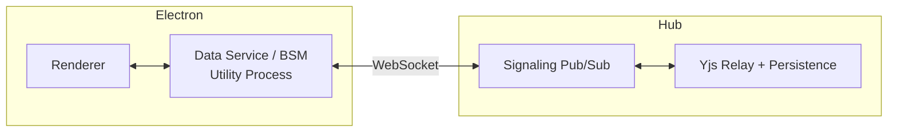
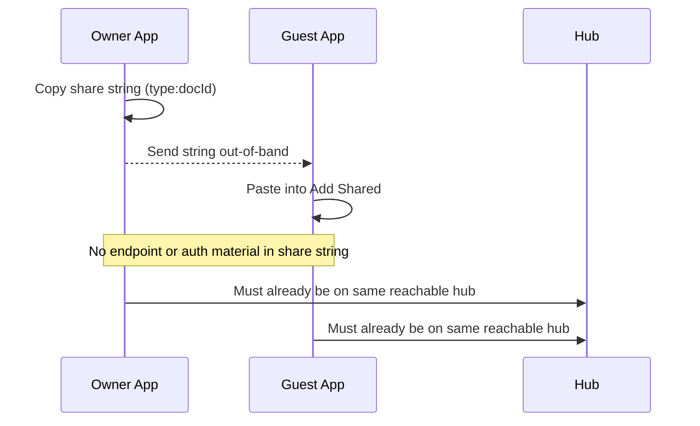
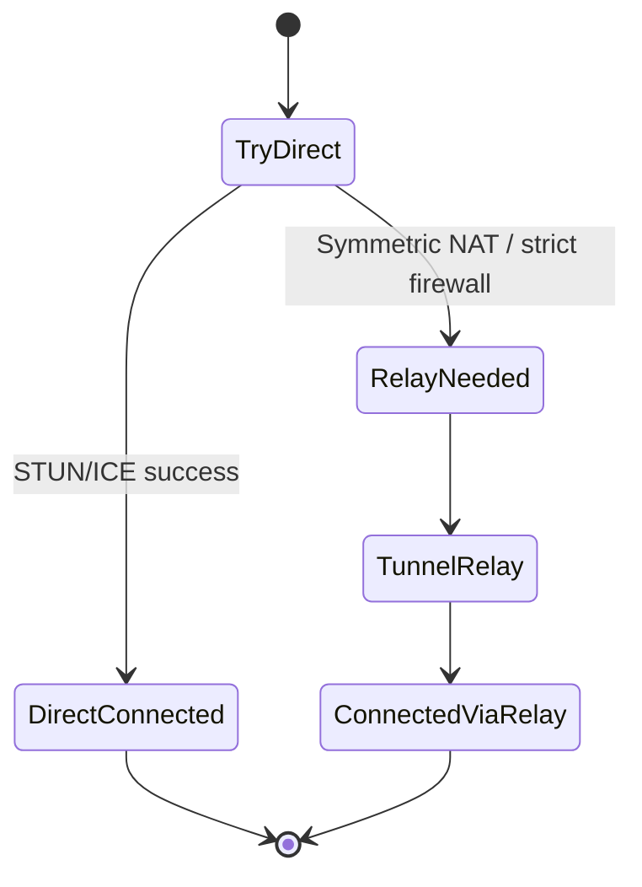
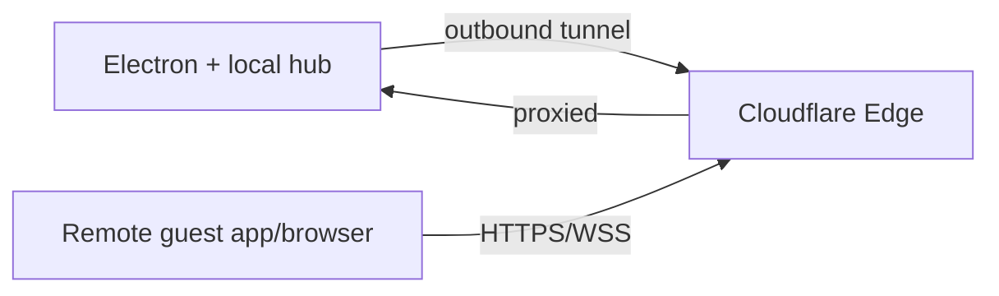
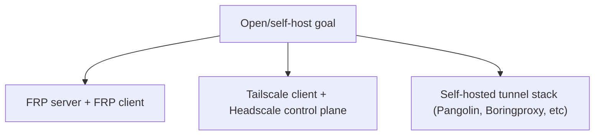
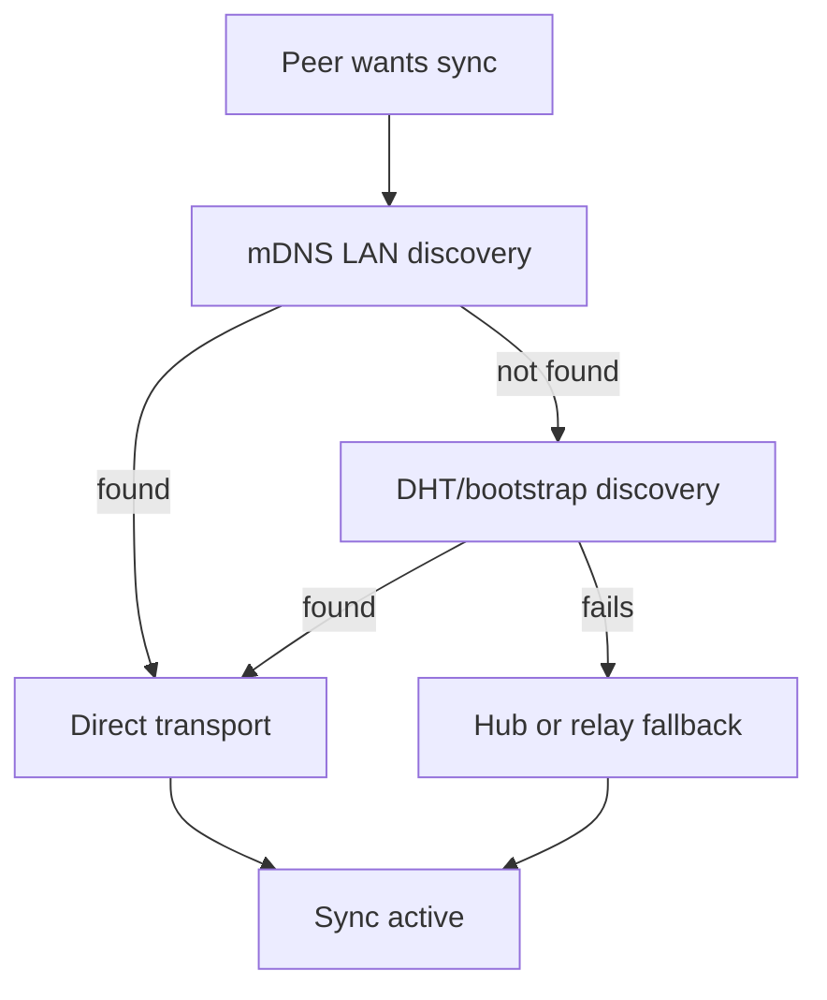
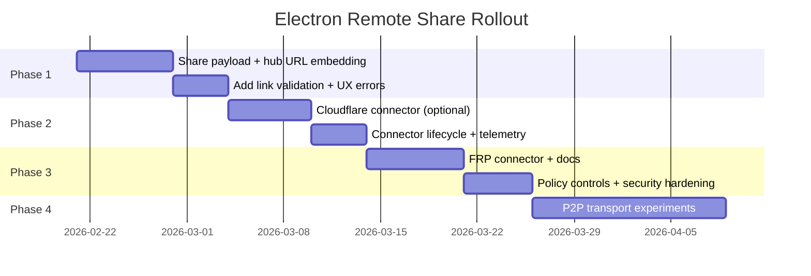

# 0090 - Electron P2P Remote Share Options

> **Status:** Exploration
> **Tags:** electron, p2p, webrtc, libp2p, cloudflare-tunnel, tailscale, headscale, frp, nat-traversal, hub
> **Created:** 2026-02-20
> **Context:** We want practical ways to make sharing from a local Electron app work across networks, ideally with secure "share my local machine" links, while evaluating Cloudflare localhost ports and simpler/open alternatives.

## Executive Take

There are three viable paths, each optimized for a different goal:

1. **Ship-now reliability:** Keep `@xnetjs/hub` relay as default and add a "public hub URL + share token" flow.
2. **Fast ad-hoc remote access:** Add optional **Cloudflare Tunnel** launcher for one-click temporary sharing.
3. **More open/self-hosted:** Offer **FRP/Headscale/Tailscale-style** connector mode for teams that want less vendor lock-in.

Best near-term strategy: **hybrid**. Keep hub relay as always-on fallback, then layer direct P2P/tunnel options by policy.

---

## Current Codebase Reality

### What is active today



- Electron sync starts with a `signalingUrl` (`apps/electron/src/renderer/lib/ipc-sync-manager.ts`).
- Default URL is `ws://localhost:4444` unless `VITE_HUB_URL` is set.
- Data service in Electron currently uses `ws` transport, room subscribe/publish, Yjs sync steps, heartbeats, and awareness forwarding (`apps/electron/src/data-process/data-service.ts`).
- Hub signaling is a minimal topic pub/sub service (`packages/hub/src/services/signaling.ts`), with relay/persistence logic in `packages/hub/src/services/relay.ts`.

### What is not active today

- `packages/network/src/node.ts` includes libp2p (WebRTC, DHT, relay transport) but is not wired into Electron runtime path.
- `packages/network/src/providers/ywebrtc.ts` exists but Electron BSM path currently uses WebSocket relay semantics.

### Share UX gap



- Share string is currently `type:docId` only (`apps/electron/src/renderer/components/ShareButton.tsx`).
- No built-in embedding of hub URL, no temporary auth token, no connectivity diagnostics.

---

## Core Constraint: NAT + Firewall Reality



Practical implication: if you need "works for everyone," you always need a relay fallback.

---

## Option A - Public Hub First (Most Practical)

Use `@xnetjs/hub` as the canonical internet rendezvous + relay. Make sharing explicit and secure via signed share payloads.

### Proposed share payload

```ts
type SharePayloadV1 = {
  v: 1
  doc: string
  docType: 'page' | 'database' | 'canvas'
  hub: string // wss://hub.example.com
  token?: string // optional UCAN-style scoped access token
  exp?: number // optional expiry timestamp
}
```

### Why this is strong

- Reuses what Electron already does today.
- No new NAT traversal complexity in v1.
- Works with hosted, self-hosted, or temporary hub endpoints.
- Cleanly compatible with future direct transport upgrades.

### Implementation checklist

- [ ] Define `SharePayloadV1` and URL-safe encoding/decoding utility.
- [ ] Update `ShareButton` to generate payload (not just `type:docId`).
- [ ] Update `AddSharedDialog` to accept payload and validate version/expiry.
- [ ] Wire "switch/connect to share hub" flow in renderer sync manager.
- [ ] Add optional scoped token verification path on hub connect.
- [ ] Add explicit error states: invalid payload, hub unreachable, token denied.

### Validation checklist

- [ ] Two machines on different networks can connect with only share link.
- [ ] Expired payload is rejected with clear UI copy.
- [ ] Wrong hub URL yields deterministic error and recovery action.
- [ ] Token scope blocks unauthorized docs.
- [ ] Existing `type:docId` strings remain backward-compatible.

---

## Option B - Cloudflare Tunnel for "Share Localhost"

Cloudflare Tunnel (`cloudflared`) gives outbound-only connectivity and public hostname mapping to local services.



### Good fit

- One command / low friction for demos.
- No inbound port forwarding.
- Works behind restrictive home NAT.

### Caveats

- Quick tunnels are best-effort/dev-oriented.
- Quick tunnel limits documented (e.g. in-flight request cap, no SSE on quick mode).
- This is not decentralized; trust and availability depend on Cloudflare.

### Implementation checklist

- [ ] Add optional "Start Temporary Tunnel" action in Electron settings.
- [ ] Spawn `cloudflared` child process with managed lifecycle.
- [ ] Parse assigned URL and auto-fill share payload `hub`.
- [ ] Surface tunnel health/status in UI.
- [ ] Ensure shutdown tears down process cleanly.

### Validation checklist

- [ ] Tunnel starts/stops from UI without orphan process.
- [ ] Share links include tunnel URL and connect remotely.
- [ ] Reconnect after local network change works or fails clearly.
- [ ] Idle/long session behavior measured and documented.

---

## Option C - Simpler More Open / Self-Hosted Paths

If "open" is the top priority, you can use self-hosted ingress/control planes.



### C1: FRP

- Mature reverse-proxy model for HTTP/TCP/UDP.
- Fully self-hostable, broad community use.
- Good for teams already operating a small VPS.

### C2: Headscale/Tailscale-style overlay

- Strong operator ergonomics for private mesh access.
- Open control plane path exists with Headscale.
- Great for trusted-team collaboration; less ideal for anonymous/public invite links.

### C3: Other self-hosted tunnel managers

- Many tools exist; they vary on protocol support, auth model, observability, and ops maturity.
- Good as "bring your own connector" plugin target instead of hardcoding one vendor.

### Implementation checklist

- [ ] Define pluggable connector interface in Electron (`start`, `stop`, `getPublicEndpoint`).
- [ ] Implement first-party connector: Cloudflare.
- [ ] Implement second connector: FRP (self-host profile).
- [ ] Add policy config: allowed connectors, required auth mode.
- [ ] Document minimal VPS deployment recipes.

### Validation checklist

- [ ] Same share flow works regardless of connector backend.
- [ ] Endpoint rotation updates active share metadata.
- [ ] Revoking connector access immediately invalidates new sessions.
- [ ] End-to-end encryption assumptions remain true under each connector.

---

## Option D - Full P2P Reintegration (Longer-Term)

This aligns with prior explorations (`0052`, `0078`) and dormant `@xnetjs/network` scaffolding.



### Reality check

- Highest decentralization potential.
- Highest implementation and operational complexity.
- Still needs fallback for hard NAT/firewall environments.

---

## Decision Matrix

| Option                    | Setup speed | Reliability | Openness    | Complexity | Best use case                   |
| ------------------------- | ----------- | ----------- | ----------- | ---------- | ------------------------------- |
| Public hub first          | High        | High        | Medium      | Low        | Ship production sharing now     |
| Cloudflare tunnel         | Very high   | Medium-high | Low-medium  | Low        | Quick remote demo links         |
| FRP/self-host connector   | Medium      | High        | High        | Medium     | Teams wanting control           |
| Headscale/Tailscale-style | Medium      | High        | Medium-high | Medium     | Trusted private mesh            |
| Full libp2p-first         | Low         | Medium      | High        | High       | Long-term decentralized roadmap |

---

## Recommended Plan (Phased)



### Priority recommendations

1. **Do now:** Implement share payload with `hub` + optional short-lived token.
2. **Do next:** Add Cloudflare connector as explicit "temporary public endpoint" mode.
3. **Do in parallel:** Design connector abstraction so FRP/Headscale can plug in later.
4. **Do later:** Re-enable deeper P2P stack when discovery/relay fallback UX is stable.

---

## Security Notes

- Treat share links as bearer material if tokenized; default to short expiry.
- Keep per-doc capability scope minimal (`hub/signal` / `hub/relay` scoped to resource).
- Keep signed Yjs envelope verification active in all relay modes.
- Add connection audit trail in desktop and hub logs for incident review.

---

## Research Notes

- Codebase review confirms Electron currently uses WebSocket hub signaling/relay path, with dormant libp2p/y-webrtc scaffolding.
- Web references were pulled from upstream docs/pages directly for Cloudflare Tunnel, Tailscale Funnel, NAT traversal behavior, and open tunneling ecosystem comparisons.

---

## References

- `apps/electron/src/data-process/data-service.ts`
- `apps/electron/src/renderer/lib/ipc-sync-manager.ts`
- `apps/electron/src/renderer/components/ShareButton.tsx`
- `apps/electron/src/renderer/components/AddSharedDialog.tsx`
- `packages/hub/src/services/signaling.ts`
- `packages/hub/src/services/relay.ts`
- `packages/network/src/node.ts`
- `packages/network/src/providers/ywebrtc.ts`
- `docs/explorations/0052_[_]_LIBP2P_REINTEGRATION.md`
- `docs/explorations/0078_[_]_TRULY_P2P_DISCOVERY_AND_ROUTING.md`
- https://developers.cloudflare.com/cloudflare-one/networks/connectors/cloudflare-tunnel/
- https://developers.cloudflare.com/cloudflare-one/networks/connectors/cloudflare-tunnel/do-more-with-tunnels/trycloudflare/
- https://developers.cloudflare.com/cloudflare-one/networks/connectors/cloudflare-tunnel/routing-to-tunnel/protocols/
- https://tailscale.com/docs/features/tailscale-funnel
- https://tailscale.com/blog/how-nat-traversal-works
- https://github.com/fatedier/frp
- https://github.com/juanfont/headscale
- https://github.com/anderspitman/awesome-tunneling
