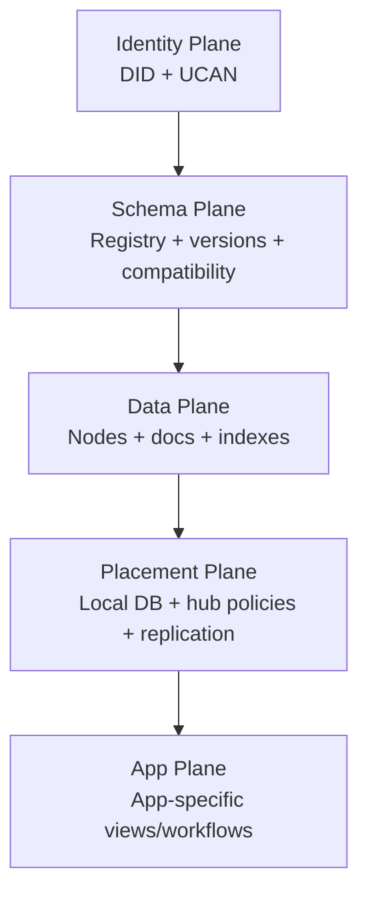
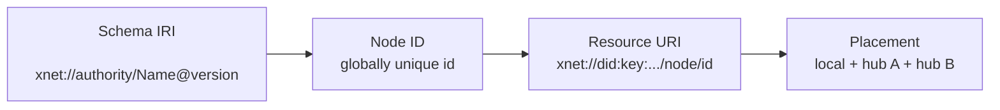
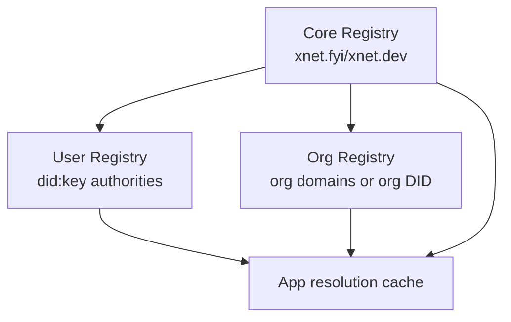
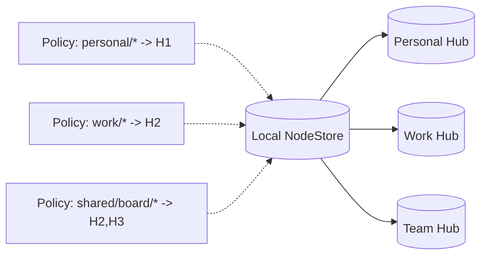
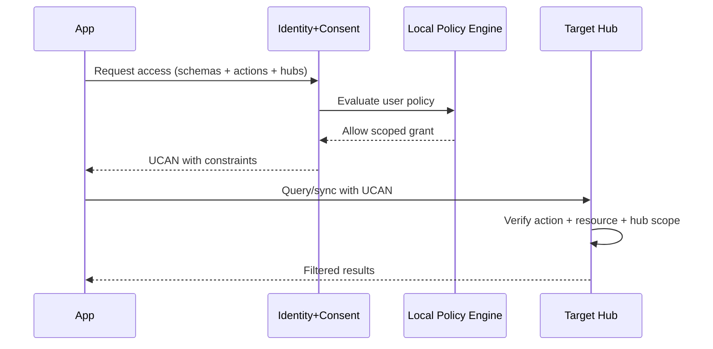
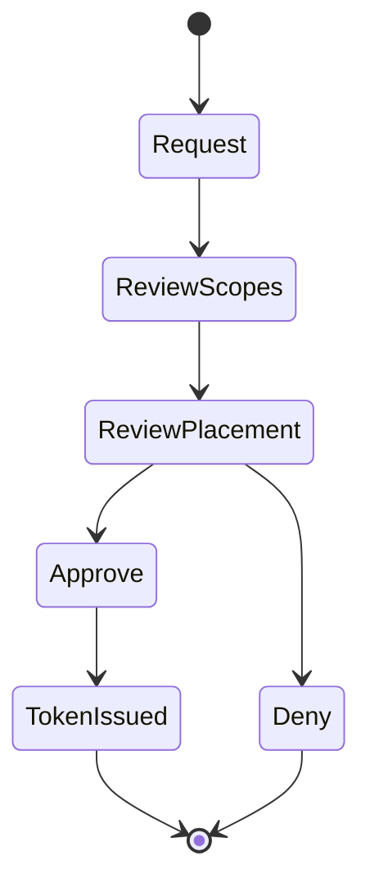
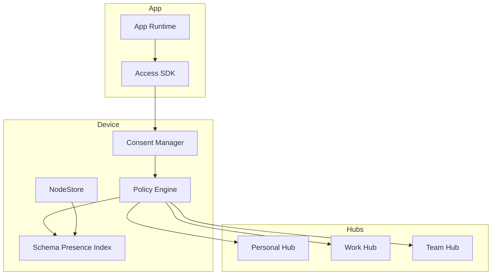

# 0091 - Global Schema Federation Model

> **Status:** Exploration  
> **Tags:** schema, federation, multi-hub, authz, ux, developer-experience, local-first  
> **Created:** 2026-02-20  
> **Context:** xNet already uses namespaced schemas and globally unique node IDs. This explores what a practical, user-centric global schema/data federation model should look like (including multi-hub selective sync).

## Executive Take

The platform can support a true "user-owned data, app-as-view" model, but it needs one missing layer:

1. **A portable schema presence index** (what schemas this user has data for, where, and under what policy).
2. **A capability-scoped access model** that combines schema scope + namespace scope + hub scope.
3. **A multi-hub sync policy engine** so users can declare data placement rules (personal hub vs work hub, etc.).
4. **A developer-facing discovery API** so apps can request capabilities and discover available schemas without guessing.

Without these, xNet remains technically federatable but operationally app-centric.

---

## Why This Matters

Today most software assumes:

- App owns data model.
- Data is copied between apps via integrations/APIs.
- Users grant app-level access, not data-level access.

xNet's model is different:

- Data is owned by the user, globally addressable, schema-typed.
- Apps are specialized interfaces over shared user data.
- Sync should be policy-driven, not app-silo-driven.

That is a major mental model shift for both users and developers, so architecture and UX need to make this model obvious and safe.

---

## Current Reality In Codebase

From current implementation:

- `@xnetjs/data` already models schemas as global IRIs (`xnet://...`) and nodes with global IDs (`createNodeId()` via nanoid): `packages/data/src/schema/node.ts`.
- Runtime schema loading is supported with local + remote resolver (`SchemaRegistry.setRemoteResolver`): `packages/data/src/schema/registry.ts`.
- Hub already has schema registry APIs (`POST /schemas`, `GET /schemas`, `GET /schemas/resolve/*`): `packages/hub/src/routes/schemas.ts` and `packages/hub/src/services/schemas.ts`.
- Hub federation already supports per-peer schema filtering (`peer.schemas`) and exposure filtering (`config.expose.schemas`): `packages/hub/src/services/federation.ts`.
- Query path already supports schema filters (`filters.schemaIri`) and permission filtering: `packages/hub/src/services/query.ts`.
- React sync path currently resolves one active signaling URL (`hubUrl ?? signalingServers?.[0]`), i.e. no first-class concurrent multi-hub sync orchestration yet: `packages/react/src/context.ts:398`.

So: core pieces exist, but the composition layer (schema discovery + multi-hub policy + app consent flow) is incomplete.

---

## Proposed Global Schema Model

### 1) Four Planes



Key point: apps should mostly live in the App Plane; ownership, policy, and interoperability live below it.

### 2) Global Addressing Contract



Practical implication: identity of data is independent of where it is stored.

---

## Schema Presence Index (Missing Primitive)

To enable "any app can request access to any data," we need a local canonical index of what exists.

### Proposed shape

```ts
type SchemaPresenceRecord = {
  schemaIri: string
  namespace: string
  nodeCount: number
  lastUpdatedAt: number
  authorities: string[]
  labels?: string[]
  storage: {
    local: boolean
    hubs: Array<{
      hubDid: string
      replicated: boolean
      encrypted: boolean
      lastSyncAt?: number
    }>
  }
}
```

This index should be:

- Maintained locally from NodeStore changes.
- Optionally published (partially) to selected hubs.
- Queryable by apps only through capability-checked APIs.

---

## Shared Schema Registry Design

Use three registry tiers:



### Registry semantics

- **Core schemas**: stable canonical primitives (`Comment`, `Grant`, etc.).
- **User schemas**: personal or community schemas under DID authorities.
- **Org schemas**: enterprise/compliance schemas.

### Recommendation

Treat registry as **resolvable + cacheable + signed metadata**, not as a global hard authority.

---

## Multi-Hub Selective Sync Model

### Desired behavior

- One local DB remains source of user experience.
- Multiple hubs can hold distinct subsets.
- Policy decides what replicates where.



### Policy object

```ts
type SyncPolicyRule = {
  id: string
  match: {
    schemaIri?: string
    namespacePrefix?: string
    ownerDid?: string
    labelsAny?: string[]
  }
  destinations: Array<{
    hubDid: string
    mode: 'none' | 'metadata-only' | 'full'
    encryptAtRest: boolean
  }>
}
```

---

## Authorization Model (AuthZ)

Need to authorize at 4 scopes simultaneously:

1. Subject identity (DID)
2. Action (`read`, `write`, `query`, `relay`)
3. Resource set (node IDs / namespace prefixes / schema IRIs)
4. Placement scope (which hub)



### Capability examples

- `hub/query` with `with=xnet://did:key:alice/work/*`
- `hub/relay` for selected docs
- `schema/read` for registry discovery
- `presence/read` for schema presence index (metadata only)

---

## API Surface Proposal

### Local APIs

- `GET /schemas/presence` -> list of schema presence records (capability filtered).
- `GET /schemas/presence/:schemaIri` -> per-schema details.
- `GET /sync/policies` + `PUT /sync/policies`.
- `POST /access/request` -> structured app capability request.

### Hub APIs

- Existing `/schemas` stays.
- Add `/presence` (optional, privacy-preserving aggregate metadata).
- Add `/sync/policy/validate` dry-run endpoint for policy testing.

---

## UX Model (User Experience)

Users should not see "grant app X all data." They should see:

- **What data type**: "Comments", "Tasks", "Invoices".
- **What scope**: "Only work namespace".
- **Where data can go**: "Work Hub only".
- **Duration**: "30 days" or "until revoked".



---

## Developer Experience (DX)

Developers need defaults that keep them out of security trouble.

### DX recommendations

- SDK helper: `requestDataAccess({ schemas, namespacePrefixes, hubs, actions })`.
- Generated capability templates for common patterns (read-only comments, read/write tasks, etc.).
- Explicit failure reasons (`missing_scope`, `hub_not_allowed`, `schema_not_present`).
- Built-in mock/test mode for consent and policy evaluation.

---

## Conflict, Redundancy, and Data Placement

### Should there be one big DB?

Locally: **yes** (single logical NodeStore).  
Remotely: **logical one, physical many** (replicated subsets across hubs by policy).

### Redundancy control

- Keep one canonical node identity.
- Replicate by reference + change log, not app-specific copies.
- Use metadata-only replication when content should stay local or in another hub.

---

## Security and Privacy Risks

- Schema presence leakage can reveal sensitive behavior (e.g., HR, health, legal data schemas).
- Multi-hub policy drift can accidentally replicate restricted data.
- App devs may over-request broad scopes.

Mitigations:

- Capability minimization defaults.
- Policy simulation before apply.
- Continuous audit log of grant + sync decisions.
- Separate visibility levels: `private`, `trusted-app`, `public-metadata`.

---

## External Pattern References

Relevant external patterns to borrow:

- **ActivityStreams/ActivityPub**: global IDs, collection patterns, federation vocabulary, extension via JSON-LD contexts.
- **DID Core**: decentralized identifier and resolver model.
- **UCAN**: offline-verifiable delegated capabilities.
- **Solid WAC**: resource-centric ACL and inheritance semantics.
- **Schema.org**: shared cross-domain vocabulary governance and extension model.
- **Schema Registry ecosystems** (e.g., Confluent-style): versioned schema lifecycle and compatibility discipline.

---

## Recommended Architecture (Practical)



---

## Implementation Checklist

### Phase 1 - Discovery and Presence

- [ ] Add local Schema Presence Index projection from NodeStore changes.
- [ ] Add capability-gated local API for schema presence queries.
- [ ] Add SDK methods for schema presence discovery and constrained access requests.

### Phase 2 - Multi-Hub Policy Engine

- [ ] Define `SyncPolicyRule` schema and persistence.
- [ ] Implement policy matcher for schema/namespace/owner/labels.
- [ ] Add per-hub replication planner (`none`, `metadata-only`, `full`).
- [ ] Add dry-run simulator with "would replicate" report.

### Phase 3 - AuthZ and Consent UX

- [ ] Extend capability claims to include hub-scoped placement constraints.
- [ ] Build consent dialog with scope + placement + duration.
- [ ] Add grant revocation and immediate policy re-evaluation.

### Phase 4 - Hub Interop

- [ ] Add optional hub presence metadata endpoint.
- [ ] Add policy validation endpoint in hub for integration tests.
- [ ] Enforce schema exposure filters in federation and query paths consistently.

### Phase 5 - Education and Onboarding

- [ ] Publish docs explaining "apps as views over user-owned data".
- [ ] Provide migration guide from app-centric data models.
- [ ] Provide reference app showing shared Comment schema across multiple surfaces.

---

## Validation Checklist

### Functional

- [ ] App can discover schema presence without seeing unauthorized data.
- [ ] App can request and receive narrowly scoped capabilities.
- [ ] Data tagged work-only replicates to work hub and never personal hub.
- [ ] Metadata-only sync does not leak encrypted/full payloads.
- [ ] Revoking grant blocks further query/sync within one policy refresh cycle.

### Security

- [ ] Unauthorized schema presence requests are denied and audited.
- [ ] Hub rejects capabilities that exceed requested/issued scope.
- [ ] Replay of expired delegation tokens is rejected.
- [ ] Policy bypass attempts via alternate namespace aliases are blocked.

### Resilience

- [ ] Local-only operation works offline with cached capabilities and policies.
- [ ] Reconnect to multiple hubs reconciles without duplicate node identities.
- [ ] Network partition does not violate placement policy after recovery.

### UX/DX

- [ ] Users understand "what, where, how long" for every app access request.
- [ ] Developers can integrate access flow in <30 minutes using SDK examples.
- [ ] Error messages clearly indicate missing scope vs unavailable data vs denied hub.

---

## Open Questions

1. Should schema presence counts be exact or bucketed/noised for privacy?
2. Do we treat placement policy as user-global or workspace/profile-specific?
3. Should hub exposure allow schema-level only, or schema+namespace tuple constraints?
4. What is the minimum viable "shared schema governance" process for community schemas?

---

## Suggested Immediate Next Steps

1. Implement local Schema Presence Index first (lowest risk, highest leverage).
2. Add policy simulation tooling before enabling broad multi-hub replication.
3. Ship one end-to-end reference flow: shared `Comment` schema across docs/database/canvas with constrained app access.
4. Add architecture docs that explicitly separate identity, schema, data, and placement planes.

---

## References

### Internal

- `packages/data/src/schema/node.ts`
- `packages/data/src/schema/registry.ts`
- `packages/hub/src/routes/schemas.ts`
- `packages/hub/src/services/schemas.ts`
- `packages/hub/src/services/federation.ts`
- `packages/hub/src/services/query.ts`
- `packages/react/src/context.ts`
- `docs/VISION.md`

### External

- https://www.w3.org/TR/activitystreams-core/
- https://www.w3.org/TR/activitypub/
- https://www.w3.org/TR/did-core/
- https://ucan.xyz/
- https://solidproject.org/TR/wac
- https://schema.org/docs/schemas.html
- https://docs.confluent.io/platform/current/schema-registry/index.html
