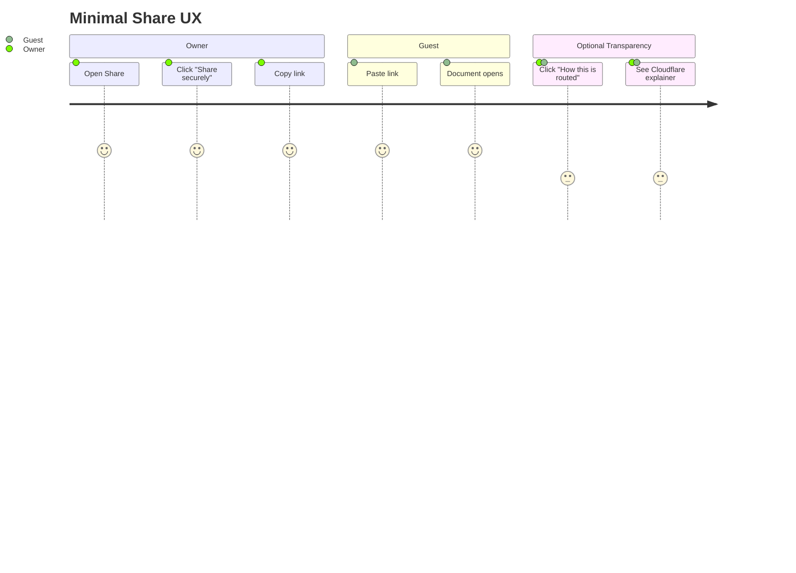
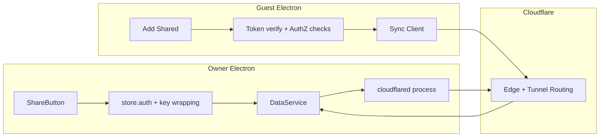
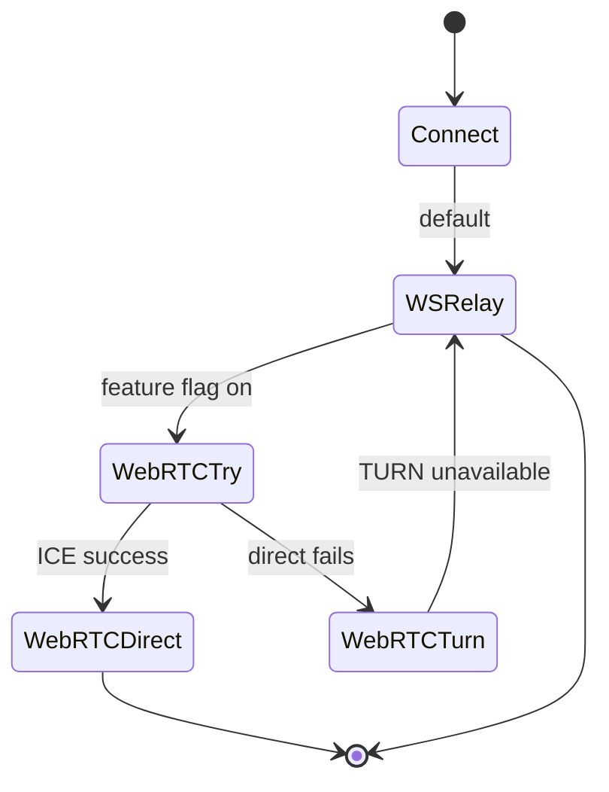
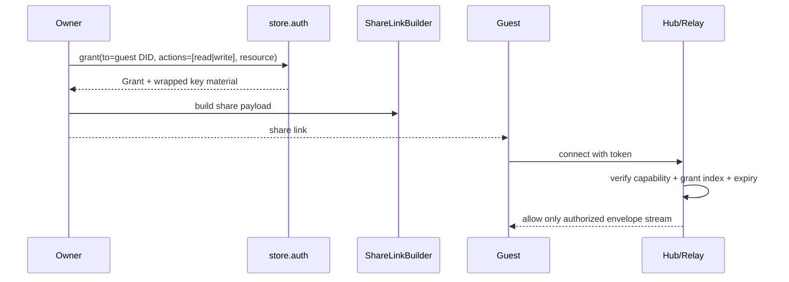
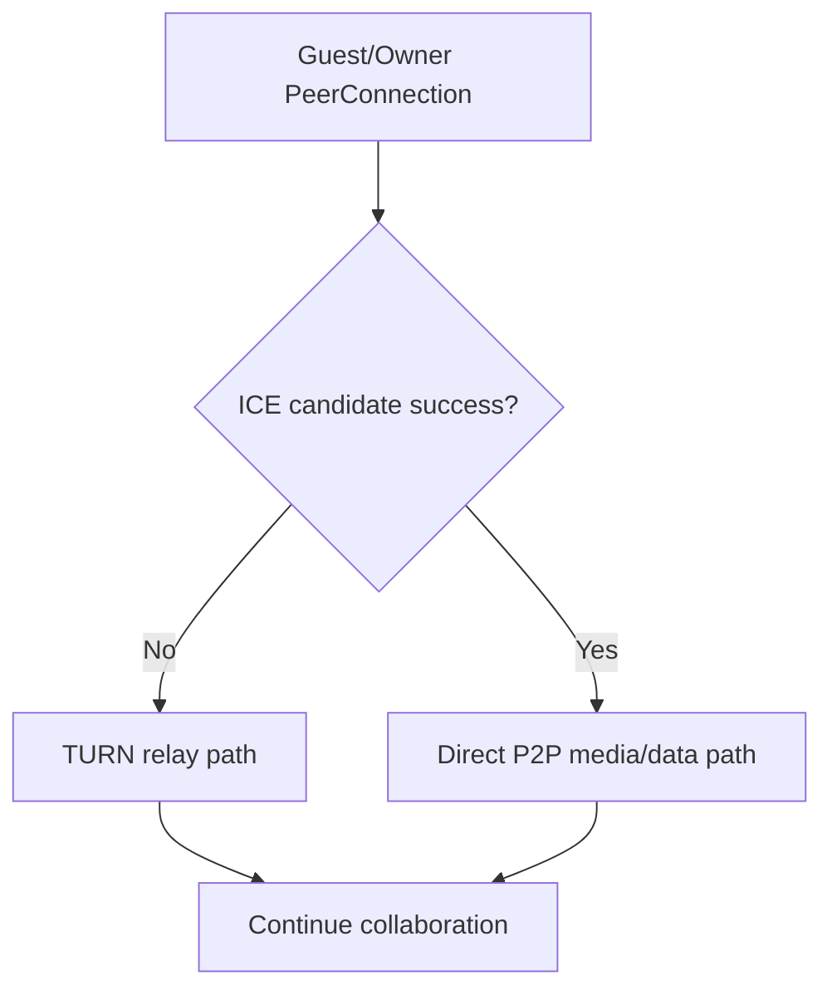
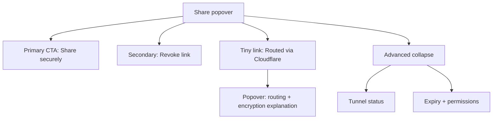

# 0092 - Cloudflare Option B Implementation (WebRTC + AuthZ + Minimal UX)

> **Status:** Exploration  
> **Tags:** electron, cloudflare, tunnel, webrtc, yjs, authz, ucan, ux, relay, nat-traversal  
> **Created:** 2026-02-20  
> **Context:** Deep implementation plan for Option B from `0090` focused on "share my local app" via Cloudflare with minimal user-facing complexity, plus WebRTC support and V2 authorization primitives.

## Executive Take

Option B is viable for near-term remote sharing if we treat Cloudflare as a transport substrate, not the trust boundary.

1. **User experience should be one primary action:** `Share securely`.
2. **Security should come from xNet AuthZ + crypto primitives**, not from tunnel obscurity.
3. **WebRTC should be additive:** direct peer when possible, relay/tunnel fallback always.
4. **Cloudflare should be visible but unobtrusive:** tiny disclosure link + short popover copy.

Recommended rollout: **WS tunnel first**, then **WebRTC path with TURN fallback**, both gated by the same AuthZ token model.

---

## Current Baseline in xNet

From current code:

- Electron sync runtime currently starts from a single `signalingUrl` (defaults to `ws://localhost:4444`): `apps/electron/src/renderer/lib/ipc-sync-manager.ts`.
- Utility-process sync (`DataService`) is WebSocket-first with signed envelope verification and peer scoring: `apps/electron/src/data-process/data-service.ts`.
- Share UX currently copies `type:docId` only (no endpoint/auth metadata): `apps/electron/src/renderer/components/ShareButton.tsx` and `apps/electron/src/renderer/components/AddSharedDialog.tsx`.
- WebRTC building blocks already exist but are not in Electron sync path:
  - `packages/network/src/providers/ywebrtc.ts`
  - `packages/network/src/node.ts`
- New AuthZ primitives are already defined/validated in plan docs and review:
  - `store.auth.can/grant/revoke/explain/listGrants`
  - grant indexing model (`GrantIndex`), offline policy, revocation wiring, Yjs auth-gate concepts: `docs/plans/plan03_9_81AuthorizationRevisedV2/REVIEW.md`.

---

## Product Shape: "Secure Share Link" (Minimal UX)



### UX constraints

- Default flow: one-click link generation, one-click copy.
- No forced "what is Cloudflare?" setup wizard.
- Small inline text/link: `Routed via Cloudflare` with popover:
  - "Traffic is proxied through Cloudflare edge.
  - Content remains encrypted by xNet.
  - Access is controlled by short-lived share grants."
- Advanced panel (collapsed): tunnel health, endpoint, expiry, revoke.

---

## Target Architecture



### Transport policy



Interpretation:

- **Always keep WS relay path available** for deterministic connectivity.
- WebRTC is opportunistic optimization for latency/mesh behavior.
- Tunnel remains useful even in WS mode because it solves owner-host reachability.

---

## AuthZ Model for Share Links (V2 Primitive Aligned)

### Share payload V2 proposal

```ts
type SharePayloadV2 = {
  v: 2
  resource: string // node/doc id
  docType: 'page' | 'database' | 'canvas'
  endpoint: string // wss or https cloudflare hostname
  token: string // UCAN-like capability token
  exp: number // absolute expiry millis
  transportHints?: {
    ws?: boolean
    webrtc?: boolean
    iceServers?: Array<{ urls: string[]; username?: string; credential?: string }>
  }
}
```

### Capability mapping

- `hub/connect` + `hub/query` for bootstrap/read.
- `hub/relay` for collaborative updates.
- `xnet/read` and optionally `xnet/write` scoped to single `resource`.
- Short TTL default (example: 30 minutes for ad-hoc sharing).

### Auth decision flow



---

## WebRTC Support Design (Option B Compatible)

Two practical layers:

1. **Signaling over Cloudflare-exposed endpoint** (easy, immediate).
2. **ICE with TURN fallback** for hard NAT cases.



### External constraints to bake in

- Cloudflare Quick Tunnels are dev-oriented (no SLA; limit on in-flight requests; no SSE): `trycloudflare` docs.
- Cloudflare Tunnel supports HTTP/HTTPS and WSS-compatible proxying patterns.
- For WebRTC relay fallback, Cloudflare TURN service publishes STUN/TURN endpoints (`stun.cloudflare.com`, `turn.cloudflare.com`) with UDP/TCP/TLS options.

Practical recommendation:

- Use Quick Tunnel only for `Temporary Share` mode.
- For stable sharing, use named/account tunnel mode.
- Gate WebRTC by feature flag and provide explicit fallback to WS relay.

---

## Minimal UX Specification



### Copy draft

- Primary status: `Secure link active`.
- Microcopy: `Routed via Cloudflare. End-to-end content access is controlled by xNet encryption and permissions.`
- Link in popover: `Learn about Cloudflare Tunnel` -> `https://developers.cloudflare.com/cloudflare-one/networks/connectors/cloudflare-tunnel/`.

---

## Implementation Plan

## Phase 1 - Link/Auth foundation (no WebRTC yet)

- [ ] Introduce `SharePayloadV2` parser/encoder in renderer share utilities.
- [ ] Extend `ShareButton` to request scoped grant via `store.auth.grant()` before copy.
- [ ] Extend `AddSharedDialog` to parse v2 payload and validate expiry/version.
- [ ] Add backward compatibility for legacy `type:docId` links.
- [ ] Add `Revoke share` action mapped to `store.auth.revoke()`.

## Phase 2 - Cloudflare tunnel lifecycle in Electron

- [ ] Add tunnel manager service in main/utility process to spawn/monitor `cloudflared`.
- [ ] Support `Temporary Share` (Quick Tunnel) and `Persistent Share` (named tunnel).
- [ ] Parse and persist public endpoint for active share links.
- [ ] Ensure process cleanup on app shutdown and explicit stop.
- [ ] Emit health telemetry/events to renderer (`starting`, `ready`, `degraded`, `stopped`).

## Phase 3 - WS relay AuthZ hardening

- [ ] Enforce token expiry + capability checks on connect/subscribe/relay actions.
- [ ] Use grant-index lookup path for resource-level authorization checks.
- [ ] Return structured denial errors (`UNAUTHORIZED`, `TOKEN_EXPIRED`, `TOKEN_REVOKED`).
- [ ] Log auth decisions for DevTools/AuthZ timeline visibility.

## Phase 4 - WebRTC transport path

- [ ] Add transport strategy abstraction in sync layer (`ws`, `webrtc`, `auto`).
- [ ] Wire existing `ywebrtc` provider behind feature flag for selected doc types.
- [ ] Reuse same token and resource scope for room join authorization.
- [ ] Add ICE server configuration surface (default STUN; optional TURN credentials).
- [ ] Implement immediate downgrade to WS relay on auth or ICE failures.

## Phase 5 - Revocation + Yjs authorization integration

- [ ] Wire grant-revocation events to active room auth cache invalidation.
- [ ] Add `unauthorized_update` peer scoring category in sync pipeline.
- [ ] Kick revoked peers from active sessions and rotate keys.
- [ ] Verify room-gated write path checks `store.auth.can({ action: 'write' })`.

---

## Validation Plan

## Functional validation

- [ ] Owner creates secure link in <2 clicks.
- [ ] Guest pastes link and joins without manual endpoint setup.
- [ ] Legacy link format still opens existing shared docs.
- [ ] Revoke action invalidates new join attempts immediately.
- [ ] Tunnel stop tears down access and updates UI status.

## AuthZ/security validation

- [ ] Token scoped to single resource cannot access sibling resources.
- [ ] Expired token rejected with deterministic error.
- [ ] Revoked grant reflected in hub filtering and room join decisions.
- [ ] Unauthorized Yjs update is rejected and peer-penalized.
- [ ] Audit events visible in DevTools/AuthZ panel for grant + revoke + deny.

## WebRTC validation

- [ ] Auto mode picks WebRTC direct when ICE succeeds.
- [ ] On direct failure, TURN/relay fallback succeeds without user action.
- [ ] On TURN failure, WS relay fallback maintains editing continuity.
- [ ] Revocation during active WebRTC session evicts peer within one update cycle.

## Reliability/ops validation

- [ ] No orphan `cloudflared` process after stop/restart/crash paths.
- [ ] Quick Tunnel mode surfaces explicit "development-grade" warning.
- [ ] Endpoint rotation updates share payload generation immediately.
- [ ] Network switch (wifi -> hotspot) recovers or fails with actionable message.

## UX validation

- [ ] Users understand sharing without knowing tunnel internals.
- [ ] Cloudflare disclosure is visible but non-blocking.
- [ ] Only one primary CTA is needed for common sharing flow.

---

## Risks and Mitigations

| Risk                           | Impact                 | Mitigation                                                  |
| ------------------------------ | ---------------------- | ----------------------------------------------------------- |
| Quick Tunnel instability       | Session drops          | Keep WS reconnect + one-click restart; label temporary mode |
| Vendor coupling concern        | Strategic lock-in      | Keep connector abstraction (Cloudflare first, FRP next)     |
| Auth drift across transports   | Security bug           | Single capability verifier shared by WS + WebRTC paths      |
| Revocation lag in active rooms | Over-permission window | Immediate auth-cache invalidation + key rotation            |
| UX clutter                     | Adoption friction      | Single primary action, advanced details collapsed           |

---

## Recommendation

1. Implement **Option B as a minimal secure-link mode** on top of existing WS relay first.
2. Reuse the **new AuthZ primitives as the canonical trust model** (not tunnel trust).
3. Add **WebRTC in auto mode** only after WS+AuthZ path is production-stable.
4. Keep Cloudflare visible through lightweight transparency copy and docs link, not configuration burden.

---

## References

### Internal

- `docs/explorations/0090_[_]_ELECTRON_P2P_REMOTE_SHARE_OPTIONS.md`
- `docs/plans/plan03_9_81AuthorizationRevisedV2/REVIEW.md`
- `docs/plans/plan03_9_81AuthorizationRevisedV2/README.md`
- `docs/plans/plan03_9_81AuthorizationRevisedV2/05-grants-delegation-and-offline-policy.md`
- `docs/plans/plan03_9_81AuthorizationRevisedV2/06-hub-and-peer-filtering.md`
- `docs/plans/plan03_9_81AuthorizationRevisedV2/09-yjs-document-authorization.md`
- `apps/electron/src/renderer/components/ShareButton.tsx`
- `apps/electron/src/renderer/components/AddSharedDialog.tsx`
- `apps/electron/src/renderer/lib/ipc-sync-manager.ts`
- `apps/electron/src/data-process/data-service.ts`
- `packages/network/src/providers/ywebrtc.ts`
- `packages/network/src/node.ts`

### External

- https://developers.cloudflare.com/cloudflare-one/networks/connectors/cloudflare-tunnel/
- https://developers.cloudflare.com/cloudflare-one/networks/connectors/cloudflare-tunnel/do-more-with-tunnels/trycloudflare/
- https://developers.cloudflare.com/cloudflare-one/networks/connectors/cloudflare-tunnel/routing-to-tunnel/protocols/
- https://developers.cloudflare.com/realtime/
- https://developers.cloudflare.com/realtime/turn/
- https://developers.cloudflare.com/realtime/sfu/
