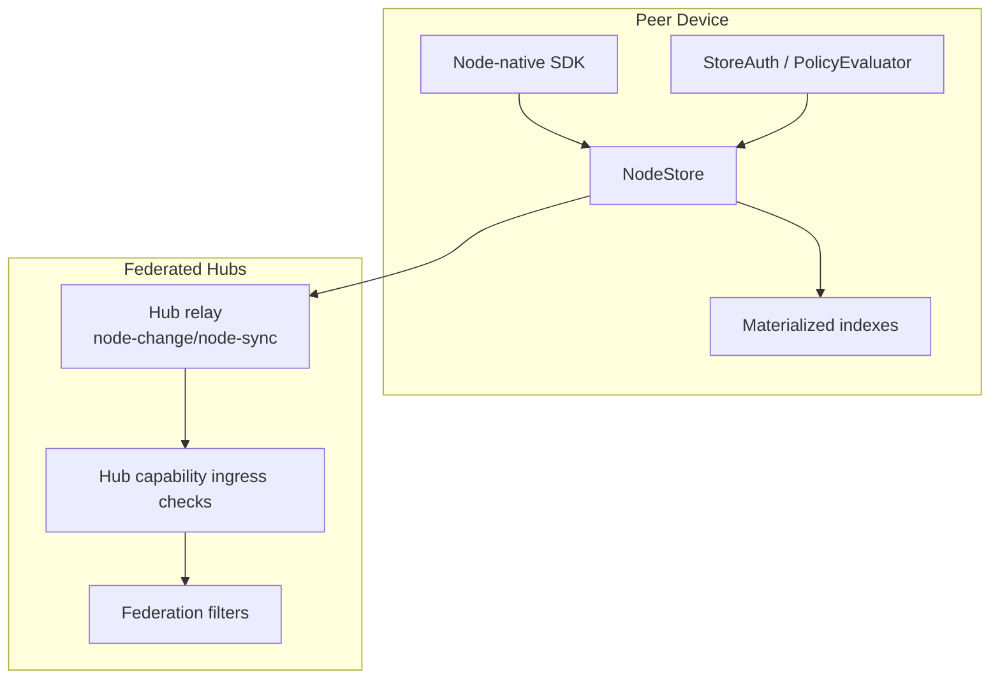
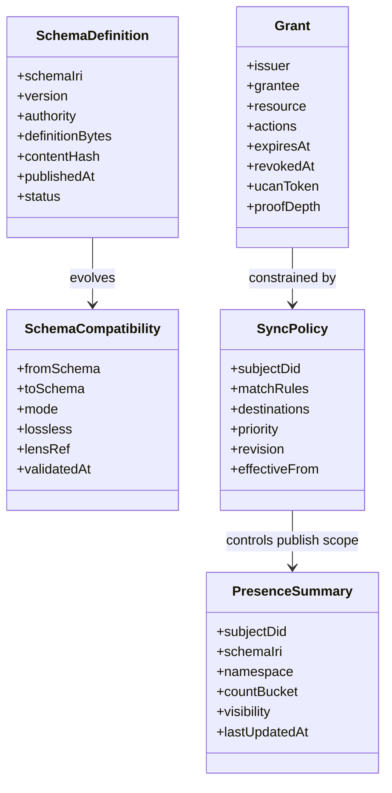
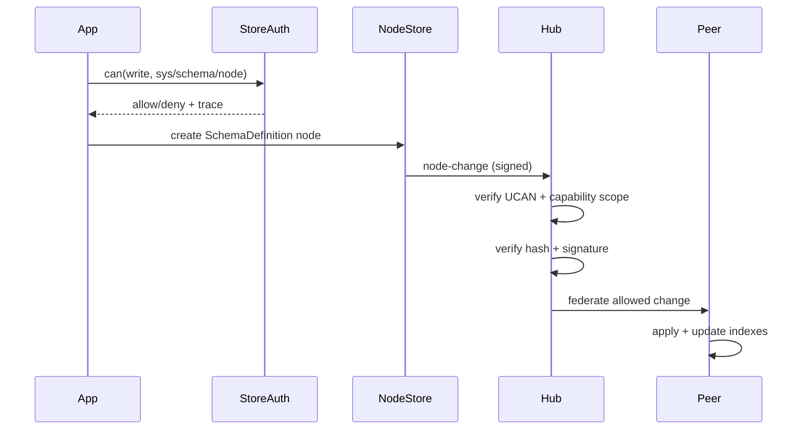
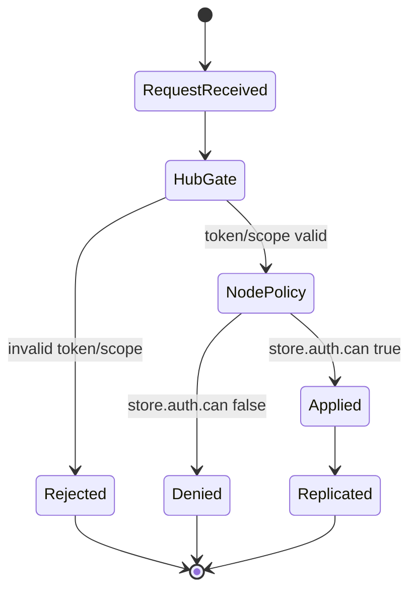
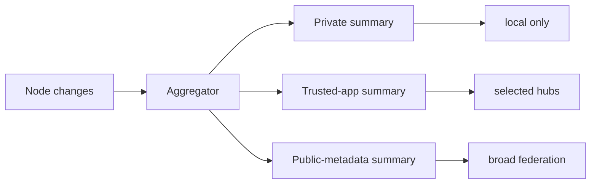
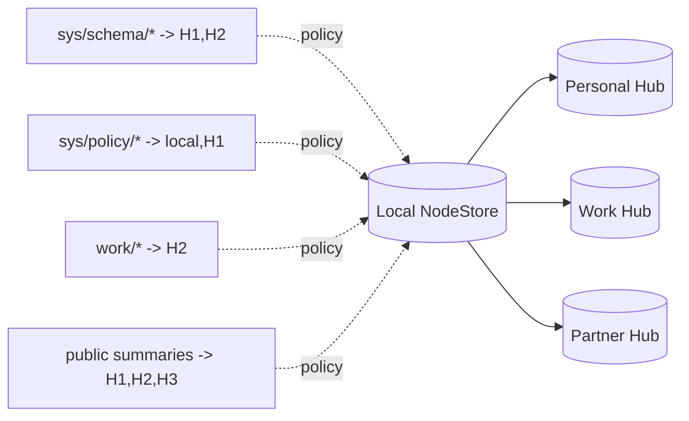

# 0093 - Node-Native Global Schema Federation Model (Greenfield)

> **Status:** Exploration  
> **Tags:** schema, federation, node-store, authz, ucan, multi-hub, local-first, system-metadata  
> **Created:** 2026-02-20  
> **Context:** Greenfield design for global schema federation where **nodes are the only canonical primitive** for schema and system-level metadata exchange between peers.

## Executive Take

For a greenfield xNet federation model, we should treat schema and system metadata exactly like user data:

1. **Represent control plane state as nodes** (`SchemaDefinition`, `SchemaCompatibility`, `SyncPolicy`, `PresenceSummary`, `Grant`).
2. **Replicate via signed node-change streams**, not bespoke endpoint protocols.
3. **Use node-native authorization as primary policy** (`store.auth.can/grant/revoke/explain`).
4. **Use hub capability checks as transport ingress guardrails**, not as policy source of truth.
5. **Design multi-hub placement from day one** so schema/system state follows explicit policy.

This gives one mental model: **everything important is a schema-validated node with signed change history**.

---

## Problem Statement

We need global schema federation that lets peers exchange:

- Schema definitions and compatibility metadata
- Presence/discovery metadata
- Placement and replication policies
- Delegated access grants

without introducing a separate control protocol stack. If control metadata uses a different primitive than data, complexity and security drift follow.

---

## Design Goals

- **Single primitive:** nodes + signed changes for both app data and system metadata.
- **Authorization consistency:** same policy engine semantics for control and content.
- **Offline-first:** local operation with eventual convergence across hubs.
- **Multi-hub selective replication:** policy-driven placement by schema/namespace/sensitivity.
- **Auditable security:** replay-resistant, signature-validated, and explainable denials.

---

## Current Building Blocks (Codebase Signals)

The repo already has the critical primitives to support this design:

- Node identity and schema IRIs in `packages/data/src/schema/node.ts`.
- Event-sourced NodeStore with Lamport ordering and signed changes in `packages/data/src/store/store.ts`.
- Node relay with change hash and signature verification in `packages/hub/src/services/node-relay.ts`.
- Node-native auth API in `packages/data/src/auth/store-auth.ts` (`can`, `grant`, `revoke`, `explain`, listing APIs).
- Hub UCAN session/auth context in `packages/hub/src/auth/ucan.ts`.
- Hub capability wildcard/prefix resource checks in `packages/hub/src/auth/capabilities.ts`.
- Query service with grant-aware filtering and grant indexing in `packages/hub/src/services/query.ts`.
- Federation schema exposure controls in `packages/hub/src/services/federation.ts`.
- React provider currently chooses one active signaling URL (`hubUrl ?? signalingServers?.[0]`) in `packages/react/src/context.ts:398`.

Interpretation: most primitives exist; the missing work is a coherent system-schema model and orchestration.

---

## Canonical Architecture

### Principle

- **Canonical state:** NodeStore + signed changes
- **Canonical policy:** StoreAuth decisions
- **Network boundary:** UCAN/capability checks at hub ingress
- **Derived views:** local indexes and query surfaces derived from node state

---

## System Schema Pack (Control Plane as Nodes)

Define a first-party schema pack for control-plane metadata.

### Reserved namespace conventions

- `xnet://did:key:<subject>/sys/schema/*`
- `xnet://did:key:<subject>/sys/compat/*`
- `xnet://did:key:<subject>/sys/policy/*`
- `xnet://did:key:<subject>/sys/presence/*`
- `xnet://did:key:<subject>/sys/authz/*`

These are policy conventions, enforced by schema validation + auth checks.

---

## Data and Control Flow

### Key invariant

No system metadata bypasses node mutation rules. If it is globally relevant, it must exist as a node/change.

---

## Authorization Model

### Layer 1: Node-native policy (source of truth)

- Use `store.auth.can` before local mutations.
- Use `store.auth.grant` / `store.auth.revoke` for delegations.
- Use `store.auth.explain` for deterministic denial diagnostics.
- Use proof-depth and attenuation constraints from grant model.

### Layer 2: Hub capability ingress (mandatory boundary)

- Validate UCAN token audience and capability set at connect/request time.
- Enforce resource scope with wildcard/prefix checks.
- Reject unauthorized relay/query before mutation or disclosure.

Why both layers matter:

- Hub checks protect transport ingress and prevent hostile traffic from entering state transition paths.
- Node auth keeps policy semantics consistent across local and remote mutation paths.

---

## Presence and Discovery Model

Presence should be derived, not hand-authored:

1. Observe node changes.
2. Aggregate by schema/namespace/visibility policy.
3. Emit `PresenceSummary` nodes.
4. Replicate summaries per policy.

Privacy posture:

- Default to private summaries.
- Use bucketed/noised counts for publishable summaries.
- Never expose raw node IDs via public presence channels.

---

## Multi-Hub Replication Strategy

System and user nodes should share the same replication planner but allow different policies.

Design requirements:

- Deterministic rule ordering (priority + first-match/merge semantics).
- Dry-run simulation before applying policy revisions.
- Reconciliation job to heal missed replication after partitions.

---

## Security and Threat Considerations

### Core threats

- Schema poisoning via malicious definitions.
- Capability overreach through broad wildcard grants.
- Replay of old but validly signed control-plane changes.
- Metadata leakage through overly specific presence summaries.

### Controls

- Require authority verification and signature validity for schema definitions.
- Enforce grant attenuation and max proof depth.
- Deduplicate by change hash + monotonic Lamport checks.
- Add visibility classes and quantized summary buckets.
- Audit all deny/allow decisions for system namespaces.

---

## External Pattern Synthesis

Useful patterns from standards and federated systems:

- **ActivityStreams / ActivityPub:** globally identified objects, extensible vocabularies, collection patterns.
- **DID Core:** portable principal identifiers and verification method binding.
- **UCAN:** delegated capability chains and attenuation semantics.
- **Solid WAC:** resource-centric access evaluation and inheritance concepts.
- **IPLD:** content-addressed node/link model and graph-first interoperability.
- **Matrix:** signed event graph replication and eventual convergence under federation.

xNet-specific stance: use these patterns through one substrate (nodes + signed changes), not parallel protocol stacks.

---

## Implementation Plan Checklist

### Phase 1 - System schema foundations

- [ ] Define and publish system schemas (`SchemaDefinition`, `SchemaCompatibility`, `SyncPolicy`, `PresenceSummary`, `Grant`).
- [ ] Reserve and document `sys/*` namespace conventions.
- [ ] Add strict schema validation and signature requirements for `SchemaDefinition`.
- [ ] Add schema authority resolution rules (DID and optional domain linkage policy).

### Phase 2 - Node-native authorization wiring

- [ ] Route all control-plane mutations through `store.auth.can`.
- [ ] Standardize grant lifecycle on `store.auth.grant/revoke`.
- [ ] Surface `store.auth.explain` traces in developer and consent UX.
- [ ] Enforce grant attenuation and proof-depth limits consistently.

### Phase 3 - Relay and federation hardening

- [ ] Ensure relay path validates hash/signature before persistence.
- [ ] Enforce hub capability scope for all system namespace operations.
- [ ] Apply federation exposure filters to system namespaces.
- [ ] Add replay cache and anti-duplication checks for control-plane changes.

### Phase 4 - Presence + discovery

- [ ] Build incremental presence aggregator from NodeStore change stream.
- [ ] Emit/maintain `PresenceSummary` nodes by visibility class.
- [ ] Implement bucket/noise policy for publishable summaries.
- [ ] Add SDK discovery APIs backed by node-derived indexes.

### Phase 5 - Multi-hub orchestration

- [ ] Add first-class multi-hub sync orchestration (not single-server fallback selection).
- [ ] Implement policy planner for system and user namespace destinations.
- [ ] Add simulation endpoint/tooling for policy revisions.
- [ ] Add reconciliation and repair workflow for partition recovery.

### Phase 6 - Developer experience and docs

- [ ] Publish "one primitive" architecture guide for app teams.
- [ ] Provide reference SDK flow for schema publish/discover/access request.
- [ ] Ship error taxonomy (`missing_scope`, `policy_denied`, `invalid_signature`, `replay_rejected`).
- [ ] Add end-to-end sample app demonstrating system-schema federation.

---

## Validation Checklist

### Functional validation

- [ ] Publishing `SchemaDefinition` nodes propagates to allowed peers.
- [ ] Schema resolution by IRI/version works from replicated node graph.
- [ ] Presence summaries stay consistent under create/update/delete churn.
- [ ] Policy revisions deterministically alter replication destinations.

### Authorization validation

- [ ] Unauthorized local system mutations are blocked by `store.auth.can`.
- [ ] Unauthorized relay/query traffic is rejected at hub ingress.
- [ ] Delegation attenuation violations are rejected.
- [ ] Revocations take effect within one policy refresh cycle.

### Security validation

- [ ] Invalid signatures/hashes are rejected pre-apply.
- [ ] Replay attempts with seen change hashes are rejected.
- [ ] Cross-namespace escalation attempts are denied and audited.
- [ ] Presence outputs do not leak raw resource identifiers.

### Resilience validation

- [ ] Offline mutations replay correctly on reconnect.
- [ ] Partitioned hubs converge after healing.
- [ ] Duplicate/out-of-order deliveries converge deterministically.
- [ ] Full index rebuild from change log reproduces live indexes.

### UX/DX validation

- [ ] Consent UI clearly presents what/where/how-long for access grants.
- [ ] Developers can integrate node-native discovery + auth flow quickly.
- [ ] Errors distinguish auth denial, data absence, and network failures.
- [ ] Debug tooling exposes policy traces and replication decisions.

---

## Open Decisions

1. Authority model for schema publication: DID-only vs DID+domain linkage.
2. Presence privacy defaults: exact local counts vs mandatory remote buckets.
3. Retention policy split: control-plane metadata vs user-content history.
4. Compatibility metadata form: embedded in schema nodes vs separate nodes.
5. Minimum federation profile for third-party hubs to participate safely.

---

## Recommended Immediate Actions

1. Implement system schema pack and namespace policy first.
2. Wire node-native auth enforcement for all control-plane mutations.
3. Build node-derived schema index + presence aggregator.
4. Add multi-hub orchestration in React/provider sync layer.
5. Publish a concise internal architecture note: "control plane is nodes".

---

## References

### Internal

- `docs/explorations/0091_[_]_GLOBAL_SCHEMA_FEDERATION_MODEL.md`
- `packages/data/src/schema/node.ts`
- `packages/data/src/store/store.ts`
- `packages/data/src/auth/store-auth.ts`
- `packages/hub/src/auth/ucan.ts`
- `packages/hub/src/auth/capabilities.ts`
- `packages/hub/src/services/node-relay.ts`
- `packages/hub/src/services/query.ts`
- `packages/hub/src/services/federation.ts`
- `packages/react/src/context.ts`
- `docs/VISION.md`

### External

- https://www.w3.org/TR/activitystreams-core/
- https://www.w3.org/TR/activitypub/
- https://www.w3.org/TR/did-core/
- https://ucan.xyz/specification/
- https://solidproject.org/TR/wac
- https://ipld.io/docs/
- https://spec.matrix.org/latest/
