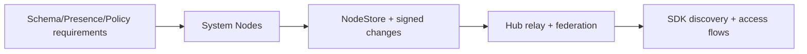
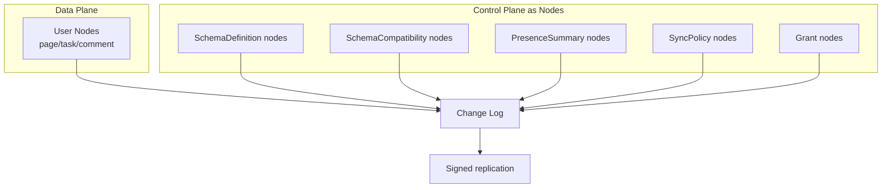
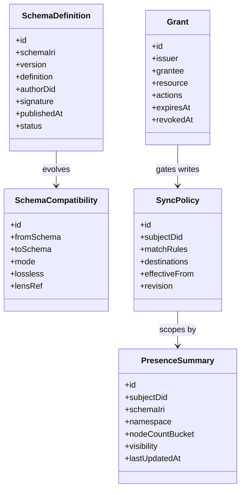
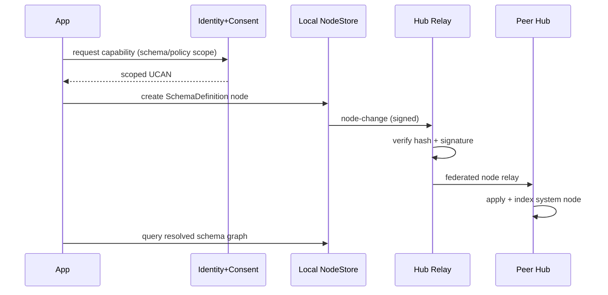
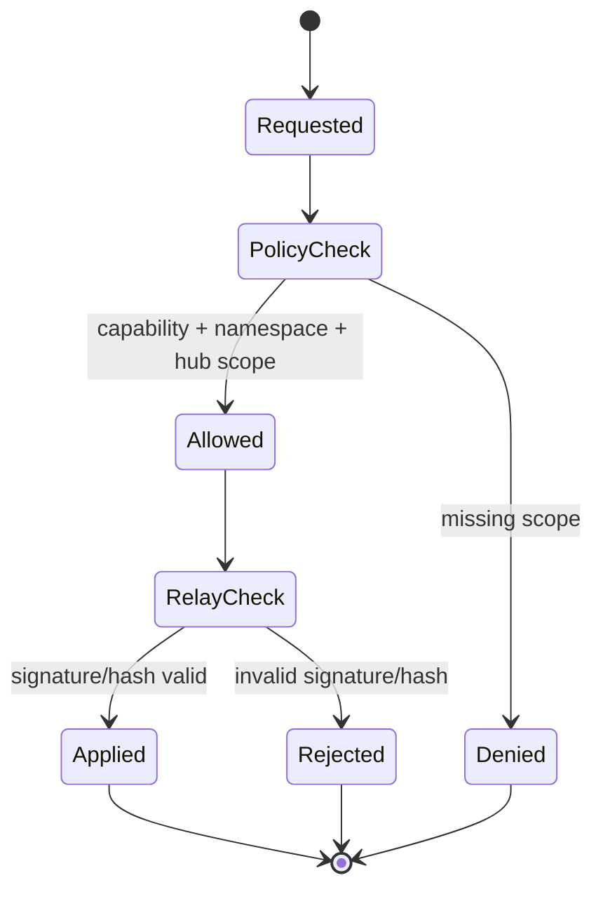
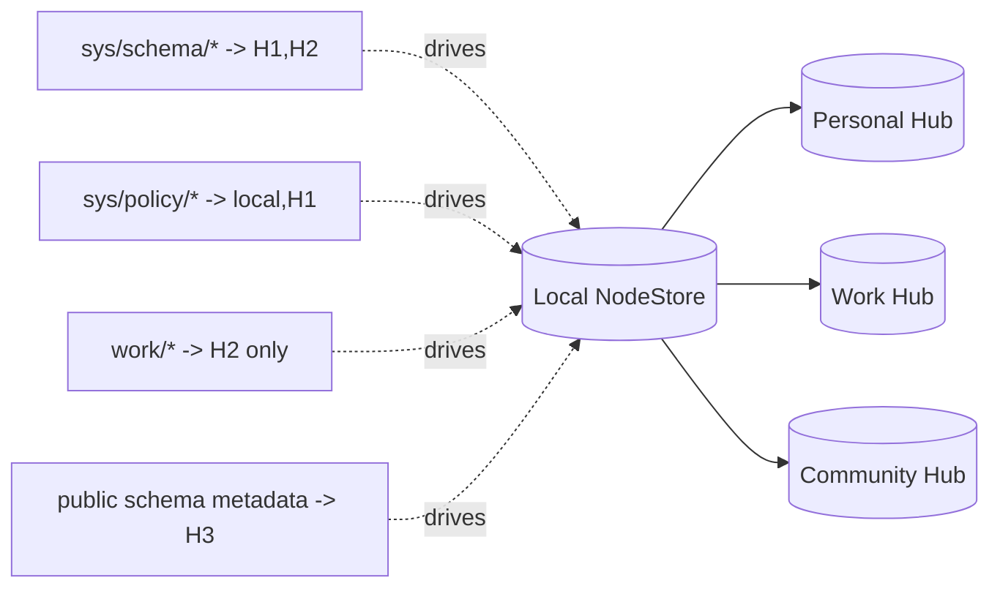
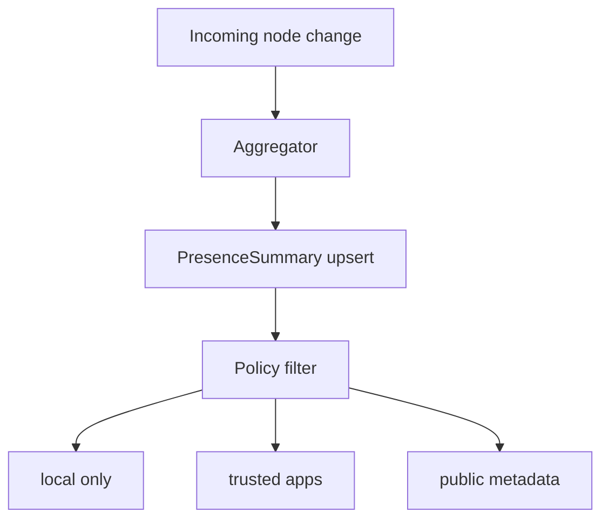
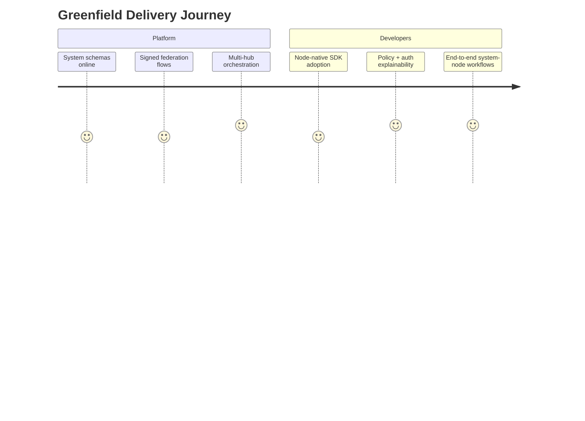
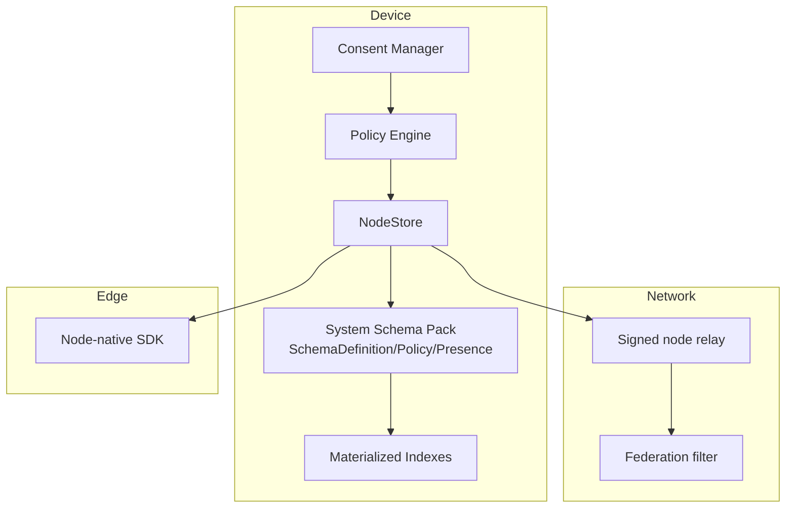

# 0093 - Node-Native Global Schema Federation Model

> **Status:** Exploration  
> **Tags:** schema, federation, node-store, event-log, ucan, authz, multi-hub, capability-security, local-first  
> **Created:** 2026-02-20  
> **Context:** Rewrite of `0091` for a greenfield implementation where nodes (signed changes + replication) are the canonical primitive for schema/system metadata exchange. Historical REST endpoint ideas are treated as non-existent for this design.

## Executive Take

xNet already has most of the primitives needed to implement a node-native schema federation control plane from day one:

1. **Canonical truth should be system nodes.** Schema definitions, grants, sync policy, and presence should be represented as typed nodes in reserved namespaces.
2. **Transport should reuse existing signed change replication.** `node-change` / `node-sync-request` channels already enforce signed, hash-verified change flow.
3. **Authorization should be node-native first.** Use `NodeStore.auth` (`can/grant/revoke/explain/listGrants`) as the primary policy engine; keep `hub/*` capability checks as transport boundary enforcement.
4. **Start pure node-native in v1.** SDK + sync/query channels operate directly on system nodes; optional projections can be added later only if needed.

If we do this, xNet gets one mental model for user data and control plane data: **everything is a node, validated by schema, replicated by policy, authorized by node-native policy + capability boundary checks.**

---

## What This Rewrites From 0091

`0091` identified the right missing pieces (presence index, scoped authz, policy engine, discovery).  
This rewrite keeps those goals, but assumes a greenfield build with no legacy endpoint constraints:

- Define system schemas + system namespaces first.
- Replicate all control-plane state through signed node changes.
- Keep authorization node-native (`store.auth`) with hub capability ingress guards.

---

## Codebase Evidence (Current Reality)

The current code already supports most of this move:

- Universal node model with schema IRIs and globally unique IDs in `packages/data/src/schema/node.ts`.
- Node event sourcing + LWW merge + signed changes in `packages/data/src/store/store.ts`.
- Runtime schema registry with remote resolver support in `packages/data/src/schema/registry.ts`.
- Hub already stores/replays serialized node changes in `packages/hub/src/storage/interface.ts`.
- Signed node relay path already exists (`node-change`, hash verification, signature verification) in `packages/hub/src/services/node-relay.ts`.
- Node-native auth APIs are already present in NodeStore (`store.auth.can/grant/revoke/explain/listGrants`) and enforced via `PermissionError` path in `packages/data/src/store/store.ts`.
- Capability checks already support resource wildcards/prefixes in `packages/hub/src/auth/capabilities.ts`.
- Hub server already processes query/index + node sync style WS messages in `packages/hub/src/server.ts`.
- Federation already has schema exposure filtering (`peer.schemas`, `expose.schemas`) in `packages/hub/src/services/federation.ts`.
- React provider is still single active signaling URL (`hubUrl ?? signalingServers?.[0]`) in `packages/react/src/context.ts:398`, so orchestration for multi-hub still needs first-class work.

Conclusion: this is a greenfield-ready design. The main work is **composition + modeling**, not inventing new primitives.

---

## Node-Native Control Plane Model

### Principle

All system metadata is expressed as nodes under reserved namespaces, then replicated via existing sync channels.

### Reserved system namespaces

- `xnet://did:key:<owner>/sys/schema/*`
- `xnet://did:key:<owner>/sys/presence/*`
- `xnet://did:key:<owner>/sys/policy/*`
- `xnet://did:key:<owner>/sys/authz/*`

These are conventions, not hardcoded authorities. They are validated by schema + capability policy.

---

## Proposed System Schemas

Define first-class schemas for control plane entities.

Note: `Grant` already maps to built-in schema patterns and grant indexing behavior in hub query service.

---

## Protocol Shape: System Nodes Over Signed Changes

### Node-native flows

- Publish schema: append `SchemaDefinition` node change
- Resolve schema: query local/replicated `SchemaDefinition` nodes by IRI/version
- Discover schemas: query `PresenceSummary` + visible `SchemaDefinition` nodes

---

## Authorization in a Node-Native World

Use **node authorization as the source of truth** for policy decisions, with hub capabilities as a second-layer boundary for relay/query transport.

### Native node authorization baseline

- Use `store.auth.can({ action, nodeId, patch })` before any local control-plane mutation.
- Use `store.auth.grant(...)` / `store.auth.revoke(...)` to manage delegations as first-class node-side policy operations.
- Use `store.auth.explain(...)` for auditable denial reasons and UX diagnostics.
- Persist grants as nodes (`Grant` schema) so authorization state itself is replicated and inspectable.

### Capability examples

- `can: hub/relay`, `with: xnet://did:key:alice/sys/schema/*`
- `can: hub/query`, `with: xnet://did:key:alice/sys/presence/*`
- `can: hub/relay`, `with: xnet://did:key:alice/work/*`

### Enforcement points

1. **Node layer (primary):** local create/update/delete checks via `store.auth.can` and policy evaluator.
2. **Hub layer (boundary):** relay/query checks via `hub/*` capability + resource scope for rooms/namespaces.
3. **Federation layer:** exposure filters for system schema namespaces and peer trust policy.

### Why we still need hub capability checks

Node authorization alone is not sufficient at network ingress because hubs must reject unauthorized transport operations _before_ applying changes (including malformed or hostile traffic). Hub capability checks remain necessary for:

- WebSocket relay and room join/signal authorization.
- Query-channel authorization on indexed/materialized data.
- Defense-in-depth when peers do not share identical local node policy state.

So the recommended stack is: **Node auth is canonical policy; hub capability is mandatory transport gate.**

---

## Multi-Hub Schema Federation Using Node Replication

Treat each hub as a selective replica target for both user nodes and system nodes.

Key design decision: **system nodes can have different replication classes** than user content.

---

## Presence Index as Derived System Nodes

In 0091, presence index was a missing primitive. In this rewrite, it becomes a node-native aggregation pipeline:

1. Observe NodeStore changes.
2. Incrementally aggregate by `schemaId`, namespace, policy visibility.
3. Emit/update `PresenceSummary` nodes (bucketed/noised as needed).
4. Replicate according to policy.

This keeps presence information inside the same signing, audit, and replication model.

---

## Greenfield Delivery Strategy

### Stage 0 - Core system schemas

- Implement `SchemaDefinition`, `SchemaCompatibility`, `PresenceSummary`, `SyncPolicy` schemas.
- Add namespace conventions and validation guards for `sys/*`.
- Wire node-native authorization for control-plane mutations.

### Stage 1 - Replication + discovery

- Replicate system nodes over signed node relay/federation channels.
- Build local materialized schema/presence indexes.
- Expose discovery/access through SDK-level node queries.

### Stage 2 - Multi-hub orchestration

- Add per-hub placement policies for both content and system namespaces.
- Add policy simulation and audit trails.
- Add reconciliation/repair flow for missed system-node replication.

---

## Risk Analysis

### Key risks

- **Schema poisoning:** malicious peers publish deceptive schema nodes.
- **Metadata leakage:** presence nodes expose sensitive activity signatures.
- **Policy drift:** multi-hub rules accidentally over-replicate system metadata.
- **Replay/duplication:** repeated system-node changes create inconsistent indexes.

### Mitigations

- Require signed `SchemaDefinition` and authority verification.
- Visibility levels + bucketed counts for presence nodes.
- Dry-run policy simulator before apply.
- CID/hash deduplication and monotonic lamport checks on replay.

---

## External Pattern Crosswalk (What To Borrow)

Web and standards review points to several useful patterns:

- **ActivityPub / ActivityStreams:** object-centric federation, globally unique identifiers, collection paging, and extension model via JSON-LD contexts.
- **DID Core:** DID/DID URL model for stable principal/resource addressing and verification methods.
- **UCAN specification:** attenuation, delegation chains, replay-prevention requirements, and capability-oriented auth in local-first systems.
- **Solid WAC:** resource-centric authorization inheritance and effective ACL evaluation concepts.
- **IPLD ecosystem:** node/link-first data modeling, content addressing, and schema-driven graph interoperability.
- **Matrix architecture:** event graph synchronization with eventual consistency and room-scoped federated replication.

What is unique for xNet: combine these patterns around **one universal node/change substrate** for both app data and control metadata.

---

## Recommended Architecture (Practical)

---

## Implementation Checklist

### Phase 1 - System Schemas and Namespaces

- [ ] Define schemas: `SchemaDefinition`, `SchemaCompatibility`, `PresenceSummary`, `SyncPolicy`.
- [ ] Reserve and document `sys/*` namespace conventions.
- [ ] Add validation + signature requirements for schema-definition nodes.
- [ ] Add schema authority verification rules (did/domain authority constraints).

### Phase 2 - Node-Native Schema Registry

- [ ] Build materialized schema index from system nodes.
- [ ] Wire `SchemaRegistry` remote resolver to node-backed index queries first.
- [ ] Add conflict handling policy for concurrent schema publications.

### Phase 3 - Presence + Policy as Nodes

- [ ] Implement local presence aggregation pipeline from NodeStore changes.
- [ ] Emit/update `PresenceSummary` nodes with privacy buckets.
- [ ] Model sync policy as `SyncPolicy` nodes with versioned revisions.
- [ ] Implement policy simulation report before activation.

### Phase 4 - AuthZ Tightening

- [ ] Wire all control-plane node mutations through `store.auth.can` (including patch-aware checks).
- [ ] Use `store.auth.grant/revoke` as canonical grant lifecycle API and persist grant nodes.
- [ ] Surface `store.auth.explain` traces in consent/debug tooling.
- [ ] Extend capability patterns for `sys/*` resources with prefix matching.
- [ ] Enforce scoped checks at local mutation, hub relay, and federation egress.
- [ ] Add explicit denial reasons (`missing_scope`, `policy_block`, `hub_not_allowed`).
- [ ] Add token replay cache checks and revocation propagation hooks.

### Phase 5 - Multi-Hub Orchestration

- [ ] Add first-class multi-hub sync orchestration in React/provider layer.
- [ ] Add per-hub destination planner for system and user namespaces.
- [ ] Add health-aware failover policy for non-critical replicas.
- [ ] Add reconciliation job to repair missed system-node replication.

### Phase 6 - Optional External Projection Adapters

- [ ] Define criteria for when projection adapters are needed.
- [ ] If needed, generate adapter reads from node-backed materialized indexes.
- [ ] Ensure adapters are strictly derived views (never canonical writes).
- [ ] Add conformance tests to guarantee adapter output matches node state.

---

## Validation Checklist

### Functional correctness

- [ ] Publishing a schema as node mutation makes it discoverable locally and remotely.
- [ ] Resolver returns correct version resolution from node-backed index.
- [ ] Presence summaries update incrementally under create/update/delete churn.
- [ ] Multi-hub policy routes system nodes to intended destinations only.

### Security and authorization

- [ ] Invalid schema signatures are rejected before indexing.
- [ ] Unauthorized `sys/*` mutations are denied by `store.auth.can` before local commit.
- [ ] Unauthorized relay/query attempts are denied by hub capability checks at ingress.
- [ ] Replay of previously seen system-node changes is rejected.
- [ ] Revoked grants remove effective write/query capability within one refresh window.

### Privacy and leakage control

- [ ] Presence summaries obey visibility class (`private`, `trusted-app`, `public-metadata`).
- [ ] Bucket/noise behavior prevents exact count leakage where configured.
- [ ] Federation exposure filters do not leak non-exposed system schemas.
- [ ] Audit log captures all exposure and denial decisions.

### Resilience

- [ ] Offline-first mutation path works for system nodes and replays cleanly on reconnect.
- [ ] Partitioned hubs converge on same schema-definition set after healing.
- [ ] Duplicate or out-of-order changes converge to deterministic state.
- [ ] Index rebuild from raw change log reproduces identical schema registry state.

### DX and UX

- [ ] SDK flow for access request + schema discovery is implementable quickly.
- [ ] Error surfaces distinguish auth denied vs schema unavailable vs policy blocked.
- [ ] Consent UX clearly shows data type, scope, destination, and duration.
- [ ] Developers can reason about one primitive: nodes for both data and control.

---

## Open Questions

1. Should schema authority be DID-only, domain-only, or mixed with signed linkage proofs?
2. Should `PresenceSummary` be exact locally but always bucketed remotely?
3. Do we need separate retention policies for control-plane nodes vs user-content nodes?
4. Should schema compatibility/lens metadata be bundled with schema nodes or separate nodes?
5. What is the minimum viable federation contract for third-party hubs that do not implement the full system-schema pack?

---

## Recommendations and Next Actions

1. **Start with node-backed schema registry index** (highest leverage).
2. **Add system schemas for presence + sync policy next** so control-plane data uses the same substrate.
3. **Ship node-native SDK discovery + access APIs early** so apps adopt one primitive from the start.
4. **Prioritize multi-hub orchestration in React/provider** to unlock practical policy-driven placement.
5. **Publish a short "one primitive" architecture note** for internal alignment: nodes are canonical.

---

## References

### Internal

- `docs/explorations/0091_[_]_GLOBAL_SCHEMA_FEDERATION_MODEL.md`
- `packages/data/src/schema/node.ts`
- `packages/data/src/schema/registry.ts`
- `packages/data/src/store/store.ts`
- `packages/hub/src/server.ts`
- `packages/hub/src/services/node-relay.ts`
- `packages/hub/src/auth/capabilities.ts`
- `packages/hub/src/services/federation.ts`
- `packages/hub/src/services/query.ts`
- `packages/react/src/context.ts`
- `docs/VISION.md`

### External

- https://www.w3.org/TR/activitystreams-core/
- https://www.w3.org/TR/activitypub/
- https://www.w3.org/TR/did-core/
- https://ucan.xyz/specification/
- https://solidproject.org/TR/wac
- https://ipld.io/docs/
- https://spec.matrix.org/latest/
