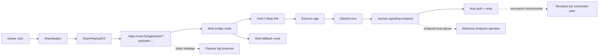
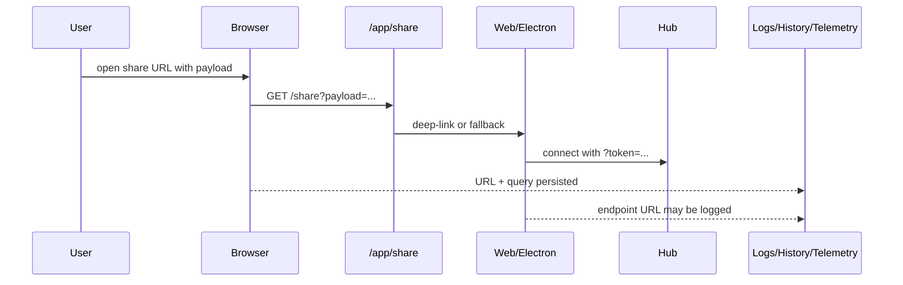
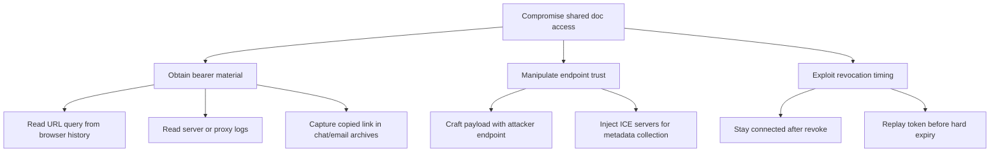
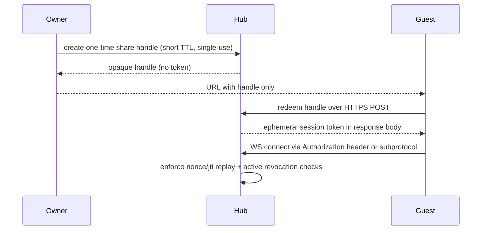
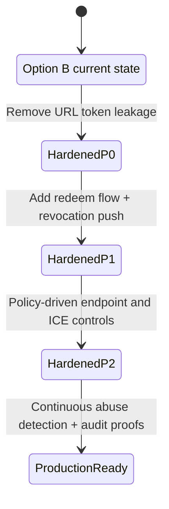

# 0094 - Cloudflare Option B Security Review and Hardening

> **Status:** Exploration  
> **Tags:** security, cloudflare, webrtc, authz, ucan, electron, web, threat-modeling  
> **Created:** 2026-02-22  
> **Context:** Security-focused review of `0092_[x]_CLOUDFLARE_OPTION_B_WEBRTC_AUTHZ_MINIMAL_UX.md`, with codebase and external reference validation.

## Executive Take

Option B is directionally strong, but the current implementation still carries several high-risk exposure paths that can bypass its intended trust model.

Most important finding: **the share token is currently treated like URL data, not secret material**. It appears in query strings and is forwarded through multiple hops, which creates avoidable leakage risk.

If we harden link handling, endpoint trust, and revocation enforcement, Option B can become a robust production-grade share system.

---

## Scope and Method

### Internal artifacts reviewed

- `docs/explorations/0092_[x]_CLOUDFLARE_OPTION_B_WEBRTC_AUTHZ_MINIMAL_UX.md`
- `apps/electron/src/renderer/lib/share-payload.ts`
- `apps/electron/src/renderer/components/ShareButton.tsx`
- `apps/electron/src/renderer/components/AddSharedDialog.tsx`
- `apps/web/src/routes/share.tsx`
- `apps/web/src/App.tsx`
- `apps/electron/src/data-process/data-service.ts`
- `packages/hub/src/auth/ucan.ts`
- `packages/hub/src/server.ts`
- `apps/electron/src/main/cloudflare-tunnel-manager.ts`

### External references reviewed

- Cloudflare Quick Tunnels docs (testing/dev intent, limits)
- Cloudflare Tunnel published protocol docs
- Cloudflare Realtime TURN docs (ports, limits, TLS)
- OWASP guidance on query-string information exposure
- Electron deep-link and security checklists
- MDN `Referrer-Policy` reference

---

## What 0092 Gets Right

- Correctly frames Cloudflare as transport, not trust boundary.
- Aligns auth decisions to capability checks plus grant index, not endpoint secrecy.
- Includes revocation concepts and explicit denial codes (`UNAUTHORIZED`, `TOKEN_EXPIRED`, `TOKEN_REVOKED`).
- Keeps fallback transport paths (WS + optional WebRTC) for resilience.
- Introduces useful UX transparency without overloading the user.

---

## Threat Model Snapshot

Primary attacker classes considered:

1. Passive observers (browser history, logs, analytics, support tooling).
2. Active endpoint attackers (malicious signaling server or injected endpoint).
3. Authz edge-case attackers (revoked peers, stale sessions, replayed links).

---

## Key Security Issues in Current Option B

## 1) Bearer token exposure through URLs (High)

The current flow repeatedly places secret-bearing material in URLs.

- Share links embed full payload in query (`/share?payload=...`).
- Web app decodes payload then appends `token` to endpoint query in `apps/web/src/App.tsx`.
- Utility process appends `token` as URL query in `apps/electron/src/data-process/data-service.ts` (`buildSignalingUrl`).
- Web fallback path preserves payload in URL (`apps/web/src/routes/share.tsx`).

Why this matters:

- Query values can leak to logs, browser history, crash reports, proxy telemetry, and copied URLs.
- OWASP explicitly classifies this as information exposure through query strings.

## 2) Untrusted endpoint acceptance from payload (High)

`SharePayloadV2.endpoint` is only checked as non-empty string; no origin trust policy is enforced.

Consequences:

- A crafted share link can direct clients to attacker-controlled signaling endpoints.
- This can cause metadata leakage, traffic analysis, and denial attempts.
- Signed update verification helps integrity but does not prevent all abuse (presence, metadata, room probing, performance pressure).

## 3) Security downgrade path via anonymous/fallback token (High)

In `ShareButton.tsx`, if auth is unavailable, code emits a fallback token (`anon-*`) and still presents a “secure link” flow.

Risk:

- Creates misleading trust semantics for users.
- If hub auth is off or misconfigured, capability guarantees are weakened materially.
- Accidental production exposure becomes plausible through “temporary success” paths.

## 4) Revocation enforcement gap for already-connected sessions (Medium-High)

`packages/hub/src/server.ts` enforces auth on subscribe and on selected message types. However, there is no obvious periodic re-auth or server-side forced disconnect for all revoked active sessions.

Risk:

- Revoked peers may retain room presence longer than intended.
- “Kick revoked peers” appears as design intent in 0092, but server-side guarantees need stronger proof/coverage.

## 5) ICE server injection from share payload (Medium)

`transportHints.iceServers` is accepted from payload and can be passed to WebRTC provider.

Risk:

- Attackers can force connectivity through adversarial STUN/TURN infra.
- Peer IP metadata and connection patterns may be exposed to third-party TURN/STUN operators.

## 6) Mixed security transport allowances (Medium)

There are still defaults/fallbacks using `ws://localhost:4444` and transformations from `http` to `ws`.

Risk:

- In non-local contexts, accidental non-TLS transports can be introduced.
- Security posture becomes environment-dependent in ways users cannot verify.

## 7) Tunnel endpoint parsing trust is broad (Low-Medium)

`cloudflare-tunnel-manager.ts` endpoint extraction regex is broad and can accept many host patterns.

Risk:

- If log stream is polluted, endpoint assignment may be confused.
- Low probability but easy to harden.

---

## Attack Tree

---

## Recommended Hardening Architecture

## Design goals

- Treat all share links as **bearer credentials**.
- Minimize credential lifetime and replay value.
- Remove credentials from URLs and untrusted logs.
- Bind endpoint trust to policy, not payload.

## Proposed secure flow

Core change: switch from “token in URL payload” to “opaque handle + redemption”.

---

## Prioritized Actions

## P0 (Immediate)

- Remove token-bearing query strings from all share and connect flows.
- Enforce `https/wss` only for non-local endpoints.
- Block “anonymous secure share” mode in production builds.
- Add strict endpoint allowlist / trust policy (`xnet.fyi`, configured enterprise domains, optional explicit user-consent override).

## P1 (Near-term)

- Add one-time redeemable share handles (`jti`, nonce, single-use, very short TTL).
- Move WS auth to `Authorization` header or negotiated subprotocol token, not URL query.
- Enforce server-side session revocation push: immediate disconnect on grant revocation.
- Ignore payload-provided ICE servers by default; only permit policy-approved TURN/STUN entries.

## P2 (Defense in depth)

- Add risk-based eventing: suspicious endpoint domain, repeated redeem attempts, replay detection.
- Add web bridge privacy headers and route hygiene (`Cache-Control: no-store`, strict `Referrer-Policy`, no indexing).
- Add “sensitivity UI” copy: links are equivalent to temporary credentials.

---

## Implementation Checklist

## Link and token handling

- [x] Replace `payload`-embedded token with opaque share handle.
- [x] Add redeem endpoint that returns ephemeral auth material via response body only.
- [x] Remove `token` from WebSocket query construction.
- [x] Strip payload/handle from browser URL immediately after parse (`replaceState`) on all routes.
- [x] Set `Cache-Control: no-store` and explicit `Referrer-Policy: no-referrer` on share bridge responses.

## Endpoint trust

- [x] Add strict endpoint validator in share payload parser (scheme, host policy, optional pinning).
- [x] Reject non-`wss` endpoints unless explicit localhost dev mode.
- [x] Add signed endpoint claims in token/handle redemption to prevent endpoint substitution.

## Auth and revocation

- [x] Add token replay prevention (`jti` + nonce cache + short expiry).
- [x] Add active-session revocation hook to disconnect revoked peers immediately.
- [x] Re-auth check at key message boundaries and on periodic heartbeat.
- [x] Remove/disable anonymous fallback token mode outside test/dev.

## WebRTC hardening

- [x] Ignore untrusted `iceServers` from inbound links by default.
- [x] Allow only approved TURN/STUN pools from local policy.
- [x] Prefer TURN over TLS where relay is required.
- [x] Log and surface when peer path uses unapproved ICE infra.

## Tunnel process hardening

- [x] Tighten tunnel endpoint parsing to expected Cloudflare host patterns only.
- [x] Pin cloudflared binary path/signature where feasible.
- [x] Add explicit tunnel mode labels in UI: test-only vs production-safe.

---

## Validation Checklist

## Security tests

- [ ] Verify no token appears in browser address bar, history, logs, analytics, or crash reports.
- [x] Verify WS auth rejects query-token attempts once migrated.
- [x] Verify replayed share handle/token fails with deterministic error.
- [ ] Verify revoked grants cause immediate connection termination for active sessions.
- [x] Verify malformed or untrusted endpoint in payload is rejected before network dial.
- [x] Verify injected ICE servers in payload are ignored unless allowlisted.

## Abuse and adversarial tests

- [x] Fuzz payload decoder for oversized/malformed fields.
- [x] Attempt downgrade to `ws://` in production config and confirm hard failure.
- [ ] Simulate malicious signaling endpoint and validate no secret leakage in handshake/logs.
- [ ] Simulate Cloudflare quick tunnel instability under load and confirm safe failure modes.

## UX and operability tests

- [ ] Confirm secure-share UX still works in <=2 clicks after hardening.
- [x] Confirm error copy is actionable for expired, replayed, revoked, or untrusted links.
- [ ] Confirm support/debug flows do not require exposing secret-bearing URLs.

---

## Security Maturity Roadmap

---

## Final Recommendation

Proceed with Option B, but treat the current state as **pre-hardening** rather than fully secure.

The architecture is salvageable and strong once these changes are made:

1. Remove bearer secrets from URLs.
2. Enforce endpoint trust policy independent of payload input.
3. Upgrade revocation from eventual to immediate for active sessions.
4. Lock WebRTC ICE config to trusted infrastructure.

With those four shifts, Option B can be both minimal UX and high-confidence security.

---

## References

### Internal

- `docs/explorations/0092_[x]_CLOUDFLARE_OPTION_B_WEBRTC_AUTHZ_MINIMAL_UX.md`
- `apps/electron/src/renderer/lib/share-payload.ts`
- `apps/electron/src/renderer/components/ShareButton.tsx`
- `apps/web/src/routes/share.tsx`
- `apps/web/src/App.tsx`
- `apps/electron/src/data-process/data-service.ts`
- `packages/hub/src/auth/ucan.ts`
- `packages/hub/src/server.ts`
- `apps/electron/src/main/cloudflare-tunnel-manager.ts`

### External

- https://developers.cloudflare.com/cloudflare-one/networks/connectors/cloudflare-tunnel/do-more-with-tunnels/trycloudflare/
- https://developers.cloudflare.com/cloudflare-one/networks/connectors/cloudflare-tunnel/routing-to-tunnel/protocols/
- https://developers.cloudflare.com/realtime/turn/
- https://owasp.org/www-community/vulnerabilities/Information_exposure_through_query_strings_in_url
- https://www.electronjs.org/docs/latest/tutorial/launch-app-from-url-in-another-app
- https://www.electronjs.org/docs/latest/tutorial/security
- https://developer.mozilla.org/en-US/docs/Web/HTTP/Headers/Referrer-Policy
