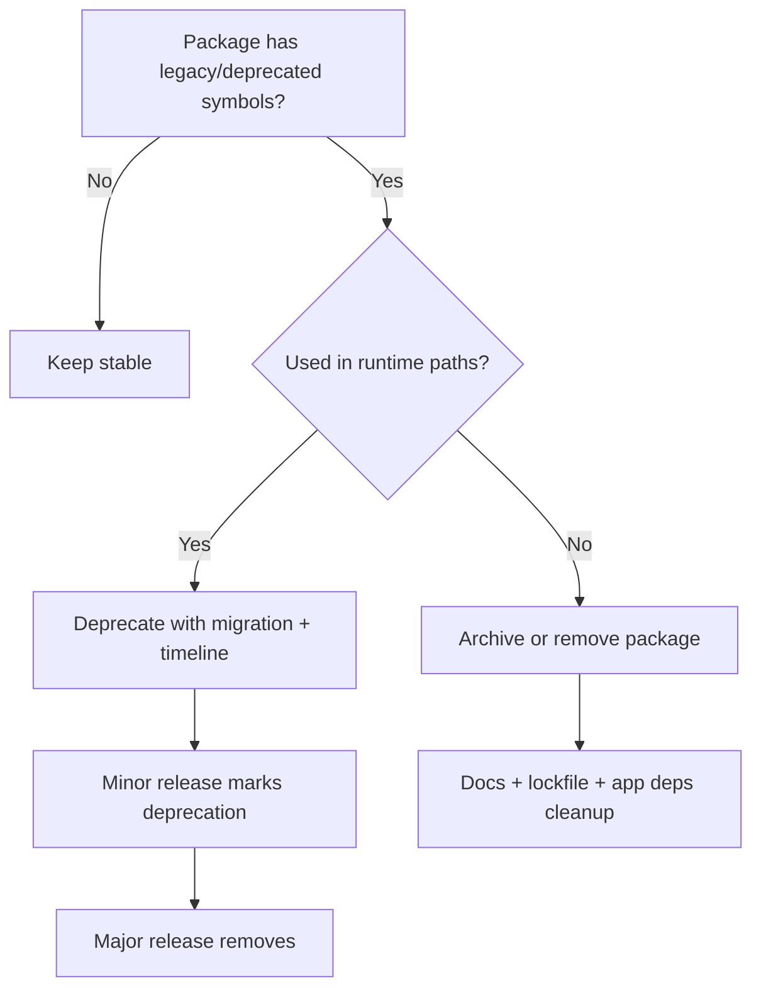
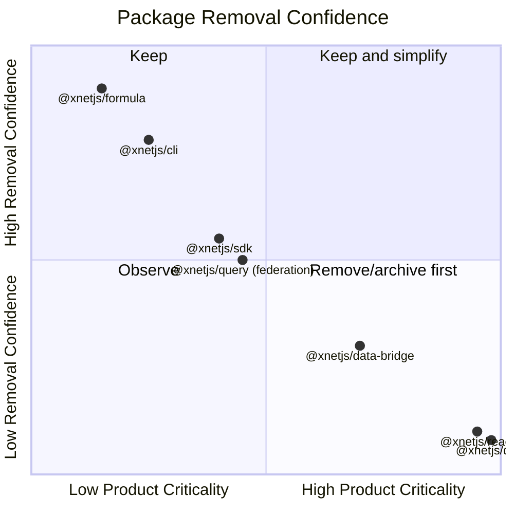
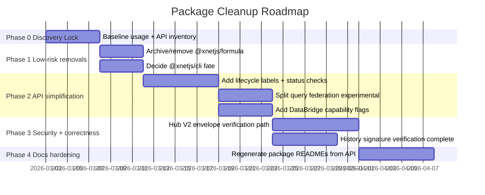

# 0095 [ _ ] Package Portfolio Cleanup and API Simplification

Date: 2026-03-01
Author: OpenCode
Status: Draft exploration

## Executive Take

xNet has strong package modularity, but the package portfolio currently mixes:

- actively used runtime packages,
- migration/legacy compatibility layers,
- partially implemented forward-looking APIs,
- and packages with near-zero in-repo usage.

The biggest clarity and maintenance wins now are:

1. make package lifecycle status explicit (`stable` / `experimental` / `deprecated`),
2. remove or archive demonstrably unused packages (`@xnetjs/formula` likely first),
3. simplify APIs that currently imply capabilities not actually implemented,
4. tighten docs around _current_ behavior and intentional boundaries.

## Scope and Method

This exploration reviewed all `packages/*` and cross-checked with app usage and docs.

### Codebase evidence used

- Package inventory and dependencies from `packages/*/package.json`
- Reverse dependency and rough source-size scans across `packages/*/src`
- Runtime usage checks in `apps/*`
- Dead/legacy/deprecation indicators from grep for `@deprecated`, `legacy`, `TODO`, `not implemented`

### Selected high-signal findings (code refs)

- Remote federation is not implemented in query router: `packages/query/src/federation/router.ts:43`
- NativeBridge document editing intentionally unimplemented: `packages/data-bridge/src/native-bridge.ts:239`
- Hub relay still verifies only V1 envelopes and skips V2 crypto verification: `packages/hub/src/services/relay.ts:239`
- History verification currently does not verify signatures end-to-end: `packages/history/src/verification.ts:63`
- Identity exports both legacy and new key systems in one top-level entry: `packages/identity/src/index.ts:20`
- Data auth mode still carries legacy behavior path: `packages/data/src/auth/mode.ts:7`
- React MetaBridge keeps deprecated alias for compatibility: `packages/react/src/sync/meta-bridge.ts:43`
- Core still exports deprecated alias (`Capability`): `packages/core/src/auth-types.ts:33`

### External guidance consulted

- SemVer 2.0.0 (`https://semver.org/`) for deprecation/removal versioning discipline
- npm deprecation guidance (`https://docs.npmjs.com/deprecating-and-undeprecating-packages-or-package-versions`) favoring deprecate-over-delete
- TypeScript JSDoc `@deprecated` behavior (`https://www.typescriptlang.org/docs/handbook/jsdoc-supported-types.html#deprecated`)
- Strangler Fig modernization framing (`https://martinfowler.com/bliki/StranglerFigApplication.html`)

---

## Portfolio Overview

```mermaid
flowchart LR
  subgraph Foundation
    core[@xnetjs/core]
    crypto[@xnetjs/crypto]
    identity[@xnetjs/identity]
    sqlite[@xnetjs/sqlite]
    storage[@xnetjs/storage]
    sync[@xnetjs/sync]
    data[@xnetjs/data]
  end

  subgraph Runtime
    react[@xnetjs/react]
    editor[@xnetjs/editor]
    canvas[@xnetjs/canvas]
    views[@xnetjs/views]
    ui[@xnetjs/ui]
    devtools[@xnetjs/devtools]
    plugins[@xnetjs/plugins]
    hub[@xnetjs/hub]
    network[@xnetjs/network]
  end

  subgraph Optional_or_Thin
    sdk[@xnetjs/sdk]
    query[@xnetjs/query]
    databridge[@xnetjs/data-bridge]
    cli[@xnetjs/cli]
    formula[@xnetjs/formula]
    telemetry[@xnetjs/telemetry]
    history[@xnetjs/history]
    vectors[@xnetjs/vectors]
  end

  core-->crypto-->identity-->sync-->data-->react
  sqlite-->storage-->data
  data-->editor
  data-->views
  data-->canvas
  react-->views
  react-->canvas
  react-->devtools
  data-->hub
  data-->network
  data-->query
  query-->sdk
  data-->sdk
  data-->databridge-->react
```

## Dead/Deprecated Signal Map



## Key Findings by Theme

### 1) Packages likely removable or archivable

#### `@xnetjs/formula` — strongest removal candidate

Evidence:

- No in-repo TypeScript imports outside the package itself (only self-doc/examples)
- Zero app/runtime references in `apps/*`
- Internal reverse deps: 0

Assessment:

- If no near-term product commitment exists, this is high-confidence archive/remove material.

Recommendation:

- Move to `packages-archive/formula` (or remove) with explicit changelog note.

#### `@xnetjs/cli` — likely tooling-only, currently isolated

Evidence:

- No app/runtime imports
- No package imports from other packages
- Mainly referenced in docs and one CI workflow (`.github/workflows/schema-check.yml`)

Assessment:

- Keep only if schema-diff CLI is a committed DX surface; otherwise archive or move under `/tools`.

Recommendation:

- Decide strategic intent: productized CLI vs internal tool.

#### `@xnetjs/sdk` — currently very thin and minimally used internally

Evidence:

- In-repo TS usage is minimal (appears effectively unused by app source logic)
- Apps depend directly on `@xnetjs/react`, `@xnetjs/data`, etc.

Assessment:

- Either promote SDK as _the_ canonical app-facing surface, or de-emphasize and shrink it.

Recommendation:

- Short term: remove unused app dependency declarations if not used.
- Mid term: choose one strategy:
  - keep SDK as curated stable façade, or
  - freeze SDK and push direct-package integration.

### 2) APIs that overpromise current capability

#### `@xnetjs/query` federation API

- `createFederatedQueryRouter` exposes remote route semantics but currently throws for remote path.
- Code: `packages/query/src/federation/router.ts:43`

Recommendation:

- Split API into explicit modes:
  - `createLocalQueryRouter` (stable)
  - `createFederatedQueryRouterExperimental` (feature-flagged)

#### `@xnetjs/data-bridge` NativeBridge docs vs capability

- `acquireDoc` in NativeBridge is intentionally unimplemented.
- Code: `packages/data-bridge/src/native-bridge.ts:239`

Recommendation:

- Introduce `bridge.capabilities = { ydoc: boolean, subscriptions: boolean, ... }`.
- Avoid exposing methods as universally available when implementation is partial.

### 3) Legacy compatibility burden concentrated in hot paths

#### Sync + Hub protocol compatibility

- Sync package still carries V1 + V2 envelope/attestation paths.
- Hub relay verifies only V1 and accepts V2 without crypto verification.
- Code: `packages/hub/src/services/relay.ts:239`

Risk:

- Ambiguous trust posture and operator confusion.

Recommendation:

- Define an explicit compatibility window and sunset plan for V1.
- Move to async verification in relay for V2 before declaring V2-first.

#### History verification scope gap

- Signature verification path currently increments counters without actual cryptographic verification.
- Code: `packages/history/src/verification.ts:63`

Recommendation:

- Rename current behavior to `integrityCheck` or complete the signature verification implementation.

### 4) Top-level API clarity drift

#### `@xnetjs/identity`

- Exports both legacy key bundle APIs and new hybrid bundle APIs together.
- Code: `packages/identity/src/index.ts:20`

Recommendation:

- Create explicit subpaths:
  - `@xnetjs/identity/legacy`
  - `@xnetjs/identity/hybrid`
  - `@xnetjs/identity/passkey`
- Keep top-level exports minimal and opinionated.

#### `@xnetjs/react` and `@xnetjs/ui`

- Very large top-level export surfaces increase discoverability cost and upgrade risk.

Recommendation:

- Provide smaller curated entrypoints (`/core`, `/experimental`, `/internal`).

---

## Can Any Packages Be Outright Removed?



### Recommended disposition

- `@xnetjs/formula`: **Archive/remove candidate now**
- `@xnetjs/cli`: **Move to internal tooling or archive**, unless productized CLI is imminent
- `@xnetjs/sdk`: **Do not remove yet**, but either harden as primary façade or slim/freeze
- `@xnetjs/query`: **Keep local engine**, split out federated experimental path
- Core runtime packages (`data`, `react`, `sync`, `identity`, `storage`, `sqlite`, `ui`, `editor`, `canvas`, `views`): **retain**

---

## API Simplification Proposals

## A) Lifecycle labeling for every exported API

Add `@status stable|experimental|deprecated|internal` tags and enforce in docs generation.

Example statuses:

- `stable`: safe for external consumers
- `experimental`: no compatibility guarantees
- `deprecated`: migration target must be specified
- `internal`: not part of public contract

## B) Entry-point restructuring

```mermaid
flowchart LR
  Old[Single index.ts with mixed exports] --> New1[@xnetjs/pkg/core]
  Old --> New2[@xnetjs/pkg/experimental]
  Old --> New3[@xnetjs/pkg/legacy]
  Old --> New4[@xnetjs/pkg/internal]
```

Benefits:

- lower accidental coupling,
- easier tree-shaking,
- clearer upgrade policy,
- cleaner READMEs.

## C) Contract-first docs

For each package README, keep a fixed concise structure:

1. What problem this package solves (2-3 bullets)
2. Stable API surface (quick table)
3. Non-stable APIs (explicitly marked)
4. Minimal copy/paste examples that compile today
5. Migration notes (if applicable)

## D) Remove ambiguous naming where behavior is partial

- Rename methods whose current implementation is only partial (e.g., verification that is not full signature verification)
- Avoid “federated” or “native” claims without capability flags and status labels

---

## Cleanup Plan (Strangler-style)



---

## Implementation Checklist

- [ ] Confirm product intent for `@xnetjs/formula`, `@xnetjs/cli`, `@xnetjs/sdk`
- [ ] Create package lifecycle matrix in `packages/README.md`
- [ ] Add `@status` tags to top-level exported symbols in each `src/index.ts`
- [ ] Introduce explicit `experimental` entrypoints for partial features
- [ ] Split `@xnetjs/query` local vs federated APIs
- [ ] Add `DataBridge` capability introspection (`bridge.capabilities`)
- [ ] Implement or rename incomplete verification flows in `@xnetjs/history`
- [ ] Add V2 verification path in hub relay before claiming V2 security parity
- [ ] Archive/remove `@xnetjs/formula` if approved
- [ ] Move `@xnetjs/cli` to `/tools` or archive if approved
- [ ] Remove unused app package deps (e.g., SDK where not imported)
- [ ] Update all package READMEs with stable/experimental/deprecated sections

## Validation Checklist

- [ ] `pnpm build` passes after package moves/splits
- [ ] `pnpm typecheck` passes with no new public API type regressions
- [ ] `pnpm test` passes globally
- [ ] App smoke runs still boot (`apps/electron`, `apps/web`, `apps/expo`)
- [ ] No import paths point to archived/removed packages
- [ ] Deprecation warnings appear where expected and include migration target
- [ ] Docs and code examples compile against current exports
- [ ] Security verification tests cover V1/V2 and relay behavior
- [ ] Bundle size/regression checks for apps after dependency cleanup

---

## Concrete Next Actions (Recommended Order)

1. Decide package fate for `@xnetjs/formula` and `@xnetjs/cli` this week.
2. Land lifecycle/status framework (`stable`/`experimental`/`deprecated`) across package exports.
3. Split and label partial APIs (`query` federation, `data-bridge` native doc editing).
4. Close correctness/security gaps (hub V2 verification, history signature verification).
5. Regenerate concise package docs from exported API metadata.

If executed in this order, xNet can reduce portfolio ambiguity quickly while keeping risk low and developer velocity high.
